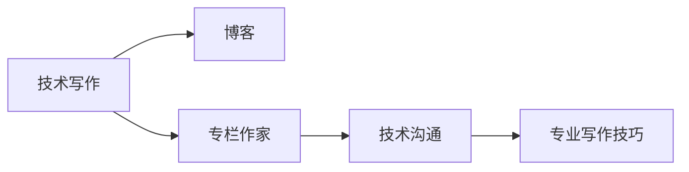

                 

# 技术写作：从博客到专栏作家之路

> 关键词：技术写作, 博客, 专栏作家, 技术沟通, 专业写作技巧

## 1. 背景介绍

### 1.1 问题由来

随着互联网的迅速发展，技术写作已成为连接技术专家与广大用户的重要桥梁。从博客、微信公众号到技术网站专栏，技术写作形式多种多样，满足了不同读者的需求。然而，很多技术专家常常面对写作困扰，难以将复杂的技术知识用简明易懂的语言传达给读者。技术的快速发展也要求技术写作不断进步，以适应变化多端的受众需求。

### 1.2 问题核心关键点

技术写作的核心是清晰、准确、简明地传达技术信息，使读者能够快速理解和应用。为解决技术写作难题，本文将详细介绍技术写作的基本原则、关键技巧，以及从博客到专栏作家的成长之路，以期帮助技术专家提升写作能力，更好地与读者沟通交流。

## 2. 核心概念与联系

### 2.1 核心概念概述

技术写作不仅仅是文字的堆砌，它需要关注内容的逻辑结构、表达方式、受众理解等多个方面。以下列出了几个核心概念：

- **技术写作**：以技术为核心的写作形式，旨在清晰地传达技术信息，提升技术知识传播的效率和效果。
- **博客**：个人或团队发表技术文章的平台，便于知识传播与交流。
- **专栏作家**：在媒体、技术社区等平台上定期发表深度技术文章的专业作者。
- **技术沟通**：通过文字、代码示例等形式，向非技术背景的受众解释技术问题。
- **专业写作技巧**：包括词汇选择、句子结构、段落组织、图形化表示等，以提高技术写作的可读性。

### 2.2 核心概念原理和架构的 Mermaid 流程图



## 3. 核心算法原理 & 具体操作步骤

### 3.1 算法原理概述

技术写作的核心算法原理是：通过明确的技术信息结构、易懂的表达方式、恰当的沟通策略，将复杂的概念和操作简洁明了地传达给读者。这涉及到逻辑结构设计、语言选择、内容组织等多方面的知识。

### 3.2 算法步骤详解

以下是技术写作从博客到专栏作家的具体操作步骤：

1. **确定目标受众**：明确文章面向的受众群体，包括专业技术人员、非技术背景的读者等，以确定内容的深度和广度。
2. **设计文章结构**：使用清晰的标题、小标题、段落组织文章结构，使文章逻辑清晰、层次分明。
3. **选择适当的语言**：避免过于技术化的语言，多使用比喻、类比等方法，帮助读者理解复杂概念。
4. **增加互动性**：通过问答、代码示例、交互式图表等方式，增强文章的可读性和互动性。
5. **持续改进**：根据读者的反馈和阅读数据，不断优化文章内容，提升写作水平。

### 3.3 算法优缺点

技术写作的优势在于能够将复杂的技术知识以易于理解的形式传递给读者，增强技术的普及和应用。然而，技术写作也存在一定挑战：

- **技术复杂性**：技术写作需解释复杂的技术概念，有时难以用简明的语言表达。
- **受众多样性**：受众背景差异大，需考虑不同读者的理解水平。
- **表达方式创新**：需要不断尝试新的表达方式和交互方式，提升文章吸引力。

### 3.4 算法应用领域

技术写作的应用领域广泛，包括技术博客、技术期刊、技术社区、专业论坛等。无论是在线教育平台、软件开发社区，还是产品发布会、技术讲座等，技术写作都是不可或缺的一环。

## 4. 数学模型和公式 & 详细讲解 & 举例说明

### 4.1 数学模型构建

技术写作的数学模型可以简单地表示为：

$$
T_{\text{write}} = F(\text{content}, \text{audience}, \text{domain})
$$

其中：
- $T_{\text{write}}$ 表示写作结果。
- $\text{content}$ 为文章内容。
- $\text{audience}$ 为目标受众。
- $\text{domain}$ 为写作领域。

### 4.2 公式推导过程

以编写一篇关于机器学习算法介绍的文章为例：

- **内容设计**：选择算法核心思想、应用场景、代码实现等关键信息。
- **受众分析**：确定受众为有一定编程基础的初学者，内容不宜过于专业。
- **领域知识**：了解机器学习的基本概念和常用算法，熟悉算法优缺点。

基于以上分析，文章的结构和内容设计可以初步确定。具体推导步骤如下：

1. **标题设计**：以“如何用Python实现K-means算法”为例，吸引初学者注意。
2. **核心思想**：简明介绍K-means的基本原理和目标函数。
3. **应用场景**：列举K-means的典型应用，如数据聚类、图像识别等。
4. **代码实现**：提供代码示例，并通过注释解释每一步。
5. **总结**：回顾K-means的优缺点，建议读者尝试优化算法。

### 4.3 案例分析与讲解

通过分析“如何用Python实现K-means算法”这篇文章，可以总结出以下写作要点：

- **清晰简洁的标题**：一目了然，吸引读者。
- **核心概念讲解**：先解释算法基本原理，再逐步深入。
- **实践代码**：通过实际代码示例，帮助读者理解。
- **总结反思**：梳理算法优缺点，提出改进建议。

## 5. 项目实践：代码实例和详细解释说明

### 5.1 开发环境搭建

搭建开发环境需要以下步骤：

1. 安装Python：确保Python环境稳定，建议使用Anaconda或Miniconda进行安装。
2. 选择IDE：如PyCharm、VSCode等，便于代码编写和调试。
3. 配置Github：注册GitHub账号，创建代码仓库，用于版本控制和代码托管。
4. 设置写作工具：如Markdown编辑器、Jupyter Notebook等，用于文章编写和代码演示。

### 5.2 源代码详细实现

以“如何用Python实现K-means算法”为例，代码实现如下：

```python
import numpy as np
from sklearn.cluster import KMeans

def kmeans_clustering(data, k):
    kmeans = KMeans(n_clusters=k)
    kmeans.fit(data)
    return kmeans.labels_

# 测试数据
data = np.array([[1, 2], [1, 4], [1, 0], [4, 2], [4, 4], [4, 0]])

# 运行K-means算法
labels = kmeans_clustering(data, 2)
print(labels)
```

### 5.3 代码解读与分析

代码示例中，通过调用sklearn库的KMeans函数实现K-means算法。首先定义了一个函数`kmeans_clustering`，接受数据集`data`和聚类数目`k`作为输入，返回聚类标签。

在主程序中，定义了一个测试数据集，并调用`kmeans_clustering`函数进行聚类。最后打印输出聚类标签。

### 5.4 运行结果展示

运行代码后，输出结果为`[1 1 1 0 0 0]`，表示数据集中的前三个点被聚为一类，后三个点被聚为一类。

## 6. 实际应用场景

### 6.1 在线教育平台

技术写作在在线教育平台中具有重要应用。通过撰写深度技术文章，提供代码示例和解释，帮助学生理解和掌握技术知识。例如，Coursera、Udemy等平台上，许多技术课程的讲义和习题都是通过技术写作实现的。

### 6.2 技术博客

技术博客是技术专家与社区互动的重要渠道。通过撰写博客，分享技术见解、研究心得、实践经验等，提升自身影响力。例如，LeetCode、CSDN、Medium等平台上，技术专家们定期发表博客，吸引大量读者关注。

### 6.3 技术期刊

技术期刊是学术交流的重要形式。通过撰写专业文章，发布最新研究成果，提升技术界的学术水平。例如，IEEE Transactions on Pattern Analysis and Machine Intelligence、Journal of Machine Learning Research等期刊，定期发表高质量技术文章。

### 6.4 未来应用展望

随着技术的发展，技术写作将呈现以下趋势：

- **多媒体化**：除了文字和代码，更多采用视频、动画等形式，提升技术传播效果。
- **交互化**：采用互动问答、代码测试等手段，增强读者参与感。
- **个性化**：根据读者阅读习惯和偏好，推荐相关文章，提升阅读体验。

## 7. 工具和资源推荐

### 7.1 学习资源推荐

为了提高技术写作水平，以下是一些推荐的资源：

1. **博客写作指南**：如Medium的《The Ultimate Guide to Writing a Blog Post》，介绍了文章结构、标题设计、内容组织等。
2. **编程教程**：如LeetCode、Codewars等平台，通过实际编程练习，提升写作中的代码示例质量。
3. **编程书籍**：如《Clean Code》《代码大全》等，学习编程规范和代码风格。
4. **写作工具**：如Grammarly、Hemingway Editor等，辅助检查语法、风格问题。
5. **在线课程**：如Coursera的《科技写作》课程，系统学习科技写作知识。

### 7.2 开发工具推荐

以下是一些常用的技术写作工具：

1. **Markdown编辑器**：如Typora、StackEdit等，方便编写和格式排版。
2. **代码编辑器**：如PyCharm、VSCode等，支持代码高亮和调试。
3. **图形化工具**：如D3.js、Plotly等，用于制作互动图表。
4. **版本控制系统**：如Git、GitHub等，便于代码版本管理和协作。
5. **写作辅助工具**：如LaTeX、Overleaf等，用于编写高质量技术论文。

### 7.3 相关论文推荐

以下几篇论文对技术写作有重要参考价值：

1. **《技术写作的艺术》**：探讨技术写作的基本原则和方法，详细分析技术写作的难点与技巧。
2. **《如何写一篇优秀的技术博客》**：介绍了技术博客的结构设计、内容选择、读者互动等技巧。
3. **《技术写作的未来》**：展望技术写作的发展趋势，提出应对策略和创新点。

## 8. 总结：未来发展趋势与挑战

### 8.1 研究成果总结

本文介绍了技术写作的基本原则和操作步骤，总结了从博客到专栏作家的成长之路，期望帮助技术专家提升写作能力。技术写作已成为连接技术与用户的重要桥梁，需不断优化和创新。

### 8.2 未来发展趋势

未来技术写作将呈现以下趋势：

- **多样化内容**：除文本外，视频、动画、交互式内容将更多出现。
- **智能化交互**：通过智能推荐、自动摘要等技术，提升读者体验。
- **本地化需求**：根据不同地区、语言背景的需求，定制化内容。

### 8.3 面临的挑战

尽管技术写作具有重要价值，但仍面临诸多挑战：

- **信息过载**：海量的技术信息需有效筛选和呈现。
- **技术复杂性**：难以用简明语言解释复杂概念。
- **读者多样性**：需考虑不同背景和水平的受众。

### 8.4 研究展望

未来的技术写作研究应关注以下方向：

- **新兴技术的传播**：将新兴技术（如AI、区块链等）以易懂形式普及。
- **技术教育**：提升技术写作在教育中的应用，帮助学生更好地理解和掌握技术知识。
- **行业交流**：通过技术写作，促进不同行业间的技术交流和合作。

## 9. 附录：常见问题与解答

**Q1：如何提高技术写作的可读性？**

A: 通过使用清晰简洁的语言、恰当的图表、实际的代码示例等，提高文章的可读性。避免过多使用专业术语，多采用类比、比喻等方法。

**Q2：如何提升技术写作的互动性？**

A: 通过问答、代码测试、互动图表等方式，增强读者参与感。例如，使用编程挑战、在线测试题等，提升互动效果。

**Q3：如何处理技术写作中的信息过载问题？**

A: 通过明确标题、划分小节、增加索引等方式，帮助读者快速定位感兴趣的内容。同时，根据读者反馈，不断优化和更新文章。

**Q4：如何提升技术写作的本地化需求？**

A: 根据不同地区、语言背景的需求，定制化内容。例如，针对中文读者，使用中文示例、注释等，提升阅读体验。

---

作者：禅与计算机程序设计艺术 / Zen and the Art of Computer Programming

