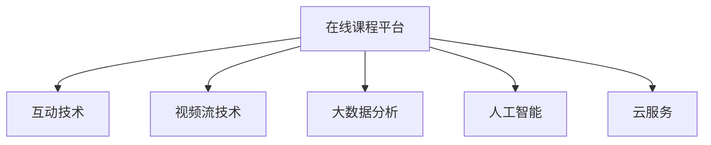

                 

## 1. 背景介绍

随着技术的进步和疫情的影响，从线下会议到在线课程的转变已经成为一种趋势。这种转变不仅改变了传统的学习和交流方式，也带来了新的挑战和机遇。本文将探讨从线下会议到在线课程的技术实现，并分享如何构建高效、互动的在线课程平台。

## 2. 核心概念与联系

### 2.1 核心概念概述

为了更好地理解在线课程的构建过程，我们需要了解一些核心概念及其联系：

- **在线课程平台**：基于Web或移动设备，提供视频、音频、文本等多种教学内容，支持实时互动和评估的学习平台。

- **互动技术**：包括实时聊天、白板、互动演示、虚拟会议室等，提升学习的互动性和参与感。

- **视频流技术**：用于传输高清晰度、低延迟的音视频内容，保证在线课程的流畅度和体验感。

- **大数据分析**：通过收集和分析学习行为数据，为教学优化和学生反馈提供数据支持。

- **人工智能**：利用自然语言处理、计算机视觉等技术，自动生成个性化学习内容，提升教学效果。

- **云服务**：通过云平台提供的计算、存储、网络等基础设施，实现课程资源的集中管理和分发。

这些核心概念共同构成了在线课程平台的技术框架，使得在线学习成为可能。

### 2.2 核心概念原理和架构的 Mermaid 流程图



该流程图展示了在线课程平台的技术架构，其中各个模块之间的依赖关系非常明确：

- 在线课程平台依赖互动技术，提升用户体验和互动性。
- 视频流技术提供音视频内容，保证课程的流畅度和传输质量。
- 大数据分析通过数据驱动的方式，优化教学内容和评估方法。
- 人工智能辅助生成个性化学习内容，提升教学效果。
- 云服务提供了基础设施，确保课程资源的可靠性和可扩展性。

## 3. 核心算法原理 & 具体操作步骤

### 3.1 算法原理概述

在线课程平台的构建涉及多个算法和技术的融合，其中最重要的算法包括：

- **实时视频流**：利用H.264、VP8、VP9等编解码器，实现低延迟、高清晰度的音视频传输。
- **互动技术**：包括WebSocket、WebRTC等实时通信协议，实现实时聊天、白板、互动演示等功能。
- **大数据分析**：使用Hadoop、Spark等大数据处理框架，处理和分析用户行为数据。
- **人工智能**：通过自然语言处理、计算机视觉等技术，自动生成个性化学习内容。

### 3.2 算法步骤详解

#### 3.2.1 实时视频流

1. **编解码器选择**：根据传输带宽和设备性能，选择合适的编解码器，如H.264、VP8、VP9等。
2. **编码器参数设置**：根据实际需求，调整编解码器参数，如码率、分辨率等。
3. **网络优化**：通过CDN、负载均衡等技术，优化网络传输路径，提高传输效率。
4. **视频流传输**：使用RTMP、RTSP等协议，将编码后的视频流传输到服务器。

#### 3.2.2 互动技术

1. **WebSocket协议**：使用WebSocket协议实现服务器与客户端的实时通信。
2. **WebRTC协议**：使用WebRTC协议实现点对点的音视频通信，减少带宽占用。
3. **白板技术**：使用HTML5 Canvas或WebGL实现白板功能，支持实时绘制和交互。
4. **互动演示**：通过PPT、视频等形式的互动演示，提升学习效果。

#### 3.2.3 大数据分析

1. **数据收集**：通过日志文件、事件记录等形式，收集用户行为数据。
2. **数据存储**：使用Hadoop、Spark等大数据处理框架，将数据存储在分布式文件系统中。
3. **数据分析**：使用机器学习算法，如K-Means、PCA等，对数据进行分析和建模。
4. **数据可视化**：使用Tableau、Grafana等工具，将分析结果可视化展示。

#### 3.2.4 人工智能

1. **自然语言处理**：使用BERT、GPT等模型，进行文本分析、情感识别等任务。
2. **计算机视觉**：使用CNN、RNN等模型，进行图像识别、视频分析等任务。
3. **个性化推荐**：使用协同过滤、矩阵分解等算法，生成个性化学习内容。

### 3.3 算法优缺点

#### 3.3.1 实时视频流

**优点**：
- 低延迟、高清晰度，提升用户体验。
- 支持多种编解码器，适应不同的传输条件。
- 通过网络优化，提高传输效率。

**缺点**：
- 对网络带宽要求较高，可能存在延迟和抖动。
- 编解码器选择不当，可能导致视频质量下降。
- 对硬件设备性能要求较高。

#### 3.3.2 互动技术

**优点**：
- 支持实时通信，提升互动性和参与感。
- 支持多种交互形式，丰富学习体验。
- 通过点对点传输，减少带宽占用。

**缺点**：
- 对网络稳定性要求较高，可能出现卡顿现象。
- 互动技术复杂，开发和维护成本较高。
- 安全性和隐私保护需要特别关注。

#### 3.3.3 大数据分析

**优点**：
- 通过数据分析，优化教学内容和评估方法。
- 提供用户行为数据支持，提升个性化推荐效果。
- 通过可视化展示，提升数据利用率。

**缺点**：
- 数据量大，存储和处理成本较高。
- 数据分析复杂，需要专业知识。
- 隐私保护和数据安全问题需要特别关注。

#### 3.3.4 人工智能

**优点**：
- 自动生成个性化学习内容，提升教学效果。
- 支持自然语言处理和计算机视觉任务，丰富学习形式。
- 通过模型训练，不断提升算法效果。

**缺点**：
- 算法复杂，开发和维护成本较高。
- 数据需求量大，获取和标注成本较高。
- 模型效果可能存在偏差，需要持续优化。

### 3.4 算法应用领域

#### 3.4.1 实时视频流

- **远程教育**：支持在线课堂、虚拟实验室等远程教育场景。
- **企业培训**：支持在线培训、视频会议等企业培训场景。
- **远程医疗**：支持远程诊疗、远程手术等远程医疗场景。

#### 3.4.2 互动技术

- **在线课程**：支持实时互动、白板演示等在线课程场景。
- **虚拟会议室**：支持虚拟会议、远程协作等企业协作场景。
- **在线咨询**：支持在线咨询、客服支持等在线服务场景。

#### 3.4.3 大数据分析

- **教育优化**：通过数据分析，优化教学内容和评估方法。
- **用户行为分析**：通过用户行为数据，优化用户体验和产品设计。
- **市场分析**：通过市场数据分析，指导业务决策和营销策略。

#### 3.4.4 人工智能

- **智能推荐**：通过自然语言处理和计算机视觉，自动生成个性化学习内容。
- **情感分析**：通过自然语言处理，分析学生情感和反馈。
- **智能测评**：通过自然语言处理和计算机视觉，自动评估学习成果。

## 4. 数学模型和公式 & 详细讲解 & 举例说明

### 4.1 数学模型构建

在线课程平台的构建涉及多个数学模型的应用，其中最重要的模型包括：

- **实时视频流**：使用H.264、VP8、VP9等编解码器的数学模型。
- **互动技术**：使用WebSocket、WebRTC等实时通信协议的数学模型。
- **大数据分析**：使用Hadoop、Spark等大数据处理框架的数学模型。
- **人工智能**：使用BERT、GPT等自然语言处理模型的数学模型。

### 4.2 公式推导过程

#### 4.2.1 实时视频流

- **编解码器选择**：根据传输带宽和设备性能，选择合适的编解码器。
- **编码器参数设置**：根据实际需求，调整编解码器参数，如码率、分辨率等。
- **网络优化**：通过CDN、负载均衡等技术，优化网络传输路径，提高传输效率。
- **视频流传输**：使用RTMP、RTSP等协议，将编码后的视频流传输到服务器。

#### 4.2.2 互动技术

- **WebSocket协议**：使用WebSocket协议实现服务器与客户端的实时通信。
- **WebRTC协议**：使用WebRTC协议实现点对点的音视频通信，减少带宽占用。
- **白板技术**：使用HTML5 Canvas或WebGL实现白板功能，支持实时绘制和交互。
- **互动演示**：通过PPT、视频等形式的互动演示，提升学习效果。

#### 4.2.3 大数据分析

- **数据收集**：通过日志文件、事件记录等形式，收集用户行为数据。
- **数据存储**：使用Hadoop、Spark等大数据处理框架，将数据存储在分布式文件系统中。
- **数据分析**：使用机器学习算法，如K-Means、PCA等，对数据进行分析和建模。
- **数据可视化**：使用Tableau、Grafana等工具，将分析结果可视化展示。

#### 4.2.4 人工智能

- **自然语言处理**：使用BERT、GPT等模型，进行文本分析、情感识别等任务。
- **计算机视觉**：使用CNN、RNN等模型，进行图像识别、视频分析等任务。
- **个性化推荐**：使用协同过滤、矩阵分解等算法，生成个性化学习内容。

### 4.3 案例分析与讲解

#### 4.3.1 实时视频流

- **案例**：Zoom在线视频会议平台
- **分析**：Zoom采用WebRTC协议实现点对点的音视频通信，减少带宽占用。通过CDN和负载均衡技术，优化网络传输路径，提高传输效率。在编码器选择上，Zoom支持多种编解码器，适应不同的传输条件。

#### 4.3.2 互动技术

- **案例**：腾讯课堂在线课程平台
- **分析**：腾讯课堂采用WebSocket协议实现服务器与客户端的实时通信，支持实时聊天和互动演示。通过HTML5 Canvas和WebGL技术，实现白板功能，支持实时绘制和交互。

#### 4.3.3 大数据分析

- **案例**：Netflix用户行为分析平台
- **分析**：Netflix使用Hadoop和Spark等大数据处理框架，存储和处理用户行为数据。通过K-Means和PCA等算法，对数据进行分析和建模。通过Tableau和Grafana等工具，将分析结果可视化展示，优化用户体验和产品设计。

#### 4.3.4 人工智能

- **案例**：Duolingo智能推荐系统
- **分析**：Duolingo使用BERT和GPT等自然语言处理模型，自动生成个性化学习内容。通过协同过滤和矩阵分解等算法，生成个性化推荐，提升学习效果。

## 5. 项目实践：代码实例和详细解释说明

### 5.1 开发环境搭建

在进行在线课程平台的开发前，我们需要准备好开发环境。以下是使用Python进行Django开发的环境配置流程：

1. 安装Python：从官网下载并安装Python，确保版本稳定。
2. 安装Django：通过pip安装Django，pip install Django。
3. 安装相关依赖：通过pip安装相关的依赖库，pip install Pillow、django-cors-headers、django-compressor等。
4. 配置开发环境：创建虚拟环境，激活虚拟环境，pip install -r requirements.txt。

完成上述步骤后，即可在虚拟环境中开始Django应用的开发。

### 5.2 源代码详细实现

下面以构建一个简单的在线课程平台为例，给出使用Django框架的代码实现。

首先，定义一个简单的课程模型：

```python
from django.db import models

class Course(models.Model):
    name = models.CharField(max_length=100)
    description = models.TextField()
    video_url = models.URLField()

    def __str__(self):
        return self.name
```

然后，创建一个简单的课程视图：

```python
from django.shortcuts import render
from .models import Course

def course_list(request):
    courses = Course.objects.all()
    return render(request, 'course_list.html', {'courses': courses})
```

最后，创建一个简单的模板：

```html
<!DOCTYPE html>
<html>
<head>
    <title>Course List</title>
</head>
<body>
    <h1>Course List</h1>
    <ul>
        
            <li>{{ course.name }}: {{ course.video_url }}</li>
        
    </ul>
</body>
</html>
```

启动开发服务器：

```bash
python manage.py runserver
```

现在，在浏览器中访问http://127.0.0.1:8000，即可看到课程列表。

### 5.3 代码解读与分析

让我们再详细解读一下关键代码的实现细节：

**Course模型**：
- `__str__`方法：用于模型对象的字符串表示。

**course_list视图**：
- 使用Django的模板系统，渲染课程列表页面。

**模板代码**：
- 通过循环遍历所有课程，输出课程名称和视频链接。

## 6. 实际应用场景

### 6.1 远程教育

在线课程平台可以广泛应用在远程教育中，支持在线课堂、虚拟实验室等远程教育场景。例如，Coursera、edX等在线教育平台，通过在线课程的构建，为全球用户提供高质量的教育资源。

### 6.2 企业培训

在线课程平台可以支持在线培训、视频会议等企业培训场景。例如，LinkedIn Learning、Udemy等在线教育平台，为企业员工提供丰富的培训课程，提升员工技能和职业素养。

### 6.3 远程医疗

在线课程平台可以支持远程诊疗、远程手术等远程医疗场景。例如，远程医疗平台Hopin，通过在线课程的构建，支持医生远程培训和医疗咨询。

### 6.4 未来应用展望

未来，在线课程平台将在更多领域得到应用，为传统行业带来变革性影响。

- **智慧医疗**：基于在线课程平台，支持远程培训和医疗咨询，提升医疗服务质量和效率。
- **智能教育**：通过个性化推荐和互动技术，提升在线教育的效果和体验。
- **在线客服**：通过在线课程平台，提供实时客服支持，提升客户服务质量。

## 7. 工具和资源推荐

### 7.1 学习资源推荐

为了帮助开发者系统掌握在线课程平台的理论基础和实践技巧，这里推荐一些优质的学习资源：

1. **《Python网络编程》**：讲解了使用Python进行网络编程的基础知识和实践技巧。
2. **《Django实战》**：通过案例，深入浅出地讲解了使用Django框架开发Web应用的方法。
3. **《JavaScript高级程序设计》**：讲解了使用JavaScript进行Web前端开发的方法。
4. **《WebRTC视频通信》**：讲解了使用WebRTC协议实现音视频通信的方法。
5. **《机器学习实战》**：讲解了使用Python进行机器学习和数据分析的方法。

通过对这些资源的学习实践，相信你一定能够快速掌握在线课程平台的开发方法，并应用于实际项目中。

### 7.2 开发工具推荐

高效的开发离不开优秀的工具支持。以下是几款用于在线课程平台开发的常用工具：

1. **PyCharm**：一款功能强大的IDE，支持Python、Django等多种语言和框架。
2. **VSCode**：一款轻量级的代码编辑器，支持JavaScript、HTML等多种语言。
3. **Postman**：一款API测试工具，支持HTTP请求和响应数据的调试。
4. **AWS**：提供云服务，包括计算、存储、网络等基础设施，支持大规模的在线课程平台部署。
5. **Docker**：一款容器化工具，支持跨平台部署和容器化，便于开发和部署。

合理利用这些工具，可以显著提升在线课程平台的开发效率，加快创新迭代的步伐。

### 7.3 相关论文推荐

在线课程平台的构建涉及多个技术领域的融合，以下是几篇奠基性的相关论文，推荐阅读：

1. **《WebRTC：实时音视频通信技术》**：介绍了WebRTC协议的原理和应用方法。
2. **《Django实战》**：通过案例，讲解了使用Django框架开发Web应用的方法。
3. **《大数据分析与数据科学》**：介绍了大数据分析和数据科学的基础知识和应用方法。
4. **《自然语言处理基础》**：介绍了自然语言处理的基础知识和应用方法。

这些论文代表了大数据、自然语言处理等技术的发展脉络，通过学习这些前沿成果，可以帮助研究者把握学科前进方向，激发更多的创新灵感。

## 8. 总结：未来发展趋势与挑战

### 8.1 总结

本文对从线下会议到在线课程的技术实现进行了全面系统的介绍。首先阐述了在线课程平台的重要性和构建过程，明确了在线课程平台在远程教育、企业培训、远程医疗等场景中的应用价值。其次，从原理到实践，详细讲解了在线课程平台的各个模块，包括实时视频流、互动技术、大数据分析和人工智能等。最后，分享了在线课程平台在实际应用中的常见问题和解决方案。

通过本文的系统梳理，可以看到，在线课程平台的技术实现涉及多个技术领域的融合，为在线学习提供了可能。在线课程平台将在更多领域得到应用，为传统行业带来变革性影响。未来，伴随技术的不断进步和应用的不断拓展，在线课程平台必将成为教育和培训领域的重要工具。

### 8.2 未来发展趋势

展望未来，在线课程平台的发展将呈现以下几个趋势：

1. **技术融合**：在线课程平台将与大数据、人工智能等技术深度融合，提升学习效果和用户体验。
2. **个性化推荐**：通过大数据分析和人工智能技术，实现个性化推荐，提升学习效果。
3. **实时互动**：通过实时通信协议和互动技术，提升学习的互动性和参与感。
4. **多模态学习**：支持文本、图像、视频等多模态学习内容，提升学习效果。
5. **虚拟现实**：通过虚拟现实技术，提升学习的沉浸式体验。

以上趋势凸显了在线课程平台的广阔前景。这些方向的探索发展，必将进一步提升在线课程平台的性能和用户体验，为在线教育提供更多可能性。

### 8.3 面临的挑战

尽管在线课程平台已经取得了显著成就，但在迈向更加智能化、普适化应用的过程中，它仍面临着诸多挑战：

1. **网络带宽和稳定性**：在线课程平台对网络带宽和稳定性要求较高，可能存在延迟和抖动。
2. **互动技术复杂**：互动技术复杂，开发和维护成本较高。
3. **数据安全和个人隐私**：用户数据的安全和个人隐私需要特别关注。
4. **技术融合难度**：多个技术领域的融合需要复杂的开发和集成。
5. **用户体验优化**：提升用户体验和平台稳定性需要持续优化和改进。

这些挑战需要开发者在实际开发过程中，不断迭代和优化技术方案，方能得到理想的效果。

### 8.4 研究展望

面对在线课程平台所面临的种种挑战，未来的研究需要在以下几个方面寻求新的突破：

1. **网络优化**：通过CDN、负载均衡等技术，优化网络传输路径，提高传输效率。
2. **互动技术改进**：开发更加高效、稳定的互动技术，提升用户体验。
3. **数据安全保障**：采用加密和匿名化技术，保障用户数据的安全和个人隐私。
4. **技术融合**：通过模块化和组件化设计，简化技术融合难度。
5. **用户体验优化**：通过A/B测试和用户反馈，持续优化用户体验和平台稳定性。

这些研究方向的探索，必将引领在线课程平台技术的发展，为在线教育提供更加优质的服务。

## 9. 附录：常见问题与解答

**Q1：在线课程平台如何实现实时音视频通信？**

A: 在线课程平台实现实时音视频通信，通常使用WebRTC协议。WebRTC使用点对点通信技术，减少带宽占用和延迟，实现高效、稳定的音视频传输。同时，通过CDN和负载均衡技术，优化网络传输路径，提高传输效率。

**Q2：在线课程平台如何实现个性化推荐？**

A: 在线课程平台实现个性化推荐，通常使用大数据分析和人工智能技术。通过收集用户行为数据，使用协同过滤、矩阵分解等算法，生成个性化推荐。同时，使用自然语言处理模型，自动生成个性化学习内容，提升学习效果。

**Q3：在线课程平台如何提升用户体验？**

A: 在线课程平台提升用户体验，通常采用以下方法：
- 实时互动：使用WebSocket和WebRTC等技术，实现实时通信和互动。
- 多媒体内容：支持文本、图像、视频等多媒体内容，丰富学习形式。
- 个性化推荐：通过大数据分析和人工智能技术，实现个性化推荐，提升学习效果。
- 虚拟现实：通过虚拟现实技术，提升学习的沉浸式体验。

**Q4：在线课程平台如何保障数据安全和个人隐私？**

A: 在线课程平台保障数据安全和个人隐私，通常采用以下方法：
- 数据加密：对用户数据进行加密存储和传输，防止数据泄露。
- 匿名化处理：对用户数据进行匿名化处理，保护用户隐私。
- 访问控制：采用身份认证和权限控制技术，保障数据安全。
- 安全审计：定期进行安全审计和漏洞扫描，防止安全漏洞。

这些措施可以显著提升在线课程平台的安全性和可靠性，保障用户数据的安全和个人隐私。

---

作者：禅与计算机程序设计艺术 / Zen and the Art of Computer Programming

