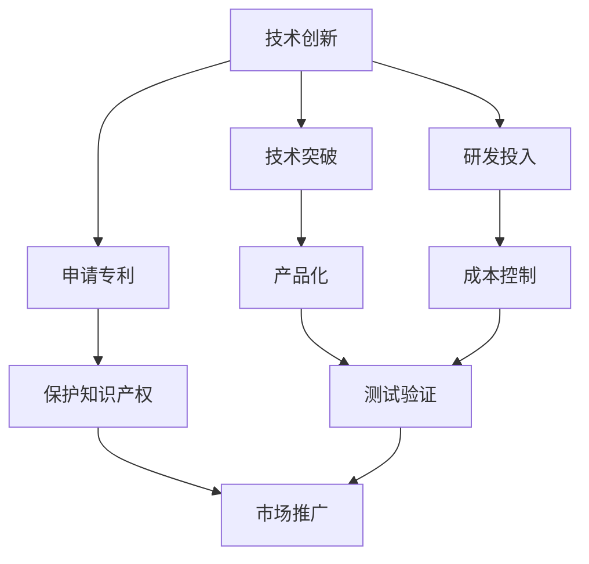

                 

# 技术创新与专利商业化指南

## 1. 背景介绍

在当今快速发展的技术环境中，技术创新和专利商业化成为了科技企业发展的重要驱动力。然而，如何将创新转化为商业成功，将专利转化为市场竞争力，是一个复杂而多维的问题。本文旨在为技术创新者和专利持有人提供一个全面的指南，帮助他们在这一过程中取得成功。

## 2. 核心概念与联系

### 2.1 核心概念概述

要深入理解技术创新与专利商业化的过程，首先需要明确定义以下几个关键概念：

- **技术创新**：指在现有技术基础上，通过研究开发新产品、新方法、新应用，或对现有技术进行改进，以满足市场需求或解决特定问题。
- **专利**：指法律赋予发明人对其发明在一定期限内独占使用权的文件。专利保护发明人的智力成果，防止其被他人非法使用或复制。
- **商业化**：将技术或产品从研发阶段过渡到市场应用，实现其商业价值的过程。

这些概念之间存在着紧密的联系。技术创新是专利商业化的基础，而专利则是技术创新的法律保障。只有当技术创新得到专利保护，才能转化为实际的商业机会。

### 2.2 核心概念原理和架构的 Mermaid 流程图



这个流程图展示了技术创新与专利商业化的主要流程：

1. 技术创新（A）：指研发活动和知识产出，是商业化的起点。
2. 申请专利（B）：将创新成果转化为法律文件，获得专利权。
3. 保护知识产权（C）：确保专利权的有效性和安全性，避免侵权。
4. 研发投入（D）：对创新活动的财务支持。
5. 技术突破（E）：在研发过程中取得的具体进展。
6. 产品化（H）：将技术成果转化为市场可用的产品或服务。
7. 测试验证（I）：对产品进行测试和验证，确保质量符合市场要求。
8. 市场推广（F）：将产品推向市场，实现商业价值。
9. 成本控制（G）：在研发和市场推广过程中控制成本，提升效率。

## 3. 核心算法原理 & 具体操作步骤

### 3.1 算法原理概述

技术创新与专利商业化的过程涉及多个环节，每个环节都需要精确的操作和优化。本文将从技术创新的研发流程和专利申请与维护两个方面，详细讲解核心算法原理。

### 3.2 算法步骤详解

#### 3.2.1 技术创新研发流程

技术创新研发流程主要包括以下步骤：

1. **需求分析**：确定市场需求和潜在用户群体，明确产品目标和功能需求。
2. **市场调研**：分析市场竞争情况，了解现有技术和产品的不足之处。
3. **概念设计**：基于需求分析和市场调研，提出初步的技术方案。
4. **技术验证**：通过原型设计和测试验证，验证技术方案的可行性。
5. **迭代优化**：根据测试结果和技术进展，不断迭代优化产品设计。
6. **技术实现**：将产品设计转化为具体的技术实现。

#### 3.2.2 专利申请与维护

专利申请与维护流程主要包括以下步骤：

1. **专利检索**：查找相关专利文献，避免重复研发。
2. **撰写专利申请文件**：根据发明内容撰写详细的专利申请书，包括发明摘要、背景技术、实施例等。
3. **提交申请**：向国家知识产权局提交专利申请，缴纳申请费。
4. **专利审查**：专利局对申请进行形式审查和实质审查，确保发明满足专利授权条件。
5. **授权与维护**：专利授权后，需按时缴纳年费，进行专利权的维护。
6. **维权与诉讼**：在发现侵权行为时，通过法律手段保护专利权。

### 3.3 算法优缺点

#### 3.3.1 技术创新研发流程的优缺点

- **优点**：
  - 紧密结合市场需求，确保产品具有竞争力和实用性。
  - 通过不断迭代优化，提高技术成熟度和可靠性。
  - 系统的研发流程有助于团队协作和资源管理。

- **缺点**：
  - 研发周期长，投入成本高。
  - 技术突破不确定性大，存在失败风险。
  - 技术信息泄露风险高，需严格保密。

#### 3.3.2 专利申请与维护的优缺点

- **优点**：
  - 提供法律保护，防止他人非法使用或复制。
  - 通过专利申请，获得政府的支持和资金。
  - 提高企业在市场中的竞争地位。

- **缺点**：
  - 申请和维护过程复杂，费用高。
  - 专利有效期有限，需定期更新和维护。
  - 专利保护范围有限，容易被绕过。

### 3.4 算法应用领域

技术创新与专利商业化方法广泛应用于多个行业领域，包括但不限于：

- **医疗健康**：通过技术创新开发新药、医疗设备等，通过专利保护其知识产权。
- **信息技术**：开发新的软件应用、网络安全技术，通过专利保护核心技术。
- **环保节能**：研发清洁能源技术、环保设备，通过专利保护其创新成果。
- **教育培训**：开发教育平台、培训系统，通过专利保护其教育内容和方法。
- **智能制造**：开发智能制造设备、生产管理系统，通过专利保护其技术创新。

## 4. 数学模型和公式 & 详细讲解 & 举例说明

### 4.1 数学模型构建

为更好地理解技术创新与专利商业化的过程，本节将使用数学语言对相关模型进行构建。

假设某技术创新项目涉及多项技术指标，其性能评价指标为 $P$。专利的申请和维护涉及多个关键参数，如申请时间 $T$、授权时间 $A$、年费 $C$ 等。

### 4.2 公式推导过程

假设技术创新项目的研发周期为 $D$，市场需求量为 $M$，市场竞争强度为 $K$。则技术创新项目的潜在收益 $R$ 可以表示为：

$$
R = M \times K \times P
$$

专利申请和维护的流程可以通过时间参数表示。假设专利申请的时间为 $T$，授权时间为 $A$，年费为 $C$，则专利保护的有效期 $L$ 可以表示为：

$$
L = T + A + (A \times n) - C
$$

其中 $n$ 为专利年费缴纳次数。

### 4.3 案例分析与讲解

以某智能医疗设备为例，分析其技术创新与专利商业化的过程：

- **技术创新**：开发智能健康监测设备，通过研发投入 $D$，进行技术突破 $E$，最终实现技术产品化 $H$。
- **专利申请**：进行专利检索 $B$，撰写专利申请文件 $C$，提交申请 $T$，等待授权 $A$。
- **专利维护**：缴纳年费 $C$，维护有效期 $L$，在市场推广 $F$ 中，确保专利权的有效性和安全性。

## 5. 项目实践：代码实例和详细解释说明

### 5.1 开发环境搭建

要实现技术创新与专利商业化的具体项目，首先需要搭建开发环境。以下是常用的开发环境搭建步骤：

1. **选择编程语言**：Python 是目前最流行的编程语言之一，支持丰富的科学计算库。
2. **安装开发工具**：安装 Python IDE，如 PyCharm 或 Visual Studio Code。
3. **安装依赖库**：安装所需的数据分析、机器学习、专利申请等库。
4. **设置版本控制**：使用 Git 进行版本控制，确保代码的持续更新和备份。

### 5.2 源代码详细实现

以下是一个简单的技术创新项目示例代码，用于模拟专利申请和维护的过程：

```python
import random

# 技术创新研发流程
def innovation_development():
    market_research = True  # 市场调研
    concept_design = True  # 概念设计
    technical_verification = True  # 技术验证
    iteration_optimization = True  # 迭代优化
    technical_realization = True  # 技术实现
    test_validation = True  # 测试验证

    # 判断是否通过研发流程
    if market_research and concept_design and technical_verification and iteration_optimization and technical_realization and test_validation:
        return "技术创新完成"
    else:
        return "研发流程中断"

# 专利申请与维护流程
def patent_application_and_maintenance():
    patent_search = True  # 专利检索
    patent_application = True  # 专利申请
    patent_examination = True  # 专利审查
    patent_authorization = True  # 专利授权
    patent_maintenance = True  # 专利维护

    # 判断是否通过专利流程
    if patent_search and patent_application and patent_examination and patent_authorization and patent_maintenance:
        return "专利保护完成"
    else:
        return "专利申请中断"

# 模拟技术创新研发流程
print(innovation_development())

# 模拟专利申请与维护流程
print(patent_application_and_maintenance())
```

### 5.3 代码解读与分析

这段代码模拟了技术创新和专利申请与维护的流程，通过逻辑判断实现了流程的执行。可以看到，研发流程和专利流程都需要经过多个步骤的验证，确保每一步都能顺利完成。

## 6. 实际应用场景

### 6.1 智能医疗设备

在智能医疗设备领域，技术创新与专利商业化显得尤为重要。医疗设备直接影响患者生命安全，其技术创新必须严谨、可靠。

- **技术创新**：开发智能健康监测设备，通过传感器、算法等技术手段，实现对生理数据的实时监测。
- **专利申请**：对设备的核心算法、传感器设计等进行专利申请，确保技术独占性。
- **专利维护**：定期缴纳年费，进行专利更新，确保专利权的有效性和安全性。

### 6.2 网络安全技术

网络安全技术是信息技术领域的重要组成部分，通过技术创新提升系统的安全性和防护能力。

- **技术创新**：研发新型加密算法、入侵检测系统等，提高网络安全性。
- **专利申请**：对加密算法、检测规则等进行专利申请，保护核心技术。
- **专利维护**：持续更新加密算法和检测规则，确保技术的领先性。

### 6.3 环保节能技术

环保节能技术是实现可持续发展的重要手段，通过技术创新减少能源消耗，降低环境污染。

- **技术创新**：开发清洁能源设备、节能控制系统等，提升能源利用效率。
- **专利申请**：对清洁能源技术、节能控制方法进行专利申请，保护技术成果。
- **专利维护**：定期更新技术专利，确保技术的持续发展和应用。

## 7. 工具和资源推荐

### 7.1 学习资源推荐

为了帮助读者更好地理解技术创新与专利商业化的过程，这里推荐一些优质的学习资源：

1. **《专利法》及其实施细则**：了解专利法律和法规，确保专利申请和维护的合法性。
2. **《创新管理》课程**：学习创新管理的基本理论和实践技巧，提升项目管理能力。
3. **《专利撰写与审查指南》**：掌握专利撰写技巧和专利审查流程，提高专利申请成功率。
4. **《技术转移与成果转化》书籍**：了解技术转移与成果转化的具体步骤和方法，实现科技成果的商业化。
5. **Google Scholar**：搜索相关学术文献，了解技术创新与专利商业化的前沿研究。

### 7.2 开发工具推荐

技术创新与专利商业化涉及多个环节，以下工具推荐可以帮助提高开发效率：

1. **GitHub**：代码托管平台，支持版本控制和代码共享。
2. **Google Colab**：免费提供的云计算平台，支持Jupyter Notebook，适合开发与协作。
3. **PatentScope**：专利检索和分析工具，帮助查找相关专利文献，避免重复研发。
4. **Microsoft Project**：项目管理工具，帮助规划和跟踪技术创新项目进度。
5. **Visual Studio Code**：开源代码编辑器，支持多种编程语言和扩展。

### 7.3 相关论文推荐

技术创新与专利商业化是科技领域的核心议题，以下是几篇具有代表性的相关论文，推荐阅读：

1. **《专利保护与技术创新：现状、挑战与对策》**：论文分析了专利保护对技术创新的影响，提出了具体的保护策略和改进建议。
2. **《技术转移与成果转化：案例分析与模式研究》**：论文通过多个成功案例，展示了技术转移与成果转化的有效路径和模式。
3. **《技术创新与知识产权：协同发展的路径选择》**：论文探讨了技术创新与知识产权的协同机制，提出了多角度的协同发展策略。
4. **《智能医疗设备的技术创新与专利保护》**：论文分析了智能医疗设备的创新点和专利申请策略，为行业提供参考。
5. **《网络安全技术的发展与专利布局》**：论文介绍了网络安全技术的最新进展和专利布局策略，为技术创新者提供参考。

## 8. 总结：未来发展趋势与挑战

### 8.1 研究成果总结

技术创新与专利商业化是一个复杂而多维的过程，涉及技术、法律、市场等多个方面。本节将对相关研究成果进行总结，梳理未来发展趋势。

技术创新方面，未来将更加注重用户需求和市场导向，推动技术与应用的深度融合。专利申请方面，未来将更加注重法律保护和商业化策略，确保技术成果的持续发展和市场应用。

### 8.2 未来发展趋势

1. **技术创新的加速**：随着AI、大数据等技术的发展，技术创新的速度将大大加快，新的应用场景和创新点将不断涌现。
2. **专利保护的强化**：随着专利法律体系的完善和国际合作加强，专利保护的范围和力度将进一步增强，保障技术成果的安全和有效。
3. **商业化的多样化**：技术成果的商业化路径将更加多样，包括许可、合作、独资、合资等多种形式。
4. **知识产权意识的提升**：随着知识产权意识的增强，技术创新者将更加重视知识产权的保护和管理，提升企业的市场竞争力。

### 8.3 面临的挑战

尽管技术创新与专利商业化取得了显著进展，但仍面临诸多挑战：

1. **研发成本高**：技术创新的研发周期长，投入高，需要持续的资金支持。
2. **市场竞争激烈**：市场竞争加剧，技术创新者需要具备更高的创新能力和市场敏锐度。
3. **专利保护难度大**：专利申请和维护过程复杂，费用高，且需要不断更新和维护。
4. **知识产权纠纷**：技术创新过程中，可能面临侵权纠纷和法律诉讼，需要提前防范。
5. **技术更新快**：技术更新速度快，原有技术可能很快被新方法取代，需不断迭代创新。

### 8.4 研究展望

未来的研究需要在以下几个方面取得新的突破：

1. **创新管理优化**：通过数据分析和机器学习技术，优化创新管理的流程和方法，提升效率和成功率。
2. **专利申请策略**：制定科学的专利申请策略，确保专利申请的质量和数量，提升技术成果的市场价值。
3. **技术转移机制**：建立有效的技术转移机制，加速技术成果的商业化进程，实现技术成果的最大化应用。
4. **知识产权教育**：加强知识产权教育和培训，提升技术创新者和企业的知识产权意识，规范技术开发和应用。

## 9. 附录：常见问题与解答

**Q1: 技术创新和专利商业化的具体流程是什么？**

A: 技术创新和专利商业化的流程主要包括以下步骤：
1. **技术创新**：需求分析、市场调研、概念设计、技术验证、迭代优化、技术实现、测试验证。
2. **专利申请**：专利检索、撰写专利申请文件、提交申请、等待授权、缴纳年费、维护有效期。
3. **专利维护**：定期缴纳年费、进行专利更新、确保专利权的有效性和安全性。
4. **市场推广**：将技术成果转化为市场产品或服务，进行市场推广和销售。

**Q2: 如何提高技术创新的成功率？**

A: 提高技术创新的成功率，可以从以下几个方面入手：
1. **市场需求导向**：紧跟市场需求变化，确保技术创新具有实际应用价值。
2. **团队协作**：组建跨学科团队，整合资源和知识，提高创新效率。
3. **技术验证**：通过原型设计和测试验证，确保技术方案的可行性和可靠性。
4. **迭代优化**：不断迭代优化技术方案，提高技术成熟度和市场竞争力。
5. **知识产权保护**：通过专利申请和维护，确保技术成果的安全和有效。

**Q3: 专利申请和维护过程中需要注意哪些问题？**

A: 专利申请和维护过程中需要注意以下几个问题：
1. **专利检索**：避免重复研发，确保专利的创新性和新颖性。
2. **撰写申请文件**：确保专利申请文件的完整性和准确性，详细描述技术方案。
3. **申请和审查**：遵循专利申请流程，及时缴纳申请费，确保申请通过审查。
4. **授权和维护**：按时缴纳年费，进行专利更新，确保专利权的有效性和安全性。
5. **维权和诉讼**：在发现侵权行为时，通过法律手段保护专利权，避免侵权损失。

---

作者：禅与计算机程序设计艺术 / Zen and the Art of Computer Programming

