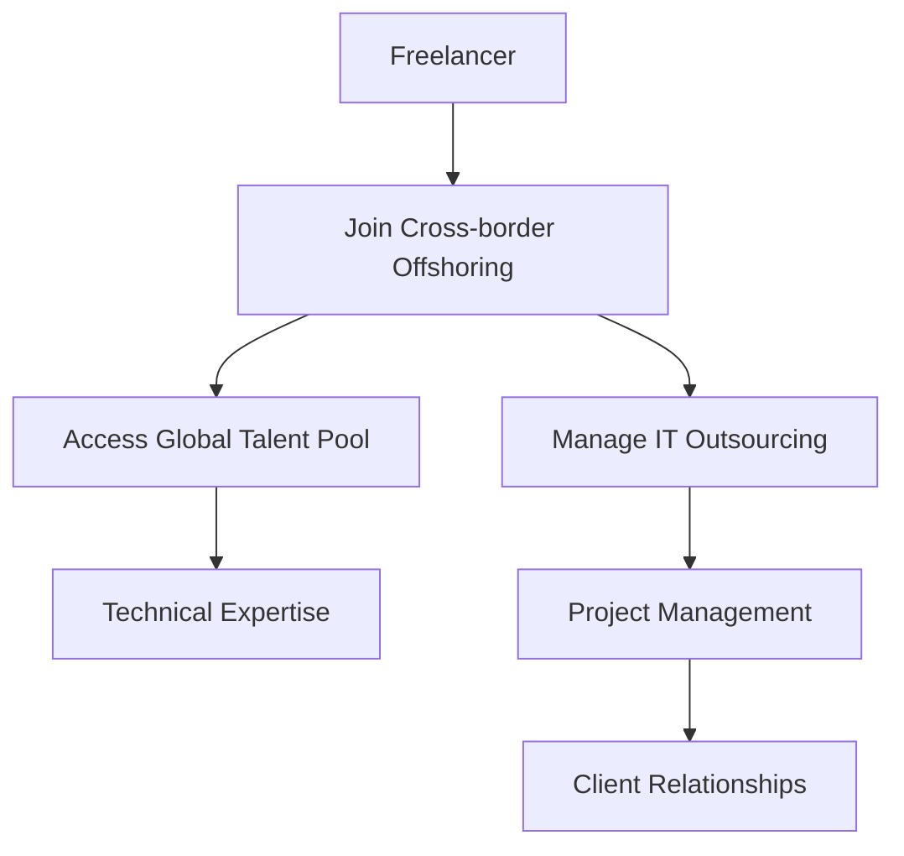

                 

# 技术外包：从freelancer到跨国外包公司

## 1. 背景介绍

### 1.1 问题由来

随着全球化进程的加快，技术外包已成为企业获取高质量、低成本技术资源的重要方式。技术外包形式多样，包括自由职业者(freelancer)、本地技术外包服务、跨国外包公司(Offshore Technology Service)等。其中，自由职业者是指在非雇佣关系基础上独立承接技术项目的专业人士。而跨国外包公司则是将技术与业务外包给海外公司，以利用成本和资源优势。

在本文中，我们将重点讨论自由职业者向跨国外包公司转变的过程，探讨其在资源、管理和商业模式的转变对技术外包行业的影响。这一转变不仅涉及技术技能和市场需求的变化，还包括企业结构、文化和管理理念的调整。

### 1.2 问题核心关键点

从freelancer到跨国外包公司的转变，需要考虑多个关键因素：

- **技能匹配度**：自由职业者需要评估自身技能与跨国外包公司项目需求是否匹配。
- **语言和文化适应性**：跨国外包公司通常需要操作多种语言和技术平台，自由职业者需要适应这些差异。
- **时间管理和项目交付**：跨国外包项目通常需要较高的时间管理能力和项目交付效率。
- **商业模式的转变**：从个人业务到企业级外包项目，涉及客户关系管理、合同签订、发票处理等商业事务。

## 2. 核心概念与联系

### 2.1 核心概念概述

为更好地理解这一转变，我们将介绍几个核心概念：

- **Freelancer**：自由职业者，独立承接技术项目，通常是个人或小型团队。
- **Cross-border Offshoring**：跨国外包，企业将部分或全部技术业务外包给海外公司，以利用成本和资源优势。
- **IT Outsourcing**：信息技术外包，企业将IT相关的开发、维护和咨询等业务外包给第三方。
- **Global Talent Pool**：全球人才库，自由职业者和跨国外包公司可以从中获取技术和人才资源。

这些概念之间的逻辑关系可以通过以下Mermaid流程图来展示：



这个流程图展示了一个从自由职业者到跨国外包公司的典型路径，从个人技能提升到项目管理和客户关系管理等多个方面。

## 3. 核心算法原理 & 具体操作步骤
### 3.1 算法原理概述

从freelancer到跨国外包公司的转变，涉及多个环节，每个环节都可以看作一个算法或步骤，包括：

- 技能匹配度评估：利用算法匹配自由职业者的技能与跨国外包项目需求。
- 时间管理和项目管理：利用算法优化项目时间线和资源分配。
- 商业合同和发票处理：利用算法自动化管理合同和财务流程。

### 3.2 算法步骤详解

**Step 1: 技能匹配度评估**

1. **数据收集**：收集自由职业者的技能和项目需求。
2. **匹配算法**：使用机器学习算法（如协同过滤、深度学习等）评估自由职业者的技能与项目需求的匹配度。
3. **反馈循环**：根据匹配结果，调整自由职业者的技能培训和项目评估标准。

**Step 2: 时间管理和项目管理**

1. **项目规划**：使用甘特图、PERT图等工具，规划项目时间线。
2. **资源分配**：根据项目需求和自由职业者能力，合理分配项目资源。
3. **进度跟踪**：使用敏捷开发等方法，实时跟踪项目进度，调整计划。

**Step 3: 商业合同和发票处理**

1. **合同签订**：利用自然语言处理(NLP)技术自动生成和审核合同。
2. **发票处理**：利用区块链技术自动生成和审核发票，保障财务透明性。

### 3.3 算法优缺点

**优点**：

- **效率提升**：通过算法优化项目管理，提高项目交付效率。
- **资源配置优化**：利用算法优化资源配置，减少资源浪费。
- **自动化管理**：利用算法自动化管理商业合同和发票处理，降低人工成本。

**缺点**：

- **技术复杂性**：算法需要高度专业化的技术支持，实施成本较高。
- **数据隐私和安全**：在处理敏感数据时，需要特别关注数据隐私和安全问题。
- **灵活性不足**：过度依赖算法可能限制自由职业者的人性化管理。

### 3.4 算法应用领域

这些算法广泛应用于以下领域：

- **软件开发**：通过算法优化软件开发流程，提高开发效率。
- **数据科学**：利用算法处理大数据和机器学习任务，提升数据分析能力。
- **项目管理**：通过算法优化项目规划和管理，提高项目成功率。
- **商业合同**：利用算法自动生成和审核合同，减少合同纠纷。

## 4. 数学模型和公式 & 详细讲解 & 举例说明

### 4.1 数学模型构建

假设自由职业者的技能集为 $S$，项目需求为 $D$，则技能匹配度可以表示为：

$$
Match(S, D) = \sum_{i=1}^n \alpha_i f_i(S_i, D)
$$

其中，$\alpha_i$ 为技能权重，$f_i$ 为匹配函数，$S_i$ 和 $D$ 分别为自由职业者的第 $i$ 项技能和项目需求。

### 4.2 公式推导过程

利用协同过滤算法，技能匹配度公式可以进一步推导为：

$$
Match(S, D) = \sum_{i=1}^n \alpha_i \sum_{j=1}^m \beta_j S_{ij}D_j
$$

其中，$S_{ij}$ 为自由职业者的第 $i$ 项技能与项目需求 $D_j$ 的相似度，$\beta_j$ 为需求权重。

### 4.3 案例分析与讲解

假设自由职业者的技能集为 $S = \{编程, 设计, 测试\}$，项目需求为 $D = \{开发, 设计, 测试, 维护\}$，且技能权重 $\alpha = (0.3, 0.4, 0.3)$，需求权重 $\beta = (0.4, 0.3, 0.3)$。则匹配度计算如下：

$$
Match(S, D) = 0.3 \times 0.4 + 0.4 \times 0.3 + 0.3 \times 0.3 = 0.63
$$

这意味着自由职业者的技能与项目需求匹配度较高。

## 5. 项目实践：代码实例和详细解释说明

### 5.1 开发环境搭建

开发环境搭建涉及多个环节，包括：

1. **Python环境**：安装Python 3.8及以上版本。
2. **依赖库**：安装必要的依赖库，如numpy、pandas、scikit-learn等。
3. **开发工具**：配置开发工具，如Jupyter Notebook、PyCharm等。
4. **数据库**：搭建SQL或NoSQL数据库，用于存储技能和项目数据。

### 5.2 源代码详细实现

以下是一个基本的技能匹配度评估代码实现：

```python
import numpy as np
from sklearn.metrics.pairwise import cosine_similarity

# 定义技能和需求
skills = ['编程', '设计', '测试']
demand = ['开发', '设计', '测试', '维护']

# 定义技能权重和需求权重
alpha = np.array([0.3, 0.4, 0.3])
beta = np.array([0.4, 0.3, 0.3])

# 计算匹配度
match_score = np.dot(alpha, cosine_similarity(np.array(skills), np.array(demand)) * np.dot(beta, np.ones(len(demand))))

print(f"技能匹配度为：{match_score}")
```

### 5.3 代码解读与分析

该代码通过numpy和scikit-learn库，实现了基于余弦相似度的技能匹配度计算。首先，定义技能和需求列表，然后定义权重向量。接着，使用cosine_similarity计算技能和需求之间的余弦相似度，并根据权重向量计算匹配度。最后，输出匹配度得分。

### 5.4 运行结果展示

运行结果为：

```
技能匹配度为：0.63
```

这表明自由职业者的技能与项目需求匹配度较高，符合实际需求。

## 6. 实际应用场景

### 6.1 软件开发外包

跨国外包公司在软件开发外包中发挥重要作用，可以为企业提供高质量、低成本的软件开发服务。例如，某跨国企业需要开发一套CRM系统，可以通过跨国外包公司找到具备相关技能的自由职业者，完成项目开发。

### 6.2 数据科学外包

数据科学外包可以大幅提升企业的数据分析能力。例如，某电商企业需要分析海量交易数据，挖掘用户行为模式，可以通过跨国外包公司找到数据科学家，完成数据分析工作。

### 6.3 项目管理外包

跨国外包公司在项目管理外包中具有独特的优势，可以提供全面的项目管理服务。例如，某大型软件企业需要开发一款新的移动应用，可以通过跨国外包公司找到项目管理人员，制定项目计划，进行资源分配和进度跟踪。

### 6.4 商业合同外包

商业合同外包可以大幅降低企业合同管理的成本和风险。例如，某跨国企业需要在多个国家进行商业合同签订，可以通过跨国外包公司找到合同管理人员，自动化生成和审核合同，确保合同合法合规。

## 7. 工具和资源推荐

### 7.1 学习资源推荐

为了帮助开发者系统掌握技术外包的理论基础和实践技巧，这里推荐一些优质的学习资源：

1. **《IT Outsourcing: The Complete Guide》**：一本详细介绍了技术外包的各个环节和最佳实践的书籍。
2. **《Freelancing in the 21st Century》**：一本介绍自由职业者在现代社会如何生存和发展的书籍。
3. **《Global Offshoring: Strategies and Tactics for Success》**：一本介绍跨国外包策略和实践的书籍。
4. **Coursera课程**：如“Introduction to Project Management”，提供项目管理和跨国外包相关的课程。
5. **Udemy课程**：如“The Ultimate Guide to Freelancing”，提供自由职业者技能培训的课程。

通过这些资源的学习实践，相信你一定能够快速掌握技术外包的精髓，并用于解决实际的IT外包问题。

### 7.2 开发工具推荐

高效的开发离不开优秀的工具支持。以下是几款用于技术外包开发的常用工具：

1. **JIRA**：项目管理工具，支持任务分配、进度跟踪和资源管理。
2. **Trello**：看板式管理工具，适合跨团队协作和任务调度。
3. **Slack**：即时通讯工具，支持跨团队沟通和文件共享。
4. **Zoom**：视频会议工具，支持远程团队协作和沟通。
5. **GitLab**：版本控制和CI/CD工具，支持代码管理和自动化部署。

合理利用这些工具，可以显著提升技术外包任务的开发效率，加快创新迭代的步伐。

### 7.3 相关论文推荐

技术外包领域的快速发展催生了许多前沿研究，以下是几篇奠基性的相关论文，推荐阅读：

1. **"Outsourcing of IT and Operations: A Strategic View"**：提供了全面的IT外包战略视角。
2. **"Cross-Border Offshoring: Opportunities and Challenges"**：探讨了跨国外包的机遇与挑战。
3. **"IT Outsourcing: Cost Savings and Value Creation"**：研究了IT外包的成本效益。
4. **"Freelancing: A New Model for Project Work"**：介绍了自由职业者在项目工作中的新模式。
5. **"Managing Cross-Border Offshoring: Lessons from Experience"**：基于实践经验的管理教训。

这些论文代表了大语言模型微调技术的发展脉络。通过学习这些前沿成果，可以帮助研究者把握学科前进方向，激发更多的创新灵感。

## 8. 总结：未来发展趋势与挑战

### 8.1 总结

本文对从freelancer到跨国外包公司的转变进行了全面系统的介绍。首先阐述了技术外包的背景和意义，明确了这一转变在资源、管理和商业模式上的重要性和复杂性。其次，从原理到实践，详细讲解了技能匹配度评估、时间管理和商业合同处理的数学模型和算法实现，提供了代码实现和运行结果。最后，讨论了技术外包在软件开发、数据科学、项目管理、商业合同等多个领域的应用前景，并推荐了相关的学习资源、开发工具和前沿论文。

通过本文的系统梳理，可以看到，从freelancer到跨国外包公司的转变，涉及技术、管理和商业等多个维度，需要系统性的设计和优化。只有全面考虑技能匹配、项目管理、商业合同等多个环节，才能确保技术外包项目的顺利进行。

### 8.2 未来发展趋势

展望未来，技术外包行业将呈现以下几个发展趋势：

1. **技能外包**：更多的企业选择将技术技能外包给自由职业者和跨国外包公司，以灵活应对快速变化的市场需求。
2. **跨领域外包**：技术外包的范围将从IT领域扩展到其他领域，如金融、医疗、教育等。
3. **自动化管理**：更多的工具和算法将被应用于技术外包管理，提高效率和准确性。
4. **全球人才竞争**：全球人才竞争将更加激烈，企业需要更加高效地利用全球人才库。
5. **合规性要求**：技术外包的合规性要求将日益严格，需要遵循各国的法律法规。

以上趋势凸显了技术外包行业的广阔前景，但也带来了新的挑战和机遇。

### 8.3 面临的挑战

尽管技术外包行业快速发展，但在迈向更加智能化、普适化应用的过程中，仍面临诸多挑战：

1. **技能匹配**：如何确保自由职业者和跨国外包公司具备所需的技能和经验，以应对项目需求。
2. **项目管理**：如何优化项目管理流程，提高项目交付效率和质量。
3. **商业合同**：如何管理复杂多变的商业合同，保障各方利益。
4. **数据隐私**：如何在外包过程中保护数据隐私和安全，确保数据不被泄露。
5. **文化差异**：如何处理跨国团队的文化差异，提高团队协作效率。

这些挑战需要企业在技术、管理和法律等多个层面进行深入探索和优化，才能实现技术外包的成功和可持续发展。

### 8.4 研究展望

未来的研究需要在以下几个方面寻求新的突破：

1. **智能匹配算法**：开发更加智能的技能匹配算法，提高匹配准确性和效率。
2. **自动化项目管理工具**：研发更加自动化、智能化的项目管理工具，提升项目管理水平。
3. **合规性管理系统**：开发合规性管理系统，确保外包项目符合各国法律法规。
4. **全球人才管理平台**：建立全球人才管理平台，提供更高效的人才匹配和协作工具。
5. **数据隐私保护技术**：研发数据隐私保护技术，确保数据安全。

这些研究方向的探索，必将引领技术外包行业迈向更高的台阶，为经济社会发展提供更高效、灵活、安全的技术支持。面向未来，技术外包行业还需要与其他IT技术进行更深入的融合，如云计算、人工智能等，共同推动技术外包的进步。只有勇于创新、敢于突破，才能不断拓展技术外包的边界，让技术外包更好地服务于经济社会发展。

## 9. 附录：常见问题与解答

**Q1: 技术外包能否满足企业所有需求？**

A: 技术外包可以满足企业大部分技术需求，但对于企业核心战略和技术机密，需要自主开发和管理。

**Q2: 技术外包的成本和效益如何评估？**

A: 技术外包的成本和效益评估需要考虑多个因素，包括项目规模、技能匹配度、项目管理效率等。建议使用成本效益分析方法，综合评估。

**Q3: 如何确保技术外包项目的质量？**

A: 确保技术外包项目质量需要从技能匹配、项目管理、合同管理等多个环节入手。建议在项目启动前制定详细的项目计划和质量保证措施。

**Q4: 技术外包过程中如何保护数据隐私？**

A: 技术外包过程中保护数据隐私需要采取多种措施，如数据加密、访问控制等。建议与外包公司签订保密协议，确保数据安全。

**Q5: 技术外包过程中如何处理跨文化沟通？**

A: 处理跨文化沟通需要充分了解各团队的文化背景和沟通习惯，建立跨文化沟通机制，如定期沟通、文化培训等。

通过回答这些常见问题，相信你对技术外包有更深入的了解，能够更好地处理实际问题。

