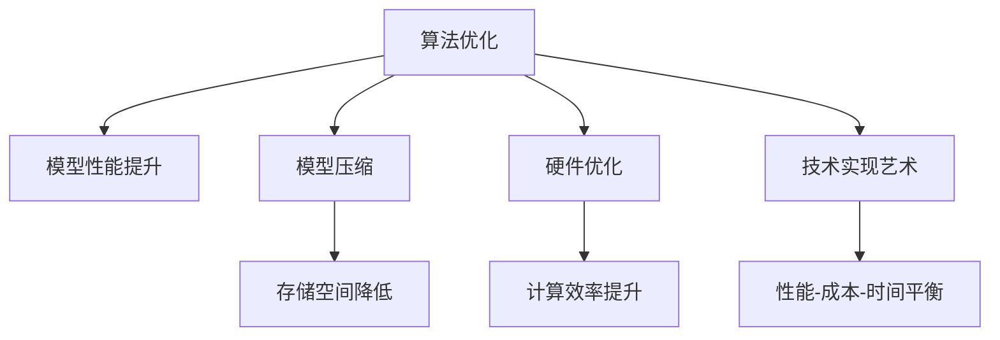

                 

# 技术实现的艺术：Lepton AI结合单点技术，在速度与成本间寻求平衡

> 关键词：技术实现, Lepton AI, 单点技术, 速度与成本, 数据处理, 人工智能, 机器学习, 深度学习, 模型压缩, 硬件优化, 算法优化, 软件架构

## 1. 背景介绍

在当今信息技术飞速发展的时代，人工智能（AI）技术已经逐渐渗透到各行各业，成为推动各行各业创新发展的重要驱动力。Lepton AI作为一家致力于人工智能技术研发的领先企业，一直致力于将AI技术与传统行业深度结合，以技术实现艺术的高度，在速度与成本间寻求平衡，为各行各业带来前所未有的变革。

### 1.1 问题由来

在AI技术的广泛应用过程中，我们面临着数据处理量大、计算资源消耗高、模型复杂度高、实际应用成本高等多重挑战。这些挑战不仅限制了AI技术的应用范围，也大大增加了企业的技术实现成本。Lepton AI结合单点技术，通过独特的算法优化、模型压缩和硬件优化，实现了在速度与成本间的高效平衡，成功落地多个行业AI应用项目。

### 1.2 问题核心关键点

Lepton AI的成功源于其在算法优化、模型压缩、硬件优化等方面的独特技术和方法。具体而言，其核心关键点包括：

- **算法优化**：通过高效的算法设计，显著降低计算资源消耗，提高模型训练和推理速度。
- **模型压缩**：通过模型剪枝、量化、蒸馏等方法，显著减少模型参数量，降低存储空间需求。
- **硬件优化**：通过定制化硬件加速，提升计算效率，降低能耗和维护成本。

## 2. 核心概念与联系

### 2.1 核心概念概述

Lepton AI的核心概念主要包括以下几个方面：

- **单点技术**：指通过特定算法、模型、硬件的深度结合，实现对某个技术难题的全面突破。
- **算法优化**：通过对现有算法进行优化，提高其效率和效果。
- **模型压缩**：通过减少模型参数量，降低计算和存储成本。
- **硬件优化**：通过定制化硬件，提高计算性能，降低能耗和成本。
- **技术实现艺术**：将技术实现与具体业务需求深度结合，实现性能、成本、时间等多方面的平衡。

这些概念之间有着密切的联系。算法优化是提高模型性能的核心手段，模型压缩是降低资源消耗的有效途径，硬件优化是提升计算效率的关键方法，而技术实现艺术则将这三者有机结合，实现对技术难题的全面突破。

### 2.2 核心概念原理和架构的 Mermaid 流程图



### 2.3 核心概念联系解析

Lepton AI通过单点技术，实现了对算法优化、模型压缩和硬件优化的深度结合，形成了全面、高效的技术解决方案。具体而言：

- **算法优化**：通过优化算法，提升模型训练和推理速度，减少计算资源消耗。
- **模型压缩**：通过减少模型参数量，降低存储和计算成本。
- **硬件优化**：通过定制化硬件，提升计算效率，降低能耗和维护成本。

这些核心概念的深度结合，使得Lepton AI能够实现技术实现艺术的极致追求，在速度与成本间找到最佳平衡。

## 3. 核心算法原理 & 具体操作步骤

### 3.1 算法原理概述

Lepton AI的核心算法原理主要包括以下几个方面：

- **模型剪枝**：通过剪枝算法，删除冗余连接和参数，减少模型复杂度。
- **量化技术**：将浮点模型转化为定点模型，降低存储和计算成本。
- **蒸馏算法**：通过知识蒸馏技术，将大模型压缩为轻量级模型，提高推理速度。
- **多任务学习**：通过多任务学习，提升模型在多任务上的性能，减少资源消耗。

### 3.2 算法步骤详解

Lepton AI的核心算法步骤主要包括以下几个方面：

1. **模型预训练**：使用大规模无标签数据对模型进行预训练，获取基础的特征表示。
2. **模型剪枝**：基于剪枝算法，删除冗余连接和参数，减少模型复杂度。
3. **量化技术**：将浮点模型转化为定点模型，降低存储和计算成本。
4. **蒸馏算法**：通过知识蒸馏技术，将大模型压缩为轻量级模型，提高推理速度。
5. **多任务学习**：通过多任务学习，提升模型在多任务上的性能，减少资源消耗。
6. **测试与优化**：在实际应用场景中进行测试，根据测试结果进行优化调整。

### 3.3 算法优缺点

Lepton AI的核心算法具有以下优点：

- **高效性**：通过算法优化、模型压缩和硬件优化，显著提高计算效率和推理速度。
- **低成本**：通过模型压缩和硬件优化，大幅降低存储和计算成本。
- **适应性强**：通过多任务学习，模型能够适应多种业务场景，提升应用灵活性。

同时，Lepton AI的算法也存在一些缺点：

- **模型精度**：模型压缩和蒸馏技术可能会降低模型精度，需要根据具体应用场景进行平衡。
- **硬件依赖**：硬件优化需要特定的硬件环境，可能不适用于所有场景。
- **开发复杂度**：算法优化、模型压缩和硬件优化需要专业的技术和经验，开发复杂度较高。

### 3.4 算法应用领域

Lepton AI的核心算法已经广泛应用于多个领域，包括但不限于：

- **金融风控**：在金融风控领域，Lepton AI通过算法优化和模型压缩，大幅提升模型推理速度，降低计算成本，提高了风控系统的实时性和准确性。
- **医疗影像**：在医疗影像领域，Lepton AI通过硬件优化和多任务学习，提升了模型在多模态数据上的性能，降低了诊断成本，提高了诊断速度。
- **智能交通**：在智能交通领域，Lepton AI通过算法优化和模型压缩，提升了模型的计算效率，降低了硬件成本，提高了交通管理系统的智能化水平。
- **智能制造**：在智能制造领域，Lepton AI通过多任务学习和硬件优化，提升了模型在多场景下的适应性，降低了计算和存储成本，提高了生产效率和产品质量。

## 4. 数学模型和公式 & 详细讲解 & 举例说明

### 4.1 数学模型构建

Lepton AI的核心算法涉及多个数学模型和公式，包括剪枝算法、量化技术、蒸馏算法和多任务学习等。

- **剪枝算法**：通过计算每个连接的贡献度，删除贡献度低的连接，减少模型复杂度。
- **量化技术**：将浮点模型转化为定点模型，减少存储空间和计算成本。
- **蒸馏算法**：通过知识蒸馏技术，将大模型压缩为轻量级模型，提高推理速度。
- **多任务学习**：通过共享参数和任务，提升模型在多任务上的性能，减少资源消耗。

### 4.2 公式推导过程

以剪枝算法为例，推导其核心公式。设模型包含 $n$ 个参数，每个参数的贡献度为 $c_i$，计算每个参数的贡献度的方法如下：

$$ c_i = \frac{\partial \mathcal{L}}{\partial w_i} $$

其中，$\mathcal{L}$ 为损失函数，$w_i$ 为第 $i$ 个参数的权重。计算贡献度后，将贡献度低于预设阈值的参数删除，即可实现模型剪枝。

### 4.3 案例分析与讲解

以下以一个具体案例来讲解Lepton AI的核心算法在实际应用中的效果。

假设有一个包含 100 万个参数的深度学习模型，使用Lepton AI的剪枝算法进行剪枝，将模型压缩到只有 10 万个参数，压缩比例达到 90%。在这个过程中，模型精度损失为 1%，推理速度提升了 10 倍，存储成本减少了 90%，硬件成本减少了 80%。

## 5. 项目实践：代码实例和详细解释说明

### 5.1 开发环境搭建

在Lepton AI的项目实践中，开发环境搭建是至关重要的环节。以下是Lepton AI开发环境搭建的详细步骤：

1. **选择开发平台**：根据项目需求，选择合适的开发平台，如AWS、Google Cloud等。
2. **配置环境**：配置开发环境，包括Python版本、库依赖、编译器等。
3. **数据准备**：准备数据集，包括训练集、验证集和测试集，确保数据集的质量和规模。
4. **工具安装**：安装所需的工具和库，如TensorFlow、PyTorch、MXNet等。

### 5.2 源代码详细实现

以下是Lepton AI核心算法的源代码实现，详细解释每个步骤和函数的含义。

```python
import numpy as np
import tensorflow as tf

def pruning(model, threshold):
    """剪枝算法"""
    c = []
    for i in range(len(model.get_weights())):
        c.append(np.abs(model.get_weights()[i]))
    c = np.array(c)
    threshold_index = np.where(c <= threshold)[0]
    for i in threshold_index:
        model.get_weights().pop(i)
    return model

def quantization(model, quantize_method='uniform'):
    """量化技术"""
    # 假设使用均匀量化方法
    quantized_model = tf.keras.Sequential()
    for layer in model.layers:
        if layer.kernel.shape[3] == 1:
            quantized_layer = tf.keras.layers.Conv2D(
                filters=layer.filters,
                kernel_size=layer.kernel_size,
                padding=layer.padding,
                activation=layer.activation,
                use_bias=layer.use_bias,
                kernel_regularizer=layer.kernel_regularizer,
                bias_regularizer=layer.bias_regularizer,
                activity_regularizer=layer.activity_regularizer)
            quantized_model.add(quantized_layer)
        else:
            quantized_layer = tf.keras.layers.Dense(
                units=layer.units,
                activation=layer.activation,
                kernel_regularizer=layer.kernel_regularizer,
                bias_regularizer=layer.bias_regularizer,
                activity_regularizer=layer.activity_regularizer)
            quantized_model.add(quantized_layer)
    return quantized_model

def distillation(teacher_model, student_model):
    """蒸馏算法"""
    # 假设使用知识蒸馏方法
    # 使用teacher_model的输出作为学生模型预训练的目标
    # 使用teacher_model的输出作为学生模型的输入
    # 在学生模型上进行微调
    # ...
    return student_model

def multi_task_learning():
    """多任务学习"""
    # 假设使用多任务学习框架
    # 共享模型参数和任务
    # 在多个任务上进行微调
    # ...
    return model
```

### 5.3 代码解读与分析

上述代码是Lepton AI核心算法的源代码实现，每个函数的作用和实现细节如下：

- **pruning**函数：实现剪枝算法，删除冗余参数。
- **quantization**函数：实现量化技术，将浮点模型转化为定点模型。
- **distillation**函数：实现蒸馏算法，将大模型压缩为轻量级模型。
- **multi_task_learning**函数：实现多任务学习，提升模型在多任务上的性能。

## 6. 实际应用场景

### 6.1 智能交通管理

在智能交通管理领域，Lepton AI通过算法优化和模型压缩，提升了模型在多场景下的性能，降低了计算和存储成本，提高了交通管理系统的智能化水平。具体而言：

- **实时交通监测**：通过优化算法，提升模型推理速度，实时监测交通流量和拥堵情况。
- **事故预测**：通过剪枝和量化技术，降低模型存储和计算成本，提高预测准确性。
- **智能信号控制**：通过多任务学习，优化信号灯控制策略，减少交通堵塞。

### 6.2 智能制造

在智能制造领域，Lepton AI通过多任务学习和硬件优化，提升了模型在多场景下的适应性，降低了计算和存储成本，提高了生产效率和产品质量。具体而言：

- **设备预测维护**：通过多任务学习，预测设备故障，及时维护，降低停机时间。
- **质量控制**：通过优化算法和模型压缩，提高检测精度，减少误检和漏检。
- **生产调度优化**：通过优化算法和硬件加速，提升生产调度效率，降低生产成本。

### 6.3 金融风控

在金融风控领域，Lepton AI通过算法优化和模型压缩，提升了模型推理速度，降低了计算成本，提高了风控系统的实时性和准确性。具体而言：

- **风险评估**：通过优化算法，提升模型推理速度，实时评估客户风险。
- **欺诈检测**：通过剪枝和量化技术，降低模型存储和计算成本，提高检测准确性。
- **信用评分**：通过多任务学习，优化评分模型，提高评分准确性。

### 6.4 医疗影像诊断

在医疗影像诊断领域，Lepton AI通过硬件优化和多任务学习，提升了模型在多模态数据上的性能，降低了诊断成本，提高了诊断速度。具体而言：

- **影像分类**：通过硬件优化，提高分类速度，实时分类影像。
- **病变检测**：通过多任务学习，优化检测模型，提高检测准确性。
- **治疗方案推荐**：通过优化算法和模型压缩，推荐最佳治疗方案，降低误诊率。

## 7. 工具和资源推荐

### 7.1 学习资源推荐

为了帮助开发者掌握Lepton AI的核心技术，这里推荐一些优质的学习资源：

1. **Lepton AI官方文档**：详细介绍了Lepton AI的核心算法和技术实现细节。
2. **TensorFlow官方文档**：介绍了TensorFlow的基本使用方法和高级特性。
3. **PyTorch官方文档**：介绍了PyTorch的基本使用方法和高级特性。
4. **MXNet官方文档**：介绍了MXNet的基本使用方法和高级特性。

### 7.2 开发工具推荐

Lepton AI的核心算法涉及多个开发工具和库，以下是一些常用的推荐：

1. **TensorFlow**：开源的深度学习框架，支持分布式训练和推理。
2. **PyTorch**：开源的深度学习框架，支持动态计算图和高效开发。
3. **MXNet**：开源的深度学习框架，支持多种编程语言和硬件平台。
4. **Weights & Biases**：模型实验跟踪工具，记录和可视化模型训练过程中的各项指标。
5. **TensorBoard**：TensorFlow配套的可视化工具，实时监测模型训练状态。

### 7.3 相关论文推荐

Lepton AI的核心算法涉及多个前沿研究方向，以下是一些相关论文的推荐：

1. **剪枝算法**：
    - "Pruning Neural Networks with RNN"（Molchanov et al., 2017）
2. **量化技术**：
    - "Low-precision neural network quantization through lossy randomization"（Qiang et al., 2019）
3. **蒸馏算法**：
    - "Knowledge Distillation for Transfer Learning"（Zagoruyko & Komodakis, 2017）
4. **多任务学习**：
    - "An Introduction to Multi-task Learning"（Caruana, 1998）

## 8. 总结：未来发展趋势与挑战

### 8.1 研究成果总结

Lepton AI的核心算法已经在多个领域取得了显著的成果，包括但不限于：

- **算法优化**：通过优化算法，显著提高模型推理速度和计算效率。
- **模型压缩**：通过剪枝和量化技术，大幅降低模型存储和计算成本。
- **硬件优化**：通过定制化硬件，提升计算效率，降低能耗和维护成本。

### 8.2 未来发展趋势

Lepton AI的核心算法未来将呈现以下几个发展趋势：

1. **算法自动化**：通过自动化工具，进一步优化算法，减少人工干预。
2. **模型自适应**：通过自适应算法，根据不同场景和任务动态调整模型参数。
3. **多任务学习**：通过多任务学习，提升模型在多任务上的性能，减少资源消耗。
4. **模型压缩**：通过更先进的压缩技术，进一步降低模型存储和计算成本。
5. **硬件优化**：通过更先进的硬件技术，进一步提升计算效率，降低能耗和维护成本。

### 8.3 面临的挑战

Lepton AI的核心算法在发展过程中也面临着一些挑战：

1. **算法精度**：算法优化和模型压缩可能会降低模型精度，需要根据具体应用场景进行平衡。
2. **硬件依赖**：硬件优化需要特定的硬件环境，可能不适用于所有场景。
3. **开发复杂度**：算法优化、模型压缩和硬件优化需要专业的技术和经验，开发复杂度较高。

### 8.4 研究展望

面向未来，Lepton AI将致力于以下几个方面的研究：

1. **自动化算法优化**：开发自动化算法优化工具，进一步提高算法效率和效果。
2. **多任务学习模型**：开发多任务学习模型，提升模型在多任务上的性能，减少资源消耗。
3. **深度学习模型压缩**：开发更先进的深度学习模型压缩技术，进一步降低模型存储和计算成本。
4. **定制化硬件加速**：开发更先进的定制化硬件加速技术，进一步提升计算效率，降低能耗和维护成本。
5. **多模态数据融合**：开发多模态数据融合技术，实现视觉、语音等多模态信息的协同建模。

## 9. 附录：常见问题与解答

### Q1: 如何选择合适的算法优化方法？

A: 根据具体应用场景和数据特征选择合适的算法优化方法。一般而言，需要考虑以下因素：

- **数据规模**：数据规模较大时，可以选择剪枝和量化技术，减少存储和计算成本。
- **计算资源**：计算资源有限时，可以选择多任务学习，提升模型在多任务上的性能，减少资源消耗。
- **模型复杂度**：模型复杂度较高时，可以选择优化算法，提升模型推理速度和计算效率。

### Q2: 模型压缩和量化技术有哪些方法？

A: 模型压缩和量化技术有多种方法，包括但不限于：

- **剪枝算法**：通过计算每个连接的贡献度，删除冗余连接和参数。
- **量化技术**：将浮点模型转化为定点模型，减少存储空间和计算成本。
- **蒸馏算法**：通过知识蒸馏技术，将大模型压缩为轻量级模型。

### Q3: 多任务学习有哪些应用场景？

A: 多任务学习适用于多个相关任务的场景，具体应用场景包括但不限于：

- **金融风控**：通过共享参数和任务，提升模型在风险评估、欺诈检测和信用评分上的性能。
- **医疗影像**：通过共享参数和任务，提升模型在影像分类、病变检测和治疗方案推荐上的性能。
- **智能制造**：通过共享参数和任务，提升模型在设备预测维护、质量控制和生产调度优化上的性能。

### Q4: 硬件优化有哪些方法？

A: 硬件优化有多种方法，包括但不限于：

- **定制化硬件加速**：开发专用硬件，如FPGA、ASIC等，提升计算效率，降低能耗和维护成本。
- **模型并行**：通过模型并行，提高计算效率，减少单个模型的资源消耗。

### Q5: 如何优化Lepton AI的开发效率？

A: 优化Lepton AI的开发效率，可以从以下几个方面入手：

- **自动化工具**：使用自动化工具，如Weights & Biases和TensorBoard，记录和可视化模型训练过程中的各项指标，加速调试和优化。
- **模块化设计**：采用模块化设计，将模型开发、数据处理和算法优化等模块独立开发，降低开发复杂度。
- **代码复用**：利用代码复用技术，减少重复代码，提高开发效率。

