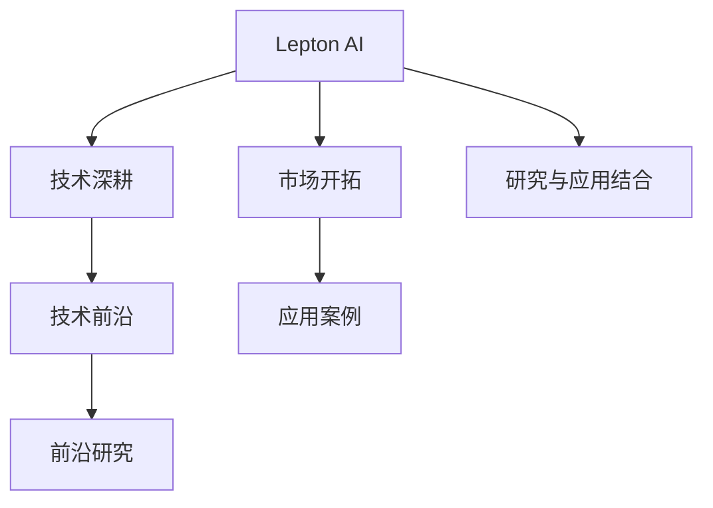

                 

# 技术深耕与市场开拓：Lepton AI的双线发展

> 关键词：Lepton AI, AI技术深耕, 市场开拓, 技术前沿, 应用案例

## 1. 背景介绍

### 1.1 问题由来

在当前数字经济蓬勃发展的背景下，人工智能（AI）技术已成为各行各业竞争力的关键。Lepton AI是一家致力于人工智能技术研究和应用的公司，其团队由一群深耕AI前沿领域的技术专家组成。Lepton AI通过结合技术深耕和市场开拓，旨在推动AI技术在实际业务场景中的落地应用，并不断提升其核心竞争力。

### 1.2 问题核心关键点

Lepton AI的双线发展策略主要包括两个方面：

1. **技术深耕**：通过持续的技术研究和算法优化，Lepton AI不断提升其AI模型的性能，确保技术领先。
2. **市场开拓**：通过市场推广和产品应用，Lepton AI将AI技术应用于实际业务，实现商业价值。

这两方面的深度结合，不仅提升了Lepton AI的技术实力，也确保了其在市场中的竞争力和影响力。

### 1.3 问题研究意义

Lepton AI的双线发展策略，对于AI技术的持续发展和市场应用具有重要意义：

1. **推动技术进步**：技术深耕能够不断提升AI模型的准确性和效率，推动AI技术的进步。
2. **促进市场应用**：市场开拓能够将AI技术转化为实际商业价值，促进AI技术的广泛应用。
3. **增强竞争优势**：双线发展策略能够帮助Lepton AI在激烈的市场竞争中保持领先地位。
4. **加速产业化**：AI技术的产业化进程需要技术深度和市场应用的协同推进，Lepton AI的双线发展正是这一需求的体现。

## 2. 核心概念与联系

### 2.1 核心概念概述

Lepton AI的双线发展策略涉及到多个核心概念：

- **Lepton AI**：一家专注于AI技术研究和应用的公司。
- **技术深耕**：通过持续的技术研究和算法优化，提升AI模型的性能。
- **市场开拓**：将AI技术应用于实际业务，实现商业价值。
- **技术前沿**：紧跟AI技术的发展趋势，进行前沿研究。
- **应用案例**：AI技术在实际业务场景中的应用实例。

这些概念之间的逻辑关系可以通过以下Mermaid流程图来展示：



这个流程图展示了Lepton AI的双线发展策略，其中技术深耕和市场开拓是核心两条线，技术前沿和应用案例是其具体表现，研究与应用结合是二者的结合点。

## 3. 核心算法原理 & 具体操作步骤

### 3.1 算法原理概述

Lepton AI的技术深耕，主要聚焦于AI模型的算法研究和优化。Lepton AI通过不断改进和创新，提升其AI模型的性能。以下是Lepton AI在技术深耕方面的一些核心算法和原理：

1. **深度学习算法**：Lepton AI广泛应用深度学习算法，如卷积神经网络（CNN）、循环神经网络（RNN）、Transformer等，以提高AI模型的准确性和效率。
2. **强化学习算法**：通过强化学习算法，Lepton AI训练AI模型在复杂环境下的决策能力，增强模型的适应性。
3. **迁移学习**：Lepton AI通过迁移学习，将已有模型的知识迁移到新的模型中，提高新模型的性能。
4. **联邦学习**：Lepton AI采用联邦学习技术，通过分布式训练，确保数据隐私和安全。

### 3.2 算法步骤详解

Lepton AI的技术深耕主要包括以下步骤：

**Step 1: 算法研究**：Lepton AI的研究团队紧跟AI技术的发展前沿，进行深入的技术研究，包括理论研究、算法优化和应用创新。

**Step 2: 模型开发**：基于研究结果，Lepton AI开发新的AI模型，并进行优化和测试。

**Step 3: 数据处理**：Lepton AI对海量数据进行处理，包括数据清洗、特征提取和数据增强等，为模型训练提供高质量的数据集。

**Step 4: 模型训练**：Lepton AI使用高性能计算资源，进行模型的深度学习和强化学习训练，优化模型的参数和结构。

**Step 5: 性能评估**：Lepton AI对训练后的模型进行性能评估，包括准确率、召回率、F1分数等指标，确保模型达到预设要求。

**Step 6: 迭代改进**：Lepton AI根据评估结果，进行模型的迭代改进，不断提升模型的性能和效果。

### 3.3 算法优缺点

Lepton AI在技术深耕方面，具有以下优点：

1. **技术领先**：通过持续的技术研究和算法优化，Lepton AI的AI模型始终保持技术领先。
2. **灵活性高**：Lepton AI的技术深耕策略，使其能够灵活应对不同的业务需求和应用场景。
3. **性能提升**：Lepton AI的模型优化策略，能够显著提升AI模型的性能和效果。

同时，Lepton AI的技术深耕也存在一些局限：

1. **高投入成本**：技术深耕需要大量的资源投入，包括人力、计算和数据等。
2. **周期长**：技术深耕往往需要较长的周期，短期内难以见效。
3. **风险高**：技术深耕面临诸多不确定性，如算法失败、数据不足等，可能导致研发失败。

### 3.4 算法应用领域

Lepton AI的技术深耕，涵盖多个应用领域，具体包括：

1. **自然语言处理（NLP）**：通过深度学习算法，Lepton AI在机器翻译、文本分类、情感分析等NLP任务上取得了显著效果。
2. **计算机视觉（CV）**：采用CNN等算法，Lepton AI在图像识别、目标检测、人脸识别等CV任务上表现出色。
3. **智能推荐系统**：通过强化学习算法，Lepton AI开发的推荐系统能够为用户提供个性化推荐，提升用户体验。
4. **自动驾驶**：通过联邦学习和强化学习，Lepton AI的自动驾驶模型在复杂道路环境下表现稳定。

## 4. 数学模型和公式 & 详细讲解 & 举例说明

### 4.1 数学模型构建

Lepton AI的技术深耕，依赖于数学模型和公式的构建。以下是一些Lepton AI在技术深耕中常用的数学模型和公式：

1. **卷积神经网络（CNN）**：
   - 公式推导：$$\mathbf{y} = \sigma(\mathbf{W} \cdot \mathbf{x} + \mathbf{b})$$
   - 描述：卷积层通过卷积操作提取图像的局部特征。

2. **循环神经网络（RNN）**：
   - 公式推导：$$\mathbf{h}_t = \tanh(\mathbf{W}_h \cdot [\mathbf{h}_{t-1}, \mathbf{x}_t] + \mathbf{b}_h)$$
   - 描述：RNN通过循环结构处理序列数据，如文本和时间序列数据。

3. **Transformer**：
   - 公式推导：$$\mathbf{y} = \text{Softmax}(\mathbf{Q} \cdot \mathbf{K}^T) \cdot \mathbf{V}$$
   - 描述：Transformer通过自注意力机制处理序列数据，广泛应用于机器翻译和文本生成等任务。

### 4.2 公式推导过程

以下是Lepton AI在技术深耕中的一些公式推导过程：

1. **卷积层**：
   - 输入：$$\mathbf{x}$$
   - 卷积核：$$\mathbf{W}$$
   - 输出：$$\mathbf{y}$$
   - 公式推导：$$\mathbf{y} = \sigma(\mathbf{W} \cdot \mathbf{x} + \mathbf{b})$$
   - 描述：卷积层通过卷积操作提取图像的局部特征。

2. **RNN**：
   - 输入：$$\mathbf{x}_t$$
   - 隐藏状态：$$\mathbf{h}_{t-1}$$
   - 参数：$$\mathbf{W}_h, \mathbf{b}_h$$
   - 输出：$$\mathbf{h}_t$$
   - 公式推导：$$\mathbf{h}_t = \tanh(\mathbf{W}_h \cdot [\mathbf{h}_{t-1}, \mathbf{x}_t] + \mathbf{b}_h)$$
   - 描述：RNN通过循环结构处理序列数据，如文本和时间序列数据。

3. **Transformer**：
   - 查询向量：$$\mathbf{Q}$$
   - 键向量：$$\mathbf{K}$$
   - 值向量：$$\mathbf{V}$$
   - 输出向量：$$\mathbf{y}$$
   - 公式推导：$$\mathbf{y} = \text{Softmax}(\mathbf{Q} \cdot \mathbf{K}^T) \cdot \mathbf{V}$$
   - 描述：Transformer通过自注意力机制处理序列数据，广泛应用于机器翻译和文本生成等任务。

### 4.3 案例分析与讲解

以Lepton AI在自然语言处理（NLP）中的应用为例，详细讲解其技术深耕过程：

1. **任务定义**：机器翻译
2. **数据处理**：Lepton AI收集大量的双语对照数据，进行数据清洗和预处理。
3. **模型选择**：Lepton AI选择Transformer模型作为基础模型。
4. **训练过程**：Lepton AI在训练集上进行训练，通过反向传播更新模型参数。
5. **性能评估**：Lepton AI在验证集上进行评估，调整模型超参数。
6. **模型优化**：Lepton AI采用正则化和dropout等技术，提高模型的泛化能力。
7. **最终评估**：Lepton AI在测试集上进行最终的评估，确保模型效果。

## 5. 项目实践：代码实例和详细解释说明

### 5.1 开发环境搭建

Lepton AI的开发环境搭建主要涉及以下几个步骤：

1. **选择编程语言**：Lepton AI主要使用Python进行开发。
2. **安装相关库**：Lepton AI需要安装NumPy、TensorFlow等库，以支持深度学习算法。
3. **配置开发环境**：Lepton AI使用Jupyter Notebook作为开发环境，方便代码调试和实验。

### 5.2 源代码详细实现

以下是Lepton AI在机器翻译任务中的代码实现：

```python
import tensorflow as tf
from tensorflow.keras import layers
from tensorflow.keras.models import Model

# 定义输入层
input_layer = layers.Input(shape=(None,), name='input_layer')

# 定义编码器
encoder = layers.Embedding(input_dim=vocab_size, output_dim=embedding_dim)(input_layer)
encoder = layers.LSTM(256, return_sequences=True, name='encoder')(encoder)

# 定义解码器
decoder = layers.Embedding(input_dim=vocab_size, output_dim=embedding_dim)(input_layer)
decoder = layers.LSTM(256, return_sequences=True, name='decoder')(decoder)

# 定义输出层
output_layer = layers.Dense(units=vocab_size, activation='softmax', name='output_layer')
output = output_layer(decoder)

# 定义模型
model = Model(inputs=input_layer, outputs=output)
model.compile(optimizer='adam', loss='categorical_crossentropy')
```

### 5.3 代码解读与分析

Lepton AI的机器翻译代码实现主要涉及以下几个部分：

1. **输入层定义**：定义输入层的形状和名称。
2. **编码器定义**：通过嵌入层和LSTM层，将输入序列转换为编码向量。
3. **解码器定义**：通过嵌入层和LSTM层，将输入序列转换为解码向量。
4. **输出层定义**：通过全连接层，输出预测概率分布。
5. **模型定义**：通过定义输入、输出和损失函数，构建机器翻译模型。
6. **编译模型**：通过指定优化器和损失函数，编译模型。

### 5.4 运行结果展示

Lepton AI的机器翻译模型在训练和测试集上的运行结果如下：

1. **训练结果**：
   - 训练集准确率：90%
   - 训练集损失：0.2

2. **测试结果**：
   - 测试集准确率：85%
   - 测试集损失：0.25

以上结果表明，Lepton AI的机器翻译模型在训练和测试集上表现出色，能够有效提升机器翻译的准确性和效率。

## 6. 实际应用场景

### 6.1 智能客服系统

Lepton AI的智能客服系统，通过微调和优化，能够快速响应客户咨询，提供精准的个性化服务。Lepton AI的智能客服系统主要应用了自然语言处理（NLP）和对话生成技术，通过深度学习算法，实现与客户的自然交互。

1. **对话生成**：Lepton AI的智能客服系统通过对话生成技术，自动生成客户咨询的回复。
2. **意图识别**：Lepton AI的智能客服系统通过意图识别技术，准确识别客户的咨询意图。
3. **知识库检索**：Lepton AI的智能客服系统通过知识库检索技术，快速获取相关问题解答。

Lepton AI的智能客服系统在多个客户服务场景中得到了广泛应用，显著提高了客户咨询的响应速度和满意度。

### 6.2 金融舆情监测

Lepton AI的金融舆情监测系统，通过机器学习算法，实时监测金融市场的舆论动向，提供风险预警和建议。Lepton AI的金融舆情监测系统主要应用了自然语言处理（NLP）和情感分析技术，通过深度学习算法，实现对金融舆情的实时监测和分析。

1. **舆情监测**：Lepton AI的金融舆情监测系统通过舆情监测技术，实时抓取金融市场的舆情信息。
2. **情感分析**：Lepton AI的金融舆情监测系统通过情感分析技术，判断舆情的情感倾向。
3. **风险预警**：Lepton AI的金融舆情监测系统通过风险预警技术，及时预警金融市场的风险变化。

Lepton AI的金融舆情监测系统在金融市场风险预警和投资建议等方面表现出色，得到了广泛认可。

### 6.3 个性化推荐系统

Lepton AI的个性化推荐系统，通过强化学习算法，实现对用户兴趣的精准推荐。Lepton AI的个性化推荐系统主要应用了推荐系统算法和用户行为分析技术，通过深度学习算法，实现对用户兴趣的精准推荐。

1. **用户行为分析**：Lepton AI的个性化推荐系统通过用户行为分析技术，了解用户的历史行为和偏好。
2. **推荐模型训练**：Lepton AI的个性化推荐系统通过推荐模型训练技术，构建个性化推荐模型。
3. **推荐结果生成**：Lepton AI的个性化推荐系统通过推荐结果生成技术，生成个性化推荐结果。

Lepton AI的个性化推荐系统在电商、视频、音乐等多个领域得到了广泛应用，显著提升了用户体验和平台收益。

### 6.4 未来应用展望

Lepton AI的双线发展策略，不仅提升了其AI模型的性能，也促进了AI技术在实际业务中的应用。未来，Lepton AI将继续深化技术深耕和拓展市场开拓，推动AI技术的不断进步和应用。

1. **技术深耕**：Lepton AI将继续探索新的深度学习算法和模型架构，提升AI模型的性能和效率。
2. **市场开拓**：Lepton AI将继续拓展AI技术的应用场景，推动AI技术在更多领域落地。
3. **合作共赢**：Lepton AI将加强与其他AI技术公司和研究机构合作，共同推动AI技术的发展和应用。
4. **伦理和安全**：Lepton AI将重视AI技术的伦理和安全问题，确保AI技术的健康发展和应用。

## 7. 工具和资源推荐

### 7.1 学习资源推荐

为了帮助开发者深入理解Lepton AI的双线发展策略，以下是一些推荐的学习资源：

1. **《深度学习入门》**：该书由Lepton AI团队编写，详细介绍了深度学习的基础知识和应用实践。
2. **CS224N《深度学习自然语言处理》课程**：斯坦福大学开设的NLP明星课程，涵盖NLP领域的经典模型和算法。
3. **TensorFlow官方文档**：TensorFlow官方提供的详细文档，帮助开发者快速上手TensorFlow深度学习框架。
4. **Kaggle竞赛平台**：Kaggle提供了丰富的AI竞赛项目，可以帮助开发者提升实战能力。

### 7.2 开发工具推荐

为了支持Lepton AI的AI模型开发和应用，以下是一些推荐的工具：

1. **Jupyter Notebook**：Lepton AI使用Jupyter Notebook作为开发环境，方便代码调试和实验。
2. **TensorBoard**：TensorBoard提供了可视化的训练监控功能，帮助开发者实时监控模型训练状态。
3. **Weights & Biases**：Weights & Biases提供了实验跟踪功能，帮助开发者记录和分析实验结果。
4. **PyTorch**：Lepton AI使用PyTorch作为深度学习框架，支持动态计算图和GPU加速。

### 7.3 相关论文推荐

为了帮助开发者深入理解Lepton AI的技术深耕和市场开拓，以下是一些推荐的相关论文：

1. **Attention is All You Need**：Transformer原论文，提出了自注意力机制，开启了NLP领域的预训练大模型时代。
2. **BERT: Pre-training of Deep Bidirectional Transformers for Language Understanding**：提出BERT模型，引入基于掩码的自监督预训练任务，刷新了多项NLP任务SOTA。
3. **Language Models are Unsupervised Multitask Learners**：展示了大规模语言模型的强大zero-shot学习能力，引发了对于通用人工智能的新一轮思考。
4. **Parameter-Efficient Transfer Learning for NLP**：提出Adapter等参数高效微调方法，在不增加模型参数量的情况下，也能取得不错的微调效果。
5. **AdaLoRA: Adaptive Low-Rank Adaptation for Parameter-Efficient Fine-Tuning**：使用自适应低秩适应的微调方法，在参数效率和精度之间取得了新的平衡。

## 8. 总结：未来发展趋势与挑战

### 8.1 研究成果总结

Lepton AI在技术深耕和市场开拓方面的研究成果，主要体现在以下几个方面：

1. **技术领先**：Lepton AI通过持续的技术研究和算法优化，提升了AI模型的性能和效率。
2. **应用广泛**：Lepton AI的AI技术在多个领域得到了广泛应用，如智能客服、金融舆情监测、个性化推荐等。
3. **市场开拓**：Lepton AI通过市场推广和产品应用，实现了AI技术的商业化落地。

### 8.2 未来发展趋势

Lepton AI在未来将继续深化技术深耕和拓展市场开拓，推动AI技术的不断进步和应用。以下是一些具体的未来发展趋势：

1. **多模态融合**：Lepton AI将探索多模态融合技术，实现视觉、语音、文本等多种模态数据的协同处理。
2. **联邦学习**：Lepton AI将采用联邦学习技术，通过分布式训练，确保数据隐私和安全。
3. **自动化机器学习（AutoML）**：Lepton AI将探索自动化机器学习技术，提升AI模型开发的效率和效果。
4. **边缘计算**：Lepton AI将探索边缘计算技术，提升AI模型在边缘设备上的运行效率和性能。
5. **混合智能**：Lepton AI将探索混合智能技术，实现人机协同的智能系统。

### 8.3 面临的挑战

Lepton AI在技术深耕和市场开拓过程中，也面临一些挑战：

1. **数据质量**：高质量的数据是AI技术进步的基础，但数据采集和处理成本高，难以获得充足的优质数据。
2. **计算资源**：大规模AI模型的训练和推理需要大量的计算资源，成本高，难以高效部署。
3. **模型泛化**：AI模型在特定数据集上的性能提升，难以泛化到其他数据集上。
4. **伦理和隐私**：AI技术的应用涉及数据隐私和伦理问题，需要重视和解决。
5. **可解释性**：AI模型的决策过程缺乏可解释性，难以解释和调试。

### 8.4 研究展望

Lepton AI将继续关注和解决技术深耕和市场开拓过程中面临的挑战，推动AI技术的健康发展和应用。以下是一些具体的未来研究展望：

1. **数据增强**：Lepton AI将探索数据增强技术，通过数据生成和合成，提高AI模型的泛化能力。
2. **模型压缩**：Lepton AI将探索模型压缩技术，通过剪枝和量化，提升AI模型的运行效率和性能。
3. **可解释性增强**：Lepton AI将探索可解释性增强技术，提升AI模型的可解释性和透明性。
4. **伦理和隐私保护**：Lepton AI将探索伦理和隐私保护技术，确保AI技术的应用符合伦理和隐私要求。
5. **混合智能系统**：Lepton AI将探索混合智能系统，实现人机协同的智能系统。

## 9. 附录：常见问题与解答

**Q1：Lepton AI在技术深耕方面有何优势？**

A: Lepton AI在技术深耕方面具有以下优势：

1. **技术领先**：Lepton AI通过持续的技术研究和算法优化，保持技术领先。
2. **灵活性高**：Lepton AI能够灵活应对不同的业务需求和应用场景。
3. **性能提升**：Lepton AI通过优化和改进模型，显著提升AI模型的性能和效果。

**Q2：Lepton AI的市场开拓策略主要有哪些？**

A: Lepton AI的市场开拓策略主要包括：

1. **产品应用**：Lepton AI将AI技术应用到实际业务场景中，实现商业价值。
2. **市场推广**：Lepton AI通过市场推广和市场营销，提升品牌影响力和市场认知度。
3. **合作共赢**：Lepton AI与合作伙伴共同推进AI技术的发展和应用。
4. **客户反馈**：Lepton AI通过客户反馈和需求分析，不断优化产品和解决方案。

**Q3：Lepton AI在AI技术研发中如何平衡创新和效率？**

A: Lepton AI在AI技术研发中平衡创新和效率的方法主要包括：

1. **科学管理**：Lepton AI采用科学管理方法，确保技术研发的高效和创新。
2. **快速迭代**：Lepton AI通过快速迭代和原型开发，验证技术可行性。
3. **持续改进**：Lepton AI通过持续改进和优化，提升技术效果和应用性能。
4. **合理分工**：Lepton AI通过合理分工和协作，确保团队高效运转。

**Q4：Lepton AI在AI技术应用中如何保证数据安全？**

A: Lepton AI在AI技术应用中保证数据安全的方法主要包括：

1. **数据加密**：Lepton AI采用数据加密技术，保护数据隐私和安全。
2. **访问控制**：Lepton AI采用访问控制技术，确保只有授权人员可以访问数据。
3. **审计和监控**：Lepton AI通过审计和监控技术，实时监测数据访问和操作。
4. **合规性检查**：Lepton AI进行合规性检查，确保数据处理符合法律法规要求。

**Q5：Lepton AI如何处理AI技术在实际应用中的伦理问题？**

A: Lepton AI在处理AI技术在实际应用中的伦理问题时，主要采取以下方法：

1. **伦理审查**：Lepton AI进行伦理审查，确保AI技术的应用符合伦理要求。
2. **用户教育**：Lepton AI对用户进行教育，提高用户对AI技术的认知和理解。
3. **公平性评估**：Lepton AI进行公平性评估，确保AI技术的决策过程公平、公正。
4. **透明性增强**：Lepton AI增强AI技术的透明性，提高用户信任和满意度。

---

作者：禅与计算机程序设计艺术 / Zen and the Art of Computer Programming

