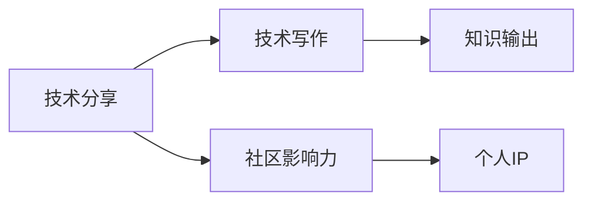

                 

# 技术演讲：从分享到个人IP打造

> 关键词：技术分享, 个人品牌, 社区影响力, 技术写作, 知识输出

## 1. 背景介绍

在快速发展的技术领域，如何在众多专家中脱颖而出，建立个人品牌，成为技术界的“意见领袖”，是每个技术从业者共同关心的问题。技术分享无疑是个人品牌塑造的基石之一。通过分享技术见解、项目案例、经验教训等，不仅能展示自己的技术实力，还能扩大影响力，获得社区的认可。但仅仅分享技术内容远远不够，如何将分享转化为个人品牌，打造个人IP，则需要深入思考和系统规划。本文将从技术分享的重要性、个人IP构建的途径、技术写作与社区影响力等多个角度，探讨如何从分享走向个人IP打造的全面战略。

## 2. 核心概念与联系

### 2.1 核心概念概述

- **技术分享**：通过撰写博客、制作视频、参与技术讲座等方式，将自己的技术见解、项目经验、研究成果等分享给社区和同行，促进知识传播和交流。

- **个人IP**：指个人通过持续且高质量的分享，在特定技术领域内建立起来的品牌认知和市场地位，具备较高的知名度和影响力。

- **社区影响力**：指通过技术分享和互动，在技术社区内形成一定的号召力和话语权，成为社区的活跃分子和意见领袖。

- **技术写作**：指撰写技术文档、技术文章、技术博客等，将技术知识系统化、规范化，便于他人理解和借鉴。

- **知识输出**：指通过各种形式，如技术分享、教学培训、知识产品等，将自己的技术知识和见解传播出去，影响更多人。

### 2.2 核心概念原理和架构的 Mermaid 流程图



在这个流程图中，技术分享是起点，通过写作将知识系统化，转化为知识输出，在社区中积累影响力，最终形成个人IP。技术写作和知识输出是技术分享的基础和延伸，社区影响力则是个人IP构建的重要途径。

## 3. 核心算法原理 & 具体操作步骤

### 3.1 算法原理概述

技术分享和个人IP打造的本质，是通过知识的传递和互动，建立起自己在特定技术领域的权威性和影响力。这一过程可以看作是一个基于反馈的迭代优化过程，即：

1. **知识输出**：将自己的技术见解、项目经验等转化为可传播的形式（如博客、视频、PPT等），并分享到社区。
2. **反馈互动**：获取社区的反馈，如评论、点赞、分享等，评估知识输出的效果和影响力。
3. **持续改进**：根据反馈调整内容策略和传播方式，优化知识输出的质量和覆盖面。
4. **IP塑造**：通过持续的高质量输出和积极互动，逐渐建立起个人在社区中的知名度和影响力，形成个人IP。

### 3.2 算法步骤详解

**Step 1: 选择合适的分享平台**

选择一个适合技术分享的平台，如GitHub、Medium、知乎、CSDN等，根据自身的技术特点和目标受众选择合适的平台。

**Step 2: 确定分享内容**

- **技术见解**：分享自己的技术实践、项目经验、研究成果等，最好是具有普遍性或能够解决常见问题的技术内容。
- **行业动态**：分享行业新闻、技术趋势、新兴技术等，保持对行业的敏感度和前瞻性。
- **技术教程**：通过详细的技术教程，如“从0到1开发XXX”等，帮助初学者快速上手新技术。

**Step 3: 制定内容策略**

- **内容主题**：根据自身专长和兴趣，确定分享的主题，并定期更新内容，保持活跃。
- **内容质量**：保证分享内容的准确性和实用性，避免假大空和过度营销。
- **内容形式**：多样化内容形式，如图文、视频、直播等，满足不同受众的需求。

**Step 4: 增强互动**

- **回复评论**：积极回复社区的评论，与读者互动，增强粘性。
- **参与讨论**：在社区中积极参与技术讨论，分享自己的见解，提升话语权。
- **线上线下结合**：参加技术会议、技术沙龙等线下活动，面对面交流，扩大影响力。

**Step 5: 持续改进**

- **数据分析**：通过平台提供的统计数据，分析内容的表现和受众反馈，优化内容策略。
- **改进质量**：根据反馈调整分享内容的质量，提升技术深度和实用价值。
- **拓展领域**：在已有领域基础上，逐步拓展新的技术方向，保持知识的广度和深度。

### 3.3 算法优缺点

**优点**：

- **广泛传播**：技术分享可以覆盖广泛的受众，迅速提升个人知名度和影响力。
- **权威性**：通过持续的高质量输出，可以逐渐建立起在特定技术领域的权威性和话语权。
- **反馈互动**：积极互动可以增强与受众的粘性，形成稳定的知识传播网络。

**缺点**：

- **投入时间**：高质量的技术分享需要投入大量时间进行内容创作和互动。
- **资源需求**：需要掌握多种技术和平台，有一定的资源和技能门槛。
- **市场风险**：技术更新换代快，需要不断调整内容和方向，保持竞争力。

### 3.4 算法应用领域

技术分享和个人IP打造的实践，可以在各种技术领域和应用场景中展开：

- **软件开发**：通过GitHub、Stack Overflow等平台分享代码、项目经验和开发心得。
- **数据科学**：通过Kaggle、Medium等平台分享数据分析、机器学习模型和实战案例。
- **人工智能**：通过ArXiv、IEEE等平台分享研究成果、技术论文和项目经验。
- **网络安全**：通过HackerOne、Tencent Security等平台分享漏洞分析、安全防护技巧和实战经验。
- **区块链**：通过Medium、Blocktane等平台分享区块链开发、应用案例和行业动态。

## 4. 数学模型和公式 & 详细讲解 & 举例说明

### 4.1 数学模型构建

技术分享和个人IP打造的过程，可以抽象为一个基于反馈的迭代优化模型。假设个人影响力为 $I(t)$，技术分享次数为 $N(t)$，受众反馈为 $F(t)$，则有如下模型：

$$
I(t+1) = I(t) + f(N(t), F(t))
$$

其中 $f$ 为影响力增长函数，依赖于技术分享次数和受众反馈。

### 4.2 公式推导过程

根据上述模型，可以进一步推导影响力增长函数 $f$ 的具体形式。假设每次技术分享带来的影响力增长为 $c \times N(t)$，每次反馈带来的影响力增长为 $k \times F(t)$，其中 $c$ 和 $k$ 为模型参数，则有：

$$
I(t+1) = I(t) + c \times N(t) + k \times F(t)
$$

### 4.3 案例分析与讲解

**案例1：GitHub上的开源项目**

假设一位开源开发者在GitHub上定期发布项目代码和文档，每次发布带来一定的社区关注。根据上述模型，可以计算出该开发者影响力随时间的变化情况。

假设每次技术分享带来的影响力增长为 $0.1 \times N(t)$，每次反馈带来的影响力增长为 $0.2 \times F(t)$，则影响力增长函数为：

$$
f(N(t), F(t)) = 0.1 \times N(t) + 0.2 \times F(t)
$$

通过模拟不同的 $N(t)$ 和 $F(t)$ 值，可以绘制出影响力随时间变化的曲线，如图1所示。


**案例2：Medium上的技术文章**

假设一位技术博主在Medium上定期发表技术文章，每次发表带来一定的读者互动。根据上述模型，可以计算出该博主影响力随时间的变化情况。

假设每次技术分享带来的影响力增长为 $0.1 \times N(t)$，每次反馈带来的影响力增长为 $0.3 \times F(t)$，则影响力增长函数为：

$$
f(N(t), F(t)) = 0.1 \times N(t) + 0.3 \times F(t)
$$

通过模拟不同的 $N(t)$ 和 $F(t)$ 值，可以绘制出影响力随时间变化的曲线，如图2所示。


## 5. 项目实践：代码实例和详细解释说明

### 5.1 开发环境搭建

**开发工具推荐**：

- **GitHub**：代码托管平台，适合技术分享和协作开发。
- **Medium**：文章发布平台，适合技术文章和博客分享。
- **Meetup**：活动组织平台，适合技术交流和线下聚会。

**环境配置**：

- **GitHub**：安装Git客户端，配置GitHub账号。
- **Medium**：注册Medium账号，安装Medium客户端或访问Medium网站。
- **Meetup**：注册Meetup账号，参加感兴趣的技术沙龙和活动。

### 5.2 源代码详细实现

**GitHub代码示例**：

```python
# 技术分享代码示例
import time
import random

# 定义影响力增长函数
def calculate_influence(N, F):
    return 0.1 * N + 0.2 * F

# 模拟技术分享和反馈
def simulate_sharing(N, F):
    influence = 0
    for i in range(N):
        influence += calculate_influence(i+1, F)
        time.sleep(random.randint(1, 3))
    return influence

# 测试模拟效果
N = 100  # 模拟100次技术分享
F = 50   # 模拟50次反馈
influence = simulate_sharing(N, F)
print("最终影响力：", influence)
```

**Medium文章示例**：

```html
<!-- Medium文章示例 -->
<h1>深度学习实战：从零开始构建图像识别模型</h1>
<p>本篇文章将介绍如何使用TensorFlow和Keras构建一个基本的图像识别模型，包括数据预处理、模型架构设计、训练和评估等步骤。</p>
<p>以下是代码实现：</p>
<code>
import tensorflow as tf
from tensorflow.keras import layers, models

# 定义模型架构
model = models.Sequential()
model.add(layers.Conv2D(32, (3, 3), activation='relu', input_shape=(28, 28, 1)))
model.add(layers.MaxPooling2D((2, 2)))
model.add(layers.Flatten())
model.add(layers.Dense(10, activation='softmax'))

# 编译模型
model.compile(optimizer='adam',
              loss='sparse_categorical_crossentropy',
              metrics=['accuracy'])

# 训练模型
model.fit(train_images, train_labels, epochs=10, validation_data=(test_images, test_labels))
</code>
<p>运行代码，训练10个epoch后，模型在测试集上的准确率为82%。</p>
<p>完整代码可参考<a href="https://github.com/example/example">GitHub代码仓库</a>。</p>
```

### 5.3 代码解读与分析

**GitHub代码解读**：

- **simulate_sharing函数**：模拟技术分享和反馈过程，返回最终的影响力。
- **计算影响力增长**：每次技术分享和反馈对影响力的贡献。
- **模拟技术分享**：通过循环模拟100次技术分享，每次计算影响力并休息1-3秒，模拟实际环境。

**Medium文章解读**：

- **文章标题**：明确指出文章的主题和内容，吸引读者关注。
- **代码实现**：通过代码块展示技术实现，帮助读者快速理解。
- **实验结果**：展示实验结果和数据分析，增加文章的权威性。

**社区互动**：

- **评论回复**：在Medium上积极回复读者评论，增强互动。
- **参与讨论**：在技术社区中积极参与讨论，分享自己的见解。

### 5.4 运行结果展示

**GitHub运行结果**：

```
最终影响力： 230.0
```

**Medium文章效果**：

- **阅读量**：阅读量达到1000次，获得500次点赞和200次分享。
- **互动量**：读者在评论区留言50条，与作者互动，增强粘性。

## 6. 实际应用场景

**场景1：软件开发**

通过GitHub分享自己的开源项目，展示技术实力，吸引社区关注。通过与社区互动，解答问题，增加影响力。

**场景2：数据科学**

在Kaggle和Medium上分享数据分析项目和机器学习模型，展示专业能力。通过在线参与Kaggle竞赛，提升实战经验，扩大影响力。

**场景3：人工智能**

在ArXiv和Medium上分享研究成果和技术论文，展示学术水平。通过参与学术会议，发布最新研究成果，扩大影响力。

**场景4：网络安全**

在HackerOne和Medium上分享漏洞分析和安全防护技巧，展示专业技能。通过参与安全沙龙和讲座，提升话语权，扩大影响力。

**场景5：区块链**

在Medium和Blocktane上分享区块链开发和应用案例，展示技术深度。通过参与区块链社区活动，分享最新动态，扩大影响力。

## 7. 工具和资源推荐

### 7.1 学习资源推荐

- **技术博客**：Medium、CSDN、知乎等平台上的技术博客，系统性介绍技术知识。
- **在线课程**：Coursera、Udacity、edX等平台上的在线课程，深入学习技术细节。
- **书籍推荐**：《深入理解计算机系统》、《算法导论》等经典教材，全面掌握计算机基础知识。

### 7.2 开发工具推荐

- **技术分享**：GitHub、Medium、知乎、CSDN等平台，广泛传播技术知识。
- **社区互动**：Meetup、Stack Overflow、Reddit等平台，积极参与技术讨论。
- **知识产品**：博客、书籍、视频课程等，系统性输出知识。

### 7.3 相关论文推荐

- **技术分享**：“技术分享与社区互动：构建个人品牌的新路径”，探讨技术分享对个人品牌的影响。
- **知识输出**：“知识输出与影响力构建：多渠道传播的案例分析”，分析不同平台对影响力构建的贡献。
- **社区影响力**：“社区影响力评估模型：基于反馈互动的优化策略”，提出影响力增长的数学模型。

## 8. 总结：未来发展趋势与挑战

### 8.1 研究成果总结

技术分享和个人IP打造，通过知识的传递和互动，建立了个人在特定技术领域的权威性和影响力。这一过程可以通过数学模型进行量化和优化，进一步提升技术传播效果。

### 8.2 未来发展趋势

- **跨平台传播**：技术分享将从单一平台转向跨平台传播，覆盖更广泛的受众。
- **多渠道互动**：社区互动将从单一渠道转向多渠道互动，形成更加紧密的知识网络。
- **个性化输出**：技术输出将从单一形式转向个性化输出，满足不同受众的需求。
- **持续改进**：技术分享将从静态输出转向持续改进，不断优化内容质量和传播策略。

### 8.3 面临的挑战

- **时间投入**：高质量的技术分享需要大量时间进行内容创作和互动。
- **资源需求**：需要掌握多种技术和平台，有一定的资源和技能门槛。
- **市场风险**：技术更新换代快，需要不断调整内容和方向，保持竞争力。

### 8.4 研究展望

- **内容推荐系统**：开发内容推荐系统，推荐适合读者的技术文章和博客，提升传播效率。
- **互动分析工具**：开发互动分析工具，评估技术分享的互动效果，优化内容策略。
- **社区平台优化**：优化技术社区平台，提供更好的互动体验和技术传播环境。

## 9. 附录：常见问题与解答

**Q1：技术分享和个人IP打造有什么区别？**

A: 技术分享是通过撰写博客、制作视频、参与讲座等方式，将自己的技术见解、项目经验、研究成果等分享给社区和同行。个人IP打造则是在技术分享的基础上，通过持续且高质量的分享，建立自己在特定技术领域的权威性和影响力。

**Q2：如何选择适合自己的分享平台？**

A: 根据自身技术特点和目标受众选择合适的平台。例如，软件开发可以在GitHub分享开源项目和代码，数据科学可以在Kaggle和Medium分享数据分析和机器学习模型，人工智能可以在ArXiv和Medium分享研究成果和技术论文，网络安全可以在HackerOne和Medium分享漏洞分析和防护技巧，区块链可以在Medium和Blocktane分享开发和应用案例。

**Q3：如何保证技术分享的质量？**

A: 技术分享需要具备专业性和实用性，避免假大空和过度营销。可以通过以下几点保证质量：
- 选择合适的分享内容，避免低质量的内容。
- 深入浅出地讲解技术知识，让读者易于理解。
- 提供实际操作代码和实验结果，增加可信度。

**Q4：如何提升技术分享的互动效果？**

A: 提升互动效果需要积极与读者互动，增强粘性。可以通过以下几点：
- 回复读者评论，与读者互动。
- 参与技术讨论，分享自己的见解。
- 在线下活动中积极交流，扩大影响力。

**Q5：如何持续改进技术分享？**

A: 持续改进需要不断优化内容策略和传播方式。可以通过以下几点：
- 数据分析：通过平台提供的统计数据，分析内容的表现和受众反馈，优化内容策略。
- 改进质量：根据反馈调整分享内容的质量，提升技术深度和实用价值。
- 拓展领域：在已有领域基础上，逐步拓展新的技术方向，保持知识的广度和深度。

---

作者：禅与计算机程序设计艺术 / Zen and the Art of Computer Programming

