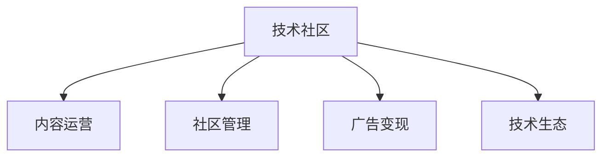

                 

# 技术社区运营：影响力变现

## 1. 背景介绍

### 1.1 问题由来
在当今数字化和信息化快速发展的时代，技术社区作为信息交流和技术传播的重要平台，其影响力日益增强。从开源项目到科技博客，从在线论坛到社交媒体，技术社区已经成为了技术创新、知识分享和人才培养的关键场所。如何通过运营技术社区，最大化其影响力，实现商业价值和社会价值的双重提升，成为了许多企业和技术组织面临的重要课题。

### 1.2 问题核心关键点
技术社区的影响力变现，关键在于如何通过高效的内容运营、精准的社区管理以及深度的用户互动，构建和维护一个富有活力的技术生态系统。具体而言，包括以下几个核心问题：

1. **内容生产与质量控制**：技术社区的内容应以原创性、深度和实用性为核心，如何持续产出高质量内容，是提升社区影响力的关键。
2. **用户互动与社区氛围**：良好的用户互动和积极的社区氛围，能够吸引更多用户参与，并促进知识交流和技术分享。
3. **商业合作与广告变现**：如何通过商业合作和广告变现，实现社区的盈利，同时保持社区的独立性和健康发展。
4. **技术生态与人才培养**：技术社区不仅是技术交流的平台，也是技术人才的孵化器，如何培养和吸引技术人才，构建良性生态，是社区持续发展的基石。

### 1.3 问题研究意义
研究技术社区运营的影响力变现，对于推动技术创新、促进知识共享、提升社区价值具有重要意义。通过系统化的运营策略和技术手段，技术社区不仅能吸引更多的用户和开发者，还能为技术企业和人才提供更为广阔的发展空间。这不仅有助于企业实现商业目标，也为技术创新和文化传播提供了新的途径。

## 2. 核心概念与联系

### 2.1 核心概念概述

为更好地理解技术社区运营的影响力变现方法，本节将介绍几个密切相关的核心概念：

- **技术社区(Community)**：指由技术爱好者、开发者、企业等构成的在线或线下的组织，旨在促进技术交流、知识分享、项目协作等。
- **内容运营(Content Operation)**：指通过规划、生产和分发内容，提升技术社区的吸引力和用户粘性，包括技术文章、项目教程、代码示例等。
- **社区管理(Community Management)**：指通过管理和引导用户行为，构建和维护良好的社区氛围，包括用户互动、版主审核、活动组织等。
- **广告变现(Ad Venture)**：指通过在技术社区中植入广告、合作推广等方式，实现社区的商业化盈利。
- **技术生态(Technology Ecosystem)**：指由技术社区、企业、开发者、用户等构成的相互依存、相互促进的生态系统，有助于技术人才的培养和技术的传播。

这些核心概念之间的逻辑关系可以通过以下Mermaid流程图来展示：



这个流程图展示了一副技术社区的生态全景图：

1. **内容运营**：社区的基础在于高质量的内容，通过内容运营，不断吸引和留住用户。
2. **社区管理**：良好的社区管理能够促进用户间的互动和合作，构建健康的社区氛围。
3. **广告变现**：商业化变现是社区可持续发展的重要保障，通过广告和合作，实现商业价值。
4. **技术生态**：社区生态的健康发展，有助于技术人才的培养和技术的传播，形成良性循环。

## 3. 核心算法原理 & 具体操作步骤

### 3.1 算法原理概述

技术社区运营的影响力变现，本质上是一个多目标优化问题。其核心思想是：通过内容运营和社区管理，最大化社区的影响力和用户互动，同时通过广告变现，实现社区的商业化目标。

形式化地，设 $C$ 为技术社区的用户活跃度，$Q$ 为内容质量评分，$A$ 为广告收入，则社区的影响力变现可以表示为：

$$
Maximize: C + A
$$

其中 $C$ 和 $Q$ 成正比关系，$A$ 与用户量 $U$ 和广告转化率 $\alpha$ 成正比，即：

$$
C = k \times Q \quad (k > 0)
$$
$$
A = \beta \times U \times \alpha \quad (\beta > 0)
$$

通过优化内容质量和广告策略，最大化社区的用户活跃度和广告收入，实现社区影响力的变现。

### 3.2 算法步骤详解

技术社区运营的影响力变现一般包括以下几个关键步骤：

**Step 1: 内容规划与生产**
- 确定社区定位和目标受众，制定内容策略。
- 建立内容生产团队，涵盖技术文章、项目教程、案例分析等多种形式。
- 引入用户生成内容(User Generated Content, UGC)，激发用户参与热情。

**Step 2: 社区运营与用户互动**
- 设计用户互动机制，如论坛、评论区、问答等。
- 引入版主和管理员，进行内容审核和用户引导。
- 定期举办线上线下活动，增强社区凝聚力。

**Step 3: 广告策略与变现**
- 选择合适的广告平台和广告形式，如横幅广告、原生广告、定向推广等。
- 进行广告投放测试，优化广告定位和投放策略。
- 实时监测广告效果，调整投放参数。

**Step 4: 技术生态建设与人才培养**
- 引入企业、开发者和学术机构等外部资源，构建多层次的技术生态。
- 提供开发者工具和资源，支持技术项目的孵化和推广。
- 设立技术奖项和竞赛，激励技术创新和社区活跃。

**Step 5: 数据监控与优化**
- 监控社区的关键指标，如用户活跃度、内容质量、广告转化率等。
- 根据监控数据，不断调整运营策略，优化社区管理。
- 持续优化内容生产流程，提升内容质量。

### 3.3 算法优缺点

技术社区运营的影响力变现方法具有以下优点：

1. **提升用户粘性**：通过持续产出高质量内容，提升用户活跃度和参与度。
2. **商业化盈利**：通过广告变现，实现社区的商业价值，支持社区的可持续发展。
3. **促进技术创新**：构建技术生态，吸引和培养技术人才，推动技术创新。
4. **灵活性高**：灵活调整内容策略和广告策略，适应不同的市场需求。

同时，该方法也存在一定的局限性：

1. **成本投入高**：内容生产和社区管理需要投入大量的人力和物力资源。
2. **广告效果难以保证**：广告的转化率和效果受多种因素影响，存在不确定性。
3. **用户质量参差不齐**：社区用户基础广泛，用户质量和需求多样，难以完全满足。
4. **生态平衡难维**：技术生态的构建和维护需要持续的投入和引导，平衡难度较大。

尽管存在这些局限性，但就目前而言，这种综合性的社区运营方法仍是实现技术社区影响力变现的主要范式。未来相关研究的重点在于如何进一步降低运营成本，提高广告效果，同时兼顾用户粘性和技术生态的平衡。

### 3.4 算法应用领域

技术社区运营的影响力变现方法，已经在许多领域得到了应用，例如：

- **开源社区**：如GitHub、Stack Overflow等，通过内容生产和用户互动，提升社区活跃度，并通过广告和赞助实现商业化。
- **技术博客**：如CSDN、博客园等，通过文章和教程吸引用户，通过广告和会员服务变现。
- **开发者论坛**：如Stack Exchange、Quora等，通过问答和讨论，促进技术交流，通过广告和用户订阅变现。
- **技术会议和活动**：如TechCrunch Disrupt、Google I/O等，通过技术分享和交流，提升品牌影响力，通过赞助和展位实现商业化。

这些领域的技术社区，通过系统的运营策略和技术手段，成功地实现了用户粘性和商业价值的双重提升。

## 4. 数学模型和公式 & 详细讲解 & 举例说明

### 4.1 数学模型构建

为了更好地理解技术社区运营的影响力变现，我们将其抽象为一个多目标优化问题。设社区用户数为 $U$，内容质量评分为 $Q$，广告转化率为 $\alpha$，广告收入为 $A$。社区的用户活跃度 $C$ 与内容质量 $Q$ 成正比，与广告收入 $A$ 也成正比，即：

$$
C = k \times Q
$$
$$
A = \beta \times U \times \alpha
$$

其中 $k$ 和 $\beta$ 为比例系数，$k > 0$，$\beta > 0$。社区的总影响力变现可以表示为：

$$
Maximize: C + A
$$

### 4.2 公式推导过程

假设社区的目标是最大化用户活跃度 $C$ 和广告收入 $A$，则优化目标为：

$$
Maximize: kQ + \beta U \alpha
$$

约束条件为：
1. 内容质量 $Q$ 不超过一定的阈值 $Q_{max}$，即 $Q \leq Q_{max}$。
2. 用户数 $U$ 不超过社区的承载上限 $U_{max}$，即 $U \leq U_{max}$。
3. 广告转化率 $\alpha$ 不超过一定的阈值 $\alpha_{max}$，即 $\alpha \leq \alpha_{max}$。

我们可以使用拉格朗日乘数法来求解这个多目标优化问题。设 $\lambda_1$、$\lambda_2$ 和 $\lambda_3$ 为拉格朗日乘数，则拉格朗日函数为：

$$
\mathcal{L}(Q, U, \alpha, \lambda_1, \lambda_2, \lambda_3) = kQ + \beta U \alpha - \lambda_1 (Q - Q_{max}) - \lambda_2 (U - U_{max}) - \lambda_3 (\alpha - \alpha_{max})
$$

对 $Q$、$U$、$\alpha$ 求偏导，得：

$$
\frac{\partial \mathcal{L}}{\partial Q} = k - \lambda_1 = 0
$$
$$
\frac{\partial \mathcal{L}}{\partial U} = \beta \alpha - \lambda_2 = 0
$$
$$
\frac{\partial \mathcal{L}}{\partial \alpha} = \beta U - \lambda_3 = 0
$$

解以上方程组，得到：

$$
Q = \frac{k}{\lambda_1}, \quad U = \frac{\beta \alpha}{\lambda_2}, \quad \alpha = \frac{\lambda_3}{\beta U}
$$

代入约束条件 $Q \leq Q_{max}$、$U \leq U_{max}$、$\alpha \leq \alpha_{max}$，得：

$$
Q = \min(Q_{max}, \frac{k}{\lambda_1}), \quad U = \min(U_{max}, \frac{\beta \alpha_{max}}{\lambda_2}), \quad \alpha = \min(\alpha_{max}, \frac{\lambda_3}{\beta Q_{max}})
$$

由此，我们得到了社区用户活跃度、广告收入与内容质量、广告转化率之间的优化关系。

### 4.3 案例分析与讲解

以下以开源社区GitHub为例，分析其实现社区影响力变现的具体策略：

GitHub的成功，离不开其系统的运营策略和技术手段：

1. **内容生产**：GitHub通过技术文章、项目教程、代码示例等内容，持续吸引开发者用户。
2. **社区管理**：GitHub设立开源项目管理员和版主，审核项目质量，引导用户行为。
3. **广告变现**：GitHub通过广告位和赞助商合作，实现商业变现。
4. **技术生态**：GitHub通过GitHub Jobs、GitHub Sponsors等平台，构建开发者生态，促进技术创新。

GitHub通过以上策略，成功地实现了社区用户活跃度和广告收入的同步提升，成为全球最大的代码托管平台和开发者社区。

## 5. 项目实践：代码实例和详细解释说明

### 5.1 开发环境搭建

在进行技术社区运营实践前，我们需要准备好开发环境。以下是使用Python进行Flask开发的环境配置流程：

1. 安装Anaconda：从官网下载并安装Anaconda，用于创建独立的Python环境。

2. 创建并激活虚拟环境：
```bash
conda create -n community-env python=3.8 
conda activate community-env
```

3. 安装Flask：
```bash
pip install flask
```

4. 安装各类工具包：
```bash
pip install numpy pandas scikit-learn requests
```

完成上述步骤后，即可在`community-env`环境中开始社区运营实践。

### 5.2 源代码详细实现

下面以一个简单的社区论坛为例，给出使用Flask框架构建社区运营系统的PyTorch代码实现。

首先，定义论坛的数据模型和视图函数：

```python
from flask import Flask, render_template, request
from flask_sqlalchemy import SQLAlchemy

app = Flask(__name__)
app.config['SQLALCHEMY_DATABASE_URI'] = 'sqlite:///forum.db'
db = SQLAlchemy(app)

class Post(db.Model):
    id = db.Column(db.Integer, primary_key=True)
    title = db.Column(db.String(120), nullable=False)
    content = db.Column(db.Text, nullable=False)
    timestamp = db.Column(db.DateTime, default=datetime.now)

@app.route('/')
def index():
    posts = Post.query.all()
    return render_template('index.html', posts=posts)

@app.route('/post', methods=['POST'])
def add_post():
    title = request.form.get('title')
    content = request.form.get('content')
    post = Post(title=title, content=content)
    db.session.add(post)
    db.session.commit()
    return redirect('/')

@app.route('/edit/<id>')
def edit_post(id):
    post = Post.query.get(id)
    return render_template('edit.html', post=post)

@app.route('/update/<id>', methods=['POST'])
def update_post(id):
    post = Post.query.get(id)
    post.title = request.form.get('title')
    post.content = request.form.get('content')
    db.session.commit()
    return redirect('/')
```

然后，定义论坛的模板和样式：

```html
<!-- index.html -->
<html>
<head>
    <title>My Community</title>
    <style>
        body {font-family: Arial, sans-serif; margin: 20px; line-height: 1.6;}
        h1 {margin-bottom: 10px;}
        .post {margin-bottom: 20px;}
        .post p {margin: 5px 0;}
    </style>
</head>
<body>
    <h1>My Community</h1>
    
        <div class="post">
            <h2><a href="/post/{{ post.id }}">{{ post.title }}</a></h2>
            <p>{{ post.content }}</p>
            <p><a href="/edit/{{ post.id }}">Edit</a></p>
        </div>
    
    <form method="post">
        <input type="text" name="title" placeholder="Enter Title" required>
        <textarea name="content" placeholder="Enter Content" required></textarea>
        <button type="submit">Submit</button>
    </form>
</body>
</html>
```

最后，启动论坛服务器：

```bash
flask run
```

在浏览器中访问`http://127.0.0.1:5000`，即可启动论坛，进行内容发布和编辑。

### 5.3 代码解读与分析

让我们再详细解读一下关键代码的实现细节：

**Post类**：
- 定义了论坛的帖子数据模型，包含ID、标题、内容和时间戳。

**Flask框架**：
- 使用Flask框架，定义了三个路由函数，分别处理主页、添加帖子和编辑帖子。
- 利用SQLAlchemy进行数据库操作，实现了帖子的创建、查询和更新。

**模板和样式**：
- 使用模板引擎渲染HTML页面，提供论坛界面。
- 通过CSS样式，美化论坛页面。

该代码实现了一个基本的技术社区论坛，能够支持内容的发布和编辑。当然，实际应用中还需要考虑更多的功能，如用户登录、权限控制、广告植入等，才能实现全面的社区运营。

## 6. 实际应用场景

### 6.1 智能客服系统

技术社区运营的影响力变现方法，在智能客服系统中得到了广泛的应用。智能客服系统通过构建技术社区，吸引开发者和企业入驻，提供技术支持和解决方案，提升了用户满意度和服务效率。

在技术社区中，智能客服系统可以通过以下方式实现影响力变现：

1. **知识库构建**：收集社区中的技术问题和解决方案，构建知识库，提升客服系统的智能水平。
2. **社区广告**：在社区中植入广告，获取广告收入。
3. **企业合作**：引入企业入驻，提供技术支持和解决方案，实现盈利。
4. **开发者奖励**：通过技术竞赛和开发者奖励计划，激励开发者贡献内容，提升社区活跃度。

通过这些策略，智能客服系统不仅实现了商业化盈利，还提升了用户体验和技术支持水平，实现了多方共赢。

### 6.2 技术教育平台

技术社区运营的影响力变现方法，在技术教育平台中也得到了广泛应用。技术教育平台通过构建技术社区，吸引开发者和学生入驻，提供技术学习资源和交流平台，提升了教育质量和用户粘性。

在技术教育平台中，影响力变现可以采取以下方式：

1. **课程销售**：通过技术课程和在线培训，实现商业变现。
2. **社区广告**：在社区中植入广告，获取广告收入。
3. **企业合作**：引入企业入驻，提供实习和就业机会，实现盈利。
4. **知识分享**：通过知识分享和答疑平台，提升用户粘性和平台影响力。

通过这些策略，技术教育平台不仅实现了商业化盈利，还提升了教育质量和用户参与度，实现了多方共赢。

### 6.3 技术咨询平台

技术社区运营的影响力变现方法，在技术咨询平台中得到了广泛应用。技术咨询平台通过构建技术社区，吸引技术专家和企业入驻，提供技术咨询和解决方案，提升了用户满意度和服务效率。

在技术咨询平台中，影响力变现可以采取以下方式：

1. **专家答疑**：通过技术专家答疑和社区讨论，提升用户满意度。
2. **社区广告**：在社区中植入广告，获取广告收入。
3. **企业合作**：引入企业入驻，提供技术支持和解决方案，实现盈利。
4. **知识分享**：通过技术文章和案例分享，提升用户粘性和平台影响力。

通过这些策略，技术咨询平台不仅实现了商业化盈利，还提升了服务质量和用户满意度，实现了多方共赢。

### 6.4 未来应用展望

随着技术社区运营的影响力变现方法不断成熟，未来将有更广泛的应用场景：

1. **医疗健康**：构建医疗健康社区，吸引医生和患者入驻，提供健康咨询和解决方案，提升医疗服务质量。
2. **金融科技**：构建金融科技社区，吸引开发者和金融机构入驻，提供金融技术支持和解决方案，提升金融服务效率。
3. **旅游出行**：构建旅游出行社区，吸引游客和旅游企业入驻，提供旅游攻略和解决方案，提升旅游体验。
4. **教育培训**：构建教育培训社区，吸引教师和学生入驻，提供教育资源和交流平台，提升教育质量。

这些领域的社区运营，有望进一步拓展技术社区的影响力和商业价值，为各行各业带来新的变革和机遇。

## 7. 工具和资源推荐

### 7.1 学习资源推荐

为了帮助开发者系统掌握技术社区运营的影响力变现理论基础和实践技巧，这里推荐一些优质的学习资源：

1. **《社区运营实战指南》**：一本系统介绍社区运营策略和技术实现的书，涵盖内容规划、用户互动、广告变现等核心环节。
2. **Coursera《社区管理》课程**：由知名社区运营专家讲授，深入浅出地介绍了社区运营的各个方面。
3. **《社区运营的艺术》**：一篇介绍社区运营经验的博客文章，详细分析了社区运营的关键要素和实战策略。
4. **HubSpot《社区运营指南》**：一份社区运营的官方指南，提供了全面的社区运营策略和技术工具。
5. **Slack《社区管理》白皮书**：一份Slack社区管理的白皮书，提供了详细的社区运营案例和最佳实践。

通过对这些资源的学习实践，相信你一定能够快速掌握技术社区运营的影响力变现的精髓，并用于解决实际的社区运营问题。

### 7.2 开发工具推荐

高效的开发离不开优秀的工具支持。以下是几款用于技术社区运营开发的常用工具：

1. **Flask**：基于Python的Web框架，支持动态Web应用开发，适合社区论坛和问答系统。
2. **Django**：基于Python的全栈Web框架，支持社区管理、论坛和用户互动等功能。
3. **Redis**：高性能的内存数据库，支持社区中的缓存和数据存储。
4. **Elasticsearch**：分布式搜索和分析引擎，支持社区中的数据搜索和全文检索。
5. **Hadoop**：大数据处理框架，支持社区中的大数据分析和统计。

合理利用这些工具，可以显著提升技术社区运营的开发效率，加快创新迭代的步伐。

### 7.3 相关论文推荐

技术社区运营的影响力变现技术，已经引起了学界的广泛关注，以下是几篇奠基性的相关论文，推荐阅读：

1. **《社区运营的算法化》**：提出基于算法推荐和内容自动化的社区运营方法，提高了社区内容的质量和用户粘性。
2. **《社区广告的多层次优化》**：研究社区广告的投放策略和效果评估，提供了多层次的广告优化方法。
3. **《社区生态的构建与维护》**：分析社区生态的构建要素和维护策略，提供了社区发展的系统化方案。
4. **《社区运营的多目标优化》**：引入多目标优化方法，提升社区的用户活跃度和广告收入。
5. **《社区运营的持续学习》**：研究社区运营的持续学习模型，提升了社区的适应性和动态调整能力。

这些论文代表了大社区运营的影响力变现技术的发展脉络。通过学习这些前沿成果，可以帮助研究者把握学科前进方向，激发更多的创新灵感。

## 8. 总结：未来发展趋势与挑战

### 8.1 总结

本文对技术社区运营的影响力变现方法进行了全面系统的介绍。首先阐述了技术社区运营的背景和重要性，明确了运营社区的目标和关键要素。其次，从原理到实践，详细讲解了社区运营的数学模型和关键步骤，给出了社区运营的完整代码实例。同时，本文还广泛探讨了社区运营在多个行业领域的应用前景，展示了运营社区的巨大潜力。此外，本文精选了社区运营的相关学习资源，力求为读者提供全方位的技术指引。

通过本文的系统梳理，可以看到，技术社区运营的影响力变现方法已经成为技术社区发展的核心驱动力，极大地提升了社区的用户粘性、广告收入和生态建设水平。得益于系统的运营策略和技术手段，技术社区不仅能吸引更多的用户和开发者，还能为技术企业和人才提供更为广阔的发展空间。这不仅有助于企业实现商业目标，也为技术创新和文化传播提供了新的途径。

### 8.2 未来发展趋势

展望未来，技术社区运营的影响力变现技术将呈现以下几个发展趋势：

1. **智能化运营**：引入人工智能和机器学习技术，提升社区的智能水平，实现自动化内容推荐和用户互动。
2. **多模态运营**：融合视觉、语音、文本等多模态数据，提供更加丰富的社区体验。
3. **全球化运营**：构建全球化的技术社区，提升社区的国际影响力和用户基数。
4. **持续化运营**：通过持续学习和适应，提升社区的动态调整能力和适应性。
5. **隐私化运营**：加强用户隐私保护，提升社区的用户信任度和用户粘性。

这些趋势凸显了技术社区运营的影响力变现技术的广阔前景。这些方向的探索发展，必将进一步提升社区的用户粘性和商业价值，为技术创新和文化传播带来新的动力。

### 8.3 面临的挑战

尽管技术社区运营的影响力变现技术已经取得了显著成果，但在迈向更加智能化、全球化和持续化运营的过程中，它仍面临诸多挑战：

1. **用户隐私保护**：社区运营过程中需要收集用户数据，如何平衡用户隐私保护和社区运营的需要，是一个亟待解决的问题。
2. **用户信任建立**：社区运营需要建立用户的信任，如何通过透明度和公正性，提升用户对社区的信任度，是社区运营的重要课题。
3. **内容质量和多样性**：社区内容的质量和多样性直接影响用户粘性，如何持续产出高质量内容，满足用户的多样需求，是一个长期挑战。
4. **社区生态平衡**：社区生态的构建和维护需要持续的投入和引导，如何平衡社区的多方利益，形成良性循环，是一个复杂的问题。
5. **技术实现难度**：社区运营涉及多方面的技术实现，如何综合运用多种技术手段，实现全面的社区运营，是一个技术挑战。

这些挑战需要社区运营者不断探索和创新，结合实际情况，灵活调整运营策略，才能实现社区的可持续发展。

### 8.4 研究展望

面对技术社区运营的影响力变现所面临的诸多挑战，未来的研究需要在以下几个方面寻求新的突破：

1. **隐私保护技术**：引入区块链和联邦学习等技术，提升社区的用户隐私保护水平。
2. **智能推荐算法**：研发基于深度学习和强化学习的智能推荐算法，提升社区内容的质量和用户粘性。
3. **社区多模态融合**：探索视觉、语音、文本等多模态数据的融合技术，提升社区的多样性和用户体验。
4. **全球化运营策略**：构建全球化的技术社区，提升社区的国际影响力和用户基数。
5. **持续学习机制**：引入持续学习机制，提升社区的动态调整能力和适应性。

这些研究方向的探索，必将引领技术社区运营的影响力变现技术迈向更高的台阶，为构建安全、可靠、可解释、可控的智能系统铺平道路。面向未来，技术社区运营的影响力变现技术还需要与其他人工智能技术进行更深入的融合，如知识表示、因果推理、强化学习等，多路径协同发力，共同推动社区运营的进步。只有勇于创新、敢于突破，才能不断拓展社区的边界，让社区运营的影响力变现技术更好地造福人类社会。

## 9. 附录：常见问题与解答

**Q1：如何构建技术社区的用户粘性？**

A: 构建技术社区的用户粘性，关键在于持续产出高质量的内容，提升社区的吸引力和用户互动。具体策略包括：

1. **内容多样化**：提供多样化的内容形式，如技术文章、项目教程、案例分析等，满足不同用户的需求。
2. **用户互动机制**：引入评论区、问答、论坛等功能，促进用户间的互动和交流。
3. **社区活动**：定期举办线上线下活动，增强社区凝聚力。
4. **激励机制**：设立技术奖项和竞赛，激励用户贡献内容，提升用户粘性。

**Q2：如何提高技术社区的广告效果？**

A: 提高技术社区的广告效果，可以从以下几个方面入手：

1. **精准定向**：通过用户画像和兴趣标签，实现广告的精准定向投放。
2. **创意设计**：设计有吸引力的广告创意，提升广告的点击率和转化率。
3. **持续优化**：实时监测广告效果，不断调整广告策略和投放参数，提升广告ROI。
4. **合作平台**：选择与社区用户基础匹配的广告平台，提高广告的曝光率和转化率。

**Q3：如何构建技术社区的多元化生态？**

A: 构建技术社区的多元化生态，需要从以下几个方面入手：

1. **引入多方资源**：引入企业、开发者、学术机构等外部资源，丰富社区的多元化生态。
2. **合作项目**：设立技术项目和竞赛，促进社区内外的合作和交流。
3. **知识分享**：通过技术文章、视频、教程等多种形式，分享知识和经验，提升社区的影响力。
4. **开发者支持**：提供开发者工具和资源，支持技术项目的孵化和推广。

**Q4：如何提升技术社区的用户信任度？**

A: 提升技术社区的用户信任度，关键在于增强社区的透明度和公正性：

1. **开放透明**：公开社区的运营规则和决策过程，增强用户对社区的信任。
2. **用户参与**：引入用户参与社区治理，增强用户对社区的归属感。
3. **问题反馈**：设立问题反馈渠道，及时处理用户投诉和建议，提升用户满意度。
4. **社区规则**：建立社区规则和标准，维护社区秩序，保护用户权益。

**Q5：如何应对技术社区的多样化需求？**

A: 应对技术社区的多样化需求，需要从以下几个方面入手：

1. **用户画像**：通过数据分析和用户调查，了解用户的多样需求和兴趣。
2. **内容定制**：根据用户画像，定制个性化的内容和服务，满足用户的多样需求。
3. **灵活策略**：采用灵活的内容策略和广告策略，适应用户的多样需求。
4. **用户体验**：通过提升用户体验，增强用户的满意度和粘性。

---

作者：禅与计算机程序设计艺术 / Zen and the Art of Computer Programming

