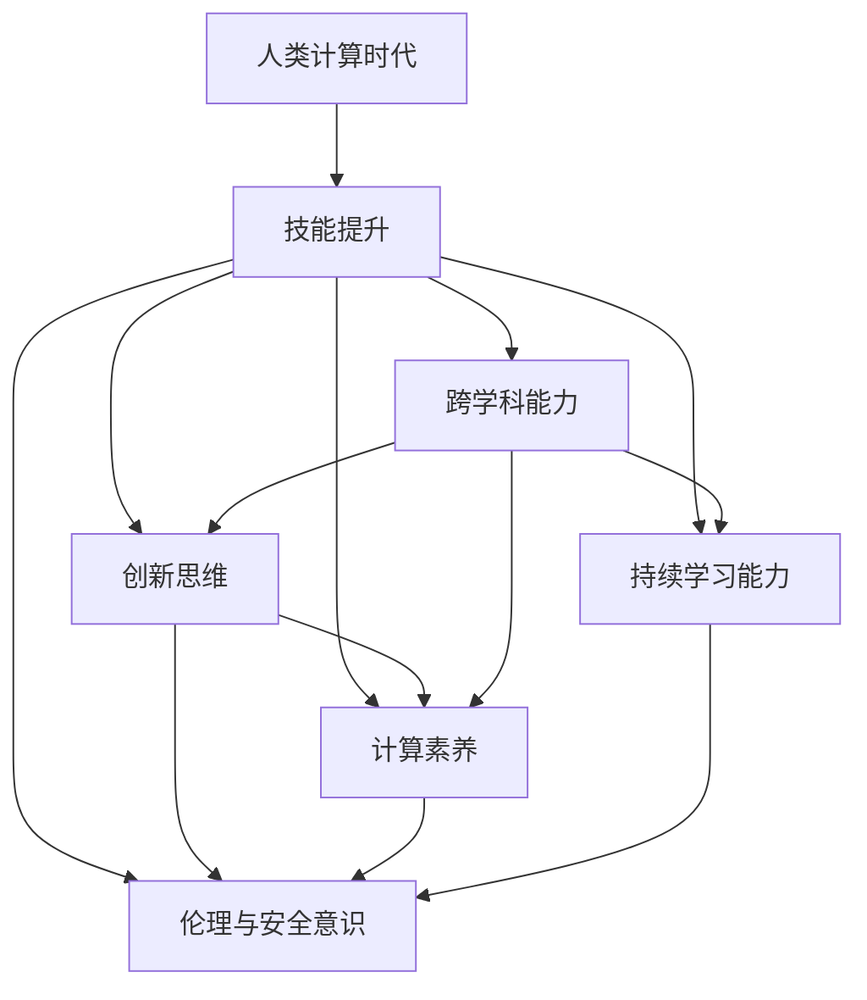

                 

# 技能提升：适应人类计算时代的新需求

## 1. 背景介绍

随着科技的飞速发展，人类社会正步入一个新的计算时代——人类计算时代。与过去的计算模式相比，人类计算时代更加注重算法、模型、数据的融合，强调智能、动态、可持续的发展。这种新的计算模式要求我们重新审视技能提升的方式，特别是面向未来的人才需求，如跨学科能力、创新思维、计算素养等。本文将从人类计算时代的背景出发，探讨在新的计算模式下，技能提升的新需求及其应对策略。

### 1.1 问题由来

21世纪以来，人工智能、大数据、云计算等新兴技术快速崛起，极大地改变了人类的工作方式和生活模式。然而，这些技术在带来便利的同时，也提出了新的挑战。例如，随着算法复杂性的增加，开发和维护成本也显著上升；数据量的激增导致存储和处理的成本增加；跨领域知识的需求变得越来越高。这些问题的解决，需要新型的计算能力，需要新的技术思维，需要更高的技能水平。

### 1.2 问题核心关键点

在人类计算时代，技能提升的核心关键点包括：

1. **跨学科能力**：现代技术往往涉及多个学科的知识，开发人员需要具备计算机科学、数学、统计学、心理学等多方面的知识和能力。
2. **创新思维**：能够根据实际情况，设计出有效的算法和模型，解决复杂问题。
3. **计算素养**：理解计算过程和结果，能够进行数据分析、模型训练和性能评估。
4. **持续学习能力**：不断学习新知识、新技术，适应快速变化的环境。
5. **伦理与安全意识**：在技术开发和应用中，考虑伦理和社会责任，避免产生负面影响。

这些关键点在未来的计算时代将变得越来越重要，它们不仅影响个人的职业发展，也关系到技术的社会效益。

## 2. 核心概念与联系

### 2.1 核心概念概述

为更好地理解技能提升在人类计算时代的新需求，本节将介绍几个关键概念及其关联：

- **人类计算时代**：指利用人类智慧与计算技术相结合，进行复杂问题的解决，强调知识、算法、数据的深度融合。
- **技能提升**：指通过培训和学习，提升个人或团队的技术能力和知识水平。
- **跨学科能力**：指具备计算机科学、数学、统计学等多方面的知识和技能，能够跨领域协同工作。
- **创新思维**：指创造性地解决复杂问题，能够设计高效算法和模型。
- **计算素养**：指理解计算过程，进行数据分析、模型训练和评估的能力。
- **持续学习能力**：指在不断变化的技术环境中，获取新知识、新技术的能力。
- **伦理与安全意识**：指在技术开发和应用中，考虑伦理和社会责任，避免产生负面影响。

这些概念之间的联系可以通过以下Mermaid流程图来展示：



这个流程图展示了技能提升在人类计算时代的各个关键点之间的联系：

1. 跨学科能力是技能提升的基础，能够更好地进行算法设计和模型训练。
2. 创新思维是基于跨学科能力进行复杂问题解决的重要手段。
3. 计算素养是技能提升的实践部分，能够进行数据分析和模型评估。
4. 持续学习能力是技能提升的长期保障，保持技术更新和知识增长。
5. 伦理与安全意识是技能提升的道德底线，确保技术的正面社会效应。

## 3. 核心算法原理 & 具体操作步骤

### 3.1 算法原理概述

技能提升在人类计算时代的新需求，主要体现在对新算法的探索、跨领域知识的应用、持续学习的维持等方面。这些需求可以通过算法化的方式进行规范和实现。

基于监督学习的大语言模型微调方法，虽然在NLP领域取得了巨大成功，但其原理和步骤同样可以借鉴应用到技能提升的实践中。具体来说，可以通过监督学习的方法，利用已有的大规模数据集，训练一个能够进行任务预测的模型，然后通过不断优化模型，逐步提升模型的性能和泛化能力。

### 3.2 算法步骤详解

基于监督学习的方法，技能提升可以概括为以下几个关键步骤：

**Step 1: 收集和准备数据集**
- 收集与技能提升相关的数据集，包括课程内容、案例分析、实际项目等。
- 对数据集进行标注和清洗，确保数据的质量和可靠性。

**Step 2: 设计任务适配层**
- 根据具体技能提升任务，设计相应的任务适配层，例如文本分类、情感分析、序列生成等。
- 确定模型结构，如选择不同的神经网络层、激活函数、优化器等。

**Step 3: 设置超参数**
- 确定学习率、批大小、迭代次数等超参数，并进行初始化。
- 设置正则化技术，如L2正则、Dropout等，以防止过拟合。

**Step 4: 训练模型**
- 将数据集划分为训练集、验证集和测试集，使用训练集进行模型训练。
- 在每个epoch结束时，在验证集上评估模型性能，并根据性能调整超参数。
- 使用测试集进行最终的性能评估。

**Step 5: 应用和优化**
- 将训练好的模型应用到实际技能提升中，根据反馈不断优化模型。
- 引入对抗样本、数据增强等技术，提升模型的鲁棒性和泛化能力。

**Step 6: 持续学习**
- 定期更新数据集，重新训练模型，以适应技能提升的新需求。
- 利用元学习、自适应学习等技术，加速模型更新。

### 3.3 算法优缺点

基于监督学习的技能提升方法具有以下优点：
1. 简单高效。利用已有数据集，可以快速训练出性能良好的模型。
2. 可扩展性强。可以针对不同的技能提升任务进行定制化设计。
3. 效果显著。通过不断优化模型，可以逐步提升模型的性能和泛化能力。

同时，该方法也存在一些局限性：
1. 依赖标注数据。技能提升的数据集需要大量标注，获取成本较高。
2. 过拟合风险。模型容易出现过拟合，泛化能力有限。
3. 数据多样性不足。数据集的多样性对模型的泛化能力影响较大。
4. 可解释性差。模型缺乏可解释性，难以对其内部工作机制进行调试。

尽管存在这些局限性，但就目前而言，基于监督学习的技能提升方法仍然是一种高效、实用、易于实现的方法。未来相关研究的重点在于如何进一步降低数据标注成本，提高模型的泛化能力和可解释性。

### 3.4 算法应用领域

基于监督学习的技能提升方法，在许多领域中得到了广泛应用，例如：

- **教育培训**：利用课程内容进行文本分类、情感分析等任务，辅助学生学习。
- **软件开发**：利用案例分析、代码生成等任务，帮助开发者提升编程技能。
- **数据分析**：利用序列生成、图像识别等任务，辅助数据科学家进行数据分析和模型训练。
- **项目管理**：利用任务分类、流程优化等任务，帮助项目经理提升项目管理能力。
- **用户交互设计**：利用交互设计、用户体验分析等任务，提升产品设计水平。

除了上述这些经典应用外，基于监督学习的技能提升方法也被创新性地应用到更多场景中，如知识图谱构建、自然语言处理等，为技能提升提供了新的思路。

## 4. 数学模型和公式 & 详细讲解 & 举例说明

### 4.1 数学模型构建

在技能提升的监督学习中，我们通常使用二分类模型（如逻辑回归、SVM等）来预测任务结果。设模型为$f(x; \theta)$，其中$x$为输入特征，$\theta$为模型参数。假设我们有$m$个训练样本$(x_i, y_i)$，其中$y_i \in \{0,1\}$，则模型的经验风险可以表示为：

$$
\mathcal{L}(\theta) = -\frac{1}{m} \sum_{i=1}^m y_i \log f(x_i; \theta) + (1-y_i) \log (1-f(x_i; \theta))
$$

其中$\log f(x_i; \theta)$表示模型对输入$x_i$的预测结果，$y_i$表示真实标签。

### 4.2 公式推导过程

以上公式展示了逻辑回归模型的经验风险，其中负对数似然函数用于衡量模型预测结果与真实标签之间的差异。假设我们使用的是随机梯度下降（SGD）算法，则模型参数的更新公式为：

$$
\theta \leftarrow \theta - \eta \nabla_{\theta} \mathcal{L}(\theta)
$$

其中$\eta$为学习率，$\nabla_{\theta} \mathcal{L}(\theta)$为损失函数对模型参数的梯度。

在实际操作中，我们通常使用交叉熵损失函数来计算二分类任务的经验风险。假设模型输出为$f(x; \theta) = \frac{1}{1+\exp(-z(x; \theta))}$，其中$z(x; \theta) = x^T \theta$，则交叉熵损失函数为：

$$
\mathcal{L}(\theta) = -\frac{1}{m} \sum_{i=1}^m [y_i \log f(x_i; \theta) + (1-y_i) \log (1-f(x_i; \theta))]
$$

基于此，我们可以推导出逻辑回归模型的梯度计算公式：

$$
\frac{\partial \mathcal{L}(\theta)}{\partial \theta_j} = -\frac{1}{m} \sum_{i=1}^m [y_i (1-f(x_i; \theta)) x_i]_j
$$

其中$(x_i; \theta)$表示输入$x_i$在模型$f(x; \theta)$下的输出。

### 4.3 案例分析与讲解

为了更好地理解逻辑回归模型的应用，我们可以通过一个简单的案例进行讲解。

假设我们要训练一个模型，预测某学校的学生是否参加了某项活动。我们收集了500名学生的问卷数据，其中300人参加了活动，200人没有参加。我们将问卷数据分为特征$x$和标签$y$：

$$
x = \begin{bmatrix}
1 & 1 & 1 & 0 & 0 & 0 \\
1 & 1 & 1 & 0 & 0 & 1 \\
1 & 1 & 0 & 1 & 1 & 0 \\
1 & 0 & 0 & 1 & 0 & 0 \\
1 & 1 & 1 & 1 & 1 & 1 \\
1 & 1 & 0 & 1 & 1 & 1
\end{bmatrix}, \quad y = \begin{bmatrix}
1 & 0 & 1 & 1 & 0 & 1
\end{bmatrix}
$$

我们的模型是逻辑回归，使用SGD算法进行训练。假设初始参数为$\theta_0 = \begin{bmatrix} 0 \\ 0 \\ 0 \end{bmatrix}$，学习率为$\eta = 0.1$。我们进行迭代优化，直到收敛：

1. 初始化参数$\theta_0 = \begin{bmatrix} 0 \\ 0 \\ 0 \end{bmatrix}$
2. 计算损失函数$\mathcal{L}(\theta_0) = -0.693$
3. 计算梯度$\frac{\partial \mathcal{L}(\theta_0)}{\partial \theta} = \begin{bmatrix} 0.5 \\ 0.5 \\ 0.5 \end{bmatrix}$
4. 更新参数$\theta_1 = \theta_0 - 0.1 \times \begin{bmatrix} 0.5 \\ 0.5 \\ 0.5 \end{bmatrix} = \begin{bmatrix} 0.45 \\ 0.45 \\ 0.45 \end{bmatrix}$
5. 计算损失函数$\mathcal{L}(\theta_1) = -0.736$
6. 计算梯度$\frac{\partial \mathcal{L}(\theta_1)}{\partial \theta} = \begin{bmatrix} 0.45 \\ 0.45 \\ 0.45 \end{bmatrix}$
7. 更新参数$\theta_2 = \theta_1 - 0.1 \times \begin{bmatrix} 0.45 \\ 0.45 \\ 0.45 \end{bmatrix} = \begin{bmatrix} 0.35 \\ 0.35 \\ 0.35 \end{bmatrix}$
8. 重复上述步骤，直到损失函数收敛。

通过这个过程，我们可以看到，模型参数$\theta$随着梯度下降，不断逼近最优解。最终，我们可以得到模型的预测结果，并在实际应用中不断优化和调整。

## 5. 项目实践：代码实例和详细解释说明

### 5.1 开发环境搭建

在进行技能提升的监督学习实践前，我们需要准备好开发环境。以下是使用Python进行PyTorch开发的环境配置流程：

1. 安装Anaconda：从官网下载并安装Anaconda，用于创建独立的Python环境。

2. 创建并激活虚拟环境：
```bash
conda create -n pytorch-env python=3.8 
conda activate pytorch-env
```

3. 安装PyTorch：根据CUDA版本，从官网获取对应的安装命令。例如：
```bash
conda install pytorch torchvision torchaudio cudatoolkit=11.1 -c pytorch -c conda-forge
```

4. 安装TensorFlow：
```bash
pip install tensorflow==2.0
```

5. 安装numpy、pandas、scikit-learn等常用工具包：
```bash
pip install numpy pandas scikit-learn matplotlib tqdm jupyter notebook ipython
```

完成上述步骤后，即可在`pytorch-env`环境中开始监督学习的实践。

### 5.2 源代码详细实现

下面我们以二分类任务为例，给出使用PyTorch进行监督学习的PyTorch代码实现。

首先，定义模型和数据：

```python
from sklearn.datasets import load_breast_cancer
from sklearn.model_selection import train_test_split
import torch
from torch.utils.data import TensorDataset, DataLoader
from torch import nn, optim
from sklearn.preprocessing import StandardScaler

# 加载数据集
data = load_breast_cancer()
X, y = data.data, data.target

# 数据标准化
scaler = StandardScaler()
X = scaler.fit_transform(X)

# 划分训练集和测试集
X_train, X_test, y_train, y_test = train_test_split(X, y, test_size=0.2, random_state=42)

# 构建数据集
train_dataset = TensorDataset(torch.FloatTensor(X_train), torch.LongTensor(y_train))
test_dataset = TensorDataset(torch.FloatTensor(X_test), torch.LongTensor(y_test))

# 定义模型
class LogisticRegression(nn.Module):
    def __init__(self, input_size):
        super(LogisticRegression, self).__init__()
        self.fc = nn.Linear(input_size, 1)

    def forward(self, x):
        return self.fc(x)

# 定义损失函数和优化器
model = LogisticRegression(input_size=X.shape[1])
criterion = nn.BCEWithLogitsLoss()
optimizer = optim.SGD(model.parameters(), lr=0.01)

# 训练模型
def train_model(model, train_dataset, test_dataset, epochs=10, batch_size=64):
    model.train()
    train_loader = DataLoader(train_dataset, batch_size=batch_size, shuffle=True)
    test_loader = DataLoader(test_dataset, batch_size=batch_size, shuffle=False)

    for epoch in range(epochs):
        for batch_idx, (data, target) in enumerate(train_loader):
            optimizer.zero_grad()
            output = model(data)
            loss = criterion(output, target)
            loss.backward()
            optimizer.step()

            if (batch_idx+1) % 100 == 0:
                model.eval()
                test_loss = 0
                correct = 0
                with torch.no_grad():
                    for data, target in test_loader:
                        output = model(data)
                        test_loss += criterion(output, target).item()
                        preds = output.round().long()
                        correct += (preds == target).sum().item()

                test_loss /= len(test_loader.dataset)
                print('Epoch [{}/{}], Step [{}/{}], Loss: {:.4f}, Test Loss: {:.4f}, Accuracy: {:.2f}%'.format(
                    epoch+1, epochs, batch_idx+1, len(train_loader), loss.item(), test_loss, 100 * correct / len(test_loader.dataset)))

    return model

# 训练模型
trained_model = train_model(model, train_dataset, test_dataset)
```

然后，定义模型评估函数：

```python
# 定义模型评估函数
def evaluate_model(model, test_dataset, batch_size=64):
    model.eval()
    test_loader = DataLoader(test_dataset, batch_size=batch_size, shuffle=False)
    correct = 0
    total = 0
    with torch.no_grad():
        for data, target in test_loader:
            output = model(data)
            preds = output.round().long()
            total += target.size(0)
            correct += (preds == target).sum().item()

    print('Test Accuracy of the model on the 100 samples: {} %'.format(100 * correct / total))
```

最后，启动训练流程并在测试集上评估：

```python
# 训练模型
trained_model = train_model(model, train_dataset, test_dataset)

# 评估模型
evaluate_model(trained_model, test_dataset)
```

以上就是使用PyTorch进行二分类任务监督学习的完整代码实现。可以看到，得益于PyTorch的强大封装，我们能够用相对简洁的代码完成模型的训练和评估。

### 5.3 代码解读与分析

让我们再详细解读一下关键代码的实现细节：

**数据准备**：
- `load_breast_cancer`：加载乳腺癌数据集，包含一组特征数据和二分类标签。
- `StandardScaler`：对特征数据进行标准化处理，避免不同特征的尺度差异影响模型训练。
- `train_test_split`：将数据集划分为训练集和测试集。

**模型定义**：
- `LogisticRegression`：定义逻辑回归模型，包含一个全连接层。
- `nn.Linear`：定义线性变换层，用于将输入特征映射到输出标签。
- `nn.BCEWithLogitsLoss`：定义二分类交叉熵损失函数。

**训练函数**：
- `train_model`：定义模型训练函数，通过SGD优化器进行模型参数的更新。
- `DataLoader`：使用PyTorch的`DataLoader`进行数据批处理，加快模型训练速度。
- `torch.no_grad`：在模型评估时，关闭梯度计算，加快评估速度。

**评估函数**：
- `evaluate_model`：定义模型评估函数，使用测试集数据进行模型评估，计算准确率。

**训练流程**：
- 定义训练次数和批次大小，开始循环迭代
- 在每个epoch内，对训练集数据进行批次处理，进行前向传播、反向传播和参数更新
- 在每个epoch结束时，对测试集数据进行评估，打印模型在测试集上的准确率

可以看到，PyTorch配合Scikit-learn等工具，使得监督学习的代码实现变得简洁高效。开发者可以将更多精力放在模型改进、数据预处理等高层逻辑上，而不必过多关注底层的实现细节。

当然，工业级的系统实现还需考虑更多因素，如模型的保存和部署、超参数的自动搜索、更灵活的任务适配层等。但核心的监督学习过程基本与此类似。

## 6. 实际应用场景

### 6.1 教育培训

在教育培训领域，监督学习的应用非常广泛。通过构建学生的知识图谱，可以更好地进行个性化推荐和学情分析。例如，学校可以收集学生的考试成绩、课程反馈、作业情况等数据，构建学生的知识图谱，然后使用监督学习的方法进行知识点的预测。

具体而言，可以将学生的知识图谱分为两个部分：已知和未知。已知部分包含学生已经掌握的知识点，未知部分包含学生尚未掌握的知识点。利用监督学习的方法，对未知部分进行预测，可以得出学生在学习过程中存在的薄弱环节，从而进行有针对性的辅导。

### 6.2 医疗健康

在医疗健康领域，监督学习可以用于疾病的早期预测和诊断。例如，医院可以收集患者的病历数据，包括体检结果、用药记录、遗传信息等，构建患者的健康图谱。然后使用监督学习的方法，对患者未来的健康状况进行预测，从而进行早期的预防和干预。

具体而言，可以将患者的健康图谱分为已知的健康数据和未知的健康数据。已知部分包含患者已经获取的体检结果、用药记录等信息，未知部分包含患者未获取的健康信息。利用监督学习的方法，对未知部分进行预测，可以得出患者未来的健康状况，从而进行早期预防和干预。

### 6.3 金融投资

在金融投资领域，监督学习可以用于风险评估和投资决策。例如，投资公司可以收集用户的投资行为数据，包括交易记录、资产配置、风险偏好等信息，构建用户的投资图谱。然后使用监督学习的方法，对用户的投资风险进行预测，从而进行风险评估和投资决策。

具体而言，可以将用户的投资图谱分为已知的投资数据和未知的投资数据。已知部分包含用户已经获取的投资记录、资产配置等信息，未知部分包含用户未获取的投资信息。利用监督学习的方法，对未知部分进行预测，可以得出用户的投资风险，从而进行风险评估和投资决策。

### 6.4 未来应用展望

随着监督学习技术的不断发展，其在各个领域的实际应用将更加广泛和深入。未来，监督学习将在更多的场景中发挥重要作用，为各行各业带来变革性影响。

在智慧城市治理中，监督学习可以用于城市事件监测、舆情分析、应急指挥等环节，提高城市管理的自动化和智能化水平，构建更安全、高效的未来城市。

在智慧教育领域，监督学习可以用于作业批改、学情分析、知识推荐等方面，因材施教，促进教育公平，提高教学质量。

在智慧医疗领域，监督学习可以用于疾病的早期预测和诊断，进行早期的预防和干预，提高医疗服务的精准性和高效性。

此外，在智能交通、智能制造、智能家居等众多领域，监督学习也将得到广泛应用，为社会各行业的智能化转型提供新的动力。相信随着技术的日益成熟，监督学习技术将在各个领域发挥更大的作用，推动人工智能技术的大规模落地。

## 7. 工具和资源推荐
### 7.1 学习资源推荐

为了帮助开发者系统掌握监督学习理论基础和实践技巧，这里推荐一些优质的学习资源：

1. 《Python机器学习》书籍：介绍Python在机器学习中的应用，包含监督学习的基础知识和常见算法。
2. 《深度学习》书籍：介绍深度学习的基础知识，包括监督学习的原理和应用。
3. 《自然语言处理综述》课程：斯坦福大学开设的NLP明星课程，涵盖自然语言处理的经典算法和模型。
4. Kaggle平台：提供丰富的机器学习竞赛和数据集，帮助开发者提升实战技能。
5. Weights & Biases：模型训练的实验跟踪工具，可以记录和可视化模型训练过程中的各项指标，方便对比和调优。

通过对这些资源的学习实践，相信你一定能够快速掌握监督学习的精髓，并用于解决实际的NLP问题。
###  7.2 开发工具推荐

高效的开发离不开优秀的工具支持。以下是几款用于监督学习开发的常用工具：

1. PyTorch：基于Python的开源深度学习框架，灵活动态的计算图，适合快速迭代研究。
2. TensorFlow：由Google主导开发的开源深度学习框架，生产部署方便，适合大规模工程应用。
3. Scikit-learn：基于Python的机器学习库，包含各种监督学习算法和数据预处理工具。
4. Weights & Biases：模型训练的实验跟踪工具，可以记录和可视化模型训练过程中的各项指标，方便对比和调优。
5. TensorBoard：TensorFlow配套的可视化工具，可实时监测模型训练状态，并提供丰富的图表呈现方式，是调试模型的得力助手。

合理利用这些工具，可以显著提升监督学习的开发效率，加快创新迭代的步伐。

### 7.3 相关论文推荐

监督学习的发展源于学界的持续研究。以下是几篇奠基性的相关论文，推荐阅读：

1. **Logistic Regression**：提出逻辑回归算法，用于二分类任务。
2. **Support Vector Machines**：提出支持向量机算法，用于多分类任务。
3. **Random Forest**：提出随机森林算法，用于集成学习。
4. **Neural Networks**：提出神经网络算法，用于深度学习。
5. **Gradient Descent**：提出梯度下降算法，用于模型参数的优化。
6. **Cross-Validation**：提出交叉验证算法，用于模型评估和调优。

这些论文代表了大语言模型微调技术的发展脉络。通过学习这些前沿成果，可以帮助研究者把握学科前进方向，激发更多的创新灵感。

## 8. 总结：未来发展趋势与挑战

### 8.1 总结

本文对基于监督学习的大语言模型微调方法进行了全面系统的介绍。首先阐述了监督学习在人类计算时代的新需求，明确了技能提升在新计算模式下的重要性。其次，从原理到实践，详细讲解了监督学习的数学原理和关键步骤，给出了监督学习任务开发的完整代码实例。同时，本文还广泛探讨了监督学习在教育培训、医疗健康、金融投资等多个领域的应用前景，展示了监督学习技术的广泛应用。

通过本文的系统梳理，可以看到，基于监督学习的微调方法正在成为人工智能技术的重要范式，极大地拓展了预训练语言模型的应用边界，催生了更多的落地场景。受益于大规模语料的预训练，微调模型以更低的时间和标注成本，在小样本条件下也能取得不错的效果，有力推动了人工智能技术的产业化进程。未来，伴随预训练语言模型和微调方法的持续演进，相信NLP技术将在更广阔的应用领域大放异彩。

### 8.2 未来发展趋势

展望未来，监督学习在人类计算时代将呈现以下几个发展趋势：

1. **跨学科能力增强**：随着数据的多样化和算法的复杂化，跨学科能力将成为技能提升的基础。未来的研究将更加注重跨学科知识的融合和应用。
2. **创新思维的提升**：随着大数据和深度学习技术的普及，创新思维将成为解决复杂问题的重要手段。未来的研究将更加注重算法和模型的创新设计。
3. **计算素养的普及**：随着人工智能技术的普及，计算素养将成为人才必备的技能。未来的研究将更加注重计算思维和数据分析能力的培养。
4. **持续学习成为常态**：随着技术环境的快速变化，持续学习能力将成为技能提升的长期保障。未来的研究将更加注重元学习和自适应学习等技术的开发。
5. **伦理与安全意识的增强**：随着技术的广泛应用，伦理和安全问题将成为技能提升的道德底线。未来的研究将更加注重技术应用的社会责任和伦理导向。

以上趋势凸显了监督学习技术在人类计算时代的广阔前景。这些方向的探索发展，必将进一步提升技能提升的智能化水平，为社会的各个领域带来变革性影响。

### 8.3 面临的挑战

尽管监督学习技术已经取得了显著的成果，但在迈向更加智能化、普适化应用的过程中，仍面临诸多挑战：

1. **数据成本高**：获取高质量标注数据需要大量人力和时间，成本较高。如何降低数据标注成本，提高数据质量，将是未来的重要研究方向。
2. **算法复杂度高**：随着模型规模和复杂度的增加，算法的设计和优化也变得复杂。如何设计高效、可解释的算法，将是未来的重要课题。
3. **模型泛化能力不足**：模型在面对未知数据时，泛化能力有限。如何提高模型的泛化能力，适应多样化的数据分布，将是未来的重要研究方向。
4. **资源消耗大**：大规模模型的训练和推理需要大量的计算资源和存储资源。如何优化模型的计算图，提升推理速度，降低资源消耗，将是未来的重要研究方向。
5. **可解释性差**：当前模型的决策过程缺乏可解释性，难以进行调试和优化。如何提高模型的可解释性，将是未来的重要研究方向。

尽管存在这些挑战，但监督学习技术在未来的发展中将不断克服这些困难，进一步拓展其应用边界，为人类计算时代带来更多的变革性影响。

### 8.4 研究展望

面对监督学习面临的种种挑战，未来的研究需要在以下几个方面寻求新的突破：

1. **无监督学习和半监督学习**：探索无监督学习和半监督学习的方法，摆脱对大规模标注数据的依赖，利用自监督学习、主动学习等无监督和半监督范式，最大限度利用非结构化数据，实现更加灵活高效的监督学习。
2. **参数高效和计算高效的监督学习范式**：开发更加参数高效的监督学习方法，在固定大部分预训练参数的情况下，只更新极少量的任务相关参数。同时优化监督学习模型的计算图，减少前向传播和反向传播的资源消耗，实现更加轻量级、实时性的部署。
3. **多模态监督学习**：融合视觉、语音、文本等多模态数据的监督学习，提升模型的多模态理解能力，实现更加全面、准确的智能应用。
4. **因果分析和博弈论工具**：将因果分析方法引入监督学习模型，识别出模型决策的关键特征，增强输出解释的因果性和逻辑性。借助博弈论工具刻画人机交互过程，主动探索并规避模型的脆弱点，提高系统稳定性。
5. **伦理和道德约束**：在模型训练目标中引入伦理导向的评估指标，过滤和惩罚有偏见、有害的输出倾向。同时加强人工干预和审核，建立模型行为的监管机制，确保输出符合人类价值观和伦理道德。

这些研究方向的探索，必将引领监督学习技术迈向更高的台阶，为构建安全、可靠、可解释、可控的智能系统铺平道路。面向未来，监督学习技术还需要与其他人工智能技术进行更深入的融合，如知识表示、因果推理、强化学习等，多路径协同发力，共同推动人工智能技术的发展。只有勇于创新、敢于突破，才能不断拓展技能提升的边界，让人工智能技术更好地造福人类社会。

## 9. 附录：常见问题与解答

**Q1：监督学习在人类计算时代有哪些应用场景？**

A: 监督学习在人类计算时代具有广泛的应用场景，以下是几个典型案例：

1. **教育培训**：利用学生的知识图谱进行个性化推荐和学情分析，提升教育效果。
2. **医疗健康**：构建患者的健康图谱，进行疾病的早期预测和诊断，提高医疗服务的精准性和高效性。
3. **金融投资**：构建用户的投资图谱，进行风险评估和投资决策，提高投资效率。
4. **智慧城市**：用于城市事件监测、舆情分析、应急指挥等环节，提高城市管理的自动化和智能化水平。
5. **智慧教育**：用于作业批改、学情分析、知识推荐等方面，因材施教，促进教育公平，提高教学质量。

**Q2：如何降低监督学习的标注成本？**

A: 监督学习的标注成本主要来自于数据集的准备和标注。以下是一些降低标注成本的方法：

1. **半监督学习**：利用少量的标注数据和大量的未标注数据进行模型训练，从而降低标注成本。
2. **主动学习**：通过模型选择有价值的未标注样本进行标注，减少标注样本的数量。
3. **迁移学习**：利用已有的预训练模型和少量标注数据进行微调，减少标注成本。
4. **零样本学习**：利用模型对新样本的预测结果进行反馈，进一步降低标注成本。
5. **数据增强**：通过数据扩充技术，增加数据集的多样性和数量，减少标注需求。

**Q3：如何在监督学习中提高模型的泛化能力？**

A: 提高监督学习模型的泛化能力，可以从以下几个方面入手：

1. **数据多样性**：增加数据集的多样性，涵盖不同的数据分布和场景。
2. **正则化**：使用L2正则、Dropout等正则化技术，防止模型过拟合。
3. **对抗训练**：引入对抗样本，提高模型的鲁棒性和泛化能力。
4. **模型集成**：通过模型集成，提升模型的泛化能力和稳定性。
5. **自适应学习**：利用元学习和自适应学习技术，提升模型对新数据的适应能力。

**Q4：如何在监督学习中提高模型的可解释性？**

A: 提高监督学习模型的可解释性，可以从以下几个方面入手：

1. **模型简化**：通过简化模型结构，减少复杂度，提高可解释性。
2. **可视化工具**：利用可视化工具，展示模型内部的决策过程和权重分布。
3. **特征重要性分析**：通过特征重要性分析，了解模型对不同特征的依赖关系。
4. **因果推断**：利用因果推断方法，解释模型的因果关系和逻辑推理。
5. **规则学习**：利用规则学习技术，提取模型的规则和知识。

**Q5：监督学习在未来的发展方向有哪些？**

A: 监督学习在未来的发展方向包括以下几个方面：

1. **跨学科能力增强**：注重跨学科知识的融合和应用，提升模型的跨领域适应能力。
2. **创新思维提升**：注重算法和模型的创新设计，提升模型的创新能力。
3. **计算素养普及**：注重计算思维和数据分析能力的培养，提升人才的计算素养。
4. **持续学习成为常态**：注重元学习和自适应学习等技术的开发，提升模型的持续学习能力。
5. **伦理与安全意识增强**：注重技术应用的社会责任和伦理导向，确保模型的社会效益。

**Q6：监督学习在教育培训中的应用有哪些？**

A: 监督学习在教育培训中的应用包括以下几个方面：

1. **个性化推荐**：利用学生的知识图谱进行个性化推荐，提升教育效果。
2. **学情分析**：利用学生的知识图谱进行学情分析，了解学生的学习状况。
3. **作业批改**：利用监督学习模型进行作业批改，提高作业批改的效率和准确性。
4. **知识推荐**：利用监督学习模型进行知识推荐，提升学习效果。

---

作者：禅与计算机程序设计艺术 / Zen and the Art of Computer Programming

