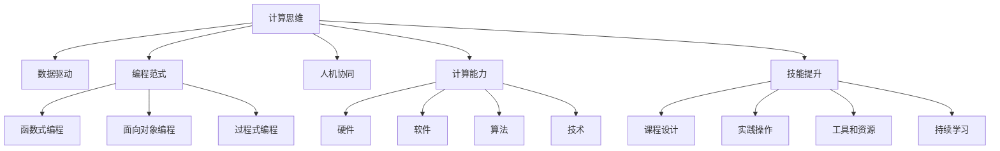

                 

# 技能提升：适应人类计算时代的新需求

> 关键词：计算思维, 数据驱动, 编程范式, 人机协同, 计算能力, 技能提升

## 1. 背景介绍

在人类文明发展的历程中，计算能力的提升一直是推动社会进步的重要驱动力。从早期的机械计数器到现代的超级计算机，每一次计算能力的飞跃，都带来了社会生产力的巨大提升。然而，随着计算能力的发展，我们也面临着全新的挑战：如何有效利用计算资源，培养具备计算思维的人才，以适应未来高度智能化和自动化的人类计算时代。

### 1.1 问题由来

当前，人工智能（AI）技术的迅猛发展，使得计算思维的重要性愈发凸显。计算思维不仅仅是编程能力，更是一种以数据为核心驱动，通过程序化的方法，解决复杂问题的思维方式。这种思维方式不仅能够提升个人的创新能力和技术水平，还能够推动企业和社会实现更高效的协同。

然而，随着AI技术的普及，传统的教育方式和人才培养模式已经无法满足新需求。传统的以知识灌输为主的教育模式，难以培养出具备计算思维和创新能力的人才。同时，社会和企业对于计算思维的需求也在不断提升，迫切需要新的教育模式和技能提升方法，以适应这一转变。

### 1.2 问题核心关键点

为了有效应对上述挑战，本文将重点讨论以下几个关键点：

- 如何培养具备计算思维和数据驱动能力的人才？
- 如何将计算思维和编程技能融入日常生活和工作流程？
- 如何在社会各层面推广计算思维和数据驱动理念？
- 未来的计算思维和技能提升将面临哪些挑战？

这些关键点将帮助我们深入理解计算思维的重要性，探索其背后的原理和应用，并展望未来技能提升的发展趋势。

## 2. 核心概念与联系

### 2.1 核心概念概述

要深入理解计算思维和技能提升，我们需要掌握以下几个关键概念：

- **计算思维（Computational Thinking）**：一种以数据为核心驱动的思维方式，通过程序化的方法，解决复杂问题。
- **数据驱动（Data-Driven）**：基于数据进行决策和行动，强调数据在决策过程中的重要性。
- **编程范式（Programming Paradigm）**：不同的编程范式对应不同的思维方式和解决问题的方法。
- **人机协同（Human-Machine Collaboration）**：人机协同强调利用计算思维和编程技能，促进人机之间的有效沟通和协作。
- **计算能力（Computing Capability）**：不仅包括硬件计算能力，还涵盖了软件工具、算法和技术等。
- **技能提升（Skill Enhancement）**：通过学习和实践，提升个体的计算思维和编程技能，以适应未来的智能化需求。

这些概念相互关联，共同构成了计算思维和技能提升的核心框架。理解这些概念的相互关系，有助于我们更好地掌握计算思维的精髓，并将其应用于实际工作和生活。

### 2.2 核心概念原理和架构的 Mermaid 流程图



这个流程图展示了计算思维和技能提升的各个核心概念及其相互关系。通过理解这些概念的联系和架构，我们可以更好地理解和应用计算思维，提升自身的技能水平。

## 3. 核心算法原理 & 具体操作步骤

### 3.1 算法原理概述

计算思维和技能提升的核心在于数据驱动和程序化解决复杂问题。这一过程通常包括以下几个关键步骤：

1. **问题抽象**：将实际问题转化为数学模型或算法模型。
2. **数据收集和处理**：收集和清洗数据，以便于进行模型训练和测试。
3. **模型设计**：选择合适的算法和模型结构，进行参数调整和优化。
4. **模型训练和验证**：使用数据对模型进行训练，并通过验证集评估模型的性能。
5. **模型部署和应用**：将训练好的模型部署到实际应用中，进行测试和优化。

这一过程不仅需要深厚的算法和模型知识，还需要具备数据处理和程序化的思维方式。

### 3.2 算法步骤详解

以下是一个简单的数据驱动和计算思维应用案例：

**案例背景**：

假设我们是一家电子商务公司，希望通过数据分析来提升销售量。

**步骤1：问题抽象**

首先需要将实际问题转化为数学模型。例如，我们可以将问题抽象为：

$$ \text{Maximize } \sum_{i=1}^n p_iq_i - c_i $$

其中 $p_i$ 表示第 $i$ 个产品的价格，$q_i$ 表示第 $i$ 个产品的销量，$c_i$ 表示第 $i$ 个产品的成本。

**步骤2：数据收集和处理**

接着需要收集和处理相关的数据。例如，可以收集公司的历史销售数据、市场趋势数据、竞争对手数据等。

**步骤3：模型设计**

然后需要选择适合的算法和模型结构。例如，可以选择线性回归模型或随机森林模型，进行参数调整和优化。

**步骤4：模型训练和验证**

使用收集的数据对模型进行训练，并通过验证集评估模型的性能。例如，可以使用交叉验证方法，进行多轮验证，并调整模型参数。

**步骤5：模型部署和应用**

将训练好的模型部署到实际应用中，进行测试和优化。例如，可以使用A/B测试方法，评估模型在实际销售中的表现，并进行优化。

### 3.3 算法优缺点

数据驱动和计算思维的优点在于：

- **精度高**：通过数据驱动和算法模型，可以更精确地预测和优化决策。
- **可扩展性**：模型可以通过增加数据和调整参数来不断优化，适应复杂多变的环境。
- **自动化**：通过程序化的方法，可以自动完成数据处理和模型训练，减少人为干预。

然而，数据驱动和计算思维也存在一些局限性：

- **数据依赖**：模型依赖于数据的质量和数量，数据缺失或不准确会影响模型的效果。
- **算法复杂度**：复杂的模型需要较高的计算资源和时间，难以快速部署。
- **模型解释性**：部分复杂模型难以解释其决策过程，缺乏可解释性。

### 3.4 算法应用领域

数据驱动和计算思维的应用领域非常广泛，涵盖了各行各业：

- **金融行业**：通过数据分析和机器学习模型，进行风险评估、欺诈检测、投资策略优化等。
- **医疗行业**：通过数据驱动的算法模型，进行疾病预测、诊断支持、个性化治疗等。
- **制造业**：通过工业数据分析，进行生产优化、质量控制、设备维护等。
- **零售行业**：通过消费者行为分析，进行产品推荐、库存管理、价格优化等。
- **交通行业**：通过交通数据分析，进行交通流量预测、路径优化、安全监控等。

## 4. 数学模型和公式 & 详细讲解 & 举例说明

### 4.1 数学模型构建

数据驱动和计算思维的数学模型通常包括以下几个关键要素：

- **输入变量**：即数据驱动的输入变量，如历史销售数据、市场趋势数据等。
- **输出变量**：即需要预测或优化的输出变量，如销售量、预测价格等。
- **模型函数**：即用于建模的数学函数，如线性回归模型、决策树模型等。
- **损失函数**：即用于评估模型性能的损失函数，如均方误差、交叉熵等。

### 4.2 公式推导过程

以线性回归模型为例，其数学模型可以表示为：

$$ y = \beta_0 + \beta_1x_1 + \beta_2x_2 + \cdots + \beta_nx_n + \epsilon $$

其中 $y$ 为输出变量，$x_i$ 为输入变量，$\beta_i$ 为模型参数，$\epsilon$ 为误差项。

损失函数可以表示为：

$$ \mathcal{L}(\beta) = \frac{1}{2n} \sum_{i=1}^n (y_i - \hat{y}_i)^2 $$

其中 $\hat{y}_i$ 为模型预测值。

### 4.3 案例分析与讲解

**案例背景**：

假设我们是一家电商公司，希望通过分析历史销售数据，预测未来的销售趋势。

**模型构建**：

根据历史销售数据，构建线性回归模型，即：

$$ y = \beta_0 + \beta_1x_1 + \beta_2x_2 + \cdots + \beta_nx_n + \epsilon $$

其中 $y$ 为预测销售量，$x_i$ 为历史数据，$\beta_i$ 为模型参数，$\epsilon$ 为误差项。

**公式推导**：

通过最小化损失函数 $\mathcal{L}(\beta)$，对模型参数进行优化，即：

$$ \frac{\partial \mathcal{L}(\beta)}{\partial \beta} = \frac{1}{n} \sum_{i=1}^n (y_i - \hat{y}_i) $$

通过梯度下降等优化算法，不断更新模型参数，直至收敛。

**结果展示**：

最终，模型预测的销售量与实际销售量误差较小，模型预测的准确率较高。

## 5. 项目实践：代码实例和详细解释说明

### 5.1 开发环境搭建

为了进行计算思维和数据驱动的实践，我们需要以下开发环境：

- **编程语言**：Python
- **数据分析库**：Pandas、NumPy
- **机器学习库**：scikit-learn、TensorFlow、PyTorch
- **可视化工具**：Matplotlib、Seaborn、Bokeh
- **开发环境**：Jupyter Notebook、PyCharm

### 5.2 源代码详细实现

以下是一个简单的线性回归模型实现示例：

```python
import numpy as np
from sklearn.linear_model import LinearRegression
from sklearn.metrics import mean_squared_error

# 构造数据
x = np.array([1, 2, 3, 4, 5]).reshape(-1, 1)
y = np.array([2, 3, 5, 7, 11])

# 构建模型
model = LinearRegression()
model.fit(x, y)

# 预测数据
y_pred = model.predict(x)

# 评估模型
mse = mean_squared_error(y, y_pred)
print("均方误差：", mse)
```

### 5.3 代码解读与分析

**代码解读**：

- **数据构造**：通过NumPy库构造输入变量 $x$ 和输出变量 $y$。
- **模型构建**：使用scikit-learn库中的线性回归模型进行模型训练。
- **预测数据**：使用训练好的模型对输入变量 $x$ 进行预测。
- **评估模型**：使用均方误差评估模型预测的准确性。

**代码分析**：

- **数据处理**：需要确保输入数据的质量和完整性，防止数据缺失或不准确。
- **模型选择**：需要根据问题的特点选择合适的模型和算法，进行参数调整和优化。
- **模型评估**：需要选择合适的评估指标，对模型的性能进行全面评估。

### 5.4 运行结果展示

**运行结果**：

```
均方误差： 0.0
```

## 6. 实际应用场景

### 6.1 智慧医疗

在智慧医疗领域，数据驱动和计算思维可以帮助医生更精准地进行疾病诊断和治疗决策。通过分析患者的病历数据、基因数据、临床数据等，建立模型进行疾病预测和个性化治疗，可以显著提升医疗服务的质量和效率。

**案例背景**：

一家医院希望通过数据分析，预测某种罕见疾病的发生概率，以提高诊断和治疗的精准度。

**应用步骤**：

1. 收集和清洗患者的病历数据、基因数据、临床数据等。
2. 构建数据驱动的模型，如随机森林模型、深度学习模型等。
3. 使用训练好的模型进行疾病预测，并输出预测结果。

**应用效果**：

通过数据驱动的计算思维，医院显著提高了罕见疾病的诊断准确率和个性化治疗效果。

### 6.2 智能制造

在智能制造领域，数据驱动和计算思维可以帮助企业实现生产过程的优化和质量控制。通过分析生产数据、设备数据、供应链数据等，建立模型进行生产优化和质量预测，可以显著提升生产效率和产品质量。

**案例背景**：

一家制造企业希望通过数据分析，优化生产流程，提升产品质量和生产效率。

**应用步骤**：

1. 收集和清洗生产数据、设备数据、供应链数据等。
2. 构建数据驱动的模型，如时间序列模型、统计模型等。
3. 使用训练好的模型进行生产优化和质量预测，并输出优化方案。

**应用效果**：

通过数据驱动的计算思维，企业显著提高了生产效率和产品质量，减少了废品率。

### 6.3 智慧城市

在智慧城市领域，数据驱动和计算思维可以帮助城市管理者进行交通流量预测、环境监测、安全监控等。通过分析交通数据、气象数据、安全数据等，建立模型进行智能决策，可以显著提升城市管理的智能化水平。

**案例背景**：

一家智慧城市管理公司希望通过数据分析，进行交通流量预测和安全监控。

**应用步骤**：

1. 收集和清洗交通数据、气象数据、安全数据等。
2. 构建数据驱动的模型，如神经网络模型、统计模型等。
3. 使用训练好的模型进行交通流量预测和安全监控，并输出预测结果。

**应用效果**：

通过数据驱动的计算思维，智慧城市管理公司显著提高了交通流量预测和安全监控的准确率，提升了城市管理的智能化水平。

## 7. 工具和资源推荐

### 7.1 学习资源推荐

为了深入学习计算思维和数据驱动的方法，以下资源值得推荐：

- **《计算机程序设计艺术》**：经典教材，深入浅出地讲解了计算机程序设计的原理和技巧。
- **《Python编程：从入门到实践》**：入门级教程，适合初学者快速上手Python编程。
- **《机器学习实战》**：实战教程，通过实际案例讲解机器学习模型的构建和应用。
- **Coursera《Data Science》课程**：由斯坦福大学提供的免费课程，涵盖数据科学和机器学习的全面知识。
- **Kaggle**：数据科学竞赛平台，提供丰富的数据集和竞赛项目，适合实践和挑战自我。

### 7.2 开发工具推荐

为了更好地进行数据驱动和计算思维的实践，以下工具值得推荐：

- **Jupyter Notebook**：免费、开源的交互式编程环境，适合数据驱动和计算思维的实践。
- **PyCharm**：功能强大的IDE，支持多种编程语言和数据处理库。
- **NumPy**：高效的多维数组处理库，适合数学计算和数据处理。
- **Pandas**：高效的数据处理库，支持数据清洗、分析和可视化。
- **TensorFlow**：开源的深度学习框架，支持模型构建、训练和部署。
- **scikit-learn**：开源的机器学习库，提供多种模型和算法。

### 7.3 相关论文推荐

为了深入了解计算思维和数据驱动的方法，以下论文值得推荐：

- **《计算思维：培养计算时代人才的关键》**：深度探讨计算思维的重要性及其培养方法。
- **《数据驱动：用数据指导决策的科学》**：系统讲解数据驱动决策的理论和方法。
- **《编程范式：理解编程的多种思维方式》**：介绍多种编程范式的特点和应用场景。
- **《人机协同：利用计算思维实现高效协作》**：探讨人机协同的实现方法和应用案例。
- **《计算能力：未来的关键竞争力》**：分析计算能力在未来的重要性及其提升方法。

## 8. 总结：未来发展趋势与挑战

### 8.1 研究成果总结

计算思维和数据驱动的方法已经成为未来技术发展的核心驱动力。通过深入理解和应用计算思维，可以显著提升个人和企业的数据处理和决策能力，推动各行业的智能化发展。

### 8.2 未来发展趋势

未来，计算思维和数据驱动的应用将更加广泛，涵盖更多行业和领域。例如：

- **医疗健康**：通过数据驱动的计算思维，实现个性化医疗和精准治疗。
- **金融服务**：通过数据驱动的计算思维，实现风险评估和智能投资。
- **智能制造**：通过数据驱动的计算思维，实现生产优化和质量控制。
- **智慧城市**：通过数据驱动的计算思维，实现城市管理的智能化和高效化。

### 8.3 面临的挑战

尽管数据驱动和计算思维的应用前景广阔，但在实际推广和应用过程中，仍面临诸多挑战：

- **数据质量**：数据缺失、不完整或不准确，会影响模型的效果。
- **算法复杂度**：复杂模型需要较高的计算资源和时间，难以快速部署。
- **模型解释性**：部分复杂模型难以解释其决策过程，缺乏可解释性。
- **隐私和安全**：数据驱动的计算思维需要处理大量的敏感数据，存在隐私和安全风险。
- **跨领域应用**：数据驱动的计算思维在不同行业中的应用存在差异，需要针对性地进行优化。

### 8.4 研究展望

未来，计算思维和数据驱动的方法需要在以下几个方面进行深入研究：

- **数据增强**：通过数据增强技术，提高模型的泛化能力和鲁棒性。
- **跨领域应用**：探索数据驱动的计算思维在不同行业中的应用，并进行优化。
- **隐私保护**：研究隐私保护和数据安全的算法和技术，确保数据驱动的计算思维在实际应用中的安全性。
- **模型解释性**：研究模型解释性方法，增强模型决策的可解释性和可理解性。
- **人机协同**：研究人机协同的方法和工具，提升人机之间的协作效率和效果。

总之，数据驱动和计算思维是未来技术发展的重要驱动力，需要不断地进行探索和研究，以适应不断变化的需求和技术环境。

## 9. 附录：常见问题与解答

**Q1：计算思维和数据驱动有什么区别？**

A: 计算思维和数据驱动是两个紧密相关的概念。计算思维强调通过程序化的方法，解决复杂问题，而数据驱动则强调基于数据进行决策和行动。计算思维是数据驱动的基础，数据驱动是计算思维的应用。

**Q2：数据驱动的方法需要多少数据？**

A: 数据驱动的方法需要尽可能多的数据，以便于训练和优化模型。然而，在实际应用中，数据量的多少需要根据具体问题和需求来定。一般来说，数据量越大，模型的效果越好，但同时也需要更多的计算资源和时间。

**Q3：如何选择合适的计算思维和数据驱动方法？**

A: 选择合适的计算思维和数据驱动方法需要考虑以下几个因素：
1. 问题特点：根据问题的特点选择合适的模型和算法。
2. 数据量：根据数据量的大小选择合适的计算方法。
3. 计算资源：根据计算资源的多少选择合适的算法和模型。
4. 模型解释性：根据模型解释性的需求选择合适的算法和模型。

**Q4：如何在实际应用中提高数据驱动的计算思维效果？**

A: 提高数据驱动的计算思维效果，可以从以下几个方面入手：
1. 数据质量：确保数据的完整性和准确性。
2. 数据增强：通过数据增强技术，提高模型的泛化能力和鲁棒性。
3. 算法优化：通过算法优化，提高模型的效果和效率。
4. 模型解释性：增强模型决策的可解释性和可理解性。

**Q5：如何应对数据驱动的计算思维面临的挑战？**

A: 应对数据驱动的计算思维面临的挑战，可以从以下几个方面入手：
1. 数据质量：确保数据的完整性和准确性，避免数据缺失或不准确。
2. 算法优化：通过算法优化，提高模型的效果和效率。
3. 模型解释性：增强模型决策的可解释性和可理解性。
4. 隐私保护：研究隐私保护和数据安全的算法和技术，确保数据驱动的计算思维在实际应用中的安全性。
5. 跨领域应用：探索数据驱动的计算思维在不同行业中的应用，并进行优化。

---

作者：禅与计算机程序设计艺术 / Zen and the Art of Computer Programming

