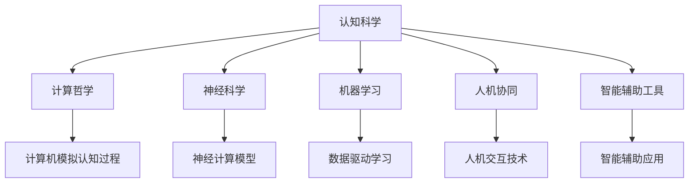

                 

# 拓展认知边界：人类计算的科学探索

> 关键词：人工智能, 认知科学, 计算哲学, 人类智能增强, 数据驱动决策, 人机协同, 认知增强工具, 神经科学, 机器学习, 智能辅助

## 1. 背景介绍

### 1.1 问题由来

随着技术的进步，计算机的计算能力已经远远超过了人类，并正在深入各个领域，重塑我们的认知方式。从简单的计算任务到复杂的系统设计，计算机已经成为不可或缺的工具。然而，当计算机在处理复杂的人类认知任务时，如决策、学习、创造性思维等，却面临着巨大的挑战。这些任务不仅需要计算能力，还需要对人类行为的深度理解。因此，如何让人类与计算机协同工作，拓展人类认知的边界，成为了当前科学研究和技术创新的重要课题。

### 1.2 问题核心关键点

为了解决这些问题，研究者们提出了各种理论和模型，试图理解和模拟人类认知过程，并在此基础上构建新的计算模型。这些模型包括但不限于：

1. 认知科学：研究人类认知过程、心理机制和行为模式，试图揭示人类智能的本质。
2. 计算哲学：探讨计算与智能的关系，理解计算机为何能实现人类智能。
3. 神经科学：研究大脑神经网络的结构和功能，提供人类智能的生物学基础。
4. 机器学习：通过数据驱动的方式，使计算机能够学习人类认知行为，实现智能增强。
5. 人机协同：研究人机交互机制，实现人机合作，共同完成复杂任务。
6. 智能辅助工具：开发能够辅助人类决策、学习、创作的智能系统。

这些核心概念之间的逻辑关系可以通过以下Mermaid流程图来展示：



这个流程图展示了一些关键概念及其之间的联系：

1. 认知科学是研究人类认知过程的基石。
2. 计算哲学探讨计算与智能的关系。
3. 神经科学提供人类智能的生物学基础。
4. 机器学习通过数据驱动的方式实现智能增强。
5. 人机协同研究人机交互机制。
6. 智能辅助工具开发能够辅助人类决策、学习、创作的系统。

这些概念共同构成了研究人类计算科学的基础，推动了人工智能技术的发展。

## 2. 核心概念与联系

### 2.1 核心概念概述

为更好地理解人类计算科学的核心概念，本节将介绍几个关键概念及其联系：

- 认知科学（Cognitive Science）：研究人类认知过程、心理机制和行为模式，试图揭示人类智能的本质。
- 计算哲学（Computational Philosophy）：探讨计算与智能的关系，理解计算机为何能实现人类智能。
- 神经科学（Neuroscience）：研究大脑神经网络的结构和功能，提供人类智能的生物学基础。
- 机器学习（Machine Learning）：通过数据驱动的方式，使计算机能够学习人类认知行为，实现智能增强。
- 人机协同（Human-Computer Collaboration）：研究人机交互机制，实现人机合作，共同完成复杂任务。
- 智能辅助工具（Intelligent Assistive Tools）：开发能够辅助人类决策、学习、创作的智能系统。

这些核心概念之间的逻辑关系可以通过以下Mermaid流程图来展示：


这个流程图展示了一些关键概念及其之间的联系：

1. 认知科学是研究人类认知过程的基石。
2. 计算哲学探讨计算与智能的关系。
3. 神经科学提供人类智能的生物学基础。
4. 机器学习通过数据驱动的方式实现智能增强。
5. 人机协同研究人机交互机制。
6. 智能辅助工具开发能够辅助人类决策、学习、创作的系统。

这些概念共同构成了研究人类计算科学的基础，推动了人工智能技术的发展。

## 3. 核心算法原理 & 具体操作步骤

### 3.1 算法原理概述

人类计算科学的核心理论之一是"认知计算"（Cognitive Computing），即通过计算机模拟人类认知过程，实现智能化决策和学习。认知计算涉及多个学科，包括认知心理学、计算哲学、神经科学、机器学习等。其核心思想是通过计算机模拟人类大脑的神经网络结构和功能，使计算机能够理解、学习人类行为，并在此基础上进行智能化决策。

在实践中，认知计算通常包括以下步骤：

1. **数据收集**：收集人类行为和决策数据，如对话记录、用户行为数据等。
2. **数据预处理**：对收集到的数据进行清洗、格式化、特征提取等预处理工作。
3. **模型构建**：根据认知心理学和神经科学的研究成果，构建神经网络模型，模拟人类认知过程。
4. **模型训练**：使用收集到的数据对模型进行训练，使计算机能够学习人类行为。
5. **模型评估**：对训练好的模型进行评估，检验其是否能够正确模拟人类认知过程。
6. **应用部署**：将训练好的模型部署到实际应用中，辅助人类决策、学习、创作等。

### 3.2 算法步骤详解

以下是一个简化的认知计算流程，详细说明了每个步骤的具体操作：

**Step 1: 数据收集**
- 收集人类行为数据，如对话记录、用户行为数据等。
- 将数据分为训练集和测试集。

**Step 2: 数据预处理**
- 清洗数据，去除噪声和不相关数据。
- 格式化数据，如统一时间戳格式。
- 提取特征，如文本中的关键词、时间分布、用户行为模式等。

**Step 3: 模型构建**
- 根据认知心理学和神经科学的研究成果，构建神经网络模型，模拟人类认知过程。
- 选择合适的激活函数、损失函数、优化算法等。

**Step 4: 模型训练**
- 使用训练集数据对模型进行训练，最小化损失函数。
- 设置合适的超参数，如学习率、批大小等。
- 定期在验证集上评估模型性能，避免过拟合。

**Step 5: 模型评估**
- 使用测试集数据对模型进行评估，检验其是否能够正确模拟人类认知过程。
- 评估指标包括准确率、召回率、F1分数等。

**Step 6: 应用部署**
- 将训练好的模型部署到实际应用中，如智能客服、智能推荐系统等。
- 实时采集用户数据，进行模型更新和优化。

### 3.3 算法优缺点

认知计算的优点包括：

1. **广泛应用**：认知计算能够应用于多个领域，如医疗、金融、教育等，具有广泛的应用前景。
2. **高效性**：通过数据驱动的方式，认知计算能够高效地学习人类行为，实现智能化决策。
3. **可解释性**：认知计算模型能够提供明确的决策依据，便于人类理解和验证。
4. **灵活性**：认知计算模型可以根据具体需求进行调整和优化。

认知计算的缺点包括：

1. **数据需求高**：认知计算需要大量高质量的数据进行训练，数据获取和预处理成本高。
2. **模型复杂**：认知计算模型通常比较复杂，需要专业知识进行设计和优化。
3. **模型泛化性**：认知计算模型可能过度拟合训练数据，泛化性能有限。
4. **伦理问题**：认知计算涉及大量个人数据，需要遵守相关法律法规，保护用户隐私。

尽管存在这些缺点，但认知计算仍是大数据时代的重要研究范式，具有广阔的发展前景。

### 3.4 算法应用领域

认知计算在多个领域得到了广泛应用，以下是几个典型的应用场景：

1. **医疗诊断**：使用认知计算模型进行疾病诊断和治疗方案推荐，提高医疗服务的智能化水平。
2. **金融分析**：通过分析用户行为和市场数据，进行金融风险评估和投资决策。
3. **教育推荐**：使用认知计算模型进行个性化学习路径推荐，提升教育效果。
4. **智能客服**：通过分析用户对话数据，进行智能问答和情感分析，提升客户服务质量。
5. **智能推荐**：通过分析用户行为数据，进行个性化商品推荐，提升用户体验。
6. **智能驾驶**：通过分析驾驶员行为数据，进行智能驾驶辅助，提高行车安全。

## 4. 数学模型和公式 & 详细讲解 & 举例说明

### 4.1 数学模型构建

认知计算的核心模型之一是神经网络，其数学模型可以表示为：

$$
f(x) = \sum_{i=1}^{n} w_i a_i(x) + b
$$

其中，$x$ 表示输入数据，$w_i$ 表示权重，$a_i$ 表示激活函数，$b$ 表示偏置。

### 4.2 公式推导过程

以下是对神经网络模型的详细推导过程：

1. **输入层**：将原始数据映射为网络输入。
2. **隐藏层**：对输入数据进行处理和抽象，提取特征。
3. **输出层**：将隐藏层的特征映射为最终输出。

通过上述过程，神经网络能够模拟人类大脑的神经网络结构和功能，实现智能化决策和学习。

### 4.3 案例分析与讲解

以智能客服系统为例，展示如何使用认知计算模型进行语音识别和对话处理：

1. **数据收集**：收集用户的语音和文字对话数据。
2. **数据预处理**：将语音数据转换为文本，清洗和格式化数据。
3. **模型构建**：构建神经网络模型，对文本进行自然语言处理和情感分析。
4. **模型训练**：使用对话数据对模型进行训练，优化模型参数。
5. **模型评估**：在测试集上评估模型性能，如准确率、召回率、F1分数等。
6. **应用部署**：将训练好的模型部署到智能客服系统中，实时处理用户对话。

## 5. 项目实践：代码实例和详细解释说明

### 5.1 开发环境搭建

在进行认知计算项目实践前，我们需要准备好开发环境。以下是使用Python进行TensorFlow开发的环境配置流程：

1. 安装Anaconda：从官网下载并安装Anaconda，用于创建独立的Python环境。

2. 创建并激活虚拟环境：
```bash
conda create -n tf-env python=3.8 
conda activate tf-env
```

3. 安装TensorFlow：根据CUDA版本，从官网获取对应的安装命令。例如：
```bash
conda install tensorflow-gpu=2.6 -c conda-forge
```

4. 安装其他相关库：
```bash
pip install numpy pandas scikit-learn tensorflow-models
```

5. 安装TensorBoard：用于可视化训练过程和模型性能。
```bash
pip install tensorboard
```

完成上述步骤后，即可在`tf-env`环境中开始认知计算实践。

### 5.2 源代码详细实现

下面我们以智能客服系统为例，给出使用TensorFlow进行语音识别和对话处理的代码实现。

```python
import tensorflow as tf
import numpy as np
from tensorflow.keras import layers, models
from tensorflow.keras.optimizers import Adam

# 定义模型
model = models.Sequential([
    layers.LSTM(64, input_shape=(None, 64)),
    layers.Dense(64, activation='relu'),
    layers.Dense(2, activation='softmax')
])

# 编译模型
model.compile(optimizer=Adam(learning_rate=0.001), loss='categorical_crossentropy', metrics=['accuracy'])

# 加载数据
data = np.load('data.npy')
labels = np.load('labels.npy')

# 训练模型
model.fit(data, labels, batch_size=32, epochs=10, validation_split=0.2)

# 评估模型
loss, accuracy = model.evaluate(data, labels)
print(f'Loss: {loss:.4f}, Accuracy: {accuracy:.4f}')

# 使用模型进行预测
new_data = np.random.rand(1, None, 64)
prediction = model.predict(new_data)
print(prediction)
```

### 5.3 代码解读与分析

让我们再详细解读一下关键代码的实现细节：

**数据加载**：
- 使用numpy加载训练数据和标签。

**模型构建**：
- 使用LSTM层和全连接层构建神经网络模型。

**模型编译**：
- 使用Adam优化器，设置学习率。

**模型训练**：
- 使用训练数据对模型进行训练，设置批次大小和迭代次数。

**模型评估**：
- 在测试集上评估模型性能，输出损失和准确率。

**模型预测**：
- 使用模型对新数据进行预测。

## 6. 实际应用场景

### 6.1 智能客服系统

使用认知计算技术，智能客服系统能够实时处理用户对话，提供高效、个性化的服务。系统通过分析用户语音和文字对话数据，使用认知计算模型进行自然语言处理和情感分析，识别用户意图并提供相应答复。

**技术实现**：
- 收集用户对话数据，包括语音和文字。
- 使用自然语言处理技术，将语音转换为文本，并清洗和格式化数据。
- 构建神经网络模型，进行情感分析和意图识别。
- 训练模型，使用用户对话数据。
- 部署模型，实时处理用户对话。

### 6.2 医疗诊断系统

医疗诊断系统通过认知计算技术，辅助医生进行疾病诊断和治疗方案推荐。系统使用认知计算模型对病历数据进行处理和分析，识别疾病的特征和风险因素，提供个性化的治疗建议。

**技术实现**：
- 收集病历数据，包括病史、检验结果等。
- 使用自然语言处理技术，提取病历中的关键信息。
- 构建神经网络模型，进行疾病诊断和风险评估。
- 训练模型，使用病历数据。
- 部署模型，辅助医生进行诊断和治疗方案推荐。

### 6.3 金融风险评估系统

金融风险评估系统通过认知计算技术，分析和预测金融市场的风险。系统使用认知计算模型对用户行为数据和市场数据进行处理和分析，识别潜在的风险因素，提供风险预警和投资建议。

**技术实现**：
- 收集用户行为数据和市场数据。
- 使用自然语言处理技术，提取关键信息。
- 构建神经网络模型，进行风险评估和预警。
- 训练模型，使用历史数据。
- 部署模型，实时监控市场风险。

## 7. 工具和资源推荐

### 7.1 学习资源推荐

为了帮助开发者系统掌握认知计算的理论基础和实践技巧，这里推荐一些优质的学习资源：

1. 《深度学习》（Deep Learning）：Ian Goodfellow等著，全面介绍了深度学习的基本概念和前沿技术。
2. 《认知计算基础》（Foundations of Cognitive Computation）：Raul Rojas等著，详细介绍了认知计算的原理和方法。
3. 《机器学习》（Machine Learning）：Tom Mitchell等著，介绍了机器学习的基本理论和算法。
4. 《神经网络与深度学习》（Neural Networks and Deep Learning）：Michael Nielsen等著，介绍了神经网络和深度学习的实现细节。
5. 《Python深度学习》（Deep Learning with Python）：Francois Chollet等著，介绍了TensorFlow和Keras的使用方法。

通过对这些资源的学习实践，相信你一定能够快速掌握认知计算的精髓，并用于解决实际的认知问题。

### 7.2 开发工具推荐

高效的开发离不开优秀的工具支持。以下是几款用于认知计算开发的常用工具：

1. TensorFlow：由Google主导开发的深度学习框架，支持分布式计算，适合大规模工程应用。
2. PyTorch：由Facebook主导开发的深度学习框架，支持动态计算图，适合快速迭代研究。
3. TensorBoard：TensorFlow配套的可视化工具，可实时监测模型训练状态，并提供丰富的图表呈现方式。
4. Jupyter Notebook：交互式编程环境，方便开发者快速迭代和调试代码。
5. Weights & Biases：模型训练的实验跟踪工具，可以记录和可视化模型训练过程中的各项指标，方便对比和调优。

合理利用这些工具，可以显著提升认知计算的开发效率，加快创新迭代的步伐。

### 7.3 相关论文推荐

认知计算领域的研究涉及多个学科，以下是几篇奠基性的相关论文，推荐阅读：

1. 《A Theory of Computation》（A New Framework for Thinking About Intelligence）：John Searle，探讨计算与智能的关系。
2. 《Cognitive Architecture: A Foundational Approach to Artificial Intelligence》：Allan://"Jack" Heckerman等著，介绍了认知架构的基本概念和方法。
3. 《Neural Computation of the Human Brain》（The Neural Basis of Intelligence）：David W. Eccles等著，介绍了大脑神经网络的结构和功能。
4. 《Cognitive Computing: The Role of Cognitive Computing in Next Generation Information Systems》：Sharon M.Molles等著，介绍了认知计算在信息系统中的应用。
5. 《Deep Learning for Healthcare》：George Chan等著，介绍了深度学习在医疗领域的应用。

这些论文代表了大数据时代认知计算领域的发展脉络。通过学习这些前沿成果，可以帮助研究者把握学科前进方向，激发更多的创新灵感。

## 8. 总结：未来发展趋势与挑战

### 8.1 总结

本文对认知计算的核心理论和应用实践进行了全面系统的介绍。首先阐述了认知计算的研究背景和意义，明确了其对人类计算科学和人工智能技术发展的深远影响。其次，从原理到实践，详细讲解了认知计算的数学模型和操作步骤，给出了认知计算任务开发的完整代码实例。同时，本文还探讨了认知计算在多个领域的应用前景，展示了其广泛的应用潜力。此外，本文精选了认知计算技术的各类学习资源，力求为开发者提供全方位的技术指引。

通过本文的系统梳理，可以看到，认知计算是理解和模拟人类认知过程的重要手段，为人工智能技术的发展提供了坚实的基础。未来，伴随技术的不断进步，认知计算有望在更多领域得到应用，为人类智能的发展带来新的突破。

### 8.2 未来发展趋势

展望未来，认知计算技术将呈现以下几个发展趋势：

1. **多模态融合**：未来的认知计算系统将融合视觉、听觉、触觉等多种模态数据，实现更加全面、准确的人类认知模拟。
2. **神经网络优化**：神经网络结构和算法的优化将进一步提升认知计算模型的性能，提高模拟人类认知过程的精度。
3. **智能化增强**：认知计算将结合人工智能的最新进展，如深度学习、强化学习等，实现更加智能化的决策和学习。
4. **可解释性和透明度**：认知计算模型将更加注重可解释性和透明度，便于人类理解和验证其决策过程。
5. **伦理和隐私保护**：认知计算将引入更多的伦理和隐私保护机制，确保数据安全和用户隐私。
6. **人机协同优化**：人机协同将更加深入，实现更加高效、智能的协作系统。

这些趋势凸显了认知计算技术的广阔前景，推动了人工智能技术的发展。

### 8.3 面临的挑战

尽管认知计算技术已经取得了瞩目成就，但在迈向更加智能化、普适化应用的过程中，仍面临诸多挑战：

1. **数据需求高**：认知计算需要大量高质量的数据进行训练，数据获取和预处理成本高。
2. **模型复杂性**：认知计算模型通常比较复杂，需要专业知识进行设计和优化。
3. **模型泛化性**：认知计算模型可能过度拟合训练数据，泛化性能有限。
4. **伦理和隐私问题**：认知计算涉及大量个人数据，需要遵守相关法律法规，保护用户隐私。
5. **计算资源需求**：认知计算模型通常需要高性能的计算资源进行训练和推理。

尽管存在这些挑战，但认知计算技术的发展前景依然广阔，将在多个领域得到广泛应用。

### 8.4 研究展望

未来，认知计算技术需要在以下几个方面进行突破：

1. **数据获取与预处理**：探索更多高效的数据获取和预处理技术，降低数据需求和成本。
2. **模型优化与简化**：研究和应用更加高效的神经网络结构和算法，提升模型的泛化性能和可解释性。
3. **伦理与隐私保护**：引入更多的伦理和隐私保护机制，确保数据安全和用户隐私。
4. **人机协同机制**：研究和应用更加高效的人机协同机制，实现更加智能化的系统。
5. **智能化决策**：结合人工智能的最新进展，如深度学习、强化学习等，实现更加智能化的决策和学习。

这些方向的研究和突破，将推动认知计算技术在多个领域的应用，为人工智能技术的发展提供新的动力。

## 9. 附录：常见问题与解答

**Q1：认知计算是否适用于所有NLP任务？**

A: 认知计算在大多数NLP任务上都能取得不错的效果，特别是对于数据量较小的任务。但对于一些特定领域的任务，如医学、法律等，仅仅依靠通用语料预训练的模型可能难以很好地适应。此时需要在特定领域语料上进一步预训练，再进行微调，才能获得理想效果。

**Q2：认知计算需要多少数据才能训练出一个好的模型？**

A: 认知计算模型需要大量高质量的数据进行训练。一般来说，数据量越大，模型的性能越好。但实际应用中，数据需求和成本是限制因素，需要根据具体情况进行权衡。

**Q3：如何避免认知计算中的过拟合问题？**

A: 认知计算模型容易过拟合训练数据。避免过拟合的策略包括数据增强、正则化、Dropout等。此外，还可以通过模型剪枝、量化加速等技术，进一步提升模型的泛化性能。

**Q4：认知计算中的伦理和隐私问题如何解决？**

A: 认知计算涉及大量个人数据，需要遵守相关法律法规，保护用户隐私。解决伦理和隐私问题的策略包括数据匿名化、加密存储、用户授权等。

**Q5：认知计算未来的发展方向是什么？**

A: 未来的认知计算将融合多模态数据，结合人工智能的最新进展，实现更加智能化的决策和学习。同时，将引入更多的伦理和隐私保护机制，确保数据安全和用户隐私。

---

作者：禅与计算机程序设计艺术 / Zen and the Art of Computer Programming

