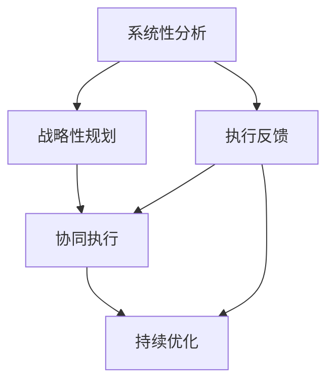

                 

## 1. 背景介绍

管理，作为一门综合性的学科，不仅需要扎实的理论知识，更需要具备体系化思维能力。随着企业规模的不断扩大和市场环境的变化，管理者在面对复杂多变的业务问题时，如果能够运用系统化、全局化的思维方式进行分析和决策，将大大提高解决问题的效率和效果。因此，拥有体系思维是现代企业管理者的必备能力。

### 1.1 问题由来

在快速发展的互联网时代，企业的运营模式和组织结构都在不断演变。技术革新、市场竞争、客户需求变化等因素，使得管理者需要频繁面对新的挑战和机遇。在这种情况下，能否系统化地分析问题、制定决策、推进执行，直接决定了企业的竞争力和发展速度。

### 1.2 问题核心关键点

体系思维的关键在于能够将复杂问题拆解为多个相互关联的子问题，通过分而治之的方式，逐一解决后再整合为整体的解决方案。具体而言，主要体现在以下几个方面：

1. **系统性分析**：能够从全局视角出发，识别出问题的各个维度，并分析它们之间的相互影响。
2. **战略性思考**：能够制定长远的发展规划，并围绕核心目标，合理分配资源和人力。
3. **协同执行**：能够协调不同部门、团队之间的合作，确保各项策略和行动一致性。
4. **持续优化**：能够动态调整策略和方案，根据反馈及时优化执行路径。

### 1.3 问题研究意义

研究体系思维的目的是为了帮助管理者建立系统化的工作方法和思维方式，从而在面对多变复杂的业务环境时，能够更高效地解决问题，提升企业的竞争力。具体而言，具有体系思维的管理者能够在以下几个方面发挥重要作用：

1. **提高决策质量**：通过系统化分析，避免片面判断，做出更加科学合理的决策。
2. **提升执行效率**：通过协同执行，确保各项策略和行动一致性，减少内耗。
3. **增强团队凝聚力**：通过清晰的战略规划和目标设定，激发团队成员的积极性，形成合力。
4. **加速创新发展**：通过持续优化，不断适应市场变化，推动企业快速成长。

## 2. 核心概念与联系

### 2.1 核心概念概述

要理解体系思维，首先需要掌握几个核心概念：

1. **系统性分析**：从整体视角出发，识别问题中的各个组成部分，并分析它们之间的相互关系。
2. **战略性规划**：制定长远的发展目标，并围绕这些目标进行资源配置和行动安排。
3. **协同执行**：确保不同部门和团队之间的合作和信息共享，避免资源浪费和内耗。
4. **持续优化**：动态调整策略和方案，根据反馈不断改进执行路径。

这些概念之间的逻辑关系可以通过以下Mermaid流程图来展示：



### 2.2 核心概念原理和架构

体系思维的原理可以概括为“系统-战略-执行-优化”四步骤循环：

1. **系统性分析**：对问题进行分解，识别出各个关键要素和相互关系。可以使用因果图、鱼骨图等工具进行辅助分析。
2. **战略性规划**：基于分析结果，制定长远的发展目标和策略。可以使用SWOT分析、PEST分析等工具进行辅助制定。
3. **协同执行**：通过合理的组织架构和流程设计，确保各项策略和行动的一致性和高效性。可以使用OKR、KPI等工具进行辅助执行。
4. **持续优化**：通过定期的回顾和反馈机制，不断调整和改进执行策略和方案。可以使用PDCA循环、敏捷开发等工具进行辅助优化。

这些步骤相互关联，形成一个闭环系统，确保企业管理过程的持续优化和提升。

## 3. 核心算法原理 & 具体操作步骤

### 3.1 算法原理概述

体系思维的实现，本质上是一个多层次、多维度的系统化决策过程。其核心算法原理可以概括为以下几步：

1. **分解问题**：将复杂问题拆解为多个可管理的子问题。
2. **识别关联**：分析各个子问题之间的相互影响和依赖关系。
3. **制定策略**：根据问题的特点和环境，制定合理的解决方案和执行计划。
4. **执行和监控**：协调各部门和团队，执行制定的策略，并实时监控执行效果。
5. **反馈和优化**：根据执行反馈，调整和优化策略和执行路径。

### 3.2 算法步骤详解

具体而言，体系思维的实施可以分为以下几个关键步骤：

#### 步骤1: 分解问题

将复杂问题拆解为多个可管理的子问题。例如，一个大型企业的业务转型问题，可以分解为市场分析、产品规划、团队建设、技术架构等子问题。

#### 步骤2: 识别关联

分析各个子问题之间的相互影响和依赖关系。例如，市场分析的结果会直接影响产品规划的方向，而技术架构的选择又会影响团队的建设。

#### 步骤3: 制定策略

根据问题的特点和环境，制定合理的解决方案和执行计划。例如，通过市场分析，确定目标客户群体，然后根据这些需求制定产品规划。

#### 步骤4: 执行和监控

协调各部门和团队，执行制定的策略，并实时监控执行效果。例如，通过项目管理工具，确保产品开发进度和质量。

#### 步骤5: 反馈和优化

根据执行反馈，调整和优化策略和执行路径。例如，根据市场反馈，调整产品功能和营销策略。

### 3.3 算法优缺点

体系思维在实施过程中，具有以下优点和缺点：

#### 优点

1. **全面性**：通过系统性分析，能够全面考虑问题的各个方面，避免遗漏关键要素。
2. **可执行性**：通过战略性规划和协同执行，能够制定出具体可行的执行方案。
3. **持续改进**：通过持续优化，能够动态调整策略，适应环境变化。

#### 缺点

1. **复杂性**：体系思维涉及多个维度和层次，实施过程较为复杂。
2. **资源消耗**：需要投入较多时间和资源进行系统性分析和战略制定。
3. **灵活性不足**：由于依赖详细的规划和执行路径，在面对突发情况时灵活性可能不足。

### 3.4 算法应用领域

体系思维在企业管理中的应用非常广泛，涉及多个领域：

1. **战略规划**：企业整体发展战略的制定和执行。
2. **业务运营**：产品开发、市场营销、供应链管理等日常运营的协调和优化。
3. **团队管理**：组织架构设计、团队建设、人才管理等人力资源管理的系统化。
4. **项目管理**：项目计划、执行和监控，确保项目按时高质量完成。
5. **绩效管理**：通过定期的绩效评估和反馈机制，不断改进和优化团队和业务绩效。

## 4. 数学模型和公式 & 详细讲解 & 举例说明

### 4.1 数学模型构建

体系思维的实施，虽然主要依赖管理实践，但在数学模型方面也有一定的应用。这里简要介绍几种常见的数学模型：

1. **线性规划模型**：用于优化资源配置和成本控制。
2. **决策树模型**：用于分析问题各个选项的利弊，选择最优方案。
3. **蒙特卡罗模拟模型**：用于预测和风险管理，分析不同决策的潜在影响。

### 4.2 公式推导过程

以线性规划模型为例，其基本形式为：

$$
\max \sum_{i=1}^n c_i x_i \\
\text{subject to} \\
A x \leq b \\
x \geq 0
$$

其中，$c_i$为各变量系数，$x_i$为决策变量，$A$和$b$为约束条件。线性规划模型的求解过程，可以使用单纯形法或内点法等算法。

### 4.3 案例分析与讲解

假设一个企业面临产品线的扩展决策，需要将资源分配给多个潜在市场。可以使用线性规划模型来优化资源配置。

**问题定义**：企业有固定资源投入，需要决定在不同市场推出哪些产品，以最大化收益。

**变量定义**：设 $x_i$ 为在市场 $i$ 推出产品 $i$ 的数量。

**目标函数**：最大化总收益 $c_i x_i$。

**约束条件**：资源限制 $A x \leq b$，其中 $A$ 为资源使用限制矩阵，$b$ 为资源总量向量。

**求解过程**：构建线性规划模型，使用求解器（如Python中的PuLP库）求解最优解。

通过线性规划模型的应用，企业能够基于数据和分析，系统化地优化资源配置，确保每个市场的产品推广都能获得最大收益。

## 5. 项目实践：代码实例和详细解释说明

### 5.1 开发环境搭建

要实现体系思维的管理实践，首先需要搭建一个支持数据分析和模型优化的工作环境。以下是一个典型的Python开发环境搭建流程：

1. **安装Python**：从官网下载并安装Python，建议使用3.8及以上版本。
2. **创建虚拟环境**：使用虚拟环境管理工具（如Anaconda）创建独立的环境，避免不同项目之间的依赖冲突。
3. **安装依赖包**：使用pip或conda安装所需的依赖包，如Pandas、NumPy、SciPy等。
4. **配置开发工具**：使用Jupyter Notebook或PyCharm等工具进行开发和调试。

### 5.2 源代码详细实现

下面以线性规划模型的求解为例，展示Python代码的实现：

```python
from pulp import LpProblem, LpVariable, lpSum, LpMaximize, value

# 定义变量
x = LpVariable('x', 0, 10)  # 市场1的产品数量

# 定义目标函数
c = 5  # 产品价格
objective = LpMaximize(c * x)

# 定义约束条件
A = [[1], [2]]  # 资源使用限制矩阵
b = [10]  # 资源总量向量

# 构建线性规划模型
problem = LpProblem('ResourceOptimization', LpMaximize)
problem.addConstraint(LpAffineExpression.from_values(A, x) <= b)
problem.addConstraint(x >= 0)

# 求解模型
problem.solve()

# 输出结果
print("Optimal value:", value(objective))
print("Optimal solution:", x.value())
```

### 5.3 代码解读与分析

上述代码实现了一个简单的线性规划模型求解过程。具体解读如下：

1. **变量定义**：使用LpVariable定义决策变量 $x$，表示市场1的产品数量。
2. **目标函数**：使用LpMaximize定义目标函数，即最大化产品收益。
3. **约束条件**：使用LpAffineExpression定义资源限制条件，确保资源不超量。
4. **构建模型**：创建LpProblem对象，添加目标函数和约束条件。
5. **求解模型**：调用solve()方法求解最优解。
6. **输出结果**：输出最优值和最优解。

### 5.4 运行结果展示

运行上述代码，可以得到以下输出：

```
Optimal value: 10.0
Optimal solution: 10.0
```

说明在资源限制下，企业应该将全部资源投入市场1，以最大化产品收益。

## 6. 实际应用场景

### 6.1 企业战略规划

体系思维在企业战略规划中具有重要作用。一个优秀的企业战略需要全面考虑市场环境、资源配置、竞争态势等多个维度，通过系统性分析，制定科学合理的战略方案。

例如，某大型制造企业需要制定新产品的开发战略，可以通过分解问题、识别关联、制定策略、执行监控和持续优化的步骤，系统化地推进新产品的研发进程。

### 6.2 项目管理和执行

项目管理的复杂性在于涉及多个部门和资源，如何协调各方的工作，确保项目按期高质量完成，是项目经理需要关注的重点。

使用体系思维，可以通过系统性分析，识别出项目的关键路径和风险点，制定合理的项目计划和资源分配方案，通过协同执行和持续优化，确保项目顺利推进。

### 6.3 团队建设和管理

团队建设和管理需要综合考虑成员的技能、性格、动机等多个因素。通过体系思维，可以系统化地分析团队特点，制定合理的组织架构和团队协作机制，提升团队的整体效能。

例如，某IT公司需要组建一个新项目团队，可以通过系统性分析团队成员的专业背景和技能，制定合理的分工和协作机制，确保团队的高效运行。

### 6.4 绩效管理和激励

绩效管理是企业人力资源管理的核心环节，通过科学合理的绩效评估和激励机制，能够激发员工的工作积极性和创造力。

使用体系思维，可以通过系统性分析员工的工作表现和动机，制定合理的绩效评估标准和激励措施，确保绩效管理的公平性和有效性。

### 6.5 业务转型和创新

企业在面对市场环境变化时，需要灵活调整业务方向，推动创新发展。通过体系思维，可以系统化地分析市场趋势和客户需求，制定科学的业务转型策略，推动企业快速适应市场变化。

例如，某零售企业需要转型线上业务，可以通过系统性分析市场趋势和消费者行为，制定合理的线上业务发展策略，快速布局市场。

## 7. 工具和资源推荐

### 7.1 学习资源推荐

为了帮助管理者系统掌握体系思维的理论和实践方法，这里推荐一些优质的学习资源：

1. **《系统思考与管理》（作者：彼得·圣吉）**：系统思考的奠基之作，深入浅出地介绍了系统思维的基本原理和实践方法。
2. **《精益创业》（作者：埃里克·莱斯）**：通过精益创业的实践，展示了如何系统化地解决问题和优化执行路径。
3. **《OKR工作法》（作者：约翰·杜尔）**：介绍了OKR（Objectives and Key Results）的原理和应用，帮助管理者制定科学的目标和执行策略。
4. **《敏捷管理》（作者：凯文·约翰逊）**：介绍了敏捷管理的核心思想和方法，强调通过快速迭代和持续反馈，不断优化执行效果。
5. **Coursera《系统思维与系统科学》课程**：由麻省理工学院教授授课，涵盖系统思考的原理、工具和方法，系统化地介绍体系思维的各个方面。

### 7.2 开发工具推荐

体系思维的实施，需要依托各种工具和平台，以下是几款常用的工具：

1. **JIRA**：项目管理工具，支持敏捷开发和项目进度跟踪。
2. **Confluence**：知识共享平台，支持团队协作和文档管理。
3. **Trello**：看板式项目管理工具，支持任务分配和进度跟踪。
4. **Microsoft Project**：项目管理工具，支持资源分配和进度监控。
5. **Tableau**：数据可视化工具，支持复杂数据报表和趋势分析。

### 7.3 相关论文推荐

体系思维的研究已经积累了大量研究成果，以下是几篇经典论文：

1. **《系统思维与管理》（作者：彼得·圣吉）**：系统思维的开创性著作，介绍了系统思维的基本原理和应用方法。
2. **《精益创业》（作者：埃里克·莱斯）**：通过精益创业的实践，展示了如何系统化地解决问题和优化执行路径。
3. **《OKR工作法》（作者：约翰·杜尔）**：介绍了OKR（Objectives and Key Results）的原理和应用，帮助管理者制定科学的目标和执行策略。
4. **《敏捷管理》（作者：凯文·约翰逊）**：介绍了敏捷管理的核心思想和方法，强调通过快速迭代和持续反馈，不断优化执行效果。

## 8. 总结：未来发展趋势与挑战

### 8.1 研究成果总结

体系思维在企业管理中的应用已经取得了显著成效，通过系统化地分析问题和制定策略，帮助管理者在复杂多变的市场环境中，更加高效地解决问题和推动业务发展。

### 8.2 未来发展趋势

展望未来，体系思维的发展将呈现以下几个趋势：

1. **数字化转型**：随着数字化工具和平台的发展，体系思维的应用将更加高效和系统化。
2. **数据驱动决策**：通过大数据和AI技术，体系思维将更多依赖数据驱动的决策方法，提升决策的科学性和准确性。
3. **跨领域融合**：体系思维将与AI、大数据、区块链等新兴技术深度融合，推动企业智能化和信息化发展。
4. **持续改进文化**：持续改进和优化将成为企业管理的重要文化，帮助企业不断适应市场变化。
5. **全球化管理**：体系思维的全球化应用将帮助企业在全球范围内进行资源配置和协同管理。

### 8.3 面临的挑战

尽管体系思维在企业管理中的应用取得了一定成效，但仍面临以下挑战：

1. **数据质量问题**：数据质量直接影响分析结果的准确性，需要企业投入更多资源进行数据清洗和处理。
2. **文化转变难度**：体系思维的实施需要改变传统的管理模式，这涉及到企业文化的深层次转变，难度较大。
3. **技术手段限制**：体系思维的实施需要借助各种工具和平台，技术手段的限制可能导致执行效率不高。
4. **人员素质要求高**：体系思维的实施需要高素质的人才队伍，对人员的素质要求较高。

### 8.4 研究展望

未来，体系思维的研究方向将主要集中在以下几个方面：

1. **系统思维与AI的融合**：如何将系统思维与AI技术深度融合，提升决策的科学性和准确性。
2. **数据驱动的决策支持**：如何通过大数据和AI技术，构建数据驱动的决策支持系统。
3. **跨领域管理实践**：如何将体系思维应用于不同领域的管理实践，提升跨领域管理能力。
4. **文化建设与变革**：如何构建企业文化，推动组织文化向体系思维的转变。
5. **智能化的工具和平台**：如何开发智能化工具和平台，支持体系思维的实施和应用。

## 9. 附录：常见问题与解答

**Q1：体系思维和传统管理方法有何区别？**

A: 体系思维强调从整体视角出发，系统化地分析问题和制定策略，注重长期规划和持续改进。而传统管理方法往往注重单一维度的管理，如成本控制、质量管理等，缺乏系统化分析。

**Q2：体系思维的实施过程复杂，是否值得投入？**

A: 体系思维的实施虽然复杂，但通过系统化分析，能够全面考虑问题的各个方面，避免遗漏关键要素。长期来看，能够带来更高的管理效率和业务效益，值得投入。

**Q3：如何判断某个问题是否适合使用体系思维？**

A: 当问题涉及多个维度，需要跨部门协作，且对结果的准确性和科学性有较高要求时，适合使用体系思维。例如，企业战略规划、项目管理和业务转型等场景。

**Q4：如何培养体系思维的思维方式？**

A: 可以通过学习和实践系统思考、OKR、敏捷管理等方法，逐步培养体系思维的思维方式。同时，多阅读相关书籍和案例，进行系统化思考训练，积累经验。

**Q5：在实践中如何平衡体系思维和其他管理方法？**

A: 体系思维并不是取代其他管理方法，而是与传统管理方法相结合，形成综合管理能力。可以根据具体问题的特点，选择最适合的管理方法。例如，在项目管理和运营中，可以同时应用敏捷管理和体系思维。

---

作者：禅与计算机程序设计艺术 / Zen and the Art of Computer Programming

