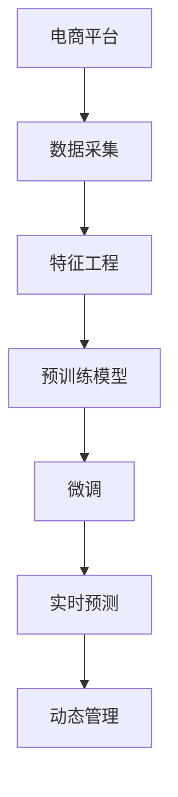

                 

# 探讨大模型在电商平台商品生命周期预测与管理中的作用

## 1. 背景介绍

### 1.1 问题由来
随着电商平台市场的飞速发展，商品的生命周期预测与管理变得越来越重要。电商平台不仅需要优化商品库存，减少资源浪费，还需要根据商品的销售情况和市场趋势，进行精准的市场运营，提升销售业绩。传统的商品生命周期预测方法往往依赖历史数据，难以充分考虑到电商平台上丰富的交互数据和多变的外部环境，导致预测效果不理想。

近年来，大模型在电商领域的应用日益增多，其强大的数据处理和分析能力使得其在商品生命周期预测和管理上展现出了巨大的潜力。如何有效地利用大模型进行电商商品的生命周期预测，成为电商平台优化运营的关键挑战之一。

### 1.2 问题核心关键点
大模型在电商平台商品生命周期预测与管理中的应用，主要涉及以下几个核心关键点：
- **数据特征工程**：如何从电商平台的交易数据、用户行为数据、市场数据等多方面，提取出对商品生命周期预测有意义的特征。
- **模型选择与优化**：选择合适的预训练模型进行微调，并对模型进行有效的参数优化，以提高预测精度和鲁棒性。
- **实时预测与动态管理**：如何构建实时预测系统，实现对商品生命周期的动态管理，及时调整商品运营策略。
- **多模态数据融合**：电商平台上的数据往往是多模态的，包括文本、图像、视频等，如何将这些多模态数据有效融合，提升预测效果。
- **可解释性**：如何解释大模型的预测结果，让用户和运营人员能够理解模型的决策过程，从而进行更有效的运营干预。

这些关键点是大模型在电商平台商品生命周期预测与管理中应用的基础，只有充分理解和解决这些挑战，才能实现电商平台的智能化运营。

## 2. 核心概念与联系

### 2.1 核心概念概述

在大模型应用于电商平台商品生命周期预测与管理的过程中，涉及到多个核心概念：

- **电商平台**：指通过互联网提供商品销售和交易服务的平台。其核心功能包括商品展示、购买、支付、物流等。
- **商品生命周期**：商品从生产、销售到退市的过程，包括引入期、成长期、成熟期和衰退期等阶段。商品生命周期预测与管理的目标是及时调整商品运营策略，最大化销售收益。
- **大模型**：指经过大规模数据训练的深度学习模型，如BERT、GPT-3等。其特征是拥有庞大的参数量和强大的泛化能力。
- **微调**：在大模型上进行微调，即在特定任务上训练模型，使其能够适应新的任务需求。
- **特征工程**：将原始数据转化为模型能够处理的特征，包括数据清洗、特征选择、特征提取等。
- **模型训练与优化**：通过选择合适的优化算法和超参数，训练模型并提高其预测精度。
- **多模态数据融合**：将不同类型的数据（如文本、图像、视频等）进行融合，提升模型对复杂数据的理解和预测能力。
- **实时预测与动态管理**：构建实时预测系统，根据实时数据动态调整商品运营策略。

这些核心概念之间相互关联，共同构成了电商平台商品生命周期预测与管理的完整框架。

### 2.2 核心概念原理和架构的 Mermaid 流程图



这个流程图展示了电商平台商品生命周期预测与管理的整体流程，从数据采集到特征工程，再到预训练模型微调和实时预测与动态管理，每个步骤都是不可或缺的。

## 3. 核心算法原理 & 具体操作步骤

### 3.1 算法原理概述

基于大模型的电商平台商品生命周期预测与管理，其核心算法原理可以归纳为以下几个方面：

- **数据预处理**：电商平台上的数据往往格式复杂，需要进行预处理，如数据清洗、归一化、特征提取等。
- **预训练模型选择**：选择适合电商场景的预训练模型，如BERT、GPT系列等。
- **微调过程**：在大模型上进行微调，使用电商商品的销售数据、用户行为数据等进行有监督训练，优化模型参数。
- **实时预测**：构建实时预测系统，根据最新的电商数据，动态调整预测结果。
- **动态管理**：根据预测结果，动态调整商品库存、促销策略等运营措施，以优化商品的生命周期管理。

### 3.2 算法步骤详解

以下是大模型在电商平台商品生命周期预测与管理中的具体操作步骤：

**Step 1: 数据预处理**

1. **数据采集**：收集电商平台的交易数据、用户行为数据、市场数据等多方面数据，确保数据的时效性和多样性。
2. **数据清洗**：处理缺失值、异常值等，确保数据质量。
3. **特征提取**：将原始数据转化为模型能够处理的特征，如商品销量、用户评分、用户行为特征等。
4. **数据划分**：将数据划分为训练集、验证集和测试集，确保模型训练和评估的准确性。

**Step 2: 预训练模型选择与微调**

1. **模型选择**：选择适合电商场景的预训练模型，如BERT、GPT系列等。
2. **微调设置**：设置微调的超参数，包括学习率、批大小、迭代轮数等。
3. **微调训练**：使用电商商品的销售数据、用户行为数据等进行有监督训练，优化模型参数。
4. **模型评估**：在验证集上评估模型的预测效果，调整超参数以提高模型性能。
5. **模型保存**：保存训练好的模型，以便后续使用。

**Step 3: 实时预测与动态管理**

1. **实时数据采集**：实时采集电商平台的最新数据，如商品销量、用户行为等。
2. **预测模型加载**：加载训练好的模型，进行实时预测。
3. **动态管理决策**：根据预测结果，动态调整商品库存、促销策略等运营措施。
4. **反馈与优化**：根据动态管理的实际效果，反馈到模型中，进行持续优化。

### 3.3 算法优缺点

基于大模型的电商平台商品生命周期预测与管理方法，具有以下优点：

- **预测精度高**：大模型通过大规模数据的预训练，具有强大的泛化能力，能够提高预测精度。
- **实时性较好**：使用实时预测系统，能够及时调整商品运营策略，优化销售效果。
- **可扩展性强**：大模型支持多模态数据融合，能够处理复杂的多源数据，适用于多种电商场景。
- **可解释性**：通过解释模型预测结果，能够提供有价值的运营建议，帮助运营人员理解模型决策过程。

同时，该方法也存在一些缺点：

- **数据依赖性强**：模型的性能依赖于数据的质量和多样性，数据获取难度较大。
- **资源消耗大**：大模型参数量庞大，训练和推理时资源消耗较大。
- **模型复杂度高**：模型结构复杂，可能需要较强的计算资源和专业知识进行维护。
- **动态管理难度高**：电商场景动态变化，模型的动态管理难度较大。

### 3.4 算法应用领域

大模型在电商平台商品生命周期预测与管理中的应用，主要体现在以下几个方面：

- **商品销量预测**：根据历史销售数据，预测商品未来的销售趋势，优化库存管理。
- **用户行为分析**：分析用户的行为数据，预测用户的购买意愿和偏好，优化个性化推荐。
- **市场趋势预测**：预测市场趋势和消费者需求变化，及时调整商品策略。
- **广告效果分析**：预测广告投放效果，优化广告投放策略，提升广告投资回报率。
- **异常检测**：检测商品销售异常情况，及时采取应对措施，降低损失。

## 4. 数学模型和公式 & 详细讲解 & 举例说明

### 4.1 数学模型构建

在大模型应用于电商平台商品生命周期预测与管理的过程中，主要涉及以下几个数学模型：

- **商品销量预测模型**：使用时间序列模型（如ARIMA、LSTM等）或深度学习模型（如GRU、BERT等）预测商品未来销量。
- **用户行为预测模型**：使用分类模型（如随机森林、XGBoost等）或回归模型（如线性回归、LSTM等）预测用户购买行为。
- **市场趋势预测模型**：使用时间序列模型（如ARIMA、LSTM等）或深度学习模型（如GRU、BERT等）预测市场趋势。
- **广告效果预测模型**：使用回归模型（如线性回归、LSTM等）预测广告投放效果。
- **异常检测模型**：使用异常检测算法（如One-class SVM、Isolation Forest等）检测商品销售异常情况。

### 4.2 公式推导过程

以商品销量预测模型为例，假设有N个历史销量数据 $x_t = (x_{t-1}, x_{t-2}, ..., x_{t-N})$，预测未来的销量 $x_{t+1}$。使用LSTM模型进行预测，其输入和输出分别为：

$$
x_t = (x_{t-1}, x_{t-2}, ..., x_{t-N})
$$

$$
x_{t+1} = \sigma(W_h x_t + U_h h_{t-1} + b_h)
$$

其中 $h_t$ 为LSTM模型在时间 $t$ 的隐藏状态，$\sigma$ 为激活函数，$W_h$、$U_h$、$b_h$ 为模型参数。

在训练过程中，使用均方误差（MSE）作为损失函数：

$$
L = \frac{1}{N} \sum_{i=1}^{N} (y_i - \hat{y}_i)^2
$$

其中 $y_i$ 为真实销量，$\hat{y}_i$ 为模型预测销量。

使用反向传播算法更新模型参数，优化损失函数：

$$
\theta \leftarrow \theta - \eta \nabla_{\theta}L
$$

其中 $\eta$ 为学习率，$\nabla_{\theta}L$ 为损失函数对模型参数的梯度。

### 4.3 案例分析与讲解

假设有一个电商平台的商品销量数据集，包含商品ID、销售日期、销量等。使用LSTM模型进行销量预测，步骤如下：

1. **数据预处理**：将销售日期转化为时间序列，对销量进行归一化处理。
2. **模型构建**：使用LSTM模型，设定隐藏层大小为128，训练轮数为100。
3. **模型训练**：使用80%的数据作为训练集，20%的数据作为验证集，训练LSTM模型。
4. **模型评估**：在验证集上评估模型，调整超参数以提高预测精度。
5. **模型保存**：保存训练好的LSTM模型，以便后续使用。
6. **实时预测**：实时采集最新的销售数据，加载训练好的LSTM模型，进行销量预测。
7. **动态管理**：根据预测结果，动态调整商品库存、促销策略等运营措施。

## 5. 项目实践：代码实例和详细解释说明

### 5.1 开发环境搭建

在进行大模型应用于电商平台商品生命周期预测与管理的项目实践前，需要准备好开发环境。以下是使用Python进行TensorFlow开发的环境配置流程：

1. 安装Anaconda：从官网下载并安装Anaconda，用于创建独立的Python环境。

2. 创建并激活虚拟环境：
```bash
conda create -n tf-env python=3.8 
conda activate tf-env
```

3. 安装TensorFlow：从官网获取对应的安装命令。例如：
```bash
pip install tensorflow
```

4. 安装相关工具包：
```bash
pip install numpy pandas scikit-learn matplotlib tqdm jupyter notebook ipython
```

完成上述步骤后，即可在`tf-env`环境中开始项目实践。

### 5.2 源代码详细实现

这里我们以使用LSTM模型进行电商平台商品销量预测为例，给出TensorFlow代码实现。

首先，定义销量预测的输入和输出：

```python
import tensorflow as tf
from tensorflow.keras.models import Sequential
from tensorflow.keras.layers import LSTM, Dense, Dropout

# 定义输入输出维度
input_dim = 4  # 4个历史销量数据
output_dim = 1  # 1个未来销量预测

# 定义LSTM模型
model = Sequential()
model.add(LSTM(128, input_shape=(None, input_dim), return_sequences=True))
model.add(Dropout(0.2))
model.add(LSTM(128))
model.add(Dropout(0.2))
model.add(Dense(output_dim))
model.compile(loss='mse', optimizer='adam')
```

然后，定义模型训练与评估函数：

```python
from tensorflow.keras.preprocessing import sequence

def train_epoch(model, dataset, batch_size, optimizer):
    dataloader = tf.data.Dataset.from_tensor_slices(dataset)
    dataloader = dataloader.shuffle(1000).batch(batch_size)
    model.fit(dataloader, epochs=100, verbose=0, callbacks=[tf.keras.callbacks.EarlyStopping(patience=10)])

def evaluate(model, dataset, batch_size):
    dataloader = tf.data.Dataset.from_tensor_slices(dataset)
    dataloader = dataloader.shuffle(1000).batch(batch_size)
    mse = model.evaluate(dataloader)
    return mse
```

最后，启动训练流程并在测试集上评估：

```python
epochs = 100
batch_size = 32

# 加载训练数据和测试数据
train_dataset = load_train_data()
test_dataset = load_test_data()

# 训练模型
train_epoch(model, train_dataset, batch_size, optimizer)

# 评估模型
mse = evaluate(model, test_dataset, batch_size)
print(f"Test MSE: {mse:.4f}")
```

以上就是使用TensorFlow对LSTM模型进行电商平台商品销量预测的完整代码实现。可以看到，TensorFlow提供了简洁易用的API，使得模型构建和训练变得非常简单。

### 5.3 代码解读与分析

让我们再详细解读一下关键代码的实现细节：

**LSTM模型定义**：
- 使用`Sequential`模型定义LSTM结构，包含两个LSTM层和一个全连接层。
- LSTM层返回序列，通过设置`return_sequences=True`可以保留输出序列，用于下一个LSTM层。
- Dropout层用于正则化，避免过拟合。

**数据加载与预处理**：
- 使用`tf.data.Dataset`加载数据集，并设置随机打乱和批处理。
- 使用`model.fit`方法训练模型，并设置EarlyStopping回调函数，防止过拟合。
- 使用`model.evaluate`方法评估模型，输出均方误差（MSE）。

**训练与评估流程**：
- 循环训练模型，每个epoch在训练集上进行一次完整的训练。
- 在验证集上评估模型性能，根据评估结果调整超参数。
- 在测试集上评估模型，输出均方误差。

## 6. 实际应用场景

### 6.1 智能推荐系统

基于大模型的电商平台商品生命周期预测与管理技术，可以应用于智能推荐系统中，提升推荐效果和用户满意度。智能推荐系统通过预测用户行为，推荐用户可能感兴趣的商品，从而提高转化率和销售额。

具体而言，可以使用大模型对用户的行为数据和商品特征进行预测，生成推荐列表。根据推荐列表的点击率和购买率，调整推荐策略，提升推荐效果。同时，通过实时预测系统，根据用户行为变化动态调整推荐内容，确保推荐结果的及时性和相关性。

### 6.2 库存管理优化

电商平台的库存管理是一项复杂且关键的任务。通过大模型进行商品生命周期预测，可以有效优化库存管理，减少资源浪费，提升库存周转率。

具体而言，可以实时预测商品未来的销量，动态调整库存水平。根据预测结果，设置合理的备货量和库存警戒线，避免缺货或过剩。同时，结合促销策略，优化库存管理，提升库存周转率。

### 6.3 市场趋势预测

电商平台需要及时了解市场趋势，以便优化商品运营策略，提升市场竞争力。通过大模型进行市场趋势预测，可以实时了解市场需求变化，及时调整商品策略。

具体而言，可以预测市场对不同类别的商品需求变化，优化商品采购和供应计划。根据预测结果，调整商品推广策略，提升市场占有率。同时，结合用户行为预测，制定个性化营销方案，提升用户粘性。

### 6.4 广告效果分析

电商平台需要优化广告投放策略，提高广告投资回报率。通过大模型进行广告效果预测，可以有效评估广告投放的效果，优化广告预算和投放策略。

具体而言，可以预测广告的点击率、转化率等效果指标，评估广告投放效果。根据预测结果，调整广告投放策略，优化广告预算分配。同时，结合用户行为预测，制定精准的广告投放方案，提升广告效果。

## 7. 工具和资源推荐

### 7.1 学习资源推荐

为了帮助开发者系统掌握大模型在电商平台商品生命周期预测与管理中的应用，这里推荐一些优质的学习资源：

1. 《深度学习》系列课程：由斯坦福大学、MIT等名校开设，深入浅出地介绍了深度学习的基本概念和经典模型，适合初学者和进阶者。
2. TensorFlow官方文档：TensorFlow的官方文档，详细介绍了TensorFlow的使用方法和API，是TensorFlow学习的必备资料。
3. HuggingFace官方文档：HuggingFace的官方文档，介绍了各种预训练模型的使用和微调方法，是NLP学习的宝贵资源。
4. Kaggle竞赛平台：Kaggle上的电商相关竞赛，提供了大量真实数据集和解决方案，适合实践和借鉴。

通过对这些资源的学习实践，相信你一定能够快速掌握大模型在电商平台商品生命周期预测与管理的应用，并用于解决实际的电商平台问题。

### 7.2 开发工具推荐

高效的开发离不开优秀的工具支持。以下是几款用于大模型在电商平台商品生命周期预测与管理开发的常用工具：

1. TensorFlow：由Google主导开发的开源深度学习框架，生产部署方便，适合大规模工程应用。
2. PyTorch：基于Python的开源深度学习框架，灵活度较高，适合研究应用。
3. Jupyter Notebook：支持Python代码的交互式开发，能够方便地进行实验调试和文档记录。
4. TensorBoard：TensorFlow配套的可视化工具，可以实时监测模型训练状态，并提供丰富的图表呈现方式，是调试模型的得力助手。
5. Kaggle竞赛平台：提供了大量真实数据集和解决方案，适合实践和借鉴。

合理利用这些工具，可以显著提升大模型在电商平台商品生命周期预测与管理任务的开发效率，加快创新迭代的步伐。

### 7.3 相关论文推荐

大模型在电商平台商品生命周期预测与管理的应用，受到了学界的广泛关注。以下是几篇奠基性的相关论文，推荐阅读：

1. "Predicting Sales with Neural Networks"：提出了使用深度学习模型进行销售预测的方法，展示了神经网络在预测销售数据上的优越性。
2. "LSTM-Based Sales Forecasting"：介绍了使用LSTM模型进行销售预测的具体实现，展示了LSTM在预测序列数据上的效果。
3. "A Comparative Study of Sales Forecasting Models"：对比了多种销售预测模型，展示了大模型在预测精度和鲁棒性上的优势。
4. "Real-Time Sales Forecasting with LSTM"：介绍了实时销售预测系统的构建，展示了实时预测在优化库存管理上的效果。
5. "Deep Learning for Recommendation Systems"：介绍了使用深度学习模型进行推荐系统的方法，展示了大模型在推荐系统中的应用效果。

这些论文代表了大模型在电商平台商品生命周期预测与管理技术的发展脉络，通过学习这些前沿成果，可以帮助研究者把握学科前进方向，激发更多的创新灵感。

## 8. 总结：未来发展趋势与挑战

### 8.1 总结

本文对基于大模型的电商平台商品生命周期预测与管理方法进行了全面系统的介绍。首先阐述了大模型和微调技术在电商场景中的应用背景和意义，明确了大模型在电商平台中的潜在价值。其次，从原理到实践，详细讲解了大模型在电商平台商品生命周期预测与管理的数学模型和算法步骤，给出了具体的代码实现和运行结果展示。同时，本文还广泛探讨了大模型在智能推荐系统、库存管理优化、市场趋势预测、广告效果分析等多个电商领域的应用前景，展示了微调范式的巨大潜力。此外，本文精选了相关学习资源，力求为读者提供全方位的技术指引。

通过本文的系统梳理，可以看到，大模型在电商平台商品生命周期预测与管理中的应用，通过实时预测和动态管理，有效提升了电商平台的运营效率和用户满意度。未来，伴随深度学习技术的不断演进，基于大模型的电商解决方案将更加智能、高效、可扩展，推动电商平台向更智能、更便捷的方向发展。

### 8.2 未来发展趋势

展望未来，大模型在电商平台商品生命周期预测与管理领域的应用，将呈现以下几个发展趋势：

1. **多模态数据融合**：电商平台上的数据往往是多模态的，包括文本、图像、视频等。未来的大模型将能够更好地融合多模态数据，提升预测效果。
2. **实时预测系统**：实时预测系统将更加完善，能够实时采集电商数据，动态调整预测结果。
3. **个性化推荐**：基于大模型的推荐系统将更加个性化，能够根据用户行为和兴趣动态调整推荐策略，提升用户体验。
4. **动态管理优化**：动态管理优化将更加精细化，能够根据实时数据动态调整库存水平、促销策略等运营措施，提升运营效率。
5. **多领域应用拓展**：大模型将在更多电商领域得到应用，如金融电商、医疗电商、教育电商等，拓展应用场景。

这些趋势将使得基于大模型的电商平台解决方案更加智能、高效、可扩展，为电商平台的数字化转型提供有力支持。

### 8.3 面临的挑战

尽管大模型在电商平台商品生命周期预测与管理中的应用已经取得了显著进展，但在迈向更加智能化、普适化应用的过程中，仍面临着诸多挑战：

1. **数据质量与多样性**：电商平台的数据质量往往参差不齐，需要高质量、多样化的数据来训练模型。如何获取高质量的数据，是电商场景中的一个难题。
2. **模型复杂度**：大模型参数量庞大，训练和推理时资源消耗较大，模型的可扩展性和可维护性需要进一步提升。
3. **动态管理难度**：电商场景动态变化，模型的动态管理难度较大，需要更高效、更灵活的动态管理策略。
4. **模型可解释性**：大模型的决策过程难以解释，如何在电商场景中提高模型可解释性，是另一个亟待解决的问题。
5. **数据隐私与安全**：电商数据涉及用户隐私，需要采用合适的数据脱敏和安全措施，确保数据安全。

这些挑战需要不断探索和优化，以确保大模型在电商平台中的应用能够取得更好的效果。

### 8.4 研究展望

面向未来，大模型在电商平台商品生命周期预测与管理中的研究，需要在以下几个方面寻求新的突破：

1. **数据增强与清洗**：通过数据增强和清洗技术，提高电商数据的准确性和多样性，提升模型训练效果。
2. **多模态融合技术**：研究多模态数据融合技术，提升模型对复杂电商数据的理解能力。
3. **实时预测系统优化**：优化实时预测系统，提升预测精度和响应速度，适应电商场景的动态变化。
4. **动态管理策略**：研究动态管理策略，根据实时数据动态调整运营措施，提升运营效率。
5. **模型可解释性**：研究模型可解释性技术，提高模型的透明度和可信度，增强用户信任。
6. **数据隐私保护**：研究数据隐私保护技术，确保电商数据的安全性和用户隐私。

这些研究方向将引领大模型在电商平台中的应用走向更智能化、更可靠、更安全的方向，为电商平台的数字化转型提供更有力的技术支持。总之，大模型在电商平台中的应用潜力巨大，未来将在更多领域得到应用，为电商行业的数字化转型提供新的动力。

## 9. 附录：常见问题与解答

**Q1：电商平台的数据质量对模型训练的影响有哪些？**

A: 电商平台的数据质量对模型训练的影响主要体现在以下几个方面：
1. **数据不平衡**：电商平台上的数据往往存在不平衡问题，如某些类别的商品销量远高于其他类别。这会导致模型对少数类别的预测效果不佳。
2. **数据噪声**：电商平台的数据中可能存在一些噪声，如异常值、错误标签等，这会影响模型的预测效果。
3. **数据多样性不足**：电商平台的数据往往集中在少数几个时期或渠道上，缺乏多样性，这会导致模型泛化能力不足。
4. **数据获取难度大**：电商数据涉及用户隐私，获取难度较大，这会导致数据不足，影响模型训练效果。

因此，在进行模型训练时，需要对数据进行预处理和清洗，提高数据质量和多样性。同时，采用数据增强技术，增强模型对异常数据的鲁棒性。

**Q2：如何选择合适的预训练模型进行微调？**

A: 选择合适的预训练模型进行微调，需要考虑以下几个因素：
1. **模型结构**：选择适合电商场景的预训练模型，如BERT、GPT系列等。这些模型在大规模数据上进行了预训练，具有较强的泛化能力。
2. **模型参数量**：选择参数量适中的模型，避免参数量过少导致的欠拟合或过多导致的过拟合。
3. **模型训练时间**：选择训练时间适中的模型，避免训练时间过长导致的资源浪费。
4. **模型应用场景**：选择应用场景匹配的模型，如LSTM适用于序列数据，Transformer适用于多模态数据。

具体选择时，可以基于电商数据的特点和应用场景，选择合适的预训练模型进行微调，以获得最佳的预测效果。

**Q3：电商平台的动态管理难度大，如何应对？**

A: 电商平台的动态管理难度大，可以采用以下方法应对：
1. **实时预测系统**：构建实时预测系统，实时采集电商数据，动态调整预测结果，优化库存管理。
2. **动态优化算法**：采用动态优化算法，根据实时数据动态调整运营措施，提升运营效率。
3. **自动调参**：采用自动调参技术，根据实时数据动态调整模型参数，提升模型性能。
4. **模型集成**：采用模型集成技术，结合多个模型的预测结果，提升动态管理的效果。

这些方法可以有效应对电商平台的动态管理难度，确保基于大模型的电商解决方案能够适应复杂的电商环境。

**Q4：电商平台的库存管理优化，大模型能够发挥什么作用？**

A: 电商平台的库存管理优化，大模型可以发挥以下作用：
1. **销量预测**：通过大模型进行销量预测，可以及时了解商品未来的销售趋势，优化库存水平。
2. **促销策略调整**：根据预测结果，动态调整促销策略，提升销售效果。
3. **库存警戒线设置**：根据预测结果，设置合理的库存警戒线，避免缺货或过剩。
4. **库存动态调整**：根据实时数据动态调整库存水平，提升库存周转率。

通过大模型进行库存管理优化，可以有效减少资源浪费，提升库存周转率，提高运营效率。

**Q5：电商平台的市场趋势预测，大模型能够发挥什么作用？**

A: 电商平台的市场趋势预测，大模型可以发挥以下作用：
1. **需求预测**：通过大模型预测市场需求变化，优化商品采购和供应计划。
2. **市场策略调整**：根据预测结果，调整市场策略，提升市场占有率。
3. **个性化营销方案**：结合用户行为预测，制定个性化营销方案，提升用户粘性。
4. **实时动态调整**：实时预测市场趋势，动态调整运营策略，提升运营效果。

通过大模型进行市场趋势预测，可以有效了解市场需求变化，及时调整运营策略，提升市场竞争力。

作者：禅与计算机程序设计艺术 / Zen and the Art of Computer Programming

