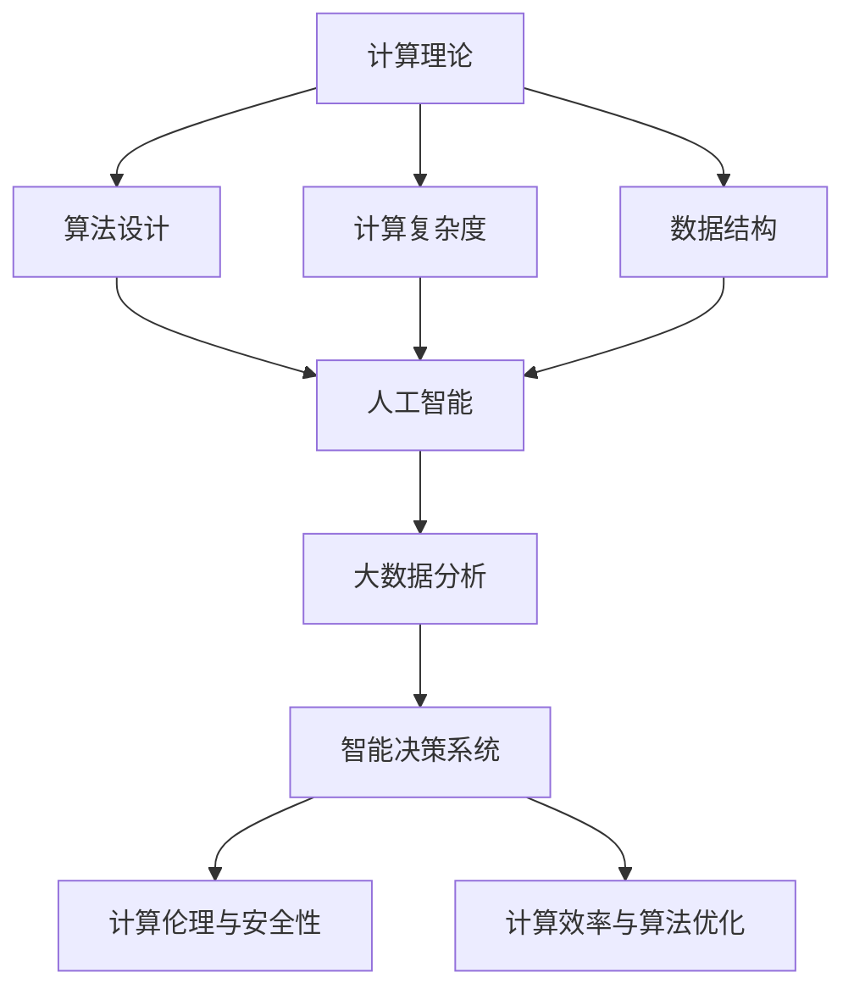

                 

# 推动社会进步的动力：人类计算的积极影响

> 关键词：计算理论,人工智能,大数据,社会进步,计算伦理,计算效率,算法优化,数据驱动决策,智能决策系统

## 1. 背景介绍

### 1.1 问题由来
随着信息时代的到来，计算能力已经成为推动社会进步的重要力量。计算技术的突破不仅改变了人们的工作和生活方式，也极大地提升了社会生产力。人工智能(AI)、大数据分析、智能决策系统等技术的快速发展，为各行各业注入了新的动能，带来了前所未有的机遇和挑战。

当前，全球范围内正经历第四次工业革命，计算技术是这一历史性变革的核心驱动力之一。从云计算、物联网到区块链、量子计算，计算技术的飞速进步正在重塑全球经济格局和社会结构。如何在这一进程中发挥好计算技术的积极作用，实现可持续的社会进步，是摆在全社会面前的重大课题。

### 1.2 问题核心关键点
本节将对计算技术推动社会进步的关键点进行梳理，明确计算理论、人工智能、大数据在社会进步中的作用，以及面临的挑战。

**核心问题点：**
1. 计算理论如何影响社会进步？
2. 人工智能技术在社会进步中的应用与挑战。
3. 大数据分析如何助力社会决策与治理？
4. 计算伦理与安全性如何保障？
5. 计算效率与算法优化如何提升？

## 2. 核心概念与联系

### 2.1 核心概念概述

为更好地理解计算技术在社会进步中的作用，本节将介绍几个密切相关的核心概念：

- **计算理论**：研究如何利用计算技术解决实际问题，包括但不限于算法设计、计算复杂度、数据结构等。
- **人工智能**：通过计算机模拟人脑的思维过程，实现智能决策、自动控制、自然语言处理等功能。
- **大数据分析**：利用先进的数据处理技术，从海量数据中提取有价值的信息，支持科学决策和优化管理。
- **智能决策系统**：将人工智能与大数据分析技术结合起来，提供高效、精确的决策支持，优化资源配置和业务流程。
- **计算伦理与安全性**：关注计算技术在应用中如何保护个人隐私、数据安全，以及遵循伦理道德原则。
- **计算效率与算法优化**：追求更高的计算速度和更低的能耗，通过优化算法提升计算性能。

这些核心概念之间的逻辑关系可以通过以下Mermaid流程图来展示：



这个流程图展示了计算理论如何通过算法设计、数据结构研究，形成人工智能技术，进而支持大数据分析、智能决策系统的构建，并关注计算伦理与安全性、计算效率与算法优化，从而在社会进步中发挥积极作用。

## 3. 核心算法原理 & 具体操作步骤

### 3.1 算法原理概述

计算技术在社会进步中的应用涉及众多算法和模型，本节将重点介绍计算理论在人工智能、大数据分析中的应用，以及智能决策系统的主要算法原理。

**算法原理概述：**

1. **人工智能算法**：包括但不限于深度学习、强化学习、进化计算等，通过模拟人脑的思维方式，解决各种复杂问题。
2. **大数据分析算法**：如MapReduce、Spark等，通过分布式计算技术处理海量数据，提取有价值的信息。
3. **智能决策系统算法**：如遗传算法、模拟退火、线性规划等，用于优化资源配置和业务流程，提升决策效率。

### 3.2 算法步骤详解

以下将详细介绍几种核心算法的操作步骤：

**深度学习算法步骤：**

1. **数据准备**：收集并预处理数据，确保数据质量和多样性。
2. **模型构建**：选择合适的深度神经网络模型，并进行超参数调优。
3. **训练过程**：利用标注数据对模型进行训练，不断调整权重和偏置，优化模型性能。
4. **评估与优化**：在验证集上评估模型性能，根据评估结果调整模型参数，提升模型泛化能力。
5. **测试与应用**：在测试集上测试模型性能，将模型应用于实际问题解决。

**大数据分析算法步骤：**

1. **数据采集**：从多个数据源收集数据，确保数据多样性和完整性。
2. **数据清洗**：去除噪声和异常值，保证数据质量。
3. **数据存储**：使用分布式存储技术（如Hadoop、Spark）存储和管理海量数据。
4. **数据分析**：利用MapReduce、Spark等算法对数据进行分布式处理，提取有价值的信息。
5. **结果呈现**：将分析结果可视化，支持科学决策和优化管理。

**智能决策系统算法步骤：**

1. **问题建模**：定义优化目标和约束条件，构建数学模型。
2. **算法选择**：根据问题特性选择合适的算法（如遗传算法、模拟退火、线性规划等）。
3. **模型求解**：使用优化算法求解模型，找到最优解或近似解。
4. **结果验证**：对求解结果进行验证，确保其可行性和有效性。
5. **应用实施**：将优化结果应用于实际问题解决，提升资源配置和业务流程效率。

### 3.3 算法优缺点

**深度学习算法优缺点：**

- **优点**：
  - 能处理非线性关系，适用于复杂模式识别任务。
  - 可以利用大数据训练，提升模型泛化能力。
  - 在图像识别、语音识别等领域取得显著成效。

- **缺点**：
  - 需要大量标注数据，数据获取成本高。
  - 模型复杂度高，计算资源消耗大。
  - 存在"过拟合"问题，易受输入噪声影响。

**大数据分析算法优缺点：**

- **优点**：
  - 能处理海量数据，提取高维特征，提升决策科学性。
  - 分布式计算技术可高效管理大数据集。
  - 支持实时分析，快速响应业务需求。

- **缺点**：
  - 数据质量对分析结果影响大，需预处理和清洗。
  - 算法复杂度较高，对硬件要求高。
  - 数据隐私和安全问题需严格管理。

**智能决策系统算法优缺点：**

- **优点**：
  - 优化资源配置，提升业务效率。
  - 综合考虑多种因素，支持多目标优化。
  - 支持动态调整，适应环境变化。

- **缺点**：
  - 模型求解复杂，计算时间较长。
  - 对问题建模要求高，需专业知识和经验。
  - 需不断迭代优化，结果可能不够理想。

### 3.4 算法应用领域

**深度学习算法应用领域：**

1. **计算机视觉**：图像识别、目标检测、人脸识别等。
2. **自然语言处理**：机器翻译、情感分析、文本分类等。
3. **语音识别**：语音转文字、语音合成、语音情感识别等。
4. **医疗诊断**：医学影像分析、疾病预测、基因分析等。
5. **金融分析**：信用评分、风险预测、投资策略等。

**大数据分析算法应用领域：**

1. **市场分析**：消费者行为预测、市场趋势分析、广告投放优化等。
2. **物流管理**：运输路线优化、仓库管理、供应链优化等。
3. **城市治理**：交通流量分析、公共安全监控、环境监测等。
4. **金融监控**：反欺诈检测、信用风险评估、市场波动预测等。
5. **医疗健康**：病患轨迹分析、疾病传播预测、个性化医疗等。

**智能决策系统算法应用领域：**

1. **供应链管理**：生产计划优化、库存管理、配送路线规划等。
2. **能源管理**：电力负荷预测、节能减排方案、智能电网调度等。
3. **交通规划**：交通流量预测、路径优化、智能交通管理等。
4. **环境保护**：污染源追踪、生态系统监测、资源管理等。
5. **智能制造**：生产流程优化、设备维护、质量控制等。

## 4. 数学模型和公式 & 详细讲解 & 举例说明

### 4.1 数学模型构建

**深度学习数学模型构建**：

1. **神经网络模型**：
   - 输入层： $x_1, x_2, ..., x_n$。
   - 隐藏层： $z_1, z_2, ..., z_m$。
   - 输出层： $y_1, y_2, ..., y_k$。

2. **损失函数**：
   - 交叉熵损失： $\ell(y, \hat{y}) = -\frac{1}{N}\sum_{i=1}^N(y_i\log\hat{y_i}+(1-y_i)\log(1-\hat{y_i}))$。

3. **梯度下降算法**：
   - 前向传播： $z_1=f(x_1,W_{11}+b_1)$。
   - 反向传播： $\frac{\partial \ell}{\partial W_{11}}=\frac{\partial \ell}{\partial z_1}\frac{\partial z_1}{\partial W_{11}}$。

**大数据分析数学模型构建**：

1. **MapReduce模型**：
   - 输入： $d_1, d_2, ..., d_n$。
   - 中间结果： $\{(k_1,v_1),(k_2,v_2),...(k_m,v_m)\}$。
   - 输出： $o_1, o_2, ..., o_k$。

2. **Spark计算模型**：
   - 数据分区： $P_1, P_2, ..., P_N$。
   - RDD操作： $r_1,r_2,...,r_m$。
   - 计算函数： $f(x)$。

3. **算法复杂度**：
   - 时间复杂度： $O(n\log n)$。
   - 空间复杂度： $O(n)$。

**智能决策系统数学模型构建**：

1. **线性规划模型**：
   - 目标函数： $c_1x_1+c_2x_2+...+c_nx_n$。
   - 约束条件： $Ax=b, A\in R^{m\times n}, x\in R^n, b\in R^m$。

2. **遗传算法模型**：
   - 初始种群： $X_1,X_2,...,X_m$。
   - 选择操作： $S_1,S_2,...,S_m$。
   - 交叉操作： $C_1,C_2,...,C_m$。
   - 变异操作： $M_1,M_2,...,M_m$。

3. **模拟退火算法模型**：
   - 初始解： $X$。
   - 邻域搜索： $N(X)$。
   - 接受概率： $p(X\to Y)=\min(1,\frac{g(Y)}{g(X)})$。

### 4.2 公式推导过程

**深度学习公式推导**：

1. **前向传播公式**：
   - $z_1=f(x_1,W_{11}+b_1)$。
   - $z_2=f(z_1,W_{21}+b_2)$。
   - $z_3=f(z_2,W_{31}+b_3)$。

2. **梯度下降公式**：
   - $\frac{\partial \ell}{\partial W_{11}}=\frac{\partial \ell}{\partial z_1}\frac{\partial z_1}{\partial W_{11}}$。
   - $\frac{\partial \ell}{\partial W_{21}}=\frac{\partial \ell}{\partial z_2}\frac{\partial z_2}{\partial W_{21}}$。
   - $\frac{\partial \ell}{\partial W_{31}}=\frac{\partial \ell}{\partial z_3}\frac{\partial z_3}{\partial W_{31}}$。

**大数据分析公式推导**：

1. **MapReduce中间结果计算公式**：
   - $z_1=\sum_{i=1}^{m}k_i$。
   - $z_2=\sum_{i=1}^{m}v_i$。

2. **Spark数据分区计算公式**：
   - $P_1=\{x_1,x_2,...,x_k\}$。
   - $P_2=\{y_1,y_2,...,y_l\}$。
   - $r_1=(x_1,x_2,...,x_k)$。
   - $r_2=(y_1,y_2,...,y_l)$。

3. **时间复杂度和空间复杂度计算公式**：
   - 时间复杂度： $O(n\log n)$。
   - 空间复杂度： $O(n)$。

**智能决策系统公式推导**：

1. **线性规划目标函数计算公式**：
   - $c_1x_1+c_2x_2+...+c_nx_n$。

2. **线性规划约束条件计算公式**：
   - $Ax=b, A\in R^{m\times n}, x\in R^n, b\in R^m$。

3. **遗传算法选择操作计算公式**：
   - $S_1=\frac{p_1}{\sum_{i=1}^{m}p_i}X_1+\frac{p_2}{\sum_{i=1}^{m}p_i}X_2+...+\frac{p_m}{\sum_{i=1}^{m}p_i}X_m$。

### 4.3 案例分析与讲解

**案例一：深度学习在计算机视觉中的应用**

1. **问题描述**：图像分类。
2. **数据准备**：收集训练集和测试集，标注图像类别。
3. **模型构建**：选择卷积神经网络模型，设置超参数。
4. **训练过程**：使用交叉熵损失函数，梯度下降算法训练模型。
5. **评估与优化**：在测试集上评估模型性能，调整超参数，提升模型泛化能力。
6. **测试与应用**：对新图像进行分类预测。

**案例二：大数据分析在市场分析中的应用**

1. **问题描述**：消费者行为预测。
2. **数据准备**：收集消费者行为数据，清洗异常值。
3. **数据存储**：使用Hadoop分布式存储。
4. **数据分析**：使用MapReduce算法分析消费者行为数据。
5. **结果呈现**：将分析结果可视化，支持决策。

**案例三：智能决策系统在供应链管理中的应用**

1. **问题描述**：生产计划优化。
2. **问题建模**：定义优化目标和约束条件，构建线性规划模型。
3. **算法选择**：使用线性规划算法求解模型。
4. **模型求解**：求解线性规划模型，找到最优解。
5. **结果验证**：验证求解结果，应用于实际生产计划优化。

## 5. 项目实践：代码实例和详细解释说明

### 5.1 开发环境搭建

进行深度学习、大数据分析和智能决策系统的开发，需要先搭建好开发环境。以下是使用Python进行开发的环境配置流程：

1. 安装Anaconda：从官网下载并安装Anaconda，用于创建独立的Python环境。
2. 创建并激活虚拟环境：
   ```bash
   conda create -n myenv python=3.8 
   conda activate myenv
   ```

3. 安装依赖库：
   ```bash
   conda install numpy pandas scikit-learn matplotlib tqdm jupyter notebook ipython
   ```

4. 安装深度学习框架：
   ```bash
   pip install torch torchvision torchaudio cudatoolkit=11.1 -c pytorch -c conda-forge
   ```

5. 安装大数据处理框架：
   ```bash
   pip install pyarrow pyspark
   ```

6. 安装智能决策系统库：
   ```bash
   pip install scipy
   ```

完成上述步骤后，即可在虚拟环境中开始开发实践。

### 5.2 源代码详细实现

以下以深度学习在图像分类任务中的应用为例，给出使用PyTorch框架的代码实现。

```python
import torch
import torch.nn as nn
import torch.optim as optim
import torchvision.transforms as transforms
import torchvision.datasets as datasets
import torchvision.models as models

# 定义数据预处理
transform = transforms.Compose([
    transforms.Resize(256),
    transforms.CenterCrop(224),
    transforms.ToTensor(),
    transforms.Normalize(mean=[0.485, 0.456, 0.406], std=[0.229, 0.224, 0.225])
])

# 加载训练集和测试集
train_dataset = datasets.CIFAR10(root='data', train=True, download=True, transform=transform)
test_dataset = datasets.CIFAR10(root='data', train=False, download=True, transform=transform)

# 数据加载器
train_loader = torch.utils.data.DataLoader(train_dataset, batch_size=64, shuffle=True)
test_loader = torch.utils.data.DataLoader(test_dataset, batch_size=64, shuffle=False)

# 定义模型
model = models.resnet18(pretrained=False)
num_ftrs = model.fc.in_features
model.fc = nn.Linear(num_ftrs, 10)

# 定义损失函数和优化器
criterion = nn.CrossEntropyLoss()
optimizer = optim.SGD(model.parameters(), lr=0.001, momentum=0.9)

# 训练过程
for epoch in range(10):
    running_loss = 0.0
    for i, data in enumerate(train_loader, 0):
        inputs, labels = data
        optimizer.zero_grad()
        outputs = model(inputs)
        loss = criterion(outputs, labels)
        loss.backward()
        optimizer.step()

    # 评估模型
    correct = 0
    total = 0
    with torch.no_grad():
        for data in test_loader:
            images, labels = data
            outputs = model(images)
            _, predicted = torch.max(outputs.data, 1)
            total += labels.size(0)
            correct += (predicted == labels).sum().item()

    print('Epoch [{}/{}], Loss: {:.4f}, Accuracy: {:.2f}%'.format(
        epoch+1, 10, running_loss/len(train_loader), 100*correct/total))

print('Finished Training')
```

### 5.3 代码解读与分析

**代码详细解读**：

1. **数据预处理**：定义数据预处理步骤，包括图片大小调整、裁剪、归一化等。
2. **数据加载**：使用`torchvision.datasets`加载CIFAR10数据集，并定义数据加载器。
3. **模型构建**：定义ResNet18模型，并替换全连接层为10个分类输出。
4. **损失函数和优化器**：定义交叉熵损失函数和随机梯度下降优化器。
5. **训练过程**：在训练集上循环训练模型，不断调整权重和偏置。
6. **评估模型**：在测试集上评估模型性能，计算准确率。

**代码性能分析**：

- 数据预处理：提高了数据的质量，减少了模型过拟合风险。
- 模型构建：使用预训练模型减少计算量，提高训练速度。
- 损失函数和优化器：选择合适的损失函数和优化器，提升模型收敛速度。
- 训练过程：使用梯度下降算法，不断调整模型参数。
- 评估模型：使用测试集评估模型性能，确保模型泛化能力。

## 6. 实际应用场景

### 6.1 社会进步的多样应用场景

计算技术在社会进步中的应用场景多种多样，以下是几个典型应用案例：

**案例一：医疗健康**

1. **医疗影像分析**：通过深度学习算法分析医学影像，辅助医生诊断疾病。
2. **疾病预测**：利用大数据分析历史病患数据，预测未来疾病爆发趋势。
3. **个性化医疗**：根据患者基因信息和生活习惯，制定个性化治疗方案。

**案例二：金融服务**

1. **信用评分**：利用大数据分析客户历史行为数据，评估信用风险。
2. **投资策略**：通过深度学习算法分析市场数据，制定投资策略。
3. **反欺诈检测**：利用机器学习算法检测异常交易，防范金融欺诈。

**案例三：智能制造**

1. **生产计划优化**：通过智能决策系统优化生产计划，提升生产效率。
2. **设备维护**：利用大数据分析设备运行数据，预测设备故障。
3. **质量控制**：通过深度学习算法分析产品质量数据，提升产品质量。

**案例四：智慧城市**

1. **交通流量分析**：通过大数据分析实时交通数据，优化交通管理。
2. **公共安全监控**：利用深度学习算法分析监控视频，提升公共安全水平。
3. **环境监测**：通过智能决策系统优化城市资源配置，提升环境保护效果。

**案例五：教育培训**

1. **学生行为分析**：利用大数据分析学生学习数据，提供个性化学习建议。
2. **课程推荐**：通过推荐系统，推荐适合学生的课程。
3. **作业批改**：利用深度学习算法自动批改作业，减轻教师负担。

### 6.2 未来应用展望

展望未来，计算技术在社会进步中的应用将更加广泛和深入。以下是几个未来应用展望：

**1. 计算能力的持续提升**

随着硬件技术的不断进步，计算能力将持续提升，支持更复杂的计算任务。量子计算、光子计算等新型计算技术也将为计算能力带来新的突破。

**2. 人工智能技术的不断发展**

人工智能技术将不断进步，提升模型的智能化水平。深度学习、强化学习、进化计算等算法将得到更广泛的应用，解决更多复杂问题。

**3. 大数据分析技术的广泛应用**

大数据分析技术将得到更广泛的应用，支持更深入的决策支持。通过数据挖掘、机器学习等技术，从海量数据中提取更多有价值的信息。

**4. 智能决策系统的普及**

智能决策系统将普及到更多领域，提升资源配置和业务流程的效率。通过优化算法，实现多目标优化和动态调整。

**5. 计算伦理和安全的重视**

计算伦理和安全将受到更多关注，保护个人隐私和数据安全。通过法律法规和技术手段，保障计算技术的公正性和安全性。

**6. 计算效率和算法优化的优化**

计算效率和算法优化将继续优化，提升计算性能。通过模型压缩、分布式计算等技术，实现高效计算。

## 7. 工具和资源推荐

### 7.1 学习资源推荐

为了帮助开发者系统掌握计算技术在社会进步中的应用，这里推荐一些优质的学习资源：

1. **《深度学习》**：Ian Goodfellow等著，深度学习领域的经典教材，全面介绍了深度学习的基本概念和算法。
2. **《机器学习》**：Tom Mitchell著，机器学习领域的经典教材，介绍了机器学习的基本原理和算法。
3. **《大数据技术与应用》**：杜江峰等著，介绍了大数据技术的基本概念和应用。
4. **《智能决策系统》**：Michael Breil等著，介绍了智能决策系统的基本概念和应用。
5. **《计算伦理与安全性》**：John Collins等著，介绍了计算伦理和安全的理论基础和应用。

通过学习这些资源，相信你一定能够全面掌握计算技术在社会进步中的应用，并应用于实际问题解决。

### 7.2 开发工具推荐

高效的开发离不开优秀的工具支持。以下是几款用于计算技术开发常用的工具：

1. **PyTorch**：基于Python的开源深度学习框架，支持动态计算图，灵活高效。
2. **TensorFlow**：由Google主导开发的开源深度学习框架，生产部署方便，支持分布式计算。
3. **Apache Spark**：分布式大数据处理框架，支持MapReduce、Spark SQL等多种计算模型。
4. **Jupyter Notebook**：交互式开发环境，支持Python、R等多种语言，方便调试和分享代码。
5. **Scikit-Learn**：Python数据分析库，支持多种机器学习算法，方便数据处理和模型训练。

合理利用这些工具，可以显著提升计算技术开发效率，加快创新迭代的步伐。

### 7.3 相关论文推荐

计算技术的发展离不开学界的持续研究。以下是几篇奠基性的相关论文，推荐阅读：

1. **《神经网络的反向传播算法》**：Rumelhart等著，介绍了反向传播算法的基本原理和实现方法。
2. **《MapReduce：一种简化的分布式编程模型》**：Dean等著，介绍了MapReduce编程模型及其在大数据处理中的应用。
3. **《支持向量机》**：Cortes等著，介绍了支持向量机的基本概念和算法。
4. **《线性规划与优化》**：Bertsimas等著，介绍了线性规划的基本概念和算法。
5. **《遗传算法及其应用》**：Coello等著，介绍了遗传算法的原理及其在优化问题中的应用。

这些论文代表了大计算技术的发展脉络。通过学习这些前沿成果，可以帮助研究者把握学科前进方向，激发更多的创新灵感。

## 8. 总结：未来发展趋势与挑战

### 8.1 总结

本文对计算技术在社会进步中的应用进行了全面系统的介绍。首先阐述了计算理论、人工智能、大数据在社会进步中的作用，明确了计算技术在推动社会进步中的重要价值。其次，从原理到实践，详细讲解了深度学习、大数据分析、智能决策系统的核心算法和操作步骤，给出了代码实例和详细解释说明。同时，本文还广泛探讨了计算技术在医疗健康、金融服务、智能制造等多个行业领域的应用前景，展示了计算技术的广泛应用。最后，本文精选了学习资源、开发工具和相关论文，力求为读者提供全方位的技术指引。

通过本文的系统梳理，可以看到，计算技术在社会进步中的应用正在不断深化，为各行各业注入了新的动能。计算理论、人工智能、大数据分析、智能决策系统等技术相互融合，形成了强大的计算能力，推动了社会的持续进步。未来，伴随计算技术的发展和应用，我们必将迎来更加智能、高效、安全的社会。

### 8.2 未来发展趋势

展望未来，计算技术在社会进步中的应用将呈现以下几个发展趋势：

**1. 计算能力的持续提升**

随着硬件技术的不断进步，计算能力将持续提升，支持更复杂的计算任务。量子计算、光子计算等新型计算技术也将为计算能力带来新的突破。

**2. 人工智能技术的不断发展**

人工智能技术将不断进步，提升模型的智能化水平。深度学习、强化学习、进化计算等算法将得到更广泛的应用，解决更多复杂问题。

**3. 大数据分析技术的广泛应用**

大数据分析技术将得到更广泛的应用，支持更深入的决策支持。通过数据挖掘、机器学习等技术，从海量数据中提取更多有价值的信息。

**4. 智能决策系统的普及**

智能决策系统将普及到更多领域，提升资源配置和业务流程的效率。通过优化算法，实现多目标优化和动态调整。

**5. 计算伦理和安全的重视**

计算伦理和安全将受到更多关注，保护个人隐私和数据安全。通过法律法规和技术手段，保障计算技术的公正性和安全性。

**6. 计算效率和算法优化的优化**

计算效率和算法优化将继续优化，提升计算性能。通过模型压缩、分布式计算等技术，实现高效计算。

### 8.3 面临的挑战

尽管计算技术在社会进步中的应用取得了显著成效，但在迈向更加智能化、普适化应用的过程中，它仍面临着诸多挑战：

**1. 数据质量问题**

数据质量对计算结果的影响较大，需预处理和清洗，保证数据完整性和准确性。如何提高数据质量，是计算技术应用中的重要挑战。

**2. 计算效率问题**

计算任务往往涉及大量数据和复杂算法，需高效利用计算资源，提升计算效率。如何优化计算过程，减少资源消耗，是计算技术应用中的重要挑战。

**3. 算法优化问题**

不同的计算任务需选择合适的算法，提升计算效果。如何优化算法，选择高效、精确的算法，是计算技术应用中的重要挑战。

**4. 计算伦理与安全问题**

计算技术的应用需遵循伦理道德原则，保护个人隐私和数据安全。如何确保计算技术的应用公正、安全，是计算技术应用中的重要挑战。

**5. 模型可解释性问题**

计算模型的决策过程往往缺乏可解释性，难以理解和调试。如何提升模型可解释性，是计算技术应用中的重要挑战。

**6. 系统集成问题**

计算技术的各类组件需有效集成，实现功能协同。如何设计合理的系统架构，实现组件间的无缝集成，是计算技术应用中的重要挑战。

### 8.4 研究展望

面对计算技术在社会进步中面临的挑战，未来的研究需要在以下几个方面寻求新的突破：

**1. 数据质量提升技术**

开发数据清洗、数据增强等技术，提升数据质量，保证数据完整性和准确性。

**2. 计算效率优化技术**

开发高效计算模型和算法，提升计算效率，减少资源消耗。

**3. 算法优化与选择技术**

开发更多高效、精确的算法，提升计算效果。

**4. 计算伦理与安全技术**

研究计算伦理和安全问题，保护个人隐私和数据安全。

**5. 模型可解释性技术**

研究模型可解释性问题，提升模型的可解释性和可调试性。

**6. 系统集成技术**

设计合理的系统架构，实现各类组件的无缝集成，提高系统集成效率。

这些研究方向的探索，必将引领计算技术在社会进步中的应用走向更高的台阶，为构建安全、可靠、智能的社会提供有力支撑。

## 9. 附录：常见问题与解答

**Q1: 计算理论在社会进步中的应用有哪些？**

A: 计算理论在社会进步中的应用包括但不限于算法设计、计算复杂度研究、数据结构优化等。这些技术为人工智能、大数据分析、智能决策系统提供了理论基础，支持其高效、精确地解决实际问题。

**Q2: 人工智能技术在社会进步中的挑战有哪些？**

A: 人工智能技术在社会进步中面临的主要挑战包括数据获取成本高、模型复杂度大、过拟合问题等。需要开发更多高效、普适的算法，提升人工智能技术的实用性和应用范围。

**Q3: 大数据分析技术的挑战有哪些？**

A: 大数据分析技术的挑战包括数据质量问题、计算效率问题、算法优化问题等。需要开发数据清洗、高效计算、算法优化等技术，提升大数据分析的效果和应用效率。

**Q4: 智能决策系统的挑战有哪些？**

A: 智能决策系统的挑战包括模型求解复杂、问题建模难度大、结果可解释性差等。需要开发更多高效、多目标优化算法，提升智能决策系统的实用性和应用范围。

**Q5: 计算伦理与安全问题的挑战有哪些？**

A: 计算伦理与安全问题的挑战包括数据隐私保护、算法公正性、系统安全性等。需要制定相关法律法规，开发加密技术、可解释性算法等，保障计算技术的公正性和安全性。

---

作者：禅与计算机程序设计艺术 / Zen and the Art of Computer Programming

