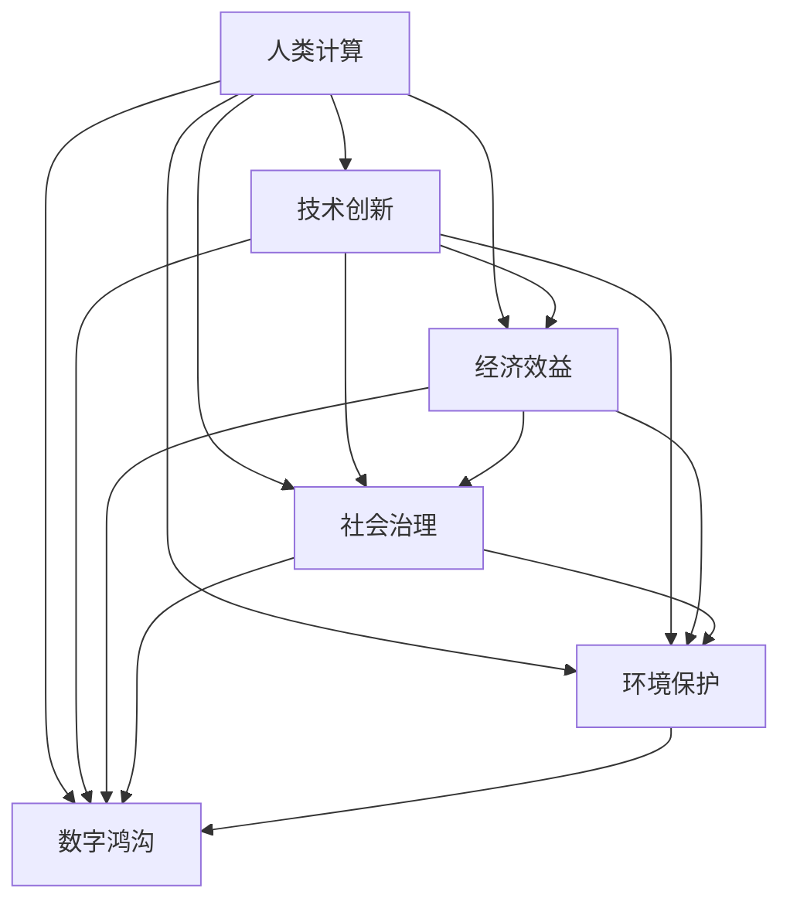

                 

# 推动社会进步的动力：人类计算的积极影响

> 关键词：人类计算, 社会进步, 技术创新, 经济效益, 社会治理, 环境保护, 数字鸿沟

## 1. 背景介绍

### 1.1 问题由来

随着信息技术的发展，人类社会的计算能力有了质的飞跃，计算已经成为了推动社会进步的重要动力。从早期的机械计算到后来的电子计算机，再到今天的超级计算机和量子计算，计算能力不仅改变了人类的生活方式，也催生了新的产业和技术，促进了经济社会的全面发展。

### 1.2 问题核心关键点

当前，计算在推动社会进步方面扮演了至关重要的角色，主要体现在以下几个方面：

1. **技术创新**：计算能力的大幅提升，促进了人工智能、大数据、云计算等新技术的快速发展，推动了科技产业的革新和升级。
2. **经济效益**：计算技术的广泛应用，带来了生产力的显著提升，促进了经济增长和就业创造。
3. **社会治理**：通过计算，政府可以更有效地进行数据驱动的决策，提升公共服务的质量和效率。
4. **环境保护**：计算技术在环境监测、资源管理等领域的应用，助力生态文明建设，推动绿色发展。
5. **数字鸿沟**：计算能力的不均等分布，加剧了数字鸿沟问题，但同时也可以通过计算技术缩小数字鸿沟，促进社会公平。

这些关键点揭示了计算在推动社会进步中的多重作用，显示了计算技术的巨大潜力。

## 2. 核心概念与联系

### 2.1 核心概念概述

- **人类计算**：指通过计算机、智能手机等设备进行的计算活动，涵盖了从简单的数据处理到复杂的算法运算。
- **社会进步**：指社会在经济、政治、文化等各个方面的全面发展，计算技术的应用被视为推动这一进程的关键因素。
- **技术创新**：指通过计算技术实现的新产品、新服务和新方法，这些创新推动了产业变革和社会转型。
- **经济效益**：指计算技术带来的经济增长、就业创造和产业升级等直接和间接效益。
- **社会治理**：指利用计算技术提升政府决策、公共服务和城市管理等社会治理能力。
- **环境保护**：指通过计算技术进行环境监测、资源管理和生态系统保护等活动，促进绿色发展。
- **数字鸿沟**：指因计算资源不均等导致的社会不平等现象，计算技术的应用有助于缩小这一差距，促进社会公平。

这些概念之间的关系可以通过以下Mermaid流程图来展示：



这个流程图展示了人类计算能力如何通过技术创新、经济效益、社会治理、环境保护和数字鸿沟等途径，推动社会进步的全过程。

## 3. 核心算法原理 & 具体操作步骤
### 3.1 算法原理概述

计算技术通过数字化手段，将人类活动的各个方面转化为数据，通过算法进行分析和处理，最终转化为决策和行动，从而推动社会进步。

### 3.2 算法步骤详解

1. **数据采集与处理**：通过传感器、网络等手段，采集各类数据，如社会经济数据、环境数据、人口数据等，并对其进行清洗和预处理。
2. **算法设计与实现**：选择合适的算法模型，如机器学习、深度学习、优化算法等，进行模型训练和优化。
3. **数据驱动决策**：将处理后的数据输入到算法模型中，通过模型预测和分析，生成决策建议和行动方案。
4. **反馈与迭代**：根据决策结果进行实际应用，收集反馈数据，不断优化算法和模型，实现持续改进。

### 3.3 算法优缺点

**优点**：

- **效率高**：计算技术可以处理大规模数据，提升决策速度和响应速度。
- **精准性强**：通过算法模型，可以实现更精准的预测和分析，提升决策的科学性和准确性。
- **可扩展性好**：计算技术可以灵活应用于各类场景，推动不同领域的发展。

**缺点**：

- **数据质量要求高**：数据的准确性和完整性直接影响计算结果的可靠性。
- **算法复杂度高**：设计复杂的算法模型需要高度专业的知识和技能，存在一定的技术门槛。
- **隐私与安全问题**：数据处理和算法模型可能涉及隐私和安全问题，需严格遵守相关法律法规。

### 3.4 算法应用领域

计算技术在多个领域得到了广泛应用，具体包括：

1. **医疗健康**：通过计算技术，实现疾病预测、精准医疗、健康管理等服务，提升医疗服务质量。
2. **金融服务**：利用计算技术进行风险评估、金融预测、智能投顾等服务，推动金融创新和普惠金融。
3. **教育培训**：通过计算技术实现个性化学习、智能评估、教育管理等功能，提升教育质量。
4. **城市管理**：运用计算技术进行智慧城市建设，提升城市规划、交通管理、公共安全等能力。
5. **环境保护**：采用计算技术进行环境监测、资源管理、气候预测等活动，促进绿色发展。

## 4. 数学模型和公式 & 详细讲解 & 举例说明

### 4.1 数学模型构建

计算技术的应用涉及到各类数学模型和算法，这里以机器学习为例，构建一个简单的分类模型：

- **输入数据**：假设我们有一组样本数据 $(x_1, y_1), (x_2, y_2), ..., (x_n, y_n)$，其中 $x_i$ 是特征向量，$y_i$ 是标签。
- **模型定义**：假设我们使用线性分类器，模型的形式为 $f(x; \theta) = \theta^T x + b$，其中 $\theta$ 是模型参数，$b$ 是偏置项。
- **损失函数**：我们通常使用交叉熵损失函数，其形式为 $\mathcal{L}(\theta) = -\frac{1}{N} \sum_{i=1}^N [y_i \log f(x_i; \theta) + (1-y_i) \log (1-f(x_i; \theta))]$。

### 4.2 公式推导过程

- **梯度计算**：根据损失函数对 $\theta$ 的偏导数，可以得到模型的梯度表达式：$\nabla_{\theta} \mathcal{L}(\theta) = \frac{1}{N} \sum_{i=1}^N [y_i - f(x_i; \theta)] x_i$。
- **更新规则**：结合梯度下降算法，更新模型的参数，其形式为 $\theta \leftarrow \theta - \eta \nabla_{\theta} \mathcal{L}(\theta)$，其中 $\eta$ 是学习率。

### 4.3 案例分析与讲解

以医疗健康领域的疾病预测为例，我们可以使用机器学习算法，如逻辑回归、支持向量机等，对病人的历史数据进行分析，预测其患病风险。通过这种方式，医生可以提前采取措施，预防疾病的发生，提高患者的生存率和生活质量。

## 5. 项目实践：代码实例和详细解释说明
### 5.1 开发环境搭建

为了进行计算技术的项目实践，需要搭建好开发环境，一般包括以下步骤：

1. **安装Python**：选择合适版本的Python，如3.8或3.9，确保与所选库兼容。
2. **安装相关库**：安装常用的计算库，如NumPy、Pandas、Scikit-learn等。
3. **安装机器学习框架**：如TensorFlow、PyTorch等，选择其中一种即可。
4. **环境配置**：配置Python环境变量，确保开发工具可以正常运行。

### 5.2 源代码详细实现

以医疗健康领域的疾病预测为例，下面是一个使用TensorFlow实现逻辑回归的代码示例：

```python
import tensorflow as tf
from sklearn.datasets import load_breast_cancer

# 加载数据集
data = load_breast_cancer()
X, y = data.data, data.target

# 定义模型
model = tf.keras.Sequential([
    tf.keras.layers.Dense(64, activation='relu', input_shape=(30,)),
    tf.keras.layers.Dense(1, activation='sigmoid')
])

# 定义损失函数和优化器
loss_fn = tf.keras.losses.BinaryCrossentropy()
optimizer = tf.keras.optimizers.Adam()

# 训练模型
model.compile(optimizer=optimizer, loss=loss_fn, metrics=['accuracy'])
model.fit(X, y, epochs=10, batch_size=32, validation_split=0.2)
```

### 5.3 代码解读与分析

以上代码实现了一个简单的逻辑回归模型，用于预测乳腺癌的患病风险。其中，`Sequential` 是 TensorFlow 的序列模型，`Dense` 层用于定义全连接层，`relu` 和 `sigmoid` 是激活函数，分别用于非线性变换和二值化输出。通过 `compile` 方法进行模型编译，`fit` 方法进行模型训练，`validation_split` 参数用于设置验证集比例。

### 5.4 运行结果展示

训练完成后，可以通过 `model.evaluate` 方法进行模型评估：

```python
loss, accuracy = model.evaluate(X, y)
print(f"Test accuracy: {accuracy:.2f}")
```

输出结果会显示模型在测试集上的准确率。

## 6. 实际应用场景
### 6.1 医疗健康

计算技术在医疗健康领域的应用广泛，例如：

- **疾病预测**：通过分析病人的历史数据，预测其患病的概率，提前进行干预。
- **精准医疗**：利用基因数据、影像数据等，实现个性化治疗方案的制定。
- **健康管理**：通过智能手环、智能穿戴设备等，实时监测健康指标，提供健康建议。

### 6.2 金融服务

在金融领域，计算技术主要应用于：

- **风险评估**：利用历史交易数据、市场数据等，评估客户的信用风险和投资风险。
- **智能投顾**：通过自然语言处理技术，提供个性化的投资建议。
- **反欺诈检测**：使用机器学习算法，实时检测交易行为，防范金融欺诈。

### 6.3 教育培训

计算技术在教育培训领域的应用包括：

- **个性化学习**：根据学生的学习行为和成绩，提供个性化的学习计划和资源。
- **智能评估**：通过自动化评估系统，实时反馈学生的学习进度和理解情况。
- **教育管理**：利用数据分析技术，优化教育资源配置和教学管理。

### 6.4 城市管理

计算技术在城市管理中的应用主要体现在：

- **智慧城市建设**：通过物联网、大数据等技术，实现城市管理的智能化和精细化。
- **交通管理**：利用实时数据，优化交通流量，减少拥堵。
- **公共安全**：通过视频监控、社交媒体等数据，提升公共安全水平。

### 6.5 环境保护

计算技术在环境保护中的应用包括：

- **环境监测**：利用传感器、卫星数据等，实时监测空气质量、水质等环境指标。
- **资源管理**：通过数据分析，优化资源配置，提高资源利用效率。
- **气候预测**：利用历史气候数据，预测未来的气候变化趋势，制定应对策略。

## 7. 工具和资源推荐
### 7.1 学习资源推荐

为了帮助开发者系统掌握计算技术的应用，推荐以下学习资源：

1. **机器学习课程**：如斯坦福大学的《机器学习》（Andrew Ng），提供系统的机器学习理论和方法。
2. **深度学习框架**：如 TensorFlow、PyTorch 等，提供丰富的工具和库，支持各种计算任务的实现。
3. **数据科学竞赛平台**：如 Kaggle，提供大量的数据集和竞赛项目，实战练兵。
4. **开源项目**：如 TensorFlow、scikit-learn 等，丰富的开源项目，提供实战经验。
5. **在线课程**：如 Coursera、Udacity 等平台，提供多种计算技术相关的在线课程，方便灵活学习。

### 7.2 开发工具推荐

常用的计算技术开发工具包括：

1. **Python**：普及度高的编程语言，拥有丰富的计算库和框架。
2. **Jupyter Notebook**：支持代码执行和结果展示，方便开发和分享。
3. **RStudio**：R语言的支持工具，丰富的可视化功能。
4. **SciPy**：用于科学计算和数据分析的库，支持高效的数据处理。
5. **Matplotlib**：数据可视化的标准库，支持多种图表展示。

### 7.3 相关论文推荐

以下是几篇具有代表性的计算技术论文，推荐阅读：

1. **神经网络与深度学习**（Ian Goodfellow 著）：深入介绍神经网络的基本原理和应用。
2. **TensorFlow 2.0 手册**：TensorFlow 的官方文档，详细说明 TensorFlow 的使用方法和最佳实践。
3. **机器学习实战**（Peter Harrington 著）：通过实际案例，展示机器学习的应用流程和技巧。
4. **深度学习入门**（Ian Goodfellow、Yoshua Bengio、Aaron Courville 著）：系统介绍深度学习的基本理论和实践。

## 8. 总结：未来发展趋势与挑战
### 8.1 研究成果总结

计算技术在推动社会进步方面发挥了重要作用，已经取得了显著的成果。未来，计算技术将继续深入发展，引领更多领域的进步。

### 8.2 未来发展趋势

1. **量子计算**：随着量子计算技术的成熟，计算能力将实现质的飞跃，解决更多复杂问题。
2. **人工智能**：AI技术的持续进步，将推动智能系统在更多领域的应用。
3. **5G/6G**：新一代通信技术的发展，将进一步提升数据传输和处理能力。
4. **物联网**：物联网技术的普及，将实现万物互联，提升计算能力。
5. **区块链**：区块链技术的应用，将推动数据安全和透明化。

### 8.3 面临的挑战

计算技术在推动社会进步的同时，也面临着一些挑战：

1. **数据隐私与安全**：计算技术的应用涉及大量敏感数据，需要严格的数据保护措施。
2. **算法公平性**：计算模型可能存在偏见，需要采取措施确保算法的公平性。
3. **计算资源不均等**：计算资源的不均等分布，加剧了数字鸿沟问题，需要更多政策支持。
4. **技术伦理**：计算技术的应用需遵循伦理规范，避免误导和滥用。

### 8.4 研究展望

未来的研究应聚焦于以下几个方向：

1. **高效计算模型**：开发更高效、更快速的计算模型，提升计算能力。
2. **跨学科融合**：将计算技术与其他学科融合，推动更多领域的发展。
3. **可解释性**：提升计算模型的可解释性，增强透明性和可信度。
4. **社会伦理**：研究和制定计算技术的伦理规范，保障社会公平和正义。

## 9. 附录：常见问题与解答

**Q1：如何提高计算模型的训练效率？**

A: 提高计算模型的训练效率可以从以下几个方面入手：

- **数据预处理**：通过数据清洗、特征选择等手段，减少无用的数据，提高训练速度。
- **模型优化**：使用更高效的模型结构，如卷积神经网络、注意力机制等，提升训练速度。
- **分布式训练**：利用多台机器进行分布式训练，提高计算资源利用率。
- **混合精度训练**：使用混合精度训练（即使用半精度浮点数进行计算），减少计算资源的消耗。

**Q2：如何应对计算技术带来的数据隐私和安全问题？**

A: 数据隐私和安全是计算技术应用的重要问题，以下是一些应对策略：

- **数据加密**：对数据进行加密处理，防止数据泄露。
- **差分隐私**：在数据处理过程中加入噪声，保护数据隐私。
- **访问控制**：设置严格的访问权限，防止未经授权的访问。
- **联邦学习**：在数据本地处理，减少数据泄露风险。

**Q3：如何确保计算模型的公平性？**

A: 确保计算模型的公平性可以从以下几个方面入手：

- **数据平衡**：确保训练数据集的多样性和平衡性，避免数据偏见。
- **算法优化**：使用公平性评估指标，优化算法模型，减少偏见。
- **算法透明度**：增加算法的透明度，确保模型决策的透明和可解释。
- **伦理审查**：建立伦理审查机制，确保模型应用的合规性。

**Q4：如何提升计算模型的可解释性？**

A: 提升计算模型的可解释性可以从以下几个方面入手：

- **可视化技术**：使用可视化技术展示模型的内部结构和参数变化。
- **特征重要性分析**：分析模型特征的重要性，解释模型决策的依据。
- **解释模型**：使用解释模型（如LIME、SHAP等），提供模型预测的解释和理解。
- **用户界面**：设计友好的用户界面，方便用户理解模型输出和决策。

---

作者：禅与计算机程序设计艺术 / Zen and the Art of Computer Programming

