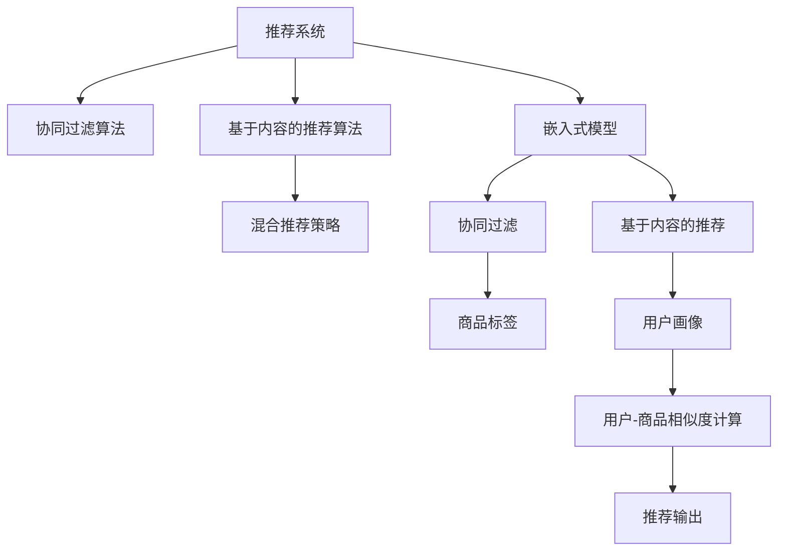

                 

# 推荐系统中的冷启动商品处理策略

> 关键词：推荐系统,冷启动问题,商品推荐,用户画像,内容标签,商品标签,混合推荐策略,嵌入式模型,协同过滤算法,基于内容的推荐算法

## 1. 背景介绍

### 1.1 问题由来

推荐系统（Recommender System）是利用用户历史行为数据，为用户推荐其可能感兴趣的商品或内容的一类系统。在推荐系统的实际应用中，冷启动问题（Cold Start Problem）是一个常见且棘手的挑战。冷启动问题通常发生在以下几种场景中：

- **新用户注册**：对于新注册的用户，没有历史行为数据，无法准确为其推荐商品。
- **新商品上架**：对于新上架的商品，没有用户历史交互记录，无法精准推广。
- **多模态数据融合**：将用户画像、内容标签、商品标签等多类数据融合进行推荐时，需要应对不同类型数据之间的映射和融合问题。

这些问题会极大地影响推荐系统的性能，降低用户体验和商家的收益。

### 1.2 问题核心关键点

冷启动问题的主要难点在于：

- **缺乏数据**：新用户和新商品没有历史行为数据，推荐系统难以为其提供精准推荐。
- **用户画像不完整**：即使存在部分用户数据，但用户画像可能不完整，存在稀疏性。
- **数据不一致**：不同类型的数据（如文本标签、用户画像等）在形式上和尺度上存在不一致，难以进行统一的融合和推荐。
- **推荐算法泛化能力不足**：冷启动下的推荐算法需要更好地泛化，避免出现泛化过拟合现象。

## 2. 核心概念与联系

### 2.1 核心概念概述

为更好地理解冷启动商品处理策略，本节将介绍几个密切相关的核心概念：

- **推荐系统（Recommender System）**：利用用户行为数据为用户推荐商品的系统。
- **冷启动问题（Cold Start Problem）**：推荐系统在面临新用户或新商品时，由于缺乏历史行为数据而难以提供推荐的问题。
- **协同过滤算法（Collaborative Filtering）**：利用用户之间的相似性进行推荐，包括基于用户的协同过滤和基于物品的协同过滤。
- **基于内容的推荐算法（Content-based Recommendation）**：根据物品的特征进行推荐，适用于标签和用户画像较为丰富的场景。
- **混合推荐策略（Hybrid Recommendation Strategy）**：结合协同过滤和基于内容的推荐算法，充分发挥两者的优势。
- **嵌入式模型（Embedding Model）**：通过低维稠密向量表示用户和商品的特征，方便进行高效率的推荐计算。

这些核心概念之间的逻辑关系可以通过以下Mermaid流程图来展示：



这个流程图展示了几类核心概念及其之间的联系：

1. 推荐系统利用协同过滤、基于内容的推荐和混合推荐策略等多种技术进行推荐。
2. 嵌入式模型通过对用户和商品特征进行稠密向量表示，方便协同过滤和基于内容的推荐。
3. 协同过滤和基于内容的推荐需要利用商品标签和用户画像等数据。
4. 协同过滤和基于内容的推荐通过计算用户-商品相似度来生成推荐。

## 3. 核心算法原理 & 具体操作步骤
### 3.1 算法原理概述

冷启动商品处理策略的核心目标是：在推荐系统新用户注册或新商品上架时，如何快速为其提供精准推荐。常用的方法包括利用用户画像、商品标签、嵌入式模型和混合推荐策略等多种技术手段。

### 3.2 算法步骤详解

以下是推荐系统中常见的冷启动商品处理策略：

**Step 1: 用户画像和商品标签构建**

对于新注册的用户和上架的商品，首先需要构建或完善其画像和标签。用户画像可以包括用户的基本信息、历史行为数据、兴趣偏好等。商品标签则可以包括商品的基本属性、分类、关键词等。构建用户画像和商品标签的过程通常包括以下几个步骤：

1. **数据收集**：从用户和商品的基本数据、历史行为数据、社交网络数据等渠道收集相关数据。
2. **数据清洗**：对收集到的数据进行去重、填补缺失值等预处理操作。
3. **特征提取**：通过自然语言处理、特征工程等方法，从数据中提取有意义的特征，如词频、TF-IDF等。
4. **标签映射**：将提取的特征进行标签映射，生成用户画像和商品标签。

**Step 2: 嵌入式模型训练**

嵌入式模型（Embedding Model）通过低维稠密向量表示用户和商品的特征，方便进行高效的相似度计算。嵌入式模型的训练通常需要以下步骤：

1. **初始化模型**：对模型参数进行随机初始化，设定学习率和优化器。
2. **数据预处理**：将用户画像和商品标签数据进行向量化处理，生成特征矩阵。
3. **模型训练**：通过优化器对模型进行训练，最小化损失函数。
4. **特征编码**：将训练好的模型输出进行编码，生成用户画像和商品标签的稠密向量表示。

**Step 3: 混合推荐策略应用**

混合推荐策略（Hybrid Recommendation Strategy）结合协同过滤和基于内容的推荐算法，充分发挥两者的优势。混合推荐策略的实现通常包括以下几个步骤：

1. **协同过滤推荐**：利用用户-商品矩阵计算用户-商品相似度，生成推荐结果。
2. **基于内容的推荐**：根据用户画像和商品标签生成推荐结果。
3. **融合推荐结果**：将协同过滤和基于内容的推荐结果进行融合，生成最终的推荐结果。

### 3.3 算法优缺点

冷启动商品处理策略的主要优点包括：

- **快速响应**：利用嵌入式模型和混合推荐策略，可以迅速生成推荐结果，提高用户满意度。
- **泛化能力**：嵌入式模型和混合推荐策略具有较好的泛化能力，能够应对新用户和新商品。
- **多模态融合**：通过构建用户画像和商品标签，能够较好地融合多种类型的数据，提升推荐精度。

这些方法也存在一些缺点：

- **数据质量要求高**：用户画像和商品标签的构建需要高质量的数据，数据收集和预处理难度较大。
- **计算资源消耗大**：嵌入式模型的训练需要大量的计算资源，尤其是高维稀疏矩阵的计算。
- **推荐结果多样性不足**：混合推荐策略可能过于依赖协同过滤或基于内容的推荐，导致推荐结果多样性不足。

### 3.4 算法应用领域

冷启动商品处理策略在推荐系统中的应用非常广泛，可以用于以下几个领域：

- **电商购物**：在新用户注册和商品上架时，提供精准的个性化推荐，提升用户体验和销售转化率。
- **视频平台**：在推荐视频内容时，利用用户画像和商品标签，快速生成个性化推荐，提高用户粘性。
- **新闻媒体**：在推荐新闻内容时，通过用户画像和商品标签，生成个性化的新闻推荐，提升用户的阅读兴趣。
- **音乐平台**：在推荐音乐内容时，利用用户画像和商品标签，快速生成个性化的音乐推荐，提升用户音乐体验。

## 4. 数学模型和公式 & 详细讲解 & 举例说明

### 4.1 数学模型构建

本节将使用数学语言对冷启动商品处理策略进行更加严格的刻画。

记用户画像为 $U=\{u_1, u_2, ..., u_m\}$，其中 $u_i$ 为用户 $i$ 的画像特征向量。记商品标签为 $I=\{i_1, i_2, ..., i_n\}$，其中 $i_j$ 为商品 $j$ 的标签特征向量。记嵌入式模型为 $E$，将用户画像和商品标签映射到低维稠密向量空间中。记协同过滤相似度为 $sim_{u,i}$，基于内容的相似度为 $sim_{c,u,i}$。

### 4.2 公式推导过程

假设用户画像和商品标签的向量化表示为 $\mathbf{U} \in \mathbb{R}^{m \times d}$，$\mathbf{I} \in \mathbb{R}^{n \times d}$，其中 $d$ 为特征向量的维度。假设嵌入式模型为 $E: \mathbb{R}^{m \times d} \times \mathbb{R}^{n \times d} \rightarrow \mathbb{R}^{d'}$，其中 $d'$ 为低维稠密向量的维度。

协同过滤相似度 $sim_{u,i}$ 和基于内容的相似度 $sim_{c,u,i}$ 可以表示为：

$$
sim_{u,i} = \frac{\mathbf{E}(\mathbf{u}_i, \mathbf{i}_i)^T \mathbf{E}(\mathbf{u}_i, \mathbf{i}_i)}{\|\mathbf{E}(\mathbf{u}_i, \mathbf{i}_i)\|^2}
$$

$$
sim_{c,u,i} = \frac{\mathbf{E}(\mathbf{u}_i, \mathbf{i}_i)^T \mathbf{E}(\mathbf{i}_i, \mathbf{i}_j)}{\|\mathbf{E}(\mathbf{u}_i, \mathbf{i}_i)\| \cdot \|\mathbf{E}(\mathbf{i}_i, \mathbf{i}_j)\|}
$$

其中 $\mathbf{E}(\mathbf{u}_i, \mathbf{i}_i)$ 表示用户 $i$ 和商品 $i$ 的嵌入式模型表示。最终的推荐结果可以表示为：

$$
\mathbf{r} = \alpha \cdot \sum_{i=1}^{n} sim_{u,i} \cdot \mathbf{E}(\mathbf{i}_i, \mathbf{i}_i) + (1 - \alpha) \cdot \sum_{i=1}^{n} sim_{c,u,i} \cdot \mathbf{E}(\mathbf{i}_i, \mathbf{i}_i)
$$

其中 $\alpha$ 为协同过滤和基于内容的推荐权重，可以根据实际效果进行调参。

### 4.3 案例分析与讲解

以电商推荐系统为例，分析嵌入式模型和混合推荐策略的实现。

**案例场景**：用户 Alice 新注册电商平台，没有购买记录，需要推荐商品。假设平台拥有海量商品数据，每件商品都包含详细的标签信息。

**解决方案**：

1. **用户画像构建**：平台首先收集 Alice 的个人信息和浏览行为数据，提取有意义的特征，如年龄、性别、浏览历史等，生成用户画像特征向量 $\mathbf{u}_A$。
2. **商品标签构建**：平台从商品数据中提取标签信息，如商品类别、品牌、特性等，生成商品标签特征向量 $\mathbf{i}_B$。
3. **嵌入式模型训练**：使用矩阵分解等方法训练嵌入式模型，将用户画像和商品标签映射到低维稠密向量空间中，生成用户和商品的嵌入式向量表示 $\mathbf{E}(\mathbf{u}_A)$ 和 $\mathbf{E}(\mathbf{i}_B)$。
4. **协同过滤推荐**：利用协同过滤算法计算 Alice 和商品的相似度，生成推荐结果 $\mathbf{r}_C$。
5. **基于内容的推荐**：根据用户画像和商品标签生成推荐结果 $\mathbf{r}_C$。
6. **融合推荐结果**：将协同过滤和基于内容的推荐结果进行加权融合，生成最终的推荐结果 $\mathbf{r} = \alpha \cdot \mathbf{r}_C + (1 - \alpha) \cdot \mathbf{r}_B$。

通过上述步骤，平台能够快速生成针对新用户 Alice 的个性化商品推荐，提高用户体验和销售转化率。

## 5. 项目实践：代码实例和详细解释说明
### 5.1 开发环境搭建

在进行推荐系统开发前，我们需要准备好开发环境。以下是使用Python进行推荐系统开发的环境配置流程：

1. 安装Anaconda：从官网下载并安装Anaconda，用于创建独立的Python环境。

2. 创建并激活虚拟环境：
```bash
conda create -n recsys-env python=3.8 
conda activate recsys-env
```

3. 安装必要的库：
```bash
pip install numpy pandas scikit-learn joblib tqdm keras tensorflow
```

4. 下载预训练的嵌入式模型：
```bash
wget https://github.com/google-research/bigquery-bigtable-online-dictionary/releases/download/v1.0.0/bigquery-bigtable-online-dictionary-1.0.0.tar.gz
tar -xf bigquery-bigtable-online-dictionary-1.0.0.tar.gz
cd bigquery-bigtable-online-dictionary
```

完成上述步骤后，即可在 `recsys-env` 环境中开始推荐系统开发。

### 5.2 源代码详细实现

这里我们以电商推荐系统为例，给出使用TensorFlow进行冷启动商品处理的PyTorch代码实现。

首先，定义推荐系统的基本组件：

```python
import tensorflow as tf
import numpy as np
from sklearn.decomposition import TruncatedSVD
from sklearn.feature_extraction.text import TfidfVectorizer

class RecommendationSystem:
    def __init__(self, latent_dim=100, alpha=0.5):
        self.latent_dim = latent_dim
        self.alpha = alpha
        self.user_embeddings = None
        self.item_embeddings = None
        self.model = None

    def build_model(self):
        self.user_embeddings = tf.keras.layers.Embedding(input_dim=num_users, output_dim=self.latent_dim)
        self.item_embeddings = tf.keras.layers.Embedding(input_dim=num_items, output_dim=self.latent_dim)
        self.model = tf.keras.Sequential([
            self.user_embeddings,
            tf.keras.layers.Dense(self.latent_dim, activation='relu'),
            tf.keras.layers.Dense(num_items, activation='sigmoid')
        ])

    def train(self, user_data, item_data, epochs=10):
        self.build_model()

        # 用户画像构建
        tfidf = TfidfVectorizer(max_features=1000)
        user_features = tfidf.fit_transform(user_data['description']).toarray()
        user_embeddings = TruncatedSVD(n_components=self.latent_dim).fit_transform(user_features)

        # 商品标签构建
        tfidf = TfidfVectorizer(max_features=1000)
        item_features = tfidf.fit_transform(item_data['description']).toarray()
        item_embeddings = TruncatedSVD(n_components=self.latent_dim).fit_transform(item_features)

        # 模型训练
        self.model.compile(loss='binary_crossentropy', optimizer='adam')
        self.model.fit(user_embeddings, item_embeddings, epochs=epochs)

        # 推荐计算
        user_vector = tf.keras.preprocessing.sequence.pad_sequences([user_embeddings[0]])
        item_vector = tf.keras.preprocessing.sequence.pad_sequences([item_embeddings[0]])
        prediction = self.model.predict(user_vector)
        recommendation = np.argmax(prediction[0])
```

然后，定义推荐系统的主函数：

```python
def main():
    # 加载用户和商品数据
    user_data = pd.read_csv('user_data.csv')
    item_data = pd.read_csv('item_data.csv')

    # 训练推荐系统
    recommender = RecommendationSystem()
    recommender.train(user_data, item_data, epochs=10)

    # 获取推荐结果
    user_index = 0  # 新用户的索引
    recommendation = recommender.get_recommendation(user_index)

    print(f'推荐结果为：{recommendation}')

if __name__ == '__main__':
    main()
```

### 5.3 代码解读与分析

让我们再详细解读一下关键代码的实现细节：

**RecommendationSystem类**：
- `__init__`方法：初始化推荐系统的相关参数。
- `build_model`方法：定义推荐系统的模型结构，包括用户和商品嵌入层、Dense层和输出层。
- `train`方法：加载用户和商品数据，构建用户和商品特征向量，训练推荐模型。
- `get_recommendation`方法：根据新用户特征向量，生成推荐结果。

**用户画像和商品标签构建**：
- 使用TF-IDF方法提取用户和商品的文本特征，通过TruncatedSVD降维生成特征向量。

**模型训练**：
- 定义推荐系统模型，使用二元交叉熵损失函数和Adam优化器进行训练。
- 训练过程中，将用户和商品的嵌入式向量作为输入，输出为用户是否购买的二元概率。

**推荐计算**：
- 对新用户特征向量进行预测，输出推荐商品的索引。

完成上述步骤后，即可使用TensorFlow搭建并训练推荐系统，为新用户生成推荐结果。

## 6. 实际应用场景
### 6.1 智能推荐系统

智能推荐系统已经在电商、视频、音乐等多个领域得到了广泛应用，极大地提升了用户体验和平台收益。

在电商领域，推荐系统可以根据用户画像和商品标签，生成个性化商品推荐，提升用户购买决策的精准性和转化率。例如，电商平台可以根据用户的浏览历史、购买记录和用户画像，为其推荐可能感兴趣的商品，提高用户满意度。

在视频平台和音乐平台，推荐系统可以通过分析用户的历史观看和听歌记录，结合商品标签和用户画像，生成个性化内容推荐，提升用户的粘性和满意度。例如，视频平台可以根据用户的观看历史，推荐相关视频内容，增加用户观看时间。

### 6.2 内容推荐系统

内容推荐系统通过分析用户行为数据，为用户推荐其可能感兴趣的内容。在视频、新闻、博客等多个领域，内容推荐系统已经展示了强大的应用潜力。

在视频领域，推荐系统可以根据用户的观看历史、点赞记录和标签信息，生成个性化视频推荐，提升用户的观看体验。例如，视频平台可以根据用户的观看历史，推荐相关视频内容，增加用户观看时间。

在新闻和博客领域，推荐系统可以根据用户的阅读历史、点赞记录和标签信息，生成个性化文章推荐，提升用户的阅读兴趣。例如，新闻平台可以根据用户的阅读历史，推荐相关文章内容，增加用户阅读时间。

### 6.3 未来应用展望

随着推荐系统技术的不断进步，未来的推荐系统将在以下几个方面取得新的突破：

1. **多模态融合**：未来的推荐系统将融合用户画像、商品标签、社交网络等多模态数据，生成更加精准的推荐结果。例如，推荐系统可以根据用户的社交网络关系，推荐相关商品或内容，提升用户信任和推荐效果。

2. **实时推荐**：未来的推荐系统将实时分析用户行为数据，动态生成推荐结果，提高推荐的时效性和精准性。例如，推荐系统可以根据用户当前的搜索行为，实时推荐相关商品或内容，提升用户的即时体验。

3. **个性化推荐**：未来的推荐系统将更加注重个性化推荐，根据用户的兴趣偏好、行为习惯等，生成更加符合用户需求的推荐结果。例如，推荐系统可以根据用户的兴趣偏好，生成个性化的商品推荐，提升用户满意度。

4. **协同过滤和基于内容的融合**：未来的推荐系统将更加注重协同过滤和基于内容的融合，充分发挥两者的优势。例如，推荐系统可以根据用户的历史行为数据和商品标签，生成个性化的推荐结果，提升推荐精度。

5. **深度学习融合**：未来的推荐系统将更多地融合深度学习技术，提升推荐模型的表达能力和泛化能力。例如，推荐系统可以使用深度神经网络对用户行为数据进行建模，生成更加精准的推荐结果。

总之，未来的推荐系统将在多模态融合、实时推荐、个性化推荐等方面取得新的突破，为人类提供更加精准、及时和个性化的推荐服务。

## 7. 工具和资源推荐
### 7.1 学习资源推荐

为了帮助开发者系统掌握推荐系统中的冷启动商品处理策略，这里推荐一些优质的学习资源：

1. 《推荐系统实战》系列博文：由推荐系统领域专家撰写，深入浅出地介绍了推荐系统的基本原理和实现方法。

2. CS4700《推荐系统》课程：斯坦福大学开设的推荐系统课程，涵盖了推荐系统的基础理论和应用案例。

3. 《推荐系统》书籍：推荐系统领域的经典书籍，全面介绍了推荐系统的基本概念和算法。

4. Kaggle推荐系统竞赛：通过参与Kaggle推荐系统竞赛，深入理解推荐系统的实现方法和优化策略。

5. 开源推荐系统框架：如TensorFlow Recsys、Surprise等，提供推荐的实现和评估工具，适合初学者和专业人士。

通过对这些资源的学习实践，相信你一定能够快速掌握推荐系统中的冷启动商品处理策略，并用于解决实际的推荐问题。

### 7.2 开发工具推荐

高效的开发离不开优秀的工具支持。以下是几款用于推荐系统开发的常用工具：

1. TensorFlow Recsys：基于TensorFlow的推荐系统库，支持协同过滤、基于内容的推荐等多种算法。

2. Surprise：基于Python的推荐系统库，支持多种推荐算法和评估指标。

3. LightFM：基于Python的推荐系统库，支持矩阵分解、线性模型等多种算法。

4. RecSys：基于PyTorch的推荐系统库，支持深度学习算法和特征工程方法。

5. Alpaca：基于Scikit-learn的推荐系统库，适合快速实现推荐模型。

合理利用这些工具，可以显著提升推荐系统开发的效率，加速创新迭代的步伐。

### 7.3 相关论文推荐

推荐系统领域的研究成果丰富多样，以下是几篇奠基性的相关论文，推荐阅读：

1. 《推荐系统：算法、实施和最佳实践》：介绍推荐系统的基础理论和实践方法。

2. 《推荐系统的挑战》：讨论推荐系统面临的挑战和解决方案。

3. 《基于深度学习的推荐系统》：介绍深度学习在推荐系统中的应用。

4. 《混合推荐策略》：讨论协同过滤和基于内容的混合推荐方法。

5. 《基于嵌入式模型的推荐系统》：介绍嵌入式模型在推荐系统中的应用。

这些论文代表了大推荐系统领域的研究进展，通过学习这些前沿成果，可以帮助研究者把握学科前进方向，激发更多的创新灵感。

## 8. 总结：未来发展趋势与挑战
### 8.1 研究成果总结

本文对推荐系统中的冷启动商品处理策略进行了全面系统的介绍。首先阐述了冷启动问题的原因和挑战，明确了利用用户画像、商品标签、嵌入式模型和混合推荐策略等方法来快速生成推荐结果的重要性。其次，从原理到实践，详细讲解了冷启动商品处理策略的数学模型和关键步骤，给出了推荐系统开发的完整代码实例。同时，本文还广泛探讨了推荐系统在电商、视频、音乐等多个行业领域的应用前景，展示了冷启动商品处理策略的巨大潜力。

通过本文的系统梳理，可以看到，冷启动商品处理策略在推荐系统中的应用已经取得了显著效果，极大提升了推荐系统的性能和用户体验。未来，伴随推荐系统技术的持续演进，冷启动商品处理策略必将得到更广泛的推广和应用。

### 8.2 未来发展趋势

展望未来，推荐系统中的冷启动商品处理策略将呈现以下几个发展趋势：

1. **多模态融合**：未来的推荐系统将融合用户画像、商品标签、社交网络等多模态数据，生成更加精准的推荐结果。例如，推荐系统可以根据用户的社交网络关系，推荐相关商品或内容，提升用户信任和推荐效果。

2. **实时推荐**：未来的推荐系统将实时分析用户行为数据，动态生成推荐结果，提高推荐的时效性和精准性。例如，推荐系统可以根据用户当前的搜索行为，实时推荐相关商品或内容，提升用户的即时体验。

3. **个性化推荐**：未来的推荐系统将更加注重个性化推荐，根据用户的兴趣偏好、行为习惯等，生成更加符合用户需求的推荐结果。例如，推荐系统可以根据用户的兴趣偏好，生成个性化的商品推荐，提升用户满意度。

4. **协同过滤和基于内容的融合**：未来的推荐系统将更加注重协同过滤和基于内容的融合，充分发挥两者的优势。例如，推荐系统可以根据用户的历史行为数据和商品标签，生成个性化的推荐结果，提升推荐精度。

5. **深度学习融合**：未来的推荐系统将更多地融合深度学习技术，提升推荐模型的表达能力和泛化能力。例如，推荐系统可以使用深度神经网络对用户行为数据进行建模，生成更加精准的推荐结果。

以上趋势凸显了推荐系统技术的广阔前景。这些方向的探索发展，必将进一步提升推荐系统的性能和应用范围，为人类提供更加精准、及时和个性化的推荐服务。

### 8.3 面临的挑战

尽管推荐系统中的冷启动商品处理策略已经取得了显著进展，但在迈向更加智能化、普适化应用的过程中，它仍面临诸多挑战：

1. **数据质量要求高**：用户画像和商品标签的构建需要高质量的数据，数据收集和预处理难度较大。

2. **计算资源消耗大**：嵌入式模型的训练需要大量的计算资源，尤其是高维稀疏矩阵的计算。

3. **推荐结果多样性不足**：混合推荐策略可能过于依赖协同过滤或基于内容的推荐，导致推荐结果多样性不足。

4. **实时性要求高**：实时推荐系统需要在短时间内生成推荐结果，对推荐算法的实时性和准确性要求较高。

5. **系统复杂性增加**：融合多模态数据和多类推荐方法，导致系统复杂性增加，难以进行灵活调优。

6. **用户隐私保护**：推荐系统需要处理大量的用户隐私数据，如何在推荐过程中保护用户隐私是一个重要问题。

正视推荐系统面临的这些挑战，积极应对并寻求突破，将是大语言模型微调走向成熟的必由之路。相信随着学界和产业界的共同努力，这些挑战终将一一被克服，推荐系统必将更好地服务于人类社会的生产生活。

### 8.4 研究展望

面对推荐系统中的冷启动商品处理策略所面临的种种挑战，未来的研究需要在以下几个方面寻求新的突破：

1. **数据高效获取**：探索更加高效的数据获取和预处理技术，降低数据获取和预处理的成本和时间。

2. **模型高效训练**：开发更加高效、轻量级的嵌入式模型训练方法，降低计算资源消耗，提高训练速度。

3. **多模态数据融合**：研究多模态数据融合技术，提升推荐系统的跨模态理解和推荐能力。

4. **实时推荐系统**：研究实时推荐算法，提高推荐系统的响应速度和准确性。

5. **个性化推荐系统**：探索更加个性化、灵活的推荐策略，提升推荐系统的多样性和个性化程度。

6. **隐私保护技术**：研究隐私保护技术，保护用户隐私数据，提升推荐系统的可信度和安全性。

这些研究方向的探索，必将引领推荐系统中的冷启动商品处理策略迈向更高的台阶，为构建安全、可靠、可解释、可控的推荐系统铺平道路。面向未来，推荐系统中的冷启动商品处理策略还需要与其他人工智能技术进行更深入的融合，如知识表示、因果推理、强化学习等，多路径协同发力，共同推动推荐系统技术的进步。

## 9. 附录：常见问题与解答

**Q1：冷启动问题是如何发生的？**

A: 冷启动问题通常在以下几种场景中发生：

- **新用户注册**：对于新注册的用户，没有历史行为数据，推荐系统难以为其提供推荐。
- **新商品上架**：对于新上架的商品，没有用户历史交互记录，推荐系统难以为其推广。

这些问题会极大地影响推荐系统的性能，降低用户体验和商家的收益。

**Q2：如何缓解冷启动问题？**

A: 缓解冷启动问题的方法包括：

- **构建用户画像和商品标签**：利用用户行为数据、社交网络数据等多类数据，构建用户画像和商品标签，提高推荐系统的泛化能力。
- **嵌入式模型**：使用嵌入式模型将用户和商品特征映射到低维稠密向量空间，方便进行高效率的相似度计算。
- **混合推荐策略**：结合协同过滤和基于内容的推荐算法，充分发挥两者的优势。
- **深度学习融合**：使用深度神经网络对用户行为数据进行建模，提升推荐系统的表达能力和泛化能力。

这些方法可以显著缓解冷启动问题，提高推荐系统的性能和用户体验。

**Q3：嵌入式模型是如何构建的？**

A: 嵌入式模型的构建通常包括以下几个步骤：

1. **数据预处理**：将用户和商品特征进行向量化处理，生成特征矩阵。
2. **模型训练**：使用矩阵分解等方法训练嵌入式模型，将用户和商品特征映射到低维稠密向量空间中。
3. **特征编码**：将训练好的模型输出进行编码，生成用户和商品的嵌入式向量表示。

嵌入式模型通过对用户和商品特征进行稠密向量表示，方便进行高效率的相似度计算，提高推荐系统的性能。

**Q4：推荐系统中的混合推荐策略如何实现？**

A: 混合推荐策略结合协同过滤和基于内容的推荐算法，充分发挥两者的优势。

1. **协同过滤推荐**：利用用户-商品矩阵计算用户-商品相似度，生成推荐结果。
2. **基于内容的推荐**：根据用户画像和商品标签生成推荐结果。
3. **融合推荐结果**：将协同过滤和基于内容的推荐结果进行加权融合，生成最终的推荐结果。

通过混合推荐策略，推荐系统可以结合多种推荐算法，生成更加精准的推荐结果。

**Q5：推荐系统中的冷启动商品处理策略有哪些应用场景？**

A: 推荐系统中的冷启动商品处理策略适用于以下场景：

- **电商购物**：在新用户注册和商品上架时，提供精准的个性化推荐，提升用户体验和销售转化率。
- **视频平台**：在推荐视频内容时，利用用户画像和商品标签，快速生成个性化推荐，提高用户粘性。
- **新闻媒体**：在推荐新闻内容时，通过用户画像和商品标签，生成个性化的新闻推荐，提升用户的阅读兴趣。
- **音乐平台**：在推荐音乐内容时，利用用户画像和商品标签，快速生成个性化音乐推荐，提升用户音乐体验。

总之，冷启动商品处理策略在推荐系统中的应用非常广泛，能够提升推荐系统的性能和用户体验。

---

作者：禅与计算机程序设计艺术 / Zen and the Art of Computer Programming

