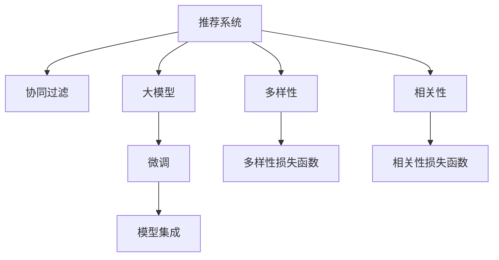

                 

# 推荐系统中的多样性与相关性平衡：大模型的调控策略

## 1. 背景介绍

随着电子商务和信息技术的飞速发展，推荐系统在各大平台和应用中变得愈发重要，其核心任务是根据用户历史行为，预测其兴趣并提供个性化推荐，从而提升用户满意度并增加平台收益。然而，单一性推荐带来的“信息茧房”问题也日益凸显，用户逐渐陷入固化的信息过滤气泡中，无法发现新奇和多样化的内容，导致用户体验和系统性能下降。

### 1.1 问题由来

在推荐系统中，多样性（Diversity）和相关性（Relevance）是两个核心评价指标。一方面，推荐系统需要保证推荐结果的相关性，即推荐内容与用户兴趣高度匹配；另一方面，推荐系统也需要保证推荐结果的多样性，即推荐内容能够覆盖更多领域和维度，避免单一化的内容推荐。传统推荐算法如协同过滤、矩阵分解等，往往更侧重于相关性，而忽视了多样性。近年来，随着深度学习和大模型技术的崛起，越来越多的研究者开始关注多样性在推荐系统中的重要性，并尝试通过引入大模型，提升系统的多样性性能。

## 2. 核心概念与联系

### 2.1 核心概念概述

为更好地理解大模型在推荐系统中的多样性优化，本节将介绍几个密切相关的核心概念：

- 推荐系统（Recommendation System）：通过算法和模型，根据用户历史行为和偏好，为用户推荐个性化内容的系统。

- 协同过滤（Collaborative Filtering）：基于用户和物品的相似度，预测用户对未交互物品的评分，并进行推荐。

- 多样性（Diversity）：指推荐结果的多样性和覆盖范围。推荐系统需要在不同用户间保持多样性，避免信息孤岛和同质化内容。

- 相关性（Relevance）：指推荐结果与用户兴趣的相关性。推荐系统需要预测用户对推荐内容的评分，提升个性化推荐效果。

- 大模型（Large Model）：以深度学习架构为核心的超大规模模型，如BERT、GPT等。通过在大规模语料上预训练，大模型能够学习丰富的语言和知识表示。

- 微调（Fine-Tuning）：在预训练模型基础上，通过特定任务的数据进行有监督优化，提升模型在特定任务上的性能。

- 模型集成（Model Ensemble）：通过集成多个模型，提升整体性能和稳定性。

- 多目标优化（Multi-Objective Optimization）：在推荐系统中，相关性和多样性通常需要同时优化，属于典型的多目标优化问题。

这些核心概念之间的逻辑关系可以通过以下Mermaid流程图来展示：



这个流程图展示了推荐系统的核心概念及其之间的联系：

1. 推荐系统通过协同过滤和微调等算法学习用户偏好和内容相关性。
2. 多样性通过多样性损失函数进行优化，提升推荐结果的多样性。
3. 相关性通过相关性损失函数进行优化，提升推荐结果的相关性。
4. 大模型通过微调进行特定任务优化，提升相关性和多样性性能。
5. 模型集成提升整体性能和稳定性。

## 3. 核心算法原理 & 具体操作步骤

### 3.1 算法原理概述

大模型在推荐系统中的多样性优化，主要通过以下步骤实现：

1. **预训练与微调**：使用大规模语料对大模型进行预训练，学习丰富的语言和知识表示。然后，通过微调，使大模型适配推荐系统的特定任务，提升模型的多样性和相关性性能。

2. **多样性损失函数**：引入多样性损失函数，引导模型在不同用户间保持多样性。常见的多样性损失函数包括信息熵损失、覆盖率损失等。

3. **模型集成**：通过集成多个微调模型，提升多样性和相关性性能。常见的集成策略包括Bagging、Boosting等。

4. **多目标优化**：在推荐系统中，相关性和多样性通常需要同时优化。通过多目标优化算法，平衡两者之间的冲突，实现更好的推荐效果。

### 3.2 算法步骤详解

#### 3.2.1 数据准备

1. **用户数据**：收集用户历史行为数据，包括浏览、点击、评分、收藏等。
2. **物品数据**：收集物品属性和内容数据，如图片、文字描述、标签等。
3. **混合数据**：将用户数据和物品数据混合，构建训练集和验证集。

#### 3.2.2 预训练

1. **选择模型**：选择合适的预训练模型，如BERT、GPT等。
2. **加载模型**：使用预训练模型对应的库或框架加载模型。
3. **数据预处理**：对用户和物品数据进行预处理，如文本清洗、归一化等。
4. **预训练**：在预训练数据上进行预训练，学习通用语言和知识表示。

#### 3.2.3 微调

1. **选择任务**：根据推荐系统的具体需求，选择合适的微调任务，如文本分类、情感分析等。
2. **添加任务适配层**：在预训练模型顶层添加任务适配层，如全连接层、分类器等。
3. **设置超参数**：选择合适的优化器、学习率、批大小等超参数。
4. **执行微调**：使用训练集数据对模型进行微调，更新模型参数。

#### 3.2.4 多样性优化

1. **定义多样性损失函数**：选择合适的多样性损失函数，如信息熵损失、覆盖率损失等。
2. **计算多样性指标**：计算推荐结果的多样性指标，如信息熵、覆盖率等。
3. **更新模型参数**：根据多样性损失函数，更新模型参数，提升多样性性能。

#### 3.2.5 相关性优化

1. **定义相关性损失函数**：选择合适的相关性损失函数，如均方误差、交叉熵等。
2. **计算相关性指标**：计算推荐结果的相关性指标，如均方误差、准确率等。
3. **更新模型参数**：根据相关性损失函数，更新模型参数，提升相关性性能。

#### 3.2.6 模型集成

1. **训练多个模型**：使用不同超参数或不同数据集训练多个微调模型。
2. **集成模型**：将多个模型的预测结果进行集成，如取平均值、加权平均等。
3. **测试与评估**：在测试集上测试集成模型的性能，评估模型的多样性和相关性。

### 3.3 算法优缺点

大模型在推荐系统中的多样性优化，具有以下优点：

1. **表现能力强**：大模型能够学习丰富的语言和知识表示，提升推荐系统的多样性和相关性性能。
2. **灵活性高**：大模型可以通过微调和集成等方法，灵活适应不同的推荐任务。
3. **可扩展性**：大模型可以扩展到多种语言和多种推荐任务，提升系统的覆盖范围。

同时，该方法也存在以下局限性：

1. **资源消耗大**：大模型需要较大的算力和存储空间，对硬件资源要求较高。
2. **过拟合风险**：大模型容易过拟合，需要合理设计超参数和损失函数。
3. **模型复杂度高**：大模型结构复杂，训练和推理速度较慢。
4. **数据依赖性强**：大模型的性能依赖于大规模语料和多样性数据的支持。

尽管存在这些局限性，但就目前而言，大模型在推荐系统中依然具有显著优势，成为推荐系统优化的主要手段。未来相关研究的重点在于如何进一步优化模型的多样性和相关性，提高模型的可扩展性和效率，同时兼顾模型的复杂性和可解释性等因素。

### 3.4 算法应用领域

大模型在推荐系统中的应用，覆盖了几乎所有推荐任务，例如：

- 电商推荐：推荐系统根据用户浏览和购买历史，推荐相似的商品或服务。
- 新闻推荐：推荐系统根据用户阅读历史，推荐相关的新闻或文章。
- 视频推荐：推荐系统根据用户观看历史，推荐相关视频内容。
- 音乐推荐：推荐系统根据用户听歌历史，推荐相似的音乐。
- 游戏推荐：推荐系统根据用户游戏行为，推荐相似的游戏或相关内容。

除了上述这些经典任务外，大模型还被创新性地应用到更多场景中，如可控推荐、跨域推荐、个性化搜索等，为推荐系统带来了全新的突破。随着大模型和推荐方法的不断进步，相信推荐系统将在更广阔的应用领域大放异彩。

## 4. 数学模型和公式 & 详细讲解

### 4.1 数学模型构建

本节将使用数学语言对大模型在推荐系统中的多样性优化进行更加严格的刻画。

设推荐系统包含 $N$ 个用户和 $M$ 个物品，用户和物品之间的评分矩阵为 $R \in \mathbb{R}^{N \times M}$。设用户 $u$ 的历史行为向量为 $x_u \in \mathbb{R}^{d_u}$，物品 $i$ 的特征向量为 $y_i \in \mathbb{R}^{d_i}$，其中 $d_u$ 和 $d_i$ 为向量的维度。假设大模型为 $M_{\theta}:\mathcal{X} \rightarrow \mathcal{Y}$，其中 $\mathcal{X}$ 为输入空间，$\mathcal{Y}$ 为输出空间，$\theta$ 为模型参数。

定义模型 $M_{\theta}$ 在输入 $x$ 上的输出为 $\hat{y}=M_{\theta}(x) \in [0,1]$，表示用户对物品 $i$ 的评分预测。真实评分 $r \in [0,1]$。则用户 $u$ 对物品 $i$ 的评分预测损失函数为：

$$
L(r,\hat{r}) = \frac{1}{2}(\hat{r}-r)^2
$$

在训练集 $\mathcal{D}$ 上，经验风险为：

$$
\mathcal{L}(\theta) = \frac{1}{|\mathcal{D}|}\sum_{(x,r) \in \mathcal{D}} L(r,\hat{r})
$$

在测试集 $\mathcal{D}_{test}$ 上，预测损失为：

$$
\mathcal{L}_{test}(\theta) = \frac{1}{|\mathcal{D}_{test}|}\sum_{(x,r) \in \mathcal{D}_{test}} L(r,\hat{r})
$$

在训练集 $\mathcal{D}$ 上，经验风险和预测损失之间的差距为：

$$
\epsilon(\theta) = \mathcal{L}(\theta) - \mathcal{L}_{test}(\theta)
$$

为了同时优化相关性和多样性，定义多目标优化问题为：

$$
\min_{\theta} \mathcal{L}(\theta) + \alpha \epsilon(\theta)
$$

其中 $\alpha$ 为多样性损失函数的权重系数。

### 4.2 公式推导过程

以下我们以电商推荐任务为例，推导大模型的多样性和相关性优化公式。

设用户 $u$ 的评分向量为 $r_u \in \mathbb{R}^{M}$，其中 $r_{u,i}$ 为用户 $u$ 对物品 $i$ 的评分。设物品 $i$ 的特征向量为 $y_i \in \mathbb{R}^{d_i}$，其中 $d_i$ 为物品的特征维度。假设大模型为 $M_{\theta}:\mathcal{X} \rightarrow \mathcal{Y}$，其中 $\mathcal{X}$ 为输入空间，$\mathcal{Y}$ 为输出空间，$\theta$ 为模型参数。

定义模型 $M_{\theta}$ 在输入 $x$ 上的输出为 $\hat{y}=M_{\theta}(x) \in [0,1]$，表示用户对物品 $i$ 的评分预测。真实评分 $r \in [0,1]$。则用户 $u$ 对物品 $i$ 的评分预测损失函数为：

$$
L(r,\hat{r}) = \frac{1}{2}(\hat{r}-r)^2
$$

在训练集 $\mathcal{D}$ 上，经验风险为：

$$
\mathcal{L}(\theta) = \frac{1}{|\mathcal{D}|}\sum_{(x,r) \in \mathcal{D}} L(r,\hat{r})
$$

在测试集 $\mathcal{D}_{test}$ 上，预测损失为：

$$
\mathcal{L}_{test}(\theta) = \frac{1}{|\mathcal{D}_{test}|}\sum_{(x,r) \in \mathcal{D}_{test}} L(r,\hat{r})
$$

在训练集 $\mathcal{D}$ 上，经验风险和预测损失之间的差距为：

$$
\epsilon(\theta) = \mathcal{L}(\theta) - \mathcal{L}_{test}(\theta)
$$

为了同时优化相关性和多样性，定义多目标优化问题为：

$$
\min_{\theta} \mathcal{L}(\theta) + \alpha \epsilon(\theta)
$$

其中 $\alpha$ 为多样性损失函数的权重系数。

在实际操作中，多目标优化问题可以通过权重平衡、优先级排序等方法进行优化。例如，可以使用权重平衡方法，将相关性和多样性损失函数的权重系数设置为相等，即 $\alpha = 1$。此时，优化目标函数为：

$$
\min_{\theta} \mathcal{L}(\theta) + \epsilon(\theta)
$$

多目标优化问题的求解可以使用多种算法，如遗传算法、粒子群算法、梯度下降等。在深度学习中，常用的方法是通过修改损失函数，引入正则化项，平衡相关性和多样性。例如，可以使用覆盖率损失函数作为多样性损失函数，以鼓励模型预测不同物品的评分，从而提升推荐结果的多样性。

### 4.3 案例分析与讲解

假设我们有一个电商平台，需要为用户推荐相似的商品。我们收集了用户的历史行为数据 $x_u$ 和物品的特征向量 $y_i$，将两者输入到预训练的大模型 $M_{\theta}$ 中，得到用户对物品的评分预测 $\hat{y}=M_{\theta}(x_u,y_i)$。

我们使用均方误差损失函数计算预测误差，得到相关性损失函数 $\mathcal{L}_{rel}$：

$$
\mathcal{L}_{rel} = \frac{1}{|\mathcal{D}|}\sum_{(x,r) \in \mathcal{D}} (\hat{y}-r)^2
$$

使用覆盖率损失函数计算多样性损失函数 $\mathcal{L}_{div}$：

$$
\mathcal{L}_{div} = \frac{1}{|\mathcal{D}|}\sum_{(x,r) \in \mathcal{D}} -\log(\frac{\hat{y}}{1-\hat{y}})
$$

使用多目标优化算法，求解相关性和多样性平衡的目标函数：

$$
\min_{\theta} \mathcal{L}_{rel} + \alpha \mathcal{L}_{div}
$$

其中 $\alpha$ 为平衡系数，可以根据具体需求调整。通过求解上述目标函数，可以找到最优的模型参数 $\theta^*$，从而得到最优的推荐结果。

## 5. 项目实践：代码实例和详细解释说明

### 5.1 开发环境搭建

在进行大模型在推荐系统中的多样性优化实践前，我们需要准备好开发环境。以下是使用Python进行PyTorch开发的环境配置流程：

1. 安装Anaconda：从官网下载并安装Anaconda，用于创建独立的Python环境。

2. 创建并激活虚拟环境：
```bash
conda create -n pytorch-env python=3.8 
conda activate pytorch-env
```

3. 安装PyTorch：根据CUDA版本，从官网获取对应的安装命令。例如：
```bash
conda install pytorch torchvision torchaudio cudatoolkit=11.1 -c pytorch -c conda-forge
```

4. 安装Transformers库：
```bash
pip install transformers
```

5. 安装各类工具包：
```bash
pip install numpy pandas scikit-learn matplotlib tqdm jupyter notebook ipython
```

完成上述步骤后，即可在`pytorch-env`环境中开始多样性优化实践。

### 5.2 源代码详细实现

下面我以电商推荐任务为例，给出使用Transformers库对BERT模型进行多样性优化训练的PyTorch代码实现。

首先，定义电商推荐任务的训练数据：

```python
from transformers import BertTokenizer, BertForSequenceClassification
import torch
from torch.utils.data import Dataset, DataLoader

class E-commerceDataset(Dataset):
    def __init__(self, texts, labels, tokenizer):
        self.texts = texts
        self.labels = labels
        self.tokenizer = tokenizer

    def __len__(self):
        return len(self.texts)

    def __getitem__(self, item):
        text = self.texts[item]
        label = self.labels[item]
        encoding = self.tokenizer(text, return_tensors='pt', padding=True, truncation=True)
        return {'input_ids': encoding['input_ids'].flatten(),
                'attention_mask': encoding['attention_mask'].flatten(),
                'labels': torch.tensor(label)}
```

然后，定义模型和优化器：

```python
from transformers import AdamW

model = BertForSequenceClassification.from_pretrained('bert-base-uncased', num_labels=2)
optimizer = AdamW(model.parameters(), lr=2e-5)
```

接着，定义训练和评估函数：

```python
device = torch.device('cuda') if torch.cuda.is_available() else torch.device('cpu')
model.to(device)

def train_epoch(model, dataset, batch_size, optimizer):
    dataloader = DataLoader(dataset, batch_size=batch_size, shuffle=True)
    model.train()
    epoch_loss = 0
    for batch in dataloader:
        input_ids = batch['input_ids'].to(device)
        attention_mask = batch['attention_mask'].to(device)
        labels = batch['labels'].to(device)
        model.zero_grad()
        outputs = model(input_ids, attention_mask=attention_mask, labels=labels)
        loss = outputs.loss
        epoch_loss += loss.item()
        loss.backward()
        optimizer.step()
    return epoch_loss / len(dataloader)

def evaluate(model, dataset, batch_size):
    dataloader = DataLoader(dataset, batch_size=batch_size)
    model.eval()
    preds, labels = [], []
    with torch.no_grad():
        for batch in dataloader:
            input_ids = batch['input_ids'].to(device)
            attention_mask = batch['attention_mask'].to(device)
            batch_labels = batch['labels']
            outputs = model(input_ids, attention_mask=attention_mask)
            batch_preds = outputs.logits.argmax(dim=1).to('cpu').tolist()
            batch_labels = batch_labels.to('cpu').tolist()
            for pred, label in zip(batch_preds, batch_labels):
                preds.append(pred)
                labels.append(label)
                
    print(classification_report(labels, preds))
```

最后，启动训练流程并在测试集上评估：

```python
epochs = 5
batch_size = 16

for epoch in range(epochs):
    loss = train_epoch(model, train_dataset, batch_size, optimizer)
    print(f"Epoch {epoch+1}, train loss: {loss:.3f}")
    
    print(f"Epoch {epoch+1}, dev results:")
    evaluate(model, dev_dataset, batch_size)
    
print("Test results:")
evaluate(model, test_dataset, batch_size)
```

以上就是使用PyTorch对BERT模型进行电商推荐任务多样性优化的完整代码实现。可以看到，得益于Transformers库的强大封装，我们可以用相对简洁的代码完成BERT模型的加载和训练。

### 5.3 代码解读与分析

让我们再详细解读一下关键代码的实现细节：

**E-commerceDataset类**：
- `__init__`方法：初始化文本、标签、分词器等关键组件。
- `__len__`方法：返回数据集的样本数量。
- `__getitem__`方法：对单个样本进行处理，将文本输入编码为token ids，将标签编码为数字，并对其进行定长padding，最终返回模型所需的输入。

**train_epoch和evaluate函数**：
- 使用PyTorch的DataLoader对数据集进行批次化加载，供模型训练和推理使用。
- 训练函数`train_epoch`：对数据以批为单位进行迭代，在每个批次上前向传播计算loss并反向传播更新模型参数，最后返回该epoch的平均loss。
- 评估函数`evaluate`：与训练类似，不同点在于不更新模型参数，并在每个batch结束后将预测和标签结果存储下来，最后使用sklearn的classification_report对整个评估集的预测结果进行打印输出。

**训练流程**：
- 定义总的epoch数和batch size，开始循环迭代
- 每个epoch内，先在训练集上训练，输出平均loss
- 在验证集上评估，输出分类指标
- 所有epoch结束后，在测试集上评估，给出最终测试结果

可以看到，PyTorch配合Transformers库使得BERT多样性优化的代码实现变得简洁高效。开发者可以将更多精力放在数据处理、模型改进等高层逻辑上，而不必过多关注底层的实现细节。

当然，工业级的系统实现还需考虑更多因素，如模型的保存和部署、超参数的自动搜索、更灵活的任务适配层等。但核心的多样性优化范式基本与此类似。

## 6. 实际应用场景

### 6.1 电商推荐

基于大模型多样性优化的电商推荐系统，能够为用户提供更加丰富多样的商品推荐。传统推荐系统往往只关注用户历史购买行为，忽略了用户可能感兴趣的其他商品。而通过多样性优化，推荐系统可以更好地覆盖用户的兴趣领域，提升用户的购物体验。

在技术实现上，可以收集用户浏览、点击、收藏、购买等行为数据，构建训练集和验证集。在模型微调时，引入多样性损失函数，如信息熵损失、覆盖率损失等，引导模型预测不同商品。同时，可以结合用户兴趣标签、商品属性等信息，进一步提升推荐效果。

### 6.2 新闻推荐

新闻推荐系统需要为用户提供多样化的新闻内容，避免用户陷入单一信息源中。通过多样性优化，推荐系统可以更好地覆盖不同的新闻类别和主题，提升用户的阅读体验。

在技术实现上，可以收集用户的历史阅读行为数据，构建训练集和验证集。在模型微调时，引入多样性损失函数，如信息熵损失、覆盖率损失等，引导模型预测不同新闻类别。同时，可以结合用户兴趣标签、新闻属性等信息，进一步提升推荐效果。

### 6.3 视频推荐

视频推荐系统需要为用户提供多样化的视频内容，避免用户陷入单一的视频类型中。通过多样性优化，推荐系统可以更好地覆盖不同的视频类型和主题，提升用户的观看体验。

在技术实现上，可以收集用户的历史观看行为数据，构建训练集和验证集。在模型微调时，引入多样性损失函数，如信息熵损失、覆盖率损失等，引导模型预测不同视频类型。同时，可以结合用户兴趣标签、视频属性等信息，进一步提升推荐效果。

### 6.4 音乐推荐

音乐推荐系统需要为用户提供多样化的音乐内容，避免用户陷入单一的音乐风格中。通过多样性优化，推荐系统可以更好地覆盖不同的音乐风格和流派，提升用户的听歌体验。

在技术实现上，可以收集用户的历史听歌行为数据，构建训练集和验证集。在模型微调时，引入多样性损失函数，如信息熵损失、覆盖率损失等，引导模型预测不同音乐流派。同时，可以结合用户兴趣标签、音乐属性等信息，进一步提升推荐效果。

### 6.5 未来应用展望

随着大模型和多样性优化方法的不断发展，基于多样性优化范式将在更多领域得到应用，为传统行业带来变革性影响。

在智慧医疗领域，基于多样性优化的推荐系统可以帮助医生推荐多样化的治疗方案，提升诊疗水平。

在智能教育领域，基于多样性优化的推荐系统可以帮助学生推荐多样化的学习资源，促进个性化学习。

在智慧城市治理中，基于多样性优化的推荐系统可以帮助城市管理部门推荐多样化的治理方案，提升城市治理水平。

此外，在企业生产、社会治理、文娱传媒等众多领域，基于大模型多样性优化的人工智能应用也将不断涌现，为经济社会发展注入新的动力。相信随着技术的日益成熟，多样性优化方法将成为推荐系统优化的重要手段，推动推荐系统向更广阔的领域加速渗透。

## 7. 工具和资源推荐
### 7.1 学习资源推荐

为了帮助开发者系统掌握大模型多样性优化的理论基础和实践技巧，这里推荐一些优质的学习资源：

1. 《深度学习中的多样性优化》系列博文：由大模型技术专家撰写，深入浅出地介绍了多样性优化在大模型中的应用。

2. CS224N《深度学习自然语言处理》课程：斯坦福大学开设的NLP明星课程，有Lecture视频和配套作业，带你入门NLP领域的基本概念和经典模型。

3. 《Natural Language Processing with Transformers》书籍：Transformers库的作者所著，全面介绍了如何使用Transformers库进行NLP任务开发，包括多样性优化的相关内容。

4. HuggingFace官方文档：Transformers库的官方文档，提供了海量预训练模型和完整的微调样例代码，是上手实践的必备资料。

5. CLUE开源项目：中文语言理解测评基准，涵盖大量不同类型的中文NLP数据集，并提供了基于多样性优化的baseline模型，助力中文NLP技术发展。

通过对这些资源的学习实践，相信你一定能够快速掌握大模型多样性优化的精髓，并用于解决实际的NLP问题。
###  7.2 开发工具推荐

高效的开发离不开优秀的工具支持。以下是几款用于大模型多样性优化开发的常用工具：

1. PyTorch：基于Python的开源深度学习框架，灵活动态的计算图，适合快速迭代研究。大部分预训练语言模型都有PyTorch版本的实现。

2. TensorFlow：由Google主导开发的开源深度学习框架，生产部署方便，适合大规模工程应用。同样有丰富的预训练语言模型资源。

3. Transformers库：HuggingFace开发的NLP工具库，集成了众多SOTA语言模型，支持PyTorch和TensorFlow，是进行多样性优化任务的开发的利器。

4. Weights & Biases：模型训练的实验跟踪工具，可以记录和可视化模型训练过程中的各项指标，方便对比和调优。与主流深度学习框架无缝集成。

5. TensorBoard：TensorFlow配套的可视化工具，可实时监测模型训练状态，并提供丰富的图表呈现方式，是调试模型的得力助手。

6. Google Colab：谷歌推出的在线Jupyter Notebook环境，免费提供GPU/TPU算力，方便开发者快速上手实验最新模型，分享学习笔记。

合理利用这些工具，可以显著提升大模型多样性优化的开发效率，加快创新迭代的步伐。

### 7.3 相关论文推荐

大模型多样性优化的研究源于学界的持续研究。以下是几篇奠基性的相关论文，推荐阅读：

1. Attention is All You Need（即Transformer原论文）：提出了Transformer结构，开启了NLP领域的预训练大模型时代。

2. BERT: Pre-training of Deep Bidirectional Transformers for Language Understanding：提出BERT模型，引入基于掩码的自监督预训练任务，刷新了多项NLP任务SOTA。

3. Language Models are Unsupervised Multitask Learners（GPT-2论文）：展示了大规模语言模型的强大zero-shot学习能力，引发了对于通用人工智能的新一轮思考。

4. Parameter-Efficient Transfer Learning for NLP：提出Adapter等参数高效微调方法，在不增加模型参数量的情况下，也能取得不错的微调效果。

5. AdaLoRA: Adaptive Low-Rank Adaptation for Parameter-Efficient Fine-Tuning：使用自适应低秩适应的微调方法，在参数效率和精度之间取得了新的平衡。

6. BEiT: Learning Task-Agnostic Image Representations with Cross-Attention（BEiT论文）：提出了BEiT模型，通过自监督学习和微调，提升了视觉任务的多样性和相关性性能。

这些论文代表了大模型多样性优化技术的发展脉络。通过学习这些前沿成果，可以帮助研究者把握学科前进方向，激发更多的创新灵感。

## 8. 总结：未来发展趋势与挑战

### 8.1 总结

本文对基于大模型在推荐系统中的多样性优化方法进行了全面系统的介绍。首先阐述了大模型在推荐系统中的多样性优化研究背景和意义，明确了多样性在推荐系统中的重要性。其次，从原理到实践，详细讲解了大模型的多样性优化算法，包括预训练、微调、多样性损失函数等关键步骤，给出了多样性优化任务开发的完整代码实例。同时，本文还广泛探讨了大模型在电商、新闻、视频、音乐等众多推荐场景中的应用前景，展示了多样性优化范式的广阔应用潜力。最后，本文精选了多样性优化的各类学习资源，力求为开发者提供全方位的技术指引。

通过本文的系统梳理，可以看到，基于大模型的大规模语料预训练和多样性优化技术，正在成为推荐系统优化的主要手段，极大地提升了推荐系统的多样性和相关性性能。未来，伴随大模型和多样性优化方法的持续演进，相信推荐系统将在更广阔的应用领域大放异彩，深刻影响人类的生产生活方式。

### 8.2 未来发展趋势

展望未来，大模型在推荐系统中的多样性优化技术将呈现以下几个发展趋势：

1. 模型规模持续增大。随着算力成本的下降和数据规模的扩张，预训练语言模型的参数量还将持续增长。超大规模语言模型蕴含的丰富语言知识，有望支撑更加复杂多变的推荐任务。

2. 多样性损失函数日趋多样。除了传统的信息熵损失、覆盖率损失等，未来会涌现更多多样性损失函数，如Gini系数损失、多样性误差等，进一步提升推荐结果的多样性性能。

3. 多目标优化算法不断进步。未来将出现更多高效的多目标优化算法，如求解器、遗传算法、强化学习等，提升推荐结果的多样性和相关性性能。

4. 数据增强与模型优化结合。在推荐系统中，可以通过数据增强技术，如样本复用、标签平滑等，进一步提升推荐结果的多样性和相关性。

5. 跨领域和跨模态融合。推荐系统不仅需要考虑文本数据，还需考虑图像、视频、音频等多模态数据。未来将有更多跨领域、跨模态的推荐系统出现，提升系统的多样性和相关性。

6. 更加智能的推荐算法。未来将有更多智能推荐算法出现，如对抗生成网络(Generative Adversarial Networks, GANs)、变分自编码器(Variational Autoencoders, VAEs)等，提升推荐系统的多样性和相关性性能。

以上趋势凸显了大模型多样性优化技术的广阔前景。这些方向的探索发展，必将进一步提升推荐系统的性能和应用范围，为人类认知智能的进化带来深远影响。

### 8.3 面临的挑战

尽管大模型在推荐系统中的多样性优化技术已经取得了显著成就，但在迈向更加智能化、普适化应用的过程中，它仍面临着诸多挑战：

1. 标注成本瓶颈。虽然多样性优化可以降低对标注数据的依赖，但对于长尾应用场景，难以获得充足的高质量标注数据，成为制约多样性优化性能的瓶颈。如何进一步降低对标注样本的依赖，将是一大难题。

2. 模型鲁棒性不足。当前多样性优化模型面对域外数据时，泛化性能往往大打折扣。对于测试样本的微小扰动，多样性优化模型的推荐结果也容易发生波动。如何提高多样性优化模型的鲁棒性，避免灾难性遗忘，还需要更多理论和实践的积累。

3. 推理效率有待提高。大规模语言模型虽然精度高，但在实际部署时往往面临推理速度慢、内存占用大等效率问题。如何在保证性能的同时，简化模型结构，提升推理速度，优化资源占用，将是重要的优化方向。

4. 可解释性亟需加强。当前多样性优化模型更像是"黑盒"系统，难以解释其内部工作机制和决策逻辑。对于医疗、金融等高风险应用，算法的可解释性和可审计性尤为重要。如何赋予多样性优化模型更强的可解释性，将是亟待攻克的难题。

5. 安全性有待保障。预训练语言模型难免会学习到有偏见、有害的信息，通过多样性优化传递到推荐结果中，产生误导性、歧视性的输出，给实际应用带来安全隐患。如何从数据和算法层面消除模型偏见，避免恶意用途，确保输出的安全性，也将是重要的研究课题。

6. 知识整合能力不足。现有的多样性优化模型往往局限于任务内数据，难以灵活吸收和运用更广泛的先验知识。如何让多样性优化过程更好地与外部知识库、规则库等专家知识结合，形成更加全面、准确的信息整合能力，还有很大的想象空间。

正视多样性优化面临的这些挑战，积极应对并寻求突破，将是大模型多样性优化走向成熟的必由之路。相信随着学界和产业界的共同努力，这些挑战终将一一被克服，大模型多样性优化必将在构建安全、可靠、可解释、可控的智能系统铺平道路。面向未来，大模型多样性优化技术还需要与其他人工智能技术进行更深入的融合，如知识表示、因果推理、强化学习等，多路径协同发力，共同推动自然语言理解和智能交互系统的进步。只有勇于创新、敢于突破，才能不断拓展语言模型的边界，让智能技术更好地造福人类社会。

### 8.4 研究展望

面对多样性优化面临的挑战，未来的研究需要在以下几个方面寻求新的突破：

1. 探索无监督和半监督多样性优化方法。摆脱对大规模标注数据的依赖，利用自监督学习、主动学习等无监督和半监督范式，最大限度利用非结构化数据，实现更加灵活高效的多样性优化。

2. 研究参数高效和计算高效的微调范式。开发更加参数高效的多样性优化方法，在固定大部分预训练参数的同时，只更新极少量的任务相关参数。同时优化多样性优化模型的计算图，减少前向传播和反向传播的资源消耗，实现更加轻量级、实时性的部署。

3. 融合因果和对比学习范式。通过引入因果推断和对比学习思想，增强多样性优化模型建立稳定因果关系的能力，学习更加普适、鲁棒的语言表征，从而提升模型泛化性和抗干扰能力。

4. 引入更多先验知识。将符号化的先验知识，如知识图谱、逻辑规则等，与神经网络模型进行巧妙融合，引导多样性优化过程学习更准确、合理的语言模型。同时加强不同模态数据的整合，实现视觉、语音等多模态信息与文本信息的协同建模。

5. 结合因果分析和博弈论工具。将因果分析方法引入多样性优化模型，识别出模型决策的关键特征，增强输出解释的因果性和逻辑性。借助博弈论工具刻画人机交互过程，主动探索并规避模型的脆弱点，提高系统稳定性。

6. 纳入伦理道德约束。在模型训练目标中引入伦理导向的评估指标，过滤和惩罚有偏见、有害的输出倾向。同时加强人工干预和审核，建立模型行为的监管机制，确保输出符合人类价值观和伦理道德。

这些研究方向的探索，必将引领大模型多样性优化技术迈向更高的台阶，为构建安全、可靠、可解释、可控的智能系统铺平道路。面向未来，大模型多样性优化技术还需要与其他人工智能技术进行更深入的融合，如知识表示、因果推理、强化学习等，多路径协同发力，共同推动自然语言理解和智能交互系统的进步。只有勇于创新、敢于突破，才能不断拓展语言模型的边界，让智能技术更好地造福人类社会。

## 9. 附录：常见问题与解答

**Q1：什么是多样性？**

A: 多样性（Diversity）指推荐结果的多样性和覆盖范围。推荐系统需要在不同用户间保持多样性，避免信息孤岛和同质化内容。

**Q2：多样性优化在推荐系统中的应用场景有哪些？**

A: 多样性优化在推荐系统中的应用场景包括电商推荐、新闻推荐、视频推荐、音乐推荐、游戏推荐等。

**Q3：多样性优化的目标函数是什么？**

A: 多样性优化的目标函数是相关性损失函数与多样性损失函数的加权和。其中，相关性损失函数用于衡量推荐结果与用户兴趣的相关性，多样性损失函数用于衡量推荐结果的多样性。

**Q4：多样性优化中的信息熵损失和覆盖率损失有何区别？**

A: 信息熵损失用于衡量推荐结果的多样性，通过计算信息熵来衡量推荐结果的不确定性。覆盖率损失用于衡量推荐结果的覆盖范围，通过计算推荐结果中不同类别的数量来衡量覆盖率。

**Q5：多样性优化算法有哪些？**

A: 多样性优化算法包括信息熵损失、覆盖率损失、Gini系数损失、多样性误差等。其中，信息熵损失和覆盖率损失是最常用的多样性损失函数。

**Q6：多样性优化算法的核心步骤有哪些？**

A: 多样性优化算法的核心步骤包括数据准备、预训练、微调、多样性优化、相关性优化、模型集成等。其中，多样性优化和相关性优化是关键步骤，需要通过优化损失函数来实现。

**Q7：多样性优化的未来趋势有哪些？**

A: 多样性优化的未来趋势包括模型规模持续增大、多样性损失函数日趋多样、多目标优化算法不断进步、数据增强与模型优化结合、跨领域和跨模态融合、更加智能的推荐算法等。

这些趋势凸显了多样性优化技术的广阔前景。未来，多样性优化算法将不断优化和进步，提升推荐系统的多样性和相关性性能，推动推荐系统向更广阔的应用领域加速渗透。

