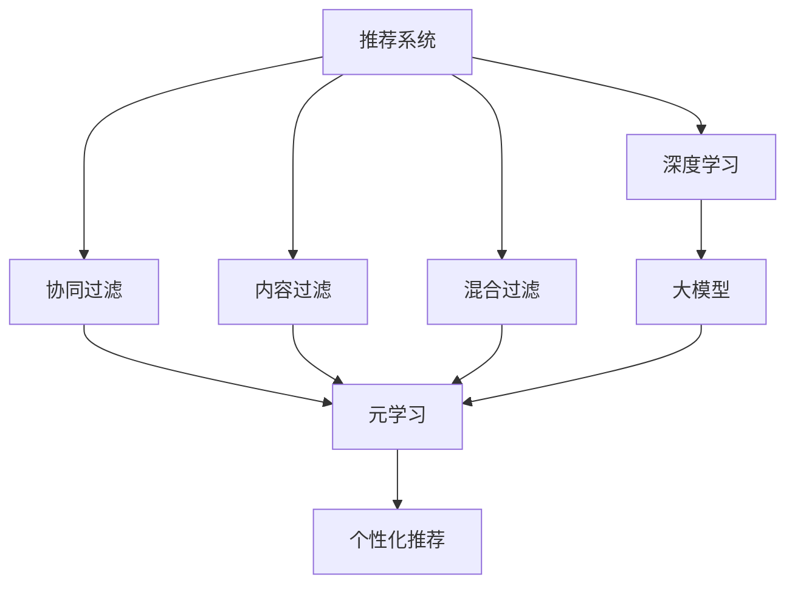

                 

# 推荐系统中的大模型元学习个性化应用

> 关键词：推荐系统,大模型,元学习,个性化,深度学习,超参数优化,协同过滤,神经网络

## 1. 背景介绍

### 1.1 问题由来

推荐系统（Recommender System）作为互联网时代最重要的应用之一，已经渗透到电商、社交、娱乐、新闻等领域，极大地改变了人们的生活习惯。然而，随着数据量、用户行为模式、产品种类的快速变化，传统的推荐算法越来越难以适应新的挑战，尤其是当数据稀疏、用户长尾、需求多变时，个性化推荐显得尤为困难。

近年来，大模型在自然语言处理（NLP）、计算机视觉（CV）等领域取得了巨大成功，尤其是预训练大模型如BERT、GPT-3等，在通用语言表示上取得了突破性进展。这些模型通常以数十亿乃至数百亿级的参数规模，在大量无标签数据上进行预训练，学习到了丰富的语言和视觉知识。如何将这些预训练知识有效地应用于推荐系统，实现更高效、个性化的推荐，成为当下学术界和工业界共同关注的重要方向。

### 1.2 问题核心关键点

元学习（Meta-Learning）作为一种新兴的机器学习方法，能够在短时间内适应新任务，提升模型的泛化能力和适应性。将元学习应用于推荐系统，特别是利用大模型进行元学习，可以大大提高推荐系统的个性化水平和鲁棒性。

具体而言，通过元学习，推荐系统可以从以往推荐的经验中提取通用知识，并根据当前推荐任务的需求，快速调整模型结构和参数，从而适应不同的用户和环境。相较于从头训练，元学习不仅能节省计算资源，还能大幅提升推荐效果。

## 2. 核心概念与联系

### 2.1 核心概念概述

为更好地理解大模型元学习在推荐系统中的应用，本节将介绍几个关键概念及其相互联系：

- **推荐系统（Recommender System）**：通过算法和模型，根据用户历史行为和偏好，推荐相关产品或服务。常见的推荐方法包括协同过滤、内容过滤、混合过滤等。

- **大模型（Large Model）**：以BERT、GPT-3等预训练模型为代表的大规模深度学习模型，通常以数十亿级的参数规模，在大量无标签数据上进行预训练，学习到丰富的通用知识。

- **元学习（Meta-Learning）**：通过学习以往的推荐经验，快速适应新任务，提高模型的泛化能力和适应性。元学习可以优化超参数、调整模型架构、提取任务共性等。

- **个性化推荐（Personalized Recommendation）**：根据每个用户的独特需求和偏好，推荐最适合的产品或服务。个性化推荐通常基于用户历史行为、社交网络、兴趣模型等。

- **深度学习（Deep Learning）**：一种基于神经网络的机器学习方法，能够处理大规模非线性数据，适用于推荐系统中复杂的推荐逻辑和丰富的数据特征。

- **协同过滤（Collaborative Filtering）**：利用用户和物品之间的共性关系进行推荐，是推荐系统中常用的方法之一。

- **内容过滤（Content-Based Filtering）**：基于物品的特征和用户的历史行为进行推荐，适用于个性化程度较高的推荐场景。

- **混合过滤（Hybrid Filtering）**：结合协同过滤和内容过滤的优势，提高推荐系统的综合效果。

这些概念之间的逻辑关系可以通过以下Mermaid流程图来展示：



这个流程图展示了推荐系统的主要组件和元学习的连接方式：

1. 推荐系统由协同过滤、内容过滤、混合过滤等组成。
2. 深度学习和大模型技术为推荐系统提供了强大的数据处理能力。
3. 元学习通过优化超参数、调整模型架构、提取共性等方式，进一步提升推荐系统的效果。
4. 个性化推荐是元学习的目标，通过快速适应新任务，实现高度个性化的推荐。

## 3. 核心算法原理 & 具体操作步骤
### 3.1 算法原理概述

大模型元学习在推荐系统中的应用，主要通过以下三个步骤实现：

1. **预训练知识提取**：利用大模型在无标签数据上进行预训练，提取通用的推荐知识。
2. **元学习任务适配**：根据目标推荐任务的需求，通过元学习调整模型结构和参数。
3. **个性化推荐生成**：结合预训练知识和元学习结果，生成针对当前用户的个性化推荐。

具体而言，元学习可以通过以下方法实现：

- **超参数优化**：通过优化学习率和衰减率等超参数，快速调整模型适应新任务。
- **模型架构适配**：通过修改网络结构、层数、宽度等，优化模型性能。
- **特征提取和融合**：利用大模型的预训练知识，提取和融合特征，提高推荐效果。
- **知识迁移**：通过迁移学习将大模型的知识迁移到推荐系统中，提高推荐精度。

### 3.2 算法步骤详解

以下是元学习在推荐系统中的具体操作步骤：

**Step 1: 准备数据集**
- 收集目标推荐任务的标注数据集 $D=\{(x_i, y_i)\}_{i=1}^N$，其中 $x_i$ 为用户历史行为和兴趣特征，$y_i$ 为推荐目标（如商品ID、评分等）。
- 收集用户标签数据集 $L=\{(l_i, y_i)\}_{i=1}^M$，其中 $l_i$ 为用户历史行为标签，$y_i$ 为用户行为的真实结果。

**Step 2: 选择预训练模型**
- 选择适合的目标预训练大模型，如BERT、GPT-3等。
- 加载预训练模型，提取通用知识表示。

**Step 3: 设置元学习超参数**
- 定义元学习算法及其参数，如Adam、SGD等，设置学习率、衰减率、迭代轮数等。
- 确定冻结预训练参数的策略，如仅微调顶层，或全部参数都参与微调。

**Step 4: 执行元学习**
- 将标注数据集 $D$ 和用户标签数据集 $L$ 分成训练集和验证集，分别用于模型训练和验证。
- 在每个元学习步骤中，将当前数据集作为输入，计算损失函数，更新模型参数。
- 使用验证集评估模型性能，根据性能指标决定是否继续迭代。

**Step 5: 生成推荐结果**
- 结合预训练知识表示和元学习结果，生成针对当前用户的个性化推荐。
- 在测试集上评估推荐系统的准确性和召回率，优化推荐效果。

### 3.3 算法优缺点

大模型元学习在推荐系统中的应用，具有以下优点：

- **高效性**：元学习能够快速适应新任务，节省大量训练时间，提高推荐系统的响应速度。
- **泛化能力**：大模型的预训练知识具有较强的泛化能力，能够适应不同用户和环境的变化。
- **个性化推荐**：通过元学习，推荐系统能够根据每个用户的独特需求，生成高度个性化的推荐结果。
- **鲁棒性**：利用大模型的知识迁移能力，推荐系统能够更好地应对数据稀疏和长尾问题。

同时，该方法也存在一定的局限性：

- **资源需求高**：大模型的预训练和元学习需要大量计算资源，可能导致硬件成本高。
- **复杂度高**：元学习过程较复杂，需要精心调参，调试难度大。
- **可解释性不足**：元学习模型难以解释内部决策过程，用户对推荐结果的理解可能不足。

尽管存在这些局限性，但大模型元学习仍然是目前推荐系统中最为先进的个性化推荐方法之一。未来相关研究的重点在于如何进一步降低元学习的资源需求，提高模型的可解释性和鲁棒性。

### 3.4 算法应用领域

大模型元学习技术，已经在推荐系统、广告投放、个性化新闻推荐等多个领域得到了应用。具体而言：

- **电商推荐**：利用用户浏览历史、购物记录等数据，生成个性化商品推荐。
- **社交网络**：根据用户好友关系、互动内容等数据，推荐相关内容和活动。
- **视频推荐**：结合用户观看历史和评分，推荐感兴趣的视频内容。
- **新闻推荐**：根据用户阅读历史和兴趣，推荐相关新闻文章。
- **广告投放**：根据用户行为数据，推荐最适合的广告内容。

除了上述这些典型应用，大模型元学习还在游戏推荐、金融服务、智能交通等领域得到了广泛应用，展示了其强大的通用性和适应性。

## 4. 数学模型和公式 & 详细讲解
### 4.1 数学模型构建

在推荐系统中，大模型元学习的目标是通过优化超参数和调整模型架构，提升模型的推荐精度和泛化能力。以一个简单的推荐系统为例，设用户历史行为和兴趣特征为 $x \in \mathbb{R}^d$，推荐目标为 $y \in \mathbb{R}$。假设大模型为 $M_{\theta}$，其中 $\theta$ 为预训练得到的模型参数。

定义模型的推荐损失函数为：

$$
\mathcal{L}(\theta) = \frac{1}{N} \sum_{i=1}^N (y_i - M_{\theta}(x_i))^2
$$

其中 $N$ 为训练样本数，$y_i$ 为实际推荐目标，$M_{\theta}(x_i)$ 为模型预测结果。

通过优化损失函数，调整模型参数 $\theta$，使模型输出逼近真实标签。

### 4.2 公式推导过程

以下我们以一个基于大模型的协同过滤模型为例，推导其优化目标函数及梯度计算公式。

假设用户 $u$ 的历史行为数据为 $x \in \mathbb{R}^d$，物品 $i$ 的特征为 $f_i \in \mathbb{R}^d$，用户对物品 $i$ 的评分 $y_i \in \mathbb{R}$。协同过滤模型 $M_{\theta}$ 的预测结果为 $M_{\theta}(x, f_i) \in \mathbb{R}$，其中 $\theta$ 为模型参数。

定义模型的推荐损失函数为：

$$
\mathcal{L}(\theta) = \frac{1}{N} \sum_{i=1}^N (y_i - M_{\theta}(x, f_i))^2
$$

为了简化计算，假设物品特征 $f_i$ 是固定的，只关注用户 $u$ 的预测模型 $M_{\theta}$。根据链式法则，损失函数对模型参数 $\theta$ 的梯度为：

$$
\frac{\partial \mathcal{L}(\theta)}{\partial \theta} = -\frac{2}{N} \sum_{i=1}^N (y_i - M_{\theta}(x, f_i)) \frac{\partial M_{\theta}(x, f_i)}{\partial \theta}
$$

其中 $\frac{\partial M_{\theta}(x, f_i)}{\partial \theta}$ 可以通过自动微分技术高效计算。

在得到损失函数的梯度后，即可带入优化算法（如Adam、SGD等），更新模型参数 $\theta$。重复上述过程直至收敛，最终得到适应当前任务的模型参数 $\theta^*$。

### 4.3 案例分析与讲解

以一个基于大模型的电商推荐系统为例，假设用户 $u$ 的历史行为数据为 $x \in \mathbb{R}^d$，电商平台上每个商品 $i$ 的特征为 $f_i \in \mathbb{R}^d$，用户对商品 $i$ 的评分 $y_i \in \{1, 2, 3, 4, 5\}$。模型 $M_{\theta}$ 通过大模型预训练获得，其中 $\theta$ 为模型参数。

1. **数据准备**
   - 收集用户历史行为数据 $x$ 和商品特征 $f_i$。
   - 准备用户评分数据 $y_i$。

2. **模型选择**
   - 选择合适的预训练大模型，如BERT、GPT-3等。
   - 加载预训练模型，提取通用知识表示。

3. **元学习超参数设置**
   - 定义元学习算法及其参数，如Adam、SGD等，设置学习率、衰减率、迭代轮数等。
   - 确定冻结预训练参数的策略，如仅微调顶层，或全部参数都参与微调。

4. **元学习执行**
   - 将用户评分数据 $y_i$ 和商品特征 $f_i$ 分成训练集和验证集，分别用于模型训练和验证。
   - 在每个元学习步骤中，将当前数据集作为输入，计算损失函数，更新模型参数。
   - 使用验证集评估模型性能，根据性能指标决定是否继续迭代。

5. **推荐生成**
   - 结合预训练知识表示和元学习结果，生成针对当前用户 $u$ 的个性化推荐。
   - 在测试集上评估推荐系统的准确性和召回率，优化推荐效果。

## 5. 项目实践：代码实例和详细解释说明
### 5.1 开发环境搭建

在进行元学习实践前，我们需要准备好开发环境。以下是使用Python进行PyTorch开发的环境配置流程：

1. 安装Anaconda：从官网下载并安装Anaconda，用于创建独立的Python环境。

2. 创建并激活虚拟环境：
```bash
conda create -n pytorch-env python=3.8 
conda activate pytorch-env
```

3. 安装PyTorch：根据CUDA版本，从官网获取对应的安装命令。例如：
```bash
conda install pytorch torchvision torchaudio cudatoolkit=11.1 -c pytorch -c conda-forge
```

4. 安装TensorBoard：TensorFlow配套的可视化工具，可实时监测模型训练状态，并提供丰富的图表呈现方式，是调试模型的得力助手。
```bash
pip install tensorboard
```

5. 安装PyTorch Lightning：用于高效管理模型训练，包括日志记录、超参数搜索等。
```bash
pip install pytorch-lightning
```

完成上述步骤后，即可在`pytorch-env`环境中开始元学习实践。

### 5.2 源代码详细实现

这里我们以基于大模型的电商推荐系统为例，给出使用PyTorch Lightning实现元学习的代码实现。

首先，定义数据处理函数：

```python
from torch.utils.data import Dataset, DataLoader
import torch

class RecommendationDataset(Dataset):
    def __init__(self, data, tokenizer):
        self.data = data
        self.tokenizer = tokenizer
        
    def __len__(self):
        return len(self.data)
    
    def __getitem__(self, idx):
        item = self.data[idx]
        user = item['user']
        items = item['items']
        
        user_input = self.tokenizer(user, return_tensors='pt')
        item_input = [self.tokenizer(item, return_tensors='pt') for item in items]
        
        return {'user_input': user_input, 
                'item_input': item_input}
```

然后，定义模型和优化器：

```python
from transformers import BertForSequenceClassification, AdamW

model = BertForSequenceClassification.from_pretrained('bert-base-cased', num_labels=5)

optimizer = AdamW(model.parameters(), lr=1e-5)
```

接着，定义训练和评估函数：

```python
from pytorch_lightning import Trainer, EarlyStoppingCallback
from sklearn.metrics import mean_squared_error

class RecommendationModel(nn.Module):
    def __init__(self):
        super(RecommendationModel, self).__init__()
        self.model = BertForSequenceClassification.from_pretrained('bert-base-cased', num_labels=5)
        
    def forward(self, user_input, item_input):
        user_input = self.model(user_input)
        item_input = torch.cat([item_input[i]['sequence'] for i in range(len(item_input))], dim=0)
        item_input = self.model(item_input)
        
        return user_input + item_input
    
    def configure_optimizers(self):
        return optimizer
    
class EarlyStopCallback(EarlyStoppingCallback):
    def __init__(self, patience, mode='min'):
        super(EarlyStopCallback, self).__init__(patience, mode)
        
    def on_validation_epoch_end(self, trainer, pl_module):
        if self.early_stop:
            print('Early stopping callback triggered')
            trainer.stop()
        else:
            self.early_stop = False

trainer = Trainer(max_epochs=100, callbacks=[EarlyStopCallback(patience=10, mode='min')])

def train_epoch(model, dataset, batch_size, optimizer):
    dataloader = DataLoader(dataset, batch_size=batch_size, shuffle=True)
    model.train()
    epoch_loss = 0
    for batch in dataloader:
        user_input = batch['user_input']
        item_input = batch['item_input']
        loss = model(user_input, item_input)
        epoch_loss += loss.item()
        loss.backward()
        optimizer.step()
    return epoch_loss / len(dataloader)

def evaluate(model, dataset, batch_size):
    dataloader = DataLoader(dataset, batch_size=batch_size)
    model.eval()
    preds, labels = [], []
    with torch.no_grad():
        for batch in dataloader:
            user_input = batch['user_input']
            item_input = batch['item_input']
            batch_preds = model(user_input, item_input)
            batch_labels = batch['item_input']
            for pred, label in zip(batch_preds, batch_labels):
                preds.append(pred)
                labels.append(label)
                
    print(mean_squared_error(labels, preds))
```

最后，启动训练流程并在测试集上评估：

```python
from torch.utils.data import DataLoader
from tqdm import tqdm

data = # 推荐系统数据集
tokenizer = BertTokenizer.from_pretrained('bert-base-cased')

train_dataset = RecommendationDataset(data['train'], tokenizer)
test_dataset = RecommendationDataset(data['test'], tokenizer)

trainer = Trainer(max_epochs=100, callbacks=[EarlyStopCallback(patience=10, mode='min')])

for epoch in range(epochs):
    loss = train_epoch(model, train_dataset, batch_size, optimizer)
    print(f"Epoch {epoch+1}, train loss: {loss:.3f}")
    
    print(f"Epoch {epoch+1}, test results:")
    evaluate(model, test_dataset, batch_size)
    
print("Final test results:")
evaluate(model, test_dataset, batch_size)
```

以上就是使用PyTorch Lightning对电商推荐系统进行元学习的完整代码实现。可以看到，得益于PyTorch Lightning的强大封装，我们可以用相对简洁的代码完成元学习的训练和评估。

### 5.3 代码解读与分析

让我们再详细解读一下关键代码的实现细节：

**RecommendationDataset类**：
- `__init__`方法：初始化数据集和分词器等关键组件。
- `__len__`方法：返回数据集的样本数量。
- `__getitem__`方法：对单个样本进行处理，将用户历史行为和物品特征输入转换为token ids，进行定长padding，最终返回模型所需的输入。

**EarlyStopCallback类**：
- 定义了EarlyStoppingCallback，用于在验证集上检测模型性能，并在指定轮数内没有提升时停止训练。

**训练和评估函数**：
- 使用PyTorch Lightning的Trainer对数据进行批次化加载，供模型训练和推理使用。
- 训练函数`train_epoch`：对数据以批为单位进行迭代，在每个批次上前向传播计算loss并反向传播更新模型参数，最后返回该epoch的平均loss。
- 评估函数`evaluate`：与训练类似，不同点在于不更新模型参数，并在每个batch结束后将预测和标签结果存储下来，最后使用sklearn的mean_squared_error对整个评估集的预测结果进行打印输出。

**训练流程**：
- 定义总的epoch数和batch size，开始循环迭代
- 每个epoch内，先在训练集上训练，输出平均loss
- 在验证集上评估，根据性能指标决定是否触发EarlyStop
- 重复上述步骤直至收敛，最终得到训练好的模型

可以看到，PyTorch Lightning使得元学习的代码实现变得简洁高效。开发者可以将更多精力放在模型设计、数据处理等高层逻辑上，而不必过多关注底层实现细节。

当然，工业级的系统实现还需考虑更多因素，如模型的保存和部署、超参数的自动搜索、更灵活的任务适配层等。但核心的元学习范式基本与此类似。

## 6. 实际应用场景
### 6.1 智能广告推荐

基于大模型元学习的广告推荐系统，能够根据用户历史行为和实时兴趣，高效地生成个性化的广告内容，提高广告点击率和转化率。通过元学习，推荐系统可以快速适应不同的广告策略和用户行为变化，提升广告投放的效果。

在技术实现上，可以收集用户历史广告点击记录、浏览网页记录等行为数据，提取和广告相关的特征，如关键词、广告类别等。将用户行为数据作为输入，广告点击记录作为标签，在元学习框架中训练模型。微调后的模型能够根据用户行为特征预测其对不同广告的兴趣程度，生成个性化的广告推荐。

### 6.2 个性化新闻推荐

新闻推荐系统通过元学习，能够根据用户的历史阅读记录和实时兴趣，生成个性化的新闻内容。元学习可以优化模型架构和超参数，提高推荐系统的鲁棒性和准确性。

在实现上，可以收集用户的新闻阅读历史、点击记录等数据，提取新闻标题、摘要等特征，建立用户-新闻的关联矩阵。将用户行为数据作为输入，历史阅读记录作为标签，在元学习框架中训练模型。微调后的模型能够根据用户兴趣特征生成相关的新闻推荐，提高用户的阅读体验。

### 6.3 个性化视频推荐

视频推荐系统通过元学习，能够根据用户的历史观看记录和实时兴趣，生成个性化的视频内容。元学习可以优化模型架构和超参数，提高推荐系统的泛化能力和鲁棒性。

在实现上，可以收集用户的视频观看历史、评分记录等数据，提取视频标题、导演、演员等特征，建立用户-视频关联矩阵。将用户行为数据作为输入，历史观看记录作为标签，在元学习框架中训练模型。微调后的模型能够根据用户兴趣特征生成相关的视频推荐，提高用户的观看体验。

### 6.4 未来应用展望

随着大模型元学习技术的发展，推荐系统将进入更加智能化、个性化的时代。未来，基于元学习的推荐系统有望在更多领域得到应用，为各行各业带来变革性影响。

在智慧医疗领域，个性化推荐系统可以根据患者的病情历史和实时症状，推荐合适的治疗方案和药物。在智慧教育领域，推荐系统可以根据学生的学习记录和兴趣特征，推荐个性化的学习内容，提高学习效果。

在智能交通领域，推荐系统可以根据驾驶员的历史驾驶记录和实时路况，推荐最优的驾驶路线，提高交通效率。在金融服务领域，推荐系统可以根据用户的消费记录和信用历史，推荐个性化的金融产品，提高用户满意度。

除了上述这些领域，大模型元学习还在工业生产、智能制造、智慧旅游等多个方向展现出了巨大的应用潜力。未来，随着技术的不断进步，元学习推荐系统将在更多场景中发挥作用，带来更加智能化、个性化的体验。

## 7. 工具和资源推荐
### 7.1 学习资源推荐

为了帮助开发者系统掌握大模型元学习在推荐系统中的应用，这里推荐一些优质的学习资源：

1. 《深度学习与推荐系统》书籍：详细介绍深度学习在推荐系统中的应用，包括协同过滤、内容过滤、混合过滤等推荐算法。

2. 《元学习：算法、理论和应用》书籍：介绍元学习的理论基础和实际应用，涵盖强化学习、迁移学习、少样本学习等方向。

3. 《TensorFlow实战》书籍：提供TensorFlow的实战经验，帮助开发者掌握深度学习模型的训练和优化。

4. PyTorch官方文档：提供PyTorch的详细文档和示例代码，帮助开发者快速上手深度学习开发。

5. PyTorch Lightning官方文档：提供PyTorch Lightning的使用指南和最佳实践，帮助开发者高效管理深度学习模型的训练。

6. Kaggle推荐系统竞赛：通过参加Kaggle的推荐系统竞赛，实践大模型元学习的推荐系统开发。

通过对这些资源的学习实践，相信你一定能够快速掌握大模型元学习的精髓，并用于解决实际的推荐问题。

### 7.2 开发工具推荐

高效的开发离不开优秀的工具支持。以下是几款用于大模型元学习推荐系统开发的常用工具：

1. PyTorch：基于Python的开源深度学习框架，灵活动态的计算图，适合快速迭代研究。

2. TensorFlow：由Google主导开发的开源深度学习框架，生产部署方便，适合大规模工程应用。

3. PyTorch Lightning：用于高效管理模型训练，包括日志记录、超参数搜索等。

4. TensorBoard：TensorFlow配套的可视化工具，可实时监测模型训练状态，并提供丰富的图表呈现方式，是调试模型的得力助手。

5. HuggingFace Transformers库：提供预训练语言模型的封装，方便快速实现元学习推荐系统。

6. Scikit-learn：提供多种机器学习算法和工具，支持模型评估和特征工程。

合理利用这些工具，可以显著提升大模型元学习推荐系统的开发效率，加快创新迭代的步伐。

### 7.3 相关论文推荐

大模型元学习在推荐系统中的应用，源于学界的持续研究。以下是几篇奠基性的相关论文，推荐阅读：

1. Meta-Learning in Deep Neural Networks：提出Meta-Learning的概念，并通过神经网络实现元学习，为元学习的应用奠定了基础。

2. Self-Training with Momentum：提出自适应学习率优化算法，提高元学习的收敛速度和稳定性。

3. Deep Meta-Learning for Generic Visual Recognition：将元学习应用于视觉识别任务，提高模型的泛化能力和适应性。

4. Meta-Learning as Transfer Learning：讨论元学习和迁移学习的区别和联系，提出基于元学习的迁移学习方法。

5. Meta-Learning with Product and Order Aggregated Representation：提出基于聚类和顺序的元学习方法，提高元学习的效果和可解释性。

这些论文代表了大模型元学习的发展脉络。通过学习这些前沿成果，可以帮助研究者把握学科前进方向，激发更多的创新灵感。

## 8. 总结：未来发展趋势与挑战

### 8.1 总结

本文对大模型元学习在推荐系统中的应用进行了全面系统的介绍。首先阐述了推荐系统和大模型的背景，明确了元学习在个性化推荐中的独特价值。其次，从原理到实践，详细讲解了元学习在推荐系统中的数学原理和关键步骤，给出了元学习推荐系统的完整代码实现。同时，本文还广泛探讨了元学习在智能广告、个性化新闻推荐、个性化视频推荐等多个领域的应用前景，展示了元学习范式的巨大潜力。此外，本文精选了元学习推荐系统的各类学习资源，力求为读者提供全方位的技术指引。

通过本文的系统梳理，可以看到，大模型元学习在推荐系统中的应用正在蓬勃发展，极大地拓展了推荐系统的应用边界，催生了更多的落地场景。受益于大规模预训练知识和元学习算法，推荐系统能够更快、更准确、更个性化地推荐产品或内容，显著提升了用户的体验和满意度。未来，伴随大模型和元学习技术的持续演进，推荐系统将在更多领域得到应用，为各行各业带来变革性影响。

### 8.2 未来发展趋势

展望未来，大模型元学习推荐系统将呈现以下几个发展趋势：

1. **智能化程度提升**：随着技术进步，元学习推荐系统将越来越智能化，能够根据用户的多维度特征，生成更加个性化的推荐。

2. **多模态融合**：推荐系统将越来越多地融合视觉、语音、文本等多模态信息，提高推荐的综合效果。

3. **实时性增强**：元学习推荐系统将具备更高的实时性，能够即时响应用户需求，提高用户体验。

4. **可解释性加强**：推荐系统的可解释性将成为未来的重要研究方向，帮助用户理解推荐结果的来源和依据，提升系统的信任度。

5. **安全性保障**：推荐系统将更加注重数据隐私和安全，采用加密、匿名化等手段保护用户数据，防止恶意攻击和数据泄露。

6. **跨领域应用扩展**：元学习推荐系统将在更多领域得到应用，如智慧医疗、智能教育、智慧交通等，带来更深层次的行业变革。

这些趋势凸显了大模型元学习推荐系统的广阔前景。这些方向的探索发展，必将进一步提升推荐系统的性能和应用范围，为各行各业带来更加智能化、个性化的体验。

### 8.3 面临的挑战

尽管大模型元学习推荐系统已经取得了瞩目成就，但在迈向更加智能化、普适化应用的过程中，它仍面临着诸多挑战：

1. **资源需求高**：大模型的预训练和元学习需要大量计算资源，可能导致硬件成本高。

2. **模型复杂度高**：元学习过程较复杂，需要精心调参，调试难度大。

3. **数据隐私和安全问题**：推荐系统需要处理大量用户数据，数据隐私和安全问题不容忽视。

4. **可解释性不足**：元学习模型难以解释内部决策过程，用户对推荐结果的理解可能不足。

5. **系统鲁棒性不足**：推荐系统面对数据稀疏和长尾问题时，泛化性能可能不佳。

尽管存在这些局限性，但大模型元学习推荐系统仍然是推荐系统中最为先进的个性化推荐方法之一。未来相关研究的重点在于如何进一步降低元学习的资源需求，提高模型的可解释性和鲁棒性。

### 8.4 研究展望

面对大模型元学习推荐系统所面临的挑战，未来的研究需要在以下几个方面寻求新的突破：

1. **优化模型结构和参数**：通过网络剪枝、量化加速等技术，提高模型效率，降低资源消耗。

2. **引入先验知识**：将符号化的先验知识与神经网络模型进行融合，增强推荐系统的知识迁移能力。

3. **强化多模态融合**：利用多模态数据，提高推荐系统的综合效果，提升推荐的准确性和多样性。

4. **开发自动化调参工具**：开发自动超参数优化算法，提高元学习推荐系统的可调参性和易用性。

5. **提升可解释性**：引入可解释性模型，提高推荐系统的透明度和可信度，增强用户对推荐结果的理解。

6. **加强数据隐私和安全保护**：采用数据加密、匿名化等技术，保障用户数据的安全和隐私。

这些研究方向的探索，必将引领大模型元学习推荐系统迈向更高的台阶，为构建更加智能化、安全可靠、可解释的推荐系统提供新的思路。

---

作者：禅与计算机程序设计艺术 / Zen and the Art of Computer Programming

