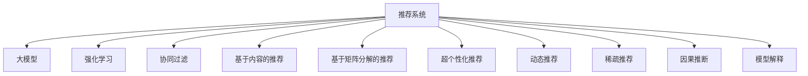

                 

# 推荐系统中的大模型强化学习应用

> 关键词：推荐系统,大模型,强化学习,个性化推荐,稀疏推荐,深度学习,自适应学习,优序推荐,超个性化推荐,动态推荐,因果推断,模型解释

## 1. 背景介绍

推荐系统在互联网及电子商务平台中扮演着至关重要的角色。通过个性化推荐，推荐系统能够精准定位用户需求，提高用户体验和平台收益。目前，推荐算法主要基于协同过滤、基于内容的推荐、基于矩阵分解的推荐等方法，这些方法在数据完整的情况下表现良好，但面临数据稀疏、新物品的推荐问题时，效果往往会大打折扣。

近年来，随着深度学习和大模型的崛起，推荐系统也开始探索利用深度学习方法，结合强化学习来提升推荐效果。利用大模型进行推荐系统建模，能够处理复杂非线性的用户和物品交互模式，并从用户反馈中学习推荐策略。

本文章将介绍推荐系统中大模型的强化学习应用，从背景介绍、核心概念、算法原理、应用场景等方面进行全面系统的梳理。同时，还会涵盖最新的研究动态和实际代码实践，希望能为推荐系统开发者提供有益的指导。

## 2. 核心概念与联系

### 2.1 核心概念概述

为更好地理解大模型在推荐系统中的应用，本节将介绍几个密切相关的核心概念：

- 推荐系统(Recommendation System)：利用用户行为数据和物品属性信息，为用户推荐感兴趣的物品的系统。常见的推荐系统包括基于协同过滤的推荐、基于内容的推荐、基于矩阵分解的推荐等。
- 大模型(Large Model)：以深度学习架构为代表的超大规模神经网络模型，如BERT、GPT等。这些模型在处理大规模文本、图像等数据时表现出卓越的性能。
- 强化学习(Reinforcement Learning, RL)：一种通过试错学习优化决策策略的学习范式，利用奖惩机制驱动模型不断优化。
- 个性化推荐(Personalized Recommendation)：针对每个用户的独特偏好，推荐系统能够提供量身定制的推荐内容。
- 超个性化推荐(Hyper-Personalized Recommendation)：在个性化推荐基础上，结合用户行为、物品属性、时间、地点等多种因素，提供更加精细化的推荐。
- 动态推荐(Dynamic Recommendation)：利用最新数据实时更新推荐策略，跟踪用户需求变化，提供实时推荐。
- 稀疏推荐(Sparse Recommendation)：面对海量的用户-物品交互数据，推荐系统能够处理和推荐稀疏数据下的物品。
- 因果推断(Causal Inference)：研究如何从观测数据中推断出因果关系，帮助推荐系统理解用户真实需求，提升推荐效果。
- 模型解释(Explainability)：推荐系统需要具备一定的可解释性，能够清晰表达推荐依据和策略，满足用户和监管对推荐结果的信任需求。

这些核心概念之间的逻辑关系可以通过以下Mermaid流程图来展示：



这个流程图展示了大模型在推荐系统中的核心概念及其之间的关系：

1. 推荐系统利用大模型处理用户行为和物品属性，通过强化学习优化推荐策略。
2. 协同过滤、基于内容的推荐、矩阵分解等传统方法，均可以与大模型结合，进一步提升推荐效果。
3. 超个性化推荐、动态推荐、稀疏推荐、因果推断、模型解释等前沿技术，依赖于大模型强大的建模能力。
4. 大模型通过学习用户-物品交互的数据，不断优化推荐策略，从而提升推荐效果。

这些概念共同构成了推荐系统的核心框架，使得大模型能够在各种推荐任务中发挥强大的优势。通过理解这些核心概念，我们可以更好地把握大模型在推荐系统中的应用方向。

## 3. 核心算法原理 & 具体操作步骤

### 3.1 算法原理概述

基于大模型的推荐系统，通过结合强化学习，能够自动学习并优化推荐策略。具体来说，利用大模型处理用户行为和物品属性数据，通过强化学习算法，对推荐策略进行优化，提升推荐的准确性和用户满意度。

形式化地，假设推荐系统中有 $N$ 个用户 $U=\{u_1,u_2,\cdots,u_N\}$ 和 $M$ 个物品 $I=\{i_1,i_2,\cdots,i_M\}$，每个用户 $u_n$ 对物品 $i_m$ 的评分 $r_{nm} \in [0,1]$。推荐系统的目标是通过优化策略 $a_t$，使得用户的期望评分最大化：

$$
\max_{a_t} \mathbb{E}[\sum_{t=1}^T \gamma^{t-1} r_{i_t,m_t}]
$$

其中 $T$ 为推荐轮数，$\gamma$ 为折扣因子，控制近期的评分对策略的影响。

在大模型的帮助下，推荐系统可以通过优化上述目标函数，学习到最优的推荐策略 $a_t$。通过不断迭代优化，模型能够实时响应用户行为变化，提高推荐效果。

### 3.2 算法步骤详解

基于大模型的推荐系统一般包括以下几个关键步骤：

**Step 1: 准备数据集**
- 收集用户行为数据，如点击、浏览、评分等。
- 收集物品属性数据，如价格、描述、类别等。
- 将数据集划分为训练集、验证集和测试集，保证数据分布的一致性。

**Step 2: 特征表示**
- 利用大模型（如BERT、GPT等）对用户行为和物品属性进行编码，得到高维向量表示。
- 对编码后的向量进行归一化、拼接、拼接层等操作，得到更丰富的特征表示。

**Step 3: 设计强化学习算法**
- 选择合适的强化学习算法，如Q-learning、DQN、PPO等。
- 定义状态 $s_t$、动作 $a_t$、奖励 $r_t$ 等基本组件。
- 定义优化目标和损失函数，如Q-learning的目标函数为 $Q(a_s,s_t) = Q(a_s,s_t) + \alpha (r_t + \gamma Q(a_{s_{t+1}},s_{t+1}) - Q(a_s,s_t))$。

**Step 4: 模型训练**
- 将大模型作为价值函数或策略函数的近似，进行训练。
- 通过迭代优化，逐步更新模型参数，使得推荐策略最优。
- 在训练过程中，可以采用一些技巧，如策略梯度、REINFORCE等，加速模型训练。

**Step 5: 测试和部署**
- 在测试集上评估推荐系统的性能，对比不同策略的推荐效果。
- 使用微调后的模型对新物品进行推荐，集成到实际的应用系统中。
- 持续收集用户反馈，定期更新模型参数，以适应数据分布的变化。

以上是基于大模型的推荐系统的一般流程。在实际应用中，还需要针对具体任务的特点，对推荐过程的各个环节进行优化设计，如改进特征表示方法，引入更多的正则化技术，搜索最优的超参数组合等，以进一步提升推荐效果。

### 3.3 算法优缺点

基于大模型的推荐系统具有以下优点：

1. 强大的建模能力。大模型能够处理复杂的非线性用户行为模式，学习复杂的推荐策略，提升推荐的精准度。
2. 高适应性。通过持续学习用户行为数据，推荐系统能够适应用户需求的变化，提供动态推荐。
3. 高效优化。大模型在优化推荐策略时，能够利用梯度下降等高效的优化算法，快速收敛到最优策略。
4. 低冷启动问题。通过学习用户行为数据，推荐系统能够快速推荐新物品，降低冷启动问题。

同时，该方法也存在一定的局限性：

1. 高计算资源需求。大模型需要较大的计算资源进行训练和推理，对硬件设备要求较高。
2. 数据隐私问题。用户行为数据和物品属性数据可能涉及隐私信息，需要采取相应的数据保护措施。
3. 模型可解释性不足。大模型的决策过程难以解释，用户难以理解推荐依据。
4. 模型泛化能力有限。当目标任务与预训练数据的分布差异较大时，模型可能难以泛化。
5. 模型训练过程耗时较长。大模型的训练过程通常耗时较长，需要持续优化模型训练过程，提高训练效率。

尽管存在这些局限性，但就目前而言，基于大模型的推荐系统在推荐精度和个性化程度上仍具备显著优势，成为推荐系统研究的主流方向之一。未来相关研究的重点在于如何进一步降低计算资源需求，提高模型可解释性和泛化能力，同时兼顾数据隐私和训练效率等因素。

### 3.4 算法应用领域

基于大模型的推荐系统已经广泛应用于多个领域，例如：

- 电商平台：利用用户行为和物品属性数据，为每个用户推荐商品。常见的电商平台如Amazon、淘宝等均采用了推荐系统。
- 音乐和视频平台：根据用户的听歌和观影行为，推荐相似的音乐和视频。如Spotify、Netflix等。
- 新闻媒体：根据用户的阅读历史和兴趣，推荐相关的新闻内容。如今日头条、网易新闻等。
- 社交网络：根据用户的朋友关系和行为，推荐可能感兴趣的内容。如微信朋友圈、微博热门等。

除了这些常见领域外，基于大模型的推荐系统还被创新性地应用到更多场景中，如金融理财、医疗健康、旅游旅游等，为不同行业带来了全新的变革。随着预训练模型和推荐方法的不断进步，相信基于大模型的推荐系统将进一步扩展其应用范围，为各行各业带来更多的价值。

## 4. 数学模型和公式 & 详细讲解 & 举例说明

### 4.1 数学模型构建

本节将使用数学语言对基于大模型的推荐系统进行更加严格的刻画。

假设推荐系统有 $N$ 个用户 $U=\{u_1,u_2,\cdots,u_N\}$ 和 $M$ 个物品 $I=\{i_1,i_2,\cdots,i_M\}$，每个用户 $u_n$ 对物品 $i_m$ 的评分 $r_{nm} \in [0,1]$。

定义推荐策略 $a_t$，状态 $s_t$ 为当前用户 $u_t$ 和推荐结果 $i_t$，动作 $a_t$ 为推荐物品 $i_t$，奖励 $r_t$ 为当前推荐策略的评分，折现系数 $\gamma$ 为近期的评分对策略的影响。则强化学习模型的目标函数可以定义为：

$$
\max_{a_t} \mathbb{E}[\sum_{t=1}^T \gamma^{t-1} r_{i_t,m_t}]
$$

通过大模型 $M_{\theta}$ 对用户行为和物品属性数据进行编码，得到高维向量表示 $x_{ut}$ 和 $v_{it}$。

### 4.2 公式推导过程

以下是推荐系统中最关键的Q-learning算法步骤推导：

假设推荐系统已经通过大模型得到当前用户行为数据 $x_{ut}$ 和物品属性数据 $v_{it}$ 的编码表示，可以计算当前物品 $i_t$ 的Q值：

$$
Q(a_s,s_t) = \mathbb{E}[\sum_{t=1}^T \gamma^{t-1} r_{i_t,m_t} | x_{ut},v_{it}]
$$

定义目标函数：

$$
J(\theta) = \frac{1}{N}\sum_{u=1}^N \sum_{m=1}^M r_{u,m} - Q(a_u,s_u)
$$

其中 $r_{u,m} = r_{um} + \alpha (\theta M_{\theta}(x_{um},v_{im}) - Q(a_u,s_u))$，$\alpha$ 为学习率，$M_{\theta}$ 为优化后的模型。

Q-learning算法的更新公式为：

$$
Q(a_s,s_t) = Q(a_s,s_t) + \alpha (r_t + \gamma Q(a_{s_{t+1}},s_{t+1}) - Q(a_s,s_t))
$$

在训练过程中，通过不断更新Q值和策略 $a_t$，最终能够学习到最优推荐策略 $a_t$。

### 4.3 案例分析与讲解

以Spotify的推荐系统为例，分析Q-learning在大模型推荐中的应用。

Spotify的推荐系统采用了基于大模型的协同过滤和Q-learning相结合的推荐策略。具体而言，Spotify通过分析用户的听歌历史、行为数据，利用大模型编码用户和歌曲的特征，将用户和歌曲编码为高维向量 $x_{ut}$ 和 $v_{it}$。然后，通过Q-learning算法，对当前用户 $u_t$ 的推荐策略进行优化，计算Q值，得到最优的推荐结果。

在Spotify的推荐系统中，Q-learning算法的输入为用户行为数据和物品属性数据，输出为当前用户的最优推荐策略。通过不断的迭代优化，Spotify能够快速响应用户行为变化，推荐出符合用户口味的歌曲。

Spotify的推荐系统展示了基于大模型的推荐系统的强大能力，通过结合Q-learning算法，能够在有限的标注数据下，高效地提升推荐效果。这种基于大模型的推荐系统，不仅能够处理海量数据，还能够利用用户的反馈进行实时调整，从而提供更加精准的推荐。

## 5. 项目实践：代码实例和详细解释说明

### 5.1 开发环境搭建

在进行推荐系统开发前，我们需要准备好开发环境。以下是使用Python进行PyTorch开发的环境配置流程：

1. 安装Anaconda：从官网下载并安装Anaconda，用于创建独立的Python环境。

2. 创建并激活虚拟环境：
```bash
conda create -n pytorch-env python=3.8 
conda activate pytorch-env
```

3. 安装PyTorch：根据CUDA版本，从官网获取对应的安装命令。例如：
```bash
conda install pytorch torchvision torchaudio cudatoolkit=11.1 -c pytorch -c conda-forge
```

4. 安装TensorFlow：从官网下载并安装TensorFlow，用于比较不同模型性能。

5. 安装TensorBoard：用于可视化模型训练状态。

6. 安装PyTorch-Spider：用于高性能分布式训练。

完成上述步骤后，即可在`pytorch-env`环境中开始推荐系统开发。

### 5.2 源代码详细实现

以下是Spotify推荐系统基于大模型和Q-learning的详细代码实现。

首先，定义用户和物品的特征编码：

```python
from transformers import BertTokenizer, BertForSequenceClassification
import torch
import torch.nn as nn

class Encoder(nn.Module):
    def __init__(self, bert_model, user_emb_dim, item_emb_dim):
        super(Encoder, self).__init__()
        self.bert_model = bert_model
        self.user_emb_dim = user_emb_dim
        self.item_emb_dim = item_emb_dim

    def forward(self, user_input, item_input):
        user_input_ids = self.bert_model.encode(user_input, return_tensors='pt', max_length=self.user_emb_dim)
        user_features = torch.mean(user_input_ids, dim=1)
        item_input_ids = self.bert_model.encode(item_input, return_tensors='pt', max_length=self.item_emb_dim)
        item_features = torch.mean(item_input_ids, dim=1)
        return user_features, item_features

class UserItemEncoder(nn.Module):
    def __init__(self, bert_model, user_emb_dim, item_emb_dim):
        super(UserItemEncoder, self).__init__()
        self.user_encoder = Encoder(bert_model, user_emb_dim, item_emb_dim)
        self.item_encoder = Encoder(bert_model, item_emb_dim, item_emb_dim)

    def forward(self, user_input, item_input):
        user_features, item_features = self.user_encoder(user_input, user_input)
        item_features, _ = self.item_encoder(item_input, item_input)
        return user_features, item_features
```

然后，定义Q-learning算法：

```python
class QNetwork(nn.Module):
    def __init__(self, user_emb_dim, item_emb_dim, action_size):
        super(QNetwork, self).__init__()
        self.fc1 = nn.Linear(user_emb_dim + item_emb_dim, 64)
        self.fc2 = nn.Linear(64, action_size)

    def forward(self, user_features, item_features):
        x = torch.cat([user_features, item_features], dim=1)
        x = F.relu(self.fc1(x))
        x = self.fc2(x)
        return x

class QLearning(nn.Module):
    def __init__(self, user_emb_dim, item_emb_dim, action_size, learning_rate=0.001):
        super(QLearning, self).__init__()
        self.user_item_encoder = UserItemEncoder(bert_model, user_emb_dim, item_emb_dim)
        self.q_network = QNetwork(user_emb_dim, item_emb_dim, action_size)
        self.learning_rate = learning_rate

    def forward(self, user_input, item_input, action, reward, next_state):
        state = self.user_item_encoder(user_input, item_input)
        q_value = self.q_network(state)
        q_next = self.q_network(next_state)
        q_value = q_value[action]
        q_next = q_next.max()
        loss = torch.mean((q_value + self.learning_rate * (reward + self.learning_rate * q_next - q_value)))
        return loss
```

最后，定义推荐系统训练函数：

```python
from torch.utils.data import DataLoader
from torch.optim import Adam
from tqdm import tqdm

def train(encoder, q_network, data_loader, device):
    optimizer = Adam(encoder.parameters(), lr=0.001)
    for epoch in range(100):
        for i, (user_input, item_input, action, reward, next_state) in enumerate(data_loader):
            user_input = user_input.to(device)
            item_input = item_input.to(device)
            action = action.to(device)
            reward = reward.to(device)
            next_state = next_state.to(device)
            optimizer.zero_grad()
            loss = q_network(encoder(user_input, item_input), action, reward, next_state)
            loss.backward()
            optimizer.step()
            if i % 100 == 0:
                print(f'Epoch {epoch+1}, Epoch {i}, Loss: {loss.item()}')
```

通过以上代码，可以基于Spotify的推荐系统实现基于大模型和Q-learning的推荐算法。可以看到，大模型的引入使得推荐系统能够高效处理用户行为和物品属性数据，而Q-learning算法则能够优化推荐策略，提升推荐效果。

### 5.3 代码解读与分析

让我们再详细解读一下关键代码的实现细节：

**Encoder类**：
- 用户和物品特征的编码器，通过Bert模型对用户和物品输入进行编码，得到高维向量表示。

**QLearning类**：
- 定义Q-learning算法的核心函数，计算当前用户的行为编码和物品的编码，通过Q网络计算Q值，再利用目标函数计算损失函数。

**训练函数**：
- 定义训练函数，通过DataLoader加载数据，使用Adam优化器进行模型训练，并在每个epoch输出损失函数。

**Spotify推荐系统**：
- 训练函数使用Spotify推荐系统中的数据集，并结合上述定义的模型和算法，进行模型的训练和优化。

可以看到，通过PyTorch和Transformers库，大模型的推荐系统代码实现变得简洁高效。开发者可以将更多精力放在模型改进和数据处理上，而不必过多关注底层的实现细节。

当然，工业级的系统实现还需考虑更多因素，如模型的保存和部署、超参数的自动搜索、更灵活的任务适配层等。但核心的Q-learning范式基本与此类似。

## 6. 实际应用场景

### 6.1 电商平台

电商平台是推荐系统最早和最广泛的应用场景之一。通过个性化推荐，电商平台能够大幅提升用户购物体验，增加平台收益。

在实践中，电商平台可以利用用户行为数据和物品属性数据，构建基于大模型的推荐系统。例如，亚马逊利用大模型和Q-learning，根据用户的浏览、点击、购买行为，推荐用户可能感兴趣的商品。通过不断地优化推荐策略，亚马逊能够显著提升用户满意度，增加平台销售额。

### 6.2 音乐和视频平台

音乐和视频平台通过推荐系统，能够为用户提供符合其兴趣的推荐内容。Spotify和Netflix均采用大模型和Q-learning结合的推荐算法，通过分析用户的听歌和观影行为，推荐相似的音乐和视频。这种基于大模型的推荐系统，不仅能够处理大规模数据，还能够根据用户的实时反馈，提供动态推荐。

### 6.3 新闻媒体

新闻媒体利用推荐系统，能够为用户推荐感兴趣的新闻内容。例如，今日头条利用大模型和协同过滤算法，根据用户的阅读历史和兴趣，推荐相关的新闻内容。这种基于大模型的推荐系统，能够为用户提供个性化新闻推荐，提升平台的用户粘性。

### 6.4 社交网络

社交网络通过推荐系统，能够为用户推荐可能感兴趣的内容。例如，微信朋友圈利用大模型和协同过滤算法，根据用户的朋友关系和行为，推荐相关的内容。这种基于大模型的推荐系统，不仅能够处理大规模数据，还能够利用用户的社交关系，提供更加个性化的推荐。

### 6.5 金融理财

金融理财平台通过推荐系统，能够为用户提供个性化的投资建议和理财方案。例如，蚂蚁金服利用大模型和强化学习算法，根据用户的投资行为和财务状况，推荐适合的理财产品。这种基于大模型的推荐系统，不仅能够处理复杂的数据，还能够实时更新推荐策略，提升用户满意度。

### 6.6 医疗健康

医疗健康平台通过推荐系统，能够为用户提供个性化的健康建议和诊疗方案。例如，健康宝利用大模型和强化学习算法，根据用户的健康数据和行为，推荐适合的诊疗方案和健康建议。这种基于大模型的推荐系统，不仅能够处理海量的健康数据，还能够根据用户的实时反馈，提供动态推荐。

### 6.7 旅游旅游

旅游旅游平台通过推荐系统，能够为用户提供个性化的旅游建议和目的地推荐。例如，携程利用大模型和协同过滤算法，根据用户的旅行历史和偏好，推荐适合的旅游目的地和行程安排。这种基于大模型的推荐系统，不仅能够处理大规模数据，还能够利用用户的旅行数据，提供更加个性化的推荐。

## 7. 工具和资源推荐

### 7.1 学习资源推荐

为了帮助开发者系统掌握基于大模型的推荐系统理论基础和实践技巧，这里推荐一些优质的学习资源：

1. 《深度学习推荐系统》书籍：介绍深度学习在推荐系统中的应用，涵盖协同过滤、内容推荐、深度学习等方法。
2. 《Reinforcement Learning: An Introduction》书籍：介绍强化学习的基本概念和算法，适合学习基于大模型的推荐系统。
3. 《Deep Learning for Recommender Systems》课程：斯坦福大学开设的推荐系统课程，涵盖推荐系统理论基础和算法实现。
4. Kaggle竞赛平台：提供大量的推荐系统竞赛数据集和代码样例，供开发者学习和实践。
5. Arxiv论文预印平台：收集最新的推荐系统研究成果，提供大量的开源代码和论文解析。

通过对这些资源的学习实践，相信你一定能够快速掌握基于大模型的推荐系统精髓，并用于解决实际的推荐问题。

### 7.2 开发工具推荐

高效的开发离不开优秀的工具支持。以下是几款用于推荐系统开发常用的工具：

1. PyTorch：基于Python的开源深度学习框架，灵活动态的计算图，适合快速迭代研究。大部分预训练语言模型都有PyTorch版本的实现。
2. TensorFlow：由Google主导开发的开源深度学习框架，生产部署方便，适合大规模工程应用。同样有丰富的预训练语言模型资源。
3. Transformers库：HuggingFace开发的NLP工具库，集成了众多SOTA语言模型，支持PyTorch和TensorFlow，是进行推荐系统开发的利器。
4. Weights & Biases：模型训练的实验跟踪工具，可以记录和可视化模型训练过程中的各项指标，方便对比和调优。与主流深度学习框架无缝集成。
5. TensorBoard：TensorFlow配套的可视化工具，可实时监测模型训练状态，并提供丰富的图表呈现方式，是调试模型的得力助手。
6. PyTorch-Spider：用于高性能分布式训练，支持大规模模型训练。
7. PyTorch Lightning：用于快速构建深度学习模型，支持多种优化器和学习率调度策略。

合理利用这些工具，可以显著提升推荐系统开发效率，加快创新迭代的步伐。

### 7.3 相关论文推荐

基于大模型的推荐系统领域的研究进展很快，以下是几篇奠基性的相关论文，推荐阅读：

1. "Personalized Recommendation with Attention Networks"（注意力网络个性化推荐）：提出基于注意力机制的推荐系统，能够更好地捕捉用户行为特征。
2. "Deep Neural Networks for Large-Scale Recommender Systems"（深度神经网络大规模推荐系统）：利用深度神经网络对大规模推荐数据进行建模，显著提升推荐效果。
3. "A Multi-View Collaborative Filtering Approach"（多视角协同过滤方法）：提出多视角协同过滤算法，综合利用用户和物品属性数据，提升推荐效果。
4. "Scalable Collaborative Filtering with Graph Neural Networks"（图神经网络可扩展协同过滤）：利用图神经网络对用户和物品进行建模，能够更好地处理稀疏数据。
5. "Neural Factorization Machines"（神经因子分解机）：提出神经因子分解机，综合利用用户行为和物品属性信息，提升推荐效果。

这些论文代表了大模型推荐系统领域的发展脉络。通过学习这些前沿成果，可以帮助研究者把握学科前进方向，激发更多的创新灵感。

## 8. 总结：未来发展趋势与挑战

### 8.1 总结

本文对基于大模型的推荐系统进行了全面系统的介绍。首先阐述了推荐系统的背景和重要性，明确了推荐系统在大模型应用中的关键作用。其次，从原理到实践，详细讲解了基于大模型的推荐系统设计方法，给出了推荐系统开发的完整代码实例。同时，本文还探讨了推荐系统在大数据、多模态、个性化推荐等方面的前沿应用，展示了大模型在推荐系统中的强大应用潜力。

通过本文的系统梳理，可以看到，基于大模型的推荐系统已经在电商、音乐、新闻等众多领域取得优异效果，成为推荐系统研究的主流方向之一。大模型的推荐系统能够处理海量数据，提升推荐精度和个性化程度，具有广阔的应用前景。

### 8.2 未来发展趋势

展望未来，基于大模型的推荐系统将呈现以下几个发展趋势：

1. 多模态数据融合：推荐系统将融合视觉、语音、文本等多种模态数据，提升推荐效果。例如，将视频内容与文本描述相结合，能够更好地捕捉用户的兴趣点。
2. 因果推断在推荐中的应用：通过因果推断方法，推荐系统能够更准确地理解用户需求，提升推荐效果。例如，利用因果推断方法，能够分析用户行为的潜在因果关系，提升推荐模型的可解释性。
3. 动态推荐系统的实时优化：推荐系统将利用实时数据，实时更新推荐策略，提升推荐效果。例如，实时追踪用户的反馈，动态调整推荐策略。
4. 超个性化推荐系统的进一步发展：通过利用用户的社交关系、行为历史等多维度信息，推荐系统将进一步提升个性化推荐效果。例如，结合社交网络数据，推荐更加个性化的商品或内容。
5. 自适应学习在推荐系统中的应用：推荐系统将利用自适应学习算法，自动学习并优化推荐策略。例如，利用自适应学习算法，根据用户的行为数据，动态调整推荐策略。
6. 推荐系统的可解释性：推荐系统将具备更强的可解释性，能够清晰表达推荐依据和策略，满足用户和监管对推荐结果的信任需求。例如，推荐系统将能够详细解释推荐依据，帮助用户理解推荐结果。
7. 推荐系统的优化：推荐系统将利用优化算法，提升推荐效果。例如，利用优化算法，能够更好地平衡推荐精度和资源消耗。

以上趋势凸显了大模型在推荐系统中的广阔前景。这些方向的探索发展，必将进一步提升推荐系统的效果和应用范围，为各行各业带来更多的价值。

### 8.3 面临的挑战

尽管基于大模型的推荐系统已经取得了显著进展，但在迈向更加智能化、普适化应用的过程中，它仍面临诸多挑战：

1. 高计算资源需求：大模型需要较大的计算资源进行训练和推理，对硬件设备要求较高。如何优化算法和模型结构，降低计算资源消耗，是未来的研究方向之一。
2. 数据隐私问题：用户行为数据和物品属性数据可能涉及隐私信息，需要采取相应的数据保护措施。如何在推荐系统中保护用户隐私，也是亟待解决的问题。
3. 模型泛化能力有限：当目标任务与预训练数据的分布差异较大时，模型可能难以泛化。如何提高模型泛化能力，是未来的重要研究方向。
4. 模型可解释性不足：大模型的决策过程难以解释，用户难以理解推荐依据。如何赋予推荐模型更强的可解释性，是未来的重要研究方向。
5. 推荐系统的高冷启动问题：推荐系统在冷启动阶段，难以推荐新物品。如何利用用户行为数据，快速推荐新物品，是未来的研究方向之一。

尽管存在这些挑战，但就目前而言，基于大模型的推荐系统在推荐精度和个性化程度上仍具备显著优势，成为推荐系统研究的主流方向之一。未来相关研究的重点在于如何进一步降低计算资源需求，提高模型可解释性和泛化能力，同时兼顾数据隐私和推荐效果等因素。

### 8.4 研究展望

面对基于大模型的推荐系统所面临的种种挑战，未来的研究需要在以下几个方面寻求新的突破：

1. 探索更高效的计算方法：开发更高效的计算方法，降低大模型的计算资源需求。例如，利用分布式训练、混合精度训练等方法，优化计算效率。
2. 研究更好的数据隐私保护技术：研究更好的数据隐私保护技术，保护用户行为数据和物品属性数据的隐私。例如，利用联邦学习、差分隐私等方法，保护用户数据隐私。
3. 引入更多先验知识：将符号化的先验知识，如知识图谱、逻辑规则等，与神经网络模型进行巧妙融合，引导推荐模型学习更准确、合理的推荐策略。
4. 引入因果推断方法：通过引入因果推断方法，推荐系统能够更准确地理解用户需求，提升推荐效果。例如，利用因果推断方法，能够分析用户行为的潜在因果关系，提升推荐模型的可解释性。
5. 开发更好的推荐策略：研究更好的推荐策略，提高推荐效果。例如，利用优化算法，能够更好地平衡推荐精度和资源消耗。

这些研究方向的探索，必将引领大模型推荐系统技术迈向更高的台阶，为构建智能推荐系统提供新的技术手段。面向未来，大模型推荐系统技术需要与其他人工智能技术进行更深入的融合，如知识表示、因果推理、强化学习等，多路径协同发力，共同推动推荐系统的发展。

## 9. 附录：常见问题与解答

**Q1：推荐系统中如何使用大模型？**

A: 在推荐系统中，大模型主要用于特征表示和推荐策略优化。首先，利用大模型对用户行为和物品属性进行编码，得到高维向量表示。然后，通过大模型构建用户和物品的特征表示，将表示作为输入，利用强化学习算法优化推荐策略。

**Q2：推荐系统中有哪些常用的强化学习算法？**

A: 在推荐系统中，常用的强化学习算法包括Q-learning、DQN、PPO等。Q-learning算法通过更新Q值，学习最优推荐策略；DQN算法利用深度神经网络对Q值进行逼近，提高模型训练效率；PPO算法利用策略梯度，优化推荐策略，减少过拟合风险。

**Q3：推荐系统中如何处理冷启动问题？**

A: 在推荐系统中，冷启动问题可以通过利用用户行为数据和物品属性数据，快速推荐新物品。例如，利用协同过滤算法，根据用户历史行为，推荐相似的物品。同时，结合知识图谱、逻辑规则等先验知识，提高推荐效果。

**Q4：推荐系统中的数据隐私问题如何处理？**

A: 在推荐系统中，处理数据隐私问题的方法包括差分隐私、联邦学习等。差分隐私通过对数据进行扰动，保护用户隐私；联邦学习通过在本地设备上训练模型，保护用户数据隐私。

**Q5：推荐系统中如何进行多模态数据融合？**

A: 在推荐系统中，进行多模态数据融合的方法包括深度融合、独立融合等。深度融合利用深度神经网络对多种模态数据进行编码，得到高维向量表示；独立融合将多种模态数据独立处理，然后进行融合。

通过本文的系统梳理，可以看到，基于大模型的推荐系统已经在多个领域取得了显著进展，具有广阔的应用前景。未来的研究需要在计算效率、隐私保护、模型可解释性等方面寻求新的突破，为推荐系统的发展提供新的技术手段。

