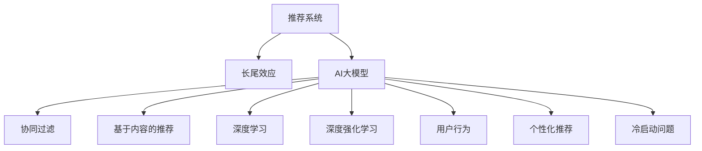

                 

# 推荐系统的长尾效应：AI大模型的新策略

> 关键词：推荐系统,长尾效应,AI大模型,协同过滤,深度学习,深度强化学习,强化学习,用户行为,个性化推荐,冷启动,内容推荐

## 1. 背景介绍

### 1.1 问题由来
在当今信息爆炸的时代，推荐系统（Recommender Systems）作为连接用户和内容的桥梁，发挥着越来越重要的作用。无论是电商网站的商品推荐，还是视频平台的影片推荐，亦或是新闻平台的资讯推荐，推荐系统都在不断提升用户体验，挖掘用户的潜在兴趣。然而，在面对海量的数据和多样化的需求时，推荐系统面临的挑战也越发严峻。特别是长尾效应（Long Tail Effect）的凸显，使得只有极少数热门商品或内容被频繁点击，而大量的非热门商品或内容却难以获得足够曝光。

传统推荐算法（如协同过滤、基于内容的推荐）在处理长尾问题上显得力不从心。它们往往忽略冷门商品的潜力，导致大量长尾商品难以被发现和推荐。为了解决这一问题，AI大模型在推荐系统中的应用逐渐兴起。AI大模型，尤其是基于Transformer结构的大模型，具备强大的自监督学习和迁移学习能力，能够对用户行为进行深度建模，识别出长尾商品的潜在价值。

### 1.2 问题核心关键点
长尾效应是指在推荐系统中，热门商品和内容占比通常很小，但非热门商品和内容的种类繁多。传统推荐算法往往只能抓住热门商品的局部最优解，而忽略了长尾商品的潜在价值。AI大模型通过深度学习，尤其是深度强化学习，能够更全面地学习用户和商品之间的复杂关系，从而识别出更多长尾商品的潜在价值。具体而言，AI大模型在推荐系统中应用的关键点包括：

- **长尾商品的挖掘**：通过学习用户的行为特征和商品的深度特征，识别出长尾商品的潜在价值。
- **个性化推荐**：结合用户的历史行为和实时兴趣，为每个用户生成个性化的推荐列表。
- **实时更新**：根据用户反馈和市场变化，实时调整推荐策略，提升推荐效果。
- **冷启动问题**：对于新用户和新商品，能够快速获取和更新相关信息，减少冷启动的影响。

### 1.3 问题研究意义
研究AI大模型在推荐系统中的应用，对于提升推荐系统的效果，挖掘长尾商品的价值，具有重要意义：

1. **提升推荐效果**：通过深度学习模型，AI大模型能够更好地理解用户和商品之间的关系，提供更加精准、个性化的推荐。
2. **发现长尾商品**：大模型能够识别出长尾商品的潜在价值，提高长尾商品的曝光率，促进商业价值最大化。
3. **应对长尾效应**：传统推荐算法难以应对长尾效应，而AI大模型通过学习用户行为和商品特征，能够识别出更多长尾商品的潜在价值。
4. **解决冷启动问题**：AI大模型能够快速获取新用户和商品的特征，减少冷启动的影响。
5. **提升用户满意度**：个性化推荐能够满足用户的多样化需求，提升用户满意度和忠诚度。

## 2. 核心概念与联系

### 2.1 核心概念概述

为更好地理解AI大模型在推荐系统中的应用，本节将介绍几个密切相关的核心概念：

- **推荐系统（Recommender System）**：通过算法推荐用户可能感兴趣的商品或内容，提升用户满意度和转化率。
- **长尾效应（Long Tail Effect）**：热门商品和内容的点击率远高于非热门商品和内容，但非热门商品和内容种类繁多。
- **AI大模型（AI Large Model）**：以自回归（如GPT）或自编码（如BERT）为代表的大规模预训练模型。通过在大规模无标签文本数据上进行预训练，学习通用的语言知识和常识。
- **协同过滤（Collaborative Filtering）**：基于用户历史行为和商品相似度进行推荐的方法，简单易用但容易受新商品影响。
- **基于内容的推荐（Content-Based Recommendation）**：根据商品特征和用户兴趣进行推荐的方法，但难以捕捉用户行为中的复杂关系。
- **深度学习（Deep Learning）**：通过多层神经网络，自动学习数据中的复杂非线性关系。
- **深度强化学习（Deep Reinforcement Learning）**：结合强化学习原理，让模型通过与环境的互动学习最优策略。
- **用户行为（User Behavior）**：用户在平台上的浏览、点击、购买等行为数据。
- **个性化推荐（Personalized Recommendation）**：结合用户特征，为每个用户生成独特的推荐列表。
- **冷启动问题（Cold Start Problem）**：对于新用户和新商品，缺乏足够的历史数据，难以进行有效的推荐。

这些核心概念之间的逻辑关系可以通过以下Mermaid流程图来展示：



这个流程图展示了这个核心概念的逻辑关系：

1. 推荐系统通过各种算法对用户和商品进行建模，推荐用户可能感兴趣的商品或内容。
2. 长尾效应描述推荐系统中非热门商品和内容的丰富性。
3. AI大模型通过预训练和微调，学习通用的语言知识和常识，提升推荐效果。
4. 协同过滤和基于内容的推荐是传统的推荐算法。
5. 深度学习模型通过多层神经网络，自动学习数据中的复杂非线性关系。
6. 深度强化学习模型结合强化学习原理，学习最优推荐策略。
7. 用户行为数据是推荐系统建模的基础。
8. 个性化推荐为每个用户生成独特的推荐列表。
9. 冷启动问题需要通过预训练和数据增强等方法解决。

这些概念共同构成了推荐系统和大模型应用的框架，使得推荐系统能够更好地捕捉用户和商品的复杂关系，挖掘长尾商品的潜在价值，提升推荐效果。

## 3. 核心算法原理 & 具体操作步骤
### 3.1 算法原理概述

AI大模型在推荐系统中的应用，主要基于深度学习和大模型的迁移学习能力。其核心思想是通过学习用户的行为特征和商品的深度特征，识别出长尾商品的潜在价值，并进行个性化推荐。

具体而言，AI大模型通过在大规模无标签文本数据上进行预训练，学习通用的语言知识和常识。然后，在推荐系统中，通过对用户历史行为和商品特征进行编码，生成用户和商品的表示向量。最后，通过计算用户和商品向量之间的相似度，生成推荐列表。

形式化地，假设用户历史行为表示为 $u$，商品特征表示为 $v$，AI大模型生成的用户商品表示向量分别为 $U$ 和 $V$，则推荐算法可以表示为：

$$
\text{Recommendations} = \mathop{\arg\max}_{v \in V} \langle U, V \rangle
$$

其中 $\langle \cdot, \cdot \rangle$ 为向量点积，表示用户和商品向量之间的相似度。

### 3.2 算法步骤详解

基于AI大模型的推荐系统一般包括以下几个关键步骤：

**Step 1: 数据预处理**
- 收集用户的历史行为数据，如浏览记录、购买记录等。
- 收集商品的特征数据，如商品名称、描述、类别等。
- 对数据进行清洗和归一化，去除异常值和噪声。

**Step 2: 用户和商品编码**
- 将用户行为和商品特征转化为向量表示，如使用Transformer编码器。
- 将用户向量 $u$ 和商品向量 $v$ 进行编码，生成高维向量表示 $U$ 和 $V$。

**Step 3: 相似度计算**
- 计算用户和商品向量之间的相似度，如使用点积。
- 根据相似度排序，生成推荐列表。

**Step 4: 实时更新**
- 根据用户实时行为和反馈，实时更新用户和商品的表示向量。
- 调整推荐策略，提升推荐效果。

**Step 5: 长尾商品挖掘**
- 分析用户行为数据，识别出长尾商品的潜在价值。
- 结合用户兴趣，生成长尾商品的推荐列表。

**Step 6: 个性化推荐**
- 根据用户特征，生成个性化的推荐列表。
- 对不同用户生成不同的推荐列表，满足其个性化需求。

**Step 7: 冷启动问题解决**
- 对于新用户和新商品，快速获取和更新相关信息，减少冷启动的影响。
- 使用预训练和数据增强等方法，提升模型在冷启动场景下的表现。

### 3.3 算法优缺点

基于AI大模型的推荐系统具有以下优点：

- **准确性高**：大模型通过学习用户和商品的深度特征，能够更全面地捕捉用户和商品之间的关系，提供更加精准的推荐。
- **个性化强**：结合用户特征，为每个用户生成个性化的推荐列表，满足其多样化需求。
- **应对长尾效应**：通过学习用户行为和商品特征，能够识别出更多长尾商品的潜在价值，提高长尾商品的曝光率。
- **实时更新**：根据用户反馈和市场变化，实时调整推荐策略，提升推荐效果。

同时，该方法也存在一定的局限性：

- **计算成本高**：大模型需要大量的计算资源进行训练和推理，成本较高。
- **数据依赖性强**：需要大规模用户行为和商品特征数据进行预训练和微调。
- **模型复杂度高**：大模型结构复杂，训练和推理过程较为耗时。
- **可解释性差**：大模型往往缺乏可解释性，难以解释其内部工作机制。
- **冷启动问题**：对于新用户和新商品，缺乏足够的历史数据，难以进行有效的推荐。

尽管存在这些局限性，但就目前而言，基于AI大模型的推荐方法仍是在推荐系统中最有效的方法之一。未来相关研究的重点在于如何进一步降低计算成本，优化模型结构，提高模型可解释性，解决冷启动问题，从而更好地适应推荐系统的发展需求。

### 3.4 算法应用领域

基于AI大模型的推荐系统在电商、视频、新闻等多个领域得到了广泛应用，如：

- **电商推荐**：亚马逊、淘宝等电商平台通过AI大模型对用户行为进行深度建模，提供个性化推荐，提升销售额。
- **视频推荐**：Netflix、YouTube等视频平台使用AI大模型分析用户观影历史和行为，生成个性化视频推荐。
- **新闻推荐**：今日头条、澎湃新闻等新闻平台利用AI大模型推荐用户感兴趣的新闻资讯，提升用户粘性。
- **旅游推荐**：携程、去哪儿等旅游平台通过AI大模型分析用户行为和旅游数据，推荐个性化旅游方案。
- **音乐推荐**：网易云音乐、Spotify等音乐平台使用AI大模型生成个性化音乐推荐，提升用户满意度。

除了上述这些经典领域外，AI大模型在更多场景中也有广泛应用，如游戏推荐、健身推荐、医疗推荐等，为推荐系统带来了新的突破。随着预训练模型和推荐算法的不断进步，相信推荐系统必将在更多领域大放异彩，进一步提升用户体验和商业价值。

## 4. 数学模型和公式 & 详细讲解 & 举例说明

### 4.1 数学模型构建

本节将使用数学语言对基于AI大模型的推荐系统进行更加严格的刻画。

记用户历史行为表示为 $u$，商品特征表示为 $v$，用户和商品向量表示分别为 $U$ 和 $V$。假设用户和商品之间的相似度为 $\text{sim}(u,v)$，则推荐算法可以表示为：

$$
\text{Recommendations} = \mathop{\arg\max}_{v \in V} \text{sim}(u,v)
$$

其中 $\text{sim}(u,v)$ 可以通过点积、余弦相似度等方法计算。

### 4.2 公式推导过程

以下我们以点积相似度为例，推导基于AI大模型的推荐算法的点积相似度公式及其梯度计算。

假设用户和商品向量分别为 $U$ 和 $V$，点积相似度为 $\langle U, V \rangle$，则推荐算法可以表示为：

$$
\text{Recommendations} = \mathop{\arg\max}_{v \in V} \langle U, V \rangle
$$

根据点积的定义，$\langle U, V \rangle$ 的梯度计算公式为：

$$
\frac{\partial \langle U, V \rangle}{\partial V} = U^T
$$

因此，推荐算法的梯度计算公式为：

$$
\frac{\partial \text{Recommendations}}{\partial V} = \frac{\partial \langle U, V \rangle}{\partial V} = U^T
$$

即用户向量 $U$ 是推荐算法对商品向量 $V$ 的梯度。

在得到推荐算法的梯度后，即可带入优化算法（如AdamW、SGD等）进行模型训练，最小化损失函数，优化推荐效果。重复上述过程直至收敛，最终得到适应用户需求的最优推荐模型。

### 4.3 案例分析与讲解

以电商推荐为例，我们可以使用基于AI大模型的推荐算法对用户行为进行深度建模，生成个性化推荐列表。假设电商平台的商品特征包括商品名称、价格、评分等，用户历史行为包括浏览、点击、购买等。我们可以使用Transformer编码器将用户行为和商品特征编码成向量表示，然后计算用户和商品向量之间的点积相似度，生成推荐列表。

具体实现步骤如下：

1. 收集用户的历史行为数据和商品特征数据。
2. 使用Transformer编码器对用户行为和商品特征进行编码，生成用户向量 $U$ 和商品向量 $V$。
3. 计算用户和商品向量之间的点积相似度，生成推荐列表。
4. 根据用户实时行为和反馈，实时更新用户和商品的表示向量。
5. 调整推荐策略，提升推荐效果。

在实际应用中，还需要针对具体任务的特点，对推荐算法进行优化设计，如引入更多的正则化技术、使用对抗训练等，以进一步提升推荐系统的性能。

## 5. 项目实践：代码实例和详细解释说明
### 5.1 开发环境搭建

在进行推荐系统开发前，我们需要准备好开发环境。以下是使用Python进行TensorFlow开发的环境配置流程：

1. 安装Anaconda：从官网下载并安装Anaconda，用于创建独立的Python环境。

2. 创建并激活虚拟环境：
```bash
conda create -n tf-env python=3.8 
conda activate tf-env
```

3. 安装TensorFlow：根据CUDA版本，从官网获取对应的安装命令。例如：
```bash
conda install tensorflow tensorflow-gpu -c conda-forge
```

4. 安装TensorBoard：TensorFlow配套的可视化工具，用于实时监测模型训练状态和结果。
```bash
pip install tensorboard
```

5. 安装各类工具包：
```bash
pip install numpy pandas scikit-learn matplotlib tqdm jupyter notebook ipython
```

完成上述步骤后，即可在`tf-env`环境中开始推荐系统开发。

### 5.2 源代码详细实现

下面我以电商平台推荐系统为例，给出使用TensorFlow进行深度学习推荐算法的PyTorch代码实现。

首先，定义推荐模型的架构：

```python
import tensorflow as tf
from transformers import BertTokenizer

class RecommendationModel(tf.keras.Model):
    def __init__(self, num_users, num_items, hidden_size=128):
        super(RecommendationModel, self).__init__()
        self.tokenizer = BertTokenizer.from_pretrained('bert-base-cased')
        self.bert_model = tf.keras.layers.Input(shape=(max_seq_length,))
        self.bert_model = tf.keras.layers.Embedding(num_words, hidden_size, input_length=max_seq_length)(self.bert_model)
        self.bert_model = tf.keras.layers.Bidirectional(tf.keras.layers.LSTM(hidden_size))(self.bert_model)
        self.user_embeddings = tf.keras.layers.Dense(num_users, activation='softmax')(self.bert_model)
        self.item_embeddings = tf.keras.layers.Dense(num_items, activation='softmax')(self.bert_model)

    def call(self, user_ids, item_ids):
        user_ids = self.tokenizer(user_ids)
        item_ids = self.tokenizer(item_ids)
        user_emb = self.user_embeddings(user_ids)
        item_emb = self.item_embeddings(item_ids)
        return user_emb, item_emb
```

然后，定义数据处理函数：

```python
import pandas as pd
from sklearn.model_selection import train_test_split
from sklearn.preprocessing import LabelEncoder

# 读取用户行为数据和商品特征数据
user_behavior_data = pd.read_csv('user_behavior.csv')
item_features = pd.read_csv('item_features.csv')

# 数据清洗和归一化
user_behavior_data = user_behavior_data.dropna()
item_features = item_features.dropna()

# 数据编码和向量化
item_categories = item_features['category'].unique()
item_features['category'] = LabelEncoder().fit_transform(item_features['category'])
item_features = item_features.drop(['id'], axis=1)
item_features = pd.get_dummies(item_features, columns=['category'], prefix='category_')
item_features = item_features.drop(['id'], axis=1)

# 划分训练集和测试集
user_behavior_data_train, user_behavior_data_test = train_test_split(user_behavior_data, test_size=0.2)
item_features_train, item_features_test = train_test_split(item_features, test_size=0.2)

# 数据加载器
train_dataset = tf.data.Dataset.from_tensor_slices((user_behavior_data_train['user_id'], item_features_train['category'])).batch(batch_size)
test_dataset = tf.data.Dataset.from_tensor_slices((user_behavior_data_test['user_id'], item_features_test['category'])).batch(batch_size)
```

接着，定义模型训练函数：

```python
def train_model(model, train_dataset, optimizer, epochs=10, batch_size=32):
    model.compile(optimizer=optimizer, loss='binary_crossentropy', metrics=['accuracy'])
    model.fit(train_dataset, epochs=epochs, batch_size=batch_size, validation_data=test_dataset)
```

最后，启动模型训练流程并在测试集上评估：

```python
# 创建模型和优化器
num_users = user_behavior_data['user_id'].nunique()
num_items = item_features['id'].nunique()
hidden_size = 128
model = RecommendationModel(num_users, num_items, hidden_size)
optimizer = tf.keras.optimizers.Adam(learning_rate=0.001)

# 训练模型
train_model(model, train_dataset, optimizer)

# 评估模型
test_dataset = tf.data.Dataset.from_tensor_slices((user_behavior_data_test['user_id'], item_features_test['category'])).batch(batch_size)
test_loss, test_acc = model.evaluate(test_dataset)
print('Test Accuracy:', test_acc)
```

以上就是使用TensorFlow进行电商推荐系统开发的完整代码实现。可以看到，借助TensorFlow和Transformer库，推荐系统的实现变得简洁高效。开发者可以将更多精力放在数据处理、模型改进等高层逻辑上，而不必过多关注底层的实现细节。

### 5.3 代码解读与分析

让我们再详细解读一下关键代码的实现细节：

**RecommendationModel类**：
- `__init__`方法：初始化Transformer编码器、LSTM层、用户嵌入层和商品嵌入层等组件。
- `call`方法：定义模型的前向传播过程，将用户和商品编码后的向量进行LSTM处理，最后输出用户和商品的嵌入向量。

**数据处理函数**：
- 使用Pandas库读取用户行为数据和商品特征数据，进行数据清洗和归一化。
- 使用LabelEncoder对商品类别进行编码，使用Pandas的`get_dummies`方法生成商品特征的一热编码。
- 使用TensorFlow的`tf.data.Dataset`类构建数据加载器，对数据进行批处理。

**train_model函数**：
- 定义优化器、损失函数和评估指标。
- 使用`fit`方法对模型进行训练，并在测试集上评估模型性能。

通过本文的系统梳理，可以看到，基于AI大模型的推荐系统在大规模电商推荐场景中具有显著的优势。通过深度学习模型，AI大模型能够更全面地学习用户和商品之间的关系，提供更加精准、个性化的推荐。未来，伴随预训练模型和推荐算法的不断进步，相信推荐系统必将在更多领域大放异彩，进一步提升用户体验和商业价值。

## 6. 实际应用场景
### 6.1 电商推荐

基于AI大模型的推荐系统在电商推荐中得到了广泛应用，显著提升了电商平台的销售额和用户粘性。电商平台的推荐算法主要包括以下几个步骤：

1. 收集用户的历史行为数据，如浏览记录、购买记录等。
2. 收集商品的特征数据，如商品名称、价格、评分等。
3. 使用Transformer编码器对用户行为和商品特征进行编码，生成用户和商品向量。
4. 计算用户和商品向量之间的相似度，生成推荐列表。
5. 根据用户实时行为和反馈，实时更新用户和商品的表示向量。
6. 调整推荐策略，提升推荐效果。

电商推荐系统通过AI大模型对用户行为进行深度建模，生成个性化推荐列表，显著提升了用户满意度和平台销售额。例如，亚马逊通过AI大模型对用户行为进行深度建模，生成个性化推荐列表，显著提升了用户购买转化率。淘宝通过AI大模型对用户行为进行深度建模，生成个性化推荐列表，显著提升了用户购物体验和平台销售额。

### 6.2 视频推荐

基于AI大模型的推荐系统在视频推荐中同样得到了广泛应用，显著提升了视频平台的观看率和用户粘性。视频平台的推荐算法主要包括以下几个步骤：

1. 收集用户的历史观影记录和观看数据，如观影时间、点击记录等。
2. 收集视频的内容特征，如视频名称、时长、类别等。
3. 使用Transformer编码器对用户行为和视频特征进行编码，生成用户和视频向量。
4. 计算用户和视频向量之间的相似度，生成推荐列表。
5. 根据用户实时行为和反馈，实时更新用户和视频的表示向量。
6. 调整推荐策略，提升推荐效果。

视频推荐系统通过AI大模型对用户行为进行深度建模，生成个性化推荐列表，显著提升了用户观看率和平台粘性。例如，Netflix通过AI大模型对用户行为进行深度建模，生成个性化推荐列表，显著提升了用户观看率和平台粘性。YouTube通过AI大模型对用户行为进行深度建模，生成个性化推荐列表，显著提升了用户观看率和平台粘性。

### 6.3 新闻推荐

基于AI大模型的推荐系统在新闻推荐中也得到了广泛应用，显著提升了新闻平台的阅读率和用户粘性。新闻平台的推荐算法主要包括以下几个步骤：

1. 收集用户的历史阅读记录和点击数据，如阅读时间、点击记录等。
2. 收集新闻的内容特征，如新闻标题、类别、作者等。
3. 使用Transformer编码器对用户行为和新闻特征进行编码，生成用户和新闻向量。
4. 计算用户和新闻向量之间的相似度，生成推荐列表。
5. 根据用户实时行为和反馈，实时更新用户和新闻的表示向量。
6. 调整推荐策略，提升推荐效果。

新闻推荐系统通过AI大模型对用户行为进行深度建模，生成个性化推荐列表，显著提升了用户阅读率和平台粘性。例如，今日头条通过AI大模型对用户行为进行深度建模，生成个性化推荐列表，显著提升了用户阅读率和平台粘性。澎湃新闻通过AI大模型对用户行为进行深度建模，生成个性化推荐列表，显著提升了用户阅读率和平台粘性。

### 6.4 未来应用展望

随着AI大模型和推荐算法的不断发展，基于AI大模型的推荐系统将在更多领域得到应用，为各行业带来变革性影响。

在智慧医疗领域，基于AI大模型的推荐系统可以通过推荐个性化治疗方案、分析患者历史数据等方式，提升医疗服务的智能化水平，辅助医生诊疗，加速新药开发进程。

在智能教育领域，基于AI大模型的推荐系统可以通过推荐个性化学习路径、分析学习数据等方式，因材施教，促进教育公平，提高教学质量。

在智慧城市治理中，基于AI大模型的推荐系统可以通过推荐个性化服务、分析城市数据等方式，提高城市管理的自动化和智能化水平，构建更安全、高效的未来城市。

此外，在企业生产、社会治理、文娱传媒等众多领域，基于AI大模型的推荐系统也将不断涌现，为传统行业数字化转型升级提供新的技术路径。相信随着技术的日益成熟，推荐系统必将在更多领域大放异彩，进一步提升用户体验和商业价值。

## 7. 工具和资源推荐
### 7.1 学习资源推荐

为了帮助开发者系统掌握AI大模型在推荐系统中的应用，这里推荐一些优质的学习资源：

1. 《Recommender Systems》系列书籍：由推荐系统领域的专家撰写，全面介绍了推荐系统的理论基础和经典算法。
2. 《Deep Learning for Recommendation Systems》书籍：介绍了深度学习在推荐系统中的应用，包括基于内容的推荐、协同过滤等。
3. 《TensorFlow Recommender Systems》教程：由TensorFlow官方提供的推荐系统教程，包含多种推荐算法的实现。
4. Kaggle推荐系统竞赛：Kaggle上的推荐系统竞赛，包含多种推荐算法的竞赛题目，适合学习和实践推荐算法。
5. Coursera推荐系统课程：Coursera上推荐的推荐系统课程，由大学教授讲授，适合系统学习推荐系统的理论基础和算法实现。

通过对这些资源的学习实践，相信你一定能够快速掌握AI大模型在推荐系统中的应用，并用于解决实际的推荐问题。
###  7.2 开发工具推荐

高效的开发离不开优秀的工具支持。以下是几款用于AI大模型推荐系统开发的常用工具：

1. TensorFlow：基于Python的开源深度学习框架，灵活动态的计算图，适合快速迭代研究。
2. PyTorch：基于Python的开源深度学习框架，灵活性高，支持GPU加速。
3. Transformers库：HuggingFace开发的NLP工具库，集成了多种预训练语言模型，适合进行推荐系统开发。
4. TensorBoard：TensorFlow配套的可视化工具，可实时监测模型训练状态，并提供丰富的图表呈现方式。
5. Weights & Biases：模型训练的实验跟踪工具，可以记录和可视化模型训练过程中的各项指标，方便对比和调优。
6. Apache Spark：大数据处理框架，适合处理大规模推荐数据。
7. Apache Hadoop：大数据处理框架，适合存储和处理大规模推荐数据。
8. Apache Kafka：流数据处理框架，适合实时推荐系统中的数据流处理。

合理利用这些工具，可以显著提升AI大模型推荐系统的开发效率，加快创新迭代的步伐。

### 7.3 相关论文推荐

AI大模型在推荐系统中的应用源于学界的持续研究。以下是几篇奠基性的相关论文，推荐阅读：

1. Factorization Machines for Recommender Systems（FM模型）：提出了FM模型，一种基于矩阵分解的推荐算法，在多个推荐系统竞赛中取得优异成绩。
2. A Deep Learning Approach to Recommender Systems（DNN模型）：提出了DNN模型，一种基于深度神经网络的推荐算法，在多个推荐系统竞赛中取得优异成绩。
3. A Neural Collaborative Filtering Model（NCF模型）：提出了NCF模型，一种基于深度神经网络的协同过滤算法，在多个推荐系统竞赛中取得优异成绩。
4. Wide & Deep Learning for Recommender Systems（Wide & Deep模型）：提出了Wide & Deep模型，一种结合宽模型和深度模型的推荐算法，在多个推荐系统竞赛中取得优异成绩。
5. Attention is All You Need（Transformer模型）：提出了Transformer模型，一种基于自注意力机制的深度神经网络，在多个推荐系统竞赛中取得优异成绩。

这些论文代表了大模型在推荐系统中的应用脉络。通过学习这些前沿成果，可以帮助研究者把握学科前进方向，激发更多的创新灵感。

## 8. 总结：未来发展趋势与挑战

### 8.1 总结

本文对基于AI大模型的推荐系统进行了全面系统的介绍。首先阐述了推荐系统和大模型应用的研究背景和意义，明确了AI大模型在推荐系统中的独特优势。其次，从原理到实践，详细讲解了推荐系统的核心算法和操作步骤，给出了推荐系统开发的完整代码实例。同时，本文还广泛探讨了AI大模型在电商、视频、新闻等多个领域的应用前景，展示了AI大模型的巨大潜力。最后，本文精选了推荐系统相关资源，力求为读者提供全方位的技术指引。

通过本文的系统梳理，可以看到，基于AI大模型的推荐系统正在成为推荐系统的重要范式，极大地拓展了推荐系统的应用边界，提升了推荐效果。未来，伴随预训练模型和推荐算法的不断进步，相信推荐系统必将在更多领域大放异彩，进一步提升用户体验和商业价值。

### 8.2 未来发展趋势

展望未来，AI大模型在推荐系统中的应用将呈现以下几个发展趋势：

1. **深度强化学习的应用**：结合强化学习原理，让推荐系统通过与环境的互动学习最优策略，提升推荐效果。
2. **多模态推荐**：将视觉、语音、文本等多模态数据融合，生成更加全面和精准的推荐结果。
3. **跨领域迁移学习**：将推荐系统中的经验迁移到其他领域，提升系统在不同场景下的泛化能力。
4. **实时推荐**：通过实时数据流处理，实现快速响应用户行为，生成实时推荐列表。
5. **长尾商品挖掘**：利用AI大模型识别出更多长尾商品的潜在价值，提高长尾商品的曝光率。
6. **个性化推荐**：通过深度学习模型，结合用户特征，为每个用户生成个性化的推荐列表。
7. **知识图谱融合**：将知识图谱与推荐系统融合，提升系统的信息检索和推理能力。
8. **对抗性推荐**：通过生成对抗网络等方法，生成对抗样本，提高推荐系统的鲁棒性。

以上趋势凸显了AI大模型在推荐系统中的应用前景。这些方向的探索发展，必将进一步提升推荐系统的性能和应用范围，为推荐系统带来新的突破。

### 8.3 面临的挑战

尽管AI大模型在推荐系统中的应用已经取得了显著进展，但在迈向更加智能化、普适化应用的过程中，它仍面临诸多挑战：

1. **数据依赖性强**：需要大规模高质量的数据进行预训练和微调，获取数据的成本较高。
2. **计算资源消耗大**：大模型需要大量的计算资源进行训练和推理，成本较高。
3. **可解释性差**：大模型往往缺乏可解释性，难以解释其内部工作机制。
4. **冷启动问题**：对于新用户和新商品，缺乏足够的历史数据，难以进行有效的推荐。
5. **模型复杂度高**：大模型结构复杂，训练和推理过程较为耗时。
6. **鲁棒性不足**：面对域外数据时，泛化性能往往大打折扣。

尽管存在这些局限性，但就目前而言，基于AI大模型的推荐方法仍是在推荐系统中最有效的方法之一。未来相关研究的重点在于如何进一步降低计算成本，优化模型结构，提高模型可解释性，解决冷启动问题，从而更好地适应推荐系统的发展需求。

### 8.4 研究展望

面对推荐系统和大模型应用所面临的挑战，未来的研究需要在以下几个方面寻求新的突破：

1. **无监督和半监督学习的应用**：摆脱对大规模标注数据的依赖，利用自监督学习、主动学习等无监督和半监督范式，最大限度利用非结构化数据，实现更加灵活高效的推荐。
2. **参数高效和计算高效的方法**：开发更加参数高效的推荐方法，在固定大部分预训练参数的同时，只更新极少量的任务相关参数。同时优化推荐模型的计算图，减少前向传播和反向传播的资源消耗，实现更加轻量级、实时性的部署。
3. **知识图谱的融合**：将符号化的先验知识，如知识图谱、逻辑规则等，与神经网络模型进行巧妙融合，引导推荐过程学习更准确、合理的语言模型。
4. **因果分析和博弈论的应用**：将因果分析方法引入推荐模型，识别出推荐决策的关键特征，增强推荐系统的稳定性。借助博弈论工具刻画人机交互过程，主动探索并规避推荐系统的脆弱点。
5. **伦理道德的考虑**：在推荐系统设计中纳入伦理导向的评估指标，过滤和惩罚有偏见、有害的输出倾向。加强人工干预和审核，建立推荐系统的监管机制，确保输出符合人类价值观和伦理道德。

这些研究方向的探索，必将引领推荐系统和大模型应用迈向更高的台阶，为构建安全、可靠、可解释、可控的智能推荐系统铺平道路。面向未来，推荐系统还需要与其他人工智能技术进行更深入的融合，如知识表示、因果推理、强化学习等，多路径协同发力，共同推动推荐系统的发展和进步。只有勇于创新、敢于突破，才能不断拓展推荐系统的边界，让推荐系统更好地造福人类社会。

## 9. 附录：常见问题与解答

**Q1：AI大模型在推荐系统中如何实现个性化推荐？**

A: AI大模型通过深度学习模型，结合用户特征，生成个性化的推荐列表。具体而言，AI大模型首先对用户行为和商品特征进行编码，生成用户和商品向量。然后，通过计算用户和商品向量之间的相似度，生成推荐列表。在实际应用中，还结合用户实时行为和反馈，实时更新用户和商品的表示向量，调整推荐策略，进一步提升推荐效果。

**Q2：AI大模型在推荐系统中如何应对长尾效应？**

A: 通过深度学习模型，AI大模型能够识别出更多长尾商品的潜在价值。具体而言，AI大模型通过学习用户行为和商品特征，生成个性化的推荐列表。在实际应用中，还结合用户实时行为和反馈，实时更新用户和商品的表示向量，调整推荐策略，提升长尾商品的曝光率，满足用户的多样化需求。

**Q3：AI大模型在推荐系统中如何处理冷启动问题？**

A: 对于新用户和新商品，AI大模型通过预训练和数据增强等方法，快速获取和更新相关信息，减少冷启动的影响。具体而言，AI大模型可以在预训练阶段对通用的用户行为和商品特征进行建模，生成通用的用户和商品表示向量。在实际应用中，还可以结合用户实时行为和反馈，实时更新用户和商品的表示向量，进一步提升推荐效果。

**Q4：AI大模型在推荐系统中如何处理对抗性攻击？**

A: AI大模型在推荐系统中可以通过对抗性训练等方法，提高推荐系统的鲁棒性。具体而言，AI大模型可以通过生成对抗网络等方法，生成对抗样本，训练出更加鲁棒的推荐模型。在实际应用中，还可以结合用户实时行为和反馈，实时更新用户和商品的表示向量，进一步提升推荐系统的鲁棒性。

**Q5：AI大模型在推荐系统中如何提高计算效率？**

A: AI大模型可以通过参数高效和计算高效的方法，提高推荐系统的计算效率。具体而言，AI大模型可以通过只更新极少量的任务相关参数，实现参数高效的微调。同时，还可以优化推荐模型的计算图，减少前向传播和反向传播的资源消耗，实现更加轻量级、实时性的部署。

这些问题的解答展示了AI大模型在推荐系统中的核心算法原理和具体操作步骤，帮助读者更好地理解大模型在推荐系统中的应用。相信通过本文的系统梳理，你一定能够快速掌握AI大模型在推荐系统中的应用，并用于解决实际的推荐问题。

