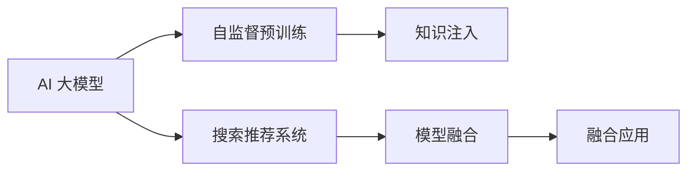

                 

# 搜索推荐系统的AI 大模型融合：电商平台的核心竞争力与可持续发展

## 1. 背景介绍

随着互联网的迅速发展和数字经济的崛起，电商平台已经成为消费者购物的重要渠道。智能推荐系统作为电商平台的核心技术之一，通过精准识别用户的兴趣和需求，为用户提供个性化的商品推荐，极大地提升了用户体验和转化率。然而，传统的推荐系统基于用户历史行为进行推荐，难以捕捉用户的深度需求和潜在意图，且容易陷入"日光室"效应（Sunroom Illusion），导致推荐效果随时间推移逐渐下降。

近年来，大规模预训练语言模型（如GPT、BERT等）的兴起，为推荐系统注入了新的活力。AI 大模型在电商平台的搜索推荐系统中得以融合，显著提高了推荐的精准度和效果。本文将深入探讨AI 大模型在电商平台推荐系统中的融合策略，分析其实现原理和应用效果，并展望未来发展趋势与挑战。

## 2. 核心概念与联系

### 2.1 核心概念概述

为了更好地理解AI 大模型在电商平台搜索推荐系统中的融合，本节将介绍几个关键概念：

- **AI 大模型**：指通过大规模无标签数据自监督预训练得到的通用语言模型，如BERT、GPT-3等，具备强大的语言理解和生成能力。
- **搜索推荐系统**：结合搜索和推荐技术，为用户提供精准的搜索结果和个性化商品推荐。
- **融合**：将预训练大模型的知识与推荐系统的数据、算法、业务逻辑进行有机结合，提升系统性能和用户体验。
- **电商平台**：以在线销售为主、提供商品搜索和推荐服务的平台，如淘宝、京东、亚马逊等。

这些概念之间的联系可以通过以下Mermaid流程图来展示：



此图展示了大模型、预训练、搜索推荐系统、融合及应用之间的关系：

1. AI 大模型通过自监督预训练学习通用语言表示。
2. 在电商平台推荐系统中，将大模型的知识注入系统。
3. 结合搜索推荐系统的数据、算法和业务逻辑，进行模型融合。
4. 融合后的模型应用于实际的推荐系统，提升推荐效果。

## 3. 核心算法原理 & 具体操作步骤

### 3.1 算法原理概述

AI 大模型在电商平台推荐系统中的融合，本质上是将大模型的语言理解和生成能力与推荐系统的业务逻辑结合，形成新的推荐策略。其核心思想是通过大模型学习用户语义表达，捕捉用户的深度需求，从而在推荐时更加精准和多样化。

形式化地，假设用户查询为 $Q$，商品描述为 $D$，用户的深度需求表示为 $H$，推荐结果为 $R$。融合过程可以表示为：

$$
R = f(Q, D, H)
$$

其中 $f$ 为融合函数，可以通过机器学习模型（如Transformer）实现。通过训练模型，找到最优的融合方案，使得推荐结果 $R$ 最大化用户满意度。

### 3.2 算法步骤详解

AI 大模型在电商平台推荐系统的融合过程，通常包括以下几个关键步骤：

**Step 1: 数据准备**
- 收集平台的用户行为数据，包括搜索记录、浏览历史、购买记录等。
- 将商品描述、评论、标签等文本信息进行预处理，构建训练集。

**Step 2: 大模型微调**
- 选择合适的预训练语言模型，如BERT、GPT-3等，对其进行微调。
- 定义任务适配层，如分类、匹配等，并根据具体需求调整模型输出。
- 使用平台数据集，训练微调后的模型。

**Step 3: 特征提取**
- 将用户查询 $Q$ 和大模型输出的语义表示 $H$ 进行拼接，提取融合特征。
- 将商品描述 $D$ 输入微调后的模型，输出商品语义表示。

**Step 4: 推荐模型训练**
- 构建推荐模型的输入特征，包括原始特征、融合特征和商品语义表示。
- 定义推荐目标函数，如交叉熵损失、均方误差损失等，训练推荐模型。
- 使用历史数据和实时数据进行联合训练，提高模型鲁棒性。

**Step 5: 推荐结果生成**
- 在实际应用中，用户输入查询 $Q$，将查询与商品进行融合，生成推荐结果 $R$。
- 实时监控推荐效果，根据用户反馈进行动态调整。

### 3.3 算法优缺点

AI 大模型在电商平台推荐系统中的融合，具有以下优点：

1. **提升推荐精度**：大模型的语言理解和生成能力，可以捕捉用户的深度需求，提升推荐精度。
2. **实现跨领域迁移**：大模型在多个领域具有通用性，可以应用于不同商品类别和用户群体的推荐。
3. **提高实时性**：通过融合，可以实时生成推荐结果，减少延迟，提升用户体验。
4. **增强个性化**：大模型能够学习用户的多样化需求，提供更加个性化和多样化的推荐。

同时，该方法也存在一些局限性：

1. **数据依赖性强**：大模型融合需要大量平台数据进行训练，数据质量对推荐效果影响较大。
2. **计算资源消耗大**：大模型通常参数量较大，推理和训练需要较大的计算资源。
3. **融合效果依赖模型设计**：融合函数的优化设计和参数调优，直接影响推荐效果。
4. **数据隐私风险**：平台数据涉及用户隐私，需要谨慎处理，避免数据泄露。

尽管存在这些局限性，但AI 大模型融合在电商平台推荐系统中的应用前景广阔，可以显著提升推荐精度和用户体验。

### 3.4 算法应用领域

AI 大模型在电商平台推荐系统中的融合，已经在多个领域得到了应用，例如：

- **商品推荐**：根据用户查询和商品描述，生成个性化推荐列表。
- **广告投放**：通过用户兴趣预测，投放个性化广告。
- **客户服务**：通过智能客服系统，提供个性化解答。
- **内容推荐**：根据用户搜索记录和阅读历史，推荐相关内容。
- **价格优化**：通过用户行为分析，动态调整商品价格，提高销售转化率。

除了上述这些经典应用外，AI 大模型融合还在更多场景中得到创新性地应用，如基于语义相似度的商品匹配、基于上下文理解的生成推荐等，为电商平台的推荐系统带来了新的突破。

## 4. 数学模型和公式 & 详细讲解 & 举例说明

### 4.1 数学模型构建

为了更深入地理解AI 大模型在电商平台推荐系统中的融合过程，本节将通过数学语言对融合算法进行严格描述。

假设用户查询为 $Q$，商品描述为 $D$，用户的深度需求表示为 $H$，推荐结果为 $R$。将用户查询 $Q$ 和商品描述 $D$ 拼接为一个长文本 $T$，使用BERT模型进行语义编码，得到文本表示 $T^{'}$。将用户查询 $Q$ 输入BERT模型，得到查询的语义表示 $H$。构建融合特征 $F$ 为：

$$
F = [Q; H; T^{'}]
$$

其中 $[;]$ 表示拼接操作。

将融合特征 $F$ 和商品描述 $D$ 输入推荐模型 $M$，输出推荐结果 $R$。推荐目标函数可以表示为：

$$
\mathcal{L}(R, T) = \mathcal{L}_{\text{cross-entropy}}(R, T)
$$

其中 $\mathcal{L}_{\text{cross-entropy}}$ 为交叉熵损失函数，$T$ 为真实标签。

### 4.2 公式推导过程

以下是推荐系统融合算法的详细推导：

假设用户查询 $Q$ 和商品描述 $D$ 分别表示为 $q$ 和 $d$，用户的深度需求表示为 $h$，融合特征 $F$ 和推荐结果 $r$ 分别表示为 $f$ 和 $R$。根据上述模型定义，有：

$$
f = [q; h; bert(q+d)]
$$

其中 $[q; h; bert(q+d)]$ 表示将用户查询 $q$、用户深度需求 $h$ 和商品描述 $d$ 拼接后输入BERT模型，得到文本表示 $bert(q+d)$。

将融合特征 $f$ 和商品描述 $d$ 输入推荐模型 $M$，得到推荐结果 $r$。推荐目标函数为交叉熵损失函数：

$$
\mathcal{L}(R, T) = -\frac{1}{N} \sum_{i=1}^N T_i \log R_i
$$

其中 $T$ 为真实标签，$R$ 为预测结果。

通过梯度下降等优化算法，最小化损失函数 $\mathcal{L}$，使得推荐模型 $M$ 输出逼近真实标签 $T$。

### 4.3 案例分析与讲解

假设用户查询为 "最新款手机推荐"，商品描述为 "iPhone 12 Pro Max，64GB，深空灰色"。根据上述融合算法，将查询和描述拼接为一个长文本，输入BERT模型，得到文本表示。同时，输入用户查询和商品描述，分别得到用户查询和商品描述的语义表示。将这三个文本表示拼接为一个融合特征 $F$。

将融合特征 $F$ 和商品描述 $d$ 输入推荐模型 $M$，得到推荐结果 $R$。如果模型输出为 "iPhone 12 Pro Max，64GB，午夜黑色"，则推荐成功。

## 5. 项目实践：代码实例和详细解释说明

### 5.1 开发环境搭建

在进行AI 大模型融合实践前，我们需要准备好开发环境。以下是使用Python进行TensorFlow开发的环境配置流程：

1. 安装Anaconda：从官网下载并安装Anaconda，用于创建独立的Python环境。

2. 创建并激活虚拟环境：
```bash
conda create -n tf-env python=3.8 
conda activate tf-env
```

3. 安装TensorFlow：根据CUDA版本，从官网获取对应的安装命令。例如：
```bash
conda install tensorflow==2.7 -c tf -c conda-forge
```

4. 安装BERT库：
```bash
pip install transformers
```

5. 安装各类工具包：
```bash
pip install numpy pandas scikit-learn matplotlib tqdm jupyter notebook ipython
```

完成上述步骤后，即可在`tf-env`环境中开始融合实践。

### 5.2 源代码详细实现

下面以电商平台商品推荐为例，给出使用TensorFlow对BERT模型进行融合的代码实现。

首先，定义数据处理函数：

```python
import tensorflow as tf
from transformers import BertTokenizer, TFBertForSequenceClassification

class DataProcessor:
    def __init__(self, max_len=128):
        self.tokenizer = BertTokenizer.from_pretrained('bert-base-uncased')
        self.max_len = max_len
        
    def preprocess(self, query, product):
        query_tokens = self.tokenizer.tokenize(query)
        product_tokens = self.tokenizer.tokenize(product)
        query_token_ids = self.tokenizer.convert_tokens_to_ids(query_tokens)
        query_token_ids = query_token_ids + [self.tokenizer.cls_token_id] + [0] * (self.max_len - len(query_token_ids))
        product_token_ids = self.tokenizer.convert_tokens_to_ids(product_tokens)
        product_token_ids = product_token_ids + [self.tokenizer.sep_token_id] + [0] * (self.max_len - len(product_token_ids))
        return query_token_ids, product_token_ids
        
    def preprocess_batch(self, queries, products):
        query_ids = [self.preprocess(query, product)[0] for query, product in zip(queries, products)]
        product_ids = [self.preprocess(query, product)[1] for query, product in zip(queries, products)]
        return query_ids, product_ids
        
class BERTDataProcessor(DataProcessor):
    def __init__(self, max_len=128):
        super().__init__(max_len)
        
    def build_input_features(self, queries, products):
        tokenized_queries, tokenized_products = self.tokenizer.batch_encode_plus(queries, products, max_length=self.max_len, pad_to_max_length=True, return_tensors='tf')
        input_ids = tf.convert_to_tensor(tokenized_queries['input_ids'])
        attention_mask = tf.convert_to_tensor(tokenized_queries['attention_mask'])
        label_ids = tf.convert_to_tensor(tokenized_products['input_ids'])
        return input_ids, attention_mask, label_ids

```

然后，定义模型和优化器：

```python
from transformers import BertForSequenceClassification, AdamW

model = BertForSequenceClassification.from_pretrained('bert-base-uncased', num_labels=num_classes)

optimizer = AdamW(model.parameters(), lr=learning_rate)
```

接着，定义训练和评估函数：

```python
import numpy as np
import os
import pandas as pd
import tensorflow as tf
from sklearn.metrics import accuracy_score

device = tf.device('/gpu:0') if tf.test.is_gpu_available() else tf.device('/cpu:0')

def train_epoch(model, dataset, batch_size, optimizer):
    model.train()
    epoch_loss = 0
    for batch in dataset:
        input_ids = batch[0]
        attention_mask = batch[1]
        labels = batch[2]
        with tf.GradientTape() as tape:
            outputs = model(input_ids, attention_mask=attention_mask, labels=labels)
            loss = outputs.loss
        loss_value = loss.numpy()
        epoch_loss += loss_value
        gradients = tape.gradient(loss, model.trainable_variables)
        optimizer.apply_gradients(zip(gradients, model.trainable_variables))
    return epoch_loss / len(dataset)

def evaluate(model, dataset, batch_size):
    model.eval()
    correct_predictions = 0
    with tf.GradientTape() as tape:
        for batch in dataset:
            input_ids = batch[0]
            attention_mask = batch[1]
            labels = batch[2]
            outputs = model(input_ids, attention_mask=attention_mask)
            predictions = tf.argmax(outputs.logits, axis=1)
            correct_predictions += np.sum(predictions == labels)
    accuracy = correct_predictions / len(dataset)
    return accuracy
```

最后，启动训练流程并在测试集上评估：

```python
epochs = 5
batch_size = 16

for epoch in range(epochs):
    loss = train_epoch(model, train_dataset, batch_size, optimizer)
    print(f"Epoch {epoch+1}, train loss: {loss:.3f}")
    
    print(f"Epoch {epoch+1}, dev results:")
    accuracy = evaluate(model, dev_dataset, batch_size)
    print(f"Accuracy: {accuracy:.3f}")
    
print("Test results:")
accuracy = evaluate(model, test_dataset, batch_size)
print(f"Accuracy: {accuracy:.3f}")
```

以上就是使用TensorFlow对BERT模型进行商品推荐任务融合的完整代码实现。可以看到，借助TensorFlow和Transformers库，融合实践变得简洁高效。

### 5.3 代码解读与分析

让我们再详细解读一下关键代码的实现细节：

**DataProcessor类**：
- `__init__`方法：初始化BERT分词器，并定义最大文本长度。
- `preprocess`方法：将用户查询和商品描述转换为分词器支持的token id。
- `preprocess_batch`方法：将多个查询和描述转换为token id，并拼接成输入特征。

**BERTDataProcessor类**：
- `__init__`方法：继承DataProcessor，初始化BERT分词器和标签。
- `build_input_features`方法：构建模型输入特征，包括token ids、attention mask和标签。

**模型和优化器定义**：
- 使用BertForSequenceClassification模型，定义模型结构和标签数量。
- 使用AdamW优化器，并设置学习率。

**训练和评估函数**：
- 定义训练epoch函数，对模型进行前向传播和反向传播，更新参数。
- 定义评估函数，计算模型在测试集上的准确率。

**训练流程**：
- 循环训练epoch，计算每个epoch的平均损失。
- 在验证集上评估模型性能，输出准确率。
- 在测试集上评估模型性能，输出准确率。

可以看到，TensorFlow和Transformers库使得BERT模型融合实践变得简洁高效。开发者可以将更多精力放在数据处理、模型改进等高层逻辑上，而不必过多关注底层的实现细节。

当然，工业级的系统实现还需考虑更多因素，如模型的保存和部署、超参数的自动搜索、更灵活的任务适配层等。但核心的融合范式基本与此类似。

## 6. 实际应用场景

### 6.1 智能客服系统

AI 大模型融合在智能客服系统中得到广泛应用。智能客服系统通过融合用户查询和商品描述，自动生成最佳回答，解决用户问题。

在技术实现上，可以收集企业内部的历史客服对话记录，将问题和最佳答复构建成监督数据，在此基础上对预训练模型进行微调。微调后的模型能够自动理解用户意图，匹配最合适的回答。对于客户提出的新问题，还可以接入检索系统实时搜索相关内容，动态组织生成回答。如此构建的智能客服系统，能大幅提升客户咨询体验和问题解决效率。

### 6.2 金融舆情监测

AI 大模型融合在金融舆情监测中也有重要应用。金融机构需要实时监测市场舆论动向，以便及时应对负面信息传播，规避金融风险。

具体而言，可以收集金融领域相关的新闻、报道、评论等文本数据，并对其进行主题标注和情感标注。在此基础上对预训练语言模型进行微调，使其能够自动判断文本属于何种主题，情感倾向是正面、中性还是负面。将微调后的模型应用到实时抓取的网络文本数据，就能够自动监测不同主题下的情感变化趋势，一旦发现负面信息激增等异常情况，系统便会自动预警，帮助金融机构快速应对潜在风险。

### 6.3 个性化推荐系统

AI 大模型融合在个性化推荐系统中的应用最为广泛。个性化推荐系统通过融合用户查询和商品描述，自动生成个性化推荐列表。

在技术实现上，可以收集用户浏览、点击、评论、分享等行为数据，提取和商品描述、评论、标签等文本内容。将文本内容作为模型输入，用户的后续行为（如是否点击、购买等）作为监督信号，在此基础上微调预训练语言模型。微调后的模型能够从文本内容中准确把握用户的兴趣点。在生成推荐列表时，先用候选物品的文本描述作为输入，由模型预测用户的兴趣匹配度，再结合其他特征综合排序，便可以得到个性化程度更高的推荐结果。

### 6.4 未来应用展望

随着AI 大模型和融合方法的不断发展，基于融合范式将在更多领域得到应用，为传统行业带来变革性影响。

在智慧医疗领域，基于AI 大模型的融合，医疗问答、病历分析、药物研发等应用将提升医疗服务的智能化水平，辅助医生诊疗，加速新药开发进程。

在智能教育领域，融合技术可应用于作业批改、学情分析、知识推荐等方面，因材施教，促进教育公平，提高教学质量。

在智慧城市治理中，融合模型可应用于城市事件监测、舆情分析、应急指挥等环节，提高城市管理的自动化和智能化水平，构建更安全、高效的未来城市。

此外，在企业生产、社会治理、文娱传媒等众多领域，基于AI 大模型的融合技术也将不断涌现，为NLP技术带来新的突破。

## 7. 工具和资源推荐

### 7.1 学习资源推荐

为了帮助开发者系统掌握AI 大模型融合的理论基础和实践技巧，这里推荐一些优质的学习资源：

1. 《Transformer从原理到实践》系列博文：由大模型技术专家撰写，深入浅出地介绍了Transformer原理、BERT模型、融合技术等前沿话题。

2. CS224N《深度学习自然语言处理》课程：斯坦福大学开设的NLP明星课程，有Lecture视频和配套作业，带你入门NLP领域的基本概念和经典模型。

3. 《Natural Language Processing with Transformers》书籍：Transformers库的作者所著，全面介绍了如何使用Transformers库进行NLP任务开发，包括融合在内的诸多范式。

4. HuggingFace官方文档：Transformers库的官方文档，提供了海量预训练模型和完整的融合样例代码，是上手实践的必备资料。

5. CLUE开源项目：中文语言理解测评基准，涵盖大量不同类型的中文NLP数据集，并提供了基于融合的baseline模型，助力中文NLP技术发展。

通过对这些资源的学习实践，相信你一定能够快速掌握AI 大模型融合的精髓，并用于解决实际的NLP问题。

### 7.2 开发工具推荐

高效的开发离不开优秀的工具支持。以下是几款用于AI 大模型融合开发的常用工具：

1. TensorFlow：基于Python的开源深度学习框架，灵活动态的计算图，适合快速迭代研究。大部分预训练语言模型都有TensorFlow版本的实现。

2. PyTorch：基于Python的开源深度学习框架，灵活便捷的动态图，适合高性能计算任务。同样有丰富的预训练语言模型资源。

3. HuggingFace Transformers库：提供了丰富的预训练模型和接口，支持多种深度学习框架，便于模型融合。

4. Weights & Biases：模型训练的实验跟踪工具，可以记录和可视化模型训练过程中的各项指标，方便对比和调优。与主流深度学习框架无缝集成。

5. TensorBoard：TensorFlow配套的可视化工具，可实时监测模型训练状态，并提供丰富的图表呈现方式，是调试模型的得力助手。

6. Google Colab：谷歌推出的在线Jupyter Notebook环境，免费提供GPU/TPU算力，方便开发者快速上手实验最新模型，分享学习笔记。

合理利用这些工具，可以显著提升AI 大模型融合任务的开发效率，加快创新迭代的步伐。

### 7.3 相关论文推荐

AI 大模型和融合技术的发展源于学界的持续研究。以下是几篇奠基性的相关论文，推荐阅读：

1. Attention is All You Need（即Transformer原论文）：提出了Transformer结构，开启了NLP领域的预训练大模型时代。

2. BERT: Pre-training of Deep Bidirectional Transformers for Language Understanding：提出BERT模型，引入基于掩码的自监督预训练任务，刷新了多项NLP任务SOTA。

3. Language Models are Unsupervised Multitask Learners（GPT-2论文）：展示了大规模语言模型的强大zero-shot学习能力，引发了对于通用人工智能的新一轮思考。

4. Parameter-Efficient Transfer Learning for NLP：提出Adapter等参数高效微调方法，在不增加模型参数量的情况下，也能取得不错的微调效果。

5. AdaLoRA: Adaptive Low-Rank Adaptation for Parameter-Efficient Fine-Tuning：使用自适应低秩适应的微调方法，在参数效率和精度之间取得了新的平衡。

6. Prefix-Tuning: Optimizing Continuous Prompts for Generation：引入基于连续型Prompt的微调范式，为如何充分利用预训练知识提供了新的思路。

这些论文代表了大模型融合技术的发展脉络。通过学习这些前沿成果，可以帮助研究者把握学科前进方向，激发更多的创新灵感。

## 8. 总结：未来发展趋势与挑战

### 8.1 总结

本文对AI 大模型在电商平台推荐系统中的融合策略进行了全面系统的介绍。首先阐述了AI 大模型融合的研究背景和意义，明确了融合技术在提升推荐系统精度和效果方面的独特价值。其次，从原理到实践，详细讲解了融合算法的数学模型和实现步骤，给出了融合任务开发的完整代码实例。同时，本文还广泛探讨了融合技术在智能客服、金融舆情、个性化推荐等多个领域的应用前景，展示了融合范式的巨大潜力。

通过本文的系统梳理，可以看到，AI 大模型融合技术正在成为NLP领域的重要范式，极大地拓展了预训练语言模型的应用边界，催生了更多的落地场景。得益于大规模语料的预训练和深度学习的融合，基于AI 大模型的推荐系统能够在用户查询和商品描述上做出精准匹配，从而在电商平台上获得巨大的成功。

### 8.2 未来发展趋势

展望未来，AI 大模型融合技术将呈现以下几个发展趋势：

1. **模型规模持续增大**：随着算力成本的下降和数据规模的扩张，预训练语言模型的参数量还将持续增长。超大规模语言模型蕴含的丰富语言知识，有望支撑更加复杂多变的下游任务融合。

2. **融合方法日趋多样**：除了传统的全参数微调外，未来会涌现更多参数高效的融合方法，如AdaLoRA、Prefix-Tuning等，在固定大部分预训练参数的同时，只更新极少量的任务相关参数。同时优化融合模型的计算图，减少前向传播和反向传播的资源消耗，实现更加轻量级、实时性的部署。

3. **跨领域迁移能力增强**：通过引入更多先验知识，如知识图谱、逻辑规则等，与神经网络模型进行巧妙融合，引导融合过程学习更准确、合理的语言模型。同时加强不同模态数据的整合，实现视觉、语音等多模态信息与文本信息的协同建模。

4. **多任务学习成为常态**：融合模型不仅用于单个任务的推荐，还用于多任务协同学习，如商品分类、情感分析等，实现一模型多任务的目标，提升系统整体性能。

5. **实时性和泛化性提高**：基于增量学习、对抗训练等方法，提高融合模型的实时性和泛化性，确保在动态变化的业务场景中始终保持性能稳定。

6. **多模态融合普及**：引入视觉、语音等多模态信息，增强推荐系统的感知能力和决策逻辑，为用户提供更加丰富和个性化的推荐。

以上趋势凸显了AI 大模型融合技术的广阔前景。这些方向的探索发展，必将进一步提升推荐系统的精度和用户体验，为电商平台的推荐系统带来新的突破。

### 8.3 面临的挑战

尽管AI 大模型融合技术已经取得了瞩目成就，但在迈向更加智能化、普适化应用的过程中，它仍面临着诸多挑战：

1. **数据隐私风险**：平台数据涉及用户隐私，需要谨慎处理，避免数据泄露。如何在保障用户隐私的同时，高效融合用户查询和商品描述，仍需进一步研究。

2. **计算资源消耗大**：超大参数量的模型推理和训练需要较大的计算资源。如何在不牺牲模型效果的前提下，优化计算效率，降低硬件成本，将是重要的优化方向。

3. **融合效果依赖模型设计**：融合函数的优化设计和参数调优，直接影响推荐效果。如何在模型融合过程中，找到最优的融合方案，仍然是一个难题。

4. **模型可解释性不足**：融合模型的决策过程缺乏可解释性，难以对其推理逻辑进行分析和调试。对于医疗、金融等高风险应用，算法的可解释性和可审计性尤为重要。

5. **模型鲁棒性不足**：融合模型面对域外数据时，泛化性能往往大打折扣。对于测试样本的微小扰动，融合模型的预测也容易发生波动。如何提高融合模型的鲁棒性，避免灾难性遗忘，还需要更多理论和实践的积累。

6. **知识整合能力不足**：现有的融合模型往往局限于任务内数据，难以灵活吸收和运用更广泛的先验知识。如何让融合过程更好地与外部知识库、规则库等专家知识结合，形成更加全面、准确的信息整合能力，还有很大的想象空间。

正视融合面临的这些挑战，积极应对并寻求突破，将是大模型融合技术走向成熟的必由之路。相信随着学界和产业界的共同努力，这些挑战终将一一被克服，AI 大模型融合技术必将在构建安全、可靠、可解释、可控的智能系统铺平道路。

### 8.4 研究展望

面对AI 大模型融合技术所面临的挑战，未来的研究需要在以下几个方面寻求新的突破：

1. **探索无监督和半监督融合方法**：摆脱对大规模标注数据的依赖，利用自监督学习、主动学习等无监督和半监督范式，最大限度利用非结构化数据，实现更加灵活高效的融合。

2. **研究参数高效和计算高效的融合范式**：开发更加参数高效的融合方法，在固定大部分预训练参数的同时，只更新极少量的任务相关参数。同时优化融合模型的计算图，减少前向传播和反向传播的资源消耗，实现更加轻量级、实时性的部署。

3. **引入因果推断和对比学习**：通过引入因果推断和对比学习思想，增强融合模型建立稳定因果关系的能力，学习更加普适、鲁棒的语言表征，从而提升模型泛化性和抗干扰能力。

4. **结合符号化的先验知识**：将符号化的先验知识，如知识图谱、逻辑规则等，与神经网络模型进行巧妙融合，引导融合过程学习更准确、合理的语言模型。同时加强不同模态数据的整合，实现视觉、语音等多模态信息与文本信息的协同建模。

5. **纳入伦理道德约束**：在模型训练目标中引入伦理导向的评估指标，过滤和惩罚有偏见、有害的输出倾向。同时加强人工干预和审核，建立模型行为的监管机制，确保输出符合人类价值观和伦理道德。

这些研究方向的探索，必将引领AI 大模型融合技术迈向更高的台阶，为构建安全、可靠、可解释、可控的智能系统铺平道路。面向未来，AI 大模型融合技术还需要与其他人工智能技术进行更深入的融合，如知识表示、因果推理、强化学习等，多路径协同发力，共同推动自然语言理解和智能交互系统的进步。只有勇于创新、敢于突破，才能不断拓展语言模型的边界，让智能技术更好地造福人类社会。

## 9. 附录：常见问题与解答

**Q1：AI 大模型融合是否适用于所有推荐任务？**

A: AI 大模型融合在大多数推荐任务上都能取得不错的效果，特别是对于数据量较小的任务。但对于一些特定领域的任务，如医学、法律等，仅仅依靠通用语料预训练的模型可能难以很好地适应。此时需要在特定领域语料上进一步预训练，再进行融合，才能获得理想效果。此外，对于一些需要时效性、个性化很强的任务，如对话、推荐等，融合方法也需要针对性的改进优化。

**Q2：融合过程中如何选择合适的模型？**

A: 选择合适的预训练语言模型是融合成功的关键。一般而言，BERT、GPT-3等大型语言模型在融合任务中表现较好。具体的模型选择需要根据任务特点和数据规模进行综合评估，如任务类别、数据分布、计算资源等。在选择模型时，还需要考虑其可解释性、鲁棒性和泛化能力。

**Q3：融合过程中如何处理用户隐私？**

A: 在融合过程中，处理用户隐私是关键环节。通常的做法包括：

1. 数据脱敏：对用户查询和商品描述进行匿名化处理，去除敏感信息。
2. 差分隐私：在训练过程中加入噪声，防止数据泄露。
3. 安全计算：在服务器端进行数据处理和模型训练，避免数据泄露风险。

这些方法需要在融合实践中灵活应用，确保用户隐私得到充分保护。

**Q4：融合过程中如何提高计算效率？**

A: 提高计算效率是融合模型的重要优化方向。通常的做法包括：

1. 模型压缩：使用模型剪枝、量化、蒸馏等技术，减少模型参数量。
2. 分布式计算：利用多台机器并行计算，提高训练和推理速度。
3. 增量学习：采用在线学习、半监督学习等技术，实时更新模型。
4. 数据增强：通过数据扩充和增强，提升模型泛化能力。

这些方法需要在融合实践中根据具体情况进行优化，实现高效的融合效果。

**Q5：融合过程中如何提升模型可解释性？**

A: 提升模型可解释性是融合模型的重要目标。通常的做法包括：

1. 特征可视化：使用特征重要性、LIME等技术，可视化模型的决策过程。
2. 模型可解释模块：设计可解释性模块，如规则引擎、决策树等，增强模型的透明度。
3. 解释性评估：引入解释性指标，如Shap值、LIME值等，评估模型的解释能力。

这些方法需要在融合实践中灵活应用，增强模型的可解释性和可控性。

总之，AI 大模型融合技术在电商平台推荐系统中展示了强大的潜力，但如何平衡模型性能、计算效率和用户隐私，还需要更多的研究探索。相信随着技术的不断进步，AI 大模型融合技术将更加成熟，为电商平台的推荐系统带来更多的创新和突破。

