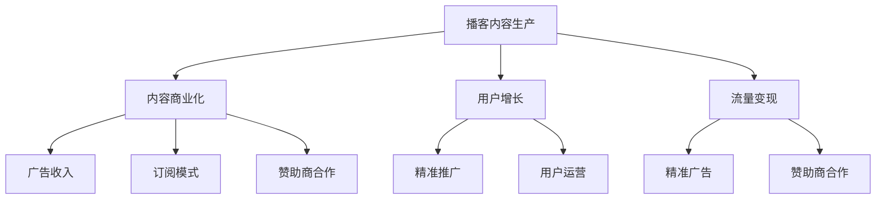

                 

# 播客创业：音频内容的商业化探索

> 关键词：播客，音频内容，商业化，流量变现，广告收入，订阅模式，用户增长，内容策略，分析工具，未来趋势

## 1. 背景介绍

播客作为新兴的音频内容形式，在过去几年中迅速崛起，成为许多人获取知识和娱乐的重要渠道。随着智能手机的普及和移动互联网的快速发展，人们越来越倾向于通过碎片化时间获取信息，播客因其便捷性、可存取性等特点，迅速占领了市场。据统计，全球播客听众已达数亿，日均收听时长超过10分钟。随着播客市场的不断扩大，越来越多的创业者开始涉足其中，希望通过商业化探索，打造属于自己的播客王国。本文将详细探讨播客创业中的关键问题，包括音频内容的商业化探索。

## 2. 核心概念与联系

### 2.1 核心概念概述

播客创业涉及多个核心概念，包括播客内容生产、内容商业化、用户增长、流量变现等。这些概念之间相互关联，形成一个完整的生态系统。

1. **播客内容生产**：播客创业的起点是高质量的内容生产。播客内容通常包括访谈、专题报道、教育讲座、播客剧集等。高质量的内容是吸引用户和提高播客影响力的关键。

2. **内容商业化**：播客创业的最终目的是将内容转化为收入。内容商业化主要包括广告收入、订阅模式、赞助商合作等方式。

3. **用户增长**：播客创业中，用户增长是核心指标之一。通过有效的推广策略和用户运营，可以不断吸引新用户，提高播客的知名度和影响力。

4. **流量变现**：播客创业中，流量变现是收入的重要组成部分。通过精准的广告投放、赞助商合作等方式，将播客流量转化为实际收入。

### 2.2 核心概念原理和架构的 Mermaid 流程图



这个流程图展示了播客创业中各个核心概念之间的关系。内容生产是基础，商业化是目标，用户增长是手段，流量变现是收入来源。这些概念相互作用，共同推动播客创业的成功。

## 3. 核心算法原理 & 具体操作步骤

### 3.1 算法原理概述

播客创业中的算法原理主要包括内容推荐算法、用户增长算法和流量变现算法。

1. **内容推荐算法**：通过分析用户的收听行为，推荐与用户兴趣相符的内容。推荐算法通常基于协同过滤、内容相似度、用户画像等技术实现。

2. **用户增长算法**：通过分析用户行为数据，制定精准的推广策略和用户运营计划。用户增长算法通常基于用户行为分析、漏斗模型等技术实现。

3. **流量变现算法**：通过分析流量数据，制定精准的广告投放策略和赞助商合作计划。流量变现算法通常基于广告转化率、广告ROI等技术实现。

### 3.2 算法步骤详解

1. **内容推荐算法**：
   - 数据收集：收集用户收听行为数据，包括收听时长、收听频率、收听时间等。
   - 用户画像构建：基于用户收听行为数据，构建用户画像，包括用户兴趣、偏好、行为特征等。
   - 内容相似度计算：计算每段内容之间的相似度，推荐与用户画像匹配的内容。
   - 协同过滤：基于用户的历史收听记录，推荐用户可能感兴趣的内容。

2. **用户增长算法**：
   - 数据收集：收集用户注册、登录、收听、订阅等行为数据。
   - 用户行为分析：基于用户行为数据，识别用户流失原因，制定用户运营策略。
   - 漏斗模型构建：构建用户行为漏斗模型，分析每个环节的用户流失率，制定优化措施。
   - A/B测试：通过A/B测试，优化推广策略和用户运营计划，提高用户增长效果。

3. **流量变现算法**：
   - 数据收集：收集广告投放数据，包括广告曝光量、点击率、转化率等。
   - 广告转化率计算：计算广告投放的转化率，评估广告效果。
   - 广告ROI计算：计算广告投放的ROI，评估广告收入。
   - 广告投放策略优化：基于广告转化率和ROI数据，优化广告投放策略，提高广告效果。

### 3.3 算法优缺点

1. **内容推荐算法**：
   - 优点：能够提高用户粘性，增加用户收听时长，提升播客的影响力。
   - 缺点：算法复杂度高，需要大量数据支持，推荐效果依赖于数据质量和模型优化。

2. **用户增长算法**：
   - 优点：能够精准定位用户流失原因，制定有效的用户运营策略，提高用户留存率。
   - 缺点：需要持续的数据收集和分析，成本较高，用户流失原因复杂，难以精准预测。

3. **流量变现算法**：
   - 优点：能够精准计算广告效果，优化广告投放策略，提高广告收入。
   - 缺点：广告效果受市场环境、用户行为变化等因素影响，难以完全控制。

### 3.4 算法应用领域

播客创业中的算法主要应用于以下领域：

1. **内容推荐**：社交媒体、视频网站、音乐平台等。
2. **用户增长**：电子商务、金融服务、旅游服务等。
3. **流量变现**：在线广告、社交媒体、视频平台等。

## 4. 数学模型和公式 & 详细讲解 & 举例说明

### 4.1 数学模型构建

播客创业中的算法模型通常基于数据驱动的机器学习模型。以下是一个简单示例，展示了如何构建内容推荐算法模型。

假设有一个包含用户和内容的数据集，用户为$U=\{u_1, u_2, ..., u_N\}$，内容为$C=\{c_1, c_2, ..., c_M\}$。用户对内容的评分数据为$R_{ij}$，其中$i$表示用户，$j$表示内容。

推荐算法模型的目标是最小化预测误差，即最小化$\sum_{ij} (R_{ij} - \hat{R}_{ij})^2$。其中$\hat{R}_{ij}$为模型的预测评分。

### 4.2 公式推导过程

推荐算法模型通常使用协同过滤算法，其基本思想是通过计算用户之间的相似度，找到与目标用户兴趣相似的用户，从而推荐其感兴趣的内容。

设用户$i$和用户$j$之间的相似度为$S_{ij}$，则协同过滤算法的预测评分$\hat{R}_{ij}$可以表示为：

$$
\hat{R}_{ij} = \alpha_i c_j + \beta_j c_i + \gamma S_{ij}
$$

其中$\alpha_i$、$\beta_j$、$\gamma$为模型参数，$c_i$为内容$i$的评分。

### 4.3 案例分析与讲解

以Spotify的推荐算法为例，Spotify使用协同过滤算法和用户画像模型，结合用户收听历史和内容相似度，为每位用户推荐个性化的音乐和播客。

Spotify的推荐算法首先构建用户画像模型，通过分析用户的收听历史和行为数据，识别用户的兴趣和偏好。然后，使用协同过滤算法，计算用户之间的相似度，找到与目标用户兴趣相似的用户，从而推荐其感兴趣的内容。

Spotify通过A/B测试不断优化算法，提高推荐效果。此外，Spotify还使用用户画像模型和广告推荐算法，精准定位用户，提高广告投放效果。

## 5. 项目实践：代码实例和详细解释说明

### 5.1 开发环境搭建

播客创业中，开发环境搭建通常需要以下工具和软件：

1. **编程语言**：Python、JavaScript、Java等。
2. **数据处理工具**：Apache Hadoop、Apache Spark等。
3. **机器学习库**：TensorFlow、PyTorch、scikit-learn等。
4. **数据分析工具**：Excel、Tableau、Power BI等。

### 5.2 源代码详细实现

以下是一个简单的播客内容推荐系统的代码实现示例：

```python
import pandas as pd
import numpy as np
from sklearn.metrics.pairwise import cosine_similarity

# 数据加载
data = pd.read_csv('data.csv')

# 构建用户画像模型
user_profiles = {}
for i in range(len(data)):
    user_id = data.iloc[i]['user_id']
    user_profile = {}
    for j in range(len(data)):
        if i != j and data.iloc[j]['user_id'] == user_id:
            content_id = data.iloc[j]['content_id']
            user_profile[content_id] = data.iloc[j]['rating']
    user_profiles[user_id] = user_profile

# 构建内容相似度矩阵
content_similarity = {}
for i in range(len(data)):
    content_id = data.iloc[i]['content_id']
    similarities = []
    for j in range(len(data)):
        if i != j:
            similarities.append(cosine_similarity([data.iloc[i]['vector'], data.iloc[j]['vector']])[0][1])
    content_similarity[content_id] = similarities

# 推荐内容
def recommend_content(user_id):
    user_profile = user_profiles[user_id]
    user_vector = np.mean(list(user_profile.values()), axis=0)
    recommendations = {}
    for content_id in content_similarity.keys():
        similarity = content_similarity[content_id]
        recommendations[content_id] = similarity
    recommendations = dict(sorted(recommendations.items(), key=lambda x: x[1], reverse=True))
    return list(recommendations.keys())[:5]

# 测试推荐结果
user_id = 1
recommendations = recommend_content(user_id)
print('推荐内容：', recommendations)
```

### 5.3 代码解读与分析

上述代码实现了一个简单的基于协同过滤的播客内容推荐系统。具体步骤如下：

1. **数据加载**：从CSV文件中加载用户和内容的评分数据，构建用户画像模型和内容相似度矩阵。
2. **用户画像模型**：通过计算用户对内容的评分均值，构建用户画像向量。
3. **内容相似度矩阵**：计算内容之间的相似度，构建内容相似度矩阵。
4. **推荐内容**：根据用户画像向量和内容相似度矩阵，推荐用户可能感兴趣的内容。
5. **测试推荐结果**：展示推荐内容，进行用户测试。

## 6. 实际应用场景

播客创业中的实际应用场景包括：

1. **内容推荐**：播客平台，如Spotify、Apple Podcasts等。
2. **用户增长**：社交媒体、电子商务平台等。
3. **流量变现**：广告投放、赞助商合作等。

### 6.4 未来应用展望

播客创业的未来应用展望包括：

1. **智能推荐**：通过AI技术，实现更精准的内容推荐，提升用户体验。
2. **个性化内容**：基于用户画像，生成个性化内容，提高用户粘性。
3. **用户社区**：构建用户社区，增强用户互动和粘性。
4. **跨平台合作**：与社交媒体、视频平台等合作，扩大播客影响力。

## 7. 工具和资源推荐

### 7.1 学习资源推荐

播客创业涉及多个领域，需要综合学习。以下是一些推荐的学习资源：

1. **播客制作**：《播客制作完全手册》（Podcasting: The Craft of Audio），详细介绍了播客制作技巧。
2. **数据分析**：《数据分析实战》（Data Science for Business），介绍数据分析方法和工具。
3. **机器学习**：《机器学习实战》（Hands-On Machine Learning with Scikit-Learn and TensorFlow），介绍了机器学习模型的实现和优化方法。
4. **用户体验设计**：《UX Design：A Beginner's Guide》，介绍了用户体验设计的基本原则和方法。
5. **商业策略**：《创业成功之路》（How to Start a Startup），介绍了创业企业的战略和运营方法。

### 7.2 开发工具推荐

播客创业中常用的开发工具包括：

1. **音频编辑**：Audacity、Adobe Audition等。
2. **数据分析**：Jupyter Notebook、Python等。
3. **机器学习**：TensorFlow、PyTorch等。
4. **用户管理**：UserSQL、MySQL等。

### 7.3 相关论文推荐

播客创业涉及多个学科，以下是一些推荐的相关论文：

1. **播客推荐算法**：《基于协同过滤的播客推荐系统研究》（A Study on Recommendation System for Podcasts Based on Collaborative Filtering）。
2. **用户增长模型**：《基于用户行为分析的用户增长模型》（User Growth Model Based on User Behavior Analysis）。
3. **流量变现算法**：《基于广告投放的播客流量变现算法》（Podcast Traffic Monetization Algorithm Based on Advertising）。

## 8. 总结：未来发展趋势与挑战

### 8.1 研究成果总结

播客创业中，核心问题是内容推荐、用户增长和流量变现。内容推荐算法通过协同过滤和用户画像模型，实现了个性化推荐；用户增长算法通过用户行为分析和漏斗模型，提高了用户留存率；流量变现算法通过广告转化率和ROI计算，优化了广告投放策略。

### 8.2 未来发展趋势

播客创业的未来发展趋势包括：

1. **人工智能应用**：通过AI技术，实现更精准的内容推荐和用户增长。
2. **跨平台合作**：与社交媒体、视频平台等合作，扩大播客影响力。
3. **个性化内容**：基于用户画像，生成个性化内容，提高用户粘性。
4. **用户社区**：构建用户社区，增强用户互动和粘性。

### 8.3 面临的挑战

播客创业中，面临的挑战包括：

1. **数据质量**：数据质量是内容推荐和用户增长算法的基础，需要持续维护和优化。
2. **用户留存率**：用户留存率是播客创业的关键指标，需要制定有效的用户运营策略。
3. **广告效果**：广告效果受市场环境、用户行为变化等因素影响，需要不断优化广告投放策略。
4. **平台竞争**：播客平台竞争激烈，需要不断创新，保持竞争力。

### 8.4 研究展望

播客创业的研究展望包括：

1. **深度学习应用**：通过深度学习模型，提高内容推荐和用户增长算法的精度。
2. **用户画像优化**：通过用户画像优化，提升推荐效果和用户留存率。
3. **广告效果优化**：通过广告效果优化，提高广告收入和转化率。
4. **平台创新**：通过平台创新，提升用户体验和市场竞争力。

## 9. 附录：常见问题与解答

**Q1：播客创业中，如何构建用户画像模型？**

A: 构建用户画像模型需要收集用户的基本信息和行为数据，包括收听时间、收听频率、收听内容等。然后，通过数据分析和机器学习算法，构建用户画像向量，识别用户的兴趣和偏好。

**Q2：播客创业中，如何优化内容推荐算法？**

A: 优化内容推荐算法需要持续收集用户反馈数据，通过A/B测试，不断调整算法参数和推荐策略。同时，可以引入用户画像和内容相似度计算，提高推荐效果。

**Q3：播客创业中，如何提高用户留存率？**

A: 提高用户留存率需要制定有效的用户运营策略，包括精准推广、用户互动、内容更新等。同时，需要持续收集用户反馈，优化用户体验。

**Q4：播客创业中，如何优化广告投放策略？**

A: 优化广告投放策略需要持续收集广告效果数据，通过广告转化率和ROI计算，调整广告投放策略和预算。同时，需要精准定位用户，提高广告效果。

**Q5：播客创业中，如何构建用户社区？**

A: 构建用户社区需要提供互动平台，鼓励用户留言、评论、分享等。同时，需要定期举办活动，增强用户互动和粘性。

---
作者：禅与计算机程序设计艺术 / Zen and the Art of Computer Programming

