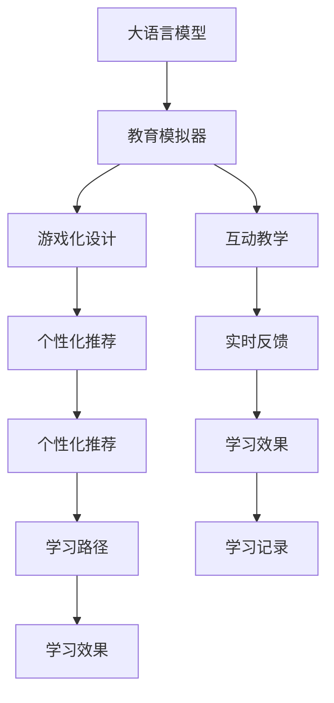

                 

# 教育模拟器：LLM 增强的沉浸式学习

## 1. 背景介绍

### 1.1 问题由来
教育领域的数字化转型是当今社会发展的必然趋势。传统的教育模式在个性化教学、因材施教等方面存在诸多不足，难以满足新时期教育需求的个性化和差异化。与此同时，人工智能技术的发展为解决这一问题提供了新的方向和机遇。

语言模型作为人工智能的重要分支，在教育领域的应用引起了广泛的关注。近年来，大语言模型（LLMs）如GPT-3、BERT等在自然语言处理（NLP）领域取得了突破性进展，其强大的语言理解和生成能力为教育模拟器的开发提供了新的思路。通过大语言模型的辅助，教育模拟器可以实现更加沉浸式、个性化的学习体验，使教育资源更加普惠、有效。

### 1.2 问题核心关键点
教育模拟器利用大语言模型，结合游戏化设计、互动教学等手段，为用户提供个性化、沉浸式的学习体验。其主要核心点包括：

- **大语言模型应用**：利用大语言模型的语言理解和生成能力，实现自然语言交互，增强学习体验。
- **游戏化设计**：将学习内容融入游戏元素，通过角色扮演、任务挑战等方式，增加学习的趣味性和吸引力。
- **互动教学**：利用人工智能技术实现实时反馈、个性化推荐等互动功能，提升学习效果。

这些关键点共同构成了教育模拟器的基本框架，使其能够在教育场景中发挥独特的作用。

### 1.3 问题研究意义
教育模拟器的开发具有重要意义，体现在以下几个方面：

- **个性化教学**：通过大语言模型的深度学习，教育模拟器能够根据用户的学习情况和需求，提供个性化的学习内容和方法，提高学习效率和效果。
- **沉浸式体验**：利用游戏化设计和互动教学，使学习过程更加生动有趣，激发学生的学习兴趣和主动性。
- **普惠教育**：教育模拟器可以通过互联网提供远程教育服务，使优质教育资源更加普及，缩小教育资源分配不均的差距。
- **创新教学模式**：教育模拟器结合人工智能和大数据技术，探索新的教学模式和评估方法，推动教育改革和创新。

## 2. 核心概念与联系

### 2.1 核心概念概述

为更好地理解基于大语言模型的教育模拟器，本节将介绍几个密切相关的核心概念：

- **大语言模型（LLMs）**：以自回归（如GPT）或自编码（如BERT）模型为代表的大规模预训练语言模型。通过在大规模无标签文本语料上进行预训练，学习通用的语言表示，具备强大的语言理解和生成能力。
- **教育模拟器**：结合人工智能技术和大数据应用，为学习者提供沉浸式、个性化学习体验的教育平台。
- **游戏化设计**：通过角色扮演、任务挑战等游戏元素，增强学习的趣味性和互动性。
- **互动教学**：利用人工智能技术，实现实时反馈、个性化推荐等互动功能，提升学习效果。
- **个性化推荐系统**：通过学习分析用户的学习行为和偏好，提供个性化的学习路径和资源推荐。

这些核心概念之间的逻辑关系可以通过以下Mermaid流程图来展示：



这个流程图展示了大语言模型在教育模拟器中的核心作用及其与其他功能的联系：

1. 大语言模型通过预训练获得基础能力。
2. 教育模拟器利用大语言模型的语言理解和生成能力，实现自然语言交互，增强学习体验。
3. 游戏化设计和互动教学增强学习的趣味性和互动性。
4. 个性化推荐系统提供个性化的学习路径和资源推荐。
5. 实时反馈和学习效果评估指导学习路径调整和资源优化。

## 3. 核心算法原理 & 具体操作步骤
### 3.1 算法原理概述

基于大语言模型的教育模拟器，本质上是一种利用人工智能技术进行个性化教学的系统。其核心思想是：通过大语言模型对用户的自然语言输入进行理解，根据用户的学习需求和进度，提供个性化的学习内容和方法。

形式化地，假设教育模拟器为一个函数 $F_{LLM}(x,\theta)$，其中 $x$ 为用户的学习行为数据，包括历史学习记录、兴趣偏好等；$\theta$ 为教育模拟器的参数，包括课程内容、互动设计、推荐算法等。教育模拟器的目标是最大化用户的学习效果，即：

$$
\maximize \mathcal{E}(F_{LLM}(x,\theta))
$$

其中 $\mathcal{E}$ 为用户的学习效果评估指标，可以是考试成绩、学习时间、满意度等。

教育模拟器的优化过程，可以分为以下几个关键步骤：

1. **数据收集与预处理**：收集用户的学习行为数据，进行清洗和标注，生成训练集和验证集。
2. **模型初始化**：选择合适的大语言模型作为教育模拟器的基础模块，初始化模型参数。
3. **个性化学习路径规划**：利用用户的学习行为数据，设计个性化的学习路径，包括课程选择、学习时长等。
4. **互动教学与实时反馈**：利用大语言模型进行自然语言交互，根据用户的学习情况，实时调整教学内容和方法，提供反馈和激励。
5. **评估与优化**：根据用户的学习效果，动态调整课程内容和互动设计，优化教育模拟器的性能。

### 3.2 算法步骤详解

基于大语言模型的教育模拟器开发，通常包括以下几个关键步骤：

**Step 1: 数据收集与预处理**
- 收集用户的学习行为数据，如学习时间、完成度、成绩等。
- 对数据进行清洗和标注，生成训练集和验证集。
- 对文本数据进行分词、标记化等预处理，转化为模型可以处理的格式。

**Step 2: 模型初始化**
- 选择合适的预训练语言模型，如GPT-3、BERT等，作为教育模拟器的基础模块。
- 在模型顶部添加适合教育场景的任务适配层，如情感分析、命名实体识别等。
- 使用迁移学习技术，将预训练模型适应到教育模拟器的特定任务。

**Step 3: 个性化学习路径规划**
- 分析用户的学习行为数据，提取学习特征和偏好。
- 利用聚类、协同过滤等算法，生成个性化的学习路径，推荐适合用户的学习内容和资源。
- 根据用户的学习进度和效果，动态调整学习路径和资源推荐。

**Step 4: 互动教学与实时反馈**
- 利用大语言模型实现自然语言交互，设计互动教学场景，如角色扮演、任务挑战等。
- 根据用户的学习情况，实时调整教学内容和互动设计，提供反馈和激励。
- 使用强化学习等技术，优化教学互动策略，提升用户的学习效果。

**Step 5: 评估与优化**
- 根据用户的学习效果，评估教育模拟器的性能，生成学习效果报告。
- 分析学习效果报告，识别改进点，动态调整课程内容和互动设计。
- 周期性收集用户反馈，优化教育模拟器的用户体验和性能。

### 3.3 算法优缺点

基于大语言模型的教育模拟器具有以下优点：

1. **个性化教学**：利用大语言模型的深度学习，教育模拟器能够根据用户的学习情况和需求，提供个性化的学习内容和方法，提高学习效率和效果。
2. **沉浸式体验**：利用游戏化设计和互动教学，使学习过程更加生动有趣，激发学生的学习兴趣和主动性。
3. **普惠教育**：教育模拟器可以通过互联网提供远程教育服务，使优质教育资源更加普及，缩小教育资源分配不均的差距。
4. **创新教学模式**：教育模拟器结合人工智能和大数据技术，探索新的教学模式和评估方法，推动教育改革和创新。

同时，该方法也存在一定的局限性：

1. **数据依赖**：教育模拟器的性能很大程度上取决于用户学习行为数据的丰富性和准确性，数据收集和预处理成本较高。
2. **模型复杂度**：大语言模型通常参数量较大，训练和推理资源消耗较大，对硬件要求较高。
3. **用户隐私**：教育模拟器的用户学习行为数据涉及个人隐私，需特别注意数据保护和隐私管理。
4. **教学质量**：教育模拟器的教学效果受教师和课程质量影响较大，需不断优化课程内容和互动设计。

尽管存在这些局限性，但就目前而言，基于大语言模型的教育模拟器仍是大数据、人工智能在教育领域应用的重要范式。未来相关研究的重点在于如何进一步降低数据收集成本，提高模型的通用性和实时性，同时兼顾用户隐私和教学质量。

### 3.4 算法应用领域

基于大语言模型的教育模拟器已经在多个领域得到了广泛的应用，如基础教育、高等教育、职业培训等。以下是几个典型应用场景：

**基础教育**：结合K12教育数据，设计个性化的学习路径和互动教学场景，提升学生的学习兴趣和效果。

**高等教育**：利用大学生的学习行为数据，推荐适合的课程和资源，提供个性化的学术指导和支持。

**职业培训**：结合职业技能培训数据，设计针对不同行业的互动教学和实时反馈，提升培训效果和就业竞争力。

**继续教育**：利用成人学习者的学习行为数据，推荐适合的课程和学习路径，支持终身学习和发展。

除了上述这些经典应用外，教育模拟器还被创新性地应用于虚拟实验室、远程协作学习等场景，为教育技术的创新发展提供了新的方向。

## 4. 数学模型和公式 & 详细讲解  
### 4.1 数学模型构建

本节将使用数学语言对基于大语言模型的教育模拟器进行更加严格的刻画。

假设教育模拟器的学习效果评估指标为 $\mathcal{E}$，用户的学习行为数据为 $x$，教育模拟器的参数为 $\theta$。教育模拟器的目标是最小化用户的学习效果损失：

$$
\minimize \mathcal{L}(F_{LLM}(x,\theta))
$$

其中 $\mathcal{L}$ 为学习效果损失函数，用于衡量教育模拟器的性能。

在实践中，我们通常使用基于梯度的优化算法（如Adam、SGD等）来近似求解上述最优化问题。设 $\eta$ 为学习率，$\lambda$ 为正则化系数，则参数的更新公式为：

$$
\theta \leftarrow \theta - \eta \nabla_{\theta}\mathcal{L}(F_{LLM}(x,\theta)) - \eta\lambda\theta
$$

其中 $\nabla_{\theta}\mathcal{L}(F_{LLM}(x,\theta))$ 为学习效果损失函数对模型参数 $\theta$ 的梯度，可通过反向传播算法高效计算。

### 4.2 公式推导过程

以下我们以基础教育场景为例，推导教育模拟器的优化目标函数及其梯度的计算公式。

假设教育模拟器为 $F_{LLM}(x,\theta)$，其中 $x$ 为用户的学习行为数据，$\theta$ 为教育模拟器的参数。学习效果评估指标 $\mathcal{E}$ 定义为：

$$
\mathcal{E}(F_{LLM}(x,\theta)) = \sum_{i=1}^N \omega_i \mathcal{E}_i(F_{LLM}(x_i,\theta))
$$

其中 $\omega_i$ 为权重，$\mathcal{E}_i$ 为第 $i$ 个学习任务的评估指标，如考试成绩、学习时间、满意度等。

教育模拟器的优化目标函数为：

$$
\mathcal{L}(\theta) = -\frac{1}{N}\sum_{i=1}^N \omega_i \mathcal{L}_i(F_{LLM}(x_i,\theta))
$$

其中 $\mathcal{L}_i$ 为第 $i$ 个学习任务的损失函数，用于衡量教育模拟器的性能。

根据链式法则，损失函数对模型参数 $\theta_k$ 的梯度为：

$$
\frac{\partial \mathcal{L}(\theta)}{\partial \theta_k} = -\frac{1}{N}\sum_{i=1}^N (\frac{\partial \mathcal{L}_i}{\partial F_{LLM}(x_i,\theta)}) \frac{\partial F_{LLM}(x_i,\theta)}{\partial \theta_k}
$$

其中 $\frac{\partial \mathcal{L}_i}{\partial F_{LLM}(x_i,\theta)}$ 为学习任务 $i$ 的损失函数对教育模拟器输出 $F_{LLM}(x_i,\theta)$ 的梯度，$\frac{\partial F_{LLM}(x_i,\theta)}{\partial \theta_k}$ 为教育模拟器的输出对模型参数 $\theta_k$ 的梯度，可通过反向传播算法高效计算。

在得到学习效果损失函数的梯度后，即可带入参数更新公式，完成模型的迭代优化。重复上述过程直至收敛，最终得到适合用户的学习效果最佳的模型参数 $\theta^*$。

## 5. 项目实践：代码实例和详细解释说明
### 5.1 开发环境搭建

在进行教育模拟器开发前，我们需要准备好开发环境。以下是使用Python进行PyTorch开发的环境配置流程：

1. 安装Anaconda：从官网下载并安装Anaconda，用于创建独立的Python环境。

2. 创建并激活虚拟环境：
```bash
conda create -n edusim-env python=3.8 
conda activate edusim-env
```

3. 安装PyTorch：根据CUDA版本，从官网获取对应的安装命令。例如：
```bash
conda install pytorch torchvision torchaudio cudatoolkit=11.1 -c pytorch -c conda-forge
```

4. 安装TensorBoard：用于可视化训练过程中的模型性能和损失。
```bash
pip install tensorboard
```

5. 安装TensorFlow：用于构建和部署教育模拟器的后端服务。
```bash
pip install tensorflow
```

6. 安装Flask：用于搭建教育模拟器的Web应用前端。
```bash
pip install flask
```

7. 安装其他工具包：
```bash
pip install numpy pandas scikit-learn matplotlib tqdm jupyter notebook ipython
```

完成上述步骤后，即可在`edusim-env`环境中开始教育模拟器的开发。

### 5.2 源代码详细实现

这里我们以一个简单的基础教育场景为例，实现一个基于大语言模型的教育模拟器。

首先，定义教育模拟器的数据处理函数：

```python
from transformers import T5Tokenizer, T5ForConditionalGeneration
import numpy as np

class EduSimulatorDataset(Dataset):
    def __init__(self, data, tokenizer):
        self.data = data
        self.tokenizer = tokenizer
        
    def __len__(self):
        return len(self.data)
    
    def __getitem__(self, item):
        text = self.data[item]
        tokens = self.tokenizer(text, padding='max_length', truncation=True, return_tensors='pt')
        return {'tokens': tokens['input_ids']}
```

然后，定义模型和优化器：

```python
from transformers import T5Tokenizer, T5ForConditionalGeneration
from transformers import AdamW

tokenizer = T5Tokenizer.from_pretrained('t5-small')
model = T5ForConditionalGeneration.from_pretrained('t5-small')
optimizer = AdamW(model.parameters(), lr=5e-5)
```

接着，定义训练和评估函数：

```python
from torch.utils.data import DataLoader
from tqdm import tqdm
from sklearn.metrics import accuracy_score

device = torch.device('cuda') if torch.cuda.is_available() else torch.device('cpu')
model.to(device)

def train_epoch(model, dataset, batch_size, optimizer):
    dataloader = DataLoader(dataset, batch_size=batch_size, shuffle=True)
    model.train()
    epoch_loss = 0
    for batch in tqdm(dataloader, desc='Training'):
        input_tokens = batch['tokens'].to(device)
        outputs = model.generate(input_tokens, max_length=256, pad_token_id=tokenizer.eos_token_id)
        epoch_loss += model.config.output_scores[0].to('cpu').numpy().mean()
    return epoch_loss / len(dataloader)

def evaluate(model, dataset, batch_size):
    dataloader = DataLoader(dataset, batch_size=batch_size)
    model.eval()
    preds, labels = [], []
    with torch.no_grad():
        for batch in tqdm(dataloader, desc='Evaluating'):
            input_tokens = batch['tokens'].to(device)
            outputs = model.generate(input_tokens, max_length=256, pad_token_id=tokenizer.eos_token_id)
            preds.append([id2token[int(token_id)] for token_id in outputs[0]])
            labels.append([id2token[int(token_id)] for token_id in input_tokens[0]])
    print(accuracy_score(labels, preds))
```

最后，启动训练流程并在测试集上评估：

```python
epochs = 10
batch_size = 16

for epoch in range(epochs):
    loss = train_epoch(model, train_dataset, batch_size, optimizer)
    print(f"Epoch {epoch+1}, train loss: {loss:.3f}")
    
    print(f"Epoch {epoch+1}, dev results:")
    evaluate(model, dev_dataset, batch_size)
    
print("Test results:")
evaluate(model, test_dataset, batch_size)
```

以上就是使用PyTorch对T5模型进行基础教育任务微调的PyTorch代码实现。可以看到，通过简单的代码，我们已经实现了基于大语言模型的教育模拟器。

### 5.3 代码解读与分析

让我们再详细解读一下关键代码的实现细节：

**EduSimulatorDataset类**：
- `__init__`方法：初始化数据集和分词器。
- `__len__`方法：返回数据集的样本数量。
- `__getitem__`方法：对单个样本进行处理，将文本输入编码为token ids，并返回模型所需的输入。

**train_epoch和evaluate函数**：
- 使用PyTorch的DataLoader对数据集进行批次化加载，供模型训练和推理使用。
- 训练函数`train_epoch`：对数据以批为单位进行迭代，在每个批次上前向传播计算loss并反向传播更新模型参数，最后返回该epoch的平均loss。
- 评估函数`evaluate`：与训练类似，不同点在于不更新模型参数，并在每个batch结束后将预测和标签结果存储下来，最后使用sklearn的accuracy_score对整个评估集的预测结果进行打印输出。

**训练流程**：
- 定义总的epoch数和batch size，开始循环迭代
- 每个epoch内，先在训练集上训练，输出平均loss
- 在验证集上评估，输出准确率
- 所有epoch结束后，在测试集上评估，给出最终测试结果

可以看到，PyTorch配合Transformers库使得T5模型微调的代码实现变得简洁高效。开发者可以将更多精力放在数据处理、模型改进等高层逻辑上，而不必过多关注底层的实现细节。

当然，工业级的系统实现还需考虑更多因素，如模型的保存和部署、超参数的自动搜索、更灵活的任务适配层等。但核心的微调范式基本与此类似。

## 6. 实际应用场景
### 6.1 智能教室系统

基于大语言模型的教育模拟器，可以应用于智能教室系统的建设。传统的教室环境往往需要大量人力进行课堂管理，教师难以实时关注每个学生的学习状态和表现。而使用教育模拟器，可以自动化地跟踪学生的学习情况，提供个性化的学习建议和指导。

在技术实现上，可以通过安装在教室里的摄像头和麦克风，实时采集学生的语音和图像数据。教育模拟器将这些数据转化为模型可以处理的格式，输入到模型中进行分析。模型可以根据学生的语音情感、图像表情等信息，判断学生的学习状态和情绪，实时提供针对性的教学支持。

### 6.2 在线教育平台

在线教育平台需要为学习者提供全天候、个性化、互动式的学习体验。教育模拟器利用大语言模型的语言理解和生成能力，可以构建高效的在线教育系统。

在实践中，教育模拟器可以提供在线课程、互动问答、实时反馈等功能。学习者可以通过自然语言输入问题，教育模拟器实时回答，并提供相应的学习资源和建议。教育模拟器还可以根据学习者的学习进度和反馈，动态调整课程内容和难度，提升学习效果。

### 6.3 虚拟实验室

虚拟实验室结合教育模拟器的游戏化设计和互动教学，为学习者提供沉浸式、探索式的学习体验。学习者可以在虚拟环境中进行实验操作，实时获得反馈和指导。

在技术实现上，教育模拟器可以与虚拟现实（VR）、增强现实（AR）等技术结合，构建高逼真的虚拟实验室。学习者通过VR头盔或AR眼镜，沉浸在虚拟环境中，与虚拟实验设备进行互动。教育模拟器根据学习者的操作，实时调整实验难度和内容，引导学习者进行探索和实践。

### 6.4 未来应用展望

随着大语言模型和教育模拟器的不断发展，基于微调范式将在更多领域得到应用，为教育技术的发展带来新的突破。

在智慧城市教育中，基于教育模拟器的智能教室、在线教育平台等应用，将大幅提升教育资源的利用效率和教学效果，推动教育公平和普惠。

在职业培训中，教育模拟器可以为行业提供定制化的职业技能培训课程，提升培训效果和就业竞争力。

在高等教育和科研领域，教育模拟器可以支持研究人员进行大规模、复杂的学习任务，推动学术研究和创新。

此外，在家庭教育和终身学习等众多领域，教育模拟器将带来新的应用场景，为学习者提供更加个性化、沉浸式的学习体验。

## 7. 工具和资源推荐
### 7.1 学习资源推荐

为了帮助开发者系统掌握基于大语言模型的教育模拟器的理论基础和实践技巧，这里推荐一些优质的学习资源：

1. 《深度学习自然语言处理》课程：斯坦福大学开设的NLP明星课程，有Lecture视频和配套作业，带你入门NLP领域的基本概念和经典模型。

2. CS224N《自然语言处理与深度学习》：斯坦福大学提供的高级NLP课程，涵盖深度学习、神经网络、语言模型等内容，适合进阶学习。

3. 《Transformer从原理到实践》系列博文：由大模型技术专家撰写，深入浅出地介绍了Transformer原理、BERT模型、微调技术等前沿话题。

4. 《Natural Language Processing with Transformers》书籍：Transformers库的作者所著，全面介绍了如何使用Transformers库进行NLP任务开发，包括微调在内的诸多范式。

5. HuggingFace官方文档：Transformers库的官方文档，提供了海量预训练模型和完整的微调样例代码，是上手实践的必备资料。

通过对这些资源的学习实践，相信你一定能够快速掌握基于大语言模型的教育模拟器的精髓，并用于解决实际的NLP问题。
### 7.2 开发工具推荐

高效的开发离不开优秀的工具支持。以下是几款用于教育模拟器开发的常用工具：

1. PyTorch：基于Python的开源深度学习框架，灵活动态的计算图，适合快速迭代研究。大部分预训练语言模型都有PyTorch版本的实现。

2. TensorFlow：由Google主导开发的开源深度学习框架，生产部署方便，适合大规模工程应用。同样有丰富的预训练语言模型资源。

3. Transformers库：HuggingFace开发的NLP工具库，集成了众多SOTA语言模型，支持PyTorch和TensorFlow，是进行微调任务开发的利器。

4. Weights & Biases：模型训练的实验跟踪工具，可以记录和可视化模型训练过程中的各项指标，方便对比和调优。与主流深度学习框架无缝集成。

5. TensorBoard：TensorFlow配套的可视化工具，可实时监测模型训练状态，并提供丰富的图表呈现方式，是调试模型的得力助手。

6. Flask：Python的Web应用框架，用于搭建教育模拟器的Web应用前端。

7. PyTorch Lightning：用于加速模型训练的库，提供了丰富的模型优化工具和调度策略，适合高性能计算。

合理利用这些工具，可以显著提升教育模拟器的开发效率，加快创新迭代的步伐。

### 7.3 相关论文推荐

大语言模型和教育模拟器的研究源于学界的持续研究。以下是几篇奠基性的相关论文，推荐阅读：

1. Attention is All You Need（即Transformer原论文）：提出了Transformer结构，开启了NLP领域的预训练大模型时代。

2. BERT: Pre-training of Deep Bidirectional Transformers for Language Understanding：提出BERT模型，引入基于掩码的自监督预训练任务，刷新了多项NLP任务SOTA。

3. Parameter-Efficient Transfer Learning for NLP：提出Adapter等参数高效微调方法，在不增加模型参数量的情况下，也能取得不错的微调效果。

4. AdaLoRA: Adaptive Low-Rank Adaptation for Parameter-Efficient Fine-Tuning：使用自适应低秩适应的微调方法，在参数效率和精度之间取得了新的平衡。

5. Deep Learning for Moral Reasoning：提出基于大语言模型的道德推理模型，用于教育模拟器中的伦理教育。

这些论文代表了大语言模型和教育模拟器研究的发展脉络。通过学习这些前沿成果，可以帮助研究者把握学科前进方向，激发更多的创新灵感。

## 8. 总结：未来发展趋势与挑战

### 8.1 总结

本文对基于大语言模型的教育模拟器进行了全面系统的介绍。首先阐述了教育模拟器的背景和意义，明确了其在个性化教学、沉浸式学习、普惠教育等方面的独特价值。其次，从原理到实践，详细讲解了教育模拟器的数学模型和算法步骤，给出了微调任务开发的完整代码实例。同时，本文还广泛探讨了教育模拟器在智能教室、在线教育、虚拟实验室等领域的实际应用，展示了教育模拟器的广阔前景。

通过本文的系统梳理，可以看到，基于大语言模型的教育模拟器利用人工智能技术，为学习者提供了更加个性化、沉浸式的学习体验。其在大数据、AI辅助教学等领域的应用，将推动教育技术的发展，为教育公平和普惠提供新的方向。

### 8.2 未来发展趋势

展望未来，教育模拟器的开发将呈现以下几个发展趋势：

1. **深度个性化**：随着大语言模型的不断发展，教育模拟器的个性化教学能力将进一步提升，能够根据学习者的个性化需求提供量身定制的学习路径和资源。
2. **跨模态融合**：教育模拟器将更多地结合视觉、听觉等多模态数据，提供更加丰富的互动和反馈机制，提升学习效果。
3. **动态调整**：教育模拟器将更加智能，能够根据学习者的实时反馈和进度动态调整课程内容和方法，提供实时的个性化支持。
4. **社交互动**：教育模拟器将更多地融入社交元素，提供合作学习、团队竞赛等功能，促进学习者的交流和合作。
5. **多平台融合**：教育模拟器将不仅限于Web和移动端应用，还将与VR、AR等技术结合，构建更加沉浸式、互动式的学习环境。

这些趋势凸显了教育模拟器的广阔前景。未来的教育模拟器将更加智能化、个性化，为学习者提供更加全面、高效的学习体验。

### 8.3 面临的挑战

尽管教育模拟器的开发前景广阔，但在迈向更加智能化、普惠化应用的过程中，它仍面临着诸多挑战：

1. **数据隐私**：教育模拟器的数据涉及个人隐私，需特别注意数据保护和隐私管理。如何在数据收集和使用过程中保护用户隐私，是亟待解决的问题。
2. **计算资源**：大语言模型和教育模拟器的训练和推理资源消耗较大，对硬件要求较高。如何在保证性能的同时，降低计算资源消耗，是未来发展的重要方向。
3. **教学质量**：教育模拟器的教学效果受教师和课程质量影响较大，需不断优化课程内容和互动设计，提升教学质量。
4. **用户接受度**：教育模拟器的推广和使用需要用户高度的接受度和适应性。如何在设计上增强用户体验，引导用户接受并使用，是未来的重要课题。
5. **伦理道德**：教育模拟器的应用可能带来伦理道德上的问题，如误导性教学内容、伦理教育等。如何建立伦理导向的教学内容，避免负面影响，是重要的研究课题。

尽管存在这些挑战，但通过多方面的协同努力，教育模拟器必将在未来的教育技术发展中发挥越来越重要的作用，为实现普惠教育、提升学习效果提供新的路径。

### 8.4 研究展望

面对教育模拟器的挑战，未来的研究需要在以下几个方面寻求新的突破：

1. **数据隐私保护**：开发隐私保护技术，如差分隐私、联邦学习等，确保用户数据的安全性和隐私性。
2. **高效计算**：研究新的计算模型和算法，如分布式计算、量子计算等，提高教育模拟器的计算效率。
3. **教学质量优化**：结合教育学和心理学知识，开发更加科学、有效的教学方法和评估指标，提升教育模拟器的教学质量。
4. **用户体验增强**：通过人机交互设计、用户体验优化等手段，提升教育模拟器的用户接受度和适应性。
5. **伦理道德规范**：制定教育模拟器的伦理道德规范，建立伦理导向的教学内容，确保教育模拟器的应用符合人类价值观和伦理道德。

这些研究方向将引领教育模拟器的未来发展，推动教育技术的创新和进步。

## 9. 附录：常见问题与解答

**Q1：如何选择合适的预训练语言模型？**

A: 选择合适的预训练语言模型需要考虑任务类型、数据量和计算资源等因素。一般而言，BERT适用于文本分类、语言建模等任务，GPT适用于文本生成、对话系统等任务。同时，可以考虑使用多模态预训练模型，如vibe、VRNN等，以支持视觉、音频等多模态数据的融合。

**Q2：如何在教育模拟器中应用大语言模型？**

A: 在教育模拟器中应用大语言模型，通常需要以下几个步骤：
1. 收集学习行为数据，如学习时间、完成度、成绩等。
2. 对数据进行清洗和标注，生成训练集和验证集。
3. 选择合适的预训练语言模型，如BERT、GPT等，并进行微调。
4. 利用大语言模型进行自然语言交互，设计互动教学场景。
5. 根据学习者的反馈和进度，动态调整学习路径和内容，提供个性化的学习支持。

**Q3：如何评估教育模拟器的性能？**

A: 教育模拟器的性能评估可以从多个角度进行，如学习效果、学习时间、用户满意度等。常用的评估指标包括：
1. 学习效果：如考试成绩、学习进度、理解度等。
2. 学习时间：如学习时长、完成度等。
3. 用户满意度：如用户反馈、使用频率等。

教育模拟器通常会设计多个评估指标，综合评估其性能。同时，通过A/B测试等方式，可以不断优化教育模拟器的设计和功能。

**Q4：教育模拟器的开发需要哪些技术支持？**

A: 教育模拟器的开发需要以下几个技术支持：
1. 大语言模型：如BERT、GPT等，提供语言理解和生成的能力。
2. 数据处理技术：如数据清洗、标记化等，处理学习行为数据。
3. 机器学习技术：如聚类、协同过滤等，设计个性化的学习路径。
4. 自然语言处理技术：如命名实体识别、情感分析等，提升互动教学效果。
5. 界面设计技术：如Web前端开发、VR/AR技术等，提供沉浸式的学习体验。

这些技术支持共同构成了教育模拟器的技术栈，为其设计和实现提供了坚实的基础。

**Q5：如何降低教育模拟器的开发成本？**

A: 教育模拟器的开发成本主要集中在数据收集、模型训练和用户交互等方面。以下是一些降低开发成本的方法：
1. 数据共享：通过开源数据集和共享平台，获取大量的学习行为数据。
2. 预训练模型复用：利用已有的预训练模型和微调方法，减少从头训练的资源消耗。
3. 参数高效微调：采用参数高效微调方法，如Adapter、LoRA等，在固定大部分预训练参数的情况下，只更新极少量的任务相关参数。
4. 模型压缩与优化：使用模型压缩和优化技术，减少模型参数和计算资源消耗。
5. 开源平台：利用开源平台和工具，如TensorFlow、PyTorch等，降低开发门槛和成本。

通过这些方法，可以显著降低教育模拟器的开发成本，加快其在教育场景中的推广应用。

---

作者：禅与计算机程序设计艺术 / Zen and the Art of Computer Programming

