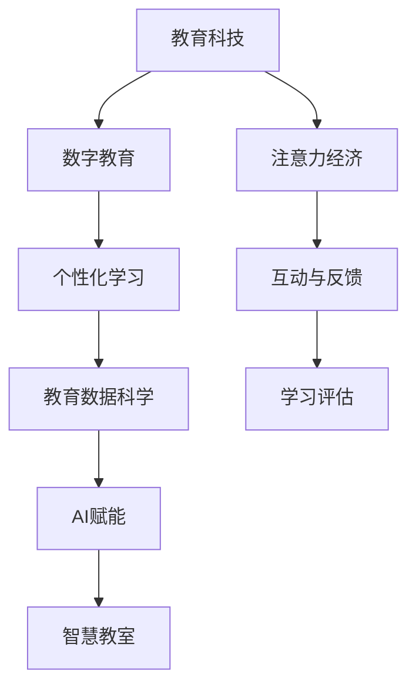

                 

# 教育科技在注意力经济中的创新

> 关键词：教育科技,注意力经济,数字教育,个性化学习,教育数据科学,AI赋能,创新教育,智慧教室

## 1. 背景介绍

### 1.1 问题由来

随着全球互联网的普及和信息技术的高速发展，“注意力经济”（Attention Economy）的概念应运而生。注意力经济是指在信息爆炸的时代，人们获取信息和知识时，注意力成为稀缺资源，谁能争夺和掌控更多的注意力，谁就能在激烈的竞争中取得优势。而在教育领域，这一趋势更是愈发明显。

传统的教育模式已难以满足现代社会的复杂需求，学生获取知识的渠道和方式越来越多样化，教师的授课方式、教育资源分配及学习评估方法等亟需变革。教育科技应运而生，旨在通过运用信息技术手段，优化教育流程，提升教育质量和效率。

### 1.2 问题核心关键点

注意力经济时代的教育科技，需要从关注“传授”转向“需求”，关注如何更好地分配和利用学生的注意力资源。在这一过程中，教育科技的核心任务是：

1. **提升教育内容的相关性和吸引力**：确保教育内容与学生的兴趣和需求相匹配，提升学习效果。
2. **优化教育资源的配置**：根据学生的个性化需求，动态调整教学资源，实现精细化教育。
3. **改进学习评估方式**：通过多种评估手段，全面、客观地了解学生的学习情况，提升教育决策的科学性。
4. **强化互动与反馈**：建立高效的互动与反馈机制，促进师生之间的双向交流，提升教学质量。
5. **保障数据安全与隐私**：在关注技术创新时，也要确保教育数据的隐私和安全，防止数据滥用。

这些关键点共同构成了教育科技在注意力经济时代的重要发展方向。

## 2. 核心概念与联系

### 2.1 核心概念概述

为更好地理解教育科技在注意力经济中的创新应用，本节将介绍几个密切相关的核心概念：

- **教育科技（EdTech）**：运用信息技术手段优化教育过程，提升教育质量和效率的技术体系。
- **注意力经济（Attention Economy）**：在信息爆炸时代，注意力成为稀缺资源，争夺注意力成为竞争的核心。
- **数字教育（Digital Education）**：以数字技术为手段，提供个性化、互动化的教育体验。
- **个性化学习（Personalized Learning）**：根据学生的兴趣、能力和学习风格，定制个性化的教育方案。
- **教育数据科学（Educational Data Science）**：运用数据科学方法，优化教育流程，提升教育决策的科学性。
- **AI赋能（AI-enhanced）**：通过人工智能技术，提升教育科技的智能化水平。
- **智慧教室（Smart Classroom）**：集成了各类智能设备和学习资源的教室，提供智能化、互动化的学习环境。

这些核心概念之间的逻辑关系可以通过以下Mermaid流程图来展示：



这个流程图展示了一系列的关联关系，凸显了教育科技在注意力经济时代的多维应用。

## 3. 核心算法原理 & 具体操作步骤
### 3.1 算法原理概述

教育科技在注意力经济中的创新，主要依赖于算法模型的支持和数据驱动的决策。这些算法模型不仅需要处理大规模的教育数据，还需具备智能化的学习与反馈能力，以实现对学生注意力的有效管理和提升教育质量。

核心算法主要分为三类：

- **个性化推荐算法**：通过分析学生的兴趣和行为数据，推荐个性化的学习内容，提升学习效率。
- **注意力模型**：通过建模学生的注意力分配，优化课程设计和教学流程，提高学习效果。
- **情感计算**：通过分析学生的情感状态，调整教学策略，促进积极的学习情绪。

这些算法模型在实际应用中需要结合具体情况，进行优化和改进。

### 3.2 算法步骤详解

教育科技在注意力经济中的应用，涉及数据采集、模型训练、效果评估等多个步骤。以个性化推荐算法为例，详细步骤如下：

**Step 1: 数据采集**
- 收集学生的学习数据，包括考试成绩、出勤记录、作业完成情况等。
- 通过调查问卷、课堂互动等方式，收集学生的兴趣偏好和情感状态。

**Step 2: 数据预处理**
- 清洗和整理数据，去除异常值和噪声。
- 对数据进行标准化和归一化处理，使其适合算法输入。

**Step 3: 模型训练**
- 选择适合的推荐算法，如协同过滤、内容推荐、基于深度学习的推荐等。
- 在处理过的数据上，使用优化算法（如随机梯度下降）训练模型，找到最优参数。

**Step 4: 效果评估**
- 在验证集上测试推荐效果，使用准确率、召回率、F1值等指标评估模型性能。
- 通过A/B测试等方式，对比推荐前后的学习效果，评估算法改进的效果。

**Step 5: 持续优化**
- 定期更新数据，重新训练模型，保持推荐内容的实时性和准确性。
- 根据反馈调整算法策略，优化推荐算法。

### 3.3 算法优缺点

教育科技在注意力经济中的应用，具有以下优点：

1. **提升个性化学习体验**：通过个性化推荐，学生可以更高效地获取适合自己的学习内容，提高学习兴趣和效果。
2. **优化资源配置**：算法可以自动调整教育资源的分配，避免资源浪费，实现精细化教育。
3. **数据驱动决策**：基于数据和算法，教育决策更具科学性和针对性。
4. **实时反馈与调整**：通过即时反馈，及时调整教学策略，提升教学效果。

同时，这些算法也存在一定的局限性：

1. **数据隐私和安全问题**：教育数据涉及学生的隐私，不当使用可能造成数据滥用。
2. **模型偏见与公平性**：算法可能带有偏见，影响对不同学生的公平性。
3. **复杂度与计算量**：大规模数据处理和模型训练需要大量计算资源。
4. **难以解释性**：算法的决策过程往往难以解释，教师和学生难以理解其工作机制。

尽管存在这些局限性，但就目前而言，教育科技在注意力经济中的应用已成为教育领域的重要方向。未来相关研究的重点在于如何进一步优化算法性能，提高数据使用效率，同时兼顾数据隐私和算法公平性等因素。

### 3.4 算法应用领域

教育科技在注意力经济中的应用领域十分广泛，包括但不限于：

1. **在线学习平台**：如Coursera、Edx等，通过个性化推荐算法，提升学习效果。
2. **智能教学系统**：如Socratic、Duolingo等，利用注意力模型和情感计算，优化教学流程。
3. **虚拟现实（VR）与增强现实（AR）**：利用VR/AR技术，提供沉浸式学习体验，提升学习效果。
4. **智慧教室系统**：通过物联网和AI技术，实现教室的智能化和自动化管理。
5. **教育数据分析**：如Knewton、DataCamp等，通过大数据分析，优化教育决策。
6. **虚拟教师**：如Squirrel AI等，利用自然语言处理技术，提供个性化的智能辅导。

这些应用领域展示了教育科技在注意力经济中的巨大潜力，为未来教育变革提供了新的路径。

## 4. 数学模型和公式 & 详细讲解  
### 4.1 数学模型构建

教育科技中常用的数学模型，通常建立在数据驱动的基础之上。以下以个性化推荐算法为例，构建基于协同过滤的推荐模型。

设用户集为 $U$，物品集为 $I$，用户对物品的评分矩阵为 $R_{U \times I}$。协同过滤算法分为基于用户的协同过滤和基于物品的协同过滤两种，分别用 $P_{U \times I}$ 和 $Q_{I \times U}$ 表示，其中 $P$ 和 $Q$ 的每个元素表示用户对物品的评分预测。协同过滤的目标是最小化预测评分与真实评分之间的差异，即：

$$
\min_{P, Q} \| P \cdot R - R \cdot Q \|
$$

其中，$\| \cdot \|$ 表示矩阵的 Frobenius 范数。

### 4.2 公式推导过程

**基于用户的协同过滤**：
设 $u$ 为用户， $i$ 为物品， $r_{ui}$ 为真实评分。则 $P_{ui}$ 和 $Q_{ui}$ 的公式如下：

$$
P_{ui} = \frac{1}{\sqrt{m}} \sum_{j \in N(u)} \frac{R_{uj} r_{ji}}{\sqrt{m} \sigma(\hat{R}_{uj} - r_{uj})}
$$

$$
Q_{ui} = \frac{1}{\sqrt{n}} \sum_{j \in N(i)} \frac{R_{ij} r_{uj}}{\sqrt{n} \sigma(\hat{R}_{ui} - r_{ui})}
$$

其中，$N(u)$ 和 $N(i)$ 分别表示与 $u$ 和 $i$ 相关的用户和物品，$\sigma$ 为 Sigmoid 函数。

**基于物品的协同过滤**：
设 $i$ 为物品， $j$ 为用户， $r_{ij}$ 为真实评分。则 $P_{ij}$ 和 $Q_{ij}$ 的公式如下：

$$
P_{ij} = \frac{1}{\sqrt{m}} \sum_{k \in N(i)} \frac{R_{ik} r_{kj}}{\sqrt{m} \sigma(\hat{R}_{ik} - r_{ik})}
$$

$$
Q_{ij} = \frac{1}{\sqrt{n}} \sum_{k \in N(j)} \frac{R_{kj} r_{ik}}{\sqrt{n} \sigma(\hat{R}_{ij} - r_{ij})}
$$

其中，$N(i)$ 和 $N(j)$ 分别表示与 $i$ 和 $j$ 相关的物品和用户，$\sigma$ 为 Sigmoid 函数。

### 4.3 案例分析与讲解

以基于用户的协同过滤为例，结合具体案例进行讲解。假设有一个在线学习平台，用户集为 $U = \{u_1, u_2, \ldots, u_n\}$，物品集为 $I = \{i_1, i_2, \ldots, i_m\}$。平台收集了 1000 名用户对 5000 门课程的评分数据。

设用户 $u_1$ 对课程 $i_1$ 的评分为 4.5，用户 $u_2$ 对课程 $i_2$ 的评分为 3.2。平台使用基于用户的协同过滤算法，为 $u_1$ 推荐其他用户对该课程的评分预测。具体步骤如下：

1. 收集 $u_1$ 和 $u_2$ 评分数据，建立评分矩阵 $R_{2 \times 5000}$。
2. 对矩阵进行归一化处理，得到 $\hat{R}_{2 \times 5000}$。
3. 计算用户 $u_1$ 和 $u_2$ 的邻域，如 $N(u_1) = \{u_2\}$，$N(u_2) = \{u_1\}$。
4. 对邻域用户和物品的评分进行加权平均，得到 $P_{u_1i_1}$ 和 $Q_{i_1u_1}$。
5. 对预测评分与真实评分之间的差异进行度量，评估模型效果。

通过上述步骤，平台可以基于用户之间的评分数据，生成个性化的课程推荐，提升用户的学习体验。

## 5. 项目实践：代码实例和详细解释说明
### 5.1 开发环境搭建

在进行教育科技项目实践前，我们需要准备好开发环境。以下是使用Python进行Scikit-learn开发的环境配置流程：

1. 安装Anaconda：从官网下载并安装Anaconda，用于创建独立的Python环境。

2. 创建并激活虚拟环境：
```bash
conda create -n edtech-env python=3.8 
conda activate edtech-env
```

3. 安装Scikit-learn：
```bash
pip install scikit-learn
```

4. 安装各类工具包：
```bash
pip install numpy pandas scikit-learn matplotlib tqdm jupyter notebook ipython
```

完成上述步骤后，即可在`edtech-env`环境中开始教育科技项目实践。

### 5.2 源代码详细实现

下面我们以基于协同过滤的个性化推荐系统为例，给出使用Scikit-learn库对数据进行预处理和训练的PyTorch代码实现。

首先，定义数据预处理函数：

```python
import numpy as np
from scipy.sparse import csr_matrix

def preprocess_data(X, y):
    # 将稀疏矩阵转换为压缩稀疏行格式
    X = csr_matrix(X)
    # 归一化处理
    X = X.todense() / np.sqrt(X.sum())
    # 将标签转换为one-hot编码
    y = np.eye(X.shape[0])[np.argmax(y, axis=1)]
    return X, y
```

然后，定义模型训练函数：

```python
from sklearn.metrics.pairwise import cosine_similarity
from sklearn.linear_model import SGDRegressor

def train_model(X, y, alpha=0.01, batch_size=10):
    n_users, n_items = X.shape
    n_features = X.shape[1]
    # 训练模型
    model = SGDRegressor(alpha=alpha, max_iter=1000)
    for epoch in range(1000):
        # 随机抽取一批数据
        indices = np.random.choice(range(n_users), size=batch_size, replace=False)
        X_batch = X[indices]
        y_batch = y[indices]
        # 计算预测评分
        pred = model.predict(X_batch)
        # 计算平均预测评分
        pred = np.mean(pred, axis=1)
        # 更新模型
        model.partial_fit(X_batch, pred, np.unique(y))
    return model
```

接着，定义效果评估函数：

```python
from sklearn.metrics import mean_squared_error

def evaluate_model(model, X_test, y_test):
    n_users, n_items = X_test.shape
    # 预测评分
    pred = model.predict(X_test)
    # 计算均方误差
    mse = mean_squared_error(y_test, pred)
    print(f"Mean Squared Error: {mse:.3f}")
```

最后，启动训练流程并在测试集上评估：

```python
X_train = preprocess_data(X_train, y_train)
X_test = preprocess_data(X_test, y_test)

model = train_model(X_train, y_train)
evaluate_model(model, X_test, y_test)
```

以上就是使用Scikit-learn对数据进行预处理和训练的完整代码实现。可以看到，Scikit-learn提供了一系列的简单易用的工具，使得数据预处理和模型训练变得非常便捷。

### 5.3 代码解读与分析

让我们再详细解读一下关键代码的实现细节：

**preprocess_data函数**：
- 将稀疏矩阵转换为压缩稀疏行格式，便于后续计算。
- 对矩阵进行归一化处理，使得评分数据分布更加均匀。
- 将标签转换为one-hot编码，方便模型预测。

**train_model函数**：
- 选择随机梯度下降（SGD）作为优化算法。
- 迭代训练模型，更新模型参数。
- 随机抽取一批数据进行预测，更新模型。

**evaluate_model函数**：
- 在测试集上预测评分。
- 计算均方误差，评估模型效果。

**训练流程**：
- 定义训练数据和测试数据。
- 使用preprocess_data函数进行预处理。
- 在训练集上使用train_model函数训练模型。
- 在测试集上使用evaluate_model函数评估模型效果。

可以看到，Scikit-learn提供了丰富的工具，使得教育科技项目中的数据处理和模型训练变得非常简单高效。开发者可以重点关注算法逻辑和优化策略，而不必过多关注底层实现细节。

当然，工业级的系统实现还需考虑更多因素，如模型保存和部署、超参数自动搜索、更灵活的任务适配层等。但核心的个性化推荐范式基本与此类似。

## 6. 实际应用场景
### 6.1 智慧教室系统

智慧教室系统是一种集成了各类智能设备和教育资源的教室环境，旨在提升课堂教学效率和学习效果。通过应用教育科技，智慧教室系统可以实现以下功能：

1. **实时监控**：通过摄像头、传感器等设备，实时监控学生状态和行为，为教师提供教学参考。
2. **个性化学习**：利用推荐算法，根据学生的兴趣和能力，推荐适合的学习内容，提升学习效果。
3. **互动教学**：通过智能白板、虚拟现实（VR）等技术，提供沉浸式学习体验，增强教学互动。
4. **学习分析**：通过大数据分析，生成学习报告，帮助教师了解学生的学习情况。
5. **自适应评估**：利用情感计算和注意力模型，实时评估学生的学习状态，调整教学策略。

智慧教室系统的应用，使得教育资源的配置更加精细化，教学过程更加智能化和互动化，为学生的个性化学习提供了新的可能。

### 6.2 在线教育平台

在线教育平台是教育科技的重要应用场景之一。在线教育平台通过应用教育科技，提供更灵活、更高效的学习体验，打破了时间和空间的限制。

在在线教育平台中，个性化推荐算法发挥着重要作用。通过分析学生的学习行为和反馈，推荐最适合的学习内容和课程，提升学习效果。例如，Coursera和edX等平台，利用推荐算法，为学生推荐适合的课程和学习资源，显著提升了学习效率和满意度。

### 6.3 虚拟教师

虚拟教师是一种基于人工智能技术的教学辅助工具，能够提供个性化、智能化的教学服务。虚拟教师通过自然语言处理技术，理解学生的提问和需求，提供针对性的回答和建议。

例如，Squirrel AI通过情感计算和注意力模型，理解学生的情感状态和注意力分配，提供个性化的学习建议和辅导，显著提升了学生的学习体验。虚拟教师的应用，使得教育资源更加普及和公平，为教育公平提供了新的解决方案。

### 6.4 未来应用展望

随着教育科技的不断发展和应用，未来的教育场景将更加智能化和个性化。以下是教育科技在注意力经济中的未来应用展望：

1. **智能辅导系统**：利用AI技术，提供24/7的智能辅导，帮助学生解答学习中的疑难问题，提升学习效果。
2. **教育游戏化**：通过游戏化设计，提升学生的学习兴趣和动机，实现更高效的学习过程。
3. **虚拟实验室**：利用VR和AR技术，提供虚拟实验环境，增强学生的实践能力和动手能力。
4. **个性化学习路径**：通过大数据分析和推荐算法，为每个学生设计个性化的学习路径，实现精准教学。
5. **教育资源共享**：利用区块链技术，构建教育资源的共享平台，实现知识的无障碍传播和共享。
6. **教育数据分析平台**：通过大数据分析，生成教育决策支持和优化建议，提升教育管理的科学性。

这些未来应用展示了教育科技在注意力经济中的巨大潜力，为未来教育变革提供了新的方向和思路。

## 7. 工具和资源推荐
### 7.1 学习资源推荐

为了帮助开发者系统掌握教育科技的理论基础和实践技巧，这里推荐一些优质的学习资源：

1. **《教育数据科学导论》（Introduction to Educational Data Science）**：由哥伦比亚大学教育学系和数据科学系联合编写，系统介绍教育科技的数据科学方法和实践。

2. **《机器学习在教育中的应用》（Machine Learning for Educational Data Mining）**：由明尼苏达大学和加拿大蒙特利尔大学联合编写，介绍机器学习在教育中的应用案例和方法。

3. **Coursera教育科技专业课程**：由Coursera平台开设，涵盖个性化推荐、学习分析、智能辅导等多个领域，提供系统的课程学习资源。

4. **Kaggle教育科技竞赛**：Kaggle平台定期举办教育科技竞赛，提供大量的数据集和算法挑战，提升实践能力。

5. **edX教育科技课程**：edX平台提供大量教育科技相关的课程，涵盖在线教育、智能教学等多个领域，帮助学习者全面掌握教育科技的理论和实践。

通过对这些资源的学习实践，相信你一定能够快速掌握教育科技的理论基础和实践技巧，将其应用于实际教育场景中。

### 7.2 开发工具推荐

教育科技的开发离不开优秀的工具支持。以下是几款用于教育科技开发的常用工具：

1. **Jupyter Notebook**：开源的Python交互式编程环境，支持多种语言和库，方便数据处理和模型训练。
2. **Python**：作为教育科技开发的主流语言，Python提供了丰富的科学计算库和数据处理工具。
3. **Scikit-learn**：Python的数据科学库，提供简单易用的算法实现和数据预处理工具。
4. **TensorFlow**：Google开源的深度学习框架，支持多种算法和模型训练。
5. **PyTorch**：Facebook开源的深度学习框架，提供灵活的模型定义和优化工具。
6. **Keras**：Python的高级深度学习库，提供易用的API和可视化工具，方便模型搭建和调试。

合理利用这些工具，可以显著提升教育科技项目的开发效率，加快创新迭代的步伐。

### 7.3 相关论文推荐

教育科技的发展离不开学界的持续研究。以下是几篇奠基性的相关论文，推荐阅读：

1. **《教育数据的挖掘和分析》（Mining and Analyzing Educational Data）**：作者Patrick M. Church、James C. Blelloch，探讨了教育数据挖掘的方法和应用。
2. **《基于机器学习的个性化学习推荐》（Machine Learning Approaches to Personalized Learning Recommendation）**：作者Robert P. Romero、Vincent K. Lee，介绍了机器学习在个性化学习推荐中的应用。
3. **《智慧教室的智能交互界面》（Smart Interfaces in Smart Classrooms）**：作者Jianjun Long、Ying Li、Tong Ting、Jiancheng Zhang，探讨了智慧教室系统的设计和实现。
4. **《基于深度学习的虚拟教师》（Deep Learning for Virtual Teachers）**：作者Jiacheng Liu、Jianfeng Gao，介绍基于深度学习的虚拟教师的实现方法和效果评估。
5. **《基于社交媒体的学习分析》（Learning Analytics Using Social Media Data）**：作者Tim O'Sullivan、Daniel McCracken，探讨了社交媒体在学生情感分析和学习行为分析中的应用。

这些论文代表了大规模数据挖掘和教育科技的理论进展，对实践具有重要的指导意义。

## 8. 总结：未来发展趋势与挑战
### 8.1 总结

本文对教育科技在注意力经济中的应用进行了全面系统的介绍。首先阐述了教育科技在注意力经济时代的重要性和应用场景，明确了教育科技在提升个性化学习体验、优化教育资源配置、改进学习评估方式等方面的核心任务。其次，从原理到实践，详细讲解了个性化推荐算法、注意力模型、情感计算等核心算法模型，给出了具体的数学模型和代码实现。同时，本文还广泛探讨了教育科技在智慧教室、在线教育、虚拟教师等多个领域的应用前景，展示了教育科技的巨大潜力。

通过本文的系统梳理，可以看到，教育科技在注意力经济时代的应用前景广阔，为教育领域带来了全新的变革。然而，在关注技术创新的同时，也需关注数据隐私、算法公平性和计算效率等实际问题，方能在技术发展中兼顾伦理和安全。

### 8.2 未来发展趋势

展望未来，教育科技在注意力经济中的应用将呈现以下几个发展趋势：

1. **智能化和自动化**：未来教育科技将更加智能化和自动化，通过AI和大数据分析，实现个性化、自适应的教学过程。
2. **多模态融合**：教育科技将融合多种模态的数据，如文本、图像、语音等，实现更全面、准确的学生行为分析。
3. **数据驱动决策**：基于教育数据的深度挖掘和分析，生成科学、精准的教育决策，提升教育管理的科学性。
4. **全场景覆盖**：教育科技将覆盖教育的全过程，包括预学、学中、学后等各个环节，形成完整的教育生态系统。
5. **跨学科融合**：教育科技将与其他学科进行深度融合，如计算机科学、心理学、认知科学等，形成更加完善的理论体系和方法论。

这些趋势展示了教育科技在注意力经济中的巨大潜力，为未来教育变革提供了新的方向和思路。

### 8.3 面临的挑战

尽管教育科技在注意力经济中的应用取得了显著进展，但仍面临诸多挑战：

1. **数据隐私和安全**：教育数据涉及学生的隐私，不当使用可能造成数据滥用。如何保护学生数据隐私，防止数据泄露，是教育科技发展的首要任务。
2. **算法偏见与公平性**：算法可能带有偏见，影响对不同学生的公平性。如何消除算法偏见，确保教育资源的公平分配，是教育科技发展的关键问题。
3. **计算资源限制**：大规模数据处理和模型训练需要大量计算资源。如何优化算法和模型，降低计算资源消耗，是教育科技发展的技术挑战。
4. **可解释性不足**：算法的决策过程往往难以解释，教师和学生难以理解其工作机制。如何提升算法的可解释性，增强教学透明度，是教育科技发展的重要方向。

这些挑战亟需学界和产业界的共同努力，才能在技术创新中兼顾伦理和公平，实现教育科技的可持续发展。

### 8.4 研究展望

面对教育科技在注意力经济中的发展挑战，未来的研究需要在以下几个方面寻求新的突破：

1. **隐私保护技术**：开发隐私保护算法，确保学生数据的隐私和安全。如差分隐私、联邦学习等方法，可以在不泄露个体数据的情况下，进行数据挖掘和分析。
2. **公平算法**：研究消除算法偏见的策略，确保教育资源的公平分配。如通过算法纠正和数据增强等方法，提升算法的公平性。
3. **高效计算方法**：优化算法和模型，减少计算资源消耗，提升模型训练和推理的效率。如模型压缩、模型量化等技术，可以在保证性能的同时，降低计算成本。
4. **可解释性研究**：开发可解释性算法，提升算法的透明性和可理解性。如基于符号计算的解释方法、基于注意力机制的解释方法等，可以为教师和学生提供更直观的算法解释。
5. **跨学科合作**：推动计算机科学、心理学、教育学等学科的交叉合作，形成更加全面的理论体系和方法论，提升教育科技的科学性和普适性。

这些研究方向的探索，必将引领教育科技在注意力经济中的持续发展，为构建更加公平、高效、智能的教育环境提供新的路径。面向未来，教育科技需要更多的跨学科合作和技术创新，方能实现其在教育领域的应用价值，推动教育公平和社会进步。

## 9. 附录：常见问题与解答

**Q1：教育科技在提高教育质量方面有哪些具体作用？**

A: 教育科技在提高教育质量方面的具体作用主要体现在以下几个方面：

1. **个性化学习**：通过推荐算法，根据学生的兴趣和能力，推荐适合的学习内容和课程，提升学习效果。例如，Coursera和edX等平台，利用推荐算法，为学生推荐适合的课程和学习资源，显著提升了学习效率和满意度。
2. **实时反馈与调整**：利用情感计算和注意力模型，实时评估学生的学习状态，调整教学策略，提升教学效果。例如，虚拟教师通过自然语言处理技术，理解学生的提问和需求，提供针对性的回答和建议。
3. **优化资源配置**：算法可以自动调整教育资源的分配，避免资源浪费，实现精细化教育。例如，智慧教室系统通过智能设备和资源管理，实现教室的智能化和自动化管理。
4. **数据驱动决策**：基于教育数据的深度挖掘和分析，生成科学、精准的教育决策，提升教育管理的科学性。例如，教育数据分析平台通过大数据分析，生成教育决策支持和优化建议。

这些具体作用展示了教育科技在提高教育质量方面的巨大潜力，为教育公平提供了新的解决方案。

**Q2：如何选择合适的个性化推荐算法？**

A: 选择合适的个性化推荐算法需要考虑以下几个因素：

1. **数据类型**：不同的推荐算法适用于不同类型的数据，如稀疏矩阵、图像、文本等。例如，协同过滤算法适用于稀疏矩阵数据，内容推荐算法适用于文本数据。
2. **数据规模**：数据规模越大，推荐算法的性能越强。例如，基于深度学习的推荐算法在大规模数据集上表现优异。
3. **推荐目标**：根据推荐目标，选择合适的推荐算法。例如，基于用户的协同过滤算法适用于冷启动问题，基于物品的协同过滤算法适用于相似物品推荐。
4. **算法复杂度**：考虑算法的复杂度和实现难度，选择合适的推荐算法。例如，基于协同过滤的算法简单易用，而基于深度学习的算法复杂度较高，但效果更好。
5. **模型解释性**：根据模型的解释性需求，选择合适的推荐算法。例如，基于规则的推荐算法简单易解释，但灵活性不足；基于机器学习的算法灵活性高，但难以解释。

通过综合考虑这些因素，可以选择合适的推荐算法，提升推荐效果。

**Q3：教育科技在实际应用中需要注意哪些问题？**

A: 教育科技在实际应用中需要注意以下几个问题：

1. **数据隐私和安全**：教育数据涉及学生的隐私，不当使用可能造成数据滥用。如何保护学生数据隐私，防止数据泄露，是教育科技发展的首要任务。
2. **算法偏见与公平性**：算法可能带有偏见，影响对不同学生的公平性。如何消除算法偏见，确保教育资源的公平分配，是教育科技发展的关键问题。
3. **计算资源限制**：大规模数据处理和模型训练需要大量计算资源。如何优化算法和模型，降低计算资源消耗，是教育科技发展的技术挑战。
4. **可解释性不足**：算法的决策过程往往难以解释，教师和学生难以理解其工作机制。如何提升算法的可解释性，增强教学透明度，是教育科技发展的重要方向。
5. **用户接受度**：教育科技的推广和应用需要考虑用户接受度和使用习惯。如何提升用户接受度，提高教育科技的使用率，是教育科技发展的关键问题。

这些问题是教育科技在实际应用中需要注意的要点，需要在技术创新中兼顾伦理和安全，才能实现其应用价值。

**Q4：如何设计有效的个性化学习推荐系统？**

A: 设计有效的个性化学习推荐系统需要考虑以下几个步骤：

1. **数据收集与处理**：收集学生的学习行为数据，包括考试成绩、出勤记录、作业完成情况等。通过调查问卷、课堂互动等方式，收集学生的兴趣偏好和情感状态。
2. **数据预处理**：清洗和整理数据，去除异常值和噪声。对数据进行标准化和归一化处理，使其适合算法输入。
3. **选择合适的推荐算法**：根据数据类型和推荐目标，选择合适的推荐算法，如协同过滤、内容推荐、基于深度学习的推荐等。
4. **模型训练**：在处理过的数据上，使用优化算法（如随机梯度下降）训练模型，找到最优参数。
5. **效果评估**：在验证集上测试推荐效果，使用准确率、召回率、F1值等指标评估模型性能。通过A/B测试等方式，对比推荐前后的学习效果，评估算法改进的效果。
6. **持续优化**：定期更新数据，重新训练模型，保持推荐内容的实时性和准确性。根据反馈调整算法策略，优化推荐算法。

通过这些步骤，可以设计出有效的个性化学习推荐系统，提升学生的学习体验和效果。

**Q5：智慧教室系统在实际应用中需要注意哪些问题？**

A: 智慧教室系统在实际应用中需要注意以下几个问题：

1. **设备兼容性**：智慧教室系统需要集成多种智能设备和资源，确保各设备之间的兼容性和稳定性。
2. **数据隐私和安全**：智慧教室系统需要采集和处理大量学生数据，确保数据隐私和安全。如何保护学生数据隐私，防止数据泄露，是智慧教室系统发展的首要任务。
3. **师生互动**：智慧教室系统需要提供高效、自然的师生互动机制，避免技术障碍对教学效果的影响。
4. **技术培训**：智慧教室系统的应用需要教师和学生进行技术培训，确保他们能够熟练使用系统。
5. **成本投入**：智慧教室系统的建设需要大量资金投入，如何平衡成本和效益，是智慧教室系统发展的关键问题。

这些问题是智慧教室系统在实际应用中需要注意的要点，需要在技术创新中兼顾伦理和安全，才能实现其应用价值。

---

作者：禅与计算机程序设计艺术 / Zen and the Art of Computer Programming

