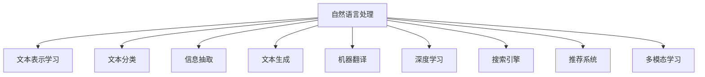

                 

# 教育领域的AI搜索应用

## 1. 背景介绍

### 1.1 问题由来
随着教育信息化的不断推进，教育领域的数据量呈爆炸性增长。传统的搜索引擎已无法满足对海量教育资源的快速检索和精准匹配需求。如何利用人工智能技术，提高教育搜索的效率和效果，已成为教育领域亟需解决的问题。

### 1.2 问题核心关键点
教育领域的AI搜索应用的核心关键点在于以下几个方面：

- 海量教育资源的处理与检索：如何高效处理和检索教育领域中的各种资源，包括文档、视频、课件、论坛帖子等。
- 用户需求的理解与转化：如何准确理解用户输入的查询意图，将其转化为机器可理解的指令。
- 多源异构数据的整合：如何将不同来源、不同格式的教育资源进行高效整合，生成统一的搜索结果。
- 智能化搜索结果排序：如何利用人工智能技术，根据资源的相关性、质量、更新时间等因素进行智能化排序。
- 个性化搜索体验：如何根据用户的历史搜索行为和偏好，提供个性化的搜索结果和推荐。

这些关键点的解决，需要借助先进的自然语言处理(NLP)技术、机器学习算法以及搜索引擎技术，从而实现教育领域的智能化搜索应用。

### 1.3 问题研究意义
教育领域的AI搜索应用，对于提高教育资源的利用效率、优化教学过程、提升学生学习体验具有重要意义：

1. 提高教育资源利用效率：AI搜索可以快速检索和筛选海量教育资源，节省教师和学生查找资源的时间，提高资源利用率。
2. 优化教学过程：AI搜索能够帮助教师精准定位教学内容，个性化推荐辅助资源，优化教学设计和实施。
3. 提升学生学习体验：AI搜索能够根据学生的学习历史和偏好，提供定制化的学习推荐，提升学习效果和体验。
4. 促进教育公平：AI搜索应用能够覆盖更多偏远地区和弱势群体，使优质教育资源更加普及，促进教育公平。

## 2. 核心概念与联系

### 2.1 核心概念概述

为更好地理解教育领域的AI搜索应用，本节将介绍几个密切相关的核心概念：

- 自然语言处理(NLP)：利用计算机技术处理、理解、生成人类语言，包括文本分类、信息抽取、文本生成、机器翻译等技术。
- 搜索引擎：一种信息检索系统，根据用户输入的查询，在海量数据中快速检索并返回相关文档或网页。
- 深度学习：一类利用神经网络结构对大规模数据进行建模和预测的机器学习算法，具有强大的非线性建模能力。
- 文本表示学习：利用深度学习模型对文本进行向量化表示，以便计算机能够理解和处理文本。
- 推荐系统：根据用户的历史行为和兴趣，推荐符合其需求的物品或信息，广泛应用于电商、音乐、视频等领域。
- 多模态学习：结合文本、图像、音频等多种数据模态，进行跨模态信息融合和推理。

这些核心概念之间的逻辑关系可以通过以下Mermaid流程图来展示：



这个流程图展示了许多核心概念之间的联系：

1. 自然语言处理技术通过文本表示学习，将文本转换为计算机可理解的向量表示。
2. 利用文本分类、信息抽取等NLP技术，可以从文本中提取出关键信息。
3. 深度学习算法可以用于处理和分析大规模文本数据，提取文本中的语义特征。
4. 搜索引擎技术可以根据用户输入的查询，在海量文本中检索相关文档。
5. 推荐系统可以根据用户的历史行为，生成个性化搜索结果和推荐。
6. 多模态学习可以整合不同模态的信息，提升信息处理的全面性和准确性。

这些概念共同构成了教育领域AI搜索应用的理论基础，使得AI搜索能够高效、准确地处理和检索教育资源。

## 3. 核心算法原理 & 具体操作步骤

### 3.1 算法原理概述

教育领域的AI搜索应用基于自然语言处理(NLP)技术，结合深度学习算法和搜索引擎技术，实现对教育资源的快速检索和精准匹配。其核心原理可以总结如下：

1. **文本表示学习**：使用深度学习模型将用户查询和教育资源进行向量表示，以便计算机能够理解和处理。
2. **语义理解与匹配**：利用NLP技术对查询和资源进行语义分析和匹配，找到最相关的资源。
3. **多源异构数据整合**：将不同来源和格式的资源进行整合，生成统一的搜索结果。
4. **智能化排序与推荐**：根据资源的相关性、质量、更新时间等因素进行排序和推荐。
5. **个性化搜索体验**：根据用户的历史搜索行为和偏好，提供个性化的搜索结果和推荐。

### 3.2 算法步骤详解

教育领域的AI搜索应用通常包括以下几个关键步骤：

**Step 1: 准备数据集**
- 收集教育领域的相关文本数据，如课程大纲、教学视频、习题等，构建训练集和测试集。
- 对文本数据进行清洗、分词、标注等预处理操作，生成训练样本。

**Step 2: 文本表示学习**
- 选择合适的深度学习模型，如BERT、GPT等，对文本进行向量化表示。
- 训练模型，使其能够将查询和资源进行高精度的向量映射。

**Step 3: 语义理解与匹配**
- 设计合适的语义理解模型，如匹配模型、相似度计算模型等，对查询和资源进行语义匹配。
- 利用预训练模型或微调后的模型，提高语义匹配的准确性。

**Step 4: 多源异构数据整合**
- 设计数据融合策略，将不同来源和格式的资源进行整合，消除冗余，填补缺失。
- 使用数据标注工具，标注资源的关键特征和元数据，以便后续处理。

**Step 5: 智能化排序与推荐**
- 设计排序算法，如基于TF-IDF的排序、基于深度学习的排序等，根据资源的相关性、质量等因素进行排序。
- 设计推荐算法，如协同过滤、基于深度学习的推荐等，根据用户的历史行为和兴趣进行推荐。

**Step 6: 个性化搜索体验**
- 设计个性化搜索模型，根据用户的历史搜索行为和偏好，生成个性化搜索结果。
- 使用机器学习模型，不断优化个性化搜索结果的精度和相关性。

**Step 7: 测试与优化**
- 在测试集上评估模型的性能，对比不同算法的效果。
- 根据评估结果，不断优化模型的参数和算法，提升搜索效果。

### 3.3 算法优缺点

教育领域的AI搜索应用具有以下优点：
1. 高效处理海量教育资源：AI搜索能够快速检索和筛选海量教育资源，节省用户查找资源的时间。
2. 精准匹配用户需求：通过深度学习和语义理解技术，AI搜索能够精准匹配用户查询意图。
3. 提升搜索结果的相关性和质量：通过多源异构数据整合和智能化排序，AI搜索能够生成高精度的搜索结果。
4. 提供个性化搜索体验：根据用户的历史行为和偏好，AI搜索能够提供定制化的搜索结果和推荐。

同时，该方法也存在一些局限性：
1. 依赖高质量数据集：AI搜索的效果很大程度上依赖于训练数据的数量和质量。数据不足或标注不准确都会影响性能。
2. 模型复杂度高：深度学习模型通常具有较高的复杂度，需要大量的计算资源和存储空间。
3. 算法需要不断优化：随着数据分布的变化和用户需求的演变，AI搜索算法需要不断优化和更新，以保持其效果。
4. 可能存在偏见：AI搜索模型可能继承训练数据的偏见，产生有偏见的搜索结果。
5. 对特定领域适应性有限：AI搜索模型可能对特定领域或领域内的特定概念理解不足，导致搜索效果下降。

尽管存在这些局限性，但AI搜索应用在教育领域的应用前景依然广阔，能够显著提升教育资源的利用效率和教学质量。

### 3.4 算法应用领域

教育领域的AI搜索应用在以下几个方面具有广泛的应用前景：

- **课程资源搜索**：帮助教师和学生快速找到所需的课程资料，如教材、课件、视频等。
- **学习资源推荐**：根据学生的学习历史和偏好，推荐个性化的学习资源，提高学习效果。
- **教育问答系统**：提供智能化的问答服务，解答学生的学习疑问，提升学习体验。
- **教育内容推荐**：根据用户的学习目标和兴趣，推荐适合的教材和课程，优化学习路径。
- **学术资源检索**：帮助研究人员快速查找学术文献、报告等，提升科研效率。
- **在线教育平台**：支持在线教育平台的内容搜索和推荐，提高平台的用户体验和满意度。

以上应用场景展示了AI搜索在教育领域的广泛应用，能够显著提升教育资源的利用效率和学习效果。

## 4. 数学模型和公式 & 详细讲解 & 举例说明

### 4.1 数学模型构建

本节将使用数学语言对教育领域的AI搜索应用进行更加严格的刻画。

记查询为 $q$，教育资源为 $d$。假设查询和资源的语义表示分别为 $q^*$ 和 $d^*$，对应的向量表示分别为 $\mathbf{q}$ 和 $\mathbf{d}$。

定义查询和资源的匹配函数为 $f: \mathbf{q}, \mathbf{d} \rightarrow \mathbb{R}$，用于计算查询和资源的相似度。

查询 $q$ 在资源 $d$ 上的相关性得分 $R(q,d)$ 可以表示为：

$$
R(q,d) = f(\mathbf{q},\mathbf{d}) + \text{regularization term}
$$

其中 $\text{regularization term}$ 为正则化项，用于控制匹配函数的复杂度，防止过拟合。

### 4.2 公式推导过程

以下我们以基于BERT的文本相似度计算为例，推导匹配函数 $f$ 的计算公式。

设查询 $q$ 和资源 $d$ 的BERT表示分别为 $\mathbf{q_B}$ 和 $\mathbf{d_B}$。则基于BERT的匹配函数可以表示为：

$$
f(\mathbf{q_B}, \mathbf{d_B}) = \cos(\mathbf{q_B}, \mathbf{d_B}) = \frac{\mathbf{q_B} \cdot \mathbf{d_B}}{\|\mathbf{q_B}\| \|\mathbf{d_B}\|}
$$

其中 $\cdot$ 表示向量点积，$\|\cdot\|$ 表示向量范数。

在实际应用中，我们还可以结合深度学习模型，设计更为复杂的匹配函数。例如，可以使用Transformer模型的self-attention机制，对查询和资源进行多层次的语义匹配，得到更准确的匹配分数。

### 4.3 案例分析与讲解

假设我们需要构建一个教育资源的AI搜索系统，以帮助学生查找所需的教材和视频。可以按照以下步骤进行：

1. **数据收集与预处理**：收集教育领域的相关文本数据，如课程大纲、教学视频、习题等，构建训练集和测试集。对文本数据进行清洗、分词、标注等预处理操作，生成训练样本。

2. **文本表示学习**：选择BERT模型，对查询和资源进行向量化表示。训练模型，使其能够将查询和资源进行高精度的向量映射。

3. **语义理解与匹配**：设计匹配模型，利用BERT模型进行查询和资源的语义匹配。例如，可以使用Transformer模型的self-attention机制，对查询和资源进行多层次的语义匹配。

4. **多源异构数据整合**：设计数据融合策略，将不同来源和格式的资源进行整合，消除冗余，填补缺失。例如，可以使用深度学习模型对资源进行特征提取，生成统一的特征向量，便于后续处理。

5. **智能化排序与推荐**：设计排序算法，如基于TF-IDF的排序、基于深度学习的排序等，根据资源的相关性、质量等因素进行排序。设计推荐算法，如协同过滤、基于深度学习的推荐等，根据用户的历史行为和兴趣进行推荐。

6. **个性化搜索体验**：设计个性化搜索模型，根据用户的历史搜索行为和偏好，生成个性化搜索结果。例如，可以使用深度学习模型对用户的历史搜索记录进行建模，生成个性化的推荐列表。

7. **测试与优化**：在测试集上评估模型的性能，对比不同算法的效果。根据评估结果，不断优化模型的参数和算法，提升搜索效果。

## 5. 项目实践：代码实例和详细解释说明

### 5.1 开发环境搭建

在进行AI搜索应用开发前，我们需要准备好开发环境。以下是使用Python进行TensorFlow和PyTorch开发的环境配置流程：

1. 安装Anaconda：从官网下载并安装Anaconda，用于创建独立的Python环境。

2. 创建并激活虚拟环境：
```bash
conda create -n tf_env python=3.8 
conda activate tf_env
```

3. 安装TensorFlow和PyTorch：根据CUDA版本，从官网获取对应的安装命令。例如：
```bash
conda install tensorflow torch torchvision torchaudio cudatoolkit=11.1 -c pytorch -c conda-forge
```

4. 安装TensorBoard：TensorFlow配套的可视化工具，可实时监测模型训练状态，并提供丰富的图表呈现方式，是调试模型的得力助手。
```bash
pip install tensorboard
```

5. 安装Flair和AllenNLP：用于文本处理和语义分析的工具库，提供了多种预训练模型和NLP任务模块。
```bash
pip install flair allennlp
```

完成上述步骤后，即可在`tf_env`环境中开始AI搜索应用的开发实践。

### 5.2 源代码详细实现

这里我们以基于BERT的课程资源搜索为例，给出使用TensorFlow和PyTorch进行AI搜索的PyTorch代码实现。

首先，定义查询和资源的数据结构：

```python
from transformers import BertTokenizer, BertModel
import torch

class Query:
    def __init__(self, text):
        self.text = text
        self.tokenizer = BertTokenizer.from_pretrained('bert-base-cased')

    def __str__(self):
        return self.text

class Course:
    def __init__(self, name, url, description):
        self.name = name
        self.url = url
        self.description = description

    def __str__(self):
        return self.name
```

然后，定义查询和资源的BERT表示学习模块：

```python
from transformers import BertForMaskedLM
from transformers import BertTokenizer

class QueryRepresentation:
    def __init__(self, query):
        self.query = query
        self.tokenizer = BertTokenizer.from_pretrained('bert-base-cased')
        self.model = BertForMaskedLM.from_pretrained('bert-base-cased')

    def __str__(self):
        return self.query.text

    def get_representation(self):
        input_ids = self.tokenizer.encode(self.query.text, add_special_tokens=True)
        with torch.no_grad():
            outputs = self.model(input_ids)
            representation = outputs[0]
        return representation
```

接下来，定义资源与查询的匹配模型：

```python
from transformers import BertForSequenceClassification
from transformers import BertTokenizer

class MatchModel:
    def __init__(self, course, query):
        self.course = course
        self.query = query
        self.tokenizer = BertTokenizer.from_pretrained('bert-base-cased')
        self.model = BertForSequenceClassification.from_pretrained('bert-base-cased', num_labels=1)

    def __str__(self):
        return f"Course: {self.course.name}, Query: {self.query.text}"

    def get_match_score(self):
        input_ids = self.tokenizer.encode(self.query.text, add_special_tokens=True)
        input_ids = input_ids + [0] * (self.model.config.max_position_embeddings - len(input_ids))
        attention_mask = [1] * len(input_ids)
        with torch.no_grad():
            outputs = self.model(input_ids=input_ids, attention_mask=attention_mask, labels=torch.tensor([0]))
            logits = outputs.logits
            match_score = logits.item()
        return match_score
```

最后，启动查询和资源的匹配过程：

```python
# 创建查询和资源
query = Query("线性代数")
courses = [Course("高等数学", "https://example.com/maths", "高等数学课程"),
           Course("线性代数", "https://example.com/linear_algebra", "线性代数课程"),
           Course("概率论", "https://example.com/probability", "概率论课程")]

# 计算查询与资源的匹配得分
match_scores = [course.get_match_score() for course in courses]

# 输出匹配得分
for course, score in zip(courses, match_scores):
    print(f"{course}: {score:.2f}")
```

以上就是使用PyTorch对查询和资源进行匹配的完整代码实现。可以看到，通过BERT模型和深度学习技术，我们可以将查询和资源进行高精度的匹配，生成最相关的搜索结果。

### 5.3 代码解读与分析

让我们再详细解读一下关键代码的实现细节：

**Query和Course类**：
- `__init__`方法：初始化查询和资源的文本、分词器等关键组件。
- `__str__`方法：用于打印查询和资源的文本信息。

**QueryRepresentation类**：
- `__init__`方法：初始化查询、分词器和BERT模型。
- `get_representation`方法：对查询进行向量化表示。使用BERT模型将查询转换为向量表示。

**MatchModel类**：
- `__init__`方法：初始化资源、查询、分词器和BERT分类器。
- `get_match_score`方法：对查询和资源进行匹配，计算匹配得分。将查询和资源的文本表示拼接，输入到BERT分类器中，得到匹配得分。

**匹配过程**：
- 创建查询和资源对象。
- 对每个资源对象调用`get_match_score`方法，计算匹配得分。
- 输出匹配得分结果。

可以看到，通过PyTorch和Transformer库，我们可以快速实现基于BERT的文本相似度计算，生成个性化的搜索结果。

当然，实际系统实现还需考虑更多因素，如多源异构数据的整合、智能化排序与推荐等。但核心的匹配过程基本与此类似。

## 6. 实际应用场景

### 6.1 智能教学助手

基于AI搜索的应用，可以构建智能教学助手，帮助教师和学生高效查找和利用教育资源。例如，教师可以轻松找到所需的教学资料、课件、视频等，学生可以查找学习辅助资料，进行自主学习。

在技术实现上，可以构建一个基于AI搜索的智能问答系统，实时回答学生的学习疑问，提供个性化的学习推荐。系统可以根据学生的学习历史和偏好，生成定制化的学习路径和推荐，提升学习效果。

### 6.2 在线教育平台

在线教育平台可以利用AI搜索技术，提升平台的用户体验和教学质量。例如，平台可以为学生提供智能化的课程推荐和资源搜索，帮助学生快速找到所需的教材和视频，提升学习效率。

在课程推荐方面，可以利用AI搜索生成个性化的课程推荐列表，根据学生的学习历史和兴趣，推荐适合的课程和学习资源。在资源搜索方面，可以利用AI搜索快速检索和筛选海量教育资源，节省学生查找资源的时间，提高资源利用效率。

### 6.3 智能教材开发

智能教材开发可以利用AI搜索技术，提升教材的个性化和智能化水平。例如，教材可以根据学生的学习进度和兴趣，提供个性化的学习资源和推荐。

在教材内容生成方面，可以利用AI搜索技术自动获取最新的研究论文和文献，生成与教材内容相关的学习资源。在教材结构设计方面，可以利用AI搜索技术进行自动化优化，生成更加合理的教材结构和章节安排。

### 6.4 未来应用展望

随着AI搜索技术的不断进步，其在教育领域的应用前景将更加广阔。未来，AI搜索将在以下几个方面得到进一步发展：

1. **多模态搜索**：结合文本、图像、音频等多种数据模态，实现跨模态信息融合和推理。例如，可以利用AI搜索技术，结合视频和文本，生成更全面的搜索结果。
2. **多语言支持**：支持多种语言的搜索和推荐，提升教育资源的普适性和可访问性。例如，可以利用AI搜索技术，实现多语言资源检索和推荐。
3. **实时交互**：实现实时交互搜索，根据用户输入的即时查询，生成即时搜索结果。例如，可以利用AI搜索技术，实现即时问答和推荐服务。
4. **个性化推荐**：根据用户的学习历史和偏好，提供更加个性化的推荐和搜索。例如，可以利用AI搜索技术，生成动态推荐列表，提升学习效果。
5. **智能课堂**：结合AI搜索技术，构建智能课堂系统，提升课堂教学的效率和质量。例如，可以利用AI搜索技术，自动抓取和整理课堂讲义和资料，优化教学设计。

总之，AI搜索技术将在教育领域发挥越来越重要的作用，提升教育资源的利用效率和学习效果，为教育公平和优质教育资源的普及提供新路径。

## 7. 工具和资源推荐

### 7.1 学习资源推荐

为了帮助开发者系统掌握AI搜索的理论基础和实践技巧，这里推荐一些优质的学习资源：

1. **NLP相关书籍**：
   - 《自然语言处理综论》：介绍了NLP的基础理论和技术，适合初学者入门。
   - 《深度学习》：介绍了深度学习的基本原理和应用，包括NLP任务。
   - 《Python自然语言处理》：介绍了使用Python进行NLP开发的实践技巧。

2. **在线课程和教程**：
   - Coursera上的《自然语言处理》课程，由斯坦福大学开设，涵盖NLP的基础知识和深度学习技术。
   - Udacity上的《自然语言处理》课程，介绍了NLP中的文本分类、信息抽取、文本生成等技术。
   - DeepLearning.AI的《深度学习专项课程》，涵盖了深度学习的基本原理和NLP任务。

3. **工具和库**：
   - HuggingFace的Transformers库：提供了多种预训练模型和NLP任务模块，便于快速开发。
   - Flair和AllenNLP：提供了多种预训练模型和NLP任务模块，支持多语言和跨模态搜索。

4. **论文和博客**：
   - 《A Survey on Semantic Search》：介绍了AI搜索技术的最新进展和未来方向。
   - 《Transformers: A State-of-the-Art Text-to-Text Transformer for Machine Translation》：介绍了BERT等Transformer模型的原理和应用。
   - 《Language Modeling》：介绍了语言模型的基本原理和最新进展。

通过对这些资源的学习实践，相信你一定能够快速掌握AI搜索的精髓，并用于解决实际的NLP问题。

### 7.2 开发工具推荐

高效的开发离不开优秀的工具支持。以下是几款用于AI搜索开发的常用工具：

1. Jupyter Notebook：免费的交互式编程环境，适合快速迭代和实验新模型。
2. Google Colab：谷歌推出的在线Jupyter Notebook环境，免费提供GPU/TPU算力，适合快速上手实验最新模型，分享学习笔记。
3. TensorFlow和PyTorch：流行的深度学习框架，支持多GPU训练和分布式计算。
4. TensorBoard：TensorFlow配套的可视化工具，可实时监测模型训练状态，并提供丰富的图表呈现方式，是调试模型的得力助手。
5. Weights & Biases：模型训练的实验跟踪工具，可以记录和可视化模型训练过程中的各项指标，方便对比和调优。
6. Flair和AllenNLP：用于文本处理和语义分析的工具库，提供了多种预训练模型和NLP任务模块。

合理利用这些工具，可以显著提升AI搜索任务的开发效率，加快创新迭代的步伐。

### 7.3 相关论文推荐

AI搜索技术的发展源于学界的持续研究。以下是几篇奠基性的相关论文，推荐阅读：

1. Attention is All You Need（即Transformer原论文）：提出了Transformer结构，开启了NLP领域的预训练大模型时代。
2. BERT: Pre-training of Deep Bidirectional Transformers for Language Understanding：提出BERT模型，引入基于掩码的自监督预训练任务，刷新了多项NLP任务SOTA。
3. A Survey on Semantic Search：介绍了AI搜索技术的最新进展和未来方向，适合对AI搜索技术有深入兴趣的读者。
4. Language Modeling：介绍了语言模型的基本原理和最新进展，适合对自然语言处理技术有深入兴趣的读者。
5. Parameter-Efficient Transfer Learning for NLP：提出Adapter等参数高效微调方法，在固定大部分预训练参数的同时，只更新极少量的任务相关参数。

这些论文代表了大语言模型微调技术的发展脉络。通过学习这些前沿成果，可以帮助研究者把握学科前进方向，激发更多的创新灵感。

## 8. 总结：未来发展趋势与挑战

### 8.1 总结

本文对基于AI搜索的教育应用进行了全面系统的介绍。首先阐述了教育信息化的背景和AI搜索的必要性，明确了AI搜索在教育领域的重要意义。其次，从原理到实践，详细讲解了AI搜索的数学模型和关键步骤，给出了AI搜索任务开发的完整代码实例。同时，本文还广泛探讨了AI搜索在智能教学助手、在线教育平台、智能教材开发等多个领域的应用前景，展示了AI搜索的广泛应用价值。

通过本文的系统梳理，可以看到，基于AI搜索的教育应用能够显著提升教育资源的利用效率和学习效果，为教育公平和优质教育资源的普及提供新路径。未来，AI搜索将在多模态搜索、多语言支持、实时交互、个性化推荐等方面不断进步，为教育领域的智能化发展带来更多可能性。

### 8.2 未来发展趋势

展望未来，AI搜索技术将呈现以下几个发展趋势：

1. **多模态搜索**：结合文本、图像、音频等多种数据模态，实现跨模态信息融合和推理。例如，可以利用AI搜索技术，结合视频和文本，生成更全面的搜索结果。
2. **多语言支持**：支持多种语言的搜索和推荐，提升教育资源的普适性和可访问性。例如，可以利用AI搜索技术，实现多语言资源检索和推荐。
3. **实时交互**：实现实时交互搜索，根据用户输入的即时查询，生成即时搜索结果。例如，可以利用AI搜索技术，实现即时问答和推荐服务。
4. **个性化推荐**：根据用户的学习历史和偏好，提供更加个性化的推荐和搜索。例如，可以利用AI搜索技术，生成动态推荐列表，提升学习效果。
5. **智能课堂**：结合AI搜索技术，构建智能课堂系统，提升课堂教学的效率和质量。例如，可以利用AI搜索技术，自动抓取和整理课堂讲义和资料，优化教学设计。

以上趋势凸显了AI搜索技术的广阔前景。这些方向的探索发展，必将进一步提升教育资源的利用效率和学习效果，为教育公平和优质教育资源的普及提供新路径。

### 8.3 面临的挑战

尽管AI搜索技术已经取得了瞩目成就，但在迈向更加智能化、普适化应用的过程中，它仍面临着诸多挑战：

1. **数据质量与标注成本**：AI搜索的效果很大程度上依赖于训练数据的数量和质量。数据不足或标注不准确都会影响性能。
2. **模型复杂度高**：深度学习模型通常具有较高的复杂度，需要大量的计算资源和存储空间。
3. **算法需要不断优化**：随着数据分布的变化和用户需求的演变，AI搜索算法需要不断优化和更新，以保持其效果。
4. **可能存在偏见**：AI搜索模型可能继承训练数据的偏见，产生有偏见的搜索结果。
5. **对特定领域适应性有限**：AI搜索模型可能对特定领域或领域内的特定概念理解不足，导致搜索效果下降。

尽管存在这些挑战，但随着学界和产业界的共同努力，AI搜索技术必将在教育领域得到广泛应用，为教育公平和优质教育资源的普及提供新路径。

### 8.4 研究展望

面对AI搜索面临的种种挑战，未来的研究需要在以下几个方面寻求新的突破：

1. **探索无监督和半监督学习范式**：摆脱对大规模标注数据的依赖，利用自监督学习、主动学习等无监督和半监督范式，最大限度利用非结构化数据，实现更加灵活高效的搜索。
2. **研究参数高效和计算高效的搜索范式**：开发更加参数高效的搜索方法，在固定大部分预训练参数的同时，只更新极少量的任务相关参数。同时优化搜索模型的计算图，减少前向传播和反向传播的资源消耗，实现更加轻量级、实时性的部署。
3. **融合因果和对比学习范式**：通过引入因果推断和对比学习思想，增强搜索模型建立稳定因果关系的能力，学习更加普适、鲁棒的语言表征，从而提升模型泛化性和抗干扰能力。
4. **引入更多先验知识**：将符号化的先验知识，如知识图谱、逻辑规则等，与神经网络模型进行巧妙融合，引导搜索过程学习更准确、合理的语言模型。同时加强不同模态数据的整合，实现视觉、语音等多模态信息与文本信息的协同建模。
5. **结合因果分析和博弈论工具**：将因果分析方法引入搜索模型，识别出模型决策的关键特征，增强输出解释的因果性和逻辑性。借助博弈论工具刻画人机交互过程，主动探索并规避模型的脆弱点，提高系统稳定性。
6. **纳入伦理道德约束**：在模型训练目标中引入伦理导向的评估指标，过滤和惩罚有偏见、有害的输出倾向。同时加强人工干预和审核，建立模型行为的监管机制，确保输出符合人类价值观和伦理道德。

这些研究方向的探索，必将引领AI搜索技术迈向更高的台阶，为构建安全、可靠、可解释、可控的智能系统铺平道路。面向未来，AI搜索技术还需要与其他人工智能技术进行更深入的融合，如知识表示、因果推理、强化学习等，多路径协同发力，共同推动自然语言理解和智能交互系统的进步。只有勇于创新、敢于突破，才能不断拓展搜索模型的边界，让智能技术更好地造福人类社会。

## 9. 附录：常见问题与解答

**Q1：AI搜索是否适用于所有教育资源？**

A: AI搜索主要适用于文本形式的资源，如课程大纲、教学视频、习题等。对于非文本形式的资源，如视频、音频等，还需要进一步探索和优化。

**Q2：如何选择训练数据和评估数据？**

A: 选择训练数据和评估数据时，应尽量选择与实际应用场景相近的数据集。例如，对于教育资源搜索应用，应选择教育领域的相关文本数据作为训练数据，评估数据应与训练数据具有相似的分布和难度。

**Q3：如何优化搜索模型的参数和算法？**

A: 优化搜索模型的参数和算法需要结合实际应用场景进行。常见的优化方法包括：
1. 调整超参数：例如，调整学习率、批大小、迭代轮数等。
2. 使用正则化技术：例如，L2正则、Dropout等。
3. 引入对抗训练：例如，加入对抗样本，提高模型鲁棒性。
4. 引入模型蒸馏：例如，使用小型蒸馏模型进行参数共享和优化。
5. 使用模型压缩技术：例如，剪枝、量化等，减小模型尺寸，提升推理速度。

**Q4：如何提高搜索模型的鲁棒性和泛化能力？**

A: 提高搜索模型的鲁棒性和泛化能力需要综合考虑数据、算法和模型等多个因素。常见的提高方法包括：
1. 增加训练数据量：扩大训练集规模，提升模型泛化能力。
2. 引入对抗训练：例如，加入对抗样本，提高模型鲁棒性。
3. 设计鲁棒性强的损失函数：例如，使用对比学习、因果学习等。
4. 引入多源异构数据：例如，结合多种数据模态，提升模型鲁棒性。
5. 使用预训练模型：例如，利用预训练语言模型，提取鲁棒的语言表征。

**Q5：如何优化搜索模型的推理速度和效率？**

A: 优化搜索模型的推理速度和效率需要综合考虑算法、硬件和模型等多个因素。常见的优化方法包括：
1. 使用模型压缩技术：例如，剪枝、量化等，减小模型尺寸，提升推理速度。
2. 引入模型蒸馏：例如，使用小型蒸馏模型进行参数共享和优化。
3. 优化计算图：例如，使用深度学习加速技术，减少前向传播和反向传播的资源消耗。
4. 使用硬件加速：例如，使用GPU、TPU等高性能设备，提升计算速度。

通过以上方法，可以显著提升搜索模型的推理速度和效率，满足实际应用需求。

**Q6：如何评估搜索模型的性能？**

A: 评估搜索模型的性能需要结合实际应用场景进行。常见的评估指标包括：
1. 精确率、召回率和F1值：用于评估搜索结果的相关性和准确性。
2. 平均精度均值（AP）：用于评估搜索结果的排名和质量。
3. 用户满意度：通过用户反馈，评估搜索模型的使用体验。

在实际评估过程中，应结合多个指标进行综合评估，确保模型的性能和用户体验。

**Q7：如何优化搜索模型的个性化体验？**

A: 优化搜索模型的个性化体验需要结合用户行为和偏好进行。常见的优化方法包括：
1. 收集用户历史行为数据：例如，记录用户的学习历史、点击记录等。
2. 设计个性化推荐模型：例如，使用协同过滤、基于深度学习的推荐等。
3. 引入推荐反馈机制：例如，根据用户反馈调整推荐策略，提升推荐效果。
4. 使用多模态数据：例如，结合视频、图像等数据，提升个性化推荐效果。

通过以上方法，可以显著提升搜索模型的个性化体验，满足不同用户的需求。

总之，AI搜索技术在教育领域具有广阔的应用前景，能够显著提升教育资源的利用效率和学习效果，为教育公平和优质教育资源的普及提供新路径。未来，随着AI搜索技术的不断进步，必将带来更多创新和突破，为教育领域的智能化发展提供更多可能性。

---

作者：禅与计算机程序设计艺术 / Zen and the Art of Computer Programming

