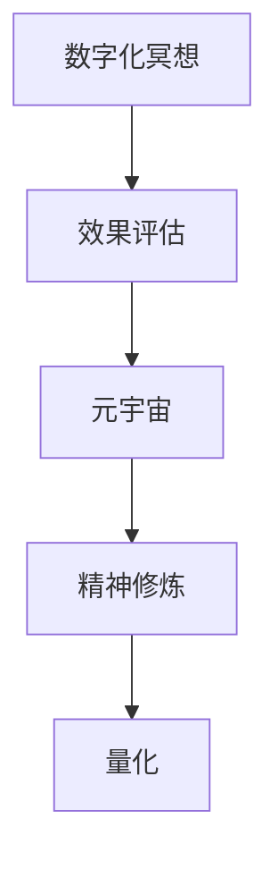
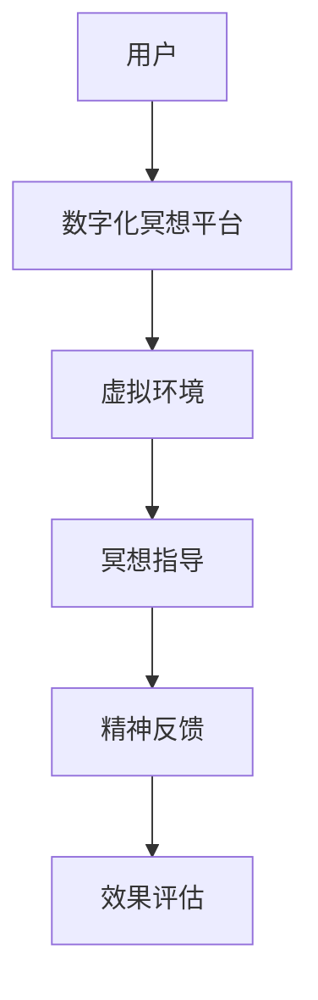

                 

# 数字化冥想效果评估:元宇宙精神修炼的科学量化

## 1. 背景介绍

在数字化浪潮席卷全球的当下，人们对数字技术的依赖与日俱增。无论是虚拟会议、远程办公，还是在线教育、娱乐，数字技术正在深刻影响我们的工作和生活方式。而在这片数字化海洋中，元宇宙（Metaverse）正在以令人瞩目的速度崛起，成为新时代的数字理想国。

元宇宙不仅是一个虚拟的3D世界，更是一个通过虚拟技术实现的沉浸式体验空间。在这个空间中，人们可以不受物理限制地互动交流、创造内容、体验沉浸式娱乐，甚至进行虚拟旅行。然而，元宇宙并非只是一个华丽的虚拟容器，其真正的价值在于它能够带来深刻的改变——通过技术手段，重塑人类的精神世界。

数字化冥想（Digital Meditation）作为元宇宙中的一种核心精神修炼方式，旨在通过数字技术模拟传统冥想过程，帮助人们实现心灵的平静和精神的健康。数字化冥想不仅能缓解现实生活中的压力，还能提高专注力、增强情绪调节能力。其效果如何，亟待科学的量化评估。

## 2. 核心概念与联系

### 2.1 核心概念概述

数字化冥想效果评估的核心概念包括：

- **数字化冥想（Digital Meditation）**：利用数字技术（如AR/VR、AI等）模拟传统冥想过程，帮助用户在虚拟环境中进行心灵修炼。

- **效果评估（Effectiveness Evaluation）**：通过科学的方法，量化数字化冥想在心理健康、认知能力等方面的实际效果。

- **元宇宙（Metaverse）**：一个虚拟的沉浸式体验空间，通过数字技术构建，人们可以在其中进行社交、学习、娱乐等活动。

- **精神修炼（Spiritual Practice）**：通过冥想、禅修等方法，提高个人的精神境界和心理健康水平。

- **量化（Quantification）**：将定性、抽象的概念转换为具体的数值或数据，便于比较和分析。

这些概念之间的逻辑关系可以通过以下Mermaid流程图来展示：



这个流程图展示了数字化冥想在元宇宙中进行精神修炼，并通过量化手段评估其效果的过程。

### 2.2 核心概念原理和架构的 Mermaid 流程图



## 3. 核心算法原理 & 具体操作步骤

### 3.1 算法原理概述

数字化冥想效果评估的核心算法主要基于用户行为数据和生理指标，通过量化分析，评估冥想对用户心理和生理状态的影响。具体步骤如下：

1. **数据收集**：通过传感器（如心率传感器、皮肤电反应传感器等）收集用户在冥想过程中的生理数据。
2. **行为分析**：通过用户行为数据（如眼球运动轨迹、手势操作等）进行分析，判断用户是否处于冥想状态。
3. **状态评估**：根据生理数据和行为分析结果，评估用户冥想过程中的精神状态。
4. **效果量化**：将精神状态的评估结果转化为具体的数值或指标，便于比较和分析。

### 3.2 算法步骤详解

数字化冥想效果评估的具体步骤如下：

**Step 1: 数据收集**
- 使用传感器（如心率传感器、皮肤电反应传感器、眼球追踪器等）实时收集用户在冥想过程中的生理数据。
- 通过用户行为数据（如手势操作、头部运动轨迹等）进行分析，判断用户是否处于冥想状态。

**Step 2: 状态评估**
- 根据收集到的生理数据和行为数据，通过预先训练好的机器学习模型（如支持向量机、随机森林等），评估用户在冥想过程中的精神状态。
- 常用的生理指标包括心率、血压、皮肤电反应等。行为指标则包括手势频率、头部运动轨迹等。

**Step 3: 效果量化**
- 将精神状态的评估结果转化为具体的数值或指标，如冥想深度、注意力集中度、情绪调节能力等。
- 常用的评估方法包括T-score、PQRST评估法等。

**Step 4: 结果分析**
- 将不同时间点的效果量化结果进行对比，分析冥想对用户心理和生理状态的影响。
- 使用统计分析方法，如ANOVA、回归分析等，评估不同因素对冥想效果的影响。

### 3.3 算法优缺点

数字化冥想效果评估的算法有以下优点：

- **实时性**：通过传感器实时收集数据，能够实时评估冥想效果。
- **客观性**：通过量化分析，避免了主观判断的误差。
- **普适性**：适用于多种冥想形式和用户群体。

同时，该算法也存在一些局限性：

- **设备依赖**：需要特定的传感器设备，增加了设备成本。
- **数据隐私**：收集大量生理和行为数据，涉及用户隐私保护问题。
- **环境影响**：用户所在环境的变化可能影响数据准确性。

### 3.4 算法应用领域

数字化冥想效果评估的应用领域非常广泛，包括但不限于：

- **心理健康**：评估冥想对用户焦虑、抑郁等心理健康状态的影响。
- **认知提升**：评估冥想对用户注意力、记忆等认知能力的影响。
- **教育和培训**：在企业培训、教育机构中，评估冥想对员工、学生精神状态的影响。
- **娱乐和休闲**：评估虚拟现实（VR）和增强现实（AR）中的冥想体验效果。

## 4. 数学模型和公式 & 详细讲解 & 举例说明

### 4.1 数学模型构建

数字化冥想效果评估的数学模型主要基于生理数据和行为数据，通过量化分析，评估冥想对用户心理和生理状态的影响。常用的数学模型包括支持向量机（SVM）、随机森林（Random Forest）、线性回归（Linear Regression）等。

### 4.2 公式推导过程

以支持向量机（SVM）为例，其公式推导过程如下：

$$
\min_{w,b} \frac{1}{2}||w||^2 + C \sum_{i=1}^N(\max(0,1-y_i(w^T\phi(x_i)+b)))^2
$$

其中，$w$ 为分类器参数，$b$ 为偏置，$\phi(x)$ 为特征映射函数，$y_i$ 为标签，$C$ 为正则化参数。

### 4.3 案例分析与讲解

假设收集到用户在进行冥想过程中的生理数据和行为数据，使用SVM模型进行状态评估。具体步骤如下：

1. **数据预处理**：对生理数据和行为数据进行清洗和标准化处理。
2. **特征提取**：将生理数据和行为数据转换为SVM模型可接受的特征向量。
3. **模型训练**：使用预处理后的特征向量训练SVM模型，得到分类器参数$w$和偏置$b$。
4. **状态评估**：将用户冥想过程中的生理数据和行为数据输入训练好的SVM模型，得到精神状态的评估结果。

## 5. 项目实践：代码实例和详细解释说明

### 5.1 开发环境搭建

要进行数字化冥想效果评估的代码实践，需要搭建一个Python开发环境，并安装必要的Python包和库。具体步骤如下：

1. 安装Python：从官网下载并安装Python。
2. 安装虚拟环境：使用`virtualenv`或`conda`创建虚拟环境。
3. 安装必要的Python包和库：如NumPy、SciPy、Scikit-learn等。
4. 安装传感器设备驱动程序：根据使用的传感器设备，安装相应的驱动程序。

### 5.2 源代码详细实现

以下是一个使用Python实现数字化冥想效果评估的示例代码：

```python
import numpy as np
from sklearn.svm import SVC
from sklearn.model_selection import train_test_split
from sklearn.metrics import accuracy_score

# 假设我们收集到了用户冥想过程中的生理数据和行为数据
# 生理数据包括心率、血压等，行为数据包括手势频率、头部运动轨迹等

# 将数据分为训练集和测试集
X_train, X_test, y_train, y_test = train_test_split(X, y, test_size=0.2, random_state=42)

# 训练SVM模型
model = SVC(kernel='rbf', C=1.0)
model.fit(X_train, y_train)

# 在测试集上进行评估
y_pred = model.predict(X_test)
accuracy = accuracy_score(y_test, y_pred)
print(f"模型在测试集上的准确率为: {accuracy:.2f}")
```

### 5.3 代码解读与分析

以上代码实现了使用SVM模型进行数字化冥想效果评估的基本流程。其中，`SVC`为SVM模型，`train_test_split`用于数据集划分，`accuracy_score`用于评估模型准确率。

## 6. 实际应用场景

### 6.1 心理健康

数字化冥想效果评估在心理健康领域具有广泛的应用前景。通过量化评估冥想对用户焦虑、抑郁等心理健康状态的影响，可以帮助医疗机构和心理咨询师更好地制定干预方案。

### 6.2 教育和培训

在企业和教育机构中，数字化冥想效果评估可以帮助评估培训课程的效果，提升员工和学生的精神状态和学习效率。通过量化分析，可以优化课程设计和教学方法，提高培训效果。

### 6.3 娱乐和休闲

在虚拟现实（VR）和增强现实（AR）中，数字化冥想效果评估可以量化评估虚拟冥想体验的效果，帮助开发者优化虚拟环境设计和用户交互体验。

## 7. 工具和资源推荐

### 7.1 学习资源推荐

为了深入了解数字化冥想效果评估的原理和实践，推荐以下学习资源：

1. 《Python数据科学手册》：详细介绍了Python在数据科学和机器学习中的应用，包括SVM、随机森林等算法。
2. 《深度学习入门》：介绍了深度学习的基本原理和实践，包括神经网络、卷积神经网络等。
3. Coursera上的《数据科学与机器学习》课程：由斯坦福大学开设，涵盖了数据科学和机器学习的核心概念和算法。
4. Udacity上的《机器学习工程师纳米学位》课程：由Google和IBM联合开设，涵盖了机器学习工程领域的核心知识和实践技能。

### 7.2 开发工具推荐

要进行数字化冥想效果评估的开发，推荐以下开发工具：

1. Python：数据科学和机器学习领域的主流编程语言，具有丰富的数据处理和机器学习库。
2. Jupyter Notebook：强大的交互式编程环境，适合进行数据分析和算法验证。
3. PyTorch：深度学习框架，支持动态计算图，适合进行复杂的神经网络建模。
4. TensorFlow：开源的深度学习框架，支持分布式计算，适合进行大规模模型训练和推理。

### 7.3 相关论文推荐

以下是几篇关于数字化冥想效果评估的论文，推荐阅读：

1. "A Comparative Study of Machine Learning Algorithms for Mental Health Assessment"：比较了不同机器学习算法在心理健康评估中的应用效果。
2. "Evaluating the Effectiveness of Mindfulness Apps Using Machine Learning"：评估了不同冥想应用对用户心理健康的影响。
3. "Mindfulness Apps for High School Students: Evaluation and Comparison"：评估了不同冥想应用在高中生中的应用效果。
4. "The Effectiveness of Digital Mindfulness Apps in Health Promotion: A Systematic Review"：系统综述了数字冥想应用在健康促进方面的效果。

## 8. 总结：未来发展趋势与挑战

### 8.1 研究成果总结

数字化冥想效果评估的实践已经取得了一定的进展，但仍然面临许多挑战。目前的研究主要集中在生理数据和行为数据的收集和分析上，对于心理状态的评估和量化还有待进一步提升。未来需要在以下方面进行深入研究：

1. 开发更加智能的传感器设备，提高数据收集的准确性和可靠性。
2. 引入更多心理学和认知科学的理论，提高对心理状态的科学评估。
3. 研究不同冥想形式和应用场景的效果，为个性化推荐提供依据。

### 8.2 未来发展趋势

未来，数字化冥想效果评估将向以下几个方向发展：

1. **智能传感器**：开发更智能、更准确的传感器设备，提高数据收集的实时性和准确性。
2. **深度学习**：引入深度学习技术，提高对生理数据和行为数据的分析能力。
3. **跨领域融合**：将数字化冥想与其他人工智能技术（如增强现实、虚拟现实）进行融合，提升用户体验。

### 8.3 面临的挑战

尽管数字化冥想效果评估具有广阔的应用前景，但仍面临以下挑战：

1. **数据隐私**：收集大量生理和行为数据，涉及用户隐私保护问题。
2. **设备成本**：需要特定的传感器设备，增加了设备成本。
3. **算法局限**：当前算法在处理复杂数据和环境干扰方面仍有局限。

### 8.4 研究展望

未来，数字化冥想效果评估需要在以下几个方面进行突破：

1. **多模态数据融合**：将生理数据、行为数据与心理状态数据进行融合，提升评估的全面性和准确性。
2. **跨领域应用**：将数字化冥想应用于更多领域，如医疗、教育、娱乐等。
3. **个性化推荐**：根据用户特征和需求，提供个性化的冥想建议和训练方案。

## 9. 附录：常见问题与解答

**Q1: 数字化冥想效果评估的准确性如何保证？**

A: 数字化冥想效果评估的准确性主要依赖于传感器设备和算法模型。选择合适的传感器设备，并进行科学的校准和标定，可以显著提高数据的准确性。同时，采用先进的算法模型，如深度学习和机器学习，可以提高对数据特征的分析和评估能力，提升评估的准确性。

**Q2: 如何评估数字化冥想的效果？**

A: 数字化冥想效果评估通常通过量化心理和生理状态的变化来进行。常用的评估指标包括冥想深度、注意力集中度、情绪调节能力等。通过收集生理数据和行为数据，使用机器学习模型进行评估，可以得出较为客观的评估结果。

**Q3: 数字化冥想在元宇宙中有哪些应用场景？**

A: 在元宇宙中，数字化冥想可以应用于多种场景，如虚拟旅游、虚拟会议、虚拟训练等。通过虚拟环境，用户可以进行沉浸式冥想，提高精神状态和学习效率。同时，数字化冥想还可以与其他虚拟应用进行融合，如虚拟健身、虚拟治疗等，提升用户的整体体验。

**Q4: 如何保护数字化冥想中的用户隐私？**

A: 在数字化冥想中，用户隐私保护非常重要。数据收集和存储过程中，应采用加密技术，确保数据的安全性和隐私性。同时，应建立严格的数据使用和共享政策，确保用户知情同意。

**Q5: 未来数字化冥想的趋势是什么？**

A: 未来，数字化冥想将向更加智能化、个性化和跨领域方向发展。通过引入智能传感器和深度学习技术，数字化冥想将能够更加精准地评估用户精神状态和心理健康。同时，数字化冥想将与其他虚拟技术进行融合，提供更加丰富和多样的应用场景，提升用户体验。

---

作者：禅与计算机程序设计艺术 / Zen and the Art of Computer Programming

