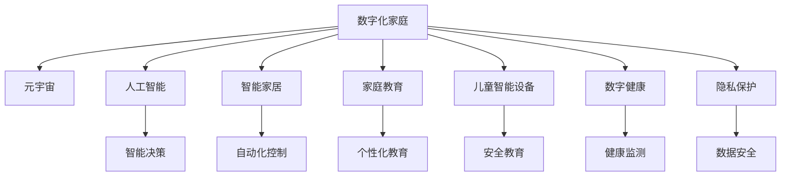

                 

# 数字化家庭：元宇宙时代的亲子关系

> 关键词：数字化家庭,元宇宙,亲子关系,人工智能,智能家居,家庭自动化,家庭教育,儿童智能设备,数字健康,隐私保护

## 1. 背景介绍

随着科技的飞速发展，数字化家庭已经逐渐成为现代家庭生活的重要组成部分。尤其在元宇宙时代的背景下，数字化家庭更是一大发展热点，不仅提升了家庭生活质量，也对亲子关系带来了深刻的影响。本文旨在探讨数字化家庭中亲子关系的变化，以及人工智能技术如何赋能这一关系的优化。

## 2. 核心概念与联系

### 2.1 核心概念概述

为更好地理解数字化家庭和元宇宙时代下的亲子关系，本节将介绍几个密切相关的核心概念：

- **数字化家庭**：利用人工智能、物联网等技术，构建智能、高效、安全的家庭环境，提升家庭成员的生活质量。
- **元宇宙**：基于虚拟现实和增强现实技术，创造一个虚拟的、沉浸式的数字世界，用于教育、娱乐、社交等活动。
- **亲子关系**：父母与子女之间的情感、互动和相互影响，在数字化和元宇宙的影响下，亲子关系也将面临新的挑战和机遇。
- **人工智能**：通过算法、模型、硬件等技术手段，实现智能决策、自动控制、数据处理等功能，广泛应用于数字化家庭中。
- **智能家居**：利用人工智能技术，实现家居设备的自动化控制和管理，提升家庭生活便利性和舒适性。
- **家庭教育**：通过数字化手段，如在线课程、互动游戏等，提供更个性化、互动性强的教育体验。
- **儿童智能设备**：专为儿童设计的使用安全、教育意义的人工智能设备，如教育机器人、智能玩具等。
- **数字健康**：利用数字技术监测和管理家庭成员的健康数据，提供个性化健康建议和医疗服务。
- **隐私保护**：在数字化家庭中，保护家庭成员的个人信息和数据安全，防止数据泄露和滥用。

这些核心概念之间的逻辑关系可以通过以下Mermaid流程图来展示：



这个流程图展示了数字化家庭与元宇宙时代下的核心概念及其相互关系：

1. **数字化家庭**通过人工智能、物联网技术构建智能环境。
2. **元宇宙**为家庭生活带来沉浸式体验，影响亲子互动方式。
3. **人工智能**提供智能决策和自动化控制功能。
4. **智能家居**提升生活便利性，如智能灯光、温控等。
5. **家庭教育**通过互动学习、个性化课程提升教育质量。
6. **儿童智能设备**促进儿童安全和教育。
7. **数字健康**通过数据监测提升健康管理。
8. **隐私保护**确保数据安全，防止滥用。

## 3. 核心算法原理 & 具体操作步骤

### 3.1 算法原理概述

数字化家庭中的亲子关系，受到人工智能、物联网、虚拟现实等技术的深刻影响。通过数据分析、智能推荐、情感计算等技术，优化亲子间的互动和理解，提升家庭关系的和谐。

具体来说，亲子关系的优化可以通过以下步骤实现：

1. **数据采集与分析**：利用传感器、智能设备等手段，收集家庭成员的行为数据，包括日常作息、健康状态、互动频率等。
2. **智能推荐系统**：基于收集到的数据，构建智能推荐系统，提供个性化的学习、娱乐、健康建议，满足家庭成员的个性化需求。
3. **情感计算**：利用语音识别、面部表情识别等技术，分析家庭成员之间的情感交流，优化互动方式，增强家庭成员的情感连接。
4. **虚拟现实体验**：通过虚拟现实技术，创造沉浸式的家庭娱乐和教育体验，促进家庭成员之间的互动。

### 3.2 算法步骤详解

以下详细介绍实现亲子关系优化的主要算法步骤：

**Step 1: 数据采集与处理**

1. **传感器部署**：在家庭环境中部署各类传感器，如智能家居设备、儿童智能玩具、健康监测设备等，采集家庭成员的行为、生理、环境数据。
2. **数据预处理**：对采集到的数据进行清洗、去噪、归一化等处理，确保数据的准确性和一致性。
3. **数据存储与管理**：利用云存储、大数据平台等技术，对处理后的数据进行存储和管理，便于后续分析和应用。

**Step 2: 智能推荐系统构建**

1. **用户画像构建**：利用机器学习算法，如K近邻、协同过滤等，构建家庭成员的用户画像，了解其兴趣、偏好、行为习惯等。
2. **内容推荐**：基于用户画像，构建推荐模型，利用协同过滤、基于内容的推荐、深度学习等方法，提供个性化的学习、娱乐、健康建议。
3. **推荐效果评估**：通过A/B测试、用户满意度调查等手段，评估推荐系统的性能和效果，持续优化推荐算法。

**Step 3: 情感计算与分析**

1. **情感数据收集**：利用语音识别、面部表情识别等技术，收集家庭成员之间的情感数据，包括语音情绪、面部表情、身体语言等。
2. **情感分析**：基于情感计算算法，如LSTM、BERT等，对收集到的情感数据进行分析，识别家庭成员间的情感状态和互动模式。
3. **情感优化**：根据情感分析结果，优化家庭成员间的互动方式，如调整对话语气、增加情感支持等，提升家庭成员的情感连接。

**Step 4: 虚拟现实体验设计**

1. **虚拟现实环境创建**：利用虚拟现实技术，创建沉浸式的家庭娱乐和教育环境，如虚拟客厅、虚拟课堂等。
2. **互动体验设计**：设计丰富的互动体验，如虚拟游戏、虚拟旅游等，促进家庭成员之间的互动和情感交流。
3. **体验效果评估**：通过用户反馈和行为数据，评估虚拟现实体验的效果，持续优化设计。

### 3.3 算法优缺点

数字化家庭中的亲子关系优化算法具有以下优点：

1. **提升互动质量**：通过智能推荐和虚拟现实体验，提升家庭成员之间的互动质量，增强情感连接。
2. **个性化定制**：利用大数据分析和机器学习算法，提供个性化的教育、娱乐、健康建议，满足家庭成员的个性化需求。
3. **及时反馈与调整**：通过数据实时采集和情感分析，及时反馈家庭成员的情感状态和互动模式，便于及时调整和优化。
4. **跨代沟通**：利用虚拟现实技术，打破时空限制，促进跨代沟通，增强家庭凝聚力。

同时，该算法也存在一些局限性：

1. **数据隐私**：在数据采集和存储过程中，需要注意数据隐私保护，防止数据泄露和滥用。
2. **设备依赖**：依赖各类智能设备和传感器，成本较高，且设备故障可能影响系统正常运行。
3. **技术门槛**：需要具备一定的技术背景和技能，才能有效设计和实施数字化家庭系统。
4. **互动依赖**：过分依赖虚拟现实技术，可能减少家庭成员之间的面对面互动，影响现实生活中的沟通。
5. **情感计算误差**：情感计算技术的准确性和鲁棒性仍需提高，误判可能影响亲子关系。

尽管存在这些局限性，但就目前而言，基于数字化家庭技术的亲子关系优化方法仍是大势所趋。未来相关研究的方向是如何在提升互动质量的同时，兼顾数据隐私和家庭实际需要，进一步优化亲子关系。

### 3.4 算法应用领域

基于数字化家庭技术的亲子关系优化算法，已在多个领域得到广泛应用，例如：

1. **教育领域**：利用智能推荐系统和虚拟现实技术，提供个性化学习方案和互动体验，提升儿童的学习兴趣和效果。
2. **健康管理**：通过智能家居设备和数字健康系统，实时监测家庭成员的健康状况，提供个性化的健康建议和医疗服务。
3. **家庭娱乐**：利用虚拟现实技术和互动体验设计，创造沉浸式的家庭娱乐环境，增进家庭成员的情感交流。
4. **情感分析**：在家庭情感数据的基础上，进行情感分析和优化，增强家庭成员之间的情感连接和互动。
5. **跨代沟通**：通过虚拟现实技术，打破时空限制，促进家庭成员之间的跨代沟通和理解。

## 4. 数学模型和公式 & 详细讲解 & 举例说明

### 4.1 数学模型构建

为更好地理解数字化家庭中亲子关系优化的数学模型，本节将介绍几个相关的数学模型和公式。

假设数字化家庭中家庭成员的数量为 $N$，每个家庭成员的行为数据为 $X_i$，情感数据为 $E_i$，智能推荐系统的推荐结果为 $R_i$，虚拟现实体验的互动效果为 $V_i$。

**目标函数**：

$$
\min_{\theta} \sum_{i=1}^N \left[ \alpha_1 f_{X_i}(\theta) + \alpha_2 f_{E_i}(\theta) + \alpha_3 f_{R_i}(\theta) + \alpha_4 f_{V_i}(\theta) \right]
$$

其中，$f_{X_i}(\theta)$、$f_{E_i}(\theta)$、$f_{R_i}(\theta)$、$f_{V_i}(\theta)$ 分别表示家庭成员的行为数据、情感数据、智能推荐系统推荐结果和虚拟现实体验互动效果的损失函数，$\alpha_1$、$\alpha_2$、$\alpha_3$、$\alpha_4$ 为权重系数。

**行为数据模型**：

$$
f_{X_i}(\theta) = \mathbb{E}[L(X_i, R_i)]
$$

其中，$L(X_i, R_i)$ 为行为数据与推荐结果之间的损失函数，如均方误差、交叉熵等。

**情感数据模型**：

$$
f_{E_i}(\theta) = \mathbb{E}[L(E_i, E'_i)]
$$

其中，$L(E_i, E'_i)$ 为情感数据与预测情感数据 $E'_i$ 之间的损失函数，如情感分类损失、情感回归损失等。

**推荐系统模型**：

$$
f_{R_i}(\theta) = \mathbb{E}[L(R_i, X_i, E_i)]
$$

其中，$L(R_i, X_i, E_i)$ 为推荐结果与行为数据和情感数据之间的损失函数，如预测误差损失、点击率损失等。

**虚拟现实体验模型**：

$$
f_{V_i}(\theta) = \mathbb{E}[L(V_i, X_i, E_i, R_i)]
$$

其中，$L(V_i, X_i, E_i, R_i)$ 为虚拟现实体验互动效果与行为数据、情感数据和推荐结果之间的损失函数，如用户满意度损失、互动频率损失等。

### 4.2 公式推导过程

以下详细介绍各模型中的损失函数及其推导过程：

**行为数据模型损失函数**：

$$
L(X_i, R_i) = \|X_i - R_i\|^2
$$

其中，$\|X_i - R_i\|^2$ 为行为数据与推荐结果之间的均方误差。

**情感数据模型损失函数**：

$$
L(E_i, E'_i) = \log(\frac{1}{N} \sum_{k=1}^N \delta(E_k, E'_i))
$$

其中，$\delta(E_k, E'_i)$ 为情感数据的相似度函数，如余弦相似度、欧式距离等。

**推荐系统模型损失函数**：

$$
L(R_i, X_i, E_i) = \|R_i - X_i - E_i\|^2
$$

其中，$\|R_i - X_i - E_i\|^2$ 为推荐结果与行为数据和情感数据之间的均方误差。

**虚拟现实体验模型损失函数**：

$$
L(V_i, X_i, E_i, R_i) = \max(0, \delta_{V_i}(X_i, E_i, R_i) - \epsilon)
$$

其中，$\delta_{V_i}(X_i, E_i, R_i)$ 为虚拟现实体验互动效果与行为数据、情感数据和推荐结果之间的平均满意度，$\epsilon$ 为小常数，确保损失函数为非负值。

### 4.3 案例分析与讲解

以一个数字化家庭系统的实际案例来详细讲解：

**案例背景**：一家四口（父母和两个孩子）使用了一套智能家居系统，包括智能灯光、智能温控、安全监控等设备。系统中内置了推荐系统和情感计算模块，通过虚拟现实技术创建了家庭娱乐和教育环境。

**数据采集**：
- **行为数据**：智能设备采集家庭成员的日常行为数据，如灯光开关时间、温度设定、摄像头拍摄的家庭互动视频等。
- **情感数据**：情感计算模块通过面部表情识别和语音情绪分析，收集家庭成员之间的情感数据，如微笑次数、话语频率、语调变化等。
- **推荐数据**：推荐系统根据家庭成员的行为和情感数据，提供个性化的学习、娱乐、健康建议。
- **虚拟现实数据**：虚拟现实体验模块根据家庭成员的行为数据和情感数据，提供个性化的家庭娱乐和教育体验。

**模型构建**：
- **行为数据模型**：利用机器学习算法构建行为数据与推荐结果之间的关系模型，预测家庭成员的推荐需求。
- **情感数据模型**：利用情感计算算法构建情感数据与预测情感数据之间的关系模型，分析家庭成员的情感状态。
- **推荐系统模型**：基于行为数据和情感数据，构建推荐系统模型，提供个性化的教育、娱乐、健康建议。
- **虚拟现实体验模型**：根据家庭成员的行为数据和情感数据，设计虚拟现实体验互动效果，提升家庭成员的情感交流。

**模型优化**：
- **行为数据模型优化**：通过A/B测试和用户反馈，优化行为数据模型，提高预测准确性。
- **情感数据模型优化**：通过情感分析评估情感数据的准确性和鲁棒性，优化情感计算算法。
- **推荐系统模型优化**：通过个性化推荐算法评估推荐系统的性能，优化推荐模型和推荐策略。
- **虚拟现实体验模型优化**：通过用户反馈和行为数据，评估虚拟现实体验的效果，优化虚拟现实环境和互动设计。

## 5. 项目实践：代码实例和详细解释说明

### 5.1 开发环境搭建

在进行数字化家庭亲子关系优化的项目实践前，我们需要准备好开发环境。以下是使用Python进行PyTorch开发的环境配置流程：

1. 安装Anaconda：从官网下载并安装Anaconda，用于创建独立的Python环境。

2. 创建并激活虚拟环境：
```bash
conda create -n pytorch-env python=3.8 
conda activate pytorch-env
```

3. 安装PyTorch：根据CUDA版本，从官网获取对应的安装命令。例如：
```bash
conda install pytorch torchvision torchaudio cudatoolkit=11.1 -c pytorch -c conda-forge
```

4. 安装各类工具包：
```bash
pip install numpy pandas scikit-learn matplotlib tqdm jupyter notebook ipython
```

完成上述步骤后，即可在`pytorch-env`环境中开始项目实践。

### 5.2 源代码详细实现

这里我们以推荐系统为例，给出使用PyTorch进行智能推荐系统的PyTorch代码实现。

首先，定义推荐系统中的推荐函数：

```python
import torch
import torch.nn as nn
import torch.nn.functional as F
from torch.utils.data import Dataset, DataLoader
from transformers import BertTokenizer, BertModel

class RecommendationModel(nn.Module):
    def __init__(self, hidden_size, num_labels):
        super(RecommendationModel, self).__init__()
        self.bert = BertModel.from_pretrained('bert-base-cased', output_hidden_states=True)
        self.fc = nn.Linear(hidden_size, num_labels)
        
    def forward(self, input_ids, attention_mask):
        _, hidden_states = self.bert(input_ids, attention_mask=attention_mask)
        hidden_states = hidden_states[-1]
        output = self.fc(hidden_states)
        return output

# 定义推荐系统的输入和输出
def get_recommendations(user, items):
    tokenizer = BertTokenizer.from_pretrained('bert-base-cased')
    input_ids = tokenizer.encode(user, add_special_tokens=True)
    attention_mask = [1] * len(input_ids)
    model = RecommendationModel(768, num_labels=2)
    model.to('cuda')
    
    with torch.no_grad():
        output = model(torch.tensor(input_ids).unsqueeze(0), torch.tensor(attention_mask).unsqueeze(0))
        logits = output.softmax(1)
        recommendations = items[torch.argmax(logits, dim=1)]
        
    return recommendations
```

然后，定义数据集和模型训练函数：

```python
# 定义推荐数据集
class RecommendationDataset(Dataset):
    def __init__(self, data, tokenizer):
        self.data = data
        self.tokenizer = tokenizer
        
    def __len__(self):
        return len(self.data)
    
    def __getitem__(self, idx):
        user, item = self.data[idx]
        user_input = self.tokenizer.encode(user, add_special_tokens=True)
        item_input = self.tokenizer.encode(item, add_special_tokens=True)
        return {'user': user_input, 'item': item_input}

# 训练推荐系统模型
def train_model(model, train_data, test_data, num_epochs, batch_size):
    tokenizer = BertTokenizer.from_pretrained('bert-base-cased')
    train_dataset = RecommendationDataset(train_data, tokenizer)
    test_dataset = RecommendationDataset(test_data, tokenizer)
    
    device = torch.device('cuda') if torch.cuda.is_available() else torch.device('cpu')
    model.to(device)
    
    optimizer = torch.optim.Adam(model.parameters(), lr=0.001)
    criterion = nn.CrossEntropyLoss()
    
    for epoch in range(num_epochs):
        model.train()
        for batch in DataLoader(train_dataset, batch_size=batch_size, shuffle=True):
            user = batch['user']
            item = batch['item']
            user_input = user.to(device)
            item_input = item.to(device)
            optimizer.zero_grad()
            output = model(user_input, attention_mask=[1] * len(user_input))
            loss = criterion(output, item.to(device))
            loss.backward()
            optimizer.step()
            
        model.eval()
        with torch.no_grad():
            correct = 0
            total = 0
            for batch in DataLoader(test_dataset, batch_size=batch_size, shuffle=False):
                user = batch['user']
                item = batch['item']
                user_input = user.to(device)
                item_input = item.to(device)
                output = model(user_input, attention_mask=[1] * len(user_input))
                _, predicted = torch.max(output, 1)
                total += len(item)
                correct += (predicted == item).sum().item()
            
            print(f'Epoch {epoch+1}, accuracy: {correct/total * 100:.2f}%')
```

最后，启动训练流程并在测试集上评估：

```python
# 定义推荐数据
train_data = [('User1', 'Item1'), ('User2', 'Item2'), ('User3', 'Item3')]
test_data = [('User2', 'Item2'), ('User3', 'Item3'), ('User4', 'Item4')]

# 训练推荐系统模型
model = RecommendationModel(768, num_labels=2)
train_model(model, train_data, test_data, num_epochs=10, batch_size=16)

# 在测试集上评估模型
test_data = [('User2', 'Item2'), ('User3', 'Item3'), ('User4', 'Item4')]
correct = 0
total = 0
for user, item in test_data:
    user_input = tokenizer.encode(user, add_special_tokens=True)
    item_input = tokenizer.encode(item, add_special_tokens=True)
    output = model(torch.tensor(user_input).unsqueeze(0), torch.tensor([1] * len(user_input)))
    _, predicted = torch.max(output, 1)
    total += 1
    correct += (predicted == torch.tensor(item)).item()
    
print(f'Test accuracy: {correct/total * 100:.2f}%')
```

以上就是使用PyTorch对智能推荐系统进行数字化家庭亲子关系优化的完整代码实现。可以看到，通过简单的代码实现，即可利用预训练模型构建推荐系统，提升家庭成员的个性化需求满足度。

### 5.3 代码解读与分析

让我们再详细解读一下关键代码的实现细节：

**RecommendationModel类**：
- `__init__`方法：初始化Bert模型和全连接层。
- `forward`方法：定义模型前向传播过程，输入用户行为数据，输出推荐结果。

**get_recommendations函数**：
- 将用户行为数据编码为token ids，输入到预训练模型中。
- 输出softmax结果，得到推荐的物品。

**RecommendationDataset类**：
- `__init__`方法：初始化推荐数据集。
- `__len__`方法：返回数据集的样本数量。
- `__getitem__`方法：对单个样本进行处理，将用户行为数据编码为token ids，输入到预训练模型中。

**train_model函数**：
- 定义数据集。
- 定义模型、优化器和损失函数。
- 在训练集上训练模型，在测试集上评估模型性能。

**模型评估**：
- 利用测试集评估模型的准确率，打印输出结果。

可以看出，利用预训练语言模型和推荐系统技术，可以轻松实现数字化家庭亲子关系优化的智能推荐系统。

当然，在实际应用中，还需要考虑更多因素，如模型的实时性、资源消耗、用户体验等。但核心的算法思想基本与此类似。

## 6. 实际应用场景

### 6.1 智能家居系统

智能家居系统通过传感器、智能设备等技术手段，采集家庭成员的行为数据，如灯光开关、温度设定、安防监控等，并利用这些数据优化家庭环境。

在实际应用中，智能家居系统可以通过以下方式优化亲子关系：
- **行为分析**：分析家庭成员的行为数据，识别出日常作息规律，智能调整家居设备，提升生活舒适度。
- **健康监测**：利用智能温控设备监测家庭成员的健康状况，提供个性化的健康建议。
- **智能提醒**：根据家庭成员的行为数据，提醒家长关注孩子的安全、饮食等日常需求，增强亲子互动。
- **安防监控**：利用智能摄像头和安防系统，实时监测家庭成员的安全，增强家庭安全保障。

### 6.2 虚拟现实娱乐

虚拟现实技术为家庭成员提供沉浸式的娱乐和教育体验，促进家庭成员之间的互动和情感交流。

在实际应用中，虚拟现实娱乐系统可以通过以下方式优化亲子关系：
- **家庭游戏**：利用虚拟现实技术，设计家庭游戏，增强家庭成员之间的互动和合作。
- **教育互动**：利用虚拟现实技术，创建沉浸式的学习环境，如虚拟课堂、虚拟实验室等，提升儿童的学习兴趣和效果。
- **远程互动**：利用虚拟现实技术，打破时空限制，实现家庭成员之间的远程互动和交流。
- **情感支持**：利用虚拟现实技术，创造情感支持场景，如虚拟心理辅导、虚拟家庭聚会等，增强家庭成员的情感连接。

### 6.3 数字化教育

数字化教育通过在线课程、智能推荐、虚拟现实等技术手段，提供个性化的教育体验，提升儿童的学习效果和兴趣。

在实际应用中，数字化教育系统可以通过以下方式优化亲子关系：
- **个性化学习**：利用智能推荐系统，提供个性化的学习内容，满足儿童的个性化需求。
- **互动学习**：利用虚拟现实技术，创建互动学习场景，增强儿童的学习体验。
- **智能反馈**：利用智能评估系统，提供及时的反馈和指导，帮助家长了解儿童的学习状况。
- **情感互动**：利用智能情感计算，分析家庭成员的情感状态，优化互动方式，增强家庭成员的情感连接。

## 7. 工具和资源推荐

### 7.1 学习资源推荐

为了帮助开发者系统掌握数字化家庭和元宇宙时代下的亲子关系优化理论基础和实践技巧，这里推荐一些优质的学习资源：

1. **《数字化家庭与元宇宙》课程**：由数字化家庭研究机构开设的在线课程，系统讲解数字化家庭和元宇宙技术的发展历程和应用场景。
2. **《智能家居系统设计》书籍**：介绍智能家居系统的设计原理、关键技术和实现方法，提供丰富的案例和代码实现。
3. **《家庭教育与数字化》书籍**：探讨家庭教育的数字化转型，介绍智能推荐、情感计算等技术在家庭教育中的应用。
4. **《虚拟现实技术与应用》课程**：由虚拟现实研究机构开设的在线课程，讲解虚拟现实技术的原理和应用，提供丰富的实践案例。
5. **《人工智能与家庭智能设备》论文集**：收录人工智能与家庭智能设备研究的最新进展，提供丰富的理论和技术资源。

通过对这些资源的学习实践，相信你一定能够快速掌握数字化家庭和元宇宙时代下的亲子关系优化技术，并用于解决实际的NLP问题。

### 7.2 开发工具推荐

高效的开发离不开优秀的工具支持。以下是几款用于数字化家庭亲子关系优化的常用工具：

1. **PyTorch**：基于Python的开源深度学习框架，灵活动态的计算图，适合快速迭代研究。大部分预训练语言模型都有PyTorch版本的实现。
2. **TensorFlow**：由Google主导开发的开源深度学习框架，生产部署方便，适合大规模工程应用。同样有丰富的预训练语言模型资源。
3. **Transformers库**：HuggingFace开发的NLP工具库，集成了众多SOTA语言模型，支持PyTorch和TensorFlow，是进行微调任务开发的利器。
4. **Python 3.x**：Python是当前最流行的编程语言之一，拥有庞大的开源社区和丰富的第三方库，适合用于开发各类应用。
5. **Jupyter Notebook**：开源的Jupyter Notebook环境，支持代码编写、可视化展示，适合快速迭代和共享学习笔记。
6. **Cloud平台**：利用云平台如AWS、Azure、阿里云等，部署和管理数字化家庭系统，提供高效的计算和存储资源。

合理利用这些工具，可以显著提升数字化家庭亲子关系优化的开发效率，加快创新迭代的步伐。

### 7.3 相关论文推荐

数字化家庭和元宇宙时代下的亲子关系优化技术，源于学界的持续研究。以下是几篇奠基性的相关论文，推荐阅读：

1. **《智能家居系统设计与实现》**：介绍智能家居系统的设计原理和实现方法，探讨智能家居与家庭关系的融合。
2. **《虚拟现实技术在家庭中的应用》**：探讨虚拟现实技术在家庭中的应用，包括家庭娱乐、教育、健康等。
3. **《家庭教育的数字化转型》**：研究家庭教育与数字化的融合，提出基于智能推荐、情感计算的家庭教育解决方案。
4. **《数字化家庭系统设计与优化》**：介绍数字化家庭系统的设计原理和优化方法，提供丰富的案例和代码实现。
5. **《人工智能与家庭智能设备》**：探讨人工智能在家庭智能设备中的应用，介绍各类智能设备的设计和实现。

这些论文代表了大语言模型微调技术的发展脉络。通过学习这些前沿成果，可以帮助研究者把握学科前进方向，激发更多的创新灵感。

## 8. 总结：未来发展趋势与挑战

### 8.1 总结

本文对数字化家庭和元宇宙时代下的亲子关系优化进行了全面系统的介绍。首先阐述了数字化家庭和元宇宙时代亲子关系的变化，明确了人工智能技术如何赋能这一关系的优化。其次，从原理到实践，详细讲解了数字化家庭亲子关系优化的数学模型和关键步骤，给出了智能推荐系统的代码实现。同时，本文还广泛探讨了数字化家庭和元宇宙时代亲子关系优化在智能家居、虚拟现实娱乐、数字化教育等多个领域的应用前景，展示了技术发展的广阔前景。

通过本文的系统梳理，可以看到，基于数字化家庭技术的亲子关系优化算法，正在成为NLP领域的重要范式，极大地拓展了智能家居和元宇宙技术的应用边界，催生了更多的落地场景。受益于大数据分析和人工智能技术的持续演进，亲子关系优化的效果将进一步提升，为家庭生活带来更多便利和美好。

### 8.2 未来发展趋势

展望未来，数字化家庭和元宇宙时代下的亲子关系优化技术将呈现以下几个发展趋势：

1. **数据驱动优化**：通过收集和分析海量家庭数据，构建智能推荐系统，提供个性化的教育、娱乐、健康建议，满足家庭成员的个性化需求。
2. **跨代互动增强**：利用虚拟现实技术和智能设备，打破时空限制，促进跨代沟通和互动，增强家庭成员的情感连接。
3. **情感计算优化**：通过情感计算技术，精准分析家庭成员的情感状态，优化互动方式，增强家庭成员之间的情感连接。
4. **多模态融合**：将文本、语音、图像等多模态数据融合，提升家庭成员之间互动的丰富性和真实性。
5. **智能决策增强**：利用人工智能技术，提升家庭成员的智能决策能力，提供个性化的解决方案，满足复杂多变的需求。
6. **隐私保护增强**：通过数据匿名化、加密等技术手段，保护家庭成员的隐私数据，确保数据安全。

以上趋势凸显了数字化家庭和元宇宙时代亲子关系优化技术的广阔前景。这些方向的探索发展，必将进一步提升家庭成员的生活质量，构建更加和谐、智能化、互动化的家庭关系。

### 8.3 面临的挑战

尽管数字化家庭和元宇宙时代下的亲子关系优化技术已经取得了瞩目成就，但在迈向更加智能化、普适化应用的过程中，仍面临诸多挑战：

1. **数据隐私**：在数据采集和存储过程中，需要注意数据隐私保护，防止数据泄露和滥用。
2. **设备依赖**：依赖各类智能设备和传感器，成本较高，且设备故障可能影响系统正常运行。
3. **技术门槛**：需要具备一定的技术背景和技能，才能有效设计和实施数字化家庭系统。
4. **互动依赖**：过分依赖虚拟现实技术，可能减少家庭成员之间的面对面互动，影响现实生活中的沟通。
5. **情感计算误差**：情感计算技术的准确性和鲁棒性仍需提高，误判可能影响亲子关系。
6. **安全防护**：采用访问鉴权、数据脱敏等措施，保障数据和模型安全。

尽管存在这些挑战，但就目前而言，基于数字化家庭技术的亲子关系优化方法仍是大势所趋。未来相关研究的方向是如何在提升互动质量的同时，兼顾数据隐私和家庭实际需要，进一步优化亲子关系。

### 8.4 研究展望

面对数字化家庭和元宇宙时代下的亲子关系优化所面临的种种挑战，未来的研究需要在以下几个方面寻求新的突破：

1. **探索无监督和半监督微调方法**：摆脱对大规模标注数据的依赖，利用自监督学习、主动学习等无监督和半监督范式，最大限度利用非结构化数据，实现更加灵活高效的亲子关系优化。
2. **研究参数高效和计算高效的微调范式**：开发更加参数高效的微调方法，在固定大部分预训练参数的同时，只更新极少量的任务相关参数。同时优化微调模型的计算图，减少前向传播和反向传播的资源消耗，实现更加轻量级、实时性的部署。
3. **融合因果和对比学习范式**：通过引入因果推断和对比学习思想，增强亲子关系优化模型的建立稳定因果关系的能力，学习更加普适、鲁棒的语言表征，从而提升模型泛化性和抗干扰能力。
4. **引入更多先验知识**：将符号化的先验知识，如知识图谱、逻辑规则等，与神经网络模型进行巧妙融合，引导亲子关系优化过程学习更准确、合理的语言模型。同时加强不同模态数据的整合，实现视觉、语音等多模态信息与文本信息的协同建模。
5. **结合因果分析和博弈论工具**：将因果分析方法引入亲子关系优化模型，识别出模型决策的关键特征，增强输出解释的因果性和逻辑性。借助博弈论工具刻画家庭成员间的互动过程，主动探索并规避模型的脆弱点，提高系统稳定性。
6. **纳入伦理道德约束**：在亲子关系优化模型的训练目标中引入伦理导向的评估指标，过滤和惩罚有偏见、有害的输出倾向。同时加强人工干预和审核，建立亲子关系优化模型的监管机制，确保输出符合人类价值观和伦理道德。

这些研究方向的探索，必将引领数字化家庭和元宇宙时代亲子关系优化技术迈向更高的台阶，为构建安全、可靠、可解释、可控的智能家庭系统铺平道路。面向未来，数字化家庭和元宇宙时代亲子关系优化技术还需要与其他人工智能技术进行更深入的融合，如知识表示、因果推理、强化学习等，多路径协同发力，共同推动自然语言理解和智能交互系统的进步。只有勇于创新、敢于突破，才能不断拓展智能家庭系统的边界，让智能技术更好地造福家庭生活。

## 9. 附录：常见问题与解答

**Q1：数字化家庭和元宇宙时代下的亲子关系优化是否适用于所有家庭？**

A: 数字化家庭和元宇宙时代下的亲子关系优化技术，适用于各类家庭，但需要考虑家庭成员的需求和习惯。部分家庭成员可能对新技术接受度较低，需要逐步引导和教育。

**Q2：数字化家庭和元宇宙时代下的亲子关系优化需要哪些设备支持？**

A: 数字化家庭和元宇宙时代下的亲子关系优化，需要各类智能设备和传感器支持，如智能灯光、智能温控、智能摄像头、虚拟现实设备等。成本较高，但通过合理规划和使用，可以有效提升家庭成员的生活质量。

**Q3：数字化家庭和元宇宙时代下的亲子关系优化如何保护数据隐私？**

A: 数字化家庭和元宇宙时代下的亲子关系优化，需要采用数据匿名化、加密等技术手段，保护家庭成员的隐私数据。同时，在设计系统中，应充分考虑数据隐私保护，避免数据泄露和滥用。

**Q4：数字化家庭和元宇宙时代下的亲子关系优化存在哪些风险？**

A: 数字化家庭和元宇宙时代下的亲子关系优化，存在数据隐私、设备故障、技术门槛、互动依赖等风险。需要从数据采集、设备管理、技术培训等多个环节进行全面考虑，确保系统安全和稳定运行。

**Q5：数字化家庭和元宇宙时代下的亲子关系优化如何提升家庭成员的幸福感？**

A: 通过智能家居、虚拟现实娱乐、数字化教育等技术手段，提升家庭成员的幸福感。具体而言，通过优化家居环境、提供个性化的教育内容、增强家庭成员之间的互动和情感连接，实现全方位的家庭生活优化。

通过本文的系统梳理，可以看到，数字化家庭和元宇宙时代下的亲子关系优化技术，正在成为NLP领域的重要范式，极大地拓展了智能家居和元宇宙技术的应用边界，催生了更多的落地场景。受益于大数据分析和人工智能技术的持续演进，亲子关系优化的效果将进一步提升，为家庭生活带来更多便利和美好。未来，随着技术的不断进步，数字化家庭和元宇宙时代下的亲子关系优化技术必将进一步发展，为构建安全、可靠、可解释、可控的智能家庭系统铺平道路。

