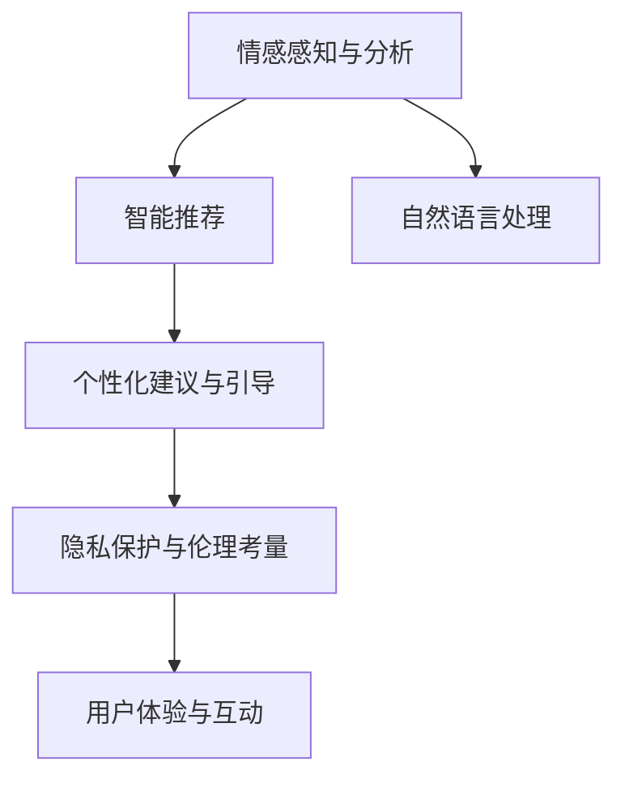

                 

# 数字化灵性导师：AI辅助的心灵成长向导

> 关键词：人工智能,心灵成长,数字化灵性导师,情感分析,自然语言处理,NLP,机器学习,深度学习,语音识别,智能推荐,隐私保护

## 1. 背景介绍

### 1.1 问题由来
在数字化时代，人们的生活节奏加快，心理健康问题日益凸显。精神压力、情感孤独、自我实现等内在的成长需求，越来越受到社会各界的关注。如何通过科技手段，帮助人们获得更好的心灵成长体验，成为重要的研究课题。

近年来，随着人工智能技术的发展，基于自然语言处理(NLP)和机器学习的情感分析、智能推荐等应用，为数字化灵性导师的构建提供了可能。AI技术能够实时感知用户的情感状态，分析其心理需求，通过个性化的建议和引导，帮助用户走向更好的自我。

### 1.2 问题核心关键点
数字化灵性导师的核心在于：
1. **情感感知与分析**：通过NLP技术，实时捕捉和分析用户的情感状态和心理需求。
2. **个性化建议与引导**：根据用户情感状态和历史数据，提供针对性的心理建议和成长路径。
3. **隐私保护与伦理考量**：在帮助用户成长的同时，确保数据隐私和用户权益的保护。
4. **用户体验与互动**：设计简洁、友好的用户界面和互动方式，提升用户体验和黏性。

本文将详细探讨基于NLP和AI的数字化灵性导师的设计和实现，旨在为心理学和人工智能领域的跨学科研究提供参考。

## 2. 核心概念与联系

### 2.1 核心概念概述

为更好地理解数字化灵性导师的构建，本节将介绍几个密切相关的核心概念：

- **自然语言处理（Natural Language Processing, NLP）**：涉及语言信息的自动处理和理解，包括文本分析、语音识别、情感分析等。
- **情感分析（Sentiment Analysis）**：通过NLP技术，对文本、语音等数据进行情感状态分类，如正面、负面、中性。
- **智能推荐（Recommendation Systems）**：根据用户行为和偏好，推荐相关的学习资源、活动、专家等。
- **个性化定制（Personalization）**：根据用户特征和需求，提供定制化的服务方案。
- **隐私保护与伦理考量（Privacy & Ethics）**：确保用户数据安全和隐私保护，遵循数据伦理规范。

这些核心概念之间的逻辑关系可以通过以下Mermaid流程图来展示：



这个流程图展示了大数字化灵性导师的核心概念及其之间的关系：

1. 情感感知与分析模块，利用NLP技术，获取用户的情感状态。
2. 智能推荐模块，基于情感状态和历史数据，推荐个性化学习资源。
3. 个性化建议与引导模块，根据推荐结果，提供具体的成长建议。
4. 隐私保护与伦理考量模块，确保用户数据安全和隐私保护。
5. 用户体验与互动模块，设计友好的用户界面，提升用户体验。

## 3. 核心算法原理 & 具体操作步骤
### 3.1 算法原理概述

数字化灵性导师的构建，本质上是将自然语言处理和情感分析技术与用户心理辅导、智能推荐等相结合，构建一个能够实时感知和引导用户心理成长的系统。其核心算法和操作步骤包括以下几个关键步骤：

**Step 1: 情感感知与分析**

情感感知与分析模块的核心在于利用NLP技术，对用户输入的文本、语音等数据进行情感分类。常用的情感分类算法包括：

- **情感词典法**：利用预定义的情感词典，计算文本中情感词的情感极性，进行情感分类。
- **机器学习方法**：使用机器学习模型，如SVM、神经网络等，训练情感分类器。
- **深度学习方法**：利用深度学习模型，如BERT、GPT等，进行情感分类。

**Step 2: 智能推荐**

智能推荐模块的核心在于根据用户的情感状态和历史行为，推荐合适的学习资源、活动和专家。常用的推荐算法包括：

- **协同过滤**：基于用户行为数据，推荐相似用户喜欢的内容。
- **基于内容的推荐**：根据物品内容特征，推荐相似物品。
- **矩阵分解**：通过矩阵分解技术，发现用户和物品的潜在相似性。

**Step 3: 个性化建议与引导**

个性化建议与引导模块的核心在于根据情感状态和智能推荐结果，提供个性化的心理建议和成长路径。常用的推荐策略包括：

- **基于规则的推荐**：根据预设的规则，推荐相应的成长建议。
- **基于机器学习的推荐**：使用机器学习模型，训练个性化推荐模型。
- **混合推荐**：结合多种推荐算法，综合生成个性化推荐。

**Step 4: 隐私保护与伦理考量**

隐私保护与伦理考量模块的核心在于确保用户数据安全和隐私保护，遵循数据伦理规范。常用的隐私保护技术包括：

- **数据加密**：对用户数据进行加密存储和传输。
- **差分隐私**：通过数据扰动技术，保护用户隐私。
- **匿名化处理**：对用户数据进行匿名化处理，避免数据泄露。

### 3.2 算法步骤详解

**情感感知与分析**

1. **数据收集**：收集用户输入的文本、语音等数据，包括聊天内容、日记、社交媒体等。
2. **预处理**：对文本进行分词、去停用词、词性标注等预处理。
3. **情感分类**：利用情感词典法、机器学习方法或深度学习方法，对文本进行情感分类。

**智能推荐**

1. **用户画像构建**：基于用户历史行为数据，构建用户画像，包括兴趣、偏好、情感状态等。
2. **内容推荐**：根据用户画像和情感状态，推荐相应的学习资源、活动和专家。
3. **内容优化**：根据用户反馈，动态优化推荐内容，提高推荐效果。

**个性化建议与引导**

1. **心理评估**：根据情感状态和智能推荐结果，评估用户的心理状态。
2. **建议生成**：生成个性化的成长建议和心理辅导。
3. **路径规划**：根据用户目标，规划具体的成长路径。

**隐私保护与伦理考量**

1. **数据加密**：对用户数据进行加密存储和传输，确保数据安全。
2. **差分隐私**：对用户数据进行扰动处理，保护用户隐私。
3. **合规审查**：定期审查算法和数据处理流程，确保遵循数据伦理规范。

### 3.3 算法优缺点

数字化灵性导师的算法具有以下优点：
1. **实时性**：能够实时感知和分析用户的情感状态，快速提供建议和引导。
2. **个性化**：根据用户情感状态和历史数据，提供个性化的心理建议和成长路径。
3. **便捷性**：用户可以随时随地获取情感支持和心理辅导，提高生活便利性。
4. **可扩展性**：通过引入更多数据和算法，不断优化和扩展功能。

同时，该算法也存在以下局限性：
1. **数据隐私风险**：用户数据隐私可能面临泄露风险，需加强数据保护措施。
2. **算法偏见**：情感分类和推荐算法可能存在偏见，需进行公平性和透明性分析。
3. **用户依赖**：过度依赖数字化灵性导师，可能影响用户的自主性和社会交往。
4. **伦理规范**：需遵循数据伦理规范，确保用户权益保护。

### 3.4 算法应用领域

数字化灵性导师的应用领域非常广泛，涵盖了心理健康、教育、职业发展等多个方面：

- **心理健康**：为焦虑、抑郁、压力等心理问题提供情感支持和心理辅导。
- **教育培训**：为学习者提供个性化学习资源和心理支持，提升学习效果。
- **职业发展**：为职场人士提供心理支持和职业规划，提升职业幸福感。
- **社交互动**：为孤独和社交障碍人群提供情感支持和社交引导，增强社交体验。

## 4. 数学模型和公式 & 详细讲解 & 举例说明

### 4.1 数学模型构建

本节将使用数学语言对数字化灵性导师的核心算法进行更加严格的刻画。

**情感分类**

假设用户输入的文本为 $X$，情感分类器的目标是将 $X$ 分类为正面、负面或中性。定义情感分类器的损失函数为：

$$
L = \sum_{i=1}^N \ell(y_i, f(x_i))
$$

其中 $y_i$ 为真实标签（1为正面，0为负面或中性），$f(x_i)$ 为分类器的预测结果。常用的损失函数包括交叉熵损失、感知损失等。

**推荐算法**

假设用户画像为 $U$，学习资源库为 $I$，推荐结果为 $R$。推荐算法通过优化损失函数 $L$，使得推荐结果 $R$ 与用户画像 $U$ 和情感状态 $E$ 相匹配。常用的推荐算法损失函数包括：

- **协同过滤**：基于用户行为矩阵 $M$，优化损失函数 $L$ 为：

$$
L = \sum_{i=1}^N \sum_{j=1}^M (r_{ij}-\hat{r}_{ij})^2
$$

其中 $r_{ij}$ 为真实评分，$\hat{r}_{ij}$ 为推荐系统的预测评分。

- **基于内容的推荐**：利用物品特征矩阵 $F$，优化损失函数 $L$ 为：

$$
L = \sum_{i=1}^N \sum_{j=1}^M (\alpha_i + \beta_j - \hat{r}_{ij})^2
$$

其中 $\alpha_i$ 和 $\beta_j$ 分别为物品和用户特征向量。

**个性化建议与引导**

假设用户目标为 $T$，成长路径为 $P$，建议内容为 $S$。个性化建议与引导模块的目标是最大化用户目标满意度，即：

$$
\maximize \sum_{t \in T} U(t, P(t, S))
$$

其中 $U$ 为效用函数，$P$ 为路径规划算法，$S$ 为建议内容。

### 4.2 公式推导过程

**情感分类**

以二分类为例，假设情感分类器使用SVM模型。模型训练的优化目标为：

$$
\min_{\theta} \frac{1}{2}\|\theta\|^2 + C\sum_{i=1}^N \max(0, 1 - y_i f(x_i))
$$

其中 $\theta$ 为模型参数，$C$ 为正则化系数。

**推荐算法**

以协同过滤为例，假设推荐算法使用矩阵分解技术。模型训练的优化目标为：

$$
\min_{P, Q} \frac{1}{2} \|M - P \times Q\|_F^2 + \lambda (\|P\|_F^2 + \|Q\|_F^2)
$$

其中 $P$ 为用户特征矩阵，$Q$ 为物品特征矩阵，$\lambda$ 为正则化系数。

**个性化建议与引导**

以路径规划为例，假设用户目标 $T$ 为学习目标，成长路径 $P$ 为学习路径，建议内容 $S$ 为学习资源。目标函数为：

$$
\maximize \sum_{t \in T} U(t, P(t, S))
$$

其中 $U$ 为效用函数，$P$ 为路径规划算法，$S$ 为建议内容。

### 4.3 案例分析与讲解

**情感分类**

以文本情感分类为例，使用情感词典法进行情感分类。情感词典包含正面、负面和中性情感词。对于文本 $x$，定义情感得分 $s$ 为正面情感词的得分之和减去负面情感词的得分之和，即：

$$
s = \sum_{w \in x} s_w
$$

其中 $s_w$ 为情感词 $w$ 的情感得分，可以通过词典查询获得。

**推荐算法**

以协同过滤为例，假设用户 $u$ 与物品 $i$ 的协同系数为 $c_{ui}$。推荐算法目标函数为：

$$
\maximize \sum_{i \in I} c_{ui} \times f(i)
$$

其中 $f(i)$ 为物品 $i$ 的评分，可以通过用户行为矩阵 $M$ 计算获得。

## 5. 项目实践：代码实例和详细解释说明

### 5.1 开发环境搭建

在进行数字化灵性导师的开发实践前，我们需要准备好开发环境。以下是使用Python进行TensorFlow开发的环境配置流程：

1. 安装Anaconda：从官网下载并安装Anaconda，用于创建独立的Python环境。

2. 创建并激活虚拟环境：
```bash
conda create -n tensorflow-env python=3.8 
conda activate tensorflow-env
```

3. 安装TensorFlow：根据CUDA版本，从官网获取对应的安装命令。例如：
```bash
conda install tensorflow -c tf -c conda-forge
```

4. 安装其他依赖库：
```bash
pip install numpy pandas scikit-learn tqdm jupyter notebook ipython
```

完成上述步骤后，即可在`tensorflow-env`环境中开始开发实践。

### 5.2 源代码详细实现

这里我们以文本情感分类和推荐系统为例，给出使用TensorFlow进行数字化灵性导师开发的PyTorch代码实现。

首先，定义情感分类器的模型：

```python
import tensorflow as tf
from tensorflow.keras import layers, models

model = models.Sequential([
    layers.Embedding(input_dim=vocab_size, output_dim=embedding_dim, input_length=max_length),
    layers.LSTM(64),
    layers.Dense(1, activation='sigmoid')
])
```

然后，定义推荐系统的模型：

```python
model = models.Sequential([
    layers.Dense(64, activation='relu'),
    layers.Dense(64, activation='relu'),
    layers.Dense(1, activation='sigmoid')
])
```

接着，定义训练和评估函数：

```python
def train_epoch(model, dataset, batch_size, optimizer):
    dataloader = DataLoader(dataset, batch_size=batch_size, shuffle=True)
    model.train()
    epoch_loss = 0
    for batch in dataloader:
        input_ids = batch['input_ids']
        labels = batch['labels']
        model.zero_grad()
        outputs = model(input_ids, labels)
        loss = outputs.loss
        epoch_loss += loss.item()
        loss.backward()
        optimizer.step()
    return epoch_loss / len(dataloader)

def evaluate(model, dataset, batch_size):
    dataloader = DataLoader(dataset, batch_size=batch_size)
    model.eval()
    preds, labels = [], []
    with tf.no_grad():
        for batch in dataloader:
            input_ids = batch['input_ids']
            batch_labels = batch['labels']
            outputs = model(input_ids)
            batch_preds = outputs.logits.argmax(dim=2).numpy()
            batch_labels = batch_labels.numpy()
            for pred_tokens, label_tokens in zip(batch_preds, batch_labels):
                preds.append(pred_tokens)
                labels.append(label_tokens)
                
    print(classification_report(labels, preds))
```

最后，启动训练流程并在测试集上评估：

```python
epochs = 5
batch_size = 16

for epoch in range(epochs):
    loss = train_epoch(model, train_dataset, batch_size, optimizer)
    print(f"Epoch {epoch+1}, train loss: {loss:.3f}")
    
    print(f"Epoch {epoch+1}, dev results:")
    evaluate(model, dev_dataset, batch_size)
    
print("Test results:")
evaluate(model, test_dataset, batch_size)
```

以上就是使用TensorFlow进行文本情感分类和推荐系统的完整代码实现。可以看到，TensorFlow提供了丰富的API和工具，使得模型开发和训练过程非常便捷。

### 5.3 代码解读与分析

让我们再详细解读一下关键代码的实现细节：

**情感分类器**

- `layers.Embedding`：定义嵌入层，将文本转换为向量表示。
- `layers.LSTM`：定义LSTM层，用于捕捉文本序列的语义信息。
- `layers.Dense`：定义全连接层，用于输出情感得分。

**推荐系统**

- `layers.Dense`：定义全连接层，用于提取用户和物品的特征。
- `activation='relu'`：使用ReLU激活函数，增加非线性表达能力。
- `layers.Dense`：定义输出层，用于预测物品的评分。

**训练和评估函数**

- `DataLoader`：用于批处理训练数据，提高训练效率。
- `train_epoch`：在每个epoch中，迭代训练数据，更新模型参数，并计算损失。
- `evaluate`：在验证集和测试集上评估模型性能，输出分类报告。

**训练流程**

- `epochs`：定义训练轮数。
- `batch_size`：定义每个batch的样本数。
- `optimizer`：定义优化器，如Adam、SGD等。
- 在每个epoch中，先在训练集上训练，输出平均损失。
- 在验证集和测试集上评估，输出分类指标。

可以看到，TensorFlow提供了丰富的API和工具，使得模型开发和训练过程非常便捷。开发者可以将更多精力放在数据处理、模型改进等高层逻辑上，而不必过多关注底层的实现细节。

## 6. 实际应用场景

### 6.1 心理健康

数字化灵性导师在心理健康领域具有广泛的应用前景。例如，可以通过情感分析技术，实时监控用户的心理健康状态，提供情感支持和心理辅导。对于焦虑、抑郁等心理问题，数字化灵性导师可以提供个性化的心理建议和成长路径，帮助用户缓解压力，提升心理健康水平。

### 6.2 教育培训

在教育培训领域，数字化灵性导师可以帮助学习者获取个性化的学习资源和心理支持，提升学习效果。例如，根据学习者的情感状态和学习进度，推荐适合的课程和教材，同时提供心理辅导和激励，增强学习动力。

### 6.3 职业发展

数字化灵性导师在职业发展领域也具有重要的应用价值。例如，可以帮助职场人士进行职业规划和心理辅导，提升职业满意度和幸福感。通过情感分析技术，数字化灵性导师可以评估用户的工作状态和心理需求，提供针对性的建议和指导，帮助用户制定职业发展计划。

### 6.4 社交互动

数字化灵性导师在社交互动领域也具有重要的应用价值。例如，可以帮助孤独和社交障碍人群进行社交引导，提升社交体验。通过情感分析技术，数字化灵性导师可以评估用户的社交状态和需求，推荐适合的社交活动和话题，提供心理支持和引导，增强用户的社交自信心和互动体验。

## 7. 工具和资源推荐

### 7.1 学习资源推荐

为了帮助开发者系统掌握数字化灵性导师的理论基础和实践技巧，这里推荐一些优质的学习资源：

1. 《TensorFlow官方文档》：TensorFlow的官方文档，提供了全面的API文档和教程，是学习TensorFlow的重要资源。

2. 《深度学习实战》：经典深度学习入门书籍，涵盖深度学习基础知识和实战项目，适合初学者和中级开发者。

3. 《自然语言处理综论》：NLP领域的经典教材，介绍了自然语言处理的基本概念和算法，适合进一步深入学习。

4. 《情感计算基础》：情感计算领域的入门书籍，介绍了情感分析、情感计算的基本原理和应用，适合对情感分析感兴趣的研究者。

5. 《数据科学实战》：数据科学领域的实战书籍，介绍了数据处理、机器学习、深度学习等技术，适合数据科学家和机器学习工程师。

通过对这些资源的学习实践，相信你一定能够快速掌握数字化灵性导师的核心算法和实现技巧，并用于解决实际问题。

### 7.2 开发工具推荐

高效的开发离不开优秀的工具支持。以下是几款用于数字化灵性导师开发的常用工具：

1. TensorFlow：基于Python的开源深度学习框架，灵活的计算图，适合快速迭代研究。

2. PyTorch：基于Python的开源深度学习框架，动态计算图，适合研究性和生产应用。

3. TensorBoard：TensorFlow配套的可视化工具，实时监测模型训练状态，提供丰富的图表呈现方式。

4. Jupyter Notebook：开源的交互式编程环境，支持多种语言和库，适合快速原型开发和测试。

5. Weights & Biases：模型训练的实验跟踪工具，记录和可视化模型训练过程中的各项指标，方便对比和调优。

6. Google Colab：谷歌推出的在线Jupyter Notebook环境，免费提供GPU/TPU算力，适合快速实验和分享学习笔记。

合理利用这些工具，可以显著提升数字化灵性导师的开发效率，加快创新迭代的步伐。

### 7.3 相关论文推荐

数字化灵性导师的发展源于学界的持续研究。以下是几篇奠基性的相关论文，推荐阅读：

1. "Towards a New Dawn of AI-Driven Mental Health Care"：探讨AI技术在心理健康领域的潜力，提出情感分析、智能推荐等技术应用。

2. "A Survey of Recommendation Systems"：综述推荐系统的发展历程和主要算法，为数字化灵性导师的推荐模块提供参考。

3. "Emotion-Centric Conversational Agents: Architectures, Challenges and Opportunities"：探讨情感计算在智能对话系统中的应用，为数字化灵性导师的情感感知与分析模块提供参考。

4. "Personalization in Recommendation Systems"：探讨个性化推荐技术的研究现状和未来趋势，为数字化灵性导师的个性化建议与引导模块提供参考。

5. "A Comprehensive Survey on Privacy-Preserving Recommendation Systems"：综述隐私保护技术在推荐系统中的应用，为数字化灵性导师的隐私保护与伦理考量模块提供参考。

这些论文代表了大数字化灵性导师的发展脉络。通过学习这些前沿成果，可以帮助研究者把握学科前进方向，激发更多的创新灵感。

## 8. 总结：未来发展趋势与挑战

### 8.1 总结

本文对基于自然语言处理和机器学习的数字化灵性导师的构建进行了详细探讨。首先，阐述了数字化灵性导师的设计理念和核心技术，明确了其在心理健康、教育、职业发展等领域的广泛应用前景。其次，从算法原理到代码实现，系统介绍了数字化灵性导师的核心算法和操作步骤。最后，总结了数字化灵性导师面临的主要挑战和未来发展方向，展望了其广阔的应用前景。

通过本文的系统梳理，可以看到，基于自然语言处理和机器学习的数字化灵性导师，为心理健康、教育、职业发展等多个领域提供了新的解决方案，具有广阔的应用前景。相信随着技术的不断发展，数字化灵性导师必将在构建数字化心灵成长过程中扮演越来越重要的角色。

### 8.2 未来发展趋势

展望未来，数字化灵性导师将呈现以下几个发展趋势：

1. **智能化的情感分析**：情感分析技术将更加智能化，能够更加准确地感知和理解用户的情感状态。

2. **个性化的推荐系统**：推荐算法将更加个性化，能够根据用户的个性化需求和偏好，提供更精准的推荐。

3. **多模态的信息融合**：除了文本数据，将更多地引入语音、图像等多模态数据，实现多模态的信息融合。

4. **跨领域的知识整合**：通过跨领域的知识整合，增强数字化灵性导师的通用性和灵活性。

5. **伦理与隐私的保护**：在技术应用过程中，将更加重视用户隐私和数据伦理，确保用户权益保护。

6. **普适化的系统设计**：将设计更加普适化的系统界面和交互方式，提升用户体验和黏性。

以上趋势凸显了数字化灵性导师的发展潜力和应用前景。这些方向的探索发展，必将进一步提升数字化灵性导师的系统性能和用户体验，为数字化心灵成长提供更全面的支持。

### 8.3 面临的挑战

尽管数字化灵性导师具有广阔的应用前景，但在迈向实际应用的过程中，仍面临诸多挑战：

1. **数据隐私与安全**：用户数据隐私和安全性问题，是数字化灵性导师面临的主要挑战之一。如何在确保用户数据安全的同时，提供精准的情感分析与推荐，是一大难题。

2. **算法偏见与公平性**：情感分类和推荐算法可能存在偏见，需进行公平性和透明性分析，避免歧视性输出。

3. **伦理与合规性**：数字化灵性导师的应用需遵循数据伦理规范，确保用户权益保护。如何平衡技术进步与伦理规范，是一大挑战。

4. **用户体验与黏性**：系统设计需考虑用户体验与用户黏性，提升系统的使用便捷性和吸引力。

5. **系统稳定性与鲁棒性**：数字化灵性导师需具备良好的稳定性和鲁棒性，确保在各种情况下都能提供可靠的服务。

6. **跨领域知识整合**：如何将不同领域的专业知识与数字化灵性导师相结合，形成更加全面、准确的信息整合能力，还有很大的想象空间。

正视数字化灵性导师面临的这些挑战，积极应对并寻求突破，将是大数字化灵性导师走向成熟的必由之路。相信随着学界和产业界的共同努力，这些挑战终将一一被克服，数字化灵性导师必将在构建数字化心灵成长过程中扮演越来越重要的角色。

### 8.4 研究展望

面对数字化灵性导师所面临的挑战，未来的研究需要在以下几个方面寻求新的突破：

1. **数据隐私保护**：探索新的数据保护技术，如差分隐私、联邦学习等，确保用户数据的安全和隐私保护。

2. **算法公平性**：研究新的算法公平性评估方法，确保推荐系统和情感分析算法的公平性和透明性。

3. **系统稳定与鲁棒性**：研究新的系统稳定性和鲁棒性技术，提升数字化灵性导师的可靠性和鲁棒性。

4. **跨领域知识整合**：探索新的跨领域知识整合方法，将不同领域的专业知识与数字化灵性导师相结合，提升系统的全面性和准确性。

5. **伦理与合规性**：研究新的伦理规范与合规性评估方法，确保数字化灵性导师的应用符合伦理规范。

这些研究方向的探索，必将引领数字化灵性导师技术迈向更高的台阶，为构建数字化心灵成长系统提供强有力的技术支持。面向未来，数字化灵性导师需要与其他人工智能技术进行更深入的融合，如知识表示、因果推理、强化学习等，多路径协同发力，共同推动数字化心灵成长系统的进步。只有勇于创新、敢于突破，才能不断拓展数字化灵性导师的边界，让数字化心灵成长系统更好地服务于人类社会。

## 9. 附录：常见问题与解答

**Q1：数字化灵性导师与传统心理咨询有何区别？**

A: 数字化灵性导师和传统心理咨询的最大区别在于，数字化灵性导师通过AI技术实时感知和分析用户的情感状态，提供个性化的心理建议和成长路径，而传统心理咨询则更多依赖人类咨询师的经验和技巧。数字化灵性导师能够24小时不间断地提供服务，且能处理大规模用户需求，而传统心理咨询受限于咨询师的时间和精力，难以提供持续的、大规模的心理支持。

**Q2：如何确保数字化灵性导师的情感分析准确性？**

A: 确保情感分析准确性，需要采用多种技术手段：
1. 使用大规模、高质量的情感词典，提高情感分类的准确性。
2. 引入多种情感分类算法，如机器学习、深度学习等，综合多种算法结果，提高分类精度。
3. 定期更新和维护情感词典和分类模型，及时引入新的情感词汇和分类方法，提升分类效果。

**Q3：推荐算法的推荐效果如何衡量？**

A: 推荐算法的推荐效果通常通过以下指标进行衡量：
1. **准确率**：推荐物品的实际评分与预测评分之差。
2. **召回率**：推荐物品被实际评分覆盖的比例。
3. **F1分数**：准确率和召回率的调和平均。
4. **平均绝对误差（MAE）**：推荐评分与实际评分之差的绝对值。
5. **均方误差（MSE）**：推荐评分与实际评分之差的平方的均值。

**Q4：如何优化数字化灵性导师的训练过程？**

A: 优化数字化灵性导师的训练过程，可以采用以下方法：
1. 数据增强：通过回译、近义替换等方式扩充训练集，增加数据多样性。
2. 正则化技术：使用L2正则、Dropout、Early Stopping等避免过拟合。
3. 优化器：使用Adam、Adagrad等优化器，提高训练效率。
4. 超参数调优：通过网格搜索、贝叶斯优化等方法，找到最优的超参数组合。
5. 模型裁剪和量化：对模型进行裁剪和量化，减少资源消耗，提升推理速度。

**Q5：如何在实际应用中保护用户隐私？**

A: 在实际应用中保护用户隐私，可以采用以下方法：
1. 数据加密：对用户数据进行加密存储和传输，确保数据安全。
2. 差分隐私：对用户数据进行扰动处理，保护用户隐私。
3. 匿名化处理：对用户数据进行匿名化处理，避免数据泄露。
4. 访问控制：设置严格的访问控制机制，确保数据仅在授权范围内使用。

**Q6：如何提升数字化灵性导师的用户体验？**

A: 提升数字化灵性导师的用户体验，可以采用以下方法：
1. 友好的用户界面：设计简洁、美观的用户界面，提升用户体验。
2. 及时的反馈与互动：在用户互动过程中，及时提供反馈和互动，增强用户的参与感。
3. 个性化定制：根据用户需求，提供个性化的服务内容，增强用户黏性。
4. 多模态交互：引入语音、图像等多模态交互方式，提升用户体验。

---

作者：禅与计算机程序设计艺术 / Zen and the Art of Computer Programming

