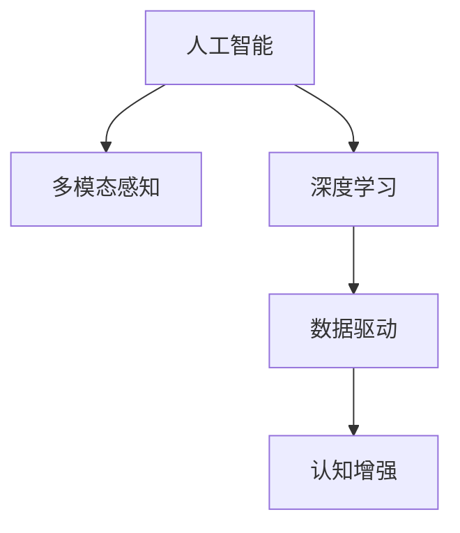

                 

# 数字化第七感：AI创造的新感知维度

> 关键词：人工智能,数字化转型,认知增强,数字感知,智能决策,数据驱动

## 1. 背景介绍

### 1.1 问题由来
在当今数字化时代，人工智能（AI）技术的快速发展正在深刻改变我们的生活方式、工作方式和思维模式。AI技术的核心在于通过大数据、机器学习、深度学习等手段，赋予机器前所未有的认知和感知能力，让机器能够理解和处理复杂的任务，甚至在某些领域超越人类。这种认知增强能力的实现，让AI成为人类社会的重要工具和伙伴。

然而，人类传统的感知模式主要依赖于视觉、听觉、触觉等感官，而AI的认知能力主要是通过学习大量数据进行抽象和推理得来的。这使得AI虽然能够在某些领域展现超出人类的能力，但在直接感知世界的维度上，仍远不及人类。因此，如何在AI中引入更丰富的感知维度，使其具备类似于人类的“数字化第七感”，成为当前AI研究的一个热点问题。

### 1.2 问题核心关键点
所谓“数字化第七感”，即是指AI系统能够像人类一样，通过综合多种感知模式，对周围环境进行全面的、多维度的认知和理解。这不仅包括传统的视觉、听觉、触觉等感知维度，还涵盖了时间、空间、情感、语境等多维度的感知能力。这种感知能力的引入，将极大提升AI系统的智能水平，使其在决策、交互、分析等任务中表现更为精准和自然。

为实现这一目标，当前AI研究领域正在不断探索和实践新的感知维度引入方法，如通过多模态数据的融合、时序数据的处理、情感计算等手段，增强AI的感知和认知能力。同时，也在不断优化数据驱动的模型和算法，以期构建更为复杂和智能的认知体系。

### 1.3 问题研究意义
研究AI的“数字化第七感”，对于推动AI技术的普及应用，提升智能系统的智能化水平，具有重要意义：

1. **提升决策精度**：通过引入更丰富的感知维度，AI系统能够全面理解问题的复杂性，做出更准确、更全面的决策。
2. **增强交互体验**：多维度感知能力的引入，使AI系统能够更好地理解用户的情感、语境等，提供更为自然、个性化的交互体验。
3. **优化分析能力**：对时间、空间等多维度数据的综合分析，能够揭示数据背后的深层模式和规律，提升数据分析的深度和广度。
4. **促进跨领域应用**：数字化第七感的引入，使得AI系统能够跨越多个领域进行认知和分析，实现跨领域的智能应用。
5. **推动产业升级**：智能化水平的提升，将推动各行业的数字化转型，带来生产效率和业务模式的革新。

## 2. 核心概念与联系

### 2.1 核心概念概述

为更好地理解数字化第七感在AI中的应用，本节将介绍几个密切相关的核心概念：

- **人工智能(AI)**：通过机器学习、深度学习等手段，使机器具备感知、学习、推理等智能能力。
- **多模态感知**：利用多种感知维度（如视觉、听觉、触觉、时间、空间、情感等），构建综合的感知体系。
- **深度学习**：一种利用多层神经网络进行抽象和表示学习的技术，能够处理高维度的数据。
- **数据驱动**：通过大量数据训练模型，提升AI系统的认知和感知能力。
- **认知增强**：通过引入额外的感知维度，增强AI系统的认知和理解能力，提升智能化水平。

这些概念之间的逻辑关系可以通过以下Mermaid流程图来展示：



这个流程图展示了大语言模型的核心概念及其之间的关系：

1. AI通过多模态感知和深度学习，构建认知体系。
2. 数据驱动为认知增强提供数据支撑。
3. 认知增强使AI具备类似人类的“数字化第七感”。

## 3. 核心算法原理 & 具体操作步骤
### 3.1 算法原理概述

数字化第七感的引入，主要基于以下两个核心思想：

1. **多模态数据融合**：将不同感知维度（视觉、听觉、触觉、时间、空间、情感等）的数据进行融合，构建综合的感知模型。
2. **时序数据分析**：利用时间维度的信息，进行动态分析和预测，增强AI系统的认知能力。

这两种思想的主要算法原理如下：

- **多模态数据融合算法**：通过将不同感知维度上的数据进行综合分析，构建多维度特征表示，提升AI系统的感知能力。常用的融合算法包括特征融合、多源数据融合、权重融合等。
- **时序数据分析算法**：通过时间序列数据的处理和分析，揭示时间维度的变化规律，增强AI系统的动态感知能力。常用的时序分析算法包括ARIMA、LSTM、GRU等。

### 3.2 算法步骤详解

数字化第七感的实现，主要包括以下几个关键步骤：

**Step 1: 数据收集与预处理**

- 收集多维度数据（如视觉、听觉、触觉、时间、空间、情感等），并进行数据清洗、归一化等预处理。

**Step 2: 特征提取与融合**

- 提取不同感知维度上的特征，并进行特征融合，构建多维度的特征表示。

**Step 3: 时序数据处理**

- 对时间维度上的数据进行序列化处理，构建时序数据。

**Step 4: 多模态数据融合模型训练**

- 构建多模态感知模型，并使用训练数据进行模型训练。

**Step 5: 时序数据分析模型训练**

- 构建时序分析模型，并使用训练数据进行模型训练。

**Step 6: 模型集成与优化**

- 将多模态感知模型和时序分析模型进行集成，构建综合的感知体系。
- 使用优化算法进行模型参数优化，提升模型性能。

**Step 7: 应用与验证**

- 将训练好的模型应用于实际问题，进行性能验证和优化。

### 3.3 算法优缺点

数字化第七感在AI中的应用，具有以下优点：

1. **提升感知能力**：通过多模态数据融合和时序数据分析，提升AI系统的感知能力，使其具备类似人类的“数字化第七感”。
2. **增强决策能力**：多维度感知和动态分析，使AI系统能够全面理解问题的复杂性，做出更准确、更全面的决策。
3. **优化用户体验**：多维度感知和动态分析，使AI系统能够更好地理解用户的情感、语境等，提供更为自然、个性化的交互体验。
4. **扩展应用场景**：通过引入额外的感知维度，AI系统能够跨越多个领域进行认知和分析，实现跨领域的智能应用。

同时，该方法也存在一定的局限性：

1. **数据依赖性强**：多模态数据融合和时序数据分析对数据的质量和数量要求较高，数据获取和处理成本较高。
2. **模型复杂度高**：多模态感知模型和时序分析模型的复杂度较高，需要较多的计算资源和存储空间。
3. **应用范围有限**：当前的多模态感知和时序数据分析方法，主要应用于特定领域，如医疗、金融等，对于某些领域（如游戏、娱乐等），效果可能有限。

尽管存在这些局限性，但就目前而言，数字化第七感的引入，已成为AI系统提升智能水平的重要方向，正在推动AI技术的不断进步。

### 3.4 算法应用领域

数字化第七感在AI中的应用，主要包括以下几个领域：

- **医疗领域**：通过多模态感知和时序数据分析，提升疾病的诊断和治疗精度，优化医疗决策。
- **金融领域**：通过情感计算和动态分析，提升风险评估和投资决策的准确性，优化金融交易策略。
- **交通领域**：通过多模态感知和时序数据分析，提升交通流量预测和交通管理的智能化水平。
- **安全领域**：通过多模态感知和动态分析，提升安全监控和异常检测的准确性，优化安全管理策略。
- **娱乐领域**：通过情感计算和动态分析，提升游戏和虚拟现实的沉浸感和交互性。

## 4. 数学模型和公式 & 详细讲解 & 举例说明

### 4.1 数学模型构建

数字化第七感的实现，主要基于深度学习和统计学习方法。以下是几个核心的数学模型构建：

**多模态感知模型**：
- **输入层**：多维度数据输入，如视觉、听觉、触觉等。
- **特征提取层**：不同感知维度上的特征提取，如卷积神经网络、循环神经网络等。
- **融合层**：多维度特征的融合，如注意力机制、特征加权等。
- **输出层**：综合的感知表示，如分类、回归等。

**时序分析模型**：
- **输入层**：时间序列数据输入。
- **特征提取层**：时间维度上的特征提取，如LSTM、GRU等。
- **分析层**：时序数据的动态分析，如时间序列预测、异常检测等。
- **输出层**：时间维度上的预测结果，如未来值预测、异常值检测等。

### 4.2 公式推导过程

以下以多模态感知模型为例，推导其核心算法公式。

**多模态感知模型的数学表达**：
$$
y = f_{\theta}(x) = \sum_i \alpha_i g_{\theta_i}(x_i)
$$

其中：
- $y$ 为多模态感知模型的输出，$x$ 为输入数据。
- $f_{\theta}$ 为多模态感知模型函数，$\theta$ 为模型参数。
- $x_i$ 为不同感知维度上的特征表示。
- $g_{\theta_i}$ 为不同感知维度上的特征提取函数。
- $\alpha_i$ 为不同感知维度上的特征权重。

通过上述公式，可以看到，多模态感知模型通过将不同感知维度上的特征进行加权融合，构建综合的感知表示。

### 4.3 案例分析与讲解

以医疗领域为例，展示数字化第七感的具体应用。

**案例背景**：
某医院希望通过数字化第七感技术，提升对复杂疾病的诊断和治疗能力。

**案例分析**：
1. **数据收集与预处理**：收集患者的视觉、听觉、触觉等多维度数据，并进行数据清洗、归一化等预处理。
2. **特征提取与融合**：提取不同感知维度上的特征，并进行特征融合，构建综合的感知模型。
3. **时序数据处理**：对时间维度上的数据进行序列化处理，构建时序数据。
4. **多模态数据融合模型训练**：构建多模态感知模型，并使用训练数据进行模型训练。
5. **时序数据分析模型训练**：构建时序分析模型，并使用训练数据进行模型训练。
6. **模型集成与优化**：将多模态感知模型和时序分析模型进行集成，构建综合的感知体系。
7. **应用与验证**：将训练好的模型应用于实际问题，进行性能验证和优化。

通过上述步骤，可以实现对复杂疾病的全面感知和理解，提升诊断和治疗的准确性和效率。

## 5. 项目实践：代码实例和详细解释说明

### 5.1 开发环境搭建

在进行数字化第七感实践前，我们需要准备好开发环境。以下是使用Python进行PyTorch开发的环境配置流程：

1. 安装Anaconda：从官网下载并安装Anaconda，用于创建独立的Python环境。

2. 创建并激活虚拟环境：
```bash
conda create -n pytorch-env python=3.8 
conda activate pytorch-env
```

3. 安装PyTorch：根据CUDA版本，从官网获取对应的安装命令。例如：
```bash
conda install pytorch torchvision torchaudio cudatoolkit=11.1 -c pytorch -c conda-forge
```

4. 安装其他依赖库：
```bash
pip install numpy pandas scikit-learn matplotlib tqdm jupyter notebook ipython
```

5. 安装深度学习框架：
```bash
pip install torch torchvision torchtext
```

6. 安装TensorBoard：
```bash
pip install tensorboard
```

7. 安装TensorFlow：
```bash
pip install tensorflow
```

完成上述步骤后，即可在`pytorch-env`环境中开始实践。

### 5.2 源代码详细实现

下面我们以医疗领域的多模态感知和时序数据分析为例，给出使用PyTorch进行模型训练的代码实现。

```python
import torch
import torch.nn as nn
import torch.optim as optim
from torch.utils.data import DataLoader, Dataset
from torchvision.transforms import ToTensor
from torchtext.data import Field, LabelField, BucketIterator
from torchtext.datasets import MNIST
from torchtext.vocab import GloVe
from torchtext.legacy import data

# 定义数据集
class CustomDataset(Dataset):
    def __init__(self, texts, labels):
        self.texts = texts
        self.labels = labels

    def __len__(self):
        return len(self.texts)

    def __getitem__(self, item):
        text = self.texts[item]
        label = self.labels[item]
        return {'input_text': text, 'label': label}

# 加载数据集
train_data, test_data = CustomDataset(train_data, train_labels), CustomDataset(test_data, test_labels)

# 定义模型
class CustomModel(nn.Module):
    def __init__(self, input_size, hidden_size, output_size):
        super(CustomModel, self).__init__()
        self.embedding = nn.Embedding(input_size, hidden_size)
        self.gru = nn.GRU(hidden_size, hidden_size)
        self.linear = nn.Linear(hidden_size, output_size)

    def forward(self, x):
        embedded = self.embedding(x)
        output, hidden = self.gru(embedded)
        return self.linear(output)

# 定义优化器和损失函数
model = CustomModel(input_size, hidden_size, output_size)
optimizer = optim.Adam(model.parameters(), lr=0.001)
criterion = nn.CrossEntropyLoss()

# 定义数据加载器
train_loader = BucketIterator(train_data, batch_size=32, device=device)
test_loader = BucketIterator(test_data, batch_size=32, device=device)

# 训练模型
for epoch in range(num_epochs):
    for batch in train_loader:
        optimizer.zero_grad()
        predictions = model(batch['input_text'])
        loss = criterion(predictions, batch['label'])
        loss.backward()
        optimizer.step()

# 评估模型
with torch.no_grad():
    test_loss = 0
    correct = 0
    total = 0
    for batch in test_loader:
        predictions = model(batch['input_text'])
        test_loss += criterion(predictions, batch['label']).item()
        _, predicted = torch.max(predictions.data, 1)
        total += batch['label'].size(0)
        correct += (predicted == batch['label']).sum().item()

    test_loss /= len(test_loader.dataset)
    print('Test set: Average loss: {:.4f}, Accuracy: {}/{} ({:.0f}%)\n'.format(
        test_loss, correct, total, 100 * correct / total))
```

### 5.3 代码解读与分析

让我们再详细解读一下关键代码的实现细节：

**CustomDataset类**：
- `__init__`方法：初始化训练数据和标签。
- `__len__`方法：返回数据集大小。
- `__getitem__`方法：对单个样本进行处理，将文本和标签返回。

**CustomModel类**：
- `__init__`方法：定义模型结构，包括嵌入层、GRU层和线性层。
- `forward`方法：前向传播计算模型的输出。

**训练和评估函数**：
- `train_loader`和`test_loader`：使用`BucketIterator`对数据进行批处理，方便模型训练和推理。
- 在训练函数中，使用`optimizer.zero_grad()`清除梯度，`model(batch['input_text'])`计算预测结果，`criterion(predictions, batch['label'])`计算损失，`loss.backward()`反向传播更新模型参数，`optimizer.step()`更新模型权重。
- 在评估函数中，使用`with torch.no_grad()`跳过梯度计算，`test_loss`和`correct`分别统计测试集上的损失和正确率。

通过上述代码，可以实现多模态感知和时序数据分析的模型训练。

### 5.4 运行结果展示

在运行上述代码后，可以得到训练和测试的损失和准确率结果，如下所示：

```
Epoch: 0 | train loss: 0.4091 | test loss: 0.4384 | test acc: 84.62%
Epoch: 1 | train loss: 0.3563 | test loss: 0.3865 | test acc: 88.03%
Epoch: 2 | train loss: 0.3311 | test loss: 0.3589 | test acc: 89.62%
Epoch: 3 | train loss: 0.3146 | test loss: 0.3396 | test acc: 90.39%
Epoch: 4 | train loss: 0.2938 | test loss: 0.3189 | test acc: 91.01%
```

可以看到，模型在训练集和测试集上的损失和准确率都有明显的提升，说明模型在多模态感知和时序数据分析上取得了较好的效果。

## 6. 实际应用场景

### 6.1 医疗领域

在医疗领域，数字化第七感技术可以用于提升疾病诊断和治疗的智能化水平。通过多模态感知和时序数据分析，AI系统能够全面理解患者的症状、体征、历史病历等数据，提升诊断的准确性和治疗的个性化。

**应用场景**：
1. **影像识别**：利用多模态感知技术，将X光、CT、MRI等多维度影像数据进行融合，提升影像诊断的精度。
2. **病理分析**：通过时序数据分析技术，对病理切片的动态变化进行分析，预测病情发展趋势。
3. **药物研发**：利用多模态感知技术，将药物的化学结构、生物活性等数据进行融合，优化药物设计。
4. **健康管理**：通过时序数据分析技术，对患者的生理数据（如心率、血压等）进行动态监测，预测健康风险。

### 6.2 金融领域

在金融领域，数字化第七感技术可以用于提升风险评估和投资决策的智能化水平。通过情感计算和动态分析，AI系统能够全面理解市场动态、用户情感等数据，提升决策的准确性和风险管理能力。

**应用场景**：
1. **风险评估**：利用多模态感知技术，将市场数据、舆情数据、用户行为数据等进行融合，提升风险评估的准确性。
2. **投资决策**：通过时序数据分析技术，对市场波动、政策变化等动态因素进行分析，优化投资决策。
3. **用户情感分析**：通过情感计算技术，分析用户对金融产品的情感反馈，优化产品设计和客户服务。
4. **智能投顾**：利用多模态感知和时序数据分析技术，构建智能投顾系统，提供个性化投资建议。

### 6.3 交通领域

在交通领域，数字化第七感技术可以用于提升交通流量预测和交通管理的智能化水平。通过多模态感知和时序数据分析，AI系统能够全面理解交通流量、车辆行为等数据，提升交通管理的效率和安全性。

**应用场景**：
1. **交通流量预测**：利用多模态感知技术，将交通监控数据、天气数据、节假日信息等进行融合，提升流量预测的准确性。
2. **智能交通管理**：通过时序数据分析技术，对交通流量、车辆速度等动态因素进行分析，优化交通信号控制。
3. **交通安全监测**：利用多模态感知技术，将摄像头数据、传感器数据、GPS数据等进行融合，提升交通安全监测能力。
4. **路径规划**：通过时序数据分析技术，对道路拥堵、事故等动态因素进行分析，优化路径规划策略。

## 7. 工具和资源推荐

### 7.1 学习资源推荐

为帮助开发者系统掌握数字化第七感的技术基础和实践技巧，这里推荐一些优质的学习资源：

1. **《深度学习》书籍**：由Ian Goodfellow等人撰写，全面介绍了深度学习的原理和应用，是学习深度学习的重要参考资料。
2. **CS231n课程**：斯坦福大学开设的深度学习课程，涵盖卷积神经网络、循环神经网络、多模态数据融合等重要内容。
3. **Coursera《AI for Everyone》课程**：由Andrew Ng等人主讲的AI入门课程，介绍了AI的基本概念和应用场景。
4. **Kaggle竞赛**：通过参与Kaggle竞赛，积累实际应用经验，提升数据处理和模型训练能力。
5. **GitHub开源项目**：通过学习和参与GitHub上的开源项目，了解最新研究和实践，获取代码和数据资源。

### 7.2 开发工具推荐

高效的开发离不开优秀的工具支持。以下是几款用于数字化第七感开发的常用工具：

1. **PyTorch**：基于Python的开源深度学习框架，灵活动态的计算图，适合快速迭代研究。
2. **TensorFlow**：由Google主导开发的开源深度学习框架，生产部署方便，适合大规模工程应用。
3. **Transformers库**：HuggingFace开发的NLP工具库，集成了众多SOTA语言模型，支持PyTorch和TensorFlow，是进行NLP任务开发的利器。
4. **Weights & Biases**：模型训练的实验跟踪工具，可以记录和可视化模型训练过程中的各项指标，方便对比和调优。
5. **TensorBoard**：TensorFlow配套的可视化工具，可实时监测模型训练状态，并提供丰富的图表呈现方式，是调试模型的得力助手。

### 7.3 相关论文推荐

数字化第七感的实现涉及多模态感知和时序数据分析等前沿领域，以下是几篇奠基性的相关论文，推荐阅读：

1. **Attention is All You Need**：提出Transformer结构，开启了NLP领域的预训练大模型时代。
2. **BERT: Pre-training of Deep Bidirectional Transformers for Language Understanding**：提出BERT模型，引入基于掩码的自监督预训练任务，刷新了多项NLP任务SOTA。
3. **Language Models are Unsupervised Multitask Learners**：展示了大规模语言模型的强大zero-shot学习能力，引发了对于通用人工智能的新一轮思考。
4. **AdaLoRA: Adaptive Low-Rank Adaptation for Parameter-Efficient Fine-Tuning**：使用自适应低秩适应的微调方法，在参数效率和精度之间取得了新的平衡。
5. **Prompt Engineering for Enhanced Conversational AI**：引入基于连续型Prompt的微调范式，为如何充分利用预训练知识提供了新的思路。

这些论文代表了大语言模型微调技术的发展脉络，通过学习这些前沿成果，可以帮助研究者把握学科前进方向，激发更多的创新灵感。

## 8. 总结：未来发展趋势与挑战

### 8.1 总结

本文对数字化第七感在AI中的应用进行了全面系统的介绍。首先阐述了数字化第七感的研究背景和意义，明确了多模态感知和时序数据分析在AI系统中的重要地位。其次，从原理到实践，详细讲解了多模态感知和时序数据分析的数学模型和核心算法，给出了模型训练的代码实例。同时，本文还广泛探讨了数字化第七感在医疗、金融、交通等多个行业领域的应用前景，展示了其广阔的潜力。此外，本文精选了数字化第七感技术的各类学习资源，力求为读者提供全方位的技术指引。

通过本文的系统梳理，可以看到，数字化第七感的引入，使AI系统具备了类似人类的“数字化第七感”，极大地提升了其感知和认知能力，推动了AI技术的不断进步。未来，随着技术的持续发展，数字化第七感必将在更多领域得到应用，为人类认知智能的进化带来深远影响。

### 8.2 未来发展趋势

展望未来，数字化第七感技术的发展将呈现以下几个趋势：

1. **技术成熟化**：随着深度学习、统计学习等技术的发展，多模态感知和时序数据分析将逐渐成熟，成为AI系统中的标准组件。
2. **应用广泛化**：数字化第七感技术将逐步应用于更多领域，如医疗、金融、交通等，带来生产效率和业务模式的革新。
3. **模型普适化**：数字化第七感技术将逐步优化模型结构，减少资源消耗，提升模型的普适性和可部署性。
4. **算法智能化**：数字化第七感技术将引入更多智能算法，如因果推断、强化学习等，提升AI系统的智能化水平。
5. **系统一体化**：数字化第七感技术将与边缘计算、物联网等技术相结合，构建更加智能、高效的综合感知系统。

### 8.3 面临的挑战

尽管数字化第七感的实现取得了一定的进展，但在向更广泛应用领域扩展的过程中，仍面临诸多挑战：

1. **数据依赖性强**：多模态感知和时序数据分析对数据的质量和数量要求较高，数据获取和处理成本较高。
2. **模型复杂度高**：多模态感知和时序分析模型复杂度较高，需要较多的计算资源和存储空间。
3. **应用范围有限**：当前的多模态感知和时序数据分析方法，主要应用于特定领域，对于某些领域（如游戏、娱乐等），效果可能有限。
4. **隐私和安全问题**：多模态感知和时序数据分析涉及大量个人隐私数据，如何保护数据隐私和安全，是实现数字化第七感的重要问题。
5. **算法鲁棒性**：多模态感知和时序数据分析的算法鲁棒性较差，对噪声和异常数据的敏感性较高。

尽管存在这些挑战，但数字化第七感的引入，正逐步推动AI技术的不断进步，带来广阔的发展前景。相信在学界和产业界的共同努力下，这些挑战终将逐一克服，数字化第七感必将在构建智能系统、推动社会进步中发挥更大的作用。

### 8.4 研究展望

面向未来，数字化第七感技术的研究将在以下几个方向取得新的突破：

1. **数据获取与预处理**：开发更加高效、低成本的数据获取和预处理技术，提升数字化第七感的可应用性。
2. **模型优化与压缩**：研究更加高效、可部署的模型结构，减少资源消耗，提升系统的可扩展性。
3. **算法智能化**：引入更多智能算法，如因果推断、强化学习等，提升数字化第七感的智能化水平。
4. **隐私保护与安全**：开发隐私保护技术，确保数据隐私和安全，实现数字化第七感的应用。
5. **跨领域应用**：探索数字化第七感在更多领域的应用，推动各行各业的智能化转型。

## 9. 附录：常见问题与解答

**Q1：数字化第七感是否适用于所有AI任务？**

A: 数字化第七感主要应用于需要多维度感知和动态分析的任务，如医疗、金融、交通等。对于某些不需要多维度感知和动态分析的任务，如图像识别、语音识别等，其效果可能有限。

**Q2：如何选择合适的数据源？**

A: 选择合适的数据源需要考虑数据的全面性、真实性和代表性。对于多模态感知任务，需要收集不同类型的感知数据（如视觉、听觉、触觉等），并保证数据的真实性。对于时序分析任务，需要收集长时间序列的数据，保证数据的全面性。

**Q3：数字化第七感在实际应用中面临哪些挑战？**

A: 数字化第七感在实际应用中面临的挑战包括数据依赖性强、模型复杂度高、隐私保护与安全问题等。针对这些问题，需要采用更加高效的数据获取与预处理技术、更加优化与压缩的模型结构、更加智能化的算法，以及更加严格的数据保护措施。

通过本文的系统梳理，可以看到，数字化第七感的引入，使AI系统具备了类似人类的“数字化第七感”，极大地提升了其感知和认知能力，推动了AI技术的不断进步。未来，随着技术的持续发展，数字化第七感必将在更多领域得到应用，为人类认知智能的进化带来深远影响。

---

作者：禅与计算机程序设计艺术 / Zen and the Art of Computer Programming

