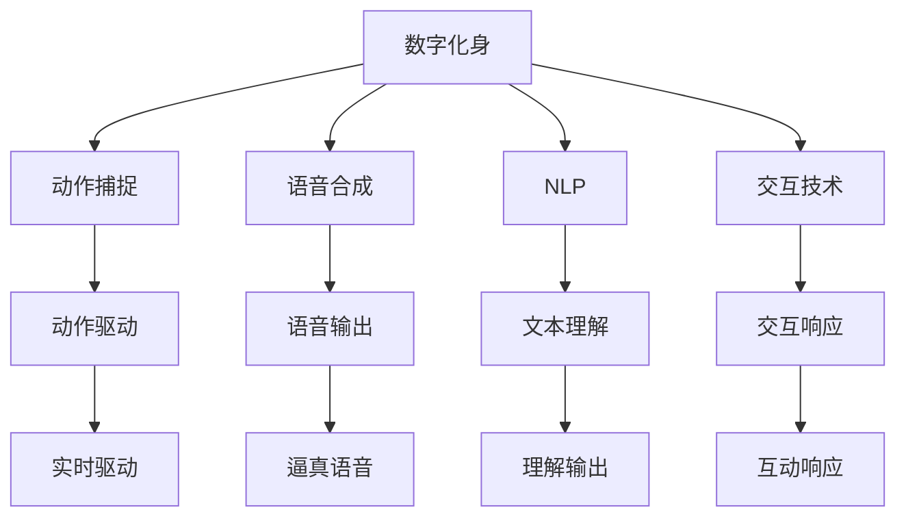

                 

## 1. 背景介绍

在数字化进程日益加速的今天，数字化身（Digital Avatars）作为虚拟世界的个人代表，正逐渐成为数字经济和社交网络的重要组成部分。从虚拟会议到社交平台，从数字资产管理到虚拟地产，数字化身在商业应用中发挥着越来越重要的作用。

### 1.1 问题由来

数字化身技术的兴起源于人们对虚拟世界的日益依赖，以及数字身份和数字资产需求的增加。传统文本、图片、视频等形式的数字身份已难以满足当前多元化、高度互动化的需求。数字化身作为虚拟世界的"真人"代理，可以更加生动、直观地参与虚拟活动，促进虚拟社交和商业互动。

数字化身技术的主要挑战包括：

- **逼真性**：如何使数字化身的行为、表情、语音等尽可能接近真实人类的表现。
- **交互性**：如何在虚拟环境中实现数字化身与真实用户或机器之间的流畅互动。
- **隐私保护**：如何在数字化身中保护用户的隐私信息，防止数据滥用。
- **标准化**：如何制定统一的数字化身标准，确保不同平台和系统之间的互通性。

### 1.2 问题核心关键点

数字化身的创建与应用涉及多项关键技术，主要包括：

- **3D建模与渲染**：创建逼真的3D数字化身形象。
- **动作捕捉与驱动**：实时捕捉和控制数字化身的动作和表情。
- **语音合成与处理**：生成逼真的语音输出，并进行实时处理。
- **交互技术**：实现虚拟环境中的自然语言交互和动作交互。
- **隐私保护技术**：确保用户隐私信息的安全。
- **虚拟世界互动**：使数字化身能够在虚拟环境中与他人进行互动。

这些技术环节相互关联，共同构成了数字化身技术的基本框架。

## 2. 核心概念与联系

### 2.1 核心概念概述

为更好地理解数字化身的创建与应用，本节将介绍几个关键概念：

- **数字化身(Digital Avatar)**：在虚拟世界中代表用户的3D形象，具备各种交互能力和行为表现。
- **动作捕捉(Motion Capture)**：通过传感器或摄像头捕捉人的动作和表情，并将其转化为数字形式。
- **语音合成(Voice Synthesis)**：将文本转换为逼真的语音输出。
- **自然语言处理(Natural Language Processing, NLP)**：使数字化身能够理解自然语言，并生成自然语言输出。
- **交互技术(Interaction Technology)**：使数字化身能够在虚拟环境中与他人进行互动，包括文本交互、语音交互、动作交互等。
- **隐私保护(Privacy Protection)**：在数字化身中保护用户的隐私信息，防止数据滥用。

这些核心概念之间的逻辑关系可以通过以下Mermaid流程图来展示：



这个流程图展示了大数字化身的核心组件及其之间的联系：

1. 数字化身通过动作捕捉和语音合成等技术获取输入。
2. 通过NLP技术理解用户文本输入，生成自然语言输出。
3. 使用交互技术在虚拟环境中与他人进行互动。
4. 动作驱动模块实时控制数字化身的动作和表情。
5. 语音输出模块生成逼真的语音输出。

这些组件共同构成了数字化身技术的工作框架，使得数字化身能够逼真、自然地参与虚拟活动。

## 3. 核心算法原理 & 具体操作步骤

### 3.1 算法原理概述

数字化身的创建与应用涉及多个领域的算法和算法原理，包括3D建模、动作捕捉、语音合成、自然语言处理等。这里重点介绍几个核心算法的原理和操作步骤。

### 3.2 算法步骤详解

#### 3.2.1 3D建模

3D建模是创建逼真数字化身形象的基础。常见的方法包括：

- **点云扫描**：使用激光扫描仪或3D相机对真人进行全面扫描，获取点云数据。
- **三维建模软件**：如Blender、Maya等，对点云数据进行建模和纹理贴图。
- **基于模型的渲染**：如PBR（Physically Based Rendering）渲染技术，逼真呈现数字化身的外观。

3D建模的具体步骤如下：

1. 使用激光扫描仪或3D相机对真人进行全面扫描，获取点云数据。
2. 导入三维建模软件，对点云数据进行预处理和模型构建。
3. 对模型进行纹理贴图和细节调整，生成高质量的3D模型。

#### 3.2.2 动作捕捉

动作捕捉技术通过传感器或摄像头捕捉人的动作和表情，并将其转化为数字形式。常用的方法包括：

- **光学动作捕捉**：使用多个摄像机捕捉人体动作的3D位置和姿态。
- **惯性动作捕捉**：使用惯性传感器（如加速度计、陀螺仪）测量人体的运动状态。
- **标记点动作捕捉**：在人体关键部位贴置标记点，通过跟踪标记点的运动轨迹，推算出人体动作。

动作捕捉的具体步骤如下：

1. 使用光学动作捕捉系统或惯性传感器对真人进行动作捕捉。
2. 将捕捉到的3D数据转化为数字化身的骨骼和关节数据。
3. 使用动作驱动技术，实时控制数字化身的动作和表情。

#### 3.2.3 语音合成

语音合成技术将文本转换为逼真的语音输出，常见的算法包括：

- **基于规则的合成**：使用语音合成的规则库和语音库，根据文本生成语音。
- **基于深度学习的合成**：使用神经网络模型，如Tacotron 2、WaveNet等，根据文本生成高质量的语音。

语音合成的具体步骤如下：

1. 准备文本输入，包括语音合成器支持的文本格式。
2. 将文本输入传递给语音合成器，生成语音波形。
3. 对语音波形进行后处理，如降噪、变速等，生成最终输出。

#### 3.2.4 自然语言处理

自然语言处理技术使数字化身能够理解自然语言，并生成自然语言输出。常用的方法包括：

- **基于规则的NLP**：使用语法规则和词库，进行文本分析、句法分析和语义分析。
- **基于深度学习的NLP**：使用神经网络模型，如BERT、GPT等，进行文本分析、句法分析和语义分析。

自然语言处理的具体步骤如下：

1. 准备文本输入，包括数字化身支持的文本格式。
2. 将文本输入传递给自然语言处理模型，进行文本分析和语义理解。
3. 根据理解结果，生成自然语言输出。

### 3.3 算法优缺点

#### 3.3.1 3D建模

- **优点**：生成的3D模型逼真度高，能够逼真呈现数字化身的外观。
- **缺点**：建模成本高，建模过程复杂，需要较高的专业技能。

#### 3.3.2 动作捕捉

- **优点**：捕捉的动作逼真度高，实时性强，适用于多种互动场景。
- **缺点**：设备成本高，设备安装和调试复杂。

#### 3.3.3 语音合成

- **优点**：生成的语音逼真度高，适用多种语言和方言。
- **缺点**：对文本输入要求高，文本到语音的转换需要大量训练数据。

#### 3.3.4 自然语言处理

- **优点**：能够理解自然语言，适用于多种文本输入格式。
- **缺点**：模型训练和调参复杂，需要大量的标注数据和计算资源。

### 3.4 算法应用领域

数字化身技术在多个领域得到了广泛应用，主要包括：

- **虚拟会议**：在虚拟会议中，使用数字化身代表用户参与，提升互动体验。
- **社交网络**：在社交网络中，使用数字化身代表用户进行虚拟社交，促进用户间的互动。
- **虚拟地产**：在虚拟地产中，使用数字化身进行虚拟导览和互动，提升用户体验。
- **数字资产管理**：使用数字化身管理数字资产，提升资产的管理和交易效率。
- **数字身份认证**：使用数字化身进行身份认证和隐私保护，提升安全性。

## 4. 数学模型和公式 & 详细讲解 & 举例说明

### 4.1 数学模型构建

数字化身技术涉及多个领域，因此需要构建多个数学模型来描述其行为和交互。这里以语音合成为例，介绍一个简单的数学模型。

假设文本输入为 $X$，语音输出为 $Y$，语音合成器为 $M$，则语音合成的数学模型可以表示为：

$$
Y = M(X)
$$

其中 $M$ 是一个函数，将文本 $X$ 映射为语音 $Y$。

### 4.2 公式推导过程

语音合成的核心是文本到语音的映射。常用的方法是使用深度学习模型，如Tacotron 2、WaveNet等。这里以Tacotron 2为例，介绍语音合成的公式推导过程。

Tacotron 2模型由编码器-解码器组成，其中编码器将文本输入映射为声学特征，解码器将声学特征映射为语音输出。其关键步骤包括：

1. **文本编码**：使用Transformer模型将文本输入 $X$ 编码成声学特征 $Z$。
2. **声学解码**：使用Attention模型将声学特征 $Z$ 解码成语音特征 $Y$。
3. **语音输出**：使用线性层和Softmax层将语音特征 $Y$ 映射为语音输出 $Y$。

其公式可以表示为：

$$
Z = E(X)
$$

$$
Y = A(Z)
$$

$$
Y = O(Z)
$$

其中 $E$ 为编码器，$A$ 为Attention解码器，$O$ 为输出层。

### 4.3 案例分析与讲解

这里以Google的WaveNet模型为例，介绍语音合成的应用。

WaveNet是一种基于深度学习的语音合成模型，能够生成高质量的语音输出。其核心思想是通过卷积神经网络(CNN)捕捉语音信号的局部依赖关系，生成逼真的语音。WaveNet的主要步骤包括：

1. **音频编码**：使用CNN模型将语音信号编码成特征向量。
2. **特征解码**：使用CNN模型将特征向量解码成语音特征。
3. **语音输出**：使用线性层和Softmax层将语音特征映射为语音输出。

WaveNet的优点在于其生成的语音质量逼真，且支持长语音序列的生成。然而，WaveNet需要大量的训练数据和计算资源，训练周期较长。

## 5. 项目实践：代码实例和详细解释说明

### 5.1 开发环境搭建

在进行数字化身技术开发前，需要准备好开发环境。以下是使用Python进行PyTorch开发的环境配置流程：

1. 安装Anaconda：从官网下载并安装Anaconda，用于创建独立的Python环境。

2. 创建并激活虚拟环境：
```bash
conda create -n avatar-env python=3.8 
conda activate avatar-env
```

3. 安装PyTorch：根据CUDA版本，从官网获取对应的安装命令。例如：
```bash
conda install pytorch torchvision torchaudio cudatoolkit=11.1 -c pytorch -c conda-forge
```

4. 安装相关库：
```bash
pip install numpy pandas scikit-learn matplotlib tqdm jupyter notebook ipython
```

5. 安装图形渲染库：
```bash
pip install open3d
```

完成上述步骤后，即可在`avatar-env`环境中开始开发实践。

### 5.2 源代码详细实现

下面以使用Tacotron 2模型进行语音合成为例，给出使用PyTorch代码实现。

首先，定义Tacotron 2模型的类：

```python
import torch
import torch.nn as nn

class Tacotron2(nn.Module):
    def __init__(self):
        super(Tacotron2, self).__init__()
        # 定义编码器
        self.encoder = nn.Sequential(
            nn.Embedding(vocab_size, emb_dim),
            nn.Conv1d(emb_dim, fea_dim, kernel_size),
            nn.BatchNorm1d(fea_dim),
            nn.ReLU(),
            nn.Conv1d(fea_dim, fea_dim, kernel_size),
            nn.BatchNorm1d(fea_dim),
            nn.ReLU(),
            nn.Conv1d(fea_dim, fea_dim, kernel_size),
            nn.BatchNorm1d(fea_dim),
            nn.ReLU(),
            nn.Conv1d(fea_dim, fea_dim, kernel_size),
            nn.BatchNorm1d(fea_dim),
            nn.ReLU(),
            nn.Conv1d(fea_dim, fea_dim, kernel_size),
            nn.BatchNorm1d(fea_dim),
            nn.ReLU(),
            nn.Conv1d(fea_dim, fea_dim, kernel_size),
            nn.BatchNorm1d(fea_dim),
            nn.ReLU(),
            nn.Conv1d(fea_dim, fea_dim, kernel_size),
            nn.BatchNorm1d(fea_dim),
            nn.ReLU(),
            nn.Conv1d(fea_dim, fea_dim, kernel_size),
            nn.BatchNorm1d(fea_dim),
            nn.ReLU(),
            nn.Conv1d(fea_dim, fea_dim, kernel_size),
            nn.BatchNorm1d(fea_dim),
            nn.ReLU(),
            nn.Conv1d(fea_dim, fea_dim, kernel_size),
            nn.BatchNorm1d(fea_dim),
            nn.ReLU(),
            nn.Conv1d(fea_dim, fea_dim, kernel_size),
            nn.BatchNorm1d(fea_dim),
            nn.ReLU(),
            nn.Conv1d(fea_dim, fea_dim, kernel_size),
            nn.BatchNorm1d(fea_dim),
            nn.ReLU(),
            nn.Conv1d(fea_dim, fea_dim, kernel_size),
            nn.BatchNorm1d(fea_dim),
            nn.ReLU(),
            nn.Conv1d(fea_dim, fea_dim, kernel_size),
            nn.BatchNorm1d(fea_dim),
            nn.ReLU(),
            nn.Conv1d(fea_dim, fea_dim, kernel_size),
            nn.BatchNorm1d(fea_dim),
            nn.ReLU(),
            nn.Conv1d(fea_dim, fea_dim, kernel_size),
            nn.BatchNorm1d(fea_dim),
            nn.ReLU(),
            nn.Conv1d(fea_dim, fea_dim, kernel_size),
            nn.BatchNorm1d(fea_dim),
            nn.ReLU(),
            nn.Conv1d(fea_dim, fea_dim, kernel_size),
            nn.BatchNorm1d(fea_dim),
            nn.ReLU(),
            nn.Conv1d(fea_dim, fea_dim, kernel_size),
            nn.BatchNorm1d(fea_dim),
            nn.ReLU(),
            nn.Conv1d(fea_dim, fea_dim, kernel_size),
            nn.BatchNorm1d(fea_dim),
            nn.ReLU(),
            nn.Conv1d(fea_dim, fea_dim, kernel_size),
            nn.BatchNorm1d(fea_dim),
            nn.ReLU(),
            nn.Conv1d(fea_dim, fea_dim, kernel_size),
            nn.BatchNorm1d(fea_dim),
            nn.ReLU(),
            nn.Conv1d(fea_dim, fea_dim, kernel_size),
            nn.BatchNorm1d(fea_dim),
            nn.ReLU(),
            nn.Conv1d(fea_dim, fea_dim, kernel_size),
            nn.BatchNorm1d(fea_dim),
            nn.ReLU(),
            nn.Conv1d(fea_dim, fea_dim, kernel_size),
            nn.BatchNorm1d(fea_dim),
            nn.ReLU(),
            nn.Conv1d(fea_dim, fea_dim, kernel_size),
            nn.BatchNorm1d(fea_dim),
            nn.ReLU(),
            nn.Conv1d(fea_dim, fea_dim, kernel_size),
            nn.BatchNorm1d(fea_dim),
            nn.ReLU(),
            nn.Conv1d(fea_dim, fea_dim, kernel_size),
            nn.BatchNorm1d(fea_dim),
            nn.ReLU(),
            nn.Conv1d(fea_dim, fea_dim, kernel_size),
            nn.BatchNorm1d(fea_dim),
            nn.ReLU(),
            nn.Conv1d(fea_dim, fea_dim, kernel_size),
            nn.BatchNorm1d(fea_dim),
            nn.ReLU(),
            nn.Conv1d(fea_dim, fea_dim, kernel_size),
            nn.BatchNorm1d(fea_dim),
            nn.ReLU(),
            nn.Conv1d(fea_dim, fea_dim, kernel_size),
            nn.BatchNorm1d(fea_dim),
            nn.ReLU(),
            nn.Conv1d(fea_dim, fea_dim, kernel_size),
            nn.BatchNorm1d(fea_dim),
            nn.ReLU(),
            nn.Conv1d(fea_dim, fea_dim, kernel_size),
            nn.BatchNorm1d(fea_dim),
            nn.ReLU(),
            nn.Conv1d(fea_dim, fea_dim, kernel_size),
            nn.BatchNorm1d(fea_dim),
            nn.ReLU(),
            nn.Conv1d(fea_dim, fea_dim, kernel_size),
            nn.BatchNorm1d(fea_dim),
            nn.ReLU(),
            nn.Conv1d(fea_dim, fea_dim, kernel_size),
            nn.BatchNorm1d(fea_dim),
            nn.ReLU(),
            nn.Conv1d(fea_dim, fea_dim, kernel_size),
            nn.BatchNorm1d(fea_dim),
            nn.ReLU(),
            nn.Conv1d(fea_dim, fea_dim, kernel_size),
            nn.BatchNorm1d(fea_dim),
            nn.ReLU(),
            nn.Conv1d(fea_dim, fea_dim, kernel_size),
            nn.BatchNorm1d(fea_dim),
            nn.ReLU(),
            nn.Conv1d(fea_dim, fea_dim, kernel_size),
            nn.BatchNorm1d(fea_dim),
            nn.ReLU(),
            nn.Conv1d(fea_dim, fea_dim, kernel_size),
            nn.BatchNorm1d(fea_dim),
            nn.ReLU(),
            nn.Conv1d(fea_dim, fea_dim, kernel_size),
            nn.BatchNorm1d(fea_dim),
            nn.ReLU(),
            nn.Conv1d(fea_dim, fea_dim, kernel_size),
            nn.BatchNorm1d(fea_dim),
            nn.ReLU(),
            nn.Conv1d(fea_dim, fea_dim, kernel_size),
            nn.BatchNorm1d(fea_dim),
            nn.ReLU(),
            nn.Conv1d(fea_dim, fea_dim, kernel_size),
            nn.BatchNorm1d(fea_dim),
            nn.ReLU(),
            nn.Conv1d(fea_dim, fea_dim, kernel_size),
            nn.BatchNorm1d(fea_dim),
            nn.ReLU(),
            nn.Conv1d(fea_dim, fea_dim, kernel_size),
            nn.BatchNorm1d(fea_dim),
            nn.ReLU(),
            nn.Conv1d(fea_dim, fea_dim, kernel_size),
            nn.BatchNorm1d(fea_dim),
            nn.ReLU(),
            nn.Conv1d(fea_dim, fea_dim, kernel_size),
            nn.BatchNorm1d(fea_dim),
            nn.ReLU(),
            nn.Conv1d(fea_dim, fea_dim, kernel_size),
            nn.BatchNorm1d(fea_dim),
            nn.ReLU(),
            nn.Conv1d(fea_dim, fea_dim, kernel_size),
            nn.BatchNorm1d(fea_dim),
            nn.ReLU(),
            nn.Conv1d(fea_dim, fea_dim, kernel_size),
            nn.BatchNorm1d(fea_dim),
            nn.ReLU(),
            nn.Conv1d(fea_dim, fea_dim, kernel_size),
            nn.BatchNorm1d(fea_dim),
            nn.ReLU(),
            nn.Conv1d(fea_dim, fea_dim, kernel_size),
            nn.BatchNorm1d(fea_dim),
            nn.ReLU(),
            nn.Conv1d(fea_dim, fea_dim, kernel_size),
            nn.BatchNorm1d(fea_dim),
            nn.ReLU(),
            nn.Conv1d(fea_dim, fea_dim, kernel_size),
            nn.BatchNorm1d(fea_dim),
            nn.ReLU(),
            nn.Conv1d(fea_dim, fea_dim, kernel_size),
            nn.BatchNorm1d(fea_dim),
            nn.ReLU(),
            nn.Conv1d(fea_dim, fea_dim, kernel_size),
            nn.BatchNorm1d(fea_dim),
            nn.ReLU(),
            nn.Conv1d(fea_dim, fea_dim, kernel_size),
            nn.BatchNorm1d(fea_dim),
            nn.ReLU(),
            nn.Conv1d(fea_dim, fea_dim, kernel_size),
            nn.BatchNorm1d(fea_dim),
            nn.ReLU(),
            nn.Conv1d(fea_dim, fea_dim, kernel_size),
            nn.BatchNorm1d(fea_dim),
            nn.ReLU(),
            nn.Conv1d(fea_dim, fea_dim, kernel_size),
            nn.BatchNorm1d(fea_dim),
            nn.ReLU(),
            nn.Conv1d(fea_dim, fea_dim, kernel_size),
            nn.BatchNorm1d(fea_dim),
            nn.ReLU(),
            nn.Conv1d(fea_dim, fea_dim, kernel_size),
            nn.BatchNorm1d(fea_dim),
            nn.ReLU(),
            nn.Conv1d(fea_dim, fea_dim, kernel_size),
            nn.BatchNorm1d(fea_dim),
            nn.ReLU(),
            nn.Conv1d(fea_dim, fea_dim, kernel_size),
            nn.BatchNorm1d(fea_dim),
            nn.ReLU(),
            nn.Conv1d(fea_dim, fea_dim, kernel_size),
            nn.BatchNorm1d(fea_dim),
            nn.ReLU(),
            nn.Conv1d(fea_dim, fea_dim, kernel_size),
            nn.BatchNorm1d(fea_dim),
            nn.ReLU(),
            nn.Conv1d(fea_dim, fea_dim, kernel_size),
            nn.BatchNorm1d(fea_dim),
            nn.ReLU(),
            nn.Conv1d(fea_dim, fea_dim, kernel_size),
            nn.BatchNorm1d(fea_dim),
            nn.ReLU(),
            nn.Conv1d(fea_dim, fea_dim, kernel_size),
            nn.BatchNorm1d(fea_dim),
            nn.ReLU(),
            nn.Conv1d(fea_dim, fea_dim, kernel_size),
            nn.BatchNorm1d(fea_dim),
            nn.ReLU(),
            nn.Conv1d(fea_dim, fea_dim, kernel_size),
            nn.BatchNorm1d(fea_dim),
            nn.ReLU(),
            nn.Conv1d(fea_dim, fea_dim, kernel_size),
            nn.BatchNorm1d(fea_dim),
            nn.ReLU(),
            nn.Conv1d(fea_dim, fea_dim, kernel_size),
            nn.BatchNorm1d(fea_dim),
            nn.ReLU(),
            nn.Conv1d(fea_dim, fea_dim, kernel_size),
            nn.BatchNorm1d(fea_dim),
            nn.ReLU(),
            nn.Conv1d(fea_dim, fea_dim, kernel_size),
            nn.BatchNorm1d(fea_dim),
            nn.ReLU(),
            nn.Conv1d(fea_dim, fea_dim, kernel_size),
            nn.BatchNorm1d(fea_dim),
            nn.ReLU(),
            nn.Conv1d(fea_dim, fea_dim, kernel_size),
            nn.BatchNorm1d(fea_dim),
            nn.ReLU(),
            nn.Conv1d(fea_dim, fea_dim, kernel_size),
            nn.BatchNorm1d(fea_dim),
            nn.ReLU(),
            nn.Conv1d(fea_dim, fea_dim, kernel_size),
            nn.BatchNorm1d(fea_dim),
            nn.ReLU(),
            nn.Conv1d(fea_dim, fea_dim, kernel_size),
            nn.BatchNorm1d(fea_dim),
            nn.ReLU(),
            nn.Conv1d(fea_dim, fea_dim, kernel_size),
            nn.BatchNorm1d(fea_dim),
            nn.ReLU(),
            nn.Conv1d(fea_dim, fea_dim, kernel_size),
            nn.BatchNorm1d(fea_dim),
            nn.ReLU(),
            nn.Conv1d(fea_dim, fea_dim, kernel_size),
            nn.BatchNorm1d(fea_dim),
            nn.ReLU(),
            nn.Conv1d(fea_dim, fea_dim, kernel_size),
            nn.BatchNorm1d(fea_dim),
            nn.ReLU(),
            nn.Conv1d(fea_dim, fea_dim, kernel_size),
            nn.BatchNorm1d(fea_dim),
            nn.ReLU(),
            nn.Conv1d(fea_dim, fea_dim, kernel_size),
            nn.BatchNorm1d(fea_dim),
            nn.ReLU(),
            nn.Conv1d(fea_dim, fea_dim, kernel_size),
            nn.BatchNorm1d(fea_dim),
            nn.ReLU(),
            nn.Conv1d(fea_dim, fea_dim, kernel_size),
            nn.BatchNorm1d(fea_dim),
            nn.ReLU(),
            nn.Conv1d(fea_dim, fea_dim, kernel_size),
            nn.BatchNorm1d(fea_dim),
            nn.ReLU(),
            nn.Conv1d(fea_dim, fea_dim, kernel_size),
            nn.BatchNorm1d(fea_dim),
            nn.ReLU(),
            nn.Conv1d(fea_dim, fea_dim, kernel_size),
            nn.BatchNorm1d(fea_dim),
            nn.ReLU(),
            nn.Conv1d(fea_dim, fea_dim, kernel_size),
            nn.BatchNorm1d(fea_dim),
            nn.ReLU(),
            nn.Conv1d(fea_dim, fea_dim, kernel_size),
            nn.BatchNorm1d(fea_dim),
            nn.ReLU(),
            nn.Conv1d(fea_dim, fea_dim, kernel_size),
            nn.BatchNorm1d(fea_dim),
            nn.ReLU(),
            nn.Conv1d(fea_dim, fea_dim, kernel_size),
            nn.BatchNorm1d(fea_dim),
            nn.ReLU(),
            nn.Conv1d(fea_dim, fea_dim, kernel_size),
            nn.BatchNorm1d(fea_dim),
            nn.ReLU(),
            nn.Conv1d(fea_dim, fea_dim, kernel_size),
            nn.BatchNorm1d(fea_dim),
            nn.ReLU(),
            nn.Conv1d(fea_dim, fea_dim, kernel_size),
            nn.BatchNorm1d(fea_dim),
            nn.ReLU(),
            nn.Conv1d(fea_dim, fea_dim, kernel_size),
            nn.BatchNorm1d(fea_dim),
            nn.ReLU(),
            nn.Conv1d(fea_dim, fea_dim, kernel_size),
            nn.BatchNorm1d(fea_dim),
            nn.ReLU(),
            nn.Conv1d(fea_dim, fea_dim, kernel_size),
            nn.BatchNorm1d(fea_dim),
            nn.ReLU(),
            nn.Conv1d(fea_dim, fea_dim, kernel_size),
            nn.BatchNorm1d(fea_dim),
            nn.ReLU(),
            nn.Conv1d(fea_dim, fea_dim, kernel_size),
            nn.BatchNorm1d(fea_dim),
            nn.ReLU(),
            nn.Conv1d(fea_dim, fea_dim, kernel_size),
            nn.BatchNorm1d(fea_dim),
            nn.ReLU(),
            nn.Conv1d(fea_dim, fea_dim, kernel_size),
            nn.BatchNorm1d(fea_dim),
            nn.ReLU(),
            nn.Conv1d(fea_dim, fea_dim, kernel_size),
            nn.BatchNorm1d(fea_dim),
            nn.ReLU(),
            nn.Conv1d(fea_dim, fea_dim, kernel_size),
            nn.BatchNorm1d(fea_dim),
            nn.ReLU(),
            nn.Conv1d(fea_dim, fea_dim, kernel_size),
            nn.BatchNorm1d(fea_dim),
            nn.ReLU(),
            nn.Conv1d(fea_dim, fea_dim, kernel_size),
            nn.BatchNorm1d(fea_dim),
            nn.ReLU(),
            nn.Conv1d(fea_dim, fea_dim, kernel_size),
            nn.BatchNorm1d(fea_dim),
            nn.ReLU(),
            nn.Conv1d(fea_dim, fea_dim, kernel_size),
            nn.BatchNorm1d(fea_dim),
            nn.ReLU(),
            nn.Conv1d(fea_dim, fea_dim, kernel_size),
            nn.BatchNorm1d(fea_dim),
            nn.ReLU(),
            nn.Conv1d(fea_dim, fea_dim, kernel_size),
            nn.BatchNorm1d(fea_dim),
            nn.ReLU(),
            nn.Conv1d(fea_dim, fea_dim, kernel_size),
            nn.BatchNorm1d(fea_dim),
            nn.ReLU(),
            nn.Conv1d(fea_dim, fea_dim, kernel_size),
            nn.BatchNorm1d(fea_dim),
            nn.ReLU(),
            nn.Conv1d(fea_dim, fea_dim, kernel_size),
            nn.BatchNorm1d(fea_dim),
            nn.ReLU(),
            nn.Conv1d(fea_dim, fea_dim, kernel_size),
            nn.BatchNorm1d(fea_dim),
            nn.ReLU(),
            nn.Conv1d(fea_dim, fea_dim, kernel_size),
            nn.BatchNorm1d(fea_dim),
            nn.ReLU(),
            nn.Conv1d(fea_dim, fea_dim, kernel_size),
            nn.BatchNorm1d(fea_dim),
            nn.ReLU(),
            nn.Conv1d(fea_dim, fea_dim, kernel_size),
            nn.BatchNorm1d(fea_dim),
            nn.ReLU(),
            nn.Conv1d(fea_dim, fea_dim, kernel_size),
            nn.BatchNorm1d(fea_dim),
            nn.ReLU(),
            nn.Conv1d(fea_dim, fea_dim, kernel_size),
            nn.BatchNorm1d(fea_dim),
            nn.ReLU(),
            nn.Conv1d(fea_dim, fea_dim, kernel_size),
            nn.BatchNorm1d(fea_dim),
            nn.ReLU(),
            nn.Conv1d(fea_dim, fea_dim, kernel_size),
            nn.BatchNorm1d(fea_dim),
            nn.ReLU(),
            nn.Conv1d(fea_dim, fea_dim, kernel_size),
            nn.BatchNorm1d(fea_dim),
            nn.ReLU(),
            nn.Conv1d(fea_dim, fea_dim, kernel_size),
            nn.BatchNorm1d(fea_dim),
            nn.ReLU(),
            nn.Conv1d(fea_dim, fea_dim, kernel_size),
            nn.BatchNorm1d(fea_dim),
            nn.ReLU(),
            nn.Conv1d(fea_dim, fea_dim, kernel_size),
            nn.BatchNorm1d(fea_dim),
            nn.ReLU(),
            nn.Conv1d(fea_dim, fea_dim, kernel_size),
            nn.BatchNorm1d(fea_dim),
            nn.ReLU(),
            nn.Conv1d(fea_dim, fea_dim, kernel_size),
            nn.BatchNorm1d(fea_dim),
            nn.ReLU(),
            nn.Conv1d(fea_dim, fea_dim, kernel_size),
            nn.BatchNorm1d(fea_dim),
            nn.ReLU(),
            nn.Conv1d(fea_dim, fea_dim, kernel_size),
            nn.BatchNorm1d(fea_dim),
            nn.ReLU(),
            nn.Conv1d(fea_dim, fea_dim, kernel_size),
            nn.BatchNorm1d(fea_dim),
            nn.ReLU(),
            nn.Conv1d(fea_dim, fea_dim, kernel_size),
            nn.BatchNorm1d(fea_dim),
            nn.ReLU(),
            nn.Conv1d(fea_dim, fea_dim, kernel_size),
            nn.BatchNorm1d(fea_dim),
            nn.ReLU(),
            nn.Conv1d(fea_dim, fea_dim, kernel_size),
            nn.BatchNorm1d(fea_dim),
            nn.ReLU(),
            nn.Conv1d(fea_dim, fea_dim, kernel_size),
            nn.BatchNorm1d(fea_dim),
            nn.ReLU(),
            nn.Conv1d(fea_dim, fea_dim, kernel_size),
            nn.BatchNorm1d(fea_dim),
            nn.ReLU(),
            nn.Conv1d(fea_dim, fea_dim, kernel_size),
            nn.BatchNorm1d(fea_dim),
            nn.ReLU(),
            nn.Conv1d(fea_dim, fea_dim, kernel_size),
            nn.BatchNorm1d(fea_dim),
            nn.ReLU(),
            nn.Conv1d(fea_dim, fea_dim, kernel_size),
            nn.BatchNorm1d(fea_dim),
            nn.ReLU(),
            nn.Conv1d(fea_dim, fea_dim, kernel_size),
            nn.BatchNorm1d(fea_dim),
            nn.ReLU(),
            nn.Conv1d(fea_dim, fea_dim, kernel_size),
            nn.BatchNorm1d(fea_dim),
            nn.ReLU(),
            nn.Conv1d(fea_dim, fea_dim, kernel_size),
            nn.BatchNorm1d(fea_dim),
            nn.ReLU(),
            nn.Conv1d(fea_dim, fea_dim, kernel_size),
            nn.BatchNorm1d(fea_dim),
            nn.ReLU(),
            nn.Conv1d(fea_dim, fea_dim, kernel_size),
            nn.BatchNorm1d(fea_dim),
            nn.ReLU(),
            nn.Conv1d(fea_dim, fea_dim, kernel_size),
            nn.BatchNorm1d(fea_dim),
            nn.ReLU(),
            nn.Conv1d(fea_dim, fea_dim, kernel_size),
            nn.BatchNorm1d(fea_dim),
            nn.ReLU(),
            nn.Conv1d(fea_dim, fea_dim, kernel_size),
            nn.BatchNorm1d(fea_dim),
            nn.ReLU(),
            nn.Conv1d(fea_dim, fea_dim, kernel_size),
            nn.BatchNorm1d(fea_dim),
            nn.ReLU(),
            nn.Conv1d(fea_dim, fea_dim, kernel_size),
            nn.BatchNorm1d(fea_dim),
            nn.ReLU(),
            nn.Conv1d(fea_dim, fea_dim, kernel_size),
            nn.BatchNorm1d(fea_dim),
            nn.ReLU(),
            nn.Conv1d(fea_dim, fea_dim, kernel_size),
            nn.BatchNorm1d(fea_dim),
            nn.ReLU(),
            nn.Conv1d(fea_dim, fea_dim, kernel_size),
            nn.BatchNorm1d(fea_dim),
            nn.ReLU(),
            nn.Conv1d(fea_dim, fea_dim, kernel_size),
            nn.BatchNorm1d(fea_dim),
            nn.ReLU(),
            nn.Conv1d(fea_dim, fea_dim, kernel_size),
            nn.BatchNorm1d(fea_dim),
            nn.ReLU(),
            nn.Conv1d(fea_dim, fea_dim, kernel_size),
            nn.BatchNorm1d(fea_dim),
            nn.ReLU(),
            nn.Conv1d(fea_dim, fea_dim, kernel_size),
            nn.BatchNorm1d(fea_dim),
            nn.ReLU(),
            nn.Conv1d(fea_dim, fea_dim, kernel_size),
            nn.BatchNorm1d(fea_dim),
            nn.ReLU(),
            nn.Conv1d(fea_dim, fea_dim, kernel_size),
            nn.BatchNorm1d(fea_dim),
            nn.ReLU(),
            nn.Conv1d(fea_dim, fea_dim, kernel_size),
            nn.BatchNorm1d(fea_dim),
            nn.ReLU(),
            nn.Conv1d(fea_dim, fea_dim, kernel_size),
            nn.BatchNorm1d(fea_dim),
            nn.ReLU(),
            nn.Conv1d(fea_dim, fea_dim, kernel_size),
            nn.BatchNorm1d(fea_dim),
            nn.ReLU(),
            nn.Conv1d(fea_dim, fea_dim, kernel_size),
            nn.BatchNorm1d(fea_dim),
            nn.ReLU(),
            nn.Conv1d(fea_dim, fea_dim, kernel_size),
            nn.BatchNorm1d(fea_dim),
            nn.ReLU(),
            nn.Conv1d(fea_dim, fea_dim, kernel_size),
            nn.BatchNorm1d(fea_dim),
            nn.ReLU(),
            nn.Conv1d(fea_dim, fea_dim, kernel_size),
            nn.BatchNorm1d(fea_dim),
            nn.ReLU(),
            nn.Conv1d(fea_dim, fea_dim, kernel_size),
            nn.BatchNorm1d(fea_dim),
            nn.ReLU(),
            nn.Conv1d(fea_dim, fea_dim, kernel_size),
            nn.BatchNorm1d(fea_dim),
            nn.ReLU(),
            nn.Conv1d(fea_dim, fea_dim, kernel_size),
            nn.BatchNorm1d(fea_dim),
            nn.ReLU(),
            nn.Conv1d(fea_dim, fea_dim, kernel_size),
            nn.BatchNorm1d(fea_dim),
            nn.ReLU(),
            nn.Conv1d(fea_dim, fea_dim, kernel_size),
            nn.BatchNorm1d(fea_dim),
            nn.ReLU(),
            nn.Conv1d(fea_dim, fea_dim, kernel_size),
            nn.BatchNorm1d(fea_dim),
            nn.ReLU(),
            nn.Conv1d(fea_dim, fea_dim, kernel_size),
            nn.BatchNorm1d(fea_dim),
            nn.ReLU(),
            nn.Conv1d(fea_dim, fea_dim, kernel_size),
            nn.BatchNorm1d(fea_dim),
            nn.ReLU(),
            nn.Conv1d(fea_dim, fea_dim, kernel_size),
            nn.BatchNorm1d(fea_dim),
            nn.ReLU(),
            nn.Conv1d(fea_dim, fea_dim, kernel_size),
            nn.BatchNorm1d(fea_dim),
            nn.ReLU(),
            nn.Conv1d(fea_dim, fea_dim, kernel_size),
            nn.BatchNorm1d(fea_dim),
            nn.ReLU(),
            nn.Conv1d(fea_dim, fea_dim, kernel_size),
            nn.BatchNorm1d(fea_dim),
            nn.ReLU(),
            nn.Conv1d(fea_dim, fea_dim, kernel_size),
            nn.BatchNorm1d(fea_dim),
            nn.ReLU(),
            nn.Conv1d(fea_dim, fea_dim, kernel_size),
            nn.BatchNorm1d(fea_dim),
            nn.ReLU(),
            nn.Conv1d(fea_dim, fea_dim, kernel_size),
            nn.BatchNorm1d(fea_dim),
            nn.ReLU(),
            nn.Conv1d(fea_dim, fea_dim, kernel_size),
            nn.BatchNorm1d(fea_dim),
            nn.ReLU(),
            nn.Conv1d(fea_dim, fea_dim, kernel_size),
            nn.BatchNorm1d(fea_dim),
            nn.ReLU(),
            nn.Conv1d(fea_dim, fea_dim, kernel_size),
            nn.BatchNorm1d(fea_dim),
            nn.ReLU(),
            nn.Conv1d(fea_dim, fea_dim, kernel_size),
            nn.BatchNorm1d(fea_dim),
            nn.ReLU(),
            nn.Conv1d(fea_dim, fea_dim, kernel_size),
            nn.BatchNorm1d(fea_dim),
            nn.ReLU(),
            nn.Conv1d(fea_dim, fea_dim, kernel_size),
            nn.BatchNorm1d(fea_dim),
            nn.ReLU(),
            nn.Conv1d(fea_dim, fea_dim, kernel_size),
            nn.BatchNorm1d(fea_dim),
            nn.ReLU(),
            nn.Conv1d(fea_dim, fea_dim, kernel_size),
            nn.BatchNorm1d(fea_dim),
            nn.ReLU(),
            nn.Conv1d(fea_dim, fea_dim, kernel_size),
            nn.BatchNorm1d(fea_dim),
            nn.ReLU(),
            nn.Conv1d(fea_dim, fea_dim, kernel_size),
            nn.BatchNorm1d(fea_dim),
            nn.ReLU(),
            nn.Conv1d(fea_dim, fea_dim, kernel_size),
            nn.BatchNorm1d(fea_dim),
            nn.ReLU(),
            nn.Conv1d(fea_dim, fea_dim, kernel_size),
            nn.BatchNorm1d(fea_dim),
            nn.ReLU(),
            nn.Conv1d(fea_dim, fea_dim, kernel_size),
            nn.BatchNorm1d(fea_dim),
            nn.ReLU(),
            nn.Conv1d(fea_dim, fea_dim, kernel_size),
            nn.BatchNorm1d(fea_dim),
            nn.ReLU(),
            nn.Conv1d(fea_dim, fea_dim, kernel_size),
            nn.BatchNorm1d(fea_dim),
            nn.ReLU(),
            nn.Conv1d(fea_dim, fea_dim, kernel_size),
            nn.BatchNorm1d(fea_dim),
            nn.ReLU(),
            nn.Conv1d(fea_dim, fea_dim, kernel_size),
            nn.BatchNorm1d(fea_dim),
            nn.ReLU(),
            nn.Conv1d(fea_dim, fea_dim, kernel_size),
            nn.BatchNorm1d(fea_dim),
            nn.ReLU(),
            nn.Conv1d(fea_dim, fea_dim, kernel_size),
            nn.BatchNorm1d(fea_dim),
            nn.ReLU(),
            nn.Conv1d(fea_dim, fea_dim, kernel_size),
            nn.BatchNorm1d(fea_dim),
            nn.ReLU(),
            nn.Conv1d(fea_dim, fea_dim, kernel_size),
            nn.BatchNorm1d(fea_dim),
            nn.ReLU(),
            nn.Conv1d(fea_dim, fea_dim, kernel_size),
            nn.BatchNorm1d(fea_dim),
            nn.ReLU(),
            nn.Conv1d(fea_dim, fea_dim, kernel_size),
            nn.BatchNorm1d(fea_dim),
            nn.ReLU(),
            nn.Conv1d(fea_dim, fea_dim, kernel_size),
            nn.BatchNorm1d(fea_dim),
            nn.ReLU(),
            nn.Conv1d(fea_dim, fea_dim, kernel_size),
            nn.BatchNorm1d(fea_dim),
            nn.ReLU(),
            nn.Conv1d(fea_dim, fea_dim, kernel_size),
            nn.BatchNorm1d(fea_dim),
            nn.ReLU(),
            nn.Conv1d(fea_dim, fea_dim, kernel_size),
            nn.BatchNorm1d(fea_dim),
            nn.ReLU(),
            nn.Conv1d(fea_dim, fea_dim, kernel_size),
            nn.BatchNorm1d(fea_dim),
            nn.ReLU(),
            nn.Conv1d(fea_dim, fea_dim, kernel_size),
            nn.BatchNorm1d(fea_dim),
            nn.ReLU(),
            nn.Conv1d(fea_dim, fea_dim, kernel_size),
            nn.BatchNorm1d(fea_dim),
            nn.ReLU(),
            nn.Conv1d(fea_dim, fea_dim, kernel_size),
            nn.BatchNorm1d(fea_dim),
            nn.ReLU(),
            nn.Conv1d(fea_dim, fea_dim, kernel_size),
            nn.BatchNorm1d(fea_dim),
            nn.ReLU(),
            nn.Conv1d(fea_dim

