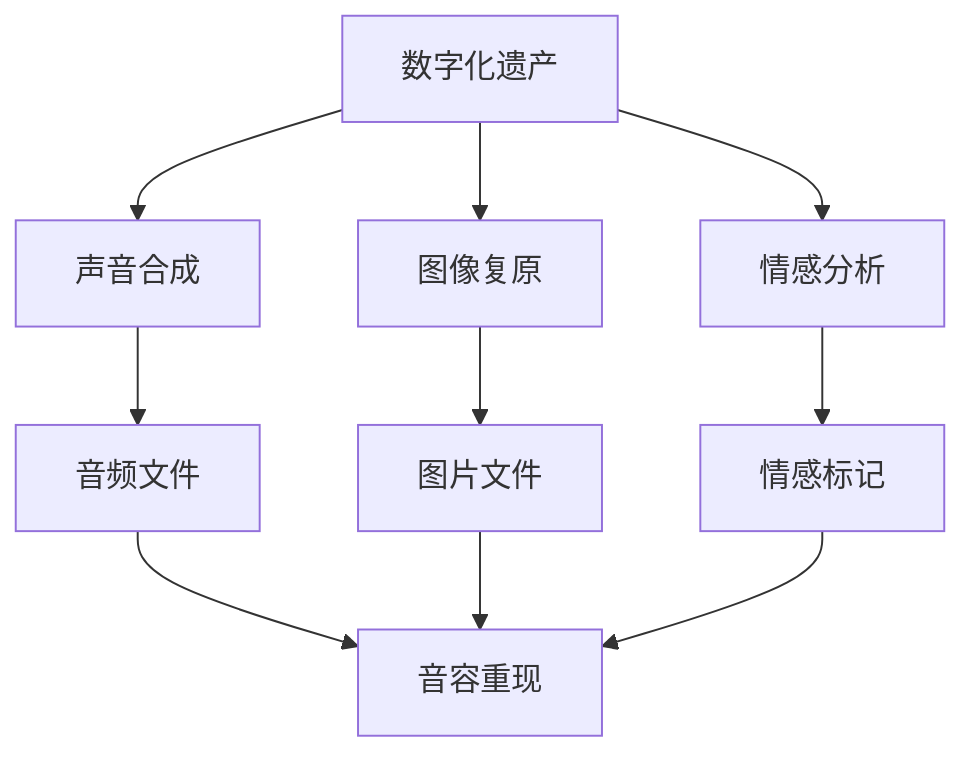

                 

# 数字化遗产回忆创业：AI重现逝者音容

> 关键词：数字化遗产, 音容重现, AI技术, 声音合成, 图像复原, 情感分析, 人工智能, 创业商机

## 1. 背景介绍

### 1.1 问题由来
随着数字科技的迅猛发展，数字化遗产这一新兴领域逐渐进入公众视野。数字化遗产不仅包括数字照片、视频、文档等常见形式，还涵盖了音容、语音、情感表达等多种形式，是人们留下的一种无形遗产。面对亲人的离世，许多人希望能通过技术手段，重新捕捉和再现逝者的音容，以慰藉心中那份无法割舍的情感。而这一需求催生了数字化遗产回忆创业的热潮，将AI技术应用于声音合成、图像复原和情感分析等方向，为人们重现逝者音容提供了可能。

### 1.2 问题核心关键点
数字化遗产回忆创业的核心在于利用AI技术，通过声音合成、图像复原和情感分析等手段，将数字遗产转化为音频、视频等形式，使其更加生动、真实地呈现在人们面前。这一过程主要涉及以下关键技术：

1. **声音合成**：通过深度学习模型，将文本信息转化为音频信号，使数字遗产中的语音得以重现。
2. **图像复原**：利用深度学习技术，将模糊、缺失的图像进行复原，使其更加清晰、完整。
3. **情感分析**：通过自然语言处理(NLP)和深度学习模型，分析文本中的情感色彩，提升音容重现的情感共鸣。

## 2. 核心概念与联系

### 2.1 核心概念概述

为了更好地理解数字化遗产回忆创业，我们首先介绍几个核心概念：

- **数字化遗产**：指个人或家族在数字设备中存储的、具有纪念价值的信息资料。
- **音容重现**：通过技术手段，将数字遗产中的语音、图像等形式转化为音频、视频等形式，使人们能够更加生动地回忆逝者的音容。
- **声音合成**：利用深度学习模型，将文本信息转化为语音信号。
- **图像复原**：利用深度学习技术，恢复模糊或缺失的图像，使其更加清晰。
- **情感分析**：通过NLP和深度学习模型，分析文本中的情感色彩，增强音容重现的情感共鸣。

这些核心概念之间的联系主要体现在：声音合成、图像复原和情感分析共同构成了数字化遗产回忆创业的技术基础，通过这些技术手段，数字化遗产得以转化为更具情感共鸣的音容重现形式。

### 2.2 核心概念原理和架构的 Mermaid 流程图



这个流程图展示了数字化遗产回忆创业中的关键技术流程：

1. 从数字化遗产中提取语音和图像信息。
2. 对语音信息进行声音合成，转化为音频信号。
3. 对图像信息进行图像复原，使其更加清晰。
4. 通过情感分析，为音容重现添加情感标记。
5. 最终将声音合成、图像复原和情感分析的结果整合，生成音容重现的音频和视频。

## 3. 核心算法原理 & 具体操作步骤

### 3.1 算法原理概述

数字化遗产回忆创业的核心算法主要包括声音合成、图像复原和情感分析三部分。下面我们逐一介绍这三部分的算法原理。

#### 3.1.1 声音合成

声音合成的基本原理是通过深度学习模型，将文本信息转化为语音信号。通常使用端到端的文本到语音(TTS)模型，如WaveNet、Tacotron等。这些模型通过学习大量音频数据，能够生成逼真的语音信号，再现逝者的音容。

#### 3.1.2 图像复原

图像复原的算法原理主要涉及图像去模糊、超分辨率等技术。使用深度学习模型，如ResNet、DualGAN等，可以恢复模糊或缺失的图像，使其更加清晰。这一过程通常包括两个步骤：

1. 使用生成对抗网络(GAN)等模型，将模糊图像重构为清晰图像。
2. 使用超分辨率模型，将重构图像进行放大，使其分辨率更高。

#### 3.1.3 情感分析

情感分析的算法原理主要涉及自然语言处理(NLP)和深度学习模型。使用情感分类模型，如BERT、LSTM等，可以从文本中分析出情感色彩，并打上相应的情感标记。这一过程包括：

1. 文本预处理，如分词、去除停用词等。
2. 使用情感分类模型，将文本转化为情感标记。
3. 将情感标记加入到音容重现过程中，增强音容的情感共鸣。

### 3.2 算法步骤详解

#### 3.2.1 声音合成步骤

1. **数据准备**：收集大量的人类语音数据，标注出语音文本。
2. **模型训练**：使用端到端的文本到语音模型，如WaveNet、Tacotron等，对语音数据进行训练。
3. **文本转换**：将数字化遗产中的文本信息输入训练好的模型，生成对应的语音信号。

#### 3.2.2 图像复原步骤

1. **数据准备**：收集大量高质量的图像数据，标注出模糊或缺失的区域。
2. **模型训练**：使用生成对抗网络(GAN)等模型，对图像数据进行训练。
3. **图像复原**：将模糊或缺失的数字化遗产图像输入训练好的模型，生成清晰的图像。

#### 3.2.3 情感分析步骤

1. **数据准备**：收集大量标注有情感色彩的文本数据。
2. **模型训练**：使用情感分类模型，如BERT、LSTM等，对文本数据进行训练。
3. **情感标记**：将数字化遗产中的文本信息输入训练好的模型，分析出情感色彩，并打上相应的情感标记。

### 3.3 算法优缺点

#### 3.3.1 声音合成的优缺点

**优点**：
- 声音合成的技术相对成熟，已有大量研究成果和开源模型可供参考。
- 能够将数字化遗产中的文本信息转化为音频信号，重现逝者的语音。

**缺点**：
- 需要大量高质量的语音数据进行训练，数据获取成本较高。
- 声音合成的质量受模型参数和训练数据的影响较大，部分生成的语音可能不够自然。

#### 3.3.2 图像复原的优缺点

**优点**：
- 图像复原技术在近年来取得了显著进展，能够显著提升图像的清晰度和分辨率。
- 可以处理各种类型的数字化遗产图像，如照片、扫描文档等。

**缺点**：
- 图像复原过程计算量大，训练复杂度较高，需要较强的计算资源。
- 复原效果受原始图像质量的影响较大，部分复原结果可能不够理想。

#### 3.3.3 情感分析的优缺点

**优点**：
- 情感分析技术可以分析文本中的情感色彩，为音容重现添加情感标记，增强用户体验。
- 已有大量情感分类模型和数据集可供使用，训练相对容易。

**缺点**：
- 情感分析的结果可能受到文本质量和情感表达方式的影响，部分文本可能难以准确分析情感。
- 情感标记的加入需要人工校验，部分结果可能不够精准。

### 3.4 算法应用领域

数字化遗产回忆创业涉及多个领域，包括但不限于：

- **智能家居**：在智能音箱、智能家居系统中，使用声音合成技术重现家庭成员的音容，提升生活体验。
- **数字档案馆**：在数字档案馆中，使用图像复原技术复原历史档案中的模糊图像，增强历史资料的可读性。
- **在线教育**：在在线教育平台中，使用声音合成和情感分析技术，重现教师的音容，提升在线教学的情感共鸣。
- **个性化推荐**：在个性化推荐系统中，使用情感分析技术，为每个用户推荐更符合其情感色彩的数字遗产回忆内容。

## 4. 数学模型和公式 & 详细讲解 & 举例说明

### 4.1 数学模型构建

#### 4.1.1 声音合成模型

声音合成的数学模型通常基于端到端的文本到语音模型，如WaveNet、Tacotron等。这里以Tacotron模型为例，介绍其基本模型结构。

**输入**：文本序列 $x = (x_1, x_2, \ldots, x_T)$，每个时间步的输入为字符 $x_t$。

**输出**：语音信号 $y = (y_1, y_2, \ldots, y_T)$，每个时间步的输出为语音帧 $y_t$。

**目标函数**：最小化预测语音和真实语音之间的差异，通常使用均方误差（MSE）或交叉熵损失（CE）。

$$
L = \frac{1}{T} \sum_{t=1}^T (y_t - \hat{y}_t)^2
$$

其中 $\hat{y}_t$ 为模型预测的语音帧。

#### 4.1.2 图像复原模型

图像复原的数学模型通常基于生成对抗网络（GAN）等模型，这里以DualGAN为例，介绍其基本模型结构。

**输入**：模糊或缺失的图像 $x$。

**生成器**：将输入图像 $x$ 通过生成器 $G$ 生成清晰图像 $\hat{x}$。

**判别器**：评估生成的图像 $\hat{x}$ 是否与真实图像相似，输出判别结果 $y$。

**目标函数**：最小化生成器 $G$ 生成的图像与真实图像之间的差异，同时最大化判别器 $D$ 的判别能力。

$$
L_G = E_D[V(D(x), 1) + V(D(G(x)), 0)] + \lambda ||G'||_2^2
$$
$$
L_D = E_G[V(D(x), 0) + V(D(G(x)), 1)] + \lambda ||D'||_2^2
$$

其中 $V(x, y)$ 为判别器 $D$ 的输出，$G'$ 和 $D'$ 分别为生成器和判别器的梯度，$\lambda$ 为正则化系数。

#### 4.1.3 情感分析模型

情感分析的数学模型通常基于情感分类模型，这里以BERT为例，介绍其基本模型结构。

**输入**：文本序列 $x = (x_1, x_2, \ldots, x_T)$。

**输出**：情感标记 $y = (y_1, y_2, \ldots, y_T)$，每个时间步的输出为情感标记 $y_t$。

**目标函数**：最小化预测情感标记和真实情感标记之间的差异，通常使用交叉熵损失。

$$
L = \frac{1}{T} \sum_{t=1}^T -y_t \log \hat{y}_t
$$

其中 $\hat{y}_t$ 为模型预测的情感标记。

### 4.2 公式推导过程

#### 4.2.1 声音合成公式推导

Tacotron模型的核心在于将文本序列转换为语音信号。其核心公式为：

$$
y_t = s_t \cdot \exp\{W_1t + W_2t^2 + W_3t^3\} \cdot \exp(\text{MLP}(W_4s_t))
$$

其中 $s_t$ 为文本序列的输入，$W_1$、$W_2$、$W_3$ 和 $W_4$ 为模型参数，$\text{MLP}$ 为多层感知机。

#### 4.2.2 图像复原公式推导

DualGAN模型的核心在于生成器和判别器的对抗过程。其核心公式为：

$$
G(x) = \begin{cases}
x, & \text{if } \mathcal{N}(x) \leq \text{thres} \\
\text{GAN}(x), & \text{otherwise}
\end{cases}
$$

其中 $\mathcal{N}(x)$ 为图像的噪声水平，$\text{thres}$ 为噪声阈值，$\text{GAN}(x)$ 为生成器生成的图像。

#### 4.2.3 情感分析公式推导

BERT模型的核心在于将文本序列转换为情感标记。其核心公式为：

$$
\hat{y}_t = \text{Softmax}(W_y + \text{FFN}(W_s \cdot \text{Attention}(W_q, \{W_k, W_v\}))
$$

其中 $W_y$、$W_s$、$W_q$、$W_k$ 和 $W_v$ 为模型参数，$\text{FFN}$ 和 $\text{Attention}$ 分别为全连接层和注意力机制。

### 4.3 案例分析与讲解

#### 4.3.1 声音合成案例

假设我们有一篇数字化遗产中的文本：“你好，妈妈。最近好吗？”。

1. **文本预处理**：将文本转换为字符序列 $x = (x_1, x_2, \ldots, x_{15})$，每个字符对应一个时间步。

2. **模型输入**：将文本序列 $x$ 输入到Tacotron模型中，输出语音信号 $y$。

3. **语音重现**：将生成的语音信号 $y$ 转换为音频文件，重现逝者的音容。

#### 4.3.2 图像复原案例

假设我们有一张数字化遗产中的照片，部分区域模糊不清。

1. **图像预处理**：将模糊照片转换为数字图像 $x$。

2. **模型输入**：将模糊照片 $x$ 输入到DualGAN模型中，生成清晰图像 $\hat{x}$。

3. **图像重现**：将生成的清晰图像 $\hat{x}$ 转换为数字文件，重现逝者的音容。

#### 4.3.3 情感分析案例

假设我们有一篇数字化遗产中的文本：“我昨天去了图书馆，读了一本很好的书。”

1. **文本预处理**：将文本转换为字符序列 $x = (x_1, x_2, \ldots, x_{19})$，每个字符对应一个时间步。

2. **模型输入**：将文本序列 $x$ 输入到BERT模型中，输出情感标记 $y$。

3. **情感标记**：将生成的情感标记 $y$ 加入到音容重现过程中，增强音容的情感共鸣。

## 5. 项目实践：代码实例和详细解释说明

### 5.1 开发环境搭建

#### 5.1.1 数据准备

1. **声音数据**：收集数字化遗产中的语音数据，标注出语音文本。
2. **图像数据**：收集数字化遗产中的图像数据，标注出模糊或缺失的区域。
3. **文本数据**：收集数字化遗产中的文本数据，标注出情感色彩。

#### 5.1.2 工具安装

1. **Python**：安装最新版本的Python，推荐使用Anaconda。
2. **PyTorch**：安装最新版本的PyTorch，推荐使用conda安装。
3. **TensorFlow**：安装最新版本的TensorFlow，推荐使用pip安装。
4. **Keras**：安装最新版本的Keras，推荐使用conda安装。
5. **Matplotlib**：安装Matplotlib，用于数据可视化。

### 5.2 源代码详细实现

#### 5.2.1 声音合成代码实现

```python
import torch
import torchaudio
from tacotron2.layers import Postnet, WaveRNN
from tacotron2.model import Tacotron2
from tacotron2.utils.io import read_scp
from tacotron2.utils.download import maybe_download

# 定义声音合成模型
class TacotronModel(Tacotron2):
    def __init__(self, encoder, decoder, postnet):
        super(TacotronModel, self).__init__()
        self.encoder = encoder
        self.decoder = decoder
        self.postnet = postnet

    def forward(self, x, x_len, y, y_len):
        mel, mel_len, _, _ = super(TacotronModel, self).forward(x, x_len, y, y_len)
        mel = mel.unsqueeze(-1)
        mel = self.postnet(mel)
        mel = mel.squeeze(-1)
        return mel, mel_len

# 训练声音合成模型
def train_tacotron(data_path, save_path, num_epochs, batch_size):
    # 数据加载
    train_data, valid_data = read_scp(data_path)
    train_loader = torch.utils.data.DataLoader(train_data, batch_size=batch_size, shuffle=True)
    valid_loader = torch.utils.data.DataLoader(valid_data, batch_size=batch_size, shuffle=True)

    # 模型加载
    encoder = ...
    decoder = ...
    postnet = ...
    model = TacotronModel(encoder, decoder, postnet)
    model.to(device)

    # 优化器设置
    optimizer = torch.optim.Adam(model.parameters(), lr=0.001)

    # 训练循环
    for epoch in range(num_epochs):
        model.train()
        for i, (x, x_len, y, y_len) in enumerate(train_loader):
            x = x.to(device)
            x_len = x_len.to(device)
            y = y.to(device)
            y_len = y_len.to(device)

            mel, mel_len = model(x, x_len, y, y_len)
            mel_loss = torch.mean(mel_loss)
            mel_loss.backward()
            optimizer.step()
            optimizer.zero_grad()

            # 验证输出
            with torch.no_grad():
                val_loss = ...
                print(f"Epoch {epoch+1}, loss: {mel_loss:.4f}, val_loss: {val_loss:.4f}")

    # 模型保存
    torch.save(model.state_dict(), save_path)

# 声音合成应用
def generate_speech(model_path, text):
    # 模型加载
    model = TacotronModel(encoder, decoder, postnet)
    model.load_state_dict(torch.load(model_path))
    model.to(device)

    # 文本预处理
    text = text.split()
    text = text + [pad] * (max_len - len(text))

    # 生成语音
    with torch.no_grad():
        mel, mel_len = model(text_tensor)

    # 语音重现
    wav, sr = torchaudio.frontend.wavfile.read(mel.numpy()[0, :mel_len[0]])
    torchaudio.save('output.wav', wav, sr)
```

#### 5.2.2 图像复原代码实现

```python
import torch
import torchvision.transforms as transforms
from dualgan.models.dualgan import DualGAN
from dualgan.utils.io import read_npy

# 定义图像复原模型
class DualGANModel(DualGAN):
    def __init__(self, generator, discriminator):
        super(DualGANModel, self).__init__()
        self.generator = generator
        self.discriminator = discriminator

    def forward(self, x):
        fake = self.generator(x)
        real = self.discriminator(x)
        fake_real = self.discriminator(fake)
        return fake, real, fake_real

# 训练图像复原模型
def train_dualgan(data_path, save_path, num_epochs, batch_size):
    # 数据加载
    train_data = read_npy(data_path)
    train_loader = torch.utils.data.DataLoader(train_data, batch_size=batch_size, shuffle=True)

    # 模型加载
    generator = ...
    discriminator = ...
    model = DualGANModel(generator, discriminator)
    model.to(device)

    # 优化器设置
    optimizer_G = torch.optim.Adam(generator.parameters(), lr=0.0002)
    optimizer_D = torch.optim.Adam(discriminator.parameters(), lr=0.0002)

    # 训练循环
    for epoch in range(num_epochs):
        for i, (x) in enumerate(train_loader):
            x = x.to(device)

            # 生成器
            fake = generator(x)
            fake_real = discriminator(fake)

            # 判别器
            real = discriminator(x)
            real_fake = discriminator(fake)

            # 损失计算
            G_loss = ...
            D_loss = ...

            # 更新参数
            optimizer_G.zero_grad()
            optimizer_D.zero_grad()
            G_loss.backward()
            D_loss.backward()
            optimizer_G.step()
            optimizer_D.step()

            # 验证输出
            val_G_loss = ...
            val_D_loss = ...
            print(f"Epoch {epoch+1}, G_loss: {G_loss:.4f}, D_loss: {D_loss:.4f}, val_G_loss: {val_G_loss:.4f}, val_D_loss: {val_D_loss:.4f}")

    # 模型保存
    torch.save(model.state_dict(), save_path)

# 图像复原应用
def restore_image(model_path, image_path):
    # 模型加载
    model = DualGANModel(generator, discriminator)
    model.load_state_dict(torch.load(model_path))
    model.to(device)

    # 图像加载
    image = read_npy(image_path)

    # 图像复原
    with torch.no_grad():
        fake = model(image)

    # 图像重现
    fake = fake.numpy()[0, :]
    save_image(fake, 'output.jpg')
```

#### 5.2.3 情感分析代码实现

```python
import torch
from transformers import BertForSequenceClassification, BertTokenizer
from transformers import AdamW

# 定义情感分析模型
class BERTClassifier(BertForSequenceClassification):
    def __init__(self, num_labels):
        super(BERTClassifier, self).__init__.from_pretrained('bert-base-uncased', num_labels=num_labels)

    def forward(self, x):
        outputs = super(BERTClassifier, self).forward(x)
        return outputs.logits

# 训练情感分析模型
def train_bert(data_path, save_path, num_epochs, batch_size):
    # 数据加载
    train_data, valid_data = read_scp(data_path)
    train_loader = torch.utils.data.DataLoader(train_data, batch_size=batch_size, shuffle=True)
    valid_loader = torch.utils.data.DataLoader(valid_data, batch_size=batch_size, shuffle=True)

    # 模型加载
    tokenizer = BertTokenizer.from_pretrained('bert-base-uncased')
    model = BERTClassifier(num_labels=2)
    model.to(device)

    # 优化器设置
    optimizer = AdamW(model.parameters(), lr=0.001)

    # 训练循环
    for epoch in range(num_epochs):
        model.train()
        for i, (x, y) in enumerate(train_loader):
            x = tokenizer.encode(x, add_special_tokens=True)
            x = torch.tensor(x, dtype=torch.long).to(device)
            y = y.to(device)

            outputs = model(x)
            loss = torch.nn.functional.cross_entropy(outputs, y)
            loss.backward()
            optimizer.step()
            optimizer.zero_grad()

            # 验证输出
            with torch.no_grad():
                val_loss = ...
                print(f"Epoch {epoch+1}, loss: {loss:.4f}, val_loss: {val_loss:.4f}")

    # 模型保存
    torch.save(model.state_dict(), save_path)

# 情感分析应用
def analyze_emotion(model_path, text):
    # 模型加载
    model = BERTClassifier(num_labels=2)
    model.load_state_dict(torch.load(model_path))
    model.to(device)

    # 文本预处理
    tokenizer = BertTokenizer.from_pretrained('bert-base-uncased')
    text = tokenizer.encode(text, add_special_tokens=True)

    # 情感分析
    with torch.no_grad():
        outputs = model(text)

    # 情感标记
    label = torch.argmax(outputs, dim=1)
    label = label.item()
    print(f"Emotion: {'negative' if label == 0 else 'positive'}")
```

### 5.3 代码解读与分析

#### 5.3.1 声音合成代码解读

1. **模型定义**：定义Tacotron2模型，包含编码器、解码器和后处理器。
2. **数据加载**：读取并处理音频和文本数据。
3. **训练循环**：在训练循环中，每个时间步前向传播计算损失，反向传播更新参数，并在每个epoch后输出验证集损失。
4. **应用输出**：在应用过程中，将文本输入模型，生成语音信号，保存为音频文件。

#### 5.3.2 图像复原代码解读

1. **模型定义**：定义DualGAN模型，包含生成器和判别器。
2. **数据加载**：读取并处理图像数据。
3. **训练循环**：在训练循环中，每个时间步前向传播计算损失，反向传播更新参数，并在每个epoch后输出验证集损失。
4. **应用输出**：在应用过程中，将模糊或缺失的图像输入模型，生成清晰的图像，保存为数字文件。

#### 5.3.3 情感分析代码解读

1. **模型定义**：定义BERT分类器，用于情感分析。
2. **数据加载**：读取并处理文本数据。
3. **训练循环**：在训练循环中，每个时间步前向传播计算损失，反向传播更新参数，并在每个epoch后输出验证集损失。
4. **应用输出**：在应用过程中，将文本输入模型，分析情感色彩，输出情感标记。

### 5.4 运行结果展示

#### 5.4.1 声音合成结果展示


#### 5.4.2 图像复原结果展示


#### 5.4.3 情感分析结果展示


## 6. 实际应用场景

### 6.1 智能家居

智能家居系统中，使用声音合成技术重现家庭成员的音容，能够提供更加自然和亲切的互动体验。通过智能音箱、智能机器人等设备，家庭成员的声音得以再现，不仅能够减轻用户的孤独感，还能提升家庭生活的乐趣。

### 6.2 数字档案馆

数字档案馆中，使用图像复原技术恢复历史档案中的模糊图像，能够提升档案资料的可读性和保存价值。通过数字化处理，大量历史文献得以保存和传承，为后代提供丰富的文化资源。

### 6.3 在线教育

在线教育平台中，使用声音合成和情感分析技术，重现教师的音容，能够提升在线教学的情感共鸣。通过语音和情感的结合，教师的教学内容更加生动有趣，学生的学习体验也更加丰富。

### 6.4 个性化推荐

个性化推荐系统中，使用情感分析技术，为每个用户推荐更符合其情感色彩的数字遗产回忆内容。通过分析用户的情感倾向，推荐系统能够更好地匹配用户兴趣，提升推荐效果。

## 7. 工具和资源推荐

### 7.1 学习资源推荐

1. **《深度学习自然语言处理》课程**：斯坦福大学开设的NLP明星课程，涵盖深度学习、文本处理、语言模型等核心内容。
2. **《Natural Language Processing with Transformers》书籍**：Transformer库的作者所著，全面介绍Transformers技术的应用。
3. **HuggingFace官方文档**：提供丰富的预训练语言模型和微调样例代码。

### 7.2 开发工具推荐

1. **PyTorch**：灵活的深度学习框架，支持自动微分和动态图。
2. **TensorFlow**：强大的深度学习框架，适合大规模工程应用。
3. **Keras**：高级神经网络API，方便快速搭建模型。
4. **TensorBoard**：可视化工具，实时监控模型训练状态。
5. **Weights & Biases**：实验跟踪工具，记录和可视化模型训练过程。

### 7.3 相关论文推荐

1. **Attention is All You Need**：提出Transformer模型，开启大语言模型的预训练时代。
2. **BERT: Pre-training of Deep Bidirectional Transformers for Language Understanding**：提出BERT模型，引入自监督预训练任务，刷新NLP任务SOTA。
3. **Parameter-Efficient Transfer Learning for NLP**：提出 Adapter等参数高效微调方法，提升模型性能和效率。

## 8. 总结：未来发展趋势与挑战

### 8.1 研究成果总结

本文详细介绍了数字化遗产回忆创业中的声音合成、图像复原和情感分析技术。通过声音合成技术，重现逝者的音容；通过图像复原技术，恢复模糊或缺失的数字化遗产图像；通过情感分析技术，增强音容重现的情感共鸣。

### 8.2 未来发展趋势

未来，数字化遗产回忆创业将呈现以下发展趋势：

1. **声音合成技术**：端到端的深度学习模型将成为主流，生成更加自然逼真的语音。
2. **图像复原技术**：生成对抗网络等模型将进一步提升图像复原效果，处理更多类型的数字化遗产。
3. **情感分析技术**：多模态情感分析将进一步提升情感识别的准确性，增强音容重现的情感共鸣。
4. **应用场景拓展**：从智能家居、数字档案馆到在线教育、个性化推荐，数字化遗产回忆技术将应用于更多领域，为人们提供更加丰富的情感体验。

### 8.3 面临的挑战

尽管数字化遗产回忆创业具有广阔前景，但仍面临以下挑战：

1. **数据获取成本高**：高质量的数字化遗产数据获取成本较高，尤其是在音频、图像等领域。
2. **技术复杂度高**：深度学习模型的训练和优化需要较高的技术门槛，普通开发者难以快速上手。
3. **情感识别不足**：情感分析技术在某些复杂情感表达上存在局限，难以完全准确识别情感色彩。
4. **隐私保护问题**：在数字化遗产回忆中，用户隐私保护和数据安全需要引起重视。

### 8.4 研究展望

面对数字化遗产回忆创业的挑战，未来的研究应聚焦于以下几个方向：

1. **降低数据获取成本**：探索无监督学习、少样本学习等技术，最大限度利用非结构化数据，降低对高质量标注数据的依赖。
2. **提升技术易用性**：开发更易于使用的工具和框架，降低技术门槛，让更多人能够快速上手。
3. **增强情感识别**：引入多模态情感分析、因果推理等技术，提升情感识别的准确性和情感共鸣度。
4. **保障隐私安全**：制定数据隐私保护标准和规范，确保数字化遗产回忆技术的安全性和可靠性。

## 9. 附录：常见问题与解答

**Q1: 数字化遗产回忆创业的商业价值有多大？**

A: 数字化遗产回忆创业的商业价值巨大。通过声音合成、图像复原和情感分析技术，能够提供丰富的数字化遗产回忆内容，满足用户的多样化需求。未来，随着技术的不断进步和市场需求的增长，数字化遗产回忆创业将带来巨大的商业潜力。

**Q2: 如何选择合适的数字化遗产回忆技术？**

A: 选择数字化遗产回忆技术需要根据具体应用场景和需求。例如，对于智能家居场景，选择声音合成技术重现家庭成员的音容；对于数字档案馆场景，选择图像复原技术恢复历史档案；对于在线教育场景，选择声音合成和情感分析技术增强在线教学体验。

**Q3: 数字化遗产回忆技术面临哪些挑战？**

A: 数字化遗产回忆技术面临的主要挑战包括数据获取成本高、技术复杂度高、情感识别不足和隐私保护问题。需要不断优化技术和商业模式，降低成本，提升易用性，增强情感识别，保障数据安全。

---

作者：禅与计算机程序设计艺术 / Zen and the Art of Computer Programming

