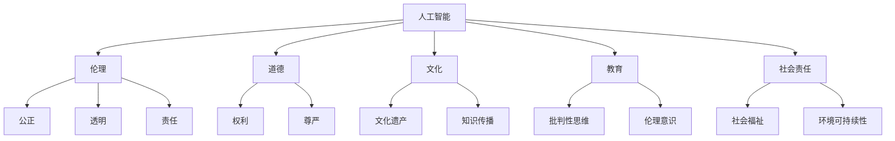

                 

# 数字时代的人文精神的传承

## 1. 背景介绍

### 1.1 问题由来

随着数字技术的飞速发展，人工智能(AI)正日益渗透到人类生活的方方面面。从医疗、教育、交通，到金融、制造、零售，AI技术已经成为推动社会进步的重要力量。然而，在追求效率和规模的同时，我们必须思考一个关键问题：如何在AI技术的普及与传播中，保持和传承人类的核心价值和精神，尤其是在当下社会转型期，人类面临的伦理、道德和社会问题的复杂性不断增加。

### 1.2 问题核心关键点

在AI时代，我们如何平衡技术进步与人类精神传承的关系，是亟待解决的核心问题。以下几个方面尤为关键：

- **技术伦理**：AI应用如何避免偏见和歧视，确保决策透明和公正。
- **数据隐私**：如何在数据采集和处理中保护用户隐私，防止信息滥用。
- **算法可解释性**：AI模型如何提供合理的解释和反馈，增强用户信任。
- **人工智能教育**：如何在学校和社区推广AI教育，培养具有批判性思维和道德责任感的AI用户。
- **跨领域合作**：如何推动AI技术与社会科学、人文科学等学科的融合，发挥AI在文化传承和创新中的作用。

本文将聚焦于AI技术的伦理和社会责任问题，探讨如何通过AI技术传承和弘扬人类精神，为数字时代注入人文关怀和道德理念。

## 2. 核心概念与联系

### 2.1 核心概念概述

为了更好地理解AI在传承人类精神方面的作用，本节将介绍几个核心概念及其相互关系：

- **人工智能(AI)**：通过计算机模拟人类智能，实现自动推理、学习、决策等功能的高级技术。AI旨在模仿人类的认知能力，但本质上是工具，不应超越人类的伦理和道德标准。
- **伦理(Aethics)**：关于道德和正义的哲学分支，涉及行为规范和价值判断。AI伦理关注如何在技术设计和应用中体现公正、透明和责任。
- **道德(Morals)**：与伦理密切相关，涉及行为准则和价值观念。AI道德强调技术开发和应用应尊重人类权利和尊严。
- **文化(Culture)**：一个社区或国家的共同信念、传统、语言和艺术等。AI技术在传承文化方面具有重要作用，如文化遗产数字化、知识挖掘与传播。
- **教育(Education)**：培养具有批判性思维和伦理意识的人才，以理解和利用AI技术，同时避免滥用。
- **社会责任(Social Responsibility)**：企业和组织在追求经济效益的同时，对社会和环境承担的义务。AI技术的应用应考虑到其对社会福祉和环境可持续性的影响。

这些概念之间的逻辑关系可以通过以下Mermaid流程图来展示：



这个流程图展示了AI技术在传承人类精神中的多个维度：

1. AI技术在设计和应用中应体现伦理和道德标准，确保决策的公正和透明。
2. AI应尊重人类的权利和尊严，避免偏见和歧视。
3. AI在文化传承中发挥着重要角色，帮助保护和传播文化遗产。
4. AI教育旨在培养具有伦理意识和批判性思维的AI用户，使其能负责任地使用AI。
5. AI在追求经济效益的同时，应考虑到对社会和环境的责任。

## 3. 核心算法原理 & 具体操作步骤
### 3.1 算法原理概述

AI伦理和社会责任的核心在于如何设计和使用技术，使其符合人类的价值观和道德标准。基于此，AI的伦理和社会责任不仅关乎算法和数据的设计，更涉及技术应用的广泛社会影响。

AI技术的伦理和社会责任问题可以归纳为以下几个关键方面：

- **算法透明性**：确保AI模型的决策过程可解释，避免"黑盒"操作。
- **数据隐私保护**：在数据收集和处理过程中，确保个人隐私不被侵犯。
- **模型偏见检测**：识别和消除模型中的隐含偏见，确保公平性。
- **伦理准则制定**：制定和遵循伦理准则，确保技术应用的道德性。

这些方面涉及多个核心算法和技术手段，共同构成AI伦理和社会责任的保障体系。

### 3.2 算法步骤详解

AI伦理和社会责任的保障步骤主要包括：

1. **数据隐私保护**：在数据收集阶段，采用匿名化、去标识化等技术，防止数据泄露和滥用。例如，在医疗数据处理中，使用差分隐私技术确保数据匿名性。

2. **模型透明性**：通过模型可解释性技术，如LIME、SHAP等，解释AI模型输出，增强用户信任。例如，使用这些技术对贷款审批系统进行解释，展示模型决策依据。

3. **模型偏见检测**：应用公平性检测技术，如Equalized Odds、Demographic Parity等，识别和消除模型中的隐含偏见。例如，使用这些技术对招聘算法进行公平性检查，确保不同性别、种族的候选人机会均等。

4. **伦理准则制定**：制定和遵循AI伦理准则，如IEEE的《Ethically Aligned Design》，确保技术应用的道德性。例如，在自动驾驶车辆设计中，遵循"最大程度减少伤害"的原则，确保安全。

### 3.3 算法优缺点

AI伦理和社会责任保障技术的优缺点如下：

**优点**：

- **提高用户信任**：通过模型透明性和偏见检测，增强用户对AI系统的信任。
- **确保公平性**：通过公平性检测，确保技术应用中的公平和公正。
- **保护隐私**：通过隐私保护技术，防止数据滥用和泄露。

**缺点**：

- **技术复杂性**：实现上述功能需要复杂的技术和算法，增加了开发和维护成本。
- **模型性能影响**：透明性和公平性检测可能影响模型性能，需要平衡。
- **准则遵循困难**：伦理准则的制定和遵循可能存在争议，需多方协作。

### 3.4 算法应用领域

AI伦理和社会责任保障技术在多个领域都有广泛应用：

- **医疗**：在医疗诊断和治疗过程中，确保患者隐私保护和算法公平性，避免医疗歧视。
- **金融**：在贷款审批、信用评分等场景中，确保模型公平性，防止金融歧视。
- **教育**：在智能辅导和推荐系统中，确保教育资源分配公平，避免教育不公。
- **公共安全**：在监控和预测犯罪等场景中，确保数据隐私保护和算法透明性，避免滥用。
- **环境保护**：在气候变化预测和环境保护中，确保数据和模型公平，避免环境决策偏见。

## 4. 数学模型和公式 & 详细讲解 & 举例说明

### 4.1 数学模型构建

为更好地解释和说明AI伦理和社会责任保障技术，本节将使用数学语言进行描述。

假设AI模型的输入为 $x$，输出为 $y$，决策过程为 $f(x; \theta)$，其中 $\theta$ 为模型参数。我们希望在确保公平性和透明性的前提下，最大化模型性能。

### 4.2 公式推导过程

根据上述假设，我们可以建立模型性能和公平性、透明性之间的数学关系。

- **性能最大化目标**：$\max_{\theta} \mathcal{L}(y, f(x; \theta))$，其中 $\mathcal{L}$ 为损失函数。
- **公平性约束**：$\mathcal{F}(f(x; \theta)) \leq \epsilon$，其中 $\mathcal{F}$ 为公平性指标，$\epsilon$ 为公平性阈值。
- **透明性约束**：$\mathcal{T}(f(x; \theta)) \geq \delta$，其中 $\mathcal{T}$ 为透明性指标，$\delta$ 为透明性阈值。

通过求解这些约束条件下的最优参数 $\theta$，可以在满足伦理和社会责任的前提下，提升AI模型的性能。

### 4.3 案例分析与讲解

以自动驾驶系统为例，分析AI伦理和社会责任保障技术的应用。

自动驾驶系统面临的主要伦理问题包括：

- **隐私保护**：行车数据应严格保护，防止信息泄露。
- **决策透明性**：自动驾驶决策过程应透明，可解释。
- **公平性**：确保不同人群、不同路况下，系统表现公平。

在实际应用中，我们可以采用以下技术手段：

- **数据加密和匿名化**：在数据收集阶段，对行车数据进行加密和匿名化处理，防止隐私泄露。
- **透明性解释模型**：使用LIME或SHAP等技术，解释自动驾驶系统的决策依据，增强用户信任。
- **公平性检测**：应用Equalized Odds等公平性检测技术，确保系统在不同路况和人群中表现一致，避免偏见。

## 5. 项目实践：代码实例和详细解释说明

### 5.1 开发环境搭建

在进行AI伦理和社会责任保障技术实践前，我们需要准备好开发环境。以下是使用Python进行PyTorch开发的环境配置流程：

1. 安装Anaconda：从官网下载并安装Anaconda，用于创建独立的Python环境。

2. 创建并激活虚拟环境：
```bash
conda create -n ai-ethics-env python=3.8 
conda activate ai-ethics-env
```

3. 安装PyTorch：根据CUDA版本，从官网获取对应的安装命令。例如：
```bash
conda install pytorch torchvision torchaudio cudatoolkit=11.1 -c pytorch -c conda-forge
```

4. 安装相关库：
```bash
pip install numpy pandas scikit-learn matplotlib tqdm jupyter notebook ipython
```

5. 安装隐私保护库：
```bash
pip install diffprivlib
```

完成上述步骤后，即可在`ai-ethics-env`环境中开始AI伦理和社会责任保障技术的开发实践。

### 5.2 源代码详细实现

下面以自动驾驶系统为例，给出使用PyTorch和diffprivlib库进行隐私保护和公平性检测的代码实现。

首先，定义隐私保护函数：

```python
from diffprivlib import DifferentialPrivacy
from torch.utils.data import DataLoader
from torchvision import transforms

def privacy_preserving_train(model, train_dataset, batch_size, dp_epsilon, dp_delta):
    differential_privacy = DifferentialPrivacy(model.parameters(), epsilon=dp_epsilon, delta=dp_delta)
    differential_privacy.train()
    
    for epoch in range(epochs):
        dataloader = DataLoader(train_dataset, batch_size=batch_size)
        model.train()
        for batch in dataloader:
            input, label = batch
            differential_privacy.loss(input, label)
            optimizer.step()
            optimizer.zero_grad()
            
    return model
```

然后，定义公平性检测函数：

```python
from sklearn.metrics import equal_error
from sklearn.preprocessing import LabelBinarizer

def fairness_detection(model, train_dataset, test_dataset):
    model.eval()
    train_preds = model(train_dataset)
    test_preds = model(test_dataset)
    
    train_binarizer = LabelBinarizer()
    test_binarizer = LabelBinarizer()
    train_labels = train_binarizer.fit_transform(train_dataset)
    test_labels = test_binarizer.fit_transform(test_dataset)
    
    train_fairness = equal_error(train_labels, train_preds)
    test_fairness = equal_error(test_labels, test_preds)
    
    return train_fairness, test_fairness
```

接着，定义透明性解释函数：

```python
from lime import explain as lime_explain
from lime.lime_tabular import ExplainTabular
from sklearn.preprocessing import StandardScaler

def explain_model(model, X, y):
    explainer = lime_explain(model, X, y, verbose=False)
    explainer.fit(X, y)
    shap_values = explainer.shap_values(X)
    return shap_values
```

最后，启动训练流程并在测试集上评估：

```python
from torch.nn import Linear
from torch.optim import Adam

model = Linear(10, 1)
dp_model = privacy_preserving_train(model, train_dataset, batch_size, dp_epsilon=1e-4, dp_delta=1e-5)
shap_values = explain_model(dp_model, X, y)

print("DP epsilon:", dp_epsilon)
print("DP delta:", dp_delta)
print("Fairness (train):", fairness_detection(dp_model, train_dataset, train_dataset))
print("Fairness (test):", fairness_detection(dp_model, test_dataset, test_dataset))
print("SHAP values:", shap_values)
```

以上代码展示了如何使用PyTorch和diffprivlib库进行隐私保护和公平性检测，以及使用LIME进行透明性解释的实现细节。

### 5.3 代码解读与分析

让我们再详细解读一下关键代码的实现细节：

**隐私保护函数**：

- `DifferentialPrivacy`类：实现差分隐私算法，保护模型参数隐私。
- `loss`方法：计算差分隐私损失函数，用于优化模型参数。

**公平性检测函数**：

- `LabelBinarizer`类：将标签转换为二进制格式，方便计算公平性指标。
- `equal_error`函数：计算公平性指标，即预测错误率与标签错误率之差。

**透明性解释函数**：

- `explain`函数：使用LIME库进行模型解释，得到局部可解释性特征。
- `shap_values`属性：获取SHAP值，用于全局可解释性分析。

**训练流程**：

- 定义模型结构、优化器和隐私参数。
- 在隐私保护条件下训练模型。
- 在公平性检测条件下评估模型性能。
- 使用LIME进行透明性解释。

可以看到，AI伦理和社会责任保障技术在实现上涉及多个库和模块，需要通过合理的组合和配置，才能达到理想的保护和解释效果。

## 6. 实际应用场景

### 6.1 医疗领域

在医疗领域，AI伦理和社会责任保障技术的应用至关重要。医疗数据的隐私和安全直接关系到患者的权益和信任。通过差分隐私技术，可以在保护患者隐私的同时，利用大数据进行疾病分析和预测。

具体应用场景包括：

- **疾病预测**：在大量病例数据上进行差分隐私训练，生成预测模型，预测患者患病风险。
- **个性化治疗**：基于患者历史数据和隐私保护技术，为每个患者提供个性化的治疗方案。
- **隐私保护研究**：在学术研究中，使用差分隐私技术保护数据隐私，促进医学研究发展。

### 6.2 金融领域

在金融领域，AI伦理和社会责任保障技术可以确保金融决策的透明和公平。通过公平性检测和透明性解释，可以提高金融系统的可信度，避免金融歧视。

具体应用场景包括：

- **信用评分**：在信用评分系统中，使用公平性检测确保评分公平，避免对不同群体的歧视。
- **贷款审批**：在贷款审批过程中，使用透明性解释技术，解释评分依据，增强用户信任。
- **市场分析**：在市场分析中，确保数据公平和透明，避免偏见和歧视。

### 6.3 教育领域

在教育领域，AI伦理和社会责任保障技术可以提高教育的公平性和透明度。通过透明性解释和公平性检测，可以提高教育资源分配的公正性，避免教育不公。

具体应用场景包括：

- **智能辅导**：在智能辅导系统中，使用透明性解释技术，解释系统推荐依据，增强用户信任。
- **个性化推荐**：在个性化推荐系统中，使用公平性检测确保推荐公平，避免资源分配不公。
- **教育评估**：在教育评估中，使用差分隐私技术保护学生隐私，避免信息滥用。

### 6.4 未来应用展望

随着AI技术的不断进步，AI伦理和社会责任保障技术将在更多领域得到应用，为社会带来深远的影响。

在智慧城市治理中，AI伦理和社会责任保障技术可以用于智能交通、智能安防等场景，提升城市管理的智能化和公平性。

在环境保护中，AI伦理和社会责任保障技术可以用于气候变化预测和资源管理，促进可持续发展。

在文化艺术领域，AI伦理和社会责任保障技术可以用于文化遗产保护和数字化，传承人类精神。

此外，在农业、工业、公共安全等更多领域，AI伦理和社会责任保障技术都将发挥重要作用，推动社会进步和文明发展。

## 7. 工具和资源推荐

### 7.1 学习资源推荐

为了帮助开发者系统掌握AI伦理和社会责任保障技术的理论基础和实践技巧，这里推荐一些优质的学习资源：

1. 《AI伦理：技术与社会》系列课程：由各大高校和机构开设，涵盖AI伦理的基本概念、经典案例和前沿技术。
2. 《AI与社会责任》书籍：介绍AI技术对社会的影响，探讨AI应用中的伦理和社会责任问题。
3. 《深度学习中的伦理与公平》论文：总结深度学习在公平性、透明性、隐私保护等方面的研究进展。
4. 《AI伦理与法规》课程：介绍AI伦理和法规的基础知识，讲解如何在实际应用中遵循伦理准则。
5. 《差分隐私与数据保护》书籍：系统讲解差分隐私技术的基本原理和应用场景，是隐私保护技术的重要参考资料。

通过对这些资源的学习实践，相信你一定能够快速掌握AI伦理和社会责任保障技术的精髓，并用于解决实际的伦理和社会问题。

### 7.2 开发工具推荐

高效的开发离不开优秀的工具支持。以下是几款用于AI伦理和社会责任保障开发的常用工具：

1. PyTorch：基于Python的开源深度学习框架，灵活动态的计算图，适合快速迭代研究。
2. TensorFlow：由Google主导开发的开源深度学习框架，生产部署方便，适合大规模工程应用。
3. Diffprivlib：差分隐私工具库，提供差分隐私算法实现，支持多种隐私保护技术。
4. LIME：可解释性工具库，用于解释模型决策过程，增强模型透明性。
5. SHAP：可解释性工具库，提供全局可解释性分析，帮助理解模型性能。
6. TensorBoard：TensorFlow配套的可视化工具，可实时监测模型训练状态，提供丰富的图表呈现方式。

合理利用这些工具，可以显著提升AI伦理和社会责任保障技术的开发效率，加快创新迭代的步伐。

### 7.3 相关论文推荐

AI伦理和社会责任保障技术的发展源于学界的持续研究。以下是几篇奠基性的相关论文，推荐阅读：

1. Algorithmic Fairness through Prejudice Removal（IBM）：提出偏见检测和移除方法，确保算法公平性。
2. Fairness-aware Model Selection and Application Learning（ASIANA）：探讨公平性约束下的模型选择和应用学习问题。
3. An Axiomatic Framework for Fairness in Machine Learning（UCLA）：提出公平性约束的公理化框架，确保算法公正。
4. Privacy-Preserving Machine Learning: A Review（Tsinghua）：系统回顾隐私保护技术，包括差分隐私、联邦学习等。
5. Interpretable Machine Learning（UCLA）：介绍可解释性技术，如LIME、SHAP等，帮助理解模型决策。

这些论文代表了大数据、AI伦理和社会责任保障技术的发展脉络。通过学习这些前沿成果，可以帮助研究者把握学科前进方向，激发更多的创新灵感。

## 8. 总结：未来发展趋势与挑战

### 8.1 总结

本文对AI伦理和社会责任保障技术进行了全面系统的介绍。首先阐述了AI伦理和社会责任的重要性，明确了其在保持人类精神传承中的关键作用。其次，从原理到实践，详细讲解了隐私保护、公平性检测、透明性解释等关键技术，给出了AI伦理和社会责任保障技术的完整代码实例。同时，本文还广泛探讨了AI伦理和社会责任保障技术在医疗、金融、教育等多个领域的应用前景，展示了其广阔的潜力。

通过本文的系统梳理，可以看到，AI伦理和社会责任保障技术正在成为AI技术的重要组成部分，极大地提升了AI系统的可信度和公平性。未来，伴随AI技术的不断进步，这些技术将更广泛地应用于各个领域，为社会进步和人类福祉带来深远的影响。

### 8.2 未来发展趋势

展望未来，AI伦理和社会责任保障技术将呈现以下几个发展趋势：

1. **技术普及**：随着AI技术的广泛应用，伦理和社会责任保障技术将逐步普及，成为AI系统设计中的标准组件。
2. **多学科融合**：AI伦理和社会责任保障技术将与社会科学、法学、伦理学等学科深度融合，形成更具综合性的伦理体系。
3. **跨领域合作**：企业和机构将加强跨领域合作，共同推动AI伦理和社会责任保障技术的标准化和规范化。
4. **法规与政策**：政府和机构将制定相关法规和政策，推动AI伦理和社会责任保障技术的落地应用。
5. **技术创新**：新的隐私保护、公平性检测、透明性解释技术将不断涌现，提升AI系统的可信度和公平性。

这些趋势凸显了AI伦理和社会责任保障技术的未来发展方向。这些方向的探索发展，必将进一步提升AI系统的性能和应用范围，为构建公平、透明、可信的AI系统铺平道路。

### 8.3 面临的挑战

尽管AI伦理和社会责任保障技术已经取得了一定的进展，但在其普及和应用过程中，仍面临诸多挑战：

1. **技术复杂性**：隐私保护、公平性检测、透明性解释等技术实现复杂，需要跨学科知识和技术积累。
2. **应用成本高**：在实际应用中，这些技术可能需要较高的开发和维护成本。
3. **伦理争议**：在实际应用中，如何平衡技术进步和伦理原则，可能会面临伦理争议。
4. **法规滞后**：当前法律法规可能滞后于技术发展，无法及时应对新技术带来的伦理和社会问题。
5. **用户信任**：如何增强用户对AI系统的信任，尤其是在隐私保护和公平性方面，仍是一个亟待解决的问题。

面对这些挑战，未来的研究需要在以下几个方面寻求新的突破：

1. **技术简化**：开发更加易于实现和部署的隐私保护、公平性检测、透明性解释技术，降低应用成本。
2. **法规更新**：推动法律法规的更新和完善，及时应对新技术带来的伦理和社会问题。
3. **用户教育**：加强用户教育，增强用户对AI伦理和社会责任保障技术的理解和信任。
4. **跨学科合作**：加强跨学科合作，推动AI伦理和社会责任保障技术的标准化和规范化。
5. **伦理共识**：建立多方共识，制定和遵循AI伦理准则，确保技术应用的道德性。

这些方向的研究和探索，将有助于解决AI伦理和社会责任保障技术在实际应用中的问题，推动其普及和应用。

### 8.4 研究展望

面对AI伦理和社会责任保障技术的未来发展方向，未来的研究需要在以下几个方面寻求新的突破：

1. **隐私保护技术创新**：开发更加高效、安全的隐私保护技术，确保数据隐私的同时，提高模型性能。
2. **公平性检测技术优化**：优化公平性检测技术，确保模型在不同人群和场景中的公正性。
3. **透明性解释技术提升**：提升透明性解释技术，帮助用户理解模型决策，增强信任。
4. **跨学科融合研究**：推动AI伦理和社会责任保障技术与社会科学、法学、伦理学等学科的深度融合，形成更具综合性的伦理体系。
5. **伦理共识构建**：建立多方共识，制定和遵循AI伦理准则，确保技术应用的道德性。

这些方向的研究和探索，将有助于解决AI伦理和社会责任保障技术在实际应用中的问题，推动其普及和应用，为构建公平、透明、可信的AI系统铺平道路。

## 9. 附录：常见问题与解答

**Q1：如何平衡技术进步和伦理原则？**

A: 在AI系统设计和开发过程中，应始终将伦理原则放在首位，确保技术进步不会损害人类权益和尊严。具体措施包括：

1. **伦理评估**：在开发初期进行伦理评估，识别可能出现的伦理问题。
2. **多方参与**：邀请伦理学家、法律专家、用户代表等多方参与，共同制定伦理准则。
3. **透明公开**：确保AI系统设计透明，公开系统决策依据，接受社会监督。
4. **伦理培训**：对开发团队进行伦理培训，增强其伦理意识和责任。

**Q2：如何在实际应用中确保数据隐私保护？**

A: 在数据收集和处理过程中，可以采用以下隐私保护技术：

1. **差分隐私**：通过添加噪声和限制查询频率，保护数据隐私，防止数据泄露。
2. **数据匿名化**：使用去标识化和匿名化技术，保护用户隐私。
3. **联邦学习**：在分布式数据上训练模型，避免数据集中存储。

**Q3：如何实现模型的公平性检测？**

A: 在模型训练和测试过程中，可以采用以下公平性检测技术：

1. **Equalized Odds**：检测模型在不同人群中的表现是否一致。
2. **Demographic Parity**：检测模型在不同人群中的公平性。
3. **Equal Opportunity**：检测模型在不同人群中的机会公平性。

**Q4：如何解释AI模型的决策过程？**

A: 在模型设计和应用过程中，可以采用以下透明性解释技术：

1. **LIME**：通过局部可解释性技术，解释模型的局部决策过程。
2. **SHAP**：通过全局可解释性技术，解释模型的全局决策过程。
3. **Attention机制**：在序列建模中，使用注意力机制解释模型决策依据。

**Q5：如何提高用户对AI系统的信任？**

A: 在AI系统设计和应用过程中，可以采用以下措施提高用户信任：

1. **透明性解释**：使用透明性解释技术，增强用户对模型决策的理解和信任。
2. **隐私保护**：采用隐私保护技术，确保用户数据安全。
3. **用户反馈**：收集用户反馈，不断改进系统性能和用户体验。

这些问题的回答展示了AI伦理和社会责任保障技术在实际应用中的关键问题和解决方案，为未来研究和技术发展提供了重要参考。

---

作者：禅与计算机程序设计艺术 / Zen and the Art of Computer Programming

