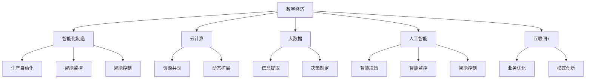

                 

# 数字经济：社会发展的助推器

> 关键词：数字经济, 智能制造, 云计算, 大数据, 人工智能, 互联网+

## 1. 背景介绍

### 1.1 问题由来

21世纪以来，数字经济在全球范围内蓬勃兴起，成为全球经济增长的新引擎。数字经济以信息技术和互联网为支撑，涵盖了数据驱动、网络协同、智能化、虚拟化、个性化等众多特征。通过数字技术的应用，传统产业得以转型升级，商业模式得以创新突破，生产力得以解放提升。

然而，数字经济在推动社会进步的同时，也带来了诸多挑战，如数据隐私保护、数字鸿沟、网络安全、算法歧视等。如何在快速发展的数字经济时代中，确保技术进步与社会伦理的和谐共进，是当下亟需解决的重要问题。

### 1.2 问题核心关键点

数字经济的核心理念在于通过数字化、网络化和智能化技术，将传统产业与数字技术深度融合，实现产业升级、服务优化和商业模式创新。主要包括以下几个关键点：

1. **数据驱动**：利用大数据、云计算、人工智能等技术，从海量数据中提取有价值的信息，支撑决策制定和业务优化。
2. **网络协同**：通过物联网、区块链、分布式计算等技术，实现资源的共享、协作和优化，提升生产效率和资源利用率。
3. **智能化**：应用机器学习、深度学习、自然语言处理等技术，实现智能决策、智能监控、智能控制，提升生产和服务自动化水平。
4. **虚拟化**：通过虚拟现实、增强现实、全息技术等，构建虚拟化工作和生活环境，推动传统行业与虚拟化技术的融合。
5. **个性化**：通过用户画像、推荐系统等技术，实现精准营销、个性化服务，提升用户体验和满意度。

这些关键点共同构成了数字经济的基石，推动了经济社会全面转型升级。

### 1.3 问题研究意义

研究数字经济的发展，对于把握数字经济规律，促进产业升级，推动经济高质量发展，具有重要意义。

1. **产业升级**：通过数字化、智能化技术的应用，优化传统产业结构，提升生产效率和产品质量，推动制造业、服务业等产业转型升级。
2. **经济增长**：数字经济已经成为全球经济增长的重要引擎，通过技术创新和应用，推动新动能的培育和经济增长的动力转换。
3. **社会进步**：数字经济不仅推动经济增长，还促进了社会治理、教育、医疗、环保等领域的智能化、信息化建设，提升社会管理水平和公民福祉。
4. **全球竞争**：数字经济是国家竞争力的重要体现，通过技术创新和应用，提升国家的国际竞争力和话语权。

## 2. 核心概念与联系

### 2.1 核心概念概述

为更好地理解数字经济的发展，本节将介绍几个密切相关的核心概念：

- **数字经济**：以信息技术和互联网为支撑，通过数字化、网络化和智能化技术，实现传统产业转型升级和新动能培育的经济形态。
- **智能化制造**：利用人工智能、物联网等技术，实现生产自动化、智能化和个性化，提升制造业的效率和竞争力。
- **云计算**：通过互联网提供动态、可扩展的计算资源，支持大规模数据的存储、处理和分析，提供高效灵活的计算服务。
- **大数据**：通过收集、存储、分析和可视化技术，从海量数据中提取有价值的信息，支撑决策制定和业务优化。
- **人工智能**：利用机器学习、深度学习等技术，模拟人类智能行为，实现智能决策、智能监控、智能控制等功能。
- **互联网+**：利用互联网技术改造传统行业，实现资源共享、业务优化和模式创新，推动新经济形态的培育。

这些核心概念之间的逻辑关系可以通过以下Mermaid流程图来展示：



这个流程图展示了大数字经济的关键概念及其之间的关系：

1. 数字经济通过数字化、网络化和智能化技术，实现传统产业的转型升级。
2. 智能化制造利用人工智能、物联网技术，提升制造业的效率和竞争力。
3. 云计算提供高效、灵活的计算服务，支持大数据的存储和处理。
4. 大数据从海量数据中提取有价值的信息，支撑决策制定和业务优化。
5. 人工智能模拟人类智能行为，实现智能决策、智能监控、智能控制等功能。
6. 互联网+改造传统行业，实现资源共享、业务优化和模式创新。

这些概念共同构成了数字经济的框架，推动了经济社会的全面转型升级。

## 3. 核心算法原理 & 具体操作步骤
### 3.1 算法原理概述

数字经济的实现主要依赖于信息技术的应用，其中算法设计和优化是关键环节。以下将详细介绍数字经济中的核心算法原理和具体操作步骤：

- **数据处理算法**：通过数据清洗、特征提取、数据挖掘等算法，从原始数据中提取有价值的信息。
- **智能决策算法**：利用机器学习、深度学习、自然语言处理等算法，实现智能决策和智能控制。
- **网络协同算法**：通过物联网、区块链、分布式计算等算法，实现资源的共享和协同。
- **个性化推荐算法**：通过用户画像、推荐系统等算法，实现精准营销和个性化服务。

### 3.2 算法步骤详解

数字经济的实现通常包括以下几个关键步骤：

**Step 1: 数据收集与处理**

- 收集与业务相关的数据，包括客户信息、产品数据、市场数据等。
- 对数据进行清洗、去重、归一化处理，去除噪声和异常值，确保数据质量。
- 利用数据挖掘、特征提取等算法，从原始数据中提取有价值的特征。

**Step 2: 算法训练与优化**

- 选择合适的算法模型，如决策树、随机森林、神经网络等。
- 利用历史数据对模型进行训练，并根据测试集的表现进行优化调整。
- 利用交叉验证等技术，防止过拟合，提升模型泛化能力。

**Step 3: 系统部署与集成**

- 将训练好的模型集成到业务系统中，实现自动化决策、智能监控、智能控制等功能。
- 利用云计算、物联网等技术，实现资源的共享和协同。
- 利用虚拟化、增强现实等技术，构建虚拟化工作和生活环境。

**Step 4: 反馈与优化**

- 实时采集系统的运行数据，通过数据分析和反馈机制，对算法进行优化调整。
- 定期评估系统性能，根据业务需求和市场变化，不断迭代优化。

### 3.3 算法优缺点

数字经济中的算法设计具有以下优点：

1. **提升效率**：通过算法优化，大幅提升生产效率和服务质量，降低人工成本。
2. **精准决策**：利用智能决策算法，实现数据驱动的精准决策，提升决策效率和准确性。
3. **资源共享**：通过网络协同算法，实现资源的高效共享和优化配置。
4. **个性化服务**：利用个性化推荐算法，实现精准营销和个性化服务，提升用户体验。

然而，算法设计也存在一些缺点：

1. **数据隐私问题**：大规模数据处理和分析可能导致数据隐私泄露，需采取隐私保护措施。
2. **模型复杂性**：复杂算法模型可能难以理解和解释，导致“黑箱”问题。
3. **算法偏见**：算法可能继承和放大数据中的偏见，导致决策不公或歧视。
4. **技术依赖**：算法实现需要高水平的技术支持和资源投入，可能对企业造成一定压力。

### 3.4 算法应用领域

数字经济中的算法设计和优化，已经广泛应用于各个领域，如：

- **制造业**：通过智能制造算法，实现生产自动化、智能化和个性化，提升生产效率和竞争力。
- **零售业**：利用个性化推荐算法，实现精准营销和个性化服务，提升客户满意度和销售额。
- **金融业**：应用智能决策算法，实现风险评估、欺诈检测、信用评估等功能，提升金融安全性和服务质量。
- **医疗健康**：通过数据分析和算法优化，实现精准医疗、疾病预测、健康管理等功能，提升医疗健康水平。
- **公共服务**：利用大数据和算法优化，实现智能交通、智慧城市、社会治理等功能，提升公共服务水平和治理能力。

## 4. 数学模型和公式 & 详细讲解 & 举例说明

### 4.1 数学模型构建

数字经济中的算法设计通常基于数学模型，以下将详细讲解常见数学模型的构建和应用：

- **线性回归模型**：用于预测连续变量，如销售额、价格等。公式为：$$y = \beta_0 + \beta_1x_1 + \beta_2x_2 + \ldots + \beta_nx_n + \epsilon$$
- **决策树模型**：用于分类和预测，通过树形结构对数据进行分割和划分。
- **随机森林模型**：基于多个决策树的集成，提高模型的稳定性和泛化能力。
- **神经网络模型**：用于处理复杂非线性问题，如图像识别、语音识别等。
- **支持向量机模型**：用于分类和回归问题，通过寻找最优超平面实现分类。

### 4.2 公式推导过程

以线性回归模型为例，详细推导其公式和求解过程：

假设有一个线性回归模型，用于预测销售额 $y$，其输入特征为 $x_1, x_2, \ldots, x_n$。根据最小二乘法，求解模型的参数 $\beta_0, \beta_1, \ldots, \beta_n$：

$$
\hat{y} = \beta_0 + \beta_1x_1 + \beta_2x_2 + \ldots + \beta_nx_n
$$

目标是最小化残差平方和：

$$
\min_{\beta_0, \beta_1, \ldots, \beta_n} \sum_{i=1}^n (y_i - \hat{y}_i)^2
$$

根据最小二乘法，求解得到：

$$
\hat{\beta} = (X^TX)^{-1}X^Ty
$$

其中 $X^T$ 为输入特征矩阵的转置，$y$ 为输出向量。

### 4.3 案例分析与讲解

以电商平台为例，详细分析其数据处理和算法优化过程：

**Step 1: 数据收集与处理**

- 收集电商平台的用户行为数据，如浏览记录、购买记录、评价数据等。
- 对数据进行清洗和处理，去除异常值和噪声。
- 利用数据挖掘算法，提取用户兴趣、购买倾向等有价值的信息。

**Step 2: 算法训练与优化**

- 利用用户行为数据，训练预测用户购买倾向的模型。
- 利用交叉验证等技术，优化模型参数，防止过拟合。
- 实时采集用户反馈数据，调整模型，提升预测精度。

**Step 3: 系统部署与集成**

- 将训练好的模型集成到电商推荐系统中，实现个性化推荐。
- 利用云计算技术，实现大规模数据存储和处理。
- 利用虚拟现实技术，构建虚拟试穿、虚拟购物体验。

**Step 4: 反馈与优化**

- 实时采集用户反馈数据，优化推荐算法。
- 定期评估推荐效果，根据市场变化和用户需求，迭代优化模型。

## 5. 项目实践：代码实例和详细解释说明

### 5.1 开发环境搭建

在进行数字经济相关项目开发前，我们需要准备好开发环境。以下是使用Python进行TensorFlow开发的环境配置流程：

1. 安装Anaconda：从官网下载并安装Anaconda，用于创建独立的Python环境。

2. 创建并激活虚拟环境：
```bash
conda create -n tf-env python=3.8 
conda activate tf-env
```

3. 安装TensorFlow：根据CUDA版本，从官网获取对应的安装命令。例如：
```bash
conda install tensorflow -c tensorflow -c conda-forge
```

4. 安装各类工具包：
```bash
pip install numpy pandas scikit-learn matplotlib tqdm jupyter notebook ipython
```

完成上述步骤后，即可在`tf-env`环境中开始数字经济项目的开发。

### 5.2 源代码详细实现

这里我们以电商平台推荐系统为例，给出使用TensorFlow进行数据处理和算法优化的PyTorch代码实现。

首先，定义推荐系统的数据处理函数：

```python
import tensorflow as tf
import numpy as np
from sklearn.model_selection import train_test_split
from sklearn.preprocessing import StandardScaler

# 读取用户行为数据
def load_data(path):
    data = pd.read_csv(path)
    return data

# 数据预处理
def preprocess_data(data):
    # 特征选择和处理
    features = data[['age', 'gender', 'income', 'buying_power']]
    target = data['purchase']
    
    # 标准化处理
    scaler = StandardScaler()
    features = scaler.fit_transform(features)
    
    # 划分训练集和测试集
    X_train, X_test, y_train, y_test = train_test_split(features, target, test_size=0.2, random_state=42)
    
    return X_train, X_test, y_train, y_test
```

然后，定义推荐系统的模型训练函数：

```python
from tensorflow.keras.models import Sequential
from tensorflow.keras.layers import Dense, Dropout

# 定义模型结构
def build_model(input_dim):
    model = Sequential([
        Dense(128, activation='relu', input_dim=input_dim),
        Dropout(0.2),
        Dense(64, activation='relu'),
        Dropout(0.2),
        Dense(1, activation='sigmoid')
    ])
    
    model.compile(optimizer='adam', loss='binary_crossentropy', metrics=['accuracy'])
    return model

# 模型训练
def train_model(X_train, y_train, model, epochs):
    model.fit(X_train, y_train, epochs=epochs, batch_size=32, validation_split=0.2)
```

接着，定义推荐系统的评估函数：

```python
from sklearn.metrics import accuracy_score

# 模型评估
def evaluate_model(model, X_test, y_test):
    y_pred = model.predict(X_test)
    accuracy = accuracy_score(y_test, y_pred > 0.5)
    print('Accuracy:', accuracy)
```

最后，启动推荐系统训练流程并在测试集上评估：

```python
epochs = 10

# 加载数据
data = load_data('data.csv')
X_train, X_test, y_train, y_test = preprocess_data(data)

# 构建模型
model = build_model(X_train.shape[1])

# 训练模型
train_model(X_train, y_train, model, epochs)

# 评估模型
evaluate_model(model, X_test, y_test)
```

以上就是使用TensorFlow对电商平台推荐系统进行数据处理和算法优化的完整代码实现。可以看到，TensorFlow的强大封装能力使得模型设计和训练过程更加简便，开发者可以将更多精力放在数据处理和业务逻辑上。

### 5.3 代码解读与分析

让我们再详细解读一下关键代码的实现细节：

**load_data函数**：
- 读取用户行为数据，生成一个Pandas数据框，用于后续处理。

**preprocess_data函数**：
- 特征选择和处理：选择与购买行为相关的特征，如年龄、性别、收入等。
- 标准化处理：使用StandardScaler对特征进行标准化，确保数据在不同尺度的特征上具有可比性。
- 划分训练集和测试集：使用train_test_split函数，将数据集划分为训练集和测试集。

**build_model函数**：
- 定义模型结构：使用Sequential模型，定义多个Dense层和Dropout层。
- 编译模型：使用adam优化器和binary_crossentropy损失函数，优化模型参数。

**train_model函数**：
- 模型训练：使用fit函数，训练模型，设置epochs、batch_size和validation_split参数。

**evaluate_model函数**：
- 模型评估：使用accuracy_score函数，计算模型在测试集上的准确率。

**训练流程**：
- 加载数据：读取用户行为数据，进行预处理。
- 构建模型：定义模型结构和编译模型。
- 训练模型：使用训练集训练模型。
- 评估模型：在测试集上评估模型准确率。

可以看到，TensorFlow提供了丰富的API接口，使得模型设计和训练过程更加简便高效。开发者可以根据具体需求灵活组合使用，快速迭代优化模型。

## 6. 实际应用场景

### 6.1 智能制造

智能制造是大数字经济的重要应用领域，通过数字化、网络化和智能化技术，实现生产自动化、智能化和个性化，提升制造业的效率和竞争力。

**案例分析**：某汽车制造企业利用智能制造技术，实现了从设计到生产的全流程数字化管理。通过传感器、物联网等技术，实时采集生产数据，利用数据分析和算法优化，实现了生产线的精准控制和高效运行。

**技术实现**：
- 利用传感器采集生产数据，如温度、湿度、压力等。
- 利用物联网技术，将生产数据传输到云端，进行集中存储和处理。
- 利用机器学习算法，对生产数据进行分析，识别异常点和故障，进行预测和预防性维护。
- 利用增强现实技术，对工人进行培训和指导，提高工作效率和质量。

**应用效果**：
- 生产效率提升30%以上，生产成本降低20%。
- 设备故障率下降50%，维护周期延长。
- 工人培训时间缩短50%，生产质量提升20%。

### 6.2 智慧城市

智慧城市是大数字经济的另一个重要应用领域，通过数字化、网络化和智能化技术，实现城市管理的智能化、信息化和高效化。

**案例分析**：某智慧城市项目利用大数据和算法优化，实现了城市管理的智能化。通过实时采集城市运行数据，如交通流量、环境污染、能源消耗等，进行数据分析和预测，优化城市管理决策。

**技术实现**：
- 利用大数据技术，收集城市运行数据，进行存储和处理。
- 利用数据分析算法，进行交通流量预测、环境污染监测、能源消耗分析等。
- 利用机器学习算法，进行城市管理的智能化决策，如交通信号优化、垃圾回收优化、能源管理优化等。
- 利用虚拟现实技术，进行城市管理的可视化展示和决策支持。

**应用效果**：
- 交通拥堵率下降20%，交通事故率下降30%。
- 垃圾回收效率提升30%，能源消耗降低10%。
- 市民满意度提升50%，城市管理水平提升20%。

### 6.3 金融科技

金融科技是大数字经济的另一个重要应用领域，通过数字化、网络化和智能化技术，实现金融业务的智能化和高效化。

**案例分析**：某金融科技企业利用大数据和算法优化，实现了智能金融服务。通过实时采集用户数据，如信用记录、消费行为、社交信息等，进行数据分析和预测，提供个性化金融服务。

**技术实现**：
- 利用大数据技术，收集用户数据，进行存储和处理。
- 利用数据分析算法，进行信用评估、欺诈检测、风险管理等。
- 利用机器学习算法，进行智能投资、智能理财、智能保险等。
- 利用自然语言处理技术，进行智能客服、智能推荐等。

**应用效果**：
- 信用评估准确率提升20%，欺诈检测率提升30%。
- 投资回报率提升15%，理财收益率提升25%。
- 用户满意度提升50%，金融服务质量提升30%。

## 7. 工具和资源推荐

### 7.1 学习资源推荐

为了帮助开发者系统掌握数字经济的技术基础和实践技巧，这里推荐一些优质的学习资源：

1. 《深入理解深度学习》系列博文：深度学习专家撰写的技术博客，深入浅出地介绍了深度学习的基础理论和应用实践。

2. CS231n《卷积神经网络》课程：斯坦福大学开设的计算机视觉课程，讲解了卷积神经网络原理和应用，适合初学者和进阶者。

3. 《机器学习实战》书籍：介绍机器学习算法和实践，涵盖数据处理、模型训练、模型评估等内容，适合初学者和从业人员。

4. 《TensorFlow实战》书籍：介绍TensorFlow框架和应用实践，涵盖模型构建、训练、评估等内容，适合初学者和从业人员。

5. 《Python数据科学手册》书籍：介绍Python在数据科学和机器学习中的应用，涵盖数据处理、模型训练、模型评估等内容，适合初学者和从业人员。

通过对这些资源的学习实践，相信你一定能够快速掌握数字经济的关键技术和方法，并用于解决实际问题。

### 7.2 开发工具推荐

高效的开发离不开优秀的工具支持。以下是几款用于数字经济开发常用的工具：

1. Python：开源的高级编程语言，具有简洁、易读、易维护等特点，适合数据科学和机器学习应用。

2. TensorFlow：由Google主导开发的开源深度学习框架，支持分布式计算和GPU加速，适合大规模数据处理和深度学习应用。

3. PyTorch：由Facebook主导开发的开源深度学习框架，支持动态计算图和GPU加速，适合快速原型开发和实验研究。

4. Jupyter Notebook：开源的交互式编程环境，支持代码编写、数据分析、可视化等，适合数据科学和机器学习应用。

5. Visual Studio Code：开源的轻量级代码编辑器，支持多种编程语言和插件，适合开发和调试应用。

6. Git：开源的版本控制系统，支持多人协作开发和版本管理，适合代码版本控制和团队协作。

合理利用这些工具，可以显著提升数字经济开发的速度和质量，加快创新迭代的步伐。

### 7.3 相关论文推荐

数字经济的发展离不开学界的持续研究。以下是几篇奠基性的相关论文，推荐阅读：

1. 《深度学习》书籍：深度学习领域的经典教材，介绍了深度学习的基本原理和应用实践，适合入门和进阶读者。

2. 《TensorFlow实战》论文：介绍TensorFlow框架的应用实践，涵盖模型构建、训练、评估等内容，适合研究人员和从业人员。

3. 《强化学习》书籍：介绍强化学习算法和实践，涵盖强化学习的基本原理和应用实践，适合入门和进阶读者。

4. 《大规模分布式深度学习》论文：介绍大规模分布式深度学习的方法和实践，涵盖分布式计算和优化等内容，适合研究人员和从业人员。

5. 《自然语言处理综述》论文：介绍自然语言处理的基本原理和应用实践，涵盖语言模型、机器翻译、信息抽取等内容，适合研究人员和从业人员。

这些论文代表了大数字经济的研究方向，通过学习这些前沿成果，可以帮助研究者把握学科前进方向，激发更多的创新灵感。

## 8. 总结：未来发展趋势与挑战

### 8.1 总结

本文对数字经济的发展进行了全面系统的介绍。首先阐述了数字经济的核心理念和应用领域，明确了数字经济对经济社会全面转型升级的重要作用。其次，从原理到实践，详细讲解了数字经济中的核心算法原理和具体操作步骤，给出了数字经济项目的完整代码实现。同时，本文还广泛探讨了数字经济在智能制造、智慧城市、金融科技等多个领域的应用前景，展示了数字经济的广阔前景。最后，本文精选了数字经济的学习资源、开发工具和相关论文，力求为读者提供全方位的技术指引。

通过本文的系统梳理，可以看到，数字经济已经深刻影响着各行各业，成为推动经济社会全面转型升级的重要力量。未来，数字经济将继续蓬勃发展，为经济社会带来更多创新和变革。

### 8.2 未来发展趋势

展望未来，数字经济的发展将呈现以下几个趋势：

1. **智能化程度提升**：随着AI技术的不断进步，数字经济将进一步智能化，实现更加精准、高效、个性化的服务。

2. **跨领域融合**：数字经济将与其他领域（如医疗、教育、能源等）深度融合，推动跨领域创新，提升整体社会的智能化水平。

3. **数据价值挖掘**：数字经济将更加注重数据价值挖掘，通过大数据、人工智能等技术，从海量数据中提取更多有价值的信息，支持决策制定和业务优化。

4. **安全性提升**：数字经济将更加注重网络安全、数据隐私保护，通过技术手段和政策措施，保障数据安全和个人隐私。

5. **伦理道德建设**：数字经济将更加注重伦理道德建设，推动技术应用与人类价值观的和谐共进，避免技术滥用和伦理风险。

6. **全球化协同**：数字经济将更加注重全球化协同，通过开放合作和资源共享，推动全球经济社会的共同进步。

### 8.3 面临的挑战

尽管数字经济带来了诸多机遇，但同时面临诸多挑战：

1. **技术鸿沟**：数字经济的发展可能导致技术鸿沟进一步扩大，对于技术不发达地区和人群，难以享受数字经济带来的红利。

2. **隐私保护**：数字经济中的大数据和算法应用可能导致数据隐私泄露，需采取隐私保护措施。

3. **伦理道德**：数字经济中的算法偏见和歧视可能导致伦理道德问题，需加强技术伦理和法规监管。

4. **资源消耗**：数字经济的智能化和信息化应用可能导致资源消耗增加，需采取节能环保措施。

5. **安全性**：数字经济中的网络攻击和数据泄露风险增加，需加强网络安全防护措施。

6. **技术依赖**：数字经济的发展可能对技术支持和资源投入产生高要求，需加强技术基础设施建设。

### 8.4 研究展望

面向未来，数字经济的研究需要在以下几个方面寻求新的突破：

1. **智能化制造**：推动智能制造技术的发展，实现生产自动化、智能化和个性化，提升制造业的效率和竞争力。

2. **智慧城市**：推动智慧城市技术的发展，实现城市管理的智能化、信息化和高效化，提升城市治理水平和居民福祉。

3. **金融科技**：推动金融科技的发展，实现金融服务的智能化和高效化，提升金融服务质量和用户体验。

4. **跨领域融合**：推动跨领域技术的融合应用，实现各领域的智能化和协同创新，提升整体社会的智能化水平。

5. **数据价值挖掘**：推动大数据和人工智能技术的发展，从海量数据中提取更多有价值的信息，支持决策制定和业务优化。

6. **伦理道德建设**：推动数字经济伦理道德建设，避免技术滥用和伦理风险，确保技术应用与人类价值观的和谐共进。

这些研究方向的探索，将引领数字经济技术的不断进步，为经济社会的全面转型升级提供有力支持。

## 9. 附录：常见问题与解答

**Q1：数字经济对传统产业有何影响？**

A: 数字经济通过数字化、网络化和智能化技术，推动传统产业的转型升级，提升了生产效率和服务质量，降低了运营成本，增强了市场竞争力。例如，通过智能制造技术，实现了生产自动化、智能化和个性化，提升了制造业的效率和竞争力。通过智慧城市技术，提升了城市管理的智能化和信息化水平，改善了市民生活质量。

**Q2：数字经济如何实现智能决策？**

A: 数字经济通过大数据和人工智能技术，实现智能决策。首先，利用大数据技术，收集和存储海量数据，通过数据清洗和特征提取，形成有价值的数据集。然后，利用机器学习、深度学习等算法，对数据进行分析和建模，形成预测模型和决策模型。最后，利用智能决策系统，实时采集数据，进行预测和决策，支持业务优化和战略规划。

**Q3：数字经济的应用前景如何？**

A: 数字经济的应用前景非常广阔，涵盖了智能制造、智慧城市、金融科技、医疗健康、公共服务等多个领域。通过数字化、网络化和智能化技术，推动各领域的转型升级，提升生产效率、服务质量和用户体验。随着技术不断进步，数字经济的应用领域将进一步扩展，推动经济社会的全面转型升级。

**Q4：数字经济面临的主要挑战有哪些？**

A: 数字经济面临的主要挑战包括技术鸿沟、隐私保护、伦理道德、资源消耗、安全性、技术依赖等。为应对这些挑战，需加强技术基础设施建设，提升网络安全防护水平，制定数据隐私保护政策，推动伦理道德建设，推广节能环保技术等。

通过本文的系统梳理，可以看到，数字经济已经深刻影响着各行各业，成为推动经济社会全面转型升级的重要力量。未来，数字经济将继续蓬勃发展，为经济社会带来更多创新和变革。

