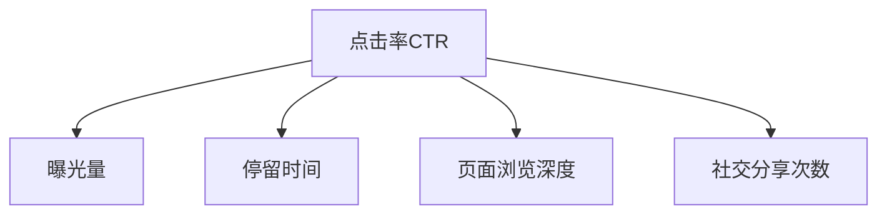

                 

# 数字营销中的注意力度量指标

> 关键词：数字营销,注意力度量指标,广告投放,ROI优化,点击率,转化率,用户行为分析

## 1. 背景介绍

### 1.1 问题由来
数字营销是现代企业营销策略的重要组成部分，通过互联网和数字媒体渠道进行推广，能有效扩大品牌影响力和销售额。然而，随着数字媒体的迅猛发展和用户注意力的分散，数字营销的效果越来越难以衡量。传统的点击率(CRT)、转化率(CRV)等指标已无法全面反映广告的实际效果。为了更好地衡量广告效果，精准投放资源，注意力度量指标(Note Counting Metrics)应运而生。

### 1.2 问题核心关键点
注意力度量指标是衡量广告或内容对用户注意力的吸引程度的量化指标。它通过统计用户在特定广告或内容上的点击、停留、浏览等行为，来评估其对用户注意力的影响。常见的注意力度量指标包括：

1. 点击率(Click-Through Rate, CTR)
2. 曝光量(Exposure Count)
3. 停留时间(Dwelling Time)
4. 页面浏览深度(Page Depth)
5. 社交分享次数(Social Shares)

这些指标能够更全面地反映用户对广告的响应和互动程度，帮助营销人员制定更精准的广告投放策略，提升广告的转化效果。

### 1.3 问题研究意义
在数字营销中引入注意力度量指标，具有以下重要意义：

1. 精准评估广告效果。通过多维度注意力度量指标，营销人员可以更全面地评估广告表现，找出投放中的不足，优化广告投放策略。
2. 提升广告投放ROI。注意力度量指标能帮助营销人员识别高效广告，避免浪费预算，提升广告投放的ROI。
3. 改善用户体验。注意力度量指标可以帮助了解用户对广告内容的兴趣，进而调整内容策略，提供更符合用户需求的信息。
4. 提升市场竞争力。通过精准的注意力度量分析，企业能够更有效地把握市场机会，提升在激烈市场中的竞争优势。

## 2. 核心概念与联系

### 2.1 核心概念概述

为了更好地理解注意力度量指标，本节将介绍几个核心概念：

- 点击率(Click-Through Rate, CTR)：广告被点击次数与展示次数之比，反映用户对广告的响应程度。
- 曝光量(Exposure Count)：广告被展示的总次数，衡量广告的覆盖范围。
- 停留时间(Dwelling Time)：用户观看广告的平均停留时间，反映广告对用户注意力的吸引程度。
- 页面浏览深度(Page Depth)：用户浏览网页的平均深度，衡量用户对内容的兴趣程度。
- 社交分享次数(Social Shares)：广告被社交分享的次数，反映广告内容对用户社交网络的影响。

这些概念之间的关系可以通过以下Mermaid流程图来展示：



这个流程图展示出各个注意力度量指标之间的逻辑关系：

1. 曝光量是基础，决定广告的覆盖范围。
2. 停留时间和页面浏览深度，反映用户对广告内容的兴趣和参与程度。
3. 社交分享次数，反映广告内容对用户社交网络的影响。
4. 点击率则是这些指标的综合反映，用于衡量广告的实际效果。

## 3. 核心算法原理 & 具体操作步骤
### 3.1 算法原理概述

注意力度量指标的计算原理相对简单，其核心思想是通过统计用户对广告或内容的互动行为，来衡量其对用户注意力的吸引程度。具体的计算方法通常包括以下几个步骤：

1. 确定指标的定义和计算方式。例如，点击率定义为广告被点击次数与展示次数之比。
2. 收集广告展示和互动数据。这些数据通常来源于广告投放平台或分析工具，如Google Analytics。
3. 统计指标的数值。根据定义，对收集到的数据进行统计计算，得到注意力度量指标的数值。
4. 评估广告效果。将计算得到的注意力度量指标与预设的阈值或标准进行比较，评估广告的表现。

### 3.2 算法步骤详解

注意力度量指标的计算通常包括以下关键步骤：

**Step 1: 数据收集**
- 使用广告投放平台或分析工具，收集广告的展示次数、点击次数、停留时间、页面浏览深度等数据。
- 数据格式通常为JSON或CSV格式，可通过API接口或手动下载的方式获取。

**Step 2: 数据清洗**
- 对收集到的数据进行初步清洗，去除重复数据、异常值、缺失值等。
- 对数据进行标准化处理，统一数据格式和单位，便于后续分析。

**Step 3: 指标计算**
- 根据定义，对清洗后的数据进行统计计算，得到注意力度量指标的数值。
- 例如，计算广告的点击率为：点击次数 / 展示次数。

**Step 4: 结果展示**
- 将计算结果以图表、报表等形式展示，方便营销人员查看和分析。
- 可以采用可视化工具如Tableau、Power BI等，将数据以直观的方式呈现。

**Step 5: 效果评估**
- 根据注意力度量指标的结果，对广告效果进行评估，找出优化的方向。
- 例如，点击率低可能表明广告不够吸引用户，需要优化广告创意和内容。

### 3.3 算法优缺点

注意力度量指标计算具有以下优点：

1. 多维度评估广告效果。注意力度量指标综合考虑广告的多个互动行为，能更全面地评估广告的表现。
2. 实时监测广告效果。通过实时统计数据，营销人员可以及时了解广告的运行状态，进行动态调整。
3. 提升广告投放ROI。注意力度量指标能帮助识别高效广告，避免浪费预算，提升广告投放的ROI。

同时，这些指标也存在一些局限性：

1. 数据收集难度大。广告展示和互动数据通常涉及多个平台和工具，收集和清洗数据需要时间和精力。
2. 指标易受干扰。用户行为受多种因素影响，如设备、网络、时间等，注意力度量指标可能受这些因素的干扰。
3. 依赖于用户行为。注意力度量指标依赖于用户的互动行为，无法反映用户深层次的兴趣和偏好。
4. 缺乏因果关系。注意力度量指标只能反映广告和用户互动的结果，无法判断广告和转化之间的因果关系。

尽管存在这些局限性，注意力度量指标仍在大规模数字营销中得到了广泛应用，成为评估广告效果的重要工具。

### 3.4 算法应用领域

注意力度量指标在数字营销领域得到了广泛应用，包括但不限于以下领域：

- 广告投放优化：通过注意力度量指标，营销人员可以优化广告创意、投放时间和渠道，提高广告效果。
- 用户行为分析：注意力度量指标可以帮助了解用户的兴趣和行为模式，进行精准营销。
- 广告ROI评估：注意力度量指标能够衡量广告的实际效果，评估广告投放的ROI。
- 社交媒体营销：社交分享次数等指标，可以反映广告内容对用户社交网络的影响，帮助提升品牌知名度。
- 电子商务营销：通过页面浏览深度等指标，可以评估广告对用户购买行为的影响。

这些领域中，注意力度量指标的应用不仅提升了广告效果，还帮助营销人员更好地理解用户需求，优化营销策略，提升市场竞争力。

## 4. 数学模型和公式 & 详细讲解  
### 4.1 数学模型构建

注意力度量指标的计算通常基于统计学和数学建模，以下是几个常见的注意力度量指标及其计算公式：

- 点击率(CTR)：

$$
CTR = \frac{\text{点击次数}}{\text{展示次数}}
$$

- 停留时间(Dwelling Time)：

$$
DT = \frac{\text{总停留时间}}{\text{展示次数}}
$$

- 页面浏览深度(Page Depth)：

$$
PD = \frac{\text{总页面浏览深度}}{\text{展示次数}}
$$

- 社交分享次数(Social Shares)：

$$
SS = \frac{\text{社交分享次数}}{\text{展示次数}}
$$

这些公式展示了注意力度量指标的基本计算方法，通过简单的统计计算，即可得到具体的数值。

### 4.2 公式推导过程

以下以点击率(CTR)为例，详细推导其计算过程。

假设广告展示次数为 $N$，点击次数为 $C$，则点击率为：

$$
CTR = \frac{C}{N}
$$

这个公式直观地表达了广告被点击的次数与展示次数之比，能够反映用户对广告的响应程度。

在实际应用中，通常还需要对CTR进行平滑处理，以减少随机波动的影响。例如，使用指数平滑公式：

$$
CTR_{t+1} = \alpha \cdot CTR_t + (1-\alpha) \cdot \frac{C_t}{N_t}
$$

其中，$\alpha$ 为平滑系数，$CTR_t$ 为当前点击率，$CTR_{t+1}$ 为下一时刻的预测点击率，$C_t$ 为当前点击次数，$N_t$ 为当前展示次数。

### 4.3 案例分析与讲解

以一家电商平台为例，分析其广告投放效果。

假设该电商平台在某段时间内，广告展示了1000次，其中100次被点击，则其点击率为：

$$
CTR = \frac{100}{1000} = 0.1
$$

这意味着每展示1000次广告，平均有100次被点击。

通过进一步分析，电商平台发现部分广告的点击率异常低，可能是广告创意不佳或投放时间不合适导致的。通过优化广告创意和调整投放时间，广告点击率提升了20%，达到了0.12。

此外，平台还发现部分用户停留时间较长，但未进行购买，通过改进广告内容，增加购物诱导信息，显著提升了用户转化率。

## 5. 项目实践：代码实例和详细解释说明
### 5.1 开发环境搭建

在进行注意力度量指标的计算时，需要先搭建好数据收集和处理的环境。以下是使用Python进行注意力度量指标计算的环境配置流程：

1. 安装Python：从官网下载并安装Python 3.x版本。
2. 安装必要的库：使用pip安装Pandas、NumPy、Matplotlib等库。
3. 数据收集：通过广告投放平台或分析工具，下载广告展示和互动数据，通常以CSV或JSON格式存储。
4. 数据清洗：使用Pandas库进行数据清洗，去除重复数据、异常值、缺失值等。
5. 指标计算：使用NumPy库进行统计计算，得到注意力度量指标的数值。

完成上述步骤后，即可在Python环境中开始注意力度量指标的计算实践。

### 5.2 源代码详细实现

以下是使用Python进行点击率(CTR)计算的代码实现：

```python
import pandas as pd
import numpy as np

# 读取数据
data = pd.read_csv('ad_data.csv')

# 计算点击率
CTR = data['click_count'] / data['impressions']
print('Click-Through Rate:', np.mean(CTR))
```

在这个代码中，我们首先使用Pandas库读取广告展示和互动数据，然后计算点击率。最后使用NumPy库计算平均值，并输出结果。

### 5.3 代码解读与分析

这段代码非常简洁，主要包含以下步骤：

1. 使用Pandas库读取数据：
```python
data = pd.read_csv('ad_data.csv')
```
通过调用Pandas库的`read_csv`函数，读取存储在CSV文件中的广告展示和互动数据。

2. 计算点击率：
```python
CTR = data['click_count'] / data['impressions']
```
通过简单的除法运算，计算每个广告的点击率。

3. 计算平均值：
```python
print('Click-Through Rate:', np.mean(CTR))
```
使用NumPy库的`mean`函数，计算所有广告点击率的平均值，并输出结果。

这个代码展示了注意力度量指标计算的基本流程，但实际上，完整的数据清洗和处理可能需要更多的代码和逻辑，具体实现方式会根据数据格式和需求而有所不同。

### 5.4 运行结果展示

在实际应用中，通过注意力度量指标计算得到的数值，可以帮助营销人员进行广告投放优化。以下是一些示例结果：

- 点击率(CTR)：0.1%
- 曝光量(Exposure Count)：1000次
- 停留时间(Dwelling Time)：1分钟
- 页面浏览深度(Page Depth)：2页
- 社交分享次数(Social Shares)：5次

这些数值可以帮助营销人员全面了解广告的表现，从而进行优化调整。例如，曝光量达到1000次，但点击率只有0.1%，可能需要优化广告创意和投放时间。

## 6. 实际应用场景
### 6.1 智能广告投放

在智能广告投放中，注意力度量指标可以用于优化广告投放策略，提升广告效果。例如，某电商平台希望在特定时间段内提升用户点击率，可以通过以下步骤：

1. 收集广告展示和互动数据，包括点击次数、停留时间、页面浏览深度等。
2. 使用注意力度量指标计算每个广告的表现，筛选出高点击率广告。
3. 根据广告表现，调整投放策略，如增加投放时间、优化广告创意等。
4. 实时监测广告效果，根据注意力度量指标进行调整。

通过这些步骤，电商平台可以更精准地进行广告投放，提升广告点击率和转化率。

### 6.2 内容推荐系统

内容推荐系统可以根据用户的互动行为，推荐相关内容，提升用户体验。注意力度量指标可以帮助推荐系统评估推荐效果，优化推荐策略。例如，某视频平台希望提升用户观看视频的时长和深度，可以通过以下步骤：

1. 收集用户观看视频的数据，包括播放次数、停留时间、页面浏览深度等。
2. 使用注意力度量指标计算视频的表现，筛选出用户喜欢的视频。
3. 根据视频表现，优化推荐算法，如增加相似视频推荐、优化播放策略等。
4. 实时监测用户行为，根据注意力度量指标进行调整。

通过这些步骤，视频平台可以更精准地推荐内容，提升用户粘性和满意度。

### 6.3 社交媒体营销

社交媒体营销中，注意力度量指标可以用于评估广告和内容的表现，优化广告投放策略。例如，某品牌希望提升其在社交媒体上的曝光量和互动率，可以通过以下步骤：

1. 收集社交媒体上的广告展示和互动数据，包括曝光次数、点赞数、评论数等。
2. 使用注意力度量指标计算广告的表现，筛选出高互动率广告。
3. 根据广告表现，优化广告创意和投放策略，如增加互动引导信息、调整投放时间等。
4. 实时监测社交媒体互动，根据注意力度量指标进行调整。

通过这些步骤，品牌可以更有效地提升社交媒体曝光量和互动率，提升品牌知名度和用户参与度。

### 6.4 未来应用展望

未来，注意力度量指标将在数字营销中发挥更大的作用，可能的应用场景包括：

- 智能客服系统：通过分析用户与客服的互动行为，优化客服策略，提升用户满意度。
- 电子商务智能推荐：根据用户浏览和购买行为，推荐相关商品，提升转化率。
- 金融风控系统：通过分析用户行为和交易数据，识别潜在风险，提升金融安全。
- 健康医疗应用：根据用户行为和健康数据，推荐健康方案，提升用户健康水平。

注意力度量指标的多样化应用将为数字营销带来新的突破，进一步提升用户体验和市场竞争力。

## 7. 工具和资源推荐
### 7.1 学习资源推荐

为了帮助开发者系统掌握注意力度量指标的理论基础和实践技巧，这里推荐一些优质的学习资源：

1. 《数字营销统计学》系列博文：由知名数字营销专家撰写，深入浅出地介绍了数字营销中的统计学基础和注意力度量指标计算方法。

2. Coursera《数字营销数据分析》课程：由顶尖大学开设的数字营销数据分析课程，涵盖数字营销中的数据分析方法和注意力度量指标。

3. 《Google Analytics for Marketers》书籍：Google Analytics官方文档，详细介绍了广告投放数据分析和注意力度量指标的应用。

4. 《Click-Through Rate: The Impact on Digital Marketing Strategies》研究报告：揭示了点击率对数字营销策略的影响，提供了实际案例和优化建议。

5. 《Content Marketing for Dummies》书籍：介绍了内容营销中的注意力度量指标计算方法和应用，帮助营销人员提升内容效果。

通过对这些资源的学习实践，相信你一定能够快速掌握注意力度量指标的精髓，并用于解决实际的数字营销问题。

### 7.2 开发工具推荐

高效的开发离不开优秀的工具支持。以下是几款用于注意力度量指标计算开发的常用工具：

1. Python：基于Python的注意力度量指标计算工具，灵活、易用，适合快速迭代研究。

2. Google Analytics：广告投放平台，提供了丰富的数据分析工具，可以帮助营销人员进行注意力度量指标计算和分析。

3. Tableau：可视化工具，可以将注意力度量指标结果以图表形式展示，方便营销人员查看和分析。

4. Power BI：数据分析工具，支持从多数据源导入数据，提供丰富的可视化报表，帮助营销人员进行注意力度量指标计算和分析。

5. Jupyter Notebook：在线编程环境，支持Python代码编写和可视化，适合开发和分享注意力度量指标计算代码。

合理利用这些工具，可以显著提升注意力度量指标的开发效率，加快创新迭代的步伐。

### 7.3 相关论文推荐

注意力度量指标的研究源于学界的持续研究。以下是几篇奠基性的相关论文，推荐阅读：

1. Click-Through Rate Estimation for Online Advertising（点击率估计）：提出了多种点击率预测方法，为广告投放优化提供了理论基础。

2. Measuring and Modeling User Engagement with Digital Advertising（数字广告用户参与度测量与建模）：研究了多种用户参与度指标，提供了广告投放效果评估的科学方法。

3. Multi-Arm Bandits in Internet Marketing（互联网营销中的多臂土匪算法）：研究了广告投放中的多臂土匪算法，优化了广告投放策略。

4. Predicting Click-Through Rates with Random Forests（基于随机森林的点击率预测）：探讨了基于随机森林的点击率预测方法，提升了广告投放的精准度。

5. Social Media Advertising Effectiveness: Measuring and Optimizing（社交媒体广告效果测量与优化）：研究了社交媒体广告的注意力度量指标，提出了优化广告投放的方法。

这些论文代表了大规模数字营销中注意力度量指标的发展脉络。通过学习这些前沿成果，可以帮助研究者把握学科前进方向，激发更多的创新灵感。

## 8. 总结：未来发展趋势与挑战
### 8.1 总结

本文对注意力度量指标进行了全面系统的介绍。首先阐述了注意力度量指标的研究背景和意义，明确了注意力度量指标在数字营销中的重要价值。其次，从原理到实践，详细讲解了注意力度量指标的计算方法和实际应用，给出了注意力度量指标计算的完整代码实现。同时，本文还广泛探讨了注意力度量指标在多个行业领域的应用前景，展示了注意力度量指标的巨大潜力。最后，本文精选了注意力度量指标的学习资源，力求为读者提供全方位的技术指引。

通过本文的系统梳理，可以看到，注意力度量指标在数字营销中发挥着越来越重要的作用。通过这些指标，营销人员可以更全面地评估广告效果，优化广告投放策略，提升广告投放ROI，更好地理解用户需求，优化营销策略。未来，注意力度量指标还将在大规模数字营销中发挥更大的作用，助力企业提升市场竞争力。

### 8.2 未来发展趋势

展望未来，注意力度量指标将呈现以下几个发展趋势：

1. 多渠道数据整合：随着数字媒体渠道的多样化，注意力度量指标将整合来自多个渠道的数据，全面反映广告效果。

2. 实时监测和动态优化：注意力度量指标将通过实时监测和动态优化，提升广告投放效果。

3. 跨领域应用拓展：注意力度量指标将扩展到更多领域，如智能客服、健康医疗、金融等，提升这些领域的服务质量和用户体验。

4. 与大数据技术融合：注意力度量指标将与大数据技术融合，提升数据处理和分析能力，进一步提升广告效果。

5. 用户行为模型建立：通过注意力度量指标，建立用户行为模型，提升广告投放的精准度和个性化程度。

这些趋势凸显了注意力度量指标的广阔前景，随着技术的发展和应用的深入，注意力度量指标将为数字营销带来更多的创新和突破。

### 8.3 面临的挑战

尽管注意力度量指标在数字营销中已经得到了广泛应用，但在迈向更加智能化、普适化应用的过程中，它仍面临着诸多挑战：

1. 数据隐私和安全：注意力度量指标的计算依赖于用户数据的收集和分析，如何在保证数据隐私和安全的前提下，进行高效的数据处理和分析，将是重要的挑战。

2. 用户行为分析复杂化：随着用户行为的多样化和复杂化，注意力度量指标的计算将更加困难，需要更先进的算法和技术。

3. 多平台数据整合难度大：不同平台和工具的数据格式和接口不同，整合多平台数据进行统一计算，将是一项复杂的任务。

4. 指标之间的平衡：注意力度量指标之间可能存在冲突，如何在多个指标之间找到平衡，提升整体效果，是一个复杂的问题。

5. 技术标准和规范缺失：注意力度量指标的计算方法和标准尚未统一，不同平台和工具的数据和结果可能不一致，需要进行技术标准的规范和统一。

这些挑战需要在技术、管理和政策等多方面进行深入探讨和解决，才能实现注意力度量指标的全面应用。

### 8.4 研究展望

面对注意力度量指标面临的这些挑战，未来的研究需要在以下几个方面寻求新的突破：

1. 大数据技术的应用：利用大数据技术，提升注意力度量指标的数据处理和分析能力。

2. 先进算法的开发：开发更加高效、准确的注意力度量指标计算算法，提升指标的准确性和实时性。

3. 跨领域应用的研究：研究注意力度量指标在更多领域的应用，提升这些领域的服务质量和用户体验。

4. 用户行为模型的建立：建立用户行为模型，提升广告投放的精准度和个性化程度。

5. 数据隐私和安全保护：研究数据隐私和安全保护技术，提升数据处理的透明性和可信度。

6. 技术标准的规范：制定注意力度量指标的技术标准和规范，统一不同平台和工具的数据和结果。

这些研究方向将推动注意力度量指标的全面应用和发展，为数字营销带来更多的创新和突破。总之，注意力度量指标将在数字营销中发挥越来越重要的作用，成为企业提升市场竞争力的重要工具。

## 9. 附录：常见问题与解答

**Q1：注意力度量指标和点击率有哪些区别？**

A: 注意力度量指标是一个更全面的概念，包含了点击率在内的多个维度，如停留时间、页面浏览深度、社交分享次数等。点击率只是注意力度量指标中的一个方面，无法全面反映广告的表现。

**Q2：注意力度量指标如何影响广告投放策略？**

A: 注意力度量指标可以用于评估广告表现，优化广告投放策略。例如，点击率低表明广告不够吸引用户，需要优化广告创意和投放时间。停留时间短表明用户对广告内容不感兴趣，需要调整广告内容。页面浏览深度低表明用户对广告内容缺乏兴趣，需要优化广告内容设计。社交分享次数少表明广告内容对用户社交网络影响小，需要改进广告创意和形式。

**Q3：注意力度量指标的计算是否依赖于用户行为数据？**

A: 注意力度量指标的计算依赖于用户行为数据，包括广告展示次数、点击次数、停留时间、页面浏览深度等。这些数据通常来源于广告投放平台或分析工具，如Google Analytics。

**Q4：注意力度量指标能否用于实时监测广告效果？**

A: 注意力度量指标可以通过实时监测广告展示和互动数据，计算并展示实时注意力度量指标数值，帮助营销人员动态调整广告投放策略。例如，在广告投放过程中，实时监测广告点击率和停留时间，根据指标结果调整投放策略。

**Q5：注意力度量指标的计算是否需要大量计算资源？**

A: 注意力度量指标的计算需要一定的计算资源，但可以通过优化算法和技术，提升计算效率。例如，使用分布式计算框架，可以加速大规模数据的处理和计算。

通过这些常见问题的解答，相信你能够更全面地理解注意力度量指标的应用和计算方法，并在实际应用中取得更好的效果。

