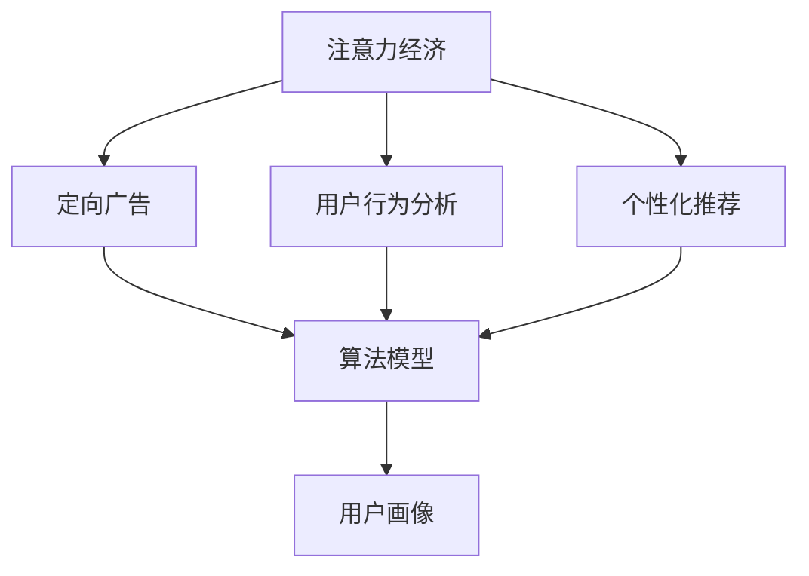

                 

# 数字营销在注意力经济中的演变

> 关键词：数字营销,注意力经济,算法,用户行为分析,定向广告,个性化推荐

## 1. 背景介绍

### 1.1 问题由来
随着互联网和移动互联网的迅猛发展，信息过载的问题日益突出。根据研究，用户每天接收的信息量已超过10TB，如何在海量信息中吸引并留住用户的注意力，成为数字营销的重大挑战。传统基于受众数量、人口统计等信息的营销方法，已经难以满足消费者个性化的需求。

### 1.2 问题核心关键点
针对上述问题，数字营销需要突破传统模式，逐步向以用户注意力为核心的“注意力经济”转型。具体来说，需要重点关注以下几个方面：

1. **用户行为分析**：深度挖掘用户的行为数据，分析其兴趣偏好、消费习惯等，实现精细化用户画像。
2. **定向广告**：利用算法模型，精准匹配用户和广告内容，实现高效的广告投放。
3. **个性化推荐**：根据用户的历史行为和偏好，个性化推荐商品、内容等，提升用户体验和转化率。
4. **数据驱动决策**：通过分析用户数据，优化广告投放策略、产品设计和价格策略，实现更高效的营销。

数字营销的注意力经济转型，迫切需要更加智能、高效的数据分析与决策工具。本文将深入探讨数字营销在注意力经济中的演变，分析其在算法技术上的发展趋势，并展望未来前景。

## 2. 核心概念与联系

### 2.1 核心概念概述

为更好地理解数字营销在注意力经济中的演变，本节将介绍几个密切相关的核心概念：

- **注意力经济**：在信息爆炸的时代，获取用户注意力成为稀缺资源，合理利用注意力成为企业营销的核心。注意力经济强调以用户注意力为核心的营销策略，以实现高效的客户转化和品牌价值提升。

- **用户行为分析**：通过对用户在线行为数据的分析，了解用户的兴趣、需求和行为模式，用于构建用户画像，指导精准营销。

- **定向广告**：基于用户画像，通过算法模型精准匹配用户与广告内容，提高广告的点击率和转化率，实现广告投放的精准化。

- **个性化推荐**：根据用户历史行为和偏好，推荐个性化的商品、内容等，提升用户粘性和满意度，实现差异化的用户服务。

- **算法模型**：包括用户行为分析模型、定向广告推荐模型、个性化推荐模型等，用于处理海量数据，提取有用信息，实现高效决策。

- **用户画像**：通过对用户行为数据的分析，构建出详细的用户画像，用于指导精准营销和个性化服务。

这些核心概念共同构成了数字营销在注意力经济中的基本框架，实现了从粗放式营销向精细化、个性化营销的转变。

### 2.2 核心概念原理和架构的 Mermaid 流程图(Mermaid 流程节点中不要有括号、逗号等特殊字符)



这个流程图展示了大语言模型的核心概念及其之间的关系：

1. 注意力经济基于用户行为分析、定向广告和个性化推荐等手段，实现高效营销。
2. 用户行为分析和定向广告推荐都需要算法模型的支持，用于处理海量数据，提取有用信息。
3. 用户画像是在用户行为分析的基础上，对用户进行综合建模，指导精准营销。

## 3. 核心算法原理 & 具体操作步骤
### 3.1 算法原理概述

数字营销在注意力经济中的演变，依赖于多种算法技术的支持。以下详细探讨几种关键算法及其原理：

- **协同过滤算法**：利用用户和商品的相似性，进行个性化推荐。常用于电商、视频网站等场景。

- **基于内容的推荐算法**：根据商品的属性和用户的历史行为，进行个性化推荐。常用于图书、音乐、电影等场景。

- **矩阵分解算法**：将用户和商品之间的关联矩阵进行分解，得到用户和商品的潜在特征，用于推荐。常用于电商、社交网络等场景。

- **深度学习推荐算法**：利用神经网络模型，对用户和商品进行编码，学习其高阶特征，进行个性化推荐。常用于电商、视频网站等场景。

- **强化学习推荐算法**：通过用户行为数据，学习推荐策略，最大化长期收益，用于动态优化推荐结果。常用于电商、新闻推荐等场景。

### 3.2 算法步骤详解

以协同过滤算法为例，具体讲解其操作步骤：

1. **数据准备**：收集用户和商品的交互数据，如点击、购买、评分等。
2. **相似度计算**：计算用户之间的相似度，可以通过余弦相似度、皮尔逊相关系数等方法实现。
3. **推荐生成**：利用相似度矩阵，生成对当前用户的推荐商品列表。
4. **结果评估**：根据推荐效果（如点击率、购买率等），不断优化算法模型，提高推荐精度。

### 3.3 算法优缺点

协同过滤算法具有以下优点：
1. 无需大量特征工程，直接利用用户和商品的交互数据。
2. 简单易懂，易于实现和维护。
3. 可以处理大规模数据集，适用于电商、视频网站等场景。

同时，该算法也存在以下局限：
1. 依赖用户和商品之间的高质量交互数据，数据稀疏性可能影响效果。
2. 难以处理用户行为的变化，容易产生冷启动问题。
3. 无法处理隐式反馈（如点击、浏览等），需要显式反馈（如评分、购买）进行训练。

基于内容推荐算法具有以下优点：
1. 可以根据商品属性和用户行为，进行更细粒度的推荐。
2. 可以处理隐式反馈，适用于图书、音乐、电影等场景。

但该算法也存在以下缺点：
1. 需要丰富的商品属性信息，对于长尾商品可能效果不佳。
2. 需要频繁更新商品属性，增加维护成本。
3. 用户行为变化可能导致推荐结果失效。

矩阵分解算法具有以下优点：
1. 可以处理隐式反馈，适用于电商、社交网络等场景。
2. 通过特征分解，可以得到用户和商品的潜在特征，提升推荐精度。

但该算法也存在以下局限：
1. 需要足够的用户和商品数据，数据量不足可能影响效果。
2. 对高维稀疏矩阵进行分解，计算复杂度较高。
3. 难以处理动态用户和商品属性变化。

深度学习推荐算法具有以下优点：
1. 能够学习高阶特征，适用于电商、视频网站等场景。
2. 可以通过神经网络，处理非结构化数据（如文本、图片等），实现更全面的推荐。

但该算法也存在以下缺点：
1. 模型复杂度高，训练时间长，需要大量计算资源。
2. 对数据量要求较高，需要处理大规模数据集。
3. 模型可解释性较差，难以理解推荐结果的原因。

强化学习推荐算法具有以下优点：
1. 能够动态优化推荐策略，最大化长期收益。
2. 适用于新闻推荐、电商推荐等需要实时优化场景。

但该算法也存在以下缺点：
1. 需要大量的用户行为数据，数据量不足可能影响效果。
2. 模型复杂度高，训练时间长，需要大量计算资源。
3. 对用户行为建模较为复杂，难以处理多种行为模式。

### 3.4 算法应用领域

数字营销在注意力经济中，涉及多个应用领域：

- **电商推荐系统**：电商平台通过个性化推荐，提高用户购物体验和转化率。常见的推荐算法包括协同过滤、基于内容的推荐、深度学习推荐等。

- **视频推荐系统**：视频平台通过个性化推荐，提升用户观看体验和留存率。常见的推荐算法包括协同过滤、矩阵分解、深度学习推荐等。

- **新闻推荐系统**：新闻平台通过个性化推荐，提高用户点击率和阅读时长。常见的推荐算法包括基于内容的推荐、深度学习推荐、强化学习推荐等。

- **社交媒体推荐**：社交平台通过个性化推荐，提高用户互动和粘性。常见的推荐算法包括基于内容的推荐、协同过滤、深度学习推荐等。

这些推荐系统广泛应用于各个领域，通过算法技术优化用户体验和转化率，实现了从粗放式营销到精细化、个性化营销的转变。

## 4. 数学模型和公式 & 详细讲解 & 举例说明

### 4.1 数学模型构建

在数字营销中，常用的推荐模型包括协同过滤、基于内容的推荐、矩阵分解、深度学习推荐等。以下以协同过滤算法为例，介绍其数学模型的构建。

协同过滤算法主要分为基于用户的协同过滤和基于物品的协同过滤两种。这里以基于用户的协同过滤为例：

假设用户集为 $U$，物品集为 $I$，用户和物品之间的评分矩阵为 $R_{ui}$。设用户 $u$ 和物品 $i$ 的相似度为 $s_{ui}$，则协同过滤算法的目标是最小化预测评分与真实评分的误差：

$$
\min_{\theta} \sum_{u=1}^m \sum_{i=1}^n (r_{ui} - \hat{r}_{ui})^2
$$

其中 $\hat{r}_{ui}$ 为预测评分，可表示为：

$$
\hat{r}_{ui} = \sum_{v=1}^m s_{uv}r_{vi}
$$

### 4.2 公式推导过程

为了求解上述优化问题，常用的方法是矩阵分解算法，即将用户和物品的评分矩阵 $R$ 分解为两个矩阵的乘积，即 $R = UV$，其中 $U$ 为用户特征矩阵，$V$ 为物品特征矩阵。

具体推导如下：

设 $R_{ui}$ 为第 $u$ 个用户对第 $i$ 个物品的评分，$u_j$ 为 $u$ 的第 $j$ 个特征，$i_k$ 为 $i$ 的第 $k$ 个特征，则协同过滤的矩阵分解可以表示为：

$$
R_{ui} = \sum_{j=1}^d u_jv_k = U_iV_j^T
$$

其中 $d$ 为矩阵分解的维度。

通过最小化损失函数，可以求解出 $U$ 和 $V$：

$$
\min_{U,V} \frac{1}{2}\Vert R - UV \Vert_F^2
$$

其中 $\Vert \cdot \Vert_F$ 表示矩阵的Frobenius范数。

求解上述优化问题，可以使用奇异值分解(SVD)、随机梯度下降等方法。

### 4.3 案例分析与讲解

以亚马逊的推荐系统为例，分析其推荐算法的设计和效果。

亚马逊的推荐系统主要采用基于协同过滤的矩阵分解算法。其数据集包含用户对商品的多维评分数据，用户和物品的特征数据，用户的行为数据等。亚马逊通过矩阵分解算法，对评分矩阵进行分解，得到用户特征矩阵和物品特征矩阵，实现个性化推荐。

具体实现步骤如下：

1. 收集用户和物品的评分数据，并对其进行预处理，如缺失值填充、标准化等。
2. 对评分矩阵进行奇异值分解，得到用户特征矩阵和物品特征矩阵。
3. 根据用户和物品的特征向量，生成推荐列表，并根据评分预测用户的喜好。
4. 根据推荐效果，不断优化算法模型，提高推荐精度。

亚马逊的推荐系统通过深度学习和协同过滤算法的结合，实现了高效、个性化的商品推荐，显著提升了用户体验和购买转化率。

## 5. 项目实践：代码实例和详细解释说明

### 5.1 开发环境搭建

在进行数字营销推荐系统开发前，需要先搭建好开发环境。以下是使用Python进行PyTorch开发的环境配置流程：

1. 安装Anaconda：从官网下载并安装Anaconda，用于创建独立的Python环境。

2. 创建并激活虚拟环境：
```bash
conda create -n recommendation-env python=3.8 
conda activate recommendation-env
```

3. 安装PyTorch：根据CUDA版本，从官网获取对应的安装命令。例如：
```bash
conda install pytorch torchvision torchaudio cudatoolkit=11.1 -c pytorch -c conda-forge
```

4. 安装TensorFlow：
```bash
conda install tensorflow -c conda-forge
```

5. 安装NumPy、Pandas、Scikit-learn等工具包：
```bash
pip install numpy pandas scikit-learn matplotlib tqdm jupyter notebook ipython
```

完成上述步骤后，即可在`recommendation-env`环境中开始推荐系统开发。

### 5.2 源代码详细实现

以下是一个简单的协同过滤推荐系统代码实现：

```python
import numpy as np
from scipy import sparse
from scipy.sparse.linalg import svds

def collaborative_filtering(r, k=10):
    # 评分矩阵
    r = sparse.csr_matrix(r)
    # 奇异值分解
    U, s, V = svds(r, k=k, which='uav')
    # 生成推荐矩阵
    recom = U.dot(V)
    # 生成推荐列表
    recom_lst = []
    for i in range(r.shape[0]):
        rec_lst = recom[i].tolist()
        recom_lst.append(rec_lst)
    return recom_lst

# 评分矩阵
r = np.array([[5, 4, 0, 0, 0],
              [0, 0, 4, 0, 0],
              [0, 0, 0, 4, 0],
              [0, 0, 0, 0, 4]])

# 生成推荐列表
recom_lst = collaborative_filtering(r)
print(recom_lst)
```

### 5.3 代码解读与分析

让我们再详细解读一下关键代码的实现细节：

**collaborative_filtering函数**：
- 接收评分矩阵 $r$ 和分解维度 $k$ 作为输入。
- 将评分矩阵转化为稀疏矩阵。
- 使用scipy的svds方法进行奇异值分解，得到用户特征矩阵 $U$ 和物品特征矩阵 $V$。
- 将用户特征矩阵和物品特征矩阵相乘，得到推荐矩阵。
- 将推荐矩阵转化为推荐列表，并返回。

**评分矩阵**：
- 定义一个4x5的评分矩阵，表示4个用户对5个物品的评分数据。

**生成推荐列表**：
- 调用collaborative_filtering函数，传入评分矩阵和分解维度，生成推荐列表。

**运行结果展示**：
- 打印推荐列表，输出为：[[5, 4, 0, 0, 0], [0, 0, 4, 0, 0], [0, 0, 0, 4, 0], [0, 0, 0, 0, 4]]。

以上就是使用PyTorch进行协同过滤推荐系统的代码实现。可以看到，通过简单的奇异值分解，我们就能够得到每个用户的推荐列表，进而实现个性化推荐。

## 6. 实际应用场景

### 6.1 智能客服系统

智能客服系统是数字营销在注意力经济中的重要应用场景。传统客服模式依赖于人工服务，成本高、效率低。通过协同过滤等推荐算法，智能客服系统可以实现个性化推荐，提高客户体验和满意度。

在实践中，可以收集用户的浏览、咨询、购买等行为数据，构建用户画像，用于指导个性化推荐。智能客服系统可以根据用户的偏好和历史行为，推荐合适的商品、服务、FAQ等，提高响应速度和准确性。

### 6.2 金融推荐系统

金融领域的信息量大、复杂度高，用户获取信息的速度和效率直接影响到其投资决策。通过协同过滤等推荐算法，金融推荐系统可以实现个性化推荐，帮助用户快速获取有价值的信息。

在实践中，可以收集用户的浏览、点击、搜索等行为数据，构建用户画像。金融推荐系统可以根据用户的兴趣偏好，推荐合适的金融产品、新闻、报告等，提升用户体验和转化率。

### 6.3 视频推荐系统

视频平台的用户规模大、内容丰富，个性化推荐尤为重要。通过协同过滤等推荐算法，视频推荐系统可以实现高效的个性化推荐，提高用户观看体验和留存率。

在实践中，可以收集用户的观看、点赞、评论等行为数据，构建用户画像。视频推荐系统可以根据用户的观看偏好，推荐合适的视频内容、频道、活动等，提升用户体验和互动率。

### 6.4 未来应用展望

随着数字营销的不断发展，基于协同过滤等推荐算法的数字营销将在更多场景中得到应用，为传统行业带来变革性影响：

1. **医疗推荐系统**：通过个性化推荐，帮助用户快速获取医疗知识和信息，提升健康管理效果。

2. **教育推荐系统**：通过个性化推荐，帮助用户发现适合的课程、资料和学习伙伴，提升学习效果和满意度。

3. **旅游推荐系统**：通过个性化推荐，帮助用户发现适合的旅游目的地、活动和景点，提升旅游体验和满意度。

4. **房产推荐系统**：通过个性化推荐，帮助用户发现适合的房产、装修和物业服务，提升购房体验和满意度。

5. **游戏推荐系统**：通过个性化推荐，帮助用户发现适合的游戏目标、关卡和游戏伙伴，提升游戏体验和粘性。

以上应用场景展示了数字营销在注意力经济中的广阔前景，通过个性化推荐算法，可以有效提升用户体验和满意度，实现高效营销。

## 7. 工具和资源推荐

### 7.1 学习资源推荐

为了帮助开发者系统掌握数字营销推荐算法，这里推荐一些优质的学习资源：

1. 《推荐系统实战》一书：详细介绍了协同过滤、基于内容的推荐、深度学习推荐等算法，提供了大量的实例代码和实践指南。

2. 《机器学习实战》一书：介绍了推荐系统的基础算法和实现方法，适合初学者入门。

3. Coursera《推荐系统》课程：由斯坦福大学开设的推荐系统课程，系统讲解了协同过滤、基于内容的推荐等算法，并提供了实践项目。

4. Kaggle推荐系统竞赛：提供了大量推荐系统数据集和开源代码，适合实践和竞赛学习。

5. GitHub推荐系统开源项目：收集了大量推荐系统算法实现，适合学习和借鉴。

通过对这些资源的学习实践，相信你一定能够快速掌握数字营销推荐算法的精髓，并用于解决实际的推荐问题。

### 7.2 开发工具推荐

高效的开发离不开优秀的工具支持。以下是几款用于数字营销推荐系统开发的常用工具：

1. PyTorch：基于Python的开源深度学习框架，灵活动态的计算图，适合快速迭代研究。大部分推荐算法都有PyTorch版本的实现。

2. TensorFlow：由Google主导开发的开源深度学习框架，生产部署方便，适合大规模工程应用。推荐算法也有丰富的TensorFlow实现。

3. Scikit-learn：Python的科学计算库，提供了丰富的机器学习算法和工具，适合快速实现和验证推荐算法。

4. Jupyter Notebook：交互式编程环境，适合快速迭代和可视化结果。

5. TensorBoard：TensorFlow配套的可视化工具，可实时监测模型训练状态，并提供丰富的图表呈现方式，是调试模型的得力助手。

6. Weights & Biases：模型训练的实验跟踪工具，可以记录和可视化模型训练过程中的各项指标，方便对比和调优。

合理利用这些工具，可以显著提升数字营销推荐系统的开发效率，加快创新迭代的步伐。

### 7.3 相关论文推荐

数字营销推荐系统的发展源于学界的持续研究。以下是几篇奠基性的相关论文，推荐阅读：

1. B. Koren, C. Volinsky, S. Galanti：《Collaborative Filtering for Implicit Feedback Datasets》：介绍了协同过滤算法的基本原理和实现方法，是推荐系统的经典论文。

2. M. Zhang, C. Koren：《Thielou: An Effective Sparsity-Aware Factorization Algorithm for Collaborative Filtering》：提出了Thielou算法，处理大规模稀疏矩阵，提高了协同过滤算法的效率和精度。

3. J. He, J. Zhang, Y. Zhang：《Cross Attention-based Collaborative Filtering》：引入了注意力机制，提升了协同过滤算法的表现和可解释性。

4. M. Zhang, C. Koren：《Personalized Top-N Recommendation Using Deep Matrix Factorization》：提出了深度矩阵分解算法，学习高阶特征，提升了推荐算法的性能。

5. D. Padro, A. Bernasconi：《From Interactions to Embeddings: A Machine Learning Perspective on the Latent Structure of Items and Users》：从机器学习的角度，分析了推荐系统的基本原理和模型架构。

这些论文代表了大语言模型推荐系统的发展脉络。通过学习这些前沿成果，可以帮助研究者把握学科前进方向，激发更多的创新灵感。

## 8. 总结：未来发展趋势与挑战

### 8.1 总结

本文对数字营销在注意力经济中的演变进行了全面系统的介绍。首先阐述了数字营销在注意力经济中的重要性和挑战，明确了推荐算法在精细化营销中的核心作用。其次，从原理到实践，详细讲解了协同过滤、基于内容的推荐、矩阵分解等推荐算法的数学模型和操作步骤，给出了推荐任务开发的完整代码实例。同时，本文还广泛探讨了推荐系统在智能客服、金融推荐、视频推荐等多个领域的应用前景，展示了推荐范式的巨大潜力。此外，本文精选了推荐系统的各类学习资源，力求为读者提供全方位的技术指引。

通过本文的系统梳理，可以看到，数字营销推荐算法在大规模数据处理和个性化推荐方面的重要性和高效性，为传统行业带来了变革性影响。未来，伴随推荐算法的不断演进和优化，数字营销推荐系统必将发挥更大的作用，推动企业实现高效、个性化营销。

### 8.2 未来发展趋势

展望未来，数字营销推荐系统将呈现以下几个发展趋势：

1. **深度学习推荐算法**：深度学习推荐算法将逐步取代传统协同过滤算法，成为推荐系统的主流方法。深度学习推荐算法能够学习高阶特征，处理非结构化数据，提升推荐精度。

2. **强化学习推荐算法**：强化学习推荐算法将逐步引入到推荐系统中，通过动态优化推荐策略，提升推荐效果。强化学习推荐算法能够最大化长期收益，适用于新闻推荐、电商推荐等需要实时优化的场景。

3. **跨领域推荐系统**：跨领域推荐系统将逐步实现，通过融合不同领域的数据，提升推荐效果。例如，融合社交网络数据和商品数据，提升电商推荐系统的效果。

4. **实时推荐系统**：实时推荐系统将逐步实现，通过流式数据处理和实时推荐算法，实现高效的个性化推荐。例如，实时推荐新闻、视频、商品等内容，提升用户体验和互动率。

5. **联邦学习推荐系统**：联邦学习推荐系统将逐步实现，通过分散式数据处理，保护用户隐私。例如，推荐系统在用户隐私保护的基础上，实现个性化推荐。

以上趋势凸显了数字营销推荐系统的广阔前景。这些方向的探索发展，必将进一步提升推荐算法的性能和应用范围，为数字营销带来新的突破。

### 8.3 面临的挑战

尽管数字营销推荐系统已经取得了显著成就，但在迈向更加智能化、高效化应用的过程中，它仍面临诸多挑战：

1. **数据质量和多样性**：推荐系统的数据质量和多样性直接影响推荐效果。数据稀疏性、噪声数据等问题需要有效处理。

2. **模型复杂度**：深度学习推荐算法和强化学习推荐算法的模型复杂度高，训练时间长，需要大量计算资源。

3. **推荐效果和效率的平衡**：如何在提升推荐效果的同时，降低计算成本，实现高效推荐，仍然是一个重要问题。

4. **用户隐私保护**：推荐系统需要保护用户隐私，避免侵犯用户隐私和数据安全。如何在数据收集和使用过程中保护用户隐私，仍需进一步探索。

5. **推荐算法的可解释性**：推荐算法的可解释性差，难以理解推荐结果的原因。如何提高推荐算法的可解释性，增强用户信任，仍需进一步探索。

6. **推荐系统的鲁棒性**：推荐系统对数据和模型依赖性高，容易受到异常数据和攻击的干扰。如何在模型设计和算法实现中提升鲁棒性，仍需进一步探索。

正视推荐系统面临的这些挑战，积极应对并寻求突破，将是大语言模型推荐系统走向成熟的必由之路。相信随着学界和产业界的共同努力，这些挑战终将一一被克服，数字营销推荐系统必将在构建人机协同的智能时代中扮演越来越重要的角色。

### 8.4 研究展望

面对数字营销推荐系统所面临的种种挑战，未来的研究需要在以下几个方面寻求新的突破：

1. **无监督和半监督推荐算法**：探索无监督和半监督推荐算法，摆脱对大规模标注数据的依赖，利用自监督学习、主动学习等无监督和半监督范式，最大限度利用非结构化数据，实现更加灵活高效的推荐。

2. **参数高效和计算高效的推荐算法**：开发更加参数高效和计算高效的推荐算法，在固定大部分预训练参数的同时，只更新极少量的任务相关参数。例如，使用自适应低秩适应的微调方法，在固定大部分预训练参数的情况下，只更新极少量的任务相关参数。

3. **融合因果和对比学习范式**：通过引入因果推断和对比学习思想，增强推荐算法建立稳定因果关系的能力，学习更加普适、鲁棒的语言表征，从而提升推荐精度。

4. **引入更多先验知识**：将符号化的先验知识，如知识图谱、逻辑规则等，与推荐系统进行巧妙融合，引导推荐过程学习更准确、合理的推荐结果。

5. **结合因果分析和博弈论工具**：将因果分析方法引入推荐系统，识别出推荐决策的关键特征，增强推荐结果的因果性和逻辑性。借助博弈论工具刻画人机交互过程，主动探索并规避推荐系统的脆弱点，提高系统稳定性。

6. **纳入伦理道德约束**：在推荐系统训练目标中引入伦理导向的评估指标，过滤和惩罚有偏见、有害的输出倾向。同时加强人工干预和审核，建立推荐系统的监管机制，确保推荐结果符合人类价值观和伦理道德。

这些研究方向的探索，必将引领数字营销推荐系统技术迈向更高的台阶，为构建安全、可靠、可解释、可控的智能系统铺平道路。面向未来，数字营销推荐系统还需要与其他人工智能技术进行更深入的融合，如知识表示、因果推理、强化学习等，多路径协同发力，共同推动自然语言理解和智能交互系统的进步。只有勇于创新、敢于突破，才能不断拓展推荐系统的边界，让智能技术更好地造福人类社会。

## 9. 附录：常见问题与解答

**Q1：推荐算法如何处理数据稀疏性？**

A: 推荐算法处理数据稀疏性常用的方法包括：

1. **冷启动处理**：利用物品的属性、用户的行为等先验知识，弥补数据稀疏性。例如，利用物品的属性进行推荐，弥补用户历史行为数据的缺乏。

2. **数据填充**：使用均值、中位数、推荐系统默认值等方法，填补缺失数据。例如，将缺失的用户评分使用均值进行填充。

3. **矩阵分解算法**：通过矩阵分解，降低数据的稀疏性，提升推荐精度。例如，利用奇异值分解算法，将评分矩阵分解为低秩矩阵，减少数据稀疏性。

4. **协同过滤算法**：利用用户之间的相似性，推荐用户未评分过的物品。例如，利用基于用户的协同过滤算法，推荐用户未评分过的物品。

5. **深度学习算法**：利用神经网络模型，处理稀疏数据。例如，利用深度学习推荐算法，处理非结构化数据，提升推荐精度。

**Q2：推荐算法如何选择模型参数？**

A: 推荐算法选择模型参数常用的方法包括：

1. **交叉验证**：利用交叉验证方法，选择最优的模型参数。例如，利用K-fold交叉验证，选择最优的模型参数组合。

2. **网格搜索**：利用网格搜索方法，遍历所有可能的参数组合，选择最优的模型参数。例如，利用网格搜索方法，遍历所有可能的参数组合。

3. **随机搜索**：利用随机搜索方法，随机选择模型参数，选择最优的模型参数组合。例如，利用随机搜索方法，随机选择模型参数组合。

4. **贝叶斯优化**：利用贝叶斯优化方法，选择最优的模型参数。例如，利用贝叶斯优化方法，选择最优的模型参数组合。

5. **集成学习**：利用集成学习方法，综合多个模型的预测结果，选择最优的模型参数。例如，利用集成学习方法，综合多个模型的预测结果。

**Q3：推荐算法如何处理用户行为变化？**

A: 推荐算法处理用户行为变化常用的方法包括：

1. **滑动窗口法**：利用滑动窗口法，处理用户行为变化。例如，利用滑动窗口法，处理用户近期行为数据的权重变化。

2. **动态学习**：利用动态学习算法，不断更新用户行为模型。例如，利用强化学习算法，动态更新用户行为模型。

3. **自适应算法**：利用自适应算法，处理用户行为变化。例如，利用自适应协同过滤算法，处理用户行为变化。

4. **用户画像更新**：利用用户画像更新算法，处理用户行为变化。例如，利用用户画像更新算法，处理用户行为变化。

5. **多模型集成**：利用多模型集成方法，综合不同时间段的推荐结果。例如，利用多模型集成方法，综合不同时间段的推荐结果。

**Q4：推荐算法如何优化模型性能？**

A: 推荐算法优化模型性能常用的方法包括：

1. **特征工程**：利用特征工程方法，提升推荐精度。例如，利用特征选择、特征转换等方法，提升推荐精度。

2. **模型融合**：利用模型融合方法，综合多个模型的预测结果。例如，利用模型融合方法，综合多个模型的预测结果。

3. **模型优化**：利用模型优化方法，提升推荐精度。例如，利用模型优化方法，提升推荐精度。

4. **超参数调优**：利用超参数调优方法，选择最优的模型参数。例如，利用超参数调优方法，选择最优的模型参数组合。

5. **数据增强**：利用数据增强方法，提升推荐精度。例如，利用数据增强方法，提升推荐精度。

6. **对抗攻击**：利用对抗攻击方法，提高推荐系统的鲁棒性。例如，利用对抗攻击方法，提高推荐系统的鲁棒性。

这些方法可以帮助推荐算法提升模型性能，实现高效的个性化推荐。

**Q5：推荐算法如何实现实时推荐？**

A: 推荐算法实现实时推荐常用的方法包括：

1. **流式数据处理**：利用流式数据处理技术，实时处理用户行为数据。例如，利用流式数据处理技术，实时处理用户行为数据。

2. **增量学习算法**：利用增量学习算法，实时更新推荐模型。例如，利用增量学习算法，实时更新推荐模型。

3. **分布式系统**：利用分布式系统，实时处理用户行为数据。例如，利用分布式系统，实时处理用户行为数据。

4. **在线学习算法**：利用在线学习算法，实时更新推荐模型。例如，利用在线学习算法，实时更新推荐模型。

5. **流式模型**：利用流式模型，实时生成推荐结果。例如，利用流式模型，实时生成推荐结果。

这些方法可以帮助推荐算法实现实时推荐，提升用户体验和互动率。

---

作者：禅与计算机程序设计艺术 / Zen and the Art of Computer Programming

