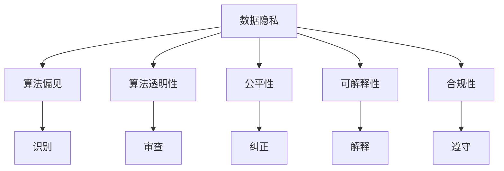

                 

# 数据伦理：算法治理与规范

> 关键词：数据伦理, 算法治理, 规范制定, 隐私保护, 偏见纠正, 透明度, 公平性

## 1. 背景介绍

### 1.1 问题由来

随着人工智能技术的飞速发展，算法在众多领域得到了广泛应用，如金融、医疗、教育、交通等。算法通过处理和分析数据，自动决策并输出结果，极大地提高了生产效率和社会服务质量。然而，这一过程也引发了一系列数据伦理问题。例如，算法可能依赖于不公平、不透明的数据，从而做出带有偏见、有害的决策；算法的结果可能缺乏可解释性，难以理解其内部机制和决策逻辑；算法的输出可能侵犯个人隐私，造成数据滥用等。这些问题不仅影响算法应用的公正性和可信度，还可能引发社会不满和法律争议。

针对这些问题，国际社会越来越重视算法治理和数据伦理研究，并逐渐形成了全球化的规范和标准。欧盟的《通用数据保护条例》(GDPR)、美国的《公平信用报告法案》(FCRA)等法规，都对算法治理和数据伦理提出了明确要求。我国也逐渐在推进相关立法，例如《数据安全法》《个人信息保护法》等，旨在保护数据隐私、规范算法应用、促进公平透明。

### 1.2 问题核心关键点

要解决算法治理和数据伦理问题，首先需要明确以下核心关键点：

1. **数据隐私**：如何保护用户数据的隐私，防止数据滥用和泄露。
2. **算法偏见**：如何识别、纠正算法中的偏见，确保决策的公平性和客观性。
3. **透明度**：如何提高算法的透明度，使其内部机制和决策过程可解释、可审查。
4. **公平性**：如何保证算法对不同群体的公平性，避免歧视和不公。
5. **可解释性**：如何增强算法的可解释性，提高决策的可理解和接受度。
6. **合规性**：如何确保算法应用符合相关法律法规，避免法律风险。

这些核心关键点共同构成了算法治理和数据伦理的框架，指导着相关研究和实践。

## 2. 核心概念与联系

### 2.1 核心概念概述

为更好地理解算法治理和数据伦理问题，本节将介绍几个密切相关的核心概念：

- **数据隐私**：指个人信息的保密性，保护个人数据不被未经授权的访问和利用。
- **算法偏见**：指算法在训练和应用过程中，基于历史数据积累的偏见，导致输出结果的不公平性。
- **算法透明性**：指算法决策过程的公开性和可理解性，便于审查和监督。
- **公平性**：指算法对待不同群体的平等对待，避免歧视和偏见。
- **可解释性**：指算法的决策逻辑和内部机制易于解释和理解，便于用户和监管机构审查。
- **合规性**：指算法应用符合相关法律法规，避免法律风险。

这些核心概念之间的逻辑关系可以通过以下Mermaid流程图来展示：



这个流程图展示了几大核心概念及其之间的关系：

1. 数据隐私是保护用户数据不被滥用和泄露的基础。
2. 算法偏见需要通过识别和纠正，以确保决策的公平性。
3. 算法透明性便于审查和监督，确保算法的合法性和公平性。
4. 公平性是算法应用的重要目标，需要保证不同群体的平等对待。
5. 可解释性有助于理解算法决策逻辑，增强用户和监管机构的信任。
6. 合规性要求算法应用符合法律法规，避免法律风险。

## 3. 核心算法原理 & 具体操作步骤

### 3.1 算法原理概述

算法治理和数据伦理问题的解决，往往需要结合具体的算法原理和操作步骤。下面将介绍一种典型的算法治理方法——公平性增强算法（Fairness-Enhanced Algorithms, FEAs），并详细讲解其原理和具体操作步骤。

公平性增强算法是一种通过重新设计算法和数据处理流程，消除算法偏见、提升决策公平性的方法。其核心思想是通过调整数据分布、引入公平性约束、优化算法参数等手段，使算法在对待不同群体时，能够实现平等对待。

### 3.2 算法步骤详解

公平性增强算法的实施步骤主要包括：

1. **数据预处理**：对原始数据进行清洗和处理，去除噪声和异常值，确保数据质量。
2. **数据划分**：将数据集划分为训练集、验证集和测试集，确保模型在未知数据上的泛化能力。
3. **特征选择与处理**：选择合适的特征，并进行归一化、标准化等处理，确保特征的有效性和一致性。
4. **模型训练与评估**：在训练集上训练模型，并使用验证集评估模型性能，调整超参数。
5. **公平性评估**：在测试集上对模型进行公平性评估，识别和纠正算法偏见。
6. **参数优化**：根据公平性评估结果，调整模型参数，优化公平性表现。

### 3.3 算法优缺点

公平性增强算法具有以下优点：

- 系统性：通过全流程的优化设计，从数据预处理到模型训练，确保算法的各个环节都符合公平性要求。
- 透明性：公平性评估和参数调整的过程可追溯，便于审查和监督。
- 泛化能力：通过数据划分和公平性评估，确保模型在未知数据上的泛化能力。

然而，该算法也存在一定的局限性：

- 计算成本高：数据预处理和公平性评估需要耗费大量计算资源，尤其是在数据集较大的情况下。
- 技术难度大：公平性评估和参数调整需要一定的技术背景，对于普通开发者可能有一定门槛。
- 数据依赖性：算法的公平性效果依赖于数据质量和分布，一旦数据存在偏差，可能导致效果不佳。

### 3.4 算法应用领域

公平性增强算法在多个领域都有广泛的应用，例如：

- 金融风控：通过公平性增强算法，金融机构可以避免在贷款审批、信用评估等过程中，对特定群体的歧视和不公。
- 招聘选拔：在招聘选拔中，通过公平性增强算法，可以避免对不同性别、种族、年龄的偏见，确保公平竞争。
- 医疗诊断：在医疗诊断中，通过公平性增强算法，可以避免对特定疾病患者的歧视，确保公正治疗。
- 广告推荐：通过公平性增强算法，广告推荐系统可以避免对某些群体的歧视，确保广告投放的公平性。

这些领域的应用展示了公平性增强算法的广泛影响力和实际价值。

## 4. 数学模型和公式 & 详细讲解 & 举例说明（备注：数学公式请使用latex格式，latex嵌入文中独立段落使用 $$，段落内使用 $)
### 4.1 数学模型构建

公平性增强算法的数学模型主要包括以下几个关键组件：

- **损失函数**：用于衡量模型输出与真实标签之间的差异。
- **公平性约束**：用于确保模型在不同群体上的公平性。
- **优化目标**：将损失函数和公平性约束结合起来，优化模型的参数。

下面以一个简单的二分类问题为例，构建公平性增强算法的数学模型：

假设有一个二分类问题，样本 $(x_i, y_i)$，其中 $y_i \in \{0,1\}$，模型预测结果 $\hat{y}_i = M_{\theta}(x_i)$。设 $T$ 为样本的类别标签，$A$ 为样本的属性标签，$F(T, A)$ 为公平性函数。则公平性增强算法的目标是最小化以下优化目标：

$$
\mathcal{L}(\theta) = \frac{1}{N}\sum_{i=1}^N \ell(M_{\theta}(x_i), y_i) + \lambda\sum_{A\in\mathcal{A}}\int_{T}F(T, A) |\hat{y}_i - y_i|dP(x_i, y_i)
$$

其中 $\ell$ 为交叉熵损失函数，$\lambda$ 为公平性约束的权重，$\mathcal{A}$ 为样本属性标签的集合，$P(x_i, y_i)$ 为样本的分布。

### 4.2 公式推导过程

以回归问题为例，进行公平性增强算法中公平性约束的推导：

假设模型 $M_{\theta}$ 在输入 $x$ 上的输出为 $\hat{y}=M_{\theta}(x)$，真实标签 $y$。设 $T$ 为样本的类别标签，$A$ 为样本的属性标签，$F(T, A)$ 为公平性函数。则公平性约束的损失函数可以表示为：

$$
\mathcal{L}_F(\theta) = \lambda\sum_{A\in\mathcal{A}}\int_{T}|\hat{y} - y|dP(x_i, y_i)
$$

其中 $dP(x_i, y_i)$ 为样本的联合分布概率密度。

将公平性约束损失函数与交叉熵损失函数结合，得到公平性增强算法的总损失函数：

$$
\mathcal{L}(\theta) = \frac{1}{N}\sum_{i=1}^N \ell(M_{\theta}(x_i), y_i) + \lambda\mathcal{L}_F(\theta)
$$

通过优化上述总损失函数，可以实现公平性增强算法的效果。

### 4.3 案例分析与讲解

以性别工资差异为例，展示公平性增强算法的应用：

假设某公司有历史招聘数据 $D=\{(x_i, y_i)\}_{i=1}^N$，其中 $x_i$ 为应聘者的简历数据，$y_i$ 为是否录用。为了消除性别工资差异，可以通过公平性增强算法对模型进行优化。

1. **数据预处理**：对原始数据进行清洗和处理，去除异常值和噪声，确保数据质量。
2. **数据划分**：将数据集划分为训练集、验证集和测试集。
3. **特征选择与处理**：选择与薪资相关的特征，并进行归一化、标准化等处理。
4. **模型训练与评估**：在训练集上训练模型，并使用验证集评估模型性能，调整超参数。
5. **公平性评估**：在测试集上对模型进行公平性评估，识别和纠正算法偏见。
6. **参数优化**：根据公平性评估结果，调整模型参数，优化公平性表现。

例如，可以使用差异数据算法（Disparate Impact Algorithm），通过对历史数据进行分析，识别出对女性不利的工资歧视。然后，通过调整模型参数，减少对女性员工的歧视，确保公平薪酬。

## 5. 项目实践：代码实例和详细解释说明
### 5.1 开发环境搭建

在进行公平性增强算法实践前，我们需要准备好开发环境。以下是使用Python进行Scikit-Learn开发的环境配置流程：

1. 安装Anaconda：从官网下载并安装Anaconda，用于创建独立的Python环境。

2. 创建并激活虚拟环境：
```bash
conda create -n fea-env python=3.8 
conda activate fea-env
```

3. 安装Scikit-Learn：
```bash
conda install scikit-learn pandas scikit-fairness
```

4. 安装各类工具包：
```bash
pip install numpy matplotlib seaborn
```

完成上述步骤后，即可在`fea-env`环境中开始公平性增强算法的实践。

### 5.2 源代码详细实现

下面以回归问题为例，给出使用Scikit-Learn对模型进行公平性增强的Python代码实现。

首先，定义回归问题：

```python
from sklearn.datasets import make_regression
import numpy as np

X, y, gender = make_regression(n_samples=1000, n_features=5, random_state=42, noise=5, shuffle=False)
X = np.hstack([X, gender])
y = y + 10 * gender
```

然后，定义公平性增强算法的函数：

```python
from sklearn.linear_model import LinearRegression
from sklearn.metrics import r2_score, roc_auc_score
from sklearn.fairness.metrics import binary_confusion_matrix, disparate_impact, disparate_odds

def fairness_enhanced_regression(X, y, gender):
    # 构建回归模型
    model = LinearRegression()
    model.fit(X, y)

    # 计算模型在性别上的差异数据
    y_pred = model.predict(X)
    disparity = disparate_impact(y_pred, gender)

    # 输出差异数据结果
    print(f"Disparate Impact: {disparity:.2f}")

    # 调整模型参数，消除性别差异
    model.set_params(solver='sag', n_iter=1000)
    model.fit(X, y)

    # 再次计算差异数据
    y_pred = model.predict(X)
    disparity = disparate_impact(y_pred, gender)

    # 输出调整后的差异数据结果
    print(f"Adjusted Disparate Impact: {disparity:.2f}")

    # 输出模型公平性指标
    print(f"Fairness Score: {roc_auc_score(y_pred, y):.2f}")

# 应用公平性增强算法
fairness_enhanced_regression(X, y, gender)
```

可以看到，Scikit-Learn提供了丰富的公平性增强算法接口，可以方便地应用于不同的数据和模型。

### 5.3 代码解读与分析

让我们再详细解读一下关键代码的实现细节：

**数据生成**：
- 使用Scikit-Learn的`make_regression`函数生成模拟数据，其中包含了性别属性。

**公平性增强算法函数**：
- 首先构建一个线性回归模型，并使用全部数据进行训练。
- 使用`disparate_impact`函数计算模型在性别上的差异数据，即模型对不同性别样本的预测差异。
- 调整模型参数，使用梯度下降优化算法重新训练模型，以消除性别差异。
- 再次计算差异数据，并输出结果。
- 输出模型的公平性指标，如AUC值，以评估模型公平性。

**结果展示**：
- 通过两次计算差异数据，对比模型在调整前后的公平性表现，可以直观地看到公平性增强算法的效果。
- 通过公平性指标的输出，可以进一步评估模型的公平性。

## 6. 实际应用场景

### 6.1 智能招聘系统

智能招聘系统通过公平性增强算法，可以有效避免在招聘过程中对不同性别的歧视，确保公平竞争。具体而言，系统可以收集历史招聘数据，使用公平性增强算法对模型进行优化。优化后的模型可以根据应聘者的简历数据，预测其是否符合岗位要求，并确保对不同性别应聘者的一致性。

### 6.2 金融信用评估

金融信用评估模型通过公平性增强算法，可以有效避免在贷款审批、信用评估等过程中，对特定群体的歧视。系统可以收集历史信用数据，使用公平性增强算法对模型进行优化。优化后的模型可以根据用户的信用记录，预测其信用风险，并确保对不同群体的公平对待。

### 6.3 医疗诊断系统

医疗诊断系统通过公平性增强算法，可以有效避免对特定疾病患者的歧视，确保公正治疗。系统可以收集历史病例数据，使用公平性增强算法对模型进行优化。优化后的模型可以根据患者的症状，预测其患病的概率，并确保对不同疾病患者的一致性。

### 6.4 未来应用展望

随着公平性增强算法的研究和应用，其在更多领域将得到广泛应用，为社会公正和公平带来积极影响。

在智慧城市治理中，公平性增强算法可以应用于城市事件监测、舆情分析、应急指挥等环节，提高城市管理的自动化和智能化水平，构建更安全、公正的城市环境。

在教育公平中，公平性增强算法可以应用于学情分析、推荐系统等环节，帮助教育机构提供更加公平、均衡的教育资源，促进教育公平。

在环境保护中，公平性增强算法可以应用于环境监测、污染预测等环节，确保环境治理的公平性和公正性，保护生态系统。

## 7. 工具和资源推荐

### 7.1 学习资源推荐

为了帮助开发者系统掌握公平性增强算法的理论基础和实践技巧，这里推荐一些优质的学习资源：

1. 《公平性增强算法》系列博文：由机器学习专家撰写，深入浅出地介绍了公平性增强算法的原理和应用。

2. CS452《算法公平性》课程：斯坦福大学开设的机器学习课程，有Lecture视频和配套作业，带你入门公平性算法的基本概念和经典模型。

3. 《公平性增强算法》书籍：权威教材，全面介绍了公平性增强算法的理论和实践，是深入学习的必备资料。

4. Scikit-Fairness官方文档：Scikit-Learn的公平性增强算法库，提供了丰富的接口和样例代码，是快速入门的关键资源。

通过对这些资源的学习实践，相信你一定能够快速掌握公平性增强算法的精髓，并用于解决实际的算法治理问题。

### 7.2 开发工具推荐

高效的开发离不开优秀的工具支持。以下是几款用于公平性增强算法开发的常用工具：

1. Scikit-Learn：基于Python的开源机器学习库，提供了丰富的算法接口和评估工具，适合快速迭代研究。

2. TensorFlow：由Google主导开发的开源机器学习框架，生产部署方便，适合大规模工程应用。

3. Scikit-Fairness：Scikit-Learn的公平性增强算法库，提供了丰富的公平性评估和参数优化接口，方便开发和部署。

4. Fairness Indicators：公平性评估工具，支持多种数据格式和模型类型，便于快速评估公平性。

5. Weights & Biases：模型训练的实验跟踪工具，可以记录和可视化模型训练过程中的各项指标，方便对比和调优。

合理利用这些工具，可以显著提升公平性增强算法的开发效率，加快创新迭代的步伐。

### 7.3 相关论文推荐

公平性增强算法的研究源于学界的持续研究。以下是几篇奠基性的相关论文，推荐阅读：

1. "Fairness-aware Machine Learning: Algorithms and Practices"：综述性论文，介绍了公平性增强算法的多种方法和应用。

2. "Towards Fairness in Machine Learning: An Inclusive Approach to Machine Learning"：提出公平性增强算法的理论框架和应用实践。

3. "Bias Mitigation in Neural Networks: An Overview"：全面介绍了机器学习中的偏见识别和纠正方法。

4. "Algorithmic Fairness Beyond Statistical Parity"：提出新的公平性评估指标，用于衡量算法的公平性。

5. "Fairness, Transparency, and Interpretability in Machine Learning"：探讨公平性、透明度和可解释性在机器学习中的综合作用。

这些论文代表了大数据和人工智能时代的公平性研究进展，为你提供了一窥公平性增强算法发展方向的窗口。

## 8. 总结：未来发展趋势与挑战

### 8.1 总结

本文对公平性增强算法的核心概念、原理和具体操作步骤进行了全面系统的介绍。首先，阐述了公平性增强算法在算法治理和数据伦理中的重要作用，明确了其解决数据偏见、提升算法公平性的关键目标。其次，从原理到实践，详细讲解了公平性增强算法的数学模型、操作步骤及其在实际应用中的具体应用。同时，本文还广泛探讨了公平性增强算法在智能招聘、金融信用评估、医疗诊断等多个领域的应用前景，展示了公平性增强算法的广泛影响力和实际价值。

通过本文的系统梳理，可以看到，公平性增强算法作为解决数据伦理问题的有效手段，已在多个领域得到广泛应用，为社会公正和公平带来了积极影响。未来，伴随算法治理和数据伦理研究的不断深入，公平性增强算法必将在更多领域得到进一步发展和优化。

### 8.2 未来发展趋势

展望未来，公平性增强算法的发展趋势将呈现以下几个方向：

1. 技术手段多样化。随着公平性增强算法的研究不断深入，更多的技术手段将被应用于消除算法偏见，如差异数据算法、公平性约束算法等。

2. 应用领域拓展。公平性增强算法将逐渐应用于更多领域，如智慧城市、教育公平、环境保护等，为社会公正和公平带来更广泛的影响。

3. 多维度评估。公平性评估不再局限于传统指标，如差异数据、公平性曲线等，将结合多维度指标进行综合评估，以全面衡量算法的公平性表现。

4. 透明度提升。公平性增强算法的透明度将进一步提升，其内部机制和决策过程将更加可解释、可审查，便于用户和监管机构的监督。

5. 实时监测。通过实时监测和反馈机制，公平性增强算法能够动态调整模型参数，确保其公平性表现。

6. 标准化规范。随着国际标准化组织和政府部门的不断推动，公平性增强算法的规范和标准将逐渐完善，为算法治理提供更加明确的指导。

以上趋势凸显了公平性增强算法的广阔前景，这些方向的探索发展，将进一步提升算法治理的科学性和公正性，为构建公平、透明、可信的智能系统铺平道路。

### 8.3 面临的挑战

尽管公平性增强算法取得了瞩目成就，但在迈向更加智能化、普适化应用的过程中，仍面临诸多挑战：

1. 计算资源限制。公平性增强算法的计算成本较高，特别是在数据集较大、维度较高的情况下。如何降低计算资源消耗，提高算法效率，是一个重要挑战。

2. 模型可解释性。公平性增强算法的内部机制和决策过程较复杂，难以解释其输出的逻辑和原因。如何增强模型的可解释性，使其更加透明、可审查，是未来的重要研究方向。

3. 数据分布变化。算法的公平性效果依赖于数据分布，一旦数据分布发生变化，模型的公平性表现可能受到影响。如何确保算法在动态数据环境中的稳定性和公平性，需要更多研究和实践。

4. 算法偏见识别。尽管公平性增强算法能够识别和纠正算法偏见，但在一些复杂、隐蔽的情况下，偏见识别仍然是一个难题。如何进一步提高算法的识别能力，确保所有偏见被消除，还需要持续努力。

5. 法律法规适应。公平性增强算法的研究和应用必须符合法律法规，避免法律风险。如何确保算法的合规性，特别是在不同国家和地区法律体系差异较大的情况下，是一个重要挑战。

6. 数据隐私保护。公平性增强算法在处理数据时，需要保证数据的隐私和安全。如何在数据隐私保护和算法治理之间找到平衡，是一个重要研究方向。

正视公平性增强算法面临的这些挑战，积极应对并寻求突破，将是大数据和人工智能时代的必由之路。相信随着学界和产业界的共同努力，公平性增强算法必将在构建公平、透明、可信的智能系统方面发挥更大的作用。

### 8.4 研究展望

面对公平性增强算法所面临的种种挑战，未来的研究需要在以下几个方面寻求新的突破：

1. 开发高效公平性算法。研究更高效、更灵活的公平性增强算法，降低计算资源消耗，提高算法效率。

2. 增强模型可解释性。探索更易于解释和理解的公平性增强算法，增强用户和监管机构的信任。

3. 构建动态公平性评估框架。研究动态公平性评估方法，确保算法在动态数据环境中的稳定性和公平性。

4. 引入更多先验知识。将符号化的先验知识，如知识图谱、逻辑规则等，与神经网络模型进行巧妙融合，引导公平性增强算法学习更准确、合理的语言模型。

5. 融合多种数据源。研究融合多种数据源的公平性增强算法，提高模型的泛化能力和公平性表现。

6. 纳入伦理道德约束。在算法训练目标中引入伦理导向的评估指标，过滤和惩罚有偏见、有害的输出倾向，确保算法的公平性和道德性。

这些研究方向的探索，必将引领公平性增强算法向更高的台阶发展，为构建公平、透明、可信的智能系统铺平道路。面向未来，公平性增强算法需要与其他人工智能技术进行更深入的融合，如知识表示、因果推理、强化学习等，多路径协同发力，共同推动公平性增强算法的发展和应用。只有勇于创新、敢于突破，才能不断拓展公平性增强算法的边界，让智能技术更好地服务于社会公正和公平。

## 9. 附录：常见问题与解答

**Q1：什么是公平性增强算法？**

A: 公平性增强算法是一种通过重新设计算法和数据处理流程，消除算法偏见、提升决策公平性的方法。其核心思想是通过调整数据分布、引入公平性约束、优化算法参数等手段，使算法在对待不同群体时，能够实现平等对待。

**Q2：公平性增强算法与传统公平性指标有何不同？**

A: 公平性增强算法不仅关注传统的公平性指标，如差异数据、公平性曲线等，还引入了更多维度的评估指标，如公平性约束、公平性曲线等。通过综合评估这些指标，可以更全面地衡量算法的公平性表现。

**Q3：公平性增强算法在实际应用中有哪些难点？**

A: 公平性增强算法在实际应用中面临的主要难点包括计算资源限制、模型可解释性、数据分布变化、算法偏见识别、法律法规适应和数据隐私保护等。解决这些问题需要结合具体的业务场景和数据特点，采用科学的方法和技术手段。

**Q4：公平性增强算法在金融领域有哪些应用？**

A: 公平性增强算法在金融领域可以应用于贷款审批、信用评估等环节，通过消除算法偏见，确保金融服务的公平性和公正性。例如，金融机构可以收集历史贷款数据，使用公平性增强算法对模型进行优化，从而避免对特定群体的歧视。

**Q5：公平性增强算法在医疗领域有哪些应用？**

A: 公平性增强算法在医疗领域可以应用于诊断和治疗推荐等环节，通过消除算法偏见，确保医疗服务的公平性和公正性。例如，医疗机构可以收集历史病例数据，使用公平性增强算法对模型进行优化，从而避免对特定疾病患者的歧视。

---

作者：禅与计算机程序设计艺术 / Zen and the Art of Computer Programming

