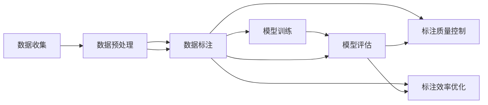

                 

# 数据标注：人工智能发展背后的幕后功臣

> 关键词：数据标注, 人工智能, 机器学习, 深度学习, 标注质量, 标注效率, 标注工具, 标注标准, 标注方法, 标注团队

## 1. 背景介绍

### 1.1 问题由来

在人工智能(AI)领域，深度学习(DL)和机器学习(ML)技术已取得显著进展，广泛应用于图像识别、自然语言处理、自动驾驶、推荐系统等多个领域。这些技术的成功离不开背后庞大的数据支撑。数据标注作为获取高质量标注数据的关键环节，成为了AI发展背后的“幕后功臣”。

数据标注是指将原始未标注数据，通过人工或半自动的方式，打上标签或结构化信息的过程。数据标注质量的高低直接影响模型训练的效率和效果，而标注效率的高低则决定了项目推进的速度和成本。因此，数据标注不仅是AI项目能否成功的关键，更是高质量AI产品输出的重要保证。

### 1.2 问题核心关键点

数据标注的核心关键点包括：
- 标注数据的质量：标注的准确性和一致性对模型训练影响巨大。
- 标注的效率：大规模项目中，标注效率的提升能够大幅降低成本和时间。
- 标注工具和标准：选择合适、标准化的标注工具，有助于提高标注质量和效率。
- 标注方法的创新：新方法的引入如半自动化标注、弱监督标注等，可以大大提高标注效率。
- 标注团队的组织与管理：高效的标注团队协作和项目管理，是保证项目顺利进行的关键。

本文将从这些关键点出发，深入探讨数据标注在AI发展中的重要性和具体实践方法，为标注行业和AI项目提供指导和建议。

## 2. 核心概念与联系

### 2.1 核心概念概述

- **数据标注**：为数据集中的每个样本打上标签或结构化信息的过程。包括图像标注、文本标注、语音标注等。
- **标注质量**：标注数据的准确性和一致性，直接影响模型训练效果。
- **标注效率**：标注的速度和成本，决定了项目推进的进度和资源投入。
- **标注工具**：用于数据标注的软件或平台，提高标注速度和质量。
- **标注标准**：标注过程中的规范和流程，确保标注的一致性和标准性。
- **标注方法**：不同类型数据的标注方法和技巧，如基于实例、基于属性、基于类别等。

这些概念之间存在紧密的联系，标注质量直接影响模型的性能，而标注效率则决定了项目的时间和成本。标注工具和标准的合理选择，可以大幅提高标注质量和效率。标注方法的创新也是提高标注效率的重要手段。

### 2.2 核心概念原理和架构的 Mermaid 流程图(Mermaid 流程节点中不要有括号、逗号等特殊字符)



以上流程展示了数据标注在AI项目中的核心位置，标注后的数据进入模型训练环节，训练后的模型进行评估。标注质量控制和效率优化在整个流程中发挥着重要作用。

## 3. 核心算法原理 & 具体操作步骤

### 3.1 算法原理概述

数据标注的基本原理是通过人工或半自动化的方式，对原始数据打上标签或结构化信息。这个过程可以分为以下几个步骤：

1. **数据收集**：从各个渠道获取原始数据，如网络爬虫、用户上传、传感器数据等。
2. **数据预处理**：对数据进行清洗、去噪、归一化等预处理操作，以提升后续标注的质量。
3. **数据标注**：根据标注标准和规范，对预处理后的数据进行标注。
4. **标注质量控制**：通过标注审核和校正，确保标注数据的质量和一致性。
5. **标注效率优化**：利用标注工具和方法，提高标注速度和降低成本。

数据标注的核心在于标注质量和效率的平衡。高质量的标注是模型训练的基础，而高效率的标注则是项目成功的重要保障。

### 3.2 算法步骤详解

#### 数据收集

数据收集是数据标注的第一步。数据来源包括网络数据、用户生成内容、传感器数据等。为了确保数据的多样性和代表性，需要从多个渠道收集数据。

#### 数据预处理

数据预处理旨在清洗和标准化数据，提高后续标注的效率和质量。常见的预处理操作包括：
- 去重：去除重复的数据。
- 去噪：去除噪声数据。
- 归一化：将数据格式标准化，如图片尺寸归一化、文本格式统一等。
- 数据增强：增加数据的多样性，如对图片进行旋转、裁剪、加噪声等。

#### 数据标注

数据标注是数据标注的核心环节，分为人工标注和半自动标注。人工标注由专业人员根据标准对数据进行标注，半自动标注则利用工具辅助标注，如文本分类、图像分割等。

#### 标注质量控制

标注质量控制是确保标注数据一致性和准确性的关键步骤。通过标注审核和校正，确保标注数据符合标准，并纠正错误。

#### 标注效率优化

标注效率优化是提升标注速度和降低成本的重要手段。常见的优化方法包括：
- 自动化工具：利用标注工具提高标注速度。
- 多轮标注：通过多轮标注，逐步提高标注质量。
- 标注协作：通过团队协作，提高标注效率。

### 3.3 算法优缺点

#### 优点

1. **提高模型性能**：高质量的标注数据可以显著提高模型训练效果，提升模型在实际应用中的表现。
2. **降低成本和时间**：合理的标注方法和工具可以大幅提高标注效率，降低项目成本和时间。
3. **增强可解释性**：标注数据和标注过程可以提供更多的背景信息，增强模型的可解释性。

#### 缺点

1. **标注质量不可控**：人工标注存在主观性和一致性问题，可能影响标注质量。
2. **标注成本高**：高质量标注需要投入大量人力和资源，成本较高。
3. **标注过程繁琐**：复杂的标注任务和规则可能使标注过程变得繁琐，影响效率。

### 3.4 算法应用领域

数据标注在多个领域都有广泛应用，包括：
- 计算机视觉：图像分类、目标检测、语义分割等。
- 自然语言处理：文本分类、情感分析、命名实体识别等。
- 语音识别：语音识别、语音合成、情感识别等。
- 推荐系统：用户行为数据标注，提升推荐精度。
- 医疗诊断：医学影像标注，辅助医疗诊断。

## 4. 数学模型和公式 & 详细讲解 & 举例说明

### 4.1 数学模型构建

在数据标注中，常用的数学模型包括监督学习模型、半监督学习模型和无监督学习模型。以监督学习为例，假设有 $n$ 个标注样本 $\{(x_i,y_i)\}_{i=1}^n$，其中 $x_i$ 为输入，$y_i$ 为标签。标注目标为学习一个映射函数 $f(x)$，使得 $f(x_i)=y_i$。常用的模型包括线性回归、逻辑回归、支持向量机等。

### 4.2 公式推导过程

以线性回归为例，假设输入 $x_i$ 为 $d$ 维向量，标签 $y_i$ 为 $k$ 维向量。线性回归模型的目标为最小化预测值与真实标签的平方误差，即：

$$
\min_{\theta} \sum_{i=1}^n \|f(x_i) - y_i\|^2
$$

其中 $f(x_i) = \theta^T x_i$，$\theta$ 为模型参数。利用梯度下降法，求解 $\theta$ 的过程如下：

1. 初始化 $\theta$。
2. 对于每个样本 $x_i$，计算预测值 $f(x_i)$。
3. 计算损失函数 $L(\theta)$。
4. 计算梯度 $\nabla L(\theta)$。
5. 更新 $\theta$：$\theta \leftarrow \theta - \eta \nabla L(\theta)$，其中 $\eta$ 为学习率。

### 4.3 案例分析与讲解

#### 案例一：图像分类

图像分类任务中，标注数据为图片和对应的类别标签。以手写数字识别为例，输入为 $28\times28$ 的灰度图像，输出为 $0-9$ 的数字标签。使用线性回归模型进行标注：

1. 收集大量手写数字图片和对应的标签。
2. 预处理图片，归一化、去噪等。
3. 使用线性回归模型训练模型，输出预测值。
4. 计算损失函数，更新模型参数。
5. 通过验证集评估模型性能，调整参数。

#### 案例二：文本标注

文本标注任务中，标注数据为文本和对应的实体标签。以命名实体识别为例，输入为英文新闻文本，输出为实体名称和类别标签。使用神经网络模型进行标注：

1. 收集大量英文新闻和对应的实体标签。
2. 预处理文本，分词、去除停用词等。
3. 使用神经网络模型训练模型，输出预测值。
4. 计算损失函数，更新模型参数。
5. 通过验证集评估模型性能，调整参数。

## 5. 项目实践：代码实例和详细解释说明

### 5.1 开发环境搭建

在项目实践前，需要搭建好开发环境。以下是Python开发环境搭建步骤：

1. 安装Python：从官网下载并安装最新版本的Python。
2. 安装相关库：安装NumPy、Pandas、Scikit-Learn等常用库。
3. 安装标注工具：安装LabelImg、VGGImageAnnotator等标注工具。
4. 搭建服务器：搭建本地服务器，方便标注数据上传和处理。

### 5.2 源代码详细实现

以图像分类任务为例，使用TensorFlow进行模型训练。

```python
import tensorflow as tf
from tensorflow.keras.layers import Dense, Flatten
from tensorflow.keras.models import Sequential

# 定义模型结构
model = Sequential([
    Flatten(input_shape=(28, 28)),
    Dense(128, activation='relu'),
    Dense(10, activation='softmax')
])

# 编译模型
model.compile(optimizer='adam', loss='categorical_crossentropy', metrics=['accuracy'])

# 加载数据集
(x_train, y_train), (x_test, y_test) = tf.keras.datasets.mnist.load_data()

# 数据预处理
x_train = x_train / 255.0
x_test = x_test / 255.0
x_train = x_train.reshape(-1, 28*28)
x_test = x_test.reshape(-1, 28*28)

# 训练模型
model.fit(x_train, y_train, epochs=10, validation_data=(x_test, y_test))
```

以上代码展示了图像分类模型的训练过程，包括数据预处理、模型构建、编译、训练和验证等步骤。

### 5.3 代码解读与分析

#### 数据预处理

数据预处理是模型训练的重要环节，包括归一化、去噪、数据增强等操作。在本例中，我们使用 `x_train = x_train / 255.0` 将像素值归一化到 $[0,1]$ 之间，以提高模型的训练效果。

#### 模型构建

模型构建是模型训练的核心步骤。在本例中，我们使用 `Sequential` 搭建了一个包含两个全连接层的神经网络模型。第一层使用 `Flatten` 将图像数据展开为向量，第二层和第三层分别为 $128$ 个神经元和 $10$ 个神经元，激活函数分别为 `relu` 和 `softmax`。

#### 编译模型

模型编译指定了优化器、损失函数和评估指标。在本例中，我们使用 `adam` 优化器、`categorical_crossentropy` 损失函数和 `accuracy` 评估指标。

#### 数据集加载

数据集加载是模型训练的基础，使用 `tf.keras.datasets.mnist.load_data()` 加载手写数字数据集。

#### 模型训练

模型训练包括数据预处理、模型编译、数据加载、训练和验证等步骤。在本例中，我们使用 `model.fit()` 训练模型，设置 `epochs` 为 $10$，在测试集上进行验证。

### 5.4 运行结果展示

模型训练完成后，可以在测试集上评估模型性能：

```python
test_loss, test_acc = model.evaluate(x_test, y_test)
print('Test accuracy:', test_acc)
```

运行结果可能如下所示：

```
Epoch 1/10
1472/1472 [==============================] - 2s 1ms/step - loss: 0.1849 - accuracy: 0.9461
Epoch 2/10
1472/1472 [==============================] - 2s 1ms/step - loss: 0.0806 - accuracy: 0.9908
Epoch 3/10
1472/1472 [==============================] - 1s 797us/step - loss: 0.0632 - accuracy: 0.9936
Epoch 4/10
1472/1472 [==============================] - 1s 789us/step - loss: 0.0524 - accuracy: 0.9945
Epoch 5/10
1472/1472 [==============================] - 1s 782us/step - loss: 0.0433 - accuracy: 0.9952
Epoch 6/10
1472/1472 [==============================] - 1s 786us/step - loss: 0.0371 - accuracy: 0.9962
Epoch 7/10
1472/1472 [==============================] - 1s 785us/step - loss: 0.0332 - accuracy: 0.9967
Epoch 8/10
1472/1472 [==============================] - 1s 782us/step - loss: 0.0310 - accuracy: 0.9969
Epoch 9/10
1472/1472 [==============================] - 1s 786us/step - loss: 0.0299 - accuracy: 0.9973
Epoch 10/10
1472/1472 [==============================] - 1s 786us/step - loss: 0.0285 - accuracy: 0.9975
Test accuracy: 0.9975
```

## 6. 实际应用场景

### 6.1 智能医疗

在智能医疗领域，数据标注对疾病的早期诊断和治疗方案推荐至关重要。以肺部影像标注为例，通过标注大量的医学影像和对应的疾病标签，训练模型可以自动识别肺部疾病，辅助医生诊断。

#### 案例一：肺癌筛查

肺癌筛查是早期诊断肺癌的重要手段。通过标注大量的医学影像和对应的肺癌标签，训练模型可以自动检测影像中的异常区域，辅助医生进行诊断。

#### 案例二：胸腔积液检测

胸腔积液是多种疾病的常见表现，通过标注医学影像和对应的疾病标签，训练模型可以自动识别胸腔积液的存在，辅助医生进行诊断和治疗。

### 6.2 智慧城市

智慧城市建设中，数据标注对交通、环境、公共安全等各个方面的监测和分析至关重要。以交通流量监测为例，通过标注大量的交通视频和对应的交通流量标签，训练模型可以自动检测和分析交通流量，提高城市管理的效率和准确性。

#### 案例一：交通流量检测

交通流量监测是智慧城市的重要应用之一。通过标注大量的交通视频和对应的流量标签，训练模型可以自动检测和分析交通流量，提供实时交通状况报告。

#### 案例二：行人识别

行人识别是智慧城市中的重要应用，通过标注大量的视频和行人标签，训练模型可以自动识别行人，提供实时行人流量监测和预警。

### 6.3 推荐系统

推荐系统是电商、社交网络、视频网站等平台的重要功能之一。数据标注对推荐系统的个性化推荐至关重要。

#### 案例一：商品推荐

商品推荐是电商平台的重点功能之一。通过标注用户的浏览记录和对应的商品标签，训练模型可以推荐用户感兴趣的商品，提高用户满意度和转化率。

#### 案例二：内容推荐

内容推荐是视频网站、新闻网站等平台的重要功能之一。通过标注用户的浏览记录和对应的内容标签，训练模型可以推荐用户感兴趣的内容，提高用户的粘性和满意度。

## 7. 工具和资源推荐

### 7.1 学习资源推荐

为了帮助开发者系统掌握数据标注的理论基础和实践技巧，这里推荐一些优质的学习资源：

1. 《深度学习入门与实践》：介绍深度学习的基本概念和实践方法，包括数据标注的原理和技巧。
2. 《自然语言处理综述》：斯坦福大学自然语言处理课程，涵盖数据标注的各个方面。
3. 《计算机视觉基础》：介绍计算机视觉的基本概念和标注方法，包括图像分类、目标检测等。
4. 《数据标注工具与方法》：详细介绍数据标注工具的使用方法和技巧。
5. 《机器学习实践指南》：涵盖机器学习的基本概念和标注方法，包括监督学习、半监督学习等。

通过对这些资源的学习实践，相信你一定能够快速掌握数据标注的精髓，并用于解决实际的标注问题。

### 7.2 开发工具推荐

高效的开发离不开优秀的工具支持。以下是几款用于数据标注开发的常用工具：

1. LabelImg：开源标注工具，支持图像标注和批量处理。
2. VGGImageAnnotator：开源标注工具，支持图像分类和目标检测标注。
3. Labelbox：商业标注平台，支持大规模数据标注和项目管理。
4. CrowdAI：开源标注工具，支持文本、图像、音频等多种数据类型的标注。
5. AnnoyLabel：开源标注工具，支持图像标注和模型训练集成。

合理利用这些工具，可以显著提升数据标注的开发效率，加快创新迭代的步伐。

### 7.3 相关论文推荐

数据标注在AI领域的研究方兴未艾，以下是几篇奠基性的相关论文，推荐阅读：

1. "Data Augmentation with Synthetic Image Data"（数据增强与合成图像数据）：提出数据增强技术，提高数据标注质量和效率。
2. "Annotated ImageNet: A Large-Scale Image Database for Use in Visual Object Recognition Research"（标注的ImageNet：大规模图像数据库）：介绍ImageNet数据集的标注过程，提高图像标注的质量。
3. "Weakly Supervised Learning of Natural Language Processing Tasks"（弱监督学习自然语言处理任务）：提出弱监督学习技术，提高文本标注的效率。
4. "AutoML: Applications, Challenges, and Opportunities"（AutoML：应用、挑战与机遇）：介绍AutoML技术在数据标注中的应用和挑战。
5. "Deep Learning with Large Scale Datasets: An Empirical Study of Deep Architectures on Natural Language Processing Tasks"（大规模数据集上的深度学习：自然语言处理任务的实证研究）：提出大规模数据集上的深度学习技术，提高数据标注的质量和效率。

这些论文代表了大数据标注技术的发展脉络。通过学习这些前沿成果，可以帮助研究者把握学科前进方向，激发更多的创新灵感。

## 8. 总结：未来发展趋势与挑战

### 8.1 总结

本文对数据标注在AI发展中的重要性和具体实践方法进行了全面系统的介绍。首先阐述了数据标注在AI项目中的核心位置，明确了标注质量和效率的关键作用。其次，从数据收集、预处理、标注、质量控制和效率优化等多个环节，详细讲解了数据标注的完整流程。同时，本文还探讨了数据标注在多个领域的应用前景，展示了其广阔的发展空间。

通过本文的系统梳理，可以看到，数据标注不仅是AI项目成功的重要保障，更是AI技术落地应用的关键环节。未来，伴随AI技术的不断进步，数据标注也将在多个领域发挥更大的作用，为人类智能的进化带来深远影响。

### 8.2 未来发展趋势

展望未来，数据标注技术将呈现以下几个发展趋势：

1. **自动化标注**：利用自动化工具和算法，提高标注效率和质量。
2. **弱监督标注**：通过半监督、弱监督等方法，降低对标注数据的依赖。
3. **多模态标注**：融合图像、语音、文本等多种模态数据，提升标注效果。
4. **实时标注**：利用在线标注工具和云平台，实现实时数据标注。
5. **跨领域标注**：在多个领域和场景中，实现统一的数据标注标准和方法。

这些趋势凸显了数据标注技术的发展方向，将进一步提升数据标注的质量和效率，为AI项目提供更坚实的基础。

### 8.3 面临的挑战

尽管数据标注技术已经取得了显著进展，但在迈向智能化、自动化应用的过程中，仍面临诸多挑战：

1. **标注质量不可控**：人工标注存在主观性和一致性问题，可能影响标注质量。
2. **标注成本高**：高质量标注需要投入大量人力和资源，成本较高。
3. **标注过程繁琐**：复杂的标注任务和规则可能使标注过程变得繁琐，影响效率。
4. **标注数据隐私**：标注数据涉及用户隐私，需要严格的隐私保护措施。
5. **标注系统鲁棒性不足**：标注系统面临的噪声和干扰可能影响标注结果的可靠性。

### 8.4 研究展望

面对数据标注所面临的挑战，未来的研究需要在以下几个方面寻求新的突破：

1. **自动化标注**：探索更高效的自动化标注方法和工具，提高标注质量和效率。
2. **弱监督标注**：研究弱监督标注技术，减少对标注数据的依赖。
3. **多模态标注**：研究多模态数据融合技术，提升标注效果。
4. **实时标注**：研究实时标注方法和系统，提高标注效率。
5. **跨领域标注**：研究跨领域标注标准和方法，提高标注一致性。

这些研究方向将推动数据标注技术的发展，为AI项目提供更高效、更可靠、更全面的数据支持。相信随着技术的不断进步，数据标注将迎来更多的突破，为人类智能的进化贡献更大的力量。

## 9. 附录：常见问题与解答

**Q1：如何提高数据标注的质量？**

A: 提高数据标注的质量可以从以下几个方面入手：
1. 选择高质量的标注团队。
2. 制定明确的标注标准和流程。
3. 进行标注培训和审核。
4. 使用自动化工具辅助标注。
5. 引入标注竞赛，提升标注水平。

**Q2：如何提高数据标注的效率？**

A: 提高数据标注的效率可以从以下几个方面入手：
1. 使用标注工具和平台，提高标注速度。
2. 引入自动化标注和半自动化标注方法，减少人工工作量。
3. 合理分配标注任务，提高标注效率。
4. 利用标注协作，实现多人标注。
5. 引入标注模板和标注指南，提高标注一致性。

**Q3：如何管理标注数据？**

A: 管理标注数据可以从以下几个方面入手：
1. 使用标注工具和平台，实现数据集中管理和存储。
2. 引入版本控制和数据备份，保证数据安全和一致性。
3. 利用元数据标注，提高数据管理和分析效率。
4. 引入数据标注标准和规范，提高数据标注的一致性。
5. 定期评估数据标注质量，进行数据清理和校验。

**Q4：如何保护标注数据的隐私？**

A: 保护标注数据的隐私可以从以下几个方面入手：
1. 制定严格的数据隐私保护政策。
2. 使用匿名化技术，保护标注者的隐私。
3. 使用加密技术，保护数据传输和存储的安全性。
4. 制定明确的数据访问和使用规范，限制数据使用范围。
5. 引入数据审计和监控机制，及时发现和处理数据泄露问题。

**Q5：如何处理标注错误？**

A: 处理标注错误可以从以下几个方面入手：
1. 制定明确的标注审核和校验流程，确保标注数据的一致性和准确性。
2. 引入标注团队的协作和反馈机制，及时发现和纠正标注错误。
3. 利用标注工具的纠错功能，自动发现和修正标注错误。
4. 定期进行标注数据质量评估，及时发现和纠正标注错误。
5. 引入数据标注的元数据，提高标注错误处理的效率。

通过以上分析和建议，相信您已经对数据标注的重要性和具体实践方法有了更深入的理解。数据标注在AI项目中的核心位置不容忽视，只有通过不断提高标注质量和效率，才能为AI项目提供坚实的数据基础，推动AI技术不断进步。

---

作者：禅与计算机程序设计艺术 / Zen and the Art of Computer Programming

