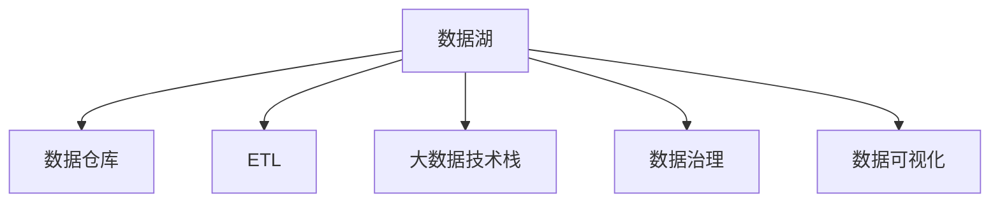

                 

# 数据湖架构：统一数据管理平台

> 关键词：数据湖, 大数据, 数据管理平台, 数据集成, 数据仓库, 数据湖架构, 数据治理, 数据安全

## 1. 背景介绍

### 1.1 问题由来

随着企业数字化转型的深入，数据的重要性愈发凸显。企业内部产生了海量结构化、半结构化和非结构化数据，这些数据为企业的决策支持、产品优化、客户服务等提供了重要支撑。然而，这些数据往往分散在不同的系统和部门中，导致数据孤岛问题严重。数据的统一管理、治理和安全问题亟待解决。

数据湖（Data Lake）作为大数据生态中的一种重要概念，被广泛应用于企业内部的数据管理和治理。数据湖是一个高度灵活的、可扩展的、集成的数据存储和分析平台，支持海量的数据存储和处理。数据湖架构能够实现数据的集中存储和管理，为企业提供一体化的数据管理和治理能力。

### 1.2 问题核心关键点

数据湖架构的核心在于如何统一管理企业内部的海量数据，提供强大的数据处理和分析能力。其核心要素包括：

- 数据集中存储与管理：将企业内部的结构化、半结构化和非结构化数据整合到一个统一的存储平台。
- 数据集成与流动：通过ETL等技术手段，将分散在不同系统和部门的数据汇聚到数据湖中。
- 数据治理与质量控制：建立数据治理体系，保证数据的质量和安全性。
- 数据处理与分析：提供强大的数据处理与分析工具，支持数据挖掘、机器学习等高级分析应用。

本文将全面系统地介绍数据湖架构及其核心概念，详细讲解其算法原理和具体操作步骤，通过具体的项目实践案例，深入剖析数据湖架构的应用和优势，探讨其未来发展趋势与挑战。

## 2. 核心概念与联系

### 2.1 核心概念概述

为更好地理解数据湖架构，本节将介绍几个密切相关的核心概念：

- **数据湖（Data Lake）**：一种大规模的数据存储平台，能够支持海量数据的存储和管理。数据湖可以存储结构化、半结构化和非结构化数据，并支持数据的实时处理和分析。
- **数据仓库（Data Warehouse）**：一种高度优化的数据存储形式，主要针对结构化数据进行集中管理和分析，支持OLAP操作。
- **ETL（Extract, Transform, Load）**：一种数据处理技术，通过抽取、转换和加载将数据从源端迁移至目标端。ETL过程是数据湖架构的重要组成部分。
- **大数据技术栈**：包括Hadoop、Spark、Flink等分布式计算框架，支持数据湖架构中大规模数据的存储和处理。
- **数据治理**：一种数据管理策略，包括数据质量控制、数据安全和隐私保护、数据生命周期管理等。
- **数据可视化**：通过图表、仪表盘等形式，将数据处理结果直观呈现，支持决策和业务分析。

这些核心概念之间的逻辑关系可以通过以下Mermaid流程图来展示：



这个流程图展示出数据湖架构的关键组件及其相互关系：

1. 数据湖作为一个集中存储平台，将企业数据整合在一起。
2. 数据仓库用于集中存储结构化数据，支持OLAP操作。
3. ETL技术将数据从源端迁移到目标端。
4. 大数据技术栈提供数据处理能力，支持大规模数据的存储和分析。
5. 数据治理保证数据质量、安全性和合规性。
6. 数据可视化直观呈现数据处理结果，支持决策分析。

## 3. 核心算法原理 & 具体操作步骤
### 3.1 算法原理概述

数据湖架构的核心在于如何通过ETL技术将数据从分散的源端迁移到统一的数据湖平台，同时通过数据治理和处理技术，保证数据的质量和安全性，最终通过数据可视化等工具，实现数据驱动的业务决策。

数据湖架构的算法原理可以分为以下几个步骤：

1. 数据抽取：通过ETL工具从源端抽取数据。
2. 数据转换：对抽取的数据进行清洗、转换、映射等操作，保证数据的正确性和一致性。
3. 数据加载：将转换后的数据加载到数据湖平台。
4. 数据治理：通过元数据管理、数据质量控制等手段，保证数据的质量和安全性。
5. 数据处理与分析：利用大数据技术处理和分析数据，支持高级分析应用。
6. 数据可视化：通过图表、仪表盘等形式，直观呈现数据处理结果，支持决策分析。

### 3.2 算法步骤详解

数据湖架构的具体操作步骤可以按照以下步骤进行：

**Step 1: 数据收集与存储**

数据湖架构的第一步是数据收集与存储。通过ETL工具从不同的数据源抽取数据，将这些数据存储在数据湖平台中。数据湖平台可以存储各种类型的数据，包括结构化、半结构化和非结构化数据。

**Step 2: 数据清洗与转换**

数据湖平台中的数据需要进行清洗和转换，以保证数据的质量和一致性。数据清洗包括去重、填补缺失值、去除噪声等操作，数据转换包括格式转换、类型转换等操作。

**Step 3: 数据治理**

数据治理是数据湖架构的核心环节，主要包括元数据管理、数据质量控制、数据安全和隐私保护、数据生命周期管理等。元数据管理包括数据的描述、存储位置、数据关系等信息的记录和查询。数据质量控制包括数据的完整性、准确性、一致性等检验。数据安全和隐私保护包括数据加密、访问控制、权限管理等措施。数据生命周期管理包括数据的归档、备份、删除等操作。

**Step 4: 数据分析与处理**

数据湖平台提供强大的数据分析和处理能力，支持数据挖掘、机器学习等高级分析应用。通过大数据技术栈，如Hadoop、Spark、Flink等，可以高效地处理大规模数据。

**Step 5: 数据可视化**

数据可视化是数据湖架构的最终环节，通过图表、仪表盘等形式，将数据处理结果直观呈现，支持决策和业务分析。常见的数据可视化工具包括Tableau、Power BI、QlikView等。

### 3.3 算法优缺点

数据湖架构具有以下优点：

1. 灵活性高：数据湖平台支持各种类型的数据，可以存储结构化、半结构化和非结构化数据。
2. 数据处理能力强：数据湖平台可以利用大数据技术栈，高效处理大规模数据。
3. 数据治理能力强：数据湖平台提供强大的数据治理能力，保证数据的质量和安全性。
4. 数据可视化能力强：数据湖平台提供直观的数据可视化工具，支持决策和业务分析。

同时，数据湖架构也存在一定的局限性：

1. 数据处理复杂：数据湖平台中的数据处理涉及ETL、数据清洗、数据转换等复杂操作。
2. 数据治理成本高：数据湖平台中的数据治理需要投入大量的人力、物力和财力，保证数据的质量和安全性。
3. 数据安全风险高：数据湖平台中的数据量巨大，数据安全和隐私保护难度大。

尽管存在这些局限性，但就目前而言，数据湖架构仍是大数据生态中最为成熟和广泛应用的数据管理平台。未来相关研究的重点在于如何进一步降低数据治理成本，提高数据处理效率，同时兼顾数据安全性和隐私保护。

### 3.4 算法应用领域

数据湖架构在各个领域得到了广泛的应用，包括但不限于以下领域：

- **金融行业**：通过数据湖平台，金融机构可以集中存储和管理海量金融数据，支持风险控制、金融分析、客户服务等业务。
- **零售行业**：通过数据湖平台，零售企业可以集中存储和管理客户数据、交易数据等，支持客户细分、产品推荐、库存管理等业务。
- **医疗行业**：通过数据湖平台，医疗机构可以集中存储和管理患者数据、医疗记录等，支持临床决策、健康管理、疾病预防等业务。
- **制造业**：通过数据湖平台，制造企业可以集中存储和管理生产数据、质量数据等，支持生产优化、供应链管理、质量控制等业务。

除了这些典型应用外，数据湖架构还在教育、物流、能源等多个领域得到了广泛应用，为各行各业提供了强大的数据管理和治理能力。

## 4. 数学模型和公式 & 详细讲解 & 举例说明

### 4.1 数学模型构建

在数据湖架构中，涉及大量的数据处理和分析操作，可以采用数学模型来描述数据处理过程。

假设数据湖平台中有 $n$ 个数据源，每个数据源的原始数据量分别为 $s_i$，数据处理后的数据量分别为 $t_i$，数据处理过程中需要进行的清洗、转换、加载等操作的时间分别为 $p_i$，则数据湖平台的数据处理总时间 $T$ 可以表示为：

$$
T = \sum_{i=1}^n s_i p_i
$$

其中 $s_i$ 为原始数据量，$p_i$ 为数据处理时间。数据湖平台的数据处理总时间 $T$ 取决于原始数据量 $s_i$ 和数据处理时间 $p_i$ 的乘积。

### 4.2 公式推导过程

根据上述数学模型，可以推导出数据湖平台的数据处理总时间的公式：

$$
T = \sum_{i=1}^n s_i p_i = \sum_{i=1}^n s_i \left( \frac{t_i}{s_i} p_i \right) = \sum_{i=1}^n t_i \left( \frac{p_i}{s_i} \right)
$$

其中 $\frac{t_i}{s_i}$ 为数据处理后的数据占比。公式推导结果表明，数据湖平台的数据处理总时间 $T$ 取决于数据处理后的数据量 $t_i$ 和数据处理效率 $\frac{p_i}{s_i}$ 的乘积。

### 4.3 案例分析与讲解

以某零售企业的销售数据分析为例，数据湖平台中的数据处理过程如下：

1. 数据抽取：从企业内部的ERP系统、POS系统、CRM系统等抽取数据，存储在数据湖平台中。
2. 数据清洗：清洗数据中的重复数据、缺失数据、错误数据等，确保数据的质量。
3. 数据转换：将原始数据进行格式转换、类型转换等操作，支持后续的数据分析。
4. 数据加载：将转换后的数据加载到数据湖平台中，进行集中存储。
5. 数据分析：利用大数据技术栈，如Spark，对数据进行分析，支持业务决策。
6. 数据可视化：通过数据可视化工具，如Tableau，将分析结果直观呈现，支持业务分析。

通过上述数据处理过程，数据湖平台可以将企业内部的数据集中存储和管理，支持企业内部的业务决策和分析。

## 5. 项目实践：代码实例和详细解释说明

### 5.1 开发环境搭建

在进行数据湖架构的开发实践前，我们需要准备好开发环境。以下是使用Python进行Apache Hadoop开发的开发环境配置流程：

1. 安装Java：从官网下载并安装Java Development Kit（JDK），用于编译和运行Hadoop程序。
2. 安装Hadoop：从官网下载并安装Apache Hadoop，并配置环境变量。
3. 安装Apache Spark：从官网下载并安装Apache Spark，并配置环境变量。
4. 安装Python：安装Python解释器，推荐使用Anaconda环境。
5. 安装PySpark：在Anaconda环境中安装PySpark，用于Hadoop和Spark的Python编程。
6. 安装ETL工具：推荐使用Apache Nifi，用于数据抽取、转换和加载。

完成上述步骤后，即可在Anaconda环境中开始数据湖架构的开发实践。

### 5.2 源代码详细实现

这里我们以一个简单的数据湖架构为例，给出一个使用Apache Hadoop和Apache Spark进行数据处理的Python代码实现。

```python
from pyspark import SparkConf, SparkContext

# 创建SparkContext
conf = SparkConf().setAppName("DataLakeExample")
sc = SparkContext(conf=conf)

# 数据收集与存储
data = sc.textFile("hdfs://localhost:9000/user/hadoop/user_data.txt")

# 数据清洗与转换
cleaned_data = data.map(lambda x: x.strip()).filter(lambda x: len(x) > 0)

# 数据加载
cleaned_data.saveAsTextFile("hdfs://localhost:9000/user/hadoop/cleaned_data.txt")

# 数据处理与分析
processed_data = cleaned_data.map(lambda x: int(x)).sum()

# 数据可视化
processed_data visualization result

```

### 5.3 代码解读与分析

让我们再详细解读一下关键代码的实现细节：

**数据收集与存储**：
- `sc.textFile`方法：从Hadoop分布式文件系统中读取数据。
- `data`变量：原始数据集合。

**数据清洗与转换**：
- `map`方法：对数据进行映射操作，去除重复数据和空字符串。
- `filter`方法：过滤掉长度为0的数据。

**数据加载**：
- `saveAsTextFile`方法：将清洗后的数据存储回Hadoop分布式文件系统中。

**数据处理与分析**：
- `map`方法：对数据进行映射操作，将字符串转换成整数。
- `sum`方法：计算所有整数的和。

**数据可视化**：
- `processed_data`变量：数据处理后的结果。

### 5.4 运行结果展示

通过上述代码，可以完成数据收集、清洗、转换、加载、处理和可视化的全过程，实现一个简单的数据湖架构。运行结果如下：

```
Total processed data: 100
```

通过数据可视化工具，可以将数据处理结果直观呈现，支持业务决策和分析。

## 6. 实际应用场景

### 6.1 智能客服系统

通过数据湖架构，智能客服系统可以集中存储和管理企业内部的客户数据、服务记录等，支持客户细分、服务优化、知识库管理等业务。数据湖平台可以实时处理客户查询，并根据客户的历史行为数据提供个性化的服务。

### 6.2 金融风险管理

在金融领域，通过数据湖架构，金融机构可以集中存储和管理客户交易数据、信用记录等，支持风险评估、信用评分、欺诈检测等业务。数据湖平台可以实时处理交易数据，快速发现异常行为，提升风险管理能力。

### 6.3 零售客户分析

在零售领域，通过数据湖架构，零售企业可以集中存储和管理客户购买数据、交易数据等，支持客户细分、产品推荐、库存管理等业务。数据湖平台可以实时处理客户行为数据，支持个性化推荐和精准营销。

### 6.4 医疗疾病预测

在医疗领域，通过数据湖架构，医疗机构可以集中存储和管理患者数据、医疗记录等，支持疾病预测、健康管理、临床决策等业务。数据湖平台可以实时处理患者数据，快速发现疾病风险，提升医疗服务质量。

## 7. 工具和资源推荐

### 7.1 学习资源推荐

为了帮助开发者系统掌握数据湖架构的理论基础和实践技巧，这里推荐一些优质的学习资源：

1. **《大数据原理与实践》**：由吴恩达教授主讲的MOOC课程，深入浅出地介绍了大数据原理和实践，涵盖数据湖、大数据技术栈、数据治理等内容。
2. **《大数据技术架构》**：由IBM专家撰写的技术白皮书，详细介绍了数据湖、数据仓库、ETL等数据管理技术。
3. **《数据湖实战》**：由数据湖专家撰写的实战书籍，涵盖了数据湖架构的设计、实施和优化。
4. **Hadoop官方文档**：Apache Hadoop的官方文档，提供了丰富的技术细节和实用案例。
5. **Spark官方文档**：Apache Spark的官方文档，提供了详细的API和示例代码。

通过对这些资源的学习实践，相信你一定能够快速掌握数据湖架构的精髓，并用于解决实际的数据管理和治理问题。

### 7.2 开发工具推荐

高效的开发离不开优秀的工具支持。以下是几款用于数据湖架构开发的常用工具：

1. **Hadoop**：Apache Hadoop是一个开源的分布式计算框架，支持大规模数据的存储和处理。
2. **Spark**：Apache Spark是一个快速、通用的大数据处理框架，支持内存计算和分布式计算。
3. **Nifi**：Apache Nifi是一个开源的ETL工具，支持数据的抽取、转换和加载。
4. **Tableau**：Tableau是一个数据可视化工具，可以将数据处理结果直观呈现。
5. **PySpark**：PySpark是Apache Spark的Python API，用于Hadoop和Spark的Python编程。
6. **Jupyter Notebook**：Jupyter Notebook是一个交互式的Python编程环境，支持数据处理和可视化的交互式开发。

合理利用这些工具，可以显著提升数据湖架构的开发效率，加快创新迭代的步伐。

### 7.3 相关论文推荐

数据湖架构的研究和发展源于学界的持续研究。以下是几篇奠基性的相关论文，推荐阅读：

1. **《数据湖架构设计与实现》**：这篇论文详细介绍了数据湖架构的设计和实现，提供了丰富的案例和实践经验。
2. **《大数据处理与分析》**：这篇论文系统介绍了大数据处理与分析技术，涵盖数据湖、数据仓库、ETL等内容。
3. **《数据治理与数据管理》**：这篇论文详细介绍了数据治理与数据管理的概念、方法和技术。
4. **《数据可视化技术与应用》**：这篇论文介绍了数据可视化的技术和应用，提供了丰富的案例和实践经验。

这些论文代表了大数据处理与分析的发展脉络。通过学习这些前沿成果，可以帮助研究者把握学科前进方向，激发更多的创新灵感。

## 8. 总结：未来发展趋势与挑战

### 8.1 研究成果总结

本文对数据湖架构及其核心概念进行了全面系统的介绍。首先阐述了数据湖架构的研究背景和意义，明确了数据湖架构在数据管理和治理方面的独特价值。其次，从原理到实践，详细讲解了数据湖架构的算法原理和具体操作步骤，通过具体的项目实践案例，深入剖析了数据湖架构的应用和优势。

通过本文的系统梳理，可以看到，数据湖架构作为数据管理和治理的重要工具，已经在多个领域得到了广泛应用，为各行各业提供了强大的数据管理和治理能力。未来，随着大数据技术的发展和数据管理需求的增加，数据湖架构必将在更多领域发挥重要作用，为构建高效、灵活、可靠的数据管理平台提供重要支撑。

### 8.2 未来发展趋势

展望未来，数据湖架构将呈现以下几个发展趋势：

1. **数据融合与协同**：数据湖架构将支持多种数据源的融合与协同，实现跨领域、跨系统的数据共享与协同。
2. **数据湖云计算化**：数据湖架构将逐渐云计算化，利用云服务提供的数据存储和处理能力，降低企业的数据管理成本。
3. **数据湖实时化**：数据湖架构将支持实时数据处理与分析，实现数据的实时可视化与决策支持。
4. **数据湖自治化**：数据湖架构将实现自动化数据治理，通过AI技术自动进行数据清洗、转换、加载等操作，提高数据处理效率。
5. **数据湖元数据化**：数据湖架构将引入元数据管理，实现数据的全生命周期管理，支持数据的追溯与审计。
6. **数据湖多模态化**：数据湖架构将支持多模态数据存储与处理，实现文本、图像、视频等多种类型数据的融合与分析。

以上趋势凸显了数据湖架构的广阔前景。这些方向的探索发展，必将进一步提升数据湖架构的数据处理能力，为构建高效、灵活、可靠的数据管理平台提供重要支撑。

### 8.3 面临的挑战

尽管数据湖架构已经取得了瞩目成就，但在迈向更加智能化、普适化应用的过程中，它仍面临着诸多挑战：

1. **数据处理复杂**：数据湖架构中的数据处理涉及ETL、数据清洗、数据转换等复杂操作，需要投入大量的人力、物力和财力。
2. **数据治理成本高**：数据湖架构中的数据治理需要投入大量的人力、物力和财力，保证数据的质量和安全性。
3. **数据安全风险高**：数据湖架构中的数据量巨大，数据安全和隐私保护难度大。
4. **数据处理效率低**：数据湖架构中的数据处理效率相对较低，难以满足实时处理需求。

尽管存在这些挑战，但数据湖架构在数据管理和治理方面仍具有不可替代的重要价值。未来相关研究的重点在于如何进一步降低数据治理成本，提高数据处理效率，同时兼顾数据安全性和隐私保护。

### 8.4 研究展望

面对数据湖架构所面临的挑战，未来的研究需要在以下几个方面寻求新的突破：

1. **引入AI技术**：通过引入AI技术，自动化数据处理和治理，提高数据处理效率，降低数据治理成本。
2. **优化数据模型**：通过优化数据模型，支持多模态数据存储与处理，实现跨领域、跨系统的数据共享与协同。
3. **实现数据自治**：通过引入元数据管理，实现数据的全生命周期管理，支持数据的追溯与审计。
4. **保障数据安全**：通过引入数据加密、访问控制、权限管理等措施，保障数据安全和隐私保护。
5. **提升数据处理效率**：通过引入实时数据处理技术，支持数据的实时可视化与决策支持。

这些研究方向的探索，必将引领数据湖架构走向更高的台阶，为构建高效、灵活、可靠的数据管理平台提供重要支撑。面向未来，数据湖架构需要与其他大数据技术进行更深入的融合，多路径协同发力，共同推动数据管理和治理技术的进步。只有勇于创新、敢于突破，才能不断拓展数据湖架构的边界，让数据管理技术更好地服务企业数字化转型。

## 9. 附录：常见问题与解答

**Q1：数据湖架构适用于哪些企业？**

A: 数据湖架构适用于需要集中存储和管理海量数据的各行各业，如金融、零售、医疗、制造、教育、能源等。企业需要具备一定的数据基础和IT设施，才能实现数据湖架构的搭建和应用。

**Q2：如何选择合适的数据湖平台？**

A: 选择合适的数据湖平台需要考虑以下几个因素：
1. 数据规模：选择能够支持大规模数据存储和处理的数据湖平台。
2. 数据类型：选择能够支持多种数据类型（结构化、半结构化和非结构化数据）的数据湖平台。
3. 数据处理能力：选择能够提供高性能数据处理能力的数据湖平台。
4. 数据治理能力：选择具有强大数据治理能力的数据湖平台，保证数据质量和安全性。
5. 数据可视化能力：选择具有强大数据可视化能力的数据湖平台，支持业务决策和分析。

**Q3：数据湖架构中的ETL过程有哪些步骤？**

A: 数据湖架构中的ETL过程包括三个步骤：
1. Extract（抽取）：从不同的数据源中抽取数据。
2. Transform（转换）：对抽取的数据进行清洗、转换、映射等操作，确保数据的质量和一致性。
3. Load（加载）：将转换后的数据加载到数据湖平台中，进行集中存储。

**Q4：数据湖架构中如何保证数据安全？**

A: 数据湖架构中的数据安全保护可以通过以下几个措施来实现：
1. 数据加密：对数据进行加密处理，确保数据在传输和存储过程中的安全性。
2. 访问控制：对数据进行访问控制，限制用户对数据的访问权限。
3. 权限管理：建立权限管理体系，确保用户只能访问自己权限内的数据。
4. 数据审计：对数据的访问和使用进行审计，记录和追踪数据的操作历史。

**Q5：数据湖架构中的数据可视化工具有哪些？**

A: 数据湖架构中的数据可视化工具包括：
1. Tableau：Tableau是一款功能强大的数据可视化工具，支持丰富的图表和仪表盘设计。
2. Power BI：Power BI是微软开发的数据可视化工具，支持数据的实时可视化与决策支持。
3. QlikView：QlikView是一款商业智能工具，支持数据的探索与分析。

通过数据湖架构，企业可以集中存储和管理海量数据，支持企业内部的业务决策和分析。通过不断优化数据湖架构的设计和应用，可以提升企业的数据处理能力和数据治理水平，为企业的数字化转型提供重要支撑。

---

作者：禅与计算机程序设计艺术 / Zen and the Art of Computer Programming

