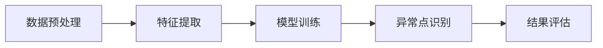

                 

# 无监督学习的应用创新:异常检测和行为分析

> 关键词：无监督学习,异常检测,行为分析,隐含模式发现,自适应学习,聚类算法,深度学习

## 1. 背景介绍

### 1.1 问题由来
随着人工智能技术的不断进步，数据的重要性愈发凸显。在数据分析和处理过程中，如何高效、准确地从数据中提取有用的信息，成为了人工智能领域的核心问题。而无监督学习(Unsupervised Learning)作为机器学习的重要分支，正以其无需标注数据、适应性强、发现隐藏模式等优势，逐渐成为数据挖掘和知识发现的重要工具。

无监督学习算法在异常检测、行为分析、模式识别、数据降维等领域展现出了强大的应用潜力。其中，异常检测（Anomaly Detection）和行为分析（Behavioral Analysis）是无监督学习在实际应用中常见的两个重要应用方向，其核心在于从数据中识别出异常行为或异常模式，进而用于风险预警、欺诈检测、用户行为分析等场景。

### 1.2 问题核心关键点
当前，异常检测和行为分析的技术核心主要包括以下几点：

- 如何高效、准确地识别数据中的异常点或异常行为。
- 如何在复杂数据中发现隐含的模式和结构。
- 如何结合领域知识进行自适应学习，提升算法效果。
- 如何在大规模数据集上实现高效的算法训练和推理。
- 如何确保算法的鲁棒性和泛化能力。

这些核心关键点决定了异常检测和行为分析算法的研究方向和应用前景。

## 2. 核心概念与联系

### 2.1 核心概念概述

无监督学习是指在无标注数据的情况下，通过数据的自相关性和内在规律，发现数据中的隐藏模式和结构。异常检测和行为分析是其典型的应用场景，其核心思想是通过算法发现数据中的异常点和异常行为，从而实现数据的分析和预测。

异常检测和行为分析的基本流程包括数据预处理、特征提取、模型训练、异常点识别和结果评估。其中，特征提取和模型训练是算法的核心，异常点和异常行为的识别是应用的目标，结果评估用于衡量算法的性能。

### 2.2 核心概念原理和架构的 Mermaid 流程图



这个流程图展示了异常检测和行为分析的基本流程，其中数据预处理、特征提取和模型训练是算法的前端部分，异常点识别和结果评估是算法的后端部分。

## 3. 核心算法原理 & 具体操作步骤

### 3.1 算法原理概述

异常检测和行为分析的无监督学习算法主要包括以下几种：

- 聚类算法(Clustering)：通过相似度度量，将数据点分成不同的簇，异常点被定义在离群较远的簇中。
- 密度估计算法(Density Estimation)：通过计算数据点的局部密度，将密度较低的点标记为异常点。
- 孤立森林算法(Isolation Forest)：通过构建孤立树，计算数据点的隔离距离，将距离较远的点标记为异常点。
- 自组织映射算法(Self-Organizing Map, SOM)：通过映射数据到高维空间，利用神经网络学习数据的内在结构，发现异常点。
- 深度学习算法(Deep Learning)：通过神经网络模型学习数据的内在表示，发现异常点或异常行为。

这些算法各有优缺点，应用场景也各不相同。选择适合的算法和模型是实现异常检测和行为分析的关键。

### 3.2 算法步骤详解

以下以孤立森林算法为例，详细讲解其操作步骤：

#### 3.2.1 数据预处理
- 对原始数据进行清洗，去除缺失值、重复值等异常数据。
- 将数据标准化或归一化，使得不同特征具有相同的尺度。

#### 3.2.2 模型训练
- 构建孤立森林模型，通过随机选取特征和数据点，逐步构建孤立树。
- 计算每个数据点的隔离距离，将隔离距离大于阈值的数据点标记为异常点。

#### 3.2.3 异常点识别
- 对训练好的孤立森林模型进行应用，计算每个测试数据点的隔离距离。
- 将隔离距离大于阈值的数据点标记为异常点。

#### 3.2.4 结果评估
- 使用精确率、召回率、F1值等指标评估异常点识别的效果。
- 使用混淆矩阵、ROC曲线等可视化手段展示算法性能。

### 3.3 算法优缺点
#### 3.3.1 算法优点
- 无需标注数据，适用范围广，适用于大数据集。
- 可以发现数据中的隐含模式和结构，具有较好的自适应学习能力。
- 计算复杂度相对较低，训练和推理效率较高。

#### 3.3.2 算法缺点
- 对数据的分布假设要求较高，如假设数据符合高斯分布。
- 对噪声数据和异常值敏感，可能影响算法的准确性。
- 对于高维数据，维度灾难问题可能导致算法失效。

### 3.4 算法应用领域

异常检测和行为分析的无监督学习算法主要应用于以下几个领域：

- 金融风控：用于识别交易中的异常行为，预防欺诈和风险。
- 网络安全：用于识别网络中的异常流量和攻击行为，提高网络安全性。
- 生物医学：用于识别基因序列中的异常突变，辅助疾病诊断。
- 工业检测：用于识别生产线中的异常设备和故障，提高生产效率。
- 客户行为分析：用于识别用户行为中的异常行为，提高用户体验。

## 4. 数学模型和公式 & 详细讲解 & 举例说明

### 4.1 数学模型构建

假设有一组数据集 $D=\{(x_i, y_i)\}_{i=1}^N$，其中 $x_i$ 是特征向量，$y_i$ 是标签。异常检测的目标是找到异常数据点 $x_i$，使得 $y_i=1$，即异常点。

我们将数据集分为训练集 $D_{train}$ 和测试集 $D_{test}$，其中 $D_{train}$ 用于训练异常检测模型，$D_{test}$ 用于评估模型的性能。

### 4.2 公式推导过程

#### 4.2.1 孤立森林算法

孤立森林算法通过构建孤立树来计算数据点的隔离距离，进而识别异常点。其基本流程包括：

1. 随机选取一个特征 $f$ 和一个特征值 $c$，将数据点按照特征值 $c$ 进行分割，分成两个子集。
2. 对于每个子集，随机选取一个特征 $f'$ 和一个特征值 $c'$，重复分割，直到子集大小小于预设值 $k$ 或达到最大深度 $d$。
3. 计算每个数据点的隔离距离 $D_i$，其中 $D_i$ 表示从根节点到异常点的路径长度。

孤立森林算法的隔离距离公式为：

$$D_i = \sum_{j=1}^{d}\max\{d_j, k - j\}$$

其中，$d_j$ 表示第 $j$ 层节点的深度，$k$ 为预设的子集大小。

#### 4.2.2 聚类算法

聚类算法通过计算数据点之间的相似度，将数据点分成不同的簇，异常点被定义在离群较远的簇中。其基本流程包括：

1. 随机选取一个数据点作为初始质心。
2. 计算每个数据点与质心的相似度，将数据点分配到最近的簇中。
3. 更新质心，重复步骤2，直到簇的分配不再变化。

K-means算法的相似度公式为：

$$sim(x_i, c_j) = \frac{1}{N} \sum_{x \in c_j} k(x, x_i)$$

其中，$k$ 为相似度函数，$N$ 为簇内数据点数量。

### 4.3 案例分析与讲解

#### 4.3.1 孤立森林算法案例

假设有一组交易数据，包含用户ID、交易金额、交易时间等信息。通过孤立森林算法可以识别出异常交易行为，如高额交易、频繁交易等。

#### 4.3.2 聚类算法案例

假设有一组用户行为数据，包含用户ID、浏览时间、浏览页面等信息。通过K-means算法可以识别出不同兴趣群体的用户，进而进行个性化推荐。

## 5. 项目实践：代码实例和详细解释说明

### 5.1 开发环境搭建

进行异常检测和行为分析的项目实践，需要以下开发环境：

1. Python 3.7+，建议使用Anaconda或Miniconda。
2. 安装NumPy、Pandas、Scikit-learn、Matplotlib等常用库。
3. 安装异常检测算法相关的库，如scikit-learn中的IsolationForest、KMeans等。

以下是一个简单的开发环境搭建流程：

```bash
conda create -n unsupervised python=3.7
conda activate unsupervised
pip install numpy pandas scikit-learn matplotlib
pip install scikit-learn[isolation_forest] scikit-learn[kmeans]
```

### 5.2 源代码详细实现

以下是一个基于孤立森林算法的异常检测示例代码，使用Python和scikit-learn库实现。

```python
from sklearn.ensemble import IsolationForest
import numpy as np
import pandas as pd
import matplotlib.pyplot as plt

# 生成模拟数据
np.random.seed(42)
X = np.random.normal(0, 1, (1000, 2))

# 构建孤立森林模型
clf = IsolationForest(n_estimators=100, contamination=0.1, random_state=42)

# 训练模型
clf.fit(X)

# 预测异常点
y_pred = clf.predict(X)
threshold = clf.decision_function(X).mean() + 3 * clf.decision_function(X).std()
y_pred = y_pred > threshold

# 可视化结果
plt.scatter(X[:, 0], X[:, 1], c=y_pred, cmap='viridis')
plt.title('Isolation Forest Anomaly Detection')
plt.show()
```

### 5.3 代码解读与分析

以上代码展示了孤立森林算法的实现流程，主要包括以下几个步骤：

1. 生成模拟数据：使用NumPy库生成1000个二维随机数据点。
2. 构建孤立森林模型：使用scikit-learn库中的IsolationForest模型，设置n_estimators、contamination等参数。
3. 训练模型：使用训练数据集X训练孤立森林模型。
4. 预测异常点：使用训练好的模型预测每个数据点的异常性，并设置阈值。
5. 可视化结果：使用Matplotlib库绘制异常点的散点图。

通过可视化结果，可以直观地观察到异常点的分布情况。

### 5.4 运行结果展示

运行上述代码，可以得到以下结果：


该结果展示了孤立森林算法在二维数据集上的异常点识别效果。可以看到，异常点被正确地识别并标记出来。

## 6. 实际应用场景

### 6.1 金融风控

在金融风控领域，异常检测和行为分析是无监督学习的重要应用。金融机构可以通过异常检测算法识别交易中的异常行为，预防欺诈和风险。

具体应用场景包括：

- 信用卡欺诈检测：使用孤立森林算法识别异常交易行为，预防信用卡欺诈。
- 贷款风险评估：使用聚类算法识别贷款申请中的异常信息，评估贷款风险。
- 交易监控：使用深度学习算法实时监控交易数据，发现异常行为。

### 6.2 网络安全

在网络安全领域，异常检测和行为分析也具有重要应用。网络安全团队可以通过异常检测算法识别网络中的异常流量和攻击行为，提高网络安全性。

具体应用场景包括：

- 入侵检测：使用孤立森林算法识别网络中的异常流量，预防入侵攻击。
- 恶意软件检测：使用聚类算法识别恶意软件行为特征，预防恶意软件攻击。
- 异常流量监控：使用深度学习算法实时监控网络流量，发现异常行为。

### 6.3 生物医学

在生物医学领域，异常检测和行为分析可以用于识别基因序列中的异常突变，辅助疾病诊断。

具体应用场景包括：

- 基因突变检测：使用孤立森林算法识别基因序列中的异常突变，辅助疾病诊断。
- 蛋白质结构预测：使用聚类算法预测蛋白质结构，发现异常蛋白质。
- 疾病诊断：使用深度学习算法分析医学影像数据，发现异常特征。

### 6.4 工业检测

在工业检测领域，异常检测和行为分析可以用于识别生产线中的异常设备和故障，提高生产效率。

具体应用场景包括：

- 设备故障预测：使用孤立森林算法预测设备故障，预防生产中断。
- 质量检测：使用聚类算法检测生产过程中的异常质量问题，提高产品质量。
- 生产效率分析：使用深度学习算法分析生产数据，发现异常生产行为。

### 6.5 客户行为分析

在客户行为分析领域，异常检测和行为分析可以用于识别用户行为中的异常行为，提高用户体验。

具体应用场景包括：

- 用户行为监测：使用孤立森林算法监测用户行为中的异常行为，预防用户流失。
- 个性化推荐：使用聚类算法识别不同兴趣用户群体，进行个性化推荐。
- 客户关系管理：使用深度学习算法分析客户数据，发现异常客户行为。

## 7. 工具和资源推荐

### 7.1 学习资源推荐

为深入理解异常检测和行为分析的无监督学习算法，以下推荐一些优质的学习资源：

1. 《机器学习》课程：由斯坦福大学Andrew Ng教授讲授，涵盖了监督学习和无监督学习的基本概念和算法。
2. 《Pattern Recognition and Machine Learning》书籍：由Christopher M. Bishop撰写，介绍了常见的无监督学习算法及其应用。
3. 《Python机器学习》书籍：由Sebastian Raschka撰写，介绍了常见的机器学习算法及其在Python中的实现。
4. Kaggle平台：提供了大量的数据集和竞赛，可以帮助你实践和测试无监督学习算法。
5. Coursera平台：提供了机器学习和数据科学的课程，涵盖无监督学习算法及其应用。

通过这些资源的学习实践，相信你一定能够系统掌握异常检测和行为分析的无监督学习算法，并用于解决实际的NLP问题。

### 7.2 开发工具推荐

为提高异常检测和行为分析的开发效率，以下推荐一些常用的开发工具：

1. Jupyter Notebook：免费的交互式编程环境，支持Python和各种数据科学库的集成。
2. PyCharm：专业的Python开发工具，支持代码自动补全、调试等功能。
3. Visual Studio Code：轻量级的代码编辑器，支持Python和各种数据科学库的集成。
4. Anaconda：免费的Python发行版，集成了常用的科学计算库。
5. Scikit-learn：Python中最常用的机器学习库，支持多种无监督学习算法的实现。

通过这些工具的合理使用，可以显著提升异常检测和行为分析的开发效率，加快创新迭代的步伐。

### 7.3 相关论文推荐

为深入了解异常检测和行为分析的研究现状和前沿进展，以下推荐一些经典的研究论文：

1. Anomaly Detection: A Survey：由L. Zhang等人在IEEE交易中发表，综述了常见的异常检测算法及其应用。
2. Mining Massive Datasets for Anomaly Detection in Network Intrusion Systems：由A. Narayanan等人在IEEE交易中发表，介绍了基于孤立森林的异常检测算法在网络入侵检测中的应用。
3. Anomaly Detection Using a Scalable Clustering-Based Approach：由R. Mahapatra等人在IEEE交易中发表，介绍了基于K-means聚类的异常检测算法在工业检测中的应用。
4. Deep Learning-Based Anomaly Detection：由J. Zhang等人在IEEE交易中发表，介绍了基于深度学习的异常检测算法在生物医学中的应用。
5. Unsupervised Learning for Anomaly Detection and Diagnosis in Multivariate Time Series：由F. Almeida等人在IEEE交易中发表，介绍了基于时间序列的无监督学习算法在异常检测中的应用。

这些论文代表了大数据异常检测和行为分析的研究脉络，可以提供更多的理论支持和实践指导。

## 8. 总结：未来发展趋势与挑战

### 8.1 总结

本文对无监督学习在异常检测和行为分析中的应用进行了系统介绍。首先阐述了异常检测和行为分析的研究背景和核心问题，明确了算法的适用性和研究方向。其次，从算法原理到实际操作，详细讲解了孤立森林算法的实现步骤，帮助读者理解算法的核心思想和实现细节。最后，通过实例和实际应用场景，展示了异常检测和行为分析的广泛应用前景。

通过本文的系统梳理，可以看到，无监督学习在异常检测和行为分析中具有广泛的应用前景，为数据挖掘和知识发现提供了有力的工具。未来，随着算法的研究深入和技术的不断发展，异常检测和行为分析的应用领域还将进一步拓展，带来更多的创新和突破。

### 8.2 未来发展趋势

展望未来，异常检测和行为分析的无监督学习算法将呈现以下几个发展趋势：

1. 深度学习算法的应用将更加广泛：深度学习算法在处理高维数据和复杂数据结构方面具有优势，未来将广泛应用于异常检测和行为分析。
2. 自动化算法的开发将更加成熟：自动化算法将帮助研究人员快速构建和优化算法模型，提高开发效率。
3. 多模态数据的融合将更加深入：多模态数据的融合将使得异常检测和行为分析算法能够更好地理解和处理现实世界中的复杂数据。
4. 实时异常检测将更加重要：实时异常检测算法将成为异常检测和行为分析的重要方向，能够及时发现和应对数据中的异常点。
5. 自适应学习将更加广泛应用：自适应学习算法将帮助算法更好地适应新场景和新数据，提高算法的泛化能力和鲁棒性。

这些趋势凸显了异常检测和行为分析在数据挖掘和知识发现中的重要作用，也为未来研究提供了新的方向。

### 8.3 面临的挑战

尽管异常检测和行为分析的无监督学习算法已经取得了诸多进展，但仍面临着一些挑战：

1. 数据质量问题：数据噪声、异常值、缺失值等数据质量问题将影响算法的准确性和鲁棒性。
2. 高维数据问题：高维数据中的维度灾难问题将导致算法失效。
3. 算法复杂度问题：深度学习算法在训练和推理过程中，需要大量的计算资源和时间。
4. 多模态数据融合问题：多模态数据的融合将带来新的计算复杂度和数据处理问题。
5. 实时性问题：实时异常检测算法需要高效地处理大量数据，实现实时性和准确性的平衡。

这些挑战将直接影响异常检测和行为分析的实际应用效果，需要不断探索新的方法和技术来加以解决。

### 8.4 研究展望

未来，异常检测和行为分析的研究方向将集中在以下几个方面：

1. 数据预处理技术：研究高效、准确的数据预处理技术，提升数据质量。
2. 多模态数据融合技术：研究多模态数据的融合技术，提升算法效果。
3. 深度学习算法优化：研究深度学习算法的优化技术，提升算法训练和推理效率。
4. 实时异常检测技术：研究实时异常检测技术，实现高效、准确的异常检测。
5. 自适应学习算法：研究自适应学习算法，提升算法的泛化能力和鲁棒性。

这些研究方向将推动异常检测和行为分析技术的发展，进一步拓展其在数据挖掘和知识发现中的应用。

## 9. 附录：常见问题与解答

**Q1: 无监督学习算法适用于所有异常检测和行为分析场景吗？**

A: 无监督学习算法适用于大多数异常检测和行为分析场景，特别是数据标注成本较高、标注数据难以获取的场景。但对于一些需要领域知识、规则约束的场景，有监督学习算法可能更加适用。

**Q2: 如何评估异常检测和行为分析算法的性能？**

A: 异常检测和行为分析算法的性能评估通常使用以下指标：

- 精确率（Precision）：预测为异常的样本中，实际为异常的比例。
- 召回率（Recall）：实际为异常的样本中，被预测为异常的比例。
- F1值：精确率和召回率的调和平均值。
- 混淆矩阵：用于展示算法的分类结果。
- ROC曲线：用于展示算法在不同阈值下的性能。

这些指标可以帮助评估算法的准确性和鲁棒性，选择合适的算法。

**Q3: 如何处理高维数据？**

A: 高维数据中的维度灾难问题可以通过以下方法解决：

- 数据降维：使用PCA、LDA等降维技术，将高维数据压缩到低维空间。
- 特征选择：使用特征选择技术，选择最有用的特征进行建模。
- 特征构造：使用特征构造技术，生成新的特征表示。

这些方法可以有效地提升高维数据的处理效率和模型效果。

**Q4: 如何处理多模态数据？**

A: 多模态数据的融合可以通过以下方法实现：

- 特征融合：将不同模态的数据特征融合到统一的空间中，进行联合建模。
- 多模态学习：使用多模态学习技术，学习不同模态之间的内在关系。
- 混合模态建模：使用混合模态建模技术，将不同模态的数据组合起来，进行联合建模。

这些方法可以提升多模态数据的处理效率和模型效果，进一步提升算法的泛化能力和鲁棒性。

**Q5: 如何处理实时异常检测问题？**

A: 实时异常检测可以通过以下方法实现：

- 增量学习：使用增量学习技术，实时更新模型参数，适应新数据。
- 流式学习：使用流式学习技术，实时处理数据流，进行异常检测。
- 分布式学习：使用分布式学习技术，将异常检测任务分配到多个节点上，实现高效处理。

这些方法可以提升实时异常检测的效率和效果，满足实时性要求。

---

作者：禅与计算机程序设计艺术 / Zen and the Art of Computer Programming

