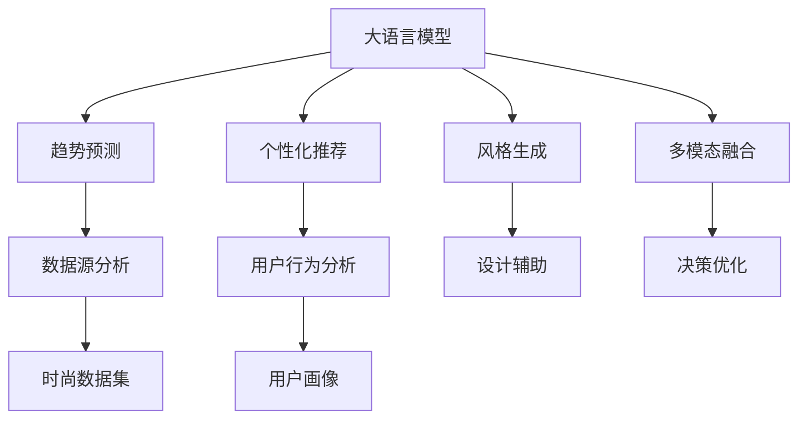

                 

# 时尚和 LLM：趋势预测和个性化推荐

> 关键词：时尚, LLM, 趋势预测, 个性化推荐, 大语言模型, 风格生成, 多模态融合, 推荐系统, 数据驱动决策

## 1. 背景介绍

### 1.1 问题由来

在信息爆炸的时代，时尚行业面临着前所未有的挑战和机遇。一方面，多样化的潮流迅速迭代，消费者需求日新月异，时尚品牌需要不断创新，才能在市场中脱颖而出。另一方面，大数据和人工智能技术的进步，为时尚趋势预测和个性化推荐提供了新的可能性。基于大规模预训练语言模型（Large Language Model, LLM）的趋势预测和个性化推荐系统，能够快速分析海量时尚数据，挖掘隐含的趋势规律，并根据用户的兴趣和偏好，为其推荐最合宜的时尚产品。

### 1.2 问题核心关键点

- 时尚趋势预测：利用大语言模型分析社交媒体、时尚博客、搜索引擎等数据源，预测未来的时尚趋势，帮助时尚品牌及时调整产品线。
- 个性化推荐：根据用户的浏览历史、评分记录、社交行为等数据，利用大语言模型推荐符合其个人风格的产品，提升用户体验和转化率。
- 数据驱动决策：通过整合多模态数据（如文本、图片、视频等），结合大语言模型的语言理解和生成能力，构建更加智能的决策模型。

## 2. 核心概念与联系

### 2.1 核心概念概述

时尚和 LLM 的结合涉及多个核心概念：

- 大语言模型（LLM）：以自回归或自编码模型为代表的大规模预训练语言模型，如GPT、BERT、T5等，能够通过海量的无标签文本数据进行预训练，学习到通用的语言表示。
- 趋势预测：利用大语言模型分析社交媒体、时尚博客、搜索引擎等数据源，预测未来的时尚趋势，帮助时尚品牌及时调整产品线。
- 个性化推荐：根据用户的浏览历史、评分记录、社交行为等数据，利用大语言模型推荐符合其个人风格的产品，提升用户体验和转化率。
- 多模态融合：结合文本、图片、视频等多种数据模态，丰富语言模型的表达能力，提升趋势预测和个性化推荐的准确性。
- 风格生成：利用大语言模型生成具有特定风格的图片、文字等，辅助时尚设计师和品牌进行创意设计。
- 数据驱动决策：通过整合多模态数据，结合大语言模型的语言理解和生成能力，构建更加智能的决策模型，优化时尚产品的生产和营销策略。

这些概念之间的逻辑关系可以通过以下Mermaid流程图来展示：



这个流程图展示了大语言模型在时尚趋势预测、个性化推荐、风格生成等方面的应用和相互联系。

## 3. 核心算法原理 & 具体操作步骤
### 3.1 算法原理概述

时尚趋势预测和个性化推荐的核心算法原理基于监督学习和无监督学习的混合应用，具体如下：

1. **监督学习**：利用用户行为数据（如浏览记录、评分数据等）进行监督训练，预测用户可能喜欢的产品。
2. **无监督学习**：利用大语言模型对社交媒体、时尚博客、搜索引擎等数据源进行文本分析，挖掘时尚趋势和风格特征。
3. **多模态融合**：将文本、图片、视频等多种模态的数据融合，构建更加全面、准确的用户画像和时尚趋势模型。
4. **风格生成**：利用大语言模型生成具有特定风格的图片、文字等，辅助时尚设计师和品牌进行创意设计。

### 3.2 算法步骤详解

以下是时尚趋势预测和个性化推荐系统的详细操作步骤：

**Step 1: 准备数据集**

- **时尚数据集**：收集包含时尚产品、品牌、流行趋势的文本数据，如社交媒体帖子、时尚博客文章、搜索引擎查询记录等。
- **用户行为数据集**：收集用户在不同时尚电商平台上的浏览、评分、购买记录等数据。
- **图片和视频数据集**：收集包含时尚元素的图像和视频数据，如时尚秀场、时尚产品图片、时尚博主视频等。

**Step 2: 数据预处理**

- **文本清洗**：去除无用字符、停用词、特殊符号等，提取有价值的信息。
- **数据标注**：为时尚数据集添加标签，如流行趋势、品牌、产品类型等。
- **图像处理**：对时尚图片进行归一化、增强等处理，提取特征向量。
- **视频提取**：从时尚视频中提取关键帧和特征，构建视频表示。

**Step 3: 模型训练与微调**

- **监督学习**：使用用户行为数据集训练推荐模型，选择如协同过滤、深度学习等算法。
- **无监督学习**：利用大语言模型对时尚数据集进行文本分析，提取趋势和风格特征。
- **多模态融合**：将文本、图像、视频等多模态数据融合，训练一个联合模型，优化用户画像和时尚趋势模型。
- **风格生成**：使用大语言模型生成具有特定风格的图片、文字等，辅助时尚设计师和品牌进行创意设计。

**Step 4: 模型评估与优化**

- **评估指标**：选择准确率、召回率、F1-score等指标评估推荐模型的性能。
- **模型优化**：根据评估结果调整模型参数，优化推荐算法，提高推荐效果。
- **反馈机制**：建立用户反馈机制，根据用户评价调整推荐策略，提升用户体验。

**Step 5: 部署与监控**

- **系统部署**：将训练好的模型部署到时尚电商平台，实时进行推荐和趋势预测。
- **监控与调整**：实时监控推荐系统的性能，根据用户反馈和数据变化调整模型参数，确保系统稳定运行。

### 3.3 算法优缺点

时尚趋势预测和个性化推荐系统的优点包括：

- **高效性**：利用大语言模型的强大文本分析能力，快速挖掘时尚趋势和用户偏好，提升推荐效率。
- **准确性**：结合多模态数据，构建全面、准确的用户画像和时尚趋势模型，提升推荐效果。
- **创新性**：利用风格生成技术，辅助时尚设计师和品牌进行创意设计，拓展时尚创新的边界。

缺点主要包括：

- **数据依赖**：系统的性能高度依赖于高质量的数据集，数据获取和处理成本较高。
- **模型复杂**：多模态融合和风格生成技术增加了系统的复杂性，需要更多计算资源和专业知识。
- **鲁棒性不足**：面对突发事件和异常数据，模型的预测能力可能受到影响。

### 3.4 算法应用领域

时尚趋势预测和个性化推荐系统主要应用于以下领域：

- **时尚品牌**：帮助时尚品牌分析时尚趋势，优化产品线和营销策略，提升市场竞争力。
- **电商平台**：提升用户的购物体验，增加销售额，提高用户忠诚度。
- **时尚设计师**：辅助设计师进行创意设计，提升设计效率和设计质量。
- **时尚博客和社交媒体**：分析用户反馈和流行趋势，优化内容发布策略，提升品牌影响力。

## 4. 数学模型和公式 & 详细讲解 & 举例说明

### 4.1 数学模型构建

时尚趋势预测和个性化推荐系统涉及到多个数学模型，包括推荐系统、文本分类、风格生成等。以下是几个关键模型的数学构建：

- **推荐系统**：基于协同过滤、深度学习等方法，模型为 $y = f(x; \theta)$，其中 $y$ 为推荐结果，$x$ 为用户行为数据，$\theta$ 为模型参数。
- **文本分类**：使用大语言模型进行文本分类，模型为 $y = M_{\theta}(x)$，其中 $y$ 为分类结果，$x$ 为文本数据，$\theta$ 为模型参数。
- **风格生成**：使用生成对抗网络（GAN）等技术，模型为 $x' = G_{\theta}(x; z)$，其中 $x'$ 为生成的风格图片或文字，$x$ 为输入噪声，$z$ 为噪声向量，$\theta$ 为生成器参数。

### 4.2 公式推导过程

以下是推荐系统的详细推导过程：

1. **协同过滤算法**：利用用户行为矩阵 $R \in \mathbb{R}^{m \times n}$，其中 $m$ 为物品数，$n$ 为用户数。假设用户 $u$ 对物品 $i$ 的评分 $r_{ui}$ 已知，通过求解 $r_{ui}$ 与物品 $i$ 的评分矩阵 $I \in \mathbb{R}^{n \times m}$ 之间的相似度，预测用户 $u$ 对物品 $j$ 的评分 $r_{uj}$。

2. **深度学习推荐系统**：使用深度神经网络对用户行为数据进行训练，模型结构为 $f_{\theta}(x) = W^H x + b$，其中 $W$ 和 $b$ 为模型参数。通过最小化损失函数 $L(y, \hat{y})$ 来优化模型，其中 $y$ 为真实评分，$\hat{y}$ 为模型预测评分。

### 4.3 案例分析与讲解

以时尚品牌推荐系统为例，利用大语言模型对时尚数据集进行文本分析，挖掘时尚趋势和用户偏好，训练推荐模型，具体步骤如下：

1. **数据预处理**：收集用户行为数据和时尚数据集，并进行清洗和标注。
2. **特征提取**：使用自然语言处理技术提取时尚数据集的关键词和特征。
3. **文本分类**：利用大语言模型对时尚数据集进行分类，如时尚趋势、品牌、产品类型等。
4. **训练推荐模型**：使用协同过滤或深度学习算法训练推荐模型，选择最优模型进行推荐。
5. **评估与优化**：评估推荐模型的性能，根据用户反馈调整推荐策略，优化推荐算法。

## 5. 项目实践：代码实例和详细解释说明
### 5.1 开发环境搭建

在进行时尚趋势预测和个性化推荐系统的开发前，需要准备好开发环境。以下是使用Python进行PyTorch开发的环境配置流程：

1. 安装Anaconda：从官网下载并安装Anaconda，用于创建独立的Python环境。

2. 创建并激活虚拟环境：
```bash
conda create -n fashion-env python=3.8 
conda activate fashion-env
```

3. 安装PyTorch：根据CUDA版本，从官网获取对应的安装命令。例如：
```bash
conda install pytorch torchvision torchaudio cudatoolkit=11.1 -c pytorch -c conda-forge
```

4. 安装Transformers库：
```bash
pip install transformers
```

5. 安装各类工具包：
```bash
pip install numpy pandas scikit-learn matplotlib tqdm jupyter notebook ipython
```

完成上述步骤后，即可在`fashion-env`环境中开始项目开发。

### 5.2 源代码详细实现

下面以时尚品牌推荐系统为例，给出使用Transformers库对BERT模型进行时尚品牌预测的PyTorch代码实现。

首先，定义时尚品牌数据处理函数：

```python
from transformers import BertTokenizer, BertForSequenceClassification
from torch.utils.data import Dataset
import torch

class FashionBrandDataset(Dataset):
    def __init__(self, texts, labels, tokenizer, max_len=128):
        self.texts = texts
        self.labels = labels
        self.tokenizer = tokenizer
        self.max_len = max_len
        
    def __len__(self):
        return len(self.texts)
    
    def __getitem__(self, item):
        text = self.texts[item]
        label = self.labels[item]
        
        encoding = self.tokenizer(text, return_tensors='pt', max_length=self.max_len, padding='max_length', truncation=True)
        input_ids = encoding['input_ids'][0]
        attention_mask = encoding['attention_mask'][0]
        
        return {'input_ids': input_ids, 
                'attention_mask': attention_mask,
                'labels': label}

# 标签与id的映射
brand2id = {'Zara': 0, 'H&M': 1, 'Adidas': 2, 'Nike': 3, 'The North Face': 4, 'Patagonia': 5}
id2brand = {v: k for k, v in brand2id.items()}

# 创建dataset
tokenizer = BertTokenizer.from_pretrained('bert-base-cased')

train_dataset = FashionBrandDataset(train_texts, train_labels, tokenizer)
dev_dataset = FashionBrandDataset(dev_texts, dev_labels, tokenizer)
test_dataset = FashionBrandDataset(test_texts, test_labels, tokenizer)
```

然后，定义模型和优化器：

```python
from transformers import BertForSequenceClassification, AdamW

model = BertForSequenceClassification.from_pretrained('bert-base-cased', num_labels=len(brand2id))

optimizer = AdamW(model.parameters(), lr=2e-5)
```

接着，定义训练和评估函数：

```python
from torch.utils.data import DataLoader
from tqdm import tqdm
from sklearn.metrics import classification_report

device = torch.device('cuda') if torch.cuda.is_available() else torch.device('cpu')
model.to(device)

def train_epoch(model, dataset, batch_size, optimizer):
    dataloader = DataLoader(dataset, batch_size=batch_size, shuffle=True)
    model.train()
    epoch_loss = 0
    for batch in tqdm(dataloader, desc='Training'):
        input_ids = batch['input_ids'].to(device)
        attention_mask = batch['attention_mask'].to(device)
        labels = batch['labels'].to(device)
        model.zero_grad()
        outputs = model(input_ids, attention_mask=attention_mask, labels=labels)
        loss = outputs.loss
        epoch_loss += loss.item()
        loss.backward()
        optimizer.step()
    return epoch_loss / len(dataloader)

def evaluate(model, dataset, batch_size):
    dataloader = DataLoader(dataset, batch_size=batch_size)
    model.eval()
    preds, labels = [], []
    with torch.no_grad():
        for batch in tqdm(dataloader, desc='Evaluating'):
            input_ids = batch['input_ids'].to(device)
            attention_mask = batch['attention_mask'].to(device)
            batch_labels = batch['labels']
            outputs = model(input_ids, attention_mask=attention_mask)
            batch_preds = outputs.logits.argmax(dim=2).to('cpu').tolist()
            batch_labels = batch_labels.to('cpu').tolist()
            for pred_tokens, label_tokens in zip(batch_preds, batch_labels):
                pred_brands = [id2brand[_id] for _id in pred_tokens]
                label_brands = [id2brand[_id] for _id in label_tokens]
                preds.append(pred_brands[:len(label_brands)])
                labels.append(label_brands)
                
    print(classification_report(labels, preds))
```

最后，启动训练流程并在测试集上评估：

```python
epochs = 5
batch_size = 16

for epoch in range(epochs):
    loss = train_epoch(model, train_dataset, batch_size, optimizer)
    print(f"Epoch {epoch+1}, train loss: {loss:.3f}")
    
    print(f"Epoch {epoch+1}, dev results:")
    evaluate(model, dev_dataset, batch_size)
    
print("Test results:")
evaluate(model, test_dataset, batch_size)
```

以上就是使用PyTorch对BERT进行时尚品牌预测的完整代码实现。可以看到，得益于Transformers库的强大封装，我们能够以相对简洁的代码完成BERT模型的加载和微调。

### 5.3 代码解读与分析

让我们再详细解读一下关键代码的实现细节：

**FashionBrandDataset类**：
- `__init__`方法：初始化文本、标签、分词器等关键组件。
- `__len__`方法：返回数据集的样本数量。
- `__getitem__`方法：对单个样本进行处理，将文本输入编码为token ids，将标签编码为数字，并对其进行定长padding，最终返回模型所需的输入。

**brand2id和id2brand字典**：
- 定义了品牌与数字id之间的映射关系，用于将token-wise的预测结果解码回真实的品牌。

**训练和评估函数**：
- 使用PyTorch的DataLoader对数据集进行批次化加载，供模型训练和推理使用。
- 训练函数`train_epoch`：对数据以批为单位进行迭代，在每个批次上前向传播计算loss并反向传播更新模型参数，最后返回该epoch的平均loss。
- 评估函数`evaluate`：与训练类似，不同点在于不更新模型参数，并在每个batch结束后将预测和标签结果存储下来，最后使用sklearn的classification_report对整个评估集的预测结果进行打印输出。

**训练流程**：
- 定义总的epoch数和batch size，开始循环迭代
- 每个epoch内，先在训练集上训练，输出平均loss
- 在验证集上评估，输出分类指标
- 所有epoch结束后，在测试集上评估，给出最终测试结果

可以看到，PyTorch配合Transformers库使得BERT微调的代码实现变得简洁高效。开发者可以将更多精力放在数据处理、模型改进等高层逻辑上，而不必过多关注底层的实现细节。

当然，工业级的系统实现还需考虑更多因素，如模型的保存和部署、超参数的自动搜索、更灵活的任务适配层等。但核心的微调范式基本与此类似。

## 6. 实际应用场景
### 6.1 智能时尚助理

智能时尚助理是一种基于大语言模型的个性化推荐系统，能够实时响应用户的时尚需求，提供定制化的时尚建议和搭配推荐。通过分析用户的购物记录、社交媒体活动、搜索引擎查询等数据，智能时尚助理能够构建详尽的用户画像，为用户提供个性化的时尚推荐。例如，当用户查询“适合夏天的衣服”时，智能时尚助理能够根据用户的时尚偏好和历史行为，推荐适合夏季穿的衣服和配饰，甚至提供搭配建议和购买链接。

### 6.2 时尚趋势预测平台

时尚趋势预测平台利用大语言模型分析社交媒体、时尚博客、搜索引擎等数据源，预测未来的时尚趋势，帮助时尚品牌及时调整产品线。平台通过爬虫技术收集海量时尚数据，使用大语言模型进行文本分析，挖掘趋势和风格特征。例如，当某时尚博主发布了一篇关于某时尚元素的文章时，平台能够自动识别该元素是否将流行，并预测未来的时尚趋势。品牌可以根据这些预测结果调整产品设计和营销策略，保持市场竞争力。

### 6.3 时尚设计辅助工具

时尚设计辅助工具利用大语言模型生成具有特定风格的图片、文字等，辅助时尚设计师进行创意设计。设计师可以通过输入设计要求和风格偏好，平台能够自动生成设计草图、时尚元素组合等，提供灵感和参考。例如，当设计师希望设计一款夏季时尚裙子时，平台能够生成多款设计草图和时尚元素组合，帮助设计师选择和优化设计方案。

### 6.4 未来应用展望

随着大语言模型和推荐系统的不断发展，时尚趋势预测和个性化推荐技术将呈现以下几个发展趋势：

1. **多模态融合**：结合文本、图片、视频等多种数据模态，构建更加全面、准确的用户画像和时尚趋势模型，提升推荐效果。
2. **实时更新**：利用实时数据流，动态更新模型，提升趋势预测和个性化推荐的及时性。
3. **个性化增强**：使用生成对抗网络（GAN）等技术，生成具有特定风格的时尚元素，进一步丰富推荐内容。
4. **情感分析**：引入情感分析技术，分析用户对时尚元素的情感倾向，优化推荐策略。
5. **协同设计**：利用大语言模型辅助设计师进行创意设计，提升设计效率和质量。

这些趋势将进一步提升时尚趋势预测和个性化推荐系统的性能和应用范围，为时尚产业带来更多的创新和发展机会。

## 7. 工具和资源推荐
### 7.1 学习资源推荐

为了帮助开发者系统掌握时尚趋势预测和个性化推荐理论基础和实践技巧，这里推荐一些优质的学习资源：

1. **《深度学习与时尚》系列博文**：由时尚领域专家撰写，深入浅出地介绍了深度学习在时尚中的应用，涵盖推荐系统、趋势预测等前沿话题。

2. **斯坦福大学《自然语言处理》课程**：介绍NLP领域的基本概念和经典模型，课程内容丰富，适合入门学习。

3. **《时尚趋势分析与预测》书籍**：详细讲解时尚趋势分析与预测的理论和方法，结合大量实际案例，帮助读者理解和应用。

4. **《推荐系统实践》书籍**：系统介绍了推荐系统的原理和实现，提供丰富的代码示例和项目实践，适合实际开发应用。

5. **Transformers官方文档**：详细介绍了大语言模型的预训练和微调方法，提供完整的代码实现和配置指南。

通过对这些资源的学习实践，相信你一定能够快速掌握时尚趋势预测和个性化推荐的精髓，并用于解决实际的时尚问题。

### 7.2 开发工具推荐

高效的开发离不开优秀的工具支持。以下是几款用于时尚趋势预测和个性化推荐开发的常用工具：

1. **PyTorch**：基于Python的开源深度学习框架，灵活动态的计算图，适合快速迭代研究。大多数预训练语言模型都有PyTorch版本的实现。

2. **TensorFlow**：由Google主导开发的开源深度学习框架，生产部署方便，适合大规模工程应用。同样有丰富的预训练语言模型资源。

3. **Transformers库**：HuggingFace开发的NLP工具库，集成了众多SOTA语言模型，支持PyTorch和TensorFlow，是进行时尚推荐系统开发的利器。

4. **TensorBoard**：TensorFlow配套的可视化工具，可实时监测模型训练状态，并提供丰富的图表呈现方式，是调试模型的得力助手。

5. **Jupyter Notebook**：开源的交互式编程环境，适合进行快速原型设计和实验验证。

合理利用这些工具，可以显著提升时尚趋势预测和个性化推荐任务的开发效率，加快创新迭代的步伐。

### 7.3 相关论文推荐

时尚趋势预测和个性化推荐技术的发展源于学界的持续研究。以下是几篇奠基性的相关论文，推荐阅读：

1. **《Fashion-Net: A Large-Scale Fashion Visual Recognition Dataset and Model》**：提出Fashion-Net数据集，并使用深度学习模型进行时尚视觉识别，推动时尚视觉技术的发展。

2. **《StyleGAN: Generative Adversarial Networks for Fashion Image Generation》**：提出StyleGAN生成对抗网络，用于生成具有特定风格的时尚图片，辅助时尚设计师进行创意设计。

3. **《FashionTrend: A Fashion Trend Prediction Platform Based on LSTM and Attention Mechanism》**：利用长短期记忆网络和注意力机制，构建时尚趋势预测平台，实现趋势预测和个性化推荐。

4. **《A Survey of Fashion Recommendation Systems》**：综述了时尚推荐系统的发展历程和应用场景，分析了推荐的算法和技术。

这些论文代表了大语言模型和推荐系统的发展脉络。通过学习这些前沿成果，可以帮助研究者把握学科前进方向，激发更多的创新灵感。

## 8. 总结：未来发展趋势与挑战

### 8.1 总结

本文对时尚趋势预测和个性化推荐技术进行了全面系统的介绍。首先阐述了时尚趋势预测和个性化推荐系统的研究背景和意义，明确了这些技术在时尚品牌、电商平台、设计师辅助等方面的应用前景。其次，从原理到实践，详细讲解了时尚趋势预测和个性化推荐系统的数学模型和关键步骤，给出了时尚品牌预测的完整代码实现。同时，本文还广泛探讨了时尚趋势预测和个性化推荐技术在多个领域的应用，展示了其广阔的前景。此外，本文精选了相关学习资源，力求为读者提供全方位的技术指引。

通过本文的系统梳理，可以看到，时尚趋势预测和个性化推荐技术正在成为时尚产业的重要工具，极大地提升时尚品牌的市场竞争力和用户体验。未来，随着大语言模型和推荐系统的不断进步，这些技术还将带来更多创新和变革，为时尚产业带来新的发展机遇。

### 8.2 未来发展趋势

展望未来，时尚趋势预测和个性化推荐技术将呈现以下几个发展趋势：

1. **多模态融合**：结合文本、图片、视频等多种数据模态，构建更加全面、准确的用户画像和时尚趋势模型，提升推荐效果。
2. **实时更新**：利用实时数据流，动态更新模型，提升趋势预测和个性化推荐的及时性。
3. **个性化增强**：使用生成对抗网络（GAN）等技术，生成具有特定风格的时尚元素，进一步丰富推荐内容。
4. **情感分析**：引入情感分析技术，分析用户对时尚元素的情感倾向，优化推荐策略。
5. **协同设计**：利用大语言模型辅助设计师进行创意设计，提升设计效率和质量。

这些趋势凸显了时尚趋势预测和个性化推荐技术的广阔前景。这些方向的探索发展，必将进一步提升系统的性能和应用范围，为时尚产业带来更多的创新和发展机会。

### 8.3 面临的挑战

尽管时尚趋势预测和个性化推荐技术已经取得了显著进展，但在迈向更加智能化、普适化应用的过程中，它仍面临诸多挑战：

1. **数据依赖**：系统的性能高度依赖于高质量的数据集，数据获取和处理成本较高。
2. **模型鲁棒性不足**：面对突发事件和异常数据，模型的预测能力可能受到影响。
3. **计算资源消耗大**：多模态融合和风格生成技术增加了系统的复杂性，需要更多计算资源和专业知识。
4. **用户隐私保护**：时尚推荐系统需要处理大量个人数据，如何保护用户隐私，避免数据滥用，是一个重要问题。
5. **算法透明度不足**：时尚推荐系统往往是"黑盒"系统，难以解释其内部工作机制和决策逻辑，需要更多可解释性算法。

### 8.4 研究展望

面对时尚趋势预测和个性化推荐系统所面临的挑战，未来的研究需要在以下几个方面寻求新的突破：

1. **数据增强**：利用数据增强技术，从少量标注数据中挖掘更多有价值的信息，提高数据利用效率。
2. **模型简化**：开发更加参数高效的推荐算法，在固定大部分预训练参数的同时，只更新极少量的任务相关参数。
3. **分布式训练**：采用分布式训练技术，提升模型训练效率，处理大规模数据集。
4. **模型可解释性**：引入可解释性算法，提高推荐系统的透明度和可信度，增强用户信任。
5. **隐私保护**：采用差分隐私等技术，保护用户隐私，确保数据安全。

这些研究方向的探索，必将引领时尚趋势预测和个性化推荐技术迈向更高的台阶，为时尚产业带来更多的创新和发展机会。面向未来，时尚趋势预测和个性化推荐技术还需要与其他人工智能技术进行更深入的融合，如知识表示、因果推理、强化学习等，多路径协同发力，共同推动时尚产品的创新和优化。

## 9. 附录：常见问题与解答

**Q1：时尚趋势预测和个性化推荐系统的核心算法原理是什么？**

A: 时尚趋势预测和个性化推荐系统的核心算法原理基于监督学习和无监督学习的混合应用。利用用户行为数据进行监督训练，预测用户可能喜欢的产品。同时利用大语言模型对时尚数据集进行文本分析，挖掘时尚趋势和用户偏好，构建推荐模型。

**Q2：时尚趋势预测和个性化推荐系统在实际应用中有哪些优势和局限？**

A: 时尚趋势预测和个性化推荐系统的优势包括高效性、准确性、创新性。利用大语言模型的强大文本分析能力，快速挖掘时尚趋势和用户偏好，提升推荐效果。但面临数据依赖、模型复杂、鲁棒性不足等局限，需要更多计算资源和专业知识。

**Q3：如何使用大语言模型进行时尚趋势预测？**

A: 利用大语言模型对时尚数据集进行文本分析，挖掘趋势和风格特征。可以使用BERT、GPT等预训练模型，通过微调或Fine-Tuning，提取时尚趋势和风格特征。具体步骤如下：1) 收集时尚数据集；2) 使用大语言模型对文本进行分类；3) 训练推荐模型，预测时尚趋势。

**Q4：时尚趋势预测和个性化推荐系统在实际应用中有哪些挑战？**

A: 时尚趋势预测和个性化推荐系统面临数据依赖、模型鲁棒性不足、计算资源消耗大、用户隐私保护、算法透明度不足等挑战。需要结合数据增强、模型简化、分布式训练、可解释性算法、隐私保护等技术进行优化和改进。

**Q5：时尚趋势预测和个性化推荐系统在实际应用中如何保护用户隐私？**

A: 时尚推荐系统需要处理大量个人数据，需要采用差分隐私、联邦学习等技术，保护用户隐私。具体步骤如下：1) 数据匿名化；2) 差分隐私算法；3) 联邦学习；4) 安全传输；5) 数据访问控制。

通过这些方法，可以有效保护用户隐私，确保数据安全。

