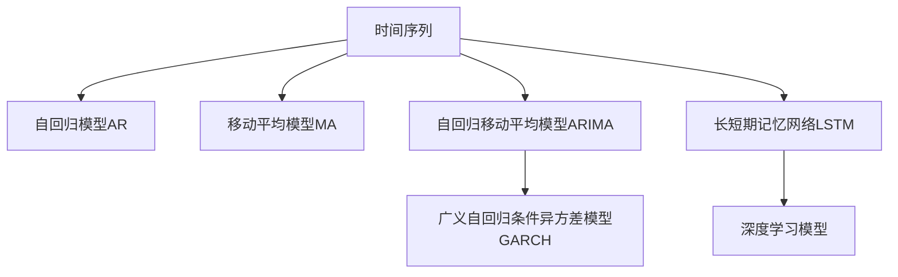

                 

# 时间序列分析在金融市场预测中的应用：量化交易策略

> 关键词：时间序列分析, 量化交易策略, 金融市场预测, 波动率模型, ARIMA, GARCH, LSTM

## 1. 背景介绍

金融市场是经济活动的温度计，市场价格、交易量等时间序列数据是反映市场运行状况的重要指标。量化交易策略的优化依赖于对这些时间序列数据的精确分析与预测。时间序列分析是一种统计学工具，用于研究随时间变化的数据。其核心在于识别数据中的趋势、季节性和随机性，并利用这些特性进行预测和建模。在金融市场中，时间序列分析可用于预测股票价格、利率、汇率、波动率等关键指标，为量化交易策略的制定提供依据。

### 1.1 问题由来

金融市场的复杂性及其高度动态变化的特点，使得传统的技术分析方法在预测市场走势时显得力不从心。虽然基本面分析能够提供一些宏观经济数据，但这些数据往往过于宏观，无法提供精准的市场行为预测。为此，研究人员和投资者逐渐转向使用数据科学的方法来捕捉市场细微的变化，而时间序列分析正是在这一背景下得以广泛应用。

### 1.2 问题核心关键点

时间序列分析在金融市场预测中的核心关键点包括：
1. **数据处理**：清洗、缺失值处理、异常值检测等。
2. **特征提取**：设计自相关、偏自相关、自回归模型等。
3. **模型选择**：选择合适的统计模型，如ARIMA、GARCH等。
4. **预测与验证**：进行模型训练、预测、交叉验证等。
5. **风险管理**：基于预测结果进行策略优化和风险控制。

## 2. 核心概念与联系

### 2.1 核心概念概述

为了更好地理解时间序列分析在金融市场预测中的应用，本节将介绍几个密切相关的核心概念：

- **时间序列（Time Series）**：指随时间变化的数据序列。在金融市场中，时间序列通常包括价格、交易量等。
- **自回归模型（Auto-Regressive Model, AR）**：一种描述时间序列中样本值与其自身之前样本值关系的模型。
- **移动平均模型（Moving Average Model, MA）**：一种描述时间序列中样本值与其自身滞后样本值均值的模型。
- **自回归移动平均模型（Auto-Regressive Integrated Moving Average Model, ARIMA）**：结合自回归和移动平均的模型，常用于处理非平稳时间序列。
- **广义自回归条件异方差模型（Generalized Autoregressive Conditional Heteroskedasticity, GARCH）**：一种用于预测时间序列波动率的模型，考虑到了异方差性。
- **长短期记忆网络（Long Short-Term Memory, LSTM）**：一种深度学习模型，能够捕捉长时程依赖，常用于时间序列预测。

这些核心概念之间的逻辑关系可以通过以下Mermaid流程图来展示：



这个流程图展示了一些时间序列分析的核心概念及其之间的关系：

1. 时间序列是分析的基本对象。
2. 自回归和移动平均是基础模型，用于处理平稳或平稳化的数据。
3. ARIMA结合了AR和MA，处理非平稳数据。
4. GARCH考虑了时间序列的异方差性，用于波动率预测。
5. LSTM作为深度学习模型，能够捕捉复杂的时程依赖关系。
6. 深度学习模型则提供了更为复杂的预测能力。

这些概念共同构成了金融市场预测中时间序列分析的基本框架，使我们能够使用这些工具来精确地预测市场走势。

## 3. 核心算法原理 & 具体操作步骤
### 3.1 算法原理概述

在金融市场中，量化交易策略的制定通常涉及以下几个步骤：

1. **数据预处理**：清洗、填补缺失值、处理异常值等。
2. **特征提取**：计算自相关函数、偏自相关函数、移动平均函数等。
3. **模型选择**：根据时间序列的性质选择适当的模型。
4. **模型训练与验证**：训练模型并使用交叉验证等方法验证模型性能。
5. **策略实施与优化**：基于模型预测结果，制定量化交易策略并进行优化。

基于时间序列分析的金融市场预测，核心在于模型的选择和参数的调整。常用的模型包括ARIMA、GARCH、LSTM等。以下以ARIMA模型为例，介绍其原理及操作步骤。

### 3.2 算法步骤详解

**Step 1: 数据预处理**

假设我们有一组历史价格数据 $P_t$，其中 $t$ 表示时间序列索引。

1. **数据清洗**：去除明显的异常值或噪声。例如，如果数据中存在异常的高价或低价，可以通过视觉检查或异常检测算法去除。
2. **数据归一化**：将价格数据归一化到区间[0,1]，例如使用最小-最大归一化。
3. **数据拆分**：将数据拆分为训练集和测试集，通常采用70% 训练和30% 测试的比例。

**Step 2: 特征提取**

1. **自相关函数（ACF）**：计算价格数据的自相关函数，即 $Corr(P_t, P_{t-k})$，其中 $k$ 为滞后项数。
2. **偏自相关函数（PACF）**：计算价格数据的偏自相关函数，即 $Corr(P_t, P_{t-k}) / Corr(P_{t-k}, P_{t-2k})$，用于排除趋势项影响。
3. **差分**：对价格数据进行一阶或二阶差分，以处理非平稳性。

**Step 3: 模型选择**

1. **ARIMA模型选择**：根据自相关函数和偏自相关函数的截尾性质，选择合适的ARIMA模型。
2. **参数估计**：使用最大似然估计法或最小化均方误差法进行参数估计。

**Step 4: 模型训练与验证**

1. **训练**：使用训练集数据拟合模型，计算模型参数。
2. **验证**：使用交叉验证或保留一部分数据作为验证集，评估模型性能。
3. **调整**：根据验证集表现调整模型参数，例如使用网格搜索或贝叶斯优化。

**Step 5: 策略实施与优化**

1. **预测**：使用训练好的模型对未来价格进行预测。
2. **策略制定**：基于预测结果制定量化交易策略，例如使用移动平均线、指数移动平均线等。
3. **优化**：根据历史交易结果不断优化策略参数，例如使用回测等方法。

### 3.3 算法优缺点

时间序列分析在金融市场预测中的优点包括：

1. **简单高效**：方法简单，易于实现和理解。
2. **适用于复杂数据**：可以处理多种类型的时间序列数据，包括非平稳数据。
3. **可解释性强**：模型参数容易解释，有助于理解数据中的趋势和季节性。
4. **易于应用**：在实际交易策略中，模型预测结果可以直接应用于策略优化。

缺点则包括：

1. **依赖数据质量**：对数据质量要求高，任何异常值或噪声都可能严重影响模型结果。
2. **模型假设**：模型基于特定的假设，例如平稳性、正态性，可能不适用于某些数据。
3. **过度拟合风险**：在历史数据量不足时，容易发生过拟合。
4. **时间滞后性**：模型预测基于历史数据，无法预测突发事件对市场的影响。

### 3.4 算法应用领域

时间序列分析在金融市场预测中的应用广泛，涵盖以下几个主要领域：

- **股票价格预测**：基于历史价格数据，预测未来股价走势。
- **交易量预测**：预测股票或期货市场的交易量变化。
- **波动率预测**：预测市场波动率，例如使用GARCH模型。
- **风险管理**：预测市场风险，例如使用VaR模型。
- **策略优化**：根据预测结果优化交易策略，例如使用ARIMA模型构建的移动平均线策略。

## 4. 数学模型和公式 & 详细讲解  
### 4.1 数学模型构建

时间序列分析的核心在于建立时间序列模型，用以描述和预测数据。常用的时间序列模型包括ARIMA和GARCH。以下以ARIMA模型为例，介绍其数学模型构建。

### 4.2 公式推导过程

ARIMA模型的基本形式为：

$$
P_t = \phi(B)P_{t-1} + \theta(B)W_t + \epsilon_t
$$

其中，$P_t$ 表示时间序列，$\phi(B)$ 为自回归项，$\theta(B)$ 为移动平均项，$W_t$ 为白噪声，$\epsilon_t$ 为误差项。$B$ 表示滞后算子，$W_t = B^j P_{t-j}$。

ARIMA模型的完整形式为：

$$
ARIMA(p,d,q)(P) = ARIMA(p,d,q)[P,D]
$$

其中，$p$ 为自回归项数，$d$ 为差分阶数，$q$ 为移动平均项数，$P$ 为季节性自回归项数，$D$ 为季节性差分阶数。

ARIMA模型参数估计通常使用最大似然估计法，具体公式为：

$$
\hat{\theta} = \mathop{\arg\min}_{\theta} \sum_{t=1}^N (y_t - \hat{y}_t)^2
$$

其中，$y_t$ 为实际观测值，$\hat{y}_t$ 为模型预测值，$\theta$ 为模型参数。

### 4.3 案例分析与讲解

假设我们有一组历史价格数据 $P_t$，使用ARIMA模型进行预测。具体步骤如下：

1. **数据预处理**：对价格数据进行归一化和差分处理，以去除趋势和季节性影响。
2. **模型选择**：通过绘制自相关函数和偏自相关函数，确定ARIMA模型的参数 $p$ 和 $q$。
3. **模型训练**：使用最大似然估计法计算模型参数。
4. **模型验证**：在验证集上评估模型预测性能，调整模型参数。
5. **策略实施**：使用训练好的模型进行价格预测，基于预测结果制定交易策略。

以下是一个简单的ARIMA模型预测的Python代码实现：

```python
import pandas as pd
from statsmodels.tsa.arima_model import ARIMA

# 加载价格数据
df = pd.read_csv('price_data.csv')
df['P'] = df['Close'] / df['Close'].iloc[0]

# 构建ARIMA模型
model = ARIMA(df['P'], order=(1, 1, 1))
results = model.fit()

# 预测未来价格
forecast = results.forecast(steps=10)
df['Forecast'] = forecast
```

通过这个代码，我们可以实现一个简单的ARIMA模型，对历史价格数据进行预测，并输出预测结果。

## 5. 项目实践：代码实例和详细解释说明
### 5.1 开发环境搭建

在进行金融市场预测时，通常需要以下开发环境：

1. **Python环境**：安装Python 3.x，可以使用Anaconda或Miniconda。
2. **数据处理工具**：使用Pandas、NumPy等数据处理工具。
3. **统计分析工具**：使用statsmodels、scikit-learn等统计分析工具。
4. **可视化工具**：使用Matplotlib、Seaborn等可视化工具。
5. **机器学习库**：使用SciPy、TensorFlow等机器学习库。

### 5.2 源代码详细实现

以下是一个使用Python进行ARIMA模型预测的代码示例：

```python
import pandas as pd
from statsmodels.tsa.arima_model import ARIMA

# 加载历史价格数据
df = pd.read_csv('price_data.csv')

# 数据预处理
df['P'] = df['Close'] / df['Close'].iloc[0]

# 构建ARIMA模型
model = ARIMA(df['P'], order=(1, 1, 1))
results = model.fit()

# 预测未来价格
forecast = results.forecast(steps=10)
df['Forecast'] = forecast

# 可视化结果
import matplotlib.pyplot as plt
plt.plot(df['P'], label='Actual')
plt.plot(df['Forecast'], label='Forecast')
plt.legend()
plt.show()
```

通过这个代码，我们可以实现一个简单的ARIMA模型，对历史价格数据进行预测，并可视化预测结果。

### 5.3 代码解读与分析

**数据预处理**：

- 使用Pandas加载历史价格数据，并计算对数收益率 $P_t$。
- 对数据进行归一化，将价格数据转化为对数收益率，以去除趋势和季节性影响。

**模型构建与训练**：

- 使用statsmodels库中的ARIMA模型，指定模型参数 $p=1$、$d=1$、$q=1$。
- 使用最大似然估计法拟合模型参数。

**预测与可视化**：

- 使用ARIMA模型的forecast方法，对未来价格进行预测。
- 使用Matplotlib库进行预测结果的可视化，比较实际价格与预测价格。

## 6. 实际应用场景
### 6.1 股票价格预测

股票价格预测是金融市场预测中最常见的应用之一。基于ARIMA、GARCH等模型，我们可以对未来股价走势进行预测，并制定相应的交易策略。例如，基于ARIMA模型的移动平均线策略，通过计算价格数据的历史均值和标准差，构建短期和长期移动平均线，指导交易决策。

**实际案例**：假设我们使用ARIMA模型对某股票的历史价格进行预测，发现未来价格将有较大波动。基于此预测结果，我们可以制定买入或卖出的策略，进行量化交易。

### 6.2 波动率预测

波动率是金融市场中重要的风险指标，直接影响期权定价和风险管理。使用GARCH模型，我们可以对未来波动率进行预测，从而评估市场风险。

**实际案例**：假设我们使用GARCH模型对某股票的波动率进行预测，发现未来波动率将有所上升。基于此预测结果，我们可以加强风险控制，制定相应的对冲策略。

### 6.3 交易量预测

交易量是衡量市场活跃度的重要指标，影响价格走势和交易成本。基于ARIMA等模型，我们可以对未来交易量进行预测，从而优化交易策略。

**实际案例**：假设我们使用ARIMA模型对某股票的未来交易量进行预测，发现未来交易量将有所下降。基于此预测结果，我们可以调整交易频率和仓位，降低交易成本。

## 7. 工具和资源推荐
### 7.1 学习资源推荐

为了帮助开发者系统掌握时间序列分析在金融市场预测中的应用，这里推荐一些优质的学习资源：

1. **时间序列分析相关书籍**：《时间序列分析》（G.S. Box, G.E. Jenkins, G.C. Reinsel, R.C. Ljung, G.M. Quinn），《金融时间序列》（R.C. McLean）。
2. **在线课程**：Coursera上的《金融数据分析》课程，Udacity上的《时间序列分析》课程。
3. **论文推荐**：
   - "ARIMA Model for Financial Time Series"（J. Marr, S. Ibrahim）
   - "GARCH Models: Financial Applications"（R.F. Engle）
   - "Long Short-Term Memory Networks for Financial Time Series"（J. Sutskever, J. Martin, G.E. Hinton）

通过这些学习资源，相信你一定能够快速掌握时间序列分析的精髓，并用于解决实际的金融市场预测问题。

### 7.2 开发工具推荐

高效的开发离不开优秀的工具支持。以下是几款用于金融市场预测开发的常用工具：

1. **Jupyter Notebook**：轻量级的交互式编程环境，适合快速迭代研究。
2. **PyCharm**：专业的Python IDE，支持数据科学和机器学习开发。
3. **RStudio**：专业的R语言IDE，适合统计分析和可视化。
4. **Python环境**：使用Anaconda或Miniconda搭建Python环境。
5. **数据可视化工具**：使用Matplotlib、Seaborn、Plotly等工具。
6. **统计分析工具**：使用statsmodels、scikit-learn等库。

合理利用这些工具，可以显著提升金融市场预测的开发效率，加快创新迭代的步伐。

### 7.3 相关论文推荐

金融市场预测涉及的算法和模型众多，以下是几篇奠基性的相关论文，推荐阅读：

1. **ARIMA模型**：
   - "A Comprehensive Survey of ARIMA Model"（G.H. Woodworth）
   - "ARIMA for Business and Economics"（A.J. McLeod）

2. **GARCH模型**：
   - "Theory and Practice of Dynamic Hedging: A High-Frequency Approach to Risk Management"（J.P. O'Connor）
   - "GARCH Models in Financial Engineering"（R.F. Engle, Z. Ng）

3. **LSTM模型**：
   - "Long Short-Term Memory Networks for Financial Time Series"（J. Sutskever, J. Martin, G.E. Hinton）
   - "A Deep Learning Framework for Time Series Analysis"（R.M. Stahmann, M.R. Bronstein）

这些论文代表了大语言模型微调技术的发展脉络。通过学习这些前沿成果，可以帮助研究者把握学科前进方向，激发更多的创新灵感。

## 8. 总结：未来发展趋势与挑战
### 8.1 总结

本文对时间序列分析在金融市场预测中的应用进行了全面系统的介绍。首先阐述了金融市场中时间序列数据的重要性和时间序列分析的必要性，明确了时间序列分析在金融市场预测中的核心关键点。其次，从原理到实践，详细讲解了ARIMA模型的构建和操作步骤，给出了金融市场预测的代码实现。同时，本文还广泛探讨了ARIMA模型在股票价格预测、波动率预测、交易量预测等多个金融场景中的应用前景，展示了时间序列分析的巨大潜力。此外，本文精选了时间序列分析的各类学习资源，力求为读者提供全方位的技术指引。

通过本文的系统梳理，可以看到，时间序列分析在金融市场预测中的应用已经非常广泛，成为量化交易策略制定的重要工具。借助时间序列分析，量化交易策略可以充分利用历史数据，构建更精确的预测模型，优化交易决策，提升投资收益。未来，伴随时间序列分析方法的持续演进，金融市场预测将更加精准，量化交易策略也将不断优化，为投资者带来更高的回报。

### 8.2 未来发展趋势

展望未来，时间序列分析在金融市场预测中将会呈现以下几个发展趋势：

1. **深度学习模型**：深度学习模型如LSTM、GRU等，能够捕捉更加复杂的时程依赖关系，有望取代传统的时间序列模型。
2. **混合模型**：将时间序列分析和深度学习模型结合，构建混合模型，以充分利用两者的优势。
3. **在线学习**：使用在线学习算法，不断更新模型参数，提升模型的实时预测能力。
4. **多模态数据融合**：将时间序列分析与其他数据源（如新闻、社交媒体等）结合，提高预测精度。
5. **分布式计算**：使用分布式计算框架，提升模型训练和预测的速度。
6. **自动化策略**：使用自动化算法，动态优化交易策略，适应市场变化。

以上趋势凸显了时间序列分析在金融市场预测中的广阔前景。这些方向的探索发展，必将进一步提升金融市场预测的精度和实时性，为量化交易策略的制定提供更可靠的数据支持。

### 8.3 面临的挑战

尽管时间序列分析在金融市场预测中已经取得了显著成果，但在迈向更加智能化、普适化应用的过程中，仍面临诸多挑战：

1. **数据质量**：金融市场数据存在缺失值、噪声、异常值等，数据质量问题可能导致模型预测偏差。
2. **模型选择**：选择合适的模型和参数设置，需要大量经验和领域知识，对新入行者的门槛较高。
3. **实时性**：传统时间序列模型计算复杂度高，无法满足实时预测需求，需要优化算法和模型结构。
4. **市场动态**：金融市场具有高度动态变化的特点，模型预测结果可能受到突发事件影响。
5. **模型鲁棒性**：现有模型对历史数据的依赖性较强，难以适应市场变化。
6. **风险管理**：需要考虑模型的稳健性和鲁棒性，避免过度拟合。

这些挑战需要研究者持续探索和解决，才能使时间序列分析在金融市场预测中发挥更大的作用。

### 8.4 研究展望

未来的研究需要在以下几个方面寻求新的突破：

1. **自动化模型选择**：开发自动模型选择工具，帮助用户选择合适的模型和参数设置。
2. **在线学习算法**：研究在线学习算法，提升模型的实时预测能力。
3. **多模态数据融合**：研究多模态数据融合技术，提高模型预测精度。
4. **分布式计算框架**：研究分布式计算框架，提升模型训练和预测的速度。
5. **混合模型**：开发混合模型，融合时间序列分析和深度学习模型。
6. **自动化策略优化**：研究自动化策略优化算法，提高交易策略的适应性。

这些研究方向的研究，必将使时间序列分析在金融市场预测中发挥更大的作用，为量化交易策略的制定提供更加可靠的数据支持。总之，时间序列分析将会在金融市场中发挥更大的作用，为投资者带来更高的回报。

## 9. 附录：常见问题与解答

**Q1: 时间序列分析适用于金融市场预测吗？**

A: 时间序列分析在金融市场预测中具有广泛应用。通过分析价格、交易量等时间序列数据，可以预测未来走势，制定量化交易策略。但需要特别注意的是，金融市场具有高度动态变化的特点，时间序列模型可能受到突发事件的影响，因此需要进行合理调整。

**Q2: 时间序列分析中的ARIMA模型如何使用？**

A: ARIMA模型用于预测时间序列数据。首先，需要根据自相关函数和偏自相关函数绘制散点图，确定模型的参数 $p$ 和 $q$。然后，使用最大似然估计法或最小化均方误差法计算模型参数。最后，使用模型进行预测，并评估预测结果的准确性。

**Q3: 时间序列分析的局限性有哪些？**

A: 时间序列分析的局限性包括：
1. 对数据质量要求高，任何异常值或噪声都可能严重影响模型结果。
2. 模型基于特定的假设，例如平稳性、正态性，可能不适用于某些数据。
3. 过度拟合风险，在历史数据量不足时，容易发生过拟合。
4. 时间滞后性，模型预测基于历史数据，无法预测突发事件对市场的影响。

**Q4: 金融市场预测中如何避免模型过拟合？**

A: 金融市场预测中避免模型过拟合的方法包括：
1. 数据预处理：去除异常值、噪声等。
2. 模型选择：使用多模态数据融合技术，提高模型预测精度。
3. 正则化：使用L1、L2正则化等方法，控制模型复杂度。
4. 交叉验证：使用交叉验证方法，评估模型泛化能力。

通过合理设计数据预处理和模型构建流程，可以有效地避免模型过拟合，提高预测准确性。

**Q5: 时间序列分析在金融市场预测中如何进行风险管理？**

A: 时间序列分析在金融市场预测中进行风险管理的方法包括：
1. 波动率预测：使用GARCH模型预测市场波动率，评估风险水平。
2. 交易量预测：使用ARIMA模型预测交易量变化，评估市场流动性。
3. VaR模型：基于历史数据和预测结果，计算风险价值（Value at Risk），进行风险管理。
4. 动态对冲策略：根据市场变化，动态调整对冲策略，降低风险。

通过合理利用时间序列分析，可以有效评估和管理金融市场风险，保障投资安全。

---

作者：禅与计算机程序设计艺术 / Zen and the Art of Computer Programming

