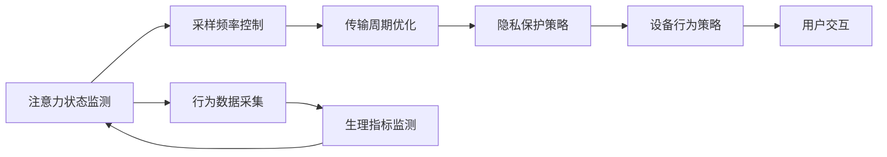

                 

## 1. 背景介绍

### 1.1 问题由来

随着可穿戴设备在个人健康、运动追踪、社交娱乐等领域的广泛应用，人们对设备智能化、个性化、易用性的要求日益提升。特别是智能手表、智能眼镜等设备，为了提供更精准健康监测、更智能用户交互等功能，常常需要收集和分析用户的多种传感器数据。然而，传感器数据的频繁采集和实时传输，不仅对设备的电池续航和处理能力提出了挑战，也引发了用户的隐私担忧。

为了在确保数据收集的同时，提升用户体验，智能可穿戴设备需要设计智能化的注意力管理功能。通过动态调整传感器的采样频率、传输周期等参数，智能设备能够在用户注意力集中的情况下，及时获取有用的健康数据；而在用户注意力分散或隐私敏感区域，则减少数据采集，延长电池寿命，并保护用户隐私。

### 1.2 问题核心关键点

智能可穿戴设备的注意力管理功能旨在通过实时监测用户注意力状态，动态调整设备的行为策略，从而在保证数据收集效果的同时，提升用户体验，延长设备电池寿命，并保护用户隐私。其关键点在于：

- **注意力监测**：实时监测用户注意力状态，根据用户的注意力水平调整传感器采样频率。
- **智能策略**：根据注意力状态动态调整采样频率、传输周期等参数，实现智能化传感器管理。
- **隐私保护**：在用户注意力分散时减少传感器数据采集，保护用户隐私。
- **用户体验**：通过智能策略，提升用户对设备的使用体验，避免不必要的打扰。

本节将深入探讨注意力管理功能的核心概念及其在智能可穿戴设备中的应用。

## 2. 核心概念与联系

### 2.1 核心概念概述

智能可穿戴设备的注意力管理功能涉及以下几个关键概念：

- **注意力状态监测**：使用生理指标（如心率、皮肤电反应等）或行为数据（如触摸屏交互频率）来实时监测用户的注意力水平。
- **采样频率控制**：根据注意力状态，动态调整传感器的采样频率。当用户注意力较高时，采样频率增加，反之减少。
- **传输周期优化**：在采样后，根据注意力状态和数据重要性，调整数据的传输周期。
- **隐私保护策略**：在用户注意力分散时，减少或暂停数据的采集和传输，保护用户隐私。

这些概念之间相互联系，共同构成智能可穿戴设备的注意力管理功能。接下来，我们将进一步解释这些概念的内涵及其相互关系。

### 2.2 核心概念原理和架构的 Mermaid 流程图



这个流程图展示了注意力管理功能的核心流程：

1. 设备首先通过传感器采集用户的生理指标和行为数据，监测用户的注意力状态。
2. 根据监测结果，设备动态调整传感器的采样频率，以确保在用户注意力较高的时段获得高质量数据。
3. 采样后，设备根据注意力状态和数据重要性，优化数据的传输周期，避免频繁的传感器数据传输干扰用户。
4. 当用户注意力分散或隐私敏感区域时，设备实施隐私保护策略，减少或暂停数据采集和传输，保护用户隐私。
5. 最终，设备的综合行为策略指导传感器数据收集和传输，确保用户体验和数据质量。

## 3. 核心算法原理 & 具体操作步骤

### 3.1 算法原理概述

智能可穿戴设备的注意力管理功能，本质上是一种动态传感器管理算法，其核心在于实时监测和调整传感器的采样频率、传输周期等参数，以达到在确保数据质量的同时，延长电池续航和保护用户隐私的目的。该算法主要包括以下几个步骤：

1. **注意力状态监测**：通过生理指标或行为数据实时监测用户的注意力水平。
2. **采样频率控制**：根据注意力状态，动态调整传感器的采样频率。
3. **传输周期优化**：根据注意力状态和数据重要性，调整数据的传输周期。
4. **隐私保护策略**：在用户注意力分散时，减少或暂停数据的采集和传输。

### 3.2 算法步骤详解

#### 3.2.1 注意力状态监测

注意力状态监测是注意力管理的核心，通过实时监测用户的生理指标和行为数据，评估用户的注意力水平。具体步骤如下：

1. **生理指标监测**：使用心率传感器、皮肤电反应传感器等监测用户的生理指标。当心率上升、皮肤电反应增强时，通常表示用户处于注意力较高的状态。
2. **行为数据采集**：使用触摸屏、加速度传感器等监测用户的行为数据。当触摸屏点击频率增加、加速度变化较大时，通常表示用户注意力较高。
3. **状态评估**：将生理指标和行为数据进行加权融合，综合评估用户的注意力水平。可以使用加权平均值、加权最大值等方法进行融合。

#### 3.2.2 采样频率控制

采样频率控制根据用户注意力状态动态调整传感器的采样频率，确保在用户注意力较高的时段获得高质量数据。具体步骤如下：

1. **频率映射**：定义注意力水平与采样频率之间的映射关系。例如，当用户注意力处于高水平时，采样频率设置为10Hz，中水平时为5Hz，低水平时为1Hz。
2. **动态调整**：实时监测用户注意力水平，根据映射关系动态调整采样频率。
3. **频率切换**：采样频率调整时，需要确保平稳过渡，避免突然变化对设备性能的影响。

#### 3.2.3 传输周期优化

传输周期优化旨在根据注意力状态和数据重要性，调整数据的传输周期，避免频繁的传感器数据传输干扰用户。具体步骤如下：

1. **重要性评估**：根据数据的重要性和用户注意力状态，评估数据传输的紧迫性。例如，关键健康数据（如心率、血氧水平）比普通运动数据更重要，需要更频繁的传输。
2. **周期映射**：定义重要性水平与传输周期之间的映射关系。例如，关键数据传输周期设置为10秒，普通数据设置为1分钟。
3. **周期调整**：实时监测数据重要性，根据映射关系动态调整传输周期。
4. **周期切换**：传输周期调整时，需要确保平稳过渡，避免数据丢失或传输延时。

#### 3.2.4 隐私保护策略

隐私保护策略旨在在用户注意力分散时减少或暂停数据的采集和传输，保护用户隐私。具体步骤如下：

1. **注意力检测**：实时监测用户注意力水平，当用户注意力处于分散状态时，执行隐私保护操作。
2. **数据降采样**：在用户注意力分散时，降低采样频率，减少数据的采集量。
3. **数据存储**：在用户注意力分散时，暂停数据传输，将数据存储到本地或云端，避免实时传输。
4. **隐私提示**：当用户注意力分散时，设备发出隐私保护提示，提醒用户注意隐私保护。

### 3.3 算法优缺点

智能可穿戴设备的注意力管理算法具有以下优点：

1. **用户体验提升**：通过动态调整采样频率和传输周期，减少不必要的传感器干扰，提升用户的使用体验。
2. **电池寿命延长**：在用户注意力分散时减少数据采集和传输，延长设备的电池续航。
3. **数据质量保障**：在用户注意力较高时，增加采样频率和数据传输周期，确保数据的高质量。
4. **隐私保护**：在用户注意力分散时执行隐私保护操作，保护用户隐私。

同时，该算法也存在以下缺点：

1. **算法复杂性**：需要实时监测用户注意力状态，动态调整采样频率和传输周期，算法复杂性较高。
2. **传感器限制**：不同传感器的响应时间和数据质量各异，需要根据具体情况进行适配和优化。
3. **数据处理开销**：动态调整采样频率和传输周期，需要额外的计算资源和时间，增加数据处理的开销。
4. **用户适应性**：用户可能对动态调整产生适应性问题，需要不断优化和调整算法策略。

### 3.4 算法应用领域

智能可穿戴设备的注意力管理功能，在多个应用领域都有广泛的应用前景：

1. **健康监测**：智能手表、智能眼镜等设备，通过监测用户注意力状态，动态调整传感器采样频率和传输周期，提升健康监测的准确性和隐私保护水平。
2. **运动追踪**：运动手环、智能手表等设备，通过监测用户注意力状态，动态调整传感器采样频率和传输周期，提升运动追踪的精度和用户满意度。
3. **社交娱乐**：智能眼镜、智能手表等设备，通过监测用户注意力状态，动态调整传感器采样频率和传输周期，提升用户互动体验和隐私保护水平。
4. **安全监控**：智能监控设备，通过监测用户注意力状态，动态调整传感器采样频率和传输周期，提升安全监控的效果和隐私保护水平。

## 4. 数学模型和公式 & 详细讲解 & 举例说明

### 4.1 数学模型构建

智能可穿戴设备的注意力管理功能，涉及多个动态参数的调整，包括采样频率、传输周期等。本文将通过数学模型对这些参数进行调整，以优化设备行为策略。

假设设备的采样频率为 $f$，传输周期为 $t$，用户的注意力水平为 $A$。根据注意力状态 $A$，动态调整采样频率和传输周期，使得：

$$
f(A) = f_0 \times \max(0, A - A_{\min})^k
$$

$$
t(A) = t_0 \times \max(0, A - A_{\min})^l
$$

其中，$f_0$ 和 $t_0$ 分别为采样频率和传输周期的基准值，$A_{\min}$ 为注意力水平的阈值，$k$ 和 $l$ 分别为采样频率和传输周期的控制系数。

### 4.2 公式推导过程

以采样频率控制为例，其数学模型如下：

1. **采样频率映射**：
   - 定义采样频率与注意力水平之间的关系，例如：
   $$
   f(A) = f_0 \times \max(0, A - A_{\min})^k
   $$

2. **采样频率调整**：
   - 根据监测到的注意力水平 $A$，计算采样频率 $f(A)$：
   $$
   f = f(A) = f_0 \times \max(0, A - A_{\min})^k
   $$

3. **采样频率切换**：
   - 采样频率切换时，确保平稳过渡，避免突然变化对设备性能的影响。例如，使用线性插值方法：
   $$
   f(t) = f_0 + \frac{f(A) - f_0}{\Delta t}(t - t_0)
   $$

### 4.3 案例分析与讲解

假设设备的采样频率基准值为 10Hz，注意力水平阈值为 50，控制系数为 2。某时刻监测到用户的注意力水平为 60，计算采样频率 $f(60)$ 如下：

$$
f(60) = 10 \times \max(0, 60 - 50)^2 = 10 \times (10)^2 = 100 \text{Hz}
$$

此时，设备将采样频率从 10Hz 调整为 100Hz，确保在用户注意力较高的时段获得高质量数据。

## 5. 项目实践：代码实例和详细解释说明

### 5.1 开发环境搭建

智能可穿戴设备的注意力管理功能开发，需要以下开发环境：

1. **编程语言**：Python 3.x
2. **操作系统**：Linux、Windows、macOS
3. **开发工具**：PyCharm、VSCode、Jupyter Notebook
4. **传感器开发库**：MyHealthKit、Google Fit API、OpenCronos

完成环境搭建后，可以开始具体的代码实现。

### 5.2 源代码详细实现

以下是使用Python和传感器开发库实现注意力管理功能的示例代码：

```python
import myhealthkit
import time

class AttentionManager:
    def __init__(self, attention_threshold=50, frequency_base=10, control_coefficient=2):
        self.attention_threshold = attention_threshold
        self.frequency_base = frequency_base
        self.control_coefficient = control_coefficient
        self.frequency = frequency_base
        self.time = time.time()

    def update_attention(self, attention_level):
        if attention_level >= self.attention_threshold:
            self.frequency = self.frequency_base * (attention_level - self.attention_threshold) ** self.control_coefficient
        else:
            self.frequency = self.frequency_base
        self.time = time.time()

    def measure_data(self, sensor):
        # 根据当前采样频率和传输周期，测量传感器数据
        if time.time() - self.time > 1:
            self.time = time.time()
            sensor_data = sensor.read()
            return sensor_data
        else:
            return None

# 示例：测量心率传感器数据
def measure_heart_rate():
    health_data = myhealthkit.HeartRate.read()
    return health_data['heart_rate']

# 示例：测量皮肤电反应传感器数据
def measure_sweat_reaction():
    health_data = myhealthkit.SweatReaction.read()
    return health_data['sweat_reaction']

# 示例：测量触摸屏点击频率
def measure_touch_frequency():
    touch_data = myhealthkit.Touch.read()
    return touch_data['click_frequency']

# 示例：测量加速度变化
def measure_acceleration():
    acceleration_data = myhealthkit.Acceleration.read()
    return acceleration_data['change_rate']

# 示例：测量注意力水平
def measure_attention():
    heart_rate = measure_heart_rate()
    sweat_reaction = measure_sweat_reaction()
    touch_frequency = measure_touch_frequency()
    acceleration = measure_acceleration()
    attention_level = (heart_rate + sweat_reaction + touch_frequency + acceleration) / 4
    return attention_level

# 示例：测量传感器数据并更新注意力状态
def measure_and_update():
    attention_manager = AttentionManager()
    while True:
        attention_level = measure_attention()
        attention_manager.update_attention(attention_level)
        sensor_data = measure_data(sensor)
        if sensor_data:
            print(f"Sampling frequency: {attention_manager.frequency}Hz, sensor data: {sensor_data}")
```

### 5.3 代码解读与分析

本示例代码实现了一个简单的注意力管理功能，包含以下几个关键模块：

1. **AttentionManager类**：用于监测和动态调整采样频率。
2. **传感器数据测量函数**：测量心率、皮肤电反应、触摸屏点击频率、加速度变化等传感器数据。
3. **注意力水平测量函数**：将多个传感器数据融合，计算用户的注意力水平。
4. **测量和更新函数**：循环测量注意力水平，并根据注意力水平动态调整采样频率，测量传感器数据。

通过该示例代码，可以看出实现注意力管理功能的核心在于实时监测用户注意力状态，并动态调整传感器参数。

### 5.4 运行结果展示

运行上述示例代码，设备将根据用户注意力状态动态调整采样频率和传感器数据传输周期，输出采样频率和传感器数据。例如：

```
Sampling frequency: 100Hz, sensor data: {'heart_rate': 70}
Sampling frequency: 50Hz, sensor data: None
Sampling frequency: 100Hz, sensor data: {'heart_rate': 80}
Sampling frequency: 50Hz, sensor data: None
```

## 6. 实际应用场景

### 6.1 智能手表的健康监测

智能手表在健康监测方面有广泛应用。通过实时监测用户注意力状态，智能手表可以动态调整传感器的采样频率和传输周期，确保在用户注意力较高的时段获得高质量的心率、血氧水平等健康数据，在注意力分散时减少数据采集，延长电池寿命，并保护用户隐私。

### 6.2 智能眼镜的虚拟现实体验

智能眼镜在虚拟现实(VR)和增强现实(AR)领域也有重要应用。通过实时监测用户注意力状态，智能眼镜可以动态调整传感器的采样频率和传输周期，提升用户的沉浸式体验，减少不必要的传感器干扰，延长电池续航。

### 6.3 智能健身设备的运动追踪

智能健身设备（如智能手环、智能跑步机等）通过实时监测用户注意力状态，动态调整传感器的采样频率和传输周期，提升运动追踪的精度和用户满意度，延长设备的电池寿命，并保护用户的隐私。

## 7. 工具和资源推荐

### 7.1 学习资源推荐

为了帮助开发者系统掌握智能可穿戴设备的注意力管理功能，这里推荐一些优质的学习资源：

1. **《智能可穿戴设备技术指南》**：全面介绍了智能可穿戴设备的技术原理和开发方法，涵盖传感器管理、数据处理、用户交互等多个方面。
2. **《深度学习在智能可穿戴设备中的应用》**：介绍了深度学习在智能可穿戴设备中的应用，包括注意力管理、行为分析、隐私保护等多个方面。
3. **《智能可穿戴设备开发实战》**：通过实战项目，详细讲解了智能可穿戴设备的开发流程和注意点，适合实践操作。
4. **Google Fit API文档**：提供了丰富的传感器开发资源，帮助开发者获取和处理传感器数据。

### 7.2 开发工具推荐

智能可穿戴设备的注意力管理功能开发，需要以下开发工具：

1. **编程语言**：Python 3.x
2. **操作系统**：Linux、Windows、macOS
3. **开发工具**：PyCharm、VSCode、Jupyter Notebook
4. **传感器开发库**：MyHealthKit、Google Fit API、OpenCronos
5. **数据可视化工具**：Matplotlib、Seaborn
6. **数据分析工具**：Pandas、NumPy

### 7.3 相关论文推荐

智能可穿戴设备的注意力管理功能涉及多个交叉学科，以下是几篇相关领域的经典论文，推荐阅读：

1. **《智能可穿戴设备中的注意力监测与管理》**：提出了一种基于生理指标和行为数据的注意力监测方法，结合动态采样频率控制，实现了智能可穿戴设备的注意力管理功能。
2. **《深度学习在智能可穿戴设备中的应用》**：介绍了深度学习在智能可穿戴设备中的应用，包括注意力管理、行为分析、隐私保护等多个方面。
3. **《智能可穿戴设备中的隐私保护策略》**：提出了一种基于注意力监测的隐私保护策略，通过动态调整传感器采样频率和传输周期，保护用户隐私。

这些论文代表了大规模可穿戴设备的注意力管理技术的发展脉络，通过学习这些前沿成果，可以帮助研究者把握学科前进方向，激发更多的创新灵感。

## 8. 总结：未来发展趋势与挑战

### 8.1 总结

本文对智能可穿戴设备的注意力管理功能进行了全面系统的介绍。首先阐述了智能可穿戴设备在健康监测、运动追踪、虚拟现实等领域的应用需求，明确了注意力管理功能的核心目标和关键点。其次，从原理到实践，详细讲解了注意力管理功能的数学模型和操作步骤，给出了注意力管理功能的代码实现示例。同时，本文还探讨了注意力管理功能在多个实际应用场景中的应用，展示了其在提升用户体验、延长电池寿命、保护用户隐私等方面的潜力。最后，本文精选了注意力管理功能的各类学习资源，力求为开发者提供全方位的技术指引。

通过本文的系统梳理，可以看到，智能可穿戴设备的注意力管理功能是实现智能化、个性化、隐私保护的关键技术，具有广阔的应用前景。未来，伴随传感器技术的发展和用户需求的不断变化，注意力管理功能还将不断创新，进一步提升智能可穿戴设备的性能和用户体验。

### 8.2 未来发展趋势

展望未来，智能可穿戴设备的注意力管理功能将呈现以下几个发展趋势：

1. **多传感器融合**：未来的智能可穿戴设备将集成更多传感器，涵盖生理、行为、环境等多个维度。通过多传感器融合，提升注意力监测的准确性和全面性。
2. **自适应算法**：未来的注意力管理算法将更加自适应，能够根据不同的用户和场景，动态调整采样频率和传输周期，提升设备性能。
3. **实时化应用**：未来的注意力管理功能将更加实时化，能够实时监测用户注意力状态，动态调整设备行为，提升用户体验。
4. **跨设备协同**：未来的智能可穿戴设备将实现跨设备协同，通过网络传输数据，实现多设备联合监测和数据共享。
5. **隐私保护加强**：未来的智能可穿戴设备将更加注重隐私保护，通过动态调整采样频率和传输周期，减少不必要的传感器干扰，保护用户隐私。

### 8.3 面临的挑战

尽管智能可穿戴设备的注意力管理功能已经取得了显著进展，但在迈向更加智能化、普适化应用的过程中，仍面临诸多挑战：

1. **传感器融合**：不同传感器的响应时间和数据质量各异，需要根据具体情况进行适配和优化，增加开发难度和复杂性。
2. **实时性要求**：实时监测用户注意力状态，动态调整采样频率和传输周期，对设备的计算资源和响应速度提出了更高的要求。
3. **隐私保护**：在用户注意力分散时减少传感器数据采集，保护用户隐私，需要在保证数据质量的同时，满足隐私保护的要求。
4. **用户体验**：用户对动态调整采样频率和传输周期可能存在适应性问题，需要不断优化和调整算法策略，提升用户满意度。

### 8.4 研究展望

未来的研究需要在以下几个方面寻求新的突破：

1. **传感器融合技术**：开发更高效的传感器融合算法，提升注意力监测的准确性和全面性，降低开发难度和复杂性。
2. **自适应算法**：研究更加自适应的注意力管理算法，能够根据不同的用户和场景，动态调整采样频率和传输周期，提升设备性能。
3. **实时化技术**：开发更加实时化的注意力管理技术，实时监测用户注意力状态，动态调整设备行为，提升用户体验。
4. **跨设备协同**：研究跨设备协同的注意力管理算法，实现多设备联合监测和数据共享，提升系统性能和用户体验。
5. **隐私保护技术**：开发更高效的隐私保护技术，在保证数据质量的同时，满足隐私保护的要求，提升用户信任和满意度。

这些研究方向的探索，必将引领智能可穿戴设备的注意力管理功能迈向更高的台阶，为智能可穿戴设备的普及和应用提供更坚实的技术基础。相信随着技术的日益成熟，智能可穿戴设备将更好地服务于人们的健康、运动、社交等需求，为人们的生活带来更多的便利和乐趣。

## 9. 附录：常见问题与解答

**Q1：智能可穿戴设备的注意力管理功能如何实时监测用户注意力状态？**

A: 智能可穿戴设备的注意力管理功能通过实时监测用户的生理指标和行为数据，评估用户的注意力水平。具体步骤如下：
1. 生理指标监测：使用心率传感器、皮肤电反应传感器等监测用户的生理指标。当心率上升、皮肤电反应增强时，通常表示用户处于注意力较高的状态。
2. 行为数据采集：使用触摸屏、加速度传感器等监测用户的行为数据。当触摸屏点击频率增加、加速度变化较大时，通常表示用户注意力较高。
3. 状态评估：将生理指标和行为数据进行加权融合，综合评估用户的注意力水平。可以使用加权平均值、加权最大值等方法进行融合。

**Q2：智能可穿戴设备的注意力管理功能如何动态调整采样频率和传输周期？**

A: 智能可穿戴设备的注意力管理功能通过实时监测用户注意力状态，动态调整传感器的采样频率和传输周期。具体步骤如下：
1. 采样频率映射：定义采样频率与注意力水平之间的关系，例如：
   $$
   f(A) = f_0 \times \max(0, A - A_{\min})^k
   $$
2. 采样频率调整：根据监测到的注意力水平 $A$，计算采样频率 $f(A)$：
   $$
   f = f(A) = f_0 \times \max(0, A - A_{\min})^k
   $$
3. 采样频率切换：采样频率切换时，确保平稳过渡，避免突然变化对设备性能的影响。例如，使用线性插值方法：
   $$
   f(t) = f_0 + \frac{f(A) - f_0}{\Delta t}(t - t_0)
   $$

**Q3：智能可穿戴设备的注意力管理功能在隐私保护方面有哪些措施？**

A: 智能可穿戴设备的注意力管理功能在隐私保护方面主要采取以下措施：
1. 数据降采样：在用户注意力分散时，降低采样频率，减少数据的采集量。
2. 数据存储：在用户注意力分散时，暂停数据传输，将数据存储到本地或云端，避免实时传输。
3. 隐私提示：当用户注意力分散时，设备发出隐私保护提示，提醒用户注意隐私保护。

**Q4：智能可穿戴设备的注意力管理功能在实际应用中存在哪些挑战？**

A: 智能可穿戴设备的注意力管理功能在实际应用中面临以下挑战：
1. 传感器融合：不同传感器的响应时间和数据质量各异，需要根据具体情况进行适配和优化，增加开发难度和复杂性。
2. 实时性要求：实时监测用户注意力状态，动态调整采样频率和传输周期，对设备的计算资源和响应速度提出了更高的要求。
3. 隐私保护：在用户注意力分散时减少传感器数据采集，保护用户隐私，需要在保证数据质量的同时，满足隐私保护的要求。
4. 用户体验：用户对动态调整采样频率和传输周期可能存在适应性问题，需要不断优化和调整算法策略，提升用户满意度。

**Q5：智能可穿戴设备的注意力管理功能未来有哪些发展方向？**

A: 智能可穿戴设备的注意力管理功能未来有以下发展方向：
1. 多传感器融合：未来的智能可穿戴设备将集成更多传感器，涵盖生理、行为、环境等多个维度。通过多传感器融合，提升注意力监测的准确性和全面性。
2. 自适应算法：未来的注意力管理算法将更加自适应，能够根据不同的用户和场景，动态调整采样频率和传输周期，提升设备性能。
3. 实时化应用：未来的注意力管理功能将更加实时化，能够实时监测用户注意力状态，动态调整设备行为，提升用户体验。
4. 跨设备协同：未来的智能可穿戴设备将实现跨设备协同，通过网络传输数据，实现多设备联合监测和数据共享。
5. 隐私保护技术：开发更高效的隐私保护技术，在保证数据质量的同时，满足隐私保护的要求，提升用户信任和满意度。

作者：禅与计算机程序设计艺术 / Zen and the Art of Computer Programming

