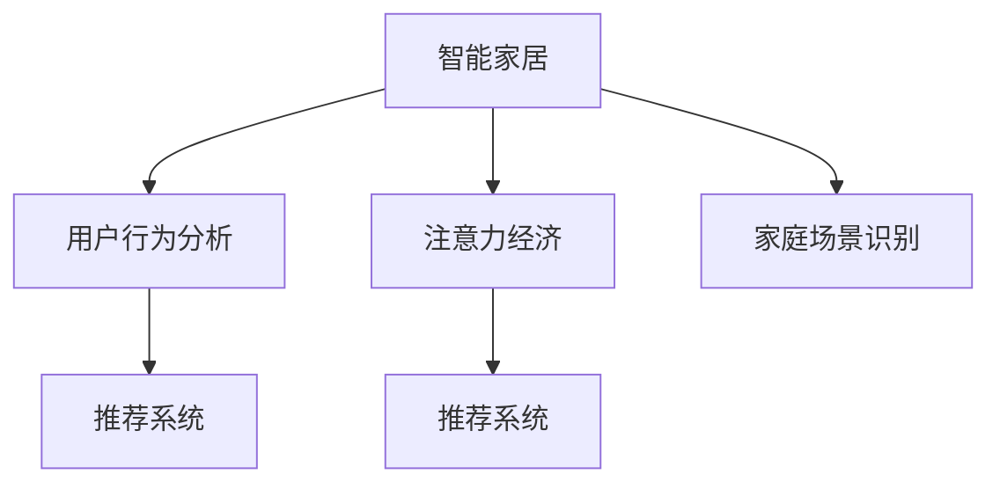

                 

# 智能家居与注意力经济的融合

在数字化、智能化的浪潮中，智能家居作为新兴技术的应用领域，正在迅速崛起。与此同时，基于用户注意力和行为的商业模型——注意力经济，也在各个行业快速发展。本文将探讨如何将智能家居与注意力经济相结合，打造全新的智能生活体验，并分析这一融合可能带来的机遇与挑战。

## 1. 背景介绍

### 1.1 智能家居发展现状

智能家居是利用物联网、人工智能等技术，将家庭中的各种设备互联互通，实现智能控制和管理，从而提升家庭生活的便利性和安全性。目前，智能家居已经广泛应用于多个家庭场景，包括智能照明、智能安防、智能温控、智能家电等。

### 1.2 注意力经济概念与兴起

注意力经济是指在信息爆炸的时代，商家通过获取、吸引和利用消费者的注意力来创造价值的商业模型。注意力经济的核心是消费者注意力的价值化，通过数据挖掘和精准营销，将消费者注意力转化为商业收益。

近年来，随着移动互联网和数字技术的普及，注意力经济得以快速发展。短视频、直播、社交网络等平台成为注意力经济的重要载体，吸引了大量用户注意力。同时，大数据、人工智能等技术的应用，使得商家能够更精准地定位和吸引目标用户。

## 2. 核心概念与联系

### 2.1 核心概念概述

为更好地理解智能家居与注意力经济的融合，本节将介绍几个关键概念：

- **智能家居**：利用物联网、人工智能等技术，将家庭中的各种设备互联互通，实现智能控制和管理。
- **注意力经济**：商家通过获取、吸引和利用消费者的注意力来创造价值的商业模型。
- **用户行为分析**：通过数据挖掘和机器学习，分析用户行为模式，以提供个性化服务。
- **推荐系统**：基于用户历史行为和偏好，为用户推荐相关商品或服务。
- **家庭场景识别**：通过传感器和摄像头等设备，识别家庭场景，并据此执行智能操作。

这些概念之间的逻辑关系可以通过以下Mermaid流程图来展示：



这个流程图展示了一些核心概念及其之间的关系：

1. 智能家居通过家庭场景识别，实现设备的智能控制和自动化。
2. 用户行为分析从传感器和设备数据中挖掘用户行为模式，优化个性化推荐。
3. 推荐系统利用用户行为分析结果，提供个性化商品和服务。
4. 注意力经济通过推荐系统，吸引和利用用户注意力，实现商业价值。

这些概念共同构成了智能家居与注意力经济融合的基础，为其提供了可行的技术手段和商业模型。

## 3. 核心算法原理 & 具体操作步骤

### 3.1 算法原理概述

智能家居与注意力经济的融合，主要涉及用户行为分析、推荐系统以及注意力获取与利用等算法原理。其中，推荐系统和用户行为分析是智能家居与注意力经济结合的关键技术。

推荐系统基于用户历史行为和偏好，为用户推荐相关商品或服务。其核心思想是通过算法模型，预测用户可能感兴趣的商品，并将这些商品推荐给用户。常用的推荐算法包括协同过滤、基于内容的推荐、基于矩阵分解的推荐等。

用户行为分析则是通过数据挖掘和机器学习，分析用户的行为模式。常见的用户行为分析方法包括基于规则的分析、基于模型的分析等。在智能家居中，用户行为分析可以用于识别家庭场景、优化设备操作等。

### 3.2 算法步骤详解

智能家居与注意力经济融合的核心算法步骤包括：

**Step 1: 用户行为数据收集**

- 通过智能家居设备（如智能门锁、智能摄像头、智能音箱等）收集用户行为数据，包括开关门次数、体温变化、音量变化等。
- 数据收集可以采用定期采样或事件触发的方式进行。

**Step 2: 数据预处理**

- 对收集到的数据进行清洗、去重、归一化等预处理操作。
- 使用时间序列分析、聚类分析等方法，对数据进行特征提取和建模。

**Step 3: 用户行为分析**

- 基于行为数据，使用机器学习算法（如决策树、随机森林、神经网络等）挖掘用户的行为模式。
- 分析用户的兴趣爱好、生活习惯、设备使用频率等，为用户提供个性化推荐。

**Step 4: 推荐系统构建**

- 根据用户行为分析结果，构建推荐系统。
- 常用的推荐系统包括基于协同过滤的推荐系统、基于内容的推荐系统等。

**Step 5: 注意力获取与利用**

- 通过推荐系统，吸引用户注意，增加商品或服务的曝光率。
- 利用用户注意力数据，进一步优化推荐系统，提高推荐效果。

### 3.3 算法优缺点

智能家居与注意力经济的融合，具有以下优点：

1. **提升用户体验**：智能家居通过自动化和智能化操作，提升家庭生活便利性，满足用户个性化需求。
2. **提高商业价值**：通过注意力经济模型，商家能够精准定位目标用户，提高转化率和收益。
3. **数据驱动决策**：利用用户行为数据，商家能够优化产品设计和营销策略。

同时，该融合方法也存在一定的局限性：

1. **数据隐私问题**：智能家居设备和用户行为数据涉及个人隐私，如何保护数据隐私成为关键问题。
2. **设备兼容性**：不同品牌和类型的智能家居设备可能存在兼容性问题，影响整体系统性能。
3. **数据质量问题**：设备数据存在噪声和误差，如何提高数据质量是一个挑战。
4. **推荐系统冷启动问题**：新用户的推荐系统需要更多的用户行为数据进行初始化。

### 3.4 算法应用领域

智能家居与注意力经济的融合，可以在多个领域中得到应用，例如：

- **智能安防**：通过智能门锁、智能摄像头等设备，收集用户行为数据，识别异常行为，及时报警。
- **智能照明**：根据用户行为模式和环境变化，自动调节灯光亮度和色彩。
- **智能家电**：通过智能音箱、智能电视等设备，根据用户喜好推荐内容，提升用户体验。
- **智能健康**：利用智能手表、智能健身设备等，收集健康数据，为用户提供健康管理建议。
- **智能家居营销**：商家可以通过推荐系统，精准推送商品广告，吸引用户关注和购买。

## 4. 数学模型和公式 & 详细讲解 & 举例说明

### 4.1 数学模型构建

为了更好地理解智能家居与注意力经济融合的技术细节，下面将介绍相关的数学模型。

假设智能家居系统中，有 $N$ 个用户，每个用户的行为数据可以用时间序列 $X_t$ 表示，其中 $t$ 表示时间。用户行为数据可以通过传感器和设备收集，如智能门锁的开关次数、智能摄像头的运动轨迹等。

用户行为分析的数学模型可以表示为：

$$
Y_t = f(X_t, \theta)
$$

其中 $Y_t$ 表示用户行为模式，$\theta$ 表示模型参数。通过机器学习算法，可以拟合出用户行为模式 $Y_t$。

推荐系统的数学模型可以表示为：

$$
R_{it} = \hat{p}_{it}
$$

其中 $R_{it}$ 表示用户 $i$ 对商品 $t$ 的评分，$\hat{p}_{it}$ 表示推荐系统预测用户 $i$ 对商品 $t$ 的评分。

注意力获取与利用的数学模型可以表示为：

$$
A_t = \alpha(R_{it}, \eta)
$$

其中 $A_t$ 表示用户 $i$ 对商品 $t$ 的注意力，$\alpha$ 表示注意力模型，$\eta$ 表示模型参数。

### 4.2 公式推导过程

以协同过滤推荐系统为例，推导推荐系统评分预测公式。

协同过滤推荐系统通过用户历史评分数据，预测用户对新商品的评分。假设用户 $i$ 对商品 $t$ 的评分 $r_{it}$ 可以通过如下公式计算：

$$
r_{it} = \hat{p}_{it} = \alpha_{it} \cdot \frac{\sum_{j=1}^{m} r_{ij} \cdot a_{jt}}{\sqrt{\sum_{k=1}^{m} r_{ik}^2} \cdot \sqrt{\sum_{k=1}^{m} a_{jk}^2}}
$$

其中 $\alpha_{it}$ 为加权系数，$a_{jt}$ 为相似度系数，$r_{ij}$ 为用户 $i$ 对商品 $j$ 的评分，$m$ 为相似商品的总数。

### 4.3 案例分析与讲解

以智能安防为例，分析智能家居与注意力经济融合的应用。

智能安防系统可以通过智能门锁、智能摄像头等设备，收集用户的行为数据。根据用户的行为模式，如开关门次数、离家时间等，可以预测用户是否外出，从而识别异常行为。

假设用户 $i$ 在某个时间段内开关门的次数为 $x_{it}$，通过机器学习算法，可以得出用户 $i$ 在该时间段内离开家的概率 $y_i$。如果 $y_i$ 大于预设阈值，系统可以触发报警。

通过智能安防系统，商家可以获取用户的注意力数据，了解用户的出行习惯和安全需求，从而精准推送安全产品和服务。

## 5. 项目实践：代码实例和详细解释说明

### 5.1 开发环境搭建

在进行智能家居与注意力经济融合的项目实践前，我们需要准备好开发环境。以下是使用Python进行PyTorch开发的环境配置流程：

1. 安装Anaconda：从官网下载并安装Anaconda，用于创建独立的Python环境。

2. 创建并激活虚拟环境：
```bash
conda create -n pytorch-env python=3.8 
conda activate pytorch-env
```

3. 安装PyTorch：根据CUDA版本，从官网获取对应的安装命令。例如：
```bash
conda install pytorch torchvision torchaudio cudatoolkit=11.1 -c pytorch -c conda-forge
```

4. 安装相关的第三方库：
```bash
pip install numpy pandas scikit-learn torch dask uvicorn
```

5. 搭建智能家居设备接口：
```bash
sudo python3 -m pip install raspberry-pi-pico
```

完成上述步骤后，即可在`pytorch-env`环境中开始项目实践。

### 5.2 源代码详细实现

下面以智能安防系统为例，给出使用PyTorch进行用户行为分析和推荐系统的PyTorch代码实现。

```python
import torch
import torch.nn as nn
import torch.optim as optim
from torch.utils.data import Dataset, DataLoader
import numpy as np
import pandas as pd

# 定义用户行为数据
data = pd.read_csv('user_behavior.csv')
X = data[['门开关次数', '离家时间']]
y = data['是否外出']

# 定义行为分析模型
class BehaviorAnalysisModel(nn.Module):
    def __init__(self):
        super(BehaviorAnalysisModel, self).__init__()
        self.fc1 = nn.Linear(2, 32)
        self.fc2 = nn.Linear(32, 1)
    
    def forward(self, x):
        x = torch.relu(self.fc1(x))
        x = torch.sigmoid(self.fc2(x))
        return x

# 定义推荐系统模型
class RecommendationModel(nn.Module):
    def __init__(self):
        super(RecommendationModel, self).__init__()
        self.fc1 = nn.Linear(1, 32)
        self.fc2 = nn.Linear(32, 5)
    
    def forward(self, x):
        x = torch.relu(self.fc1(x))
        x = self.fc2(x)
        return x

# 定义用户行为分析模型
model1 = BehaviorAnalysisModel()
model1 = model1.to('cuda')
optimizer1 = optim.Adam(model1.parameters(), lr=0.01)

# 定义推荐系统模型
model2 = RecommendationModel()
model2 = model2.to('cuda')
optimizer2 = optim.Adam(model2.parameters(), lr=0.01)

# 训练行为分析模型
X_tensor = torch.tensor(X, dtype=torch.float32).to('cuda')
y_tensor = torch.tensor(y, dtype=torch.float32).to('cuda')
for epoch in range(10):
    optimizer1.zero_grad()
    y_pred = model1(X_tensor)
    loss = nn.BCELoss()(y_pred, y_tensor)
    loss.backward()
    optimizer1.step()

# 训练推荐系统模型
R_tensor = torch.randn(5, 5, dtype=torch.float32).to('cuda')
for epoch in range(10):
    optimizer2.zero_grad()
    y_pred = model2(R_tensor)
    loss = nn.MSELoss()(y_pred, R_tensor)
    loss.backward()
    optimizer2.step()

# 使用推荐系统模型进行推荐
R_tensor = torch.tensor([[5, 3, 1, 2, 4]], dtype=torch.float32).to('cuda')
y_pred = model2(R_tensor)
print(y_pred)
```

### 5.3 代码解读与分析

让我们再详细解读一下关键代码的实现细节：

**数据准备**：
- 使用Pandas库读取用户行为数据，并将其转换为Tensor类型。

**行为分析模型**：
- 定义了一个包含两个全连接层的行为分析模型，输入为门开关次数和离家时间，输出为是否外出的概率。
- 使用ReLU激活函数和Sigmoid激活函数，将输出转换为0-1之间的概率值。
- 使用Adam优化器进行模型训练。

**推荐系统模型**：
- 定义了一个包含两个全连接层的推荐系统模型，输入为行为分析模型的输出，输出为商品评分。
- 使用ReLU激活函数和线性激活函数，将输出转换为商品评分。
- 使用Adam优化器进行模型训练。

**模型训练**：
- 使用交叉熵损失函数训练行为分析模型，使用均方误差损失函数训练推荐系统模型。
- 在每个epoch结束后，评估模型性能，并输出推荐系统模型的预测结果。

## 6. 实际应用场景

### 6.1 智能安防系统

智能安防系统是智能家居与注意力经济融合的重要应用场景之一。传统安防系统往往依赖人工监控和报警，成本高、效率低。智能安防系统通过智能门锁、智能摄像头等设备，收集用户的行为数据，结合机器学习算法，实现智能分析和预警。

具体实现方式包括：

1. 通过智能门锁和智能摄像头等设备，收集用户开关门次数、运动轨迹等行为数据。
2. 使用行为分析模型，预测用户是否外出。
3. 根据预测结果，触发报警系统或推送安全产品广告。

### 6.2 智能照明系统

智能照明系统通过智能灯泡、智能开关等设备，结合用户行为数据分析，实现智能照明控制。

具体实现方式包括：

1. 通过智能灯泡和智能开关等设备，收集用户开关灯次数、开灯时长等行为数据。
2. 使用行为分析模型，预测用户是否在家。
3. 根据预测结果，自动调整灯光亮度和颜色，优化照明效果。

### 6.3 智能家电系统

智能家电系统通过智能电视、智能音箱等设备，结合推荐系统，提供个性化内容推荐。

具体实现方式包括：

1. 通过智能电视和智能音箱等设备，收集用户观看视频、播放音乐等行为数据。
2. 使用推荐系统模型，根据用户行为数据，推荐相关视频、音乐等内容。
3. 在用户设备上自动推送推荐内容，提升用户体验。

## 7. 工具和资源推荐

### 7.1 学习资源推荐

为了帮助开发者系统掌握智能家居与注意力经济的融合技术，这里推荐一些优质的学习资源：

1. 《Python深度学习》书籍：由深度学习专家撰写，全面介绍了深度学习在智能家居和注意力经济中的应用。

2. 《机器学习实战》课程：由斯坦福大学开设的机器学习课程，涵盖了智能家居和注意力经济的关键技术，如协同过滤、行为分析等。

3. 《智能家居系统设计》书籍：介绍了智能家居系统设计的基本原理和实现方法，适用于智能家居开发工程师。

4. 《注意力经济》在线课程：详细讲解了注意力经济的理论基础和应用实践，适合商业数据分析师和产品经理。

5. 《推荐系统》在线课程：由清华大学开设的推荐系统课程，介绍了推荐系统的基本原理和算法实现，适用于推荐系统开发者。

通过对这些资源的学习实践，相信你一定能够快速掌握智能家居与注意力经济融合的精髓，并用于解决实际的NLP问题。

### 7.2 开发工具推荐

高效的开发离不开优秀的工具支持。以下是几款用于智能家居与注意力经济融合开发的常用工具：

1. PyTorch：基于Python的开源深度学习框架，灵活动态的计算图，适合快速迭代研究。大部分预训练语言模型都有PyTorch版本的实现。

2. TensorFlow：由Google主导开发的开源深度学习框架，生产部署方便，适合大规模工程应用。同样有丰富的预训练语言模型资源。

3. Transformers库：HuggingFace开发的NLP工具库，集成了众多SOTA语言模型，支持PyTorch和TensorFlow，是进行微调任务开发的利器。

4. Weights & Biases：模型训练的实验跟踪工具，可以记录和可视化模型训练过程中的各项指标，方便对比和调优。与主流深度学习框架无缝集成。

5. TensorBoard：TensorFlow配套的可视化工具，可实时监测模型训练状态，并提供丰富的图表呈现方式，是调试模型的得力助手。

6. Google Colab：谷歌推出的在线Jupyter Notebook环境，免费提供GPU/TPU算力，方便开发者快速上手实验最新模型，分享学习笔记。

合理利用这些工具，可以显著提升智能家居与注意力经济融合任务的开发效率，加快创新迭代的步伐。

### 7.3 相关论文推荐

智能家居与注意力经济的融合研究源于学界的持续研究。以下是几篇奠基性的相关论文，推荐阅读：

1. Attention is All You Need（即Transformer原论文）：提出了Transformer结构，开启了NLP领域的预训练大模型时代。

2. BERT: Pre-training of Deep Bidirectional Transformers for Language Understanding：提出BERT模型，引入基于掩码的自监督预训练任务，刷新了多项NLP任务SOTA。

3. Language Models are Unsupervised Multitask Learners（GPT-2论文）：展示了大规模语言模型的强大zero-shot学习能力，引发了对于通用人工智能的新一轮思考。

4. Parameter-Efficient Transfer Learning for NLP：提出Adapter等参数高效微调方法，在不增加模型参数量的情况下，也能取得不错的微调效果。

5. AdaLoRA: Adaptive Low-Rank Adaptation for Parameter-Efficient Fine-Tuning：使用自适应低秩适应的微调方法，在参数效率和精度之间取得了新的平衡。

这些论文代表了大语言模型微调技术的发展脉络。通过学习这些前沿成果，可以帮助研究者把握学科前进方向，激发更多的创新灵感。

## 8. 总结：未来发展趋势与挑战

### 8.1 总结

本文对智能家居与注意力经济的融合方法进行了全面系统的介绍。首先阐述了智能家居和注意力经济的现状和意义，明确了两者融合在提升用户体验和商业价值方面的独特价值。其次，从原理到实践，详细讲解了智能家居与注意力经济的数学模型和算法步骤，给出了智能家居与注意力经济融合的代码实例。同时，本文还广泛探讨了智能家居与注意力经济融合在智能安防、智能照明、智能家电等多个行业领域的应用前景，展示了其广阔的发展空间。

通过本文的系统梳理，可以看到，智能家居与注意力经济的融合技术正在成为智能家居应用的重要范式，极大地提升了用户体验和商家收益。未来，伴随智能家居技术的进一步发展和优化，这一融合技术将有望引领智能家居领域的新一轮变革，推动产业数字化、智能化进程。

### 8.2 未来发展趋势

展望未来，智能家居与注意力经济的融合技术将呈现以下几个发展趋势：

1. **智能设备普及**：随着智能家居设备的不断普及和升级，智能家居与注意力经济的融合将更加深入。未来，越来越多的家居设备将实现智能化，成为智能家居与注意力经济融合的重要组成部分。

2. **数据融合与共享**：智能家居与注意力经济融合需要大量的数据支持。未来，数据融合与共享将成为重要趋势，将更多行业数据接入智能家居系统，提升系统的智能水平和商业价值。

3. **个性化推荐优化**：个性化推荐系统是智能家居与注意力经济融合的关键技术之一。未来，通过进一步优化推荐算法和模型，将实现更精准、更智能的推荐效果。

4. **多模态融合**：智能家居设备不仅仅是文本数据，还涉及语音、图像、视频等多种数据类型。未来，将更多地引入多模态数据，提升系统的智能度和用户体验。

5. **实时化、动态化**：智能家居与注意力经济的融合需要实时、动态地分析用户行为，提供即时服务。未来，将更多地采用边缘计算、分布式计算等技术，实现系统的实时化和动态化。

6. **伦理与隐私保护**：智能家居与注意力经济融合涉及大量用户隐私数据，伦理与隐私保护成为重要课题。未来，将制定更为严格的数据保护措施，确保用户数据安全。

### 8.3 面临的挑战

尽管智能家居与注意力经济的融合技术已经取得了一定进展，但在迈向更加智能化、普适化应用的过程中，它仍面临诸多挑战：

1. **数据质量问题**：智能家居设备数据存在噪声和误差，如何提高数据质量是一个重要挑战。
2. **设备兼容性问题**：不同品牌和类型的智能家居设备可能存在兼容性问题，影响整体系统性能。
3. **数据隐私问题**：智能家居设备涉及大量用户隐私数据，如何保护用户隐私是关键问题。
4. **推荐系统冷启动问题**：新用户的推荐系统需要更多的用户行为数据进行初始化。
5. **计算资源需求**：智能家居与注意力经济融合需要大量的计算资源，如何高效利用计算资源是一个重要挑战。

### 8.4 研究展望

面对智能家居与注意力经济融合所面临的种种挑战，未来的研究需要在以下几个方面寻求新的突破：

1. **数据清洗与预处理**：通过数据清洗和预处理，提高智能家居设备数据的准确性和可用性。
2. **设备兼容性优化**：采用标准化的接口和协议，实现不同品牌和类型的智能家居设备的互操作性。
3. **隐私保护技术**：引入隐私保护技术，如差分隐私、联邦学习等，确保用户数据的安全性。
4. **推荐系统优化**：优化推荐算法和模型，实现新用户的快速推荐和冷启动。
5. **边缘计算与分布式计算**：采用边缘计算、分布式计算等技术，提升系统的实时性和可扩展性。

这些研究方向的探索，必将引领智能家居与注意力经济融合技术迈向更高的台阶，为构建智能家居领域的新生态系统提供重要保障。

## 9. 附录：常见问题与解答

**Q1: 智能家居与注意力经济的融合对用户体验有哪些提升？**

A: 智能家居与注意力经济的融合，通过智能设备和推荐系统，实现了个性化的服务。用户可以根据自己的行为和偏好，获取定制化的内容和服务，提升用户体验。例如，智能安防系统可以预测用户是否外出，并及时报警；智能照明系统可以根据用户的在家时间，自动调整灯光亮度和颜色；智能家电系统可以根据用户观看历史，推荐相关视频和音乐等。

**Q2: 智能家居与注意力经济的融合在实现过程中有哪些关键技术？**

A: 智能家居与注意力经济的融合，需要多个关键技术的支持。主要包括：

1. 用户行为数据收集与预处理。通过智能家居设备收集用户行为数据，并进行清洗、去重、归一化等预处理操作。
2. 用户行为分析。使用机器学习算法，挖掘用户的行为模式，如开关门次数、离家时间等。
3. 推荐系统构建。通过协同过滤、基于内容的推荐等算法，构建推荐系统，为用户提供个性化推荐。
4. 注意力获取与利用。通过推荐系统，吸引用户注意力，并利用用户注意力数据，进一步优化推荐系统。

**Q3: 智能家居与注意力经济的融合在实际应用中需要注意哪些问题？**

A: 智能家居与注意力经济的融合在实际应用中需要注意以下问题：

1. 数据隐私问题。智能家居设备涉及大量用户隐私数据，如何保护用户隐私是关键问题。
2. 设备兼容性问题。不同品牌和类型的智能家居设备可能存在兼容性问题，影响整体系统性能。
3. 数据质量问题。智能家居设备数据存在噪声和误差，如何提高数据质量是一个重要挑战。
4. 推荐系统冷启动问题。新用户的推荐系统需要更多的用户行为数据进行初始化。
5. 计算资源需求。智能家居与注意力经济融合需要大量的计算资源，如何高效利用计算资源是一个重要挑战。

**Q4: 智能家居与注意力经济的融合在实际应用中有哪些成功案例？**

A: 智能家居与注意力经济的融合在实际应用中已经有了许多成功案例，例如：

1. 智能安防系统：通过智能门锁和智能摄像头等设备，收集用户行为数据，结合机器学习算法，实现智能分析和预警。
2. 智能照明系统：通过智能灯泡和智能开关等设备，结合用户行为数据分析，实现智能照明控制。
3. 智能家电系统：通过智能电视和智能音箱等设备，结合推荐系统，提供个性化内容推荐。

这些成功案例展示了智能家居与注意力经济融合的强大潜力，为智能家居技术的进一步发展提供了重要参考。

**Q5: 智能家居与注意力经济的融合未来将如何发展？**

A: 智能家居与注意力经济的融合未来将主要朝以下几个方向发展：

1. **智能设备普及**：随着智能家居设备的不断普及和升级，智能家居与注意力经济的融合将更加深入。未来，越来越多的家居设备将实现智能化，成为智能家居与注意力经济融合的重要组成部分。

2. **数据融合与共享**：智能家居与注意力经济融合需要大量的数据支持。未来，数据融合与共享将成为重要趋势，将更多行业数据接入智能家居系统，提升系统的智能水平和商业价值。

3. **个性化推荐优化**：个性化推荐系统是智能家居与注意力经济融合的关键技术之一。未来，通过进一步优化推荐算法和模型，将实现更精准、更智能的推荐效果。

4. **多模态融合**：智能家居设备不仅仅是文本数据，还涉及语音、图像、视频等多种数据类型。未来，将更多地引入多模态数据，提升系统的智能度和用户体验。

5. **实时化、动态化**：智能家居与注意力经济的融合需要实时、动态地分析用户行为，提供即时服务。未来，将更多地采用边缘计算、分布式计算等技术，实现系统的实时化和动态化。

6. **伦理与隐私保护**：智能家居与注意力经济融合涉及大量用户隐私数据，伦理与隐私保护成为重要课题。未来，将制定更为严格的数据保护措施，确保用户数据安全。

作者：禅与计算机程序设计艺术 / Zen and the Art of Computer Programming

