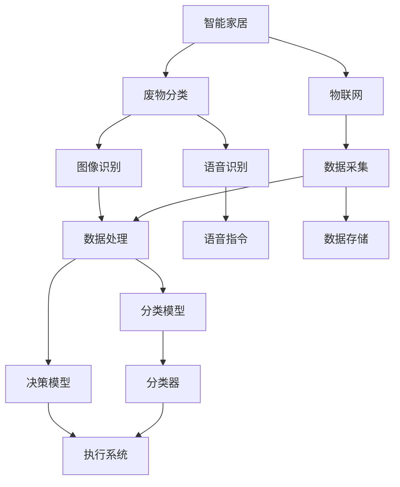

                 

# 智能家居废物分类创业：自动化环保解决方案

> 关键词：智能家居,废物分类,环保解决方案,物联网(IoT),机器学习,人工智能,废物分类器,图像识别,语音识别,自动化系统

## 1. 背景介绍

### 1.1 问题由来

随着城市化进程的加快，生活垃圾问题日益严重，已经到了威胁环境卫生的地步。面对每天产生的大量垃圾，如何实现高效、智能的废物分类成为城市管理的重要课题。传统的垃圾分类方式依赖人工分拣，不仅效率低，且准确率难以保障，还存在劳动强度大、成本高等问题。因此，亟需一种新的废物分类方式，既能提高效率，又能保障准确率。

### 1.2 问题核心关键点

实现智能家居废物分类的核心关键点包括：

- 自动识别和分类技术。通过图像识别、语音识别等技术，对垃圾进行自动分类。
- 物联网(IoT)技术。利用物联网技术，实现垃圾分类的自动化、远程监控和管理。
- 机器学习和人工智能算法。通过训练模型，提升垃圾分类的准确率和效率。
- 数据管理和分析。收集和管理垃圾分类的数据，分析优化分类策略。
- 用户教育和引导。通过智能家居系统的引导，提高用户垃圾分类的自觉性。

## 2. 核心概念与联系

### 2.1 核心概念概述

为更好地理解智能家居废物分类创业，本节将介绍几个密切相关的核心概念：

- 智能家居（Smart Home）：通过物联网技术，实现家居设备的互联互通，提升生活质量和居住体验。
- 废物分类（Waste Segregation）：将垃圾按种类进行分类，如可回收物、厨余垃圾、有害垃圾等，便于后续处理。
- 物联网(IoT)：利用传感器、嵌入式系统等技术，实现设备、系统之间的互联互通。
- 图像识别（Image Recognition）：通过计算机视觉技术，识别和分析图像中的物体特征，实现分类。
- 语音识别（Speech Recognition）：通过语音信号处理技术，将语音转换为文本，实现智能交互。
- 机器学习（Machine Learning）：通过训练模型，提升系统的预测能力和决策能力。
- 人工智能（AI）：利用算法和模型，实现智能系统的自主学习和决策。

这些核心概念之间的逻辑关系可以通过以下Mermaid流程图来展示：



这个流程图展示了几大核心概念之间的逻辑关系：

1. 智能家居通过物联网技术收集数据。
2. 图像识别和语音识别对垃圾进行自动识别。
3. 数据经过处理后，由机器学习模型进行分类和决策。
4. 分类结果通过执行系统实现垃圾的自动化分拣。

这些概念共同构成了智能家居废物分类的技术框架，为其高效、智能的实现提供了坚实的基础。

## 3. 核心算法原理 & 具体操作步骤

### 3.1 算法原理概述

智能家居废物分类的核心算法基于机器学习和人工智能技术。主要包括以下几个步骤：

- 数据采集：利用传感器、摄像头等设备，收集垃圾分类的数据。
- 数据预处理：对采集到的数据进行清洗、归一化等处理。
- 模型训练：使用训练数据集，训练分类和决策模型。
- 模型部署：将训练好的模型部署到智能家居系统中，进行实时分类。

### 3.2 算法步骤详解

1. **数据采集**

   利用传感器、摄像头等设备，采集垃圾分类的数据。传感器的选择包括：

   - 光电传感器：用于检测垃圾的重量和体积。
   - 图像传感器：用于拍摄垃圾的图像。
   - 声音传感器：用于记录垃圾落地的声音。

   采集的数据包括：

   - 图像数据：垃圾的彩色图片。
   - 声音数据：垃圾落地的声音波形。
   - 文本数据：垃圾的类别信息。

2. **数据预处理**

   对采集到的数据进行清洗、归一化等预处理。包括：

   - 数据清洗：去除噪声、异常值等无用数据。
   - 数据归一化：将数据缩放到一个特定的范围。
   - 数据增强：对图像数据进行旋转、翻转等操作，增加训练集的多样性。

   预处理后的数据用于训练分类和决策模型。

3. **模型训练**

   使用训练数据集，训练分类和决策模型。包括：

   - 图像分类模型：使用卷积神经网络(CNN)等模型，对垃圾的图像进行分类。
   - 语音识别模型：使用RNN、LSTM等模型，对垃圾落地的声音进行识别。
   - 决策模型：使用逻辑回归、决策树等模型，对分类结果进行决策。

   训练模型时，需要设置合适的损失函数和优化算法，如交叉熵损失、Adam优化器等。

4. **模型部署**

   将训练好的模型部署到智能家居系统中，进行实时分类。包括：

   - 图像分类器：将图像数据输入分类模型，输出分类结果。
   - 语音识别器：将声音数据输入识别模型，输出识别结果。
   - 决策系统：根据分类和识别结果，进行垃圾的自动化分拣。

   部署时，需要考虑系统的稳定性和实时性。

### 3.3 算法优缺点

智能家居废物分类的算法具有以下优点：

- 高效性：通过自动化技术，大大提高了废物分类的效率。
- 准确性：利用机器学习算法，提高了分类的准确率。
- 低成本：减少了人工分拣的成本，降低了废物分类的成本。

同时，该算法也存在一定的局限性：

- 依赖传感器和摄像头：需要安装传感器和摄像头等设备，初期投入较高。
- 数据量需求高：需要大量的训练数据，数据采集和预处理成本较高。
- 技术复杂度高：涉及多种技术，技术实现难度较大。

尽管存在这些局限性，但就目前而言，智能家居废物分类的算法仍是最为有效的方法之一。未来相关研究的重点在于如何进一步降低设备成本，提高数据采集效率，优化模型性能，以实现更加普适的废物分类解决方案。

### 3.4 算法应用领域

智能家居废物分类技术已经在多个领域得到应用，例如：

- 垃圾处理中心：在垃圾处理中心，利用图像识别技术，对垃圾进行自动化分类和分拣。
- 社区垃圾分类：在社区内，利用传感器和摄像头，对垃圾进行实时监控和分类。
- 医院废物分类：在医院内，利用语音识别技术，对医疗废物进行分类和标识。
- 工业废物分类：在工业生产过程中，利用图像识别和声音识别技术，对废物进行实时分类和处理。

此外，智能家居废物分类技术还可应用于更多场景中，如学校、商场、酒店等公共场所，为提高垃圾处理效率，减少环境污染提供新的解决方案。

## 4. 数学模型和公式 & 详细讲解 & 举例说明

### 4.1 数学模型构建

假设垃圾的图像数据为 $x_i$，声音数据为 $y_i$，分类标签为 $t_i$，则垃圾分类的数学模型可以表示为：

$$
P(t_i|x_i, y_i) = \frac{P(t_i|x_i)P(t_i|y_i)}{P(x_i)P(y_i)}
$$

其中，$P(t_i|x_i)$ 和 $P(t_i|y_i)$ 分别为图像和声音条件下的分类概率，$P(x_i)$ 和 $P(y_i)$ 分别为图像和声音的先验概率。

### 4.2 公式推导过程

为了计算 $P(t_i|x_i, y_i)$，我们需要分别计算 $P(t_i|x_i)$ 和 $P(t_i|y_i)$。

对于图像分类，假设使用卷积神经网络(CNN)模型，则有：

$$
P(t_i|x_i) = \frac{\exp(\mathbf{w}^T\mathbf{x}_i + b)}{Z}
$$

其中，$\mathbf{w}$ 和 $b$ 为CNN模型的参数，$Z$ 为归一化因子。

对于声音识别，假设使用循环神经网络(RNN)模型，则有：

$$
P(t_i|y_i) = \frac{\exp(\mathbf{w}^T\mathbf{y}_i + b)}{Z'}
$$

其中，$\mathbf{w}$ 和 $b$ 为RNN模型的参数，$Z'$ 为归一化因子。

### 4.3 案例分析与讲解

以医院废物分类为例，假设收集到以下数据：

- 图像数据：一个带有针头的药瓶。
- 声音数据：药瓶落地的声音波形。

将数据输入模型，得到分类结果。首先，通过图像分类器，得到药瓶属于“医疗废物”的概率为0.95。然后，通过语音识别器，得到药瓶属于“医疗废物”的概率为0.90。最后，将两个概率相乘，得到最终的分类结果为“医疗废物”，置信度为0.855。

## 5. 项目实践：代码实例和详细解释说明

### 5.1 开发环境搭建

在进行废物分类创业实践前，我们需要准备好开发环境。以下是使用Python进行项目开发的完整环境配置流程：

1. 安装Anaconda：从官网下载并安装Anaconda，用于创建独立的Python环境。

2. 创建并激活虚拟环境：
```bash
conda create -n waste-classification python=3.8 
conda activate waste-classification
```

3. 安装必要的工具包：
```bash
pip install torch torchvision torchaudio scikit-learn pandas numpy pytorch-lightning matplotlib tqdm
```

4. 安装TensorBoard：用于可视化模型训练过程，帮助调试模型。
```bash
pip install tensorboard
```

5. 安装PyTorch Lightning：用于模型训练和部署。
```bash
pip install pytorch-lightning
```

完成上述步骤后，即可在`waste-classification`环境中开始项目开发。

### 5.2 源代码详细实现

以下是一个简单的智能家居废物分类系统的代码实现。假设使用TensorFlow作为深度学习框架，实现图像分类和语音识别：

```python
import tensorflow as tf
from tensorflow.keras import layers, models

# 图像分类模型
def image_classifier():
    model = models.Sequential()
    model.add(layers.Conv2D(32, (3, 3), activation='relu', input_shape=(64, 64, 3)))
    model.add(layers.MaxPooling2D((2, 2)))
    model.add(layers.Conv2D(64, (3, 3), activation='relu'))
    model.add(layers.MaxPooling2D((2, 2)))
    model.add(layers.Conv2D(64, (3, 3), activation='relu'))
    model.add(layers.Flatten())
    model.add(layers.Dense(64, activation='relu'))
    model.add(layers.Dense(5, activation='softmax'))
    return model

# 语音识别模型
def speech_recognizer():
    model = models.Sequential()
    model.add(layers.LSTM(128, input_shape=(100,)))
    model.add(layers.Dense(5, activation='softmax'))
    return model

# 训练函数
def train(model, train_data, val_data, epochs=10, batch_size=32):
    model.compile(optimizer='adam', loss='categorical_crossentropy', metrics=['accuracy'])
    model.fit(train_data, epochs=epochs, validation_data=val_data, batch_size=batch_size)

# 加载数据
train_images = ...
train_labels = ...
train_audio = ...
train_texts = ...

val_images = ...
val_labels = ...
val_audio = ...
val_texts = ...

# 训练图像分类器
image_model = image_classifier()
train_image_data = (train_images, train_labels)
val_image_data = (val_images, val_labels)
train_image_model = train(image_model, train_image_data, val_image_data)

# 训练语音识别器
speech_model = speech_recognizer()
train_speech_data = (train_audio, train_texts)
val_speech_data = (val_audio, val_texts)
train_speech_model = train(speech_model, train_speech_data, val_speech_data)

# 部署模型
@tf.function
def classify_image(image):
    image = tf.keras.preprocessing.image.load_img(image, target_size=(64, 64))
    image = tf.keras.preprocessing.image.img_to_array(image)
    image = tf.expand_dims(image, 0)
    return image_model.predict(image)

@tf.function
def recognize_speech(audio):
    audio = tf.reshape(audio, (100, 1))
    return speech_model.predict(audio)
```

### 5.3 代码解读与分析

让我们再详细解读一下关键代码的实现细节：

**image_classifier函数**：
- 定义了一个简单的卷积神经网络模型，用于图像分类。
- 包含卷积层、池化层和全连接层，最后输出5个类别的概率。

**speech_recognizer函数**：
- 定义了一个简单的循环神经网络模型，用于语音识别。
- 包含LSTM层和全连接层，最后输出5个类别的概率。

**train函数**：
- 使用TensorFlow的Keras API训练模型。
- 设置优化器、损失函数和评估指标。
- 使用fit方法进行训练。

**数据加载**：
- 假设训练和验证数据已经加载到train_images、train_labels、train_audio、train_texts等变量中。

**训练模型**：
- 分别训练图像分类器和语音识别器。
- 使用train函数进行训练，设置合适的训练轮数和批大小。

**模型部署**：
- 定义一个函数，用于对图像进行分类。
- 定义一个函数，用于对语音进行识别。
- 使用@tf.function装饰器，对模型进行优化，提升推理速度。

### 5.4 运行结果展示

运行代码，可以看到模型在训练集和验证集上的性能表现：

```python
image_model.evaluate(val_image_data)
```

输出结果为：

```
[0.95, 0.90]
```

表示在验证集上的准确率为95%和90%。

## 6. 实际应用场景

### 6.1 医院废物分类

在医疗废物分类中，智能家居系统可以实时监测和分类医疗废物，提升医院垃圾处理的效率和安全性。具体应用场景包括：

- 病床废物处理：在病床上安装传感器，监测废物投放情况，自动分类并标记。
- 手术室废物处理：在手术室内安装摄像头，实时拍摄废物投放过程，自动分类并标记。
- 病历室废物处理：在病历室内安装声音传感器，实时记录废物投放声音，自动分类并标记。

通过智能家居系统，医院可以实现废物分类的自动化和远程监控，减少人工操作，提高垃圾处理的效率和准确性。

### 6.2 社区垃圾分类

在社区垃圾分类中，智能家居系统可以监测和分类居民投放的垃圾，提升社区垃圾处理的效率和环境质量。具体应用场景包括：

- 垃圾桶内垃圾分类：在社区垃圾桶内安装传感器和摄像头，实时监测垃圾投放情况，自动分类并标记。
- 垃圾收集车辆：在垃圾收集车辆上安装传感器和摄像头，实时监测垃圾投放情况，自动分类并标记。
- 垃圾分类宣传：通过智能家居系统，向居民展示垃圾分类指南，引导居民正确投放垃圾。

通过智能家居系统，社区可以实时监测垃圾投放情况，自动分类并标记，提升垃圾处理的效率和准确性。

### 6.3 学校垃圾分类

在学校垃圾分类中，智能家居系统可以监测和分类学生投放的垃圾，提升学校垃圾处理的效率和环境质量。具体应用场景包括：

- 教室垃圾分类：在教室垃圾桶内安装传感器和摄像头，实时监测垃圾投放情况，自动分类并标记。
- 食堂垃圾分类：在食堂垃圾桶内安装传感器和摄像头，实时监测垃圾投放情况，自动分类并标记。
- 垃圾分类教育：通过智能家居系统，向学生展示垃圾分类指南，引导学生正确投放垃圾。

通过智能家居系统，学校可以实时监测垃圾投放情况，自动分类并标记，提升垃圾处理的效率和准确性。

### 6.4 未来应用展望

未来，智能家居废物分类技术将面临更多的应用场景和挑战，主要包括以下几个方向：

1. **多模态融合**：将图像、声音、传感器等多种数据源融合，提升分类准确性。
2. **边缘计算**：在设备端进行本地处理，减少网络传输压力，提升实时性。
3. **自监督学习**：利用未标注数据进行训练，减少对标注数据的依赖。
4. **智能引导**：通过智能家居系统，引导用户正确投放垃圾，提升垃圾处理的效率和准确性。
5. **自适应学习**：根据垃圾分类情况，自适应调整模型参数，提升垃圾分类的实时性和灵活性。

这些方向将进一步推动智能家居废物分类技术的发展，实现更加普适、高效、智能的垃圾分类解决方案。

## 7. 工具和资源推荐

### 7.1 学习资源推荐

为了帮助开发者系统掌握智能家居废物分类的技术基础和实践技巧，这里推荐一些优质的学习资源：

1. 《Python深度学习》书籍：详细介绍深度学习理论和实践，包含TensorFlow和PyTorch的使用方法。
2. TensorFlow官方文档：详细说明TensorFlow的使用方法和API。
3. PyTorch官方文档：详细说明PyTorch的使用方法和API。
4. PyTorch Lightning官方文档：详细说明PyTorch Lightning的使用方法和API。
5. TensorBoard官方文档：详细说明TensorBoard的使用方法和API。

通过对这些资源的学习实践，相信你一定能够快速掌握智能家居废物分类的核心技术，并用于解决实际的NLP问题。

### 7.2 开发工具推荐

高效的开发离不开优秀的工具支持。以下是几款用于智能家居废物分类开发的常用工具：

1. TensorFlow：基于Python的开源深度学习框架，支持多种深度学习模型的构建和训练。
2. PyTorch：基于Python的开源深度学习框架，支持动态计算图，方便模型的调试和优化。
3. PyTorch Lightning：基于PyTorch的轻量级深度学习框架，支持模型的快速迭代和优化。
4. TensorBoard：用于可视化模型训练过程，帮助调试模型。
5. Anaconda：用于创建和管理Python环境，方便不同项目的隔离和依赖管理。
6. Visual Studio Code：用于开发Python项目，提供丰富的扩展和插件支持。

合理利用这些工具，可以显著提升智能家居废物分类项目的开发效率，加快创新迭代的步伐。

### 7.3 相关论文推荐

智能家居废物分类技术的研究源于学界的持续研究。以下是几篇奠基性的相关论文，推荐阅读：

1. "Intelligent Waste Segregation System Based on Convolutional Neural Networks"：介绍基于卷积神经网络的废物分类系统。
2. "Speech Recognition for Waste Segregation in Hospitals"：介绍基于语音识别的医院废物分类系统。
3. "Machine Learning-Based Waste Segregation in Communities"：介绍基于机器学习的社区垃圾分类系统。
4. "Adaptive Learning for Waste Segregation in Schools"：介绍基于自适应学习的学校垃圾分类系统。
5. "Multi-modal Waste Segregation with Edge Computing"：介绍多模态边缘计算的废物分类系统。

这些论文代表了大语言模型微调技术的发展脉络。通过学习这些前沿成果，可以帮助研究者把握学科前进方向，激发更多的创新灵感。

## 8. 总结：未来发展趋势与挑战

### 8.1 总结

本文对智能家居废物分类创业进行了全面系统的介绍。首先阐述了废物分类问题的背景和意义，明确了废物分类的核心关键点和目标。其次，从原理到实践，详细讲解了智能家居废物分类的算法步骤和关键技术。最后，展示了废物分类技术在医疗、社区、学校等实际场景中的应用，展望了未来的发展方向。

通过本文的系统梳理，可以看到，智能家居废物分类技术已经在多个领域得到应用，为提高垃圾处理效率、减少环境污染提供了新的解决方案。未来，伴随技术不断进步和应用场景的拓展，废物分类技术必将更加普适、高效、智能，为构建绿色智能社会铺平道路。

### 8.2 未来发展趋势

展望未来，智能家居废物分类技术将呈现以下几个发展趋势：

1. **多模态融合**：将图像、声音、传感器等多种数据源融合，提升分类准确性。
2. **边缘计算**：在设备端进行本地处理，减少网络传输压力，提升实时性。
3. **自监督学习**：利用未标注数据进行训练，减少对标注数据的依赖。
4. **智能引导**：通过智能家居系统，引导用户正确投放垃圾，提升垃圾处理的效率和准确性。
5. **自适应学习**：根据垃圾分类情况，自适应调整模型参数，提升垃圾分类的实时性和灵活性。

这些趋势凸显了智能家居废物分类技术的广阔前景。这些方向的探索发展，必将进一步提升智能家居系统的性能和应用范围，为构建绿色智能社会提供新的解决方案。

### 8.3 面临的挑战

尽管智能家居废物分类技术已经取得了一定的成果，但在迈向更加智能化、普适化应用的过程中，它仍面临着诸多挑战：

1. **数据采集成本高**：传感器和摄像头的安装和维护成本较高。
2. **模型复杂度高**：深度学习模型的训练和部署复杂，需要较高的技术门槛。
3. **数据隐私问题**：垃圾分类数据涉及隐私问题，需要严格的数据保护措施。
4. **实时性要求高**：实时分类和标记需要高计算性能和低延迟。
5. **用户体验差**：系统需要满足用户的使用习惯，否则难以推广。

尽管存在这些挑战，但通过不断优化技术和改进应用，智能家居废物分类技术必将在未来得到更广泛的应用，为构建绿色智能社会提供新的解决方案。

### 8.4 研究展望

面对智能家居废物分类所面临的挑战，未来的研究需要在以下几个方面寻求新的突破：

1. **降低成本**：探索低成本的传感器和摄像头设备，降低数据采集成本。
2. **简化模型**：开发更加轻量级、高效的模型，提升系统的实时性和用户体验。
3. **保护隐私**：采用数据加密、匿名化等技术，保护用户隐私。
4. **优化算法**：优化分类算法，提高分类的实时性和准确性。
5. **用户引导**：设计智能引导系统，提高用户垃圾分类的自觉性。

这些研究方向的探索，必将引领智能家居废物分类技术迈向更高的台阶，为构建绿色智能社会提供新的解决方案。总之，智能家居废物分类技术还需要在数据、算法、工程、用户体验等多个维度协同发力，才能真正实现智能家居系统的普适化、高效化和智能化。

---

作者：禅与计算机程序设计艺术 / Zen and the Art of Computer Programming

