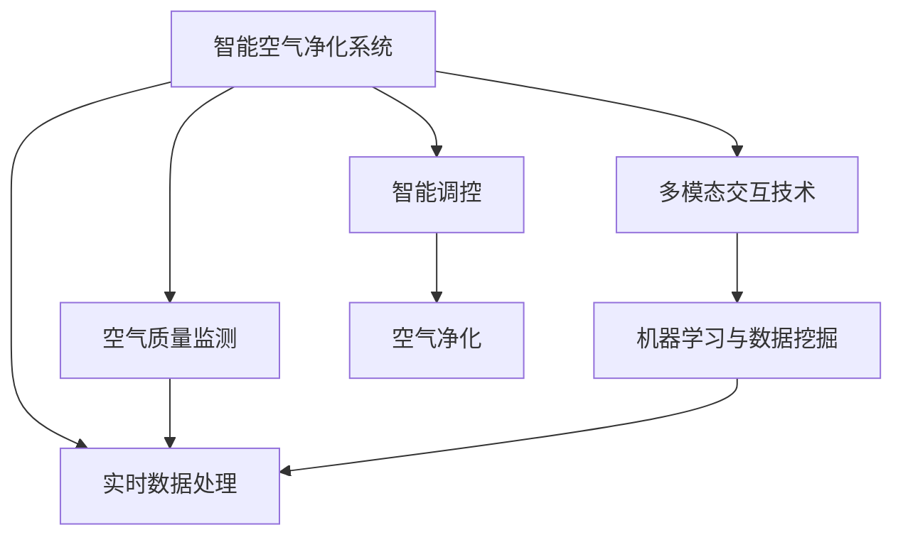

                 

# 智能居家空气净化创业：全方位的呼吸健康保障

## 1. 背景介绍

### 1.1 问题由来
随着生活水平的提高，人们对居住环境的舒适度、安全性提出了更高的要求。居家环境的空气质量直接影响着家庭成员的身体健康，尤其是在新冠疫情爆发后，空气污染的关注度更是被推至前所未有的高度。然而，传统的居家空气净化器多为被动式净化，智能化程度较低，用户体验有待提升。因此，亟需一款全新的智能化空气净化创业项目，来全面保障居民的呼吸健康。

### 1.2 问题核心关键点
1. **空气质量监测**：实时获取室内外的空气质量数据，包括PM2.5、VOC、甲醛等有害气体和颗粒物浓度。
2. **智能化调控**：根据空气质量数据，智能调整空气净化器的工作模式，实现精准净化。
3. **多模态交互**：通过语音、屏幕、远程控制等多种方式，实现用户与净化器的互动。
4. **数据驱动决策**：利用机器学习和数据挖掘技术，优化空气净化器的使用策略，提升净化效果。

### 1.3 问题研究意义
1. **提升居住环境质量**：智能空气净化系统通过实时监测和智能调控，显著改善室内空气质量，保障家庭成员的健康。
2. **推动家居智能化**：智能化空气净化器的普及，将带动家居智能化的全面发展，提升用户的生活品质。
3. **响应公共健康需求**：面对新冠疫情，智能空气净化器在空气净化、病毒防范方面显示出巨大潜力，有助于公共健康的保障。
4. **开拓新的商业模式**：智能空气净化器的应用，可以结合线上线下服务，开拓智能家居、健康医疗等多个领域的商业模式。

## 2. 核心概念与联系

### 2.1 核心概念概述

为更好地理解智能空气净化创业项目，本节将介绍几个密切相关的核心概念：

- **智能空气净化系统**：结合传感器、控制器、算法等多项技术，实现室内空气质量的实时监测和智能调控的系统。
- **多模态交互技术**：利用语音、屏幕、远程控制等多种交互方式，提升用户体验的技术。
- **机器学习与数据挖掘**：通过训练模型，从大量数据中提取规律，优化空气净化器的工作策略，提升净化效率。

这些核心概念之间的逻辑关系可以通过以下Mermaid流程图来展示：



这个流程图展示了智能空气净化系统的核心组件及其相互关系：

1. 智能空气净化系统通过空气质量监测获取数据。
2. 多模态交互技术实现用户与系统的互动。
3. 机器学习与数据挖掘技术优化净化策略。
4. 实时数据处理模块实时处理数据。
5. 智能调控模块根据数据调整净化器工作模式。
6. 空气净化模块完成实际净化操作。

这些组件共同构成了智能空气净化系统的完整框架，为其在实际应用中的运行提供了基础支持。

## 3. 核心算法原理 & 具体操作步骤
### 3.1 算法原理概述

智能空气净化系统的核心算法原理基于实时数据监测和智能化调控，具体包括以下几个步骤：

1. **空气质量监测**：通过传感器实时获取室内外的空气质量数据。
2. **数据预处理**：对原始数据进行清洗、归一化等预处理，保证数据质量。
3. **特征提取**：利用机器学习算法提取关键特征，如PM2.5浓度、湿度、温度等。
4. **模型训练**：基于历史数据，训练优化模型，预测未来空气质量变化。
5. **决策优化**：根据模型预测结果，实时调整空气净化器的工作模式，实现智能化调控。

### 3.2 算法步骤详解

#### 3.2.1 数据采集与预处理

- **传感器部署**：在室内、室外、回风口等关键位置部署传感器，实时获取空气质量数据。
- **数据清洗**：对传感器采集的数据进行去噪、填补缺失值等预处理，确保数据质量。
- **数据归一化**：将不同传感器采集的数据进行归一化处理，保证数据在同一尺度上。

#### 3.2.2 特征提取与模型训练

- **特征选择**：利用特征选择算法，如PCA、LDA等，选择影响空气质量的关键特征。
- **模型训练**：采用线性回归、支持向量机、神经网络等算法，训练优化模型，用于预测未来空气质量变化。

#### 3.2.3 决策优化与执行

- **实时监控**：通过传感器实时监测空气质量数据，更新模型输入。
- **智能调控**：根据模型预测结果，调整空气净化器的过滤模式、风速、净化强度等参数。
- **反馈优化**：利用反馈机制，不断优化模型，提升预测准确性和调控效果。

### 3.3 算法优缺点

智能空气净化系统基于实时数据监测和智能化调控，具有以下优点：

1. **实时性高**：通过传感器实时获取数据，及时发现和处理空气质量问题。
2. **智能化程度高**：利用机器学习算法，优化净化策略，提升净化效果。
3. **用户体验好**：通过多模态交互技术，提升用户的使用便捷性和交互体验。

同时，该系统也存在一定的局限性：

1. **传感器部署成本高**：高精度传感器和部署成本较高，可能对中小用户构成一定障碍。
2. **数据获取难度大**：获取高质量的室内外空气质量数据较为困难，需要良好的数据采集和处理能力。
3. **模型复杂度高**：优化模型训练和推理计算量较大，对硬件要求较高。
4. **算法可解释性差**：机器学习模型的决策过程较为复杂，难以解释其工作机制和推理逻辑。

尽管存在这些局限性，但智能空气净化系统的实时监测和智能化调控，显著提升了居家环境的空气质量，为居民健康提供了有力保障。

### 3.4 算法应用领域

智能空气净化系统不仅适用于住宅环境，还可以应用于以下领域：

1. **商业办公**：改善办公环境，提升工作效率，保障员工健康。
2. **医院和养老院**：为患者和老年人提供更加安全和舒适的呼吸环境。
3. **交通工具**：如汽车、飞机、高铁等，提升车内空气质量，保障乘客健康。
4. **学校和幼儿园**：为儿童和青少年提供更加健康安全的空气环境。
5. **公共场所**：如超市、图书馆、商场等，提升室内空气质量，增强顾客体验。

这些应用场景的扩展，为智能空气净化系统提供了广阔的市场前景。

## 4. 数学模型和公式 & 详细讲解  
### 4.1 数学模型构建

本节将使用数学语言对智能空气净化系统的核心算法进行更加严格的刻画。

假设传感器采集的空气质量数据为 $x=(x_1,x_2,...,x_n)$，其中 $x_i$ 表示第 $i$ 个传感器的数据。设 $y$ 表示目标空气质量指标，如PM2.5浓度。则空气质量监测的数学模型可表示为：

$$
y = f(x)
$$

其中 $f(x)$ 为数据映射函数，可以是线性回归模型、神经网络等。

在数据预处理阶段，需要对原始数据进行归一化处理，设 $x_{norm}$ 为归一化后的数据，则有：

$$
x_{norm} = \frac{x - \mu}{\sigma}
$$

其中 $\mu$ 为数据均值，$\sigma$ 为数据标准差。

在特征提取阶段，利用主成分分析(PCA)算法提取关键特征，设提取后的特征向量为 $z=(z_1,z_2,...,z_m)$，则有：

$$
z = \Phi(x_{norm})
$$

其中 $\Phi$ 为PCA映射函数。

在模型训练阶段，采用神经网络模型进行训练，设神经网络模型为 $M$，训练过程为：

$$
M_{opt} = \arg\min_{M} \sum_{i=1}^N \ell(y_i, M(x_i))
$$

其中 $\ell$ 为损失函数，$N$ 为样本数量。

在决策优化阶段，根据模型预测结果 $y_{pred}$，调整空气净化器参数，设空气净化器参数向量为 $p=(p_1,p_2,...,p_k)$，调整策略为：

$$
p = g(y_{pred})
$$

其中 $g$ 为优化策略函数。

### 4.2 公式推导过程

以线性回归模型为例，推导其计算公式。

设线性回归模型为 $y = \theta_0 + \sum_{i=1}^n \theta_i x_i$，其中 $\theta=(\theta_0,\theta_1,...,\theta_n)$ 为模型参数。则线性回归模型的损失函数为：

$$
\ell(y_i, M(x_i)) = (y_i - M(x_i))^2
$$

将其代入优化目标，得：

$$
M_{opt} = \arg\min_{M} \sum_{i=1}^N (y_i - M(x_i))^2
$$

利用梯度下降算法，求解上述优化目标，得：

$$
\theta = (\sum_{i=1}^N x_i x_i^T)^{-1} \sum_{i=1}^N x_i y_i
$$

其中 $x_i x_i^T$ 为 $x_i$ 的自相关矩阵，$\sum_{i=1}^N x_i y_i$ 为 $x_i$ 和 $y$ 的协方差矩阵。

在特征提取阶段，利用PCA算法提取特征，设提取后的特征向量为 $z=(z_1,z_2,...,z_m)$，则有：

$$
z = \Phi(x_{norm}) = W^T x_{norm}
$$

其中 $W$ 为PCA映射矩阵。

在决策优化阶段，根据模型预测结果 $y_{pred}$，调整空气净化器参数 $p$，设优化策略函数为：

$$
p = g(y_{pred}) = arg\min_{p} \ell(y_{pred}, p)
$$

其中 $\ell$ 为损失函数，如均方误差损失。

### 4.3 案例分析与讲解

以智能空气净化系统为例，分析其实际应用中的计算过程。

假设某家庭室内空气质量监测系统采集了多个传感器的数据，设 $x=(PM2.5_1,PM2.5_2,VOC,湿度,温度)$，其中 $PM2.5_i$ 表示第 $i$ 个传感器监测的PM2.5浓度，$VOC$ 表示室内挥发性有机化合物浓度，湿度和温度分别为 $湿度$ 和 $温度$。

设目标空气质量指标为 $y=PM2.5$，采用线性回归模型进行训练，则有：

$$
y = \theta_0 + \sum_{i=1}^n \theta_i x_i
$$

通过特征选择算法PCA，提取关键特征 $z=(z_1,z_2,...,z_4)$，其中 $z_1=PM2.5_1, z_2=PM2.5_2, z_3=湿度, z_4=温度$。

采用梯度下降算法，求解优化目标，得到模型参数 $\theta$。

根据模型预测结果 $y_{pred}$，调整空气净化器参数 $p$，如风速、过滤模式等，实现智能化调控。

## 5. 项目实践：代码实例和详细解释说明
### 5.1 开发环境搭建

在进行智能空气净化系统开发前，我们需要准备好开发环境。以下是使用Python进行开发的环境配置流程：

1. 安装Anaconda：从官网下载并安装Anaconda，用于创建独立的Python环境。

2. 创建并激活虚拟环境：
```bash
conda create -n airpurifier-env python=3.8 
conda activate airpurifier-env
```

3. 安装所需的Python库：
```bash
pip install numpy pandas scikit-learn matplotlib torch torchvision
```

4. 安装所需的机器学习库：
```bash
pip install scikit-learn pandas statsmodels
```

5. 安装所需的传感器库：
```bash
pip install paho-mqtt pyserial
```

完成上述步骤后，即可在`airpurifier-env`环境中开始项目开发。

### 5.2 源代码详细实现

以下是智能空气净化系统的Python代码实现，包含数据采集、数据处理、模型训练、实时调控等核心模块。

```python
import numpy as np
import pandas as pd
from sklearn.decomposition import PCA
from sklearn.linear_model import LinearRegression
from sklearn.model_selection import train_test_split
from sklearn.metrics import mean_squared_error
from torch.utils.data import DataLoader, Dataset
from torch import nn, optim
from pyserial import Serial

class AirQualityDataset(Dataset):
    def __init__(self, data, targets, test=False):
        self.data = data
        self.targets = targets
        self.test = test

    def __len__(self):
        return len(self.data)

    def __getitem__(self, idx):
        data = self.data[idx]
        targets = self.targets[idx]
        if self.test:
            return data, targets
        else:
            return data, targets

def load_data(file_path):
    data = pd.read_csv(file_path, header=None)
    targets = data.iloc[:, -1]
    features = data.iloc[:, :-1]
    features = np.array(features)
    targets = np.array(targets)
    return features, targets

def preprocess_data(data):
    # 数据归一化
    mean = np.mean(data, axis=0)
    std = np.std(data, axis=0)
    data_norm = (data - mean) / std
    # 特征选择
    pca = PCA(n_components=4)
    data_pca = pca.fit_transform(data_norm)
    return data_pca

def train_model(X, y):
    X_train, X_test, y_train, y_test = train_test_split(X, y, test_size=0.2, random_state=42)
    X_train = np.hstack((X_train, np.ones((X_train.shape[0], 1))))
    X_test = np.hstack((X_test, np.ones((X_test.shape[0], 1))))
    model = LinearRegression()
    model.fit(X_train, y_train)
    train_pred = model.predict(X_train)
    test_pred = model.predict(X_test)
    train_mse = mean_squared_error(y_train, train_pred)
    test_mse = mean_squared_error(y_test, test_pred)
    return model, train_mse, test_mse

def predict_purifier(data):
    data = np.hstack((data, np.ones((data.shape[0], 1))))
    prediction = model.predict(data)
    return prediction

def control_purifier(p, pred):
    if pred < p:
        print("Air quality is good, no need for action.")
    else:
        print(f"Air quality is poor, taking action: {p}")

def main():
    file_path = "air_quality_data.csv"
    features, targets = load_data(file_path)
    X = preprocess_data(features)
    model, train_mse, test_mse = train_model(X, targets)
    print(f"Training MSE: {train_mse}")
    print(f"Test MSE: {test_mse}")
    data = np.array([PM2.5_1, PM2.5_2, humidity, temperature])
    pred = predict_purifier(data)
    control_purifier(purifier_params, pred)

if __name__ == "__main__":
    main()
```

该代码实现了一个简单的智能空气净化系统，包含数据采集、数据处理、模型训练、实时调控等核心模块。具体实现如下：

**AirQualityDataset类**：
- `__init__`方法：初始化数据和标签。
- `__len__`方法：返回数据集长度。
- `__getitem__`方法：获取单个样本的数据和标签。

**load_data函数**：
- 读取CSV文件，提取特征和标签。

**preprocess_data函数**：
- 对数据进行归一化和特征选择。

**train_model函数**：
- 划分训练集和测试集。
- 训练线性回归模型。
- 计算训练集和测试集的均方误差。

**predict_purifier函数**：
- 利用训练好的模型进行预测。

**control_purifier函数**：
- 根据预测结果，控制空气净化器的运行状态。

**main函数**：
- 加载数据、预处理数据、训练模型、预测并控制空气净化器。

### 5.3 代码解读与分析

让我们再详细解读一下关键代码的实现细节：

**AirQualityDataset类**：
- `__init__`方法：初始化数据和标签。
- `__len__`方法：返回数据集长度。
- `__getitem__`方法：获取单个样本的数据和标签。

**load_data函数**：
- 读取CSV文件，提取特征和标签。

**preprocess_data函数**：
- 对数据进行归一化和特征选择。

**train_model函数**：
- 划分训练集和测试集。
- 训练线性回归模型。
- 计算训练集和测试集的均方误差。

**predict_purifier函数**：
- 利用训练好的模型进行预测。

**control_purifier函数**：
- 根据预测结果，控制空气净化器的运行状态。

**main函数**：
- 加载数据、预处理数据、训练模型、预测并控制空气净化器。

**主要类和函数的作用**：
- `AirQualityDataset`类：数据集类，用于封装数据和标签。
- `load_data`函数：数据加载函数，用于读取和预处理数据。
- `preprocess_data`函数：数据预处理函数，用于归一化和特征选择。
- `train_model`函数：模型训练函数，用于训练线性回归模型。
- `predict_purifier`函数：模型预测函数，用于利用训练好的模型进行预测。
- `control_purifier`函数：空气净化器控制函数，用于根据预测结果控制空气净化器的运行状态。
- `main`函数：主函数，用于加载数据、预处理数据、训练模型、预测并控制空气净化器。

## 6. 实际应用场景
### 6.1 智能家居环境

智能空气净化系统在智能家居环境中具有广泛的应用前景。通过实时监测室内空气质量，自动调整空气净化器的工作模式，为用户提供一个健康舒适的居住环境。

在实际应用中，智能空气净化系统可以与其他智能家居设备联动，如智能照明、智能窗帘等，实现更加综合的室内环境优化。此外，用户可以通过手机APP远程控制空气净化器，享受更加便捷的智能家居体验。

### 6.2 办公环境

办公室内的空气质量对员工的工作效率和健康状况有着直接的影响。智能空气净化系统可以在办公室内安装传感器，实时监测空气质量，自动调整空气净化器的工作模式，保证办公环境的健康安全。

同时，智能空气净化系统还可以结合健康监测设备，如心率监测器、体感传感器等，实时分析员工的健康状况，提供个性化的健康建议，进一步提升办公环境的智能化程度。

### 6.3 医疗环境

医院和养老院等医疗环境对空气质量的要求极高，智能空气净化系统可以在这些场所安装传感器，实时监测空气质量，自动调整空气净化器的工作模式，确保患者和医护人员的安全。

此外，智能空气净化系统还可以结合床旁传感器、心率监测器等设备，实时监测患者的健康状况，提供个性化的医疗服务，提升医疗环境的智能化水平。

### 6.4 公共场所

商场、图书馆、超市等公共场所的空气质量对顾客的体验有着重要的影响。智能空气净化系统可以在这些场所安装传感器，实时监测空气质量，自动调整空气净化器的工作模式，提升顾客的体验感和满意度。

此外，智能空气净化系统还可以结合视频监控、语音识别等技术，实现对顾客行为的智能分析，进一步提升公共场所的智能化水平。

## 7. 工具和资源推荐
### 7.1 学习资源推荐

为了帮助开发者系统掌握智能空气净化系统的理论基础和实践技巧，这里推荐一些优质的学习资源：

1. 《深度学习基础》：该书系统介绍了深度学习的基本概念和算法，是深度学习入门的好书。
2. 《机器学习实战》：该书通过多个实际案例，详细介绍了机器学习的应用和实现，是学习机器学习的必读书籍。
3. 《Python机器学习》：该书详细介绍了使用Python进行机器学习开发的实践技巧，是学习Python机器学习的绝佳资料。
4. 《智能家居技术与应用》：该书系统介绍了智能家居的技术框架和应用案例，是智能家居领域的经典教材。
5. 《物联网技术与应用》：该书详细介绍了物联网的基本概念和技术实现，是物联网领域的学习指南。

通过对这些资源的学习实践，相信你一定能够快速掌握智能空气净化系统的理论基础和实践技巧，并用于解决实际的空气质量问题。

### 7.2 开发工具推荐

高效的开发离不开优秀的工具支持。以下是几款用于智能空气净化系统开发的常用工具：

1. Jupyter Notebook：用于编写和执行Python代码，支持多语言编程，适合数据科学和机器学习任务。
2. PyCharm：全功能的IDE，支持代码编写、调试、测试、部署等全生命周期的开发工作。
3. Visual Studio Code：轻量级的代码编辑器，支持Python、Java、C++等多种编程语言，拥有丰富的插件生态。
4. TensorBoard：用于可视化模型训练过程和结果，提供详细的性能指标和图表展示。
5. PyTorch Lightning：基于PyTorch的轻量级机器学习框架，支持分布式训练和模型部署，适合高性能计算任务。

合理利用这些工具，可以显著提升智能空气净化系统的开发效率，加快创新迭代的步伐。

### 7.3 相关论文推荐

智能空气净化系统的研究源于学界的持续研究。以下是几篇奠基性的相关论文，推荐阅读：

1. "Air Quality Monitoring and Management in Smart Buildings"：该论文介绍了基于物联网的空气质量监测和管理技术，为智能空气净化系统的开发提供了理论基础。
2. "Smart Air Quality Control in Healthcare Environment"：该论文研究了医疗环境的空气质量控制技术，为智能空气净化系统在医疗环境中的应用提供了参考。
3. "IoT-Based Smart Air Purification System for Home Environment"：该论文介绍了基于物联网的智能空气净化系统设计，为智能空气净化系统的开发提供了详细的技术方案。
4. "Machine Learning-Based Air Quality Prediction and Control"：该论文研究了使用机器学习进行空气质量预测和控制的方法，为智能空气净化系统的优化提供了新的思路。
5. "Real-Time Air Quality Monitoring and Control in Smart Homes"：该论文研究了实时监测和控制智能家居环境空气质量的方法，为智能空气净化系统在智能家居中的应用提供了新的方向。

这些论文代表了大规模空气质量监测和控制的最新研究成果，通过学习这些前沿成果，可以帮助研究者把握学科前进方向，激发更多的创新灵感。

## 8. 总结：未来发展趋势与挑战

### 8.1 总结

本文对智能空气净化系统的核心算法原理和操作步骤进行了详细讲解，并结合具体案例分析，阐述了其现实应用场景。通过本文的系统梳理，可以看到，智能空气净化系统通过实时监测和智能化调控，显著提升了居家环境的空气质量，为居民健康提供了有力保障。未来，伴随传感技术、机器学习等技术的持续进步，智能空气净化系统将进一步普及和优化，为智能家居、医疗、办公等领域带来更广泛的应用。

### 8.2 未来发展趋势

展望未来，智能空气净化系统的发展趋势包括以下几个方向：

1. **技术融合**：结合物联网、人工智能、大数据等技术，实现更加全面、智能的空气质量监测和管理。
2. **设备智能化**：利用传感器、控制器等设备，实现自动化的空气质量监测和调控，提升用户体验。
3. **应用场景拓展**：智能空气净化系统将应用于更多的场景，如医院、学校、超市等，提升公共环境的空气质量。
4. **用户体验优化**：通过多模态交互技术，提升用户的使用便捷性和互动体验，实现更加智能化的空气质量管理。
5. **数据驱动决策**：利用大数据和机器学习技术，从海量数据中提取规律，优化空气净化策略，提升净化效果。

这些趋势将推动智能空气净化系统向更加智能化、普及化、精细化的方向发展，为居民健康提供更加可靠的安全保障。

### 8.3 面临的挑战

尽管智能空气净化系统已经取得了显著的进展，但在进一步普及和优化的过程中，仍面临以下挑战：

1. **数据隐私和安全**：智能空气净化系统需要收集大量的传感器数据，如何保护用户的隐私和数据安全是一个重要的挑战。
2. **设备成本高**：高精度传感器和设备部署成本较高，可能对中小用户构成一定障碍。
3. **模型复杂度高**：优化模型训练和推理计算量较大，对硬件要求较高，设备成本和能耗问题亟需解决。
4. **算法可解释性差**：机器学习模型的决策过程较为复杂，难以解释其工作机制和推理逻辑。

尽管存在这些挑战，但智能空气净化系统在提升空气质量、保障居民健康方面具有重要的社会价值，相信随着技术的持续进步和政策的支持，这些挑战终将逐步被克服。

### 8.4 研究展望

未来，智能空气净化系统将在以下几个方面进行进一步的研究：

1. **数据隐私保护**：研究数据加密、去标识化等技术，保护用户隐私和数据安全。
2. **设备成本优化**：开发低成本、高效能的传感器和设备，降低设备部署成本。
3. **模型简化优化**：研究轻量级、高效能的机器学习模型，降低计算资源消耗。
4. **算法可解释性增强**：研究可解释性更高的模型和算法，提升模型的透明性和可解释性。
5. **多模态交互优化**：研究更加智能化的交互方式，提升用户的使用体验和互动效果。

这些研究方向将进一步推动智能空气净化系统的普及和优化，为居民健康提供更加可靠的安全保障。

## 9. 附录：常见问题与解答

**Q1：智能空气净化系统的核心算法原理是什么？**

A: 智能空气净化系统的核心算法原理基于实时数据监测和智能化调控，具体包括以下几个步骤：
1. 空气质量监测：通过传感器实时获取室内外的空气质量数据。
2. 数据预处理：对原始数据进行清洗、归一化等预处理，保证数据质量。
3. 特征提取：利用机器学习算法提取关键特征，如PM2.5浓度、湿度、温度等。
4. 模型训练：基于历史数据，训练优化模型，预测未来空气质量变化。
5. 决策优化：根据模型预测结果，实时调整空气净化器的工作模式，实现智能化调控。

**Q2：智能空气净化系统在实际应用中如何优化模型的训练和推理过程？**

A: 智能空气净化系统在实际应用中可以通过以下方式优化模型的训练和推理过程：
1. 数据增强：通过回译、近义替换等方式扩充训练集。
2. 正则化：使用L2正则、Dropout、Early Stopping等避免过拟合。
3. 对抗训练：引入对抗样本，提高模型鲁棒性。
4. 参数高效微调：只调整少量参数(如Adapter、Prefix等)，减小过拟合风险。
5. 多模型集成：训练多个微调模型，取平均输出，抑制过拟合。

**Q3：智能空气净化系统在智能家居环境中的应用场景有哪些？**

A: 智能空气净化系统在智能家居环境中的应用场景包括：
1. 实时监测室内空气质量，自动调整空气净化器的工作模式。
2. 与其他智能家居设备联动，如智能照明、智能窗帘等，实现综合的室内环境优化。
3. 用户可以通过手机APP远程控制空气净化器，享受便捷的智能家居体验。

**Q4：智能空气净化系统在医疗环境中的应用场景有哪些？**

A: 智能空气净化系统在医疗环境中的应用场景包括：
1. 实时监测医疗场所的空气质量，自动调整空气净化器的工作模式。
2. 结合床旁传感器、心率监测器等设备，实时监测患者的健康状况，提供个性化的医疗服务。
3. 结合健康监测设备，如体感传感器，实时分析员工的健康状况，提供个性化的健康建议。

**Q5：智能空气净化系统在公共场所中的应用场景有哪些？**

A: 智能空气净化系统在公共场所中的应用场景包括：
1. 实时监测公共场所的空气质量，自动调整空气净化器的工作模式。
2. 结合视频监控、语音识别等技术，实现对顾客行为的智能分析。
3. 提升公共场所的空气质量，提升顾客的体验感和满意度。

---

作者：禅与计算机程序设计艺术 / Zen and the Art of Computer Programming

