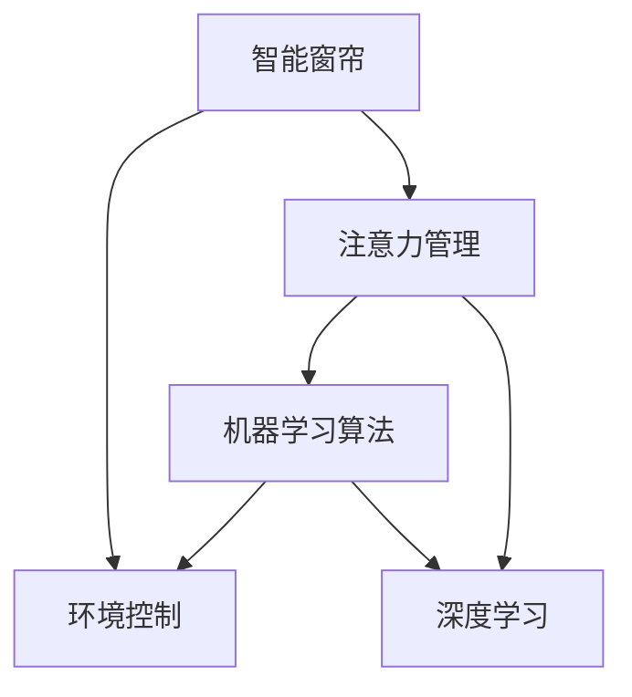

                 

# 智能窗帘的环境控制与注意力管理

## 1. 背景介绍

### 1.1 问题由来
智能窗帘作为一种典型的家庭自动化产品，在提升用户生活质量方面发挥了重要作用。它们可以通过智能控制系统自动调节室内光线，从而保证室内环境的最佳状态。随着人工智能技术的发展，智能窗帘的控制方式也逐渐从简单的定时控制转向了更加智能化的自动化控制。

### 1.2 问题核心关键点
智能窗帘的环境控制主要依赖于光传感器和环境变化监测器收集的数据，通过机器学习算法进行分析，然后自动调整窗帘的开合程度。但这种控制方式存在一定局限性，例如需要预先设定固定的控制策略，且对异常情况如天气突变、电源故障等缺乏自适应能力。

近年来，随着注意力管理理论的引入，智能窗帘的环境控制进入了一个新的阶段。该方法通过理解用户对室内环境的关注程度，动态调整窗帘的开合状态，从而提升用户的满意度和体验。这一技术不仅提高了窗帘的智能化程度，还为窗帘控制提供了更全面的决策依据。

### 1.3 问题研究意义
智能窗帘的环境控制与注意力管理的研究对于提升智能家居的智能化水平、优化用户生活体验具有重要意义：

1. **用户体验优化**：通过动态调整窗帘状态，智能窗帘能够更好地满足用户对室内环境的个性化需求。
2. **能效提升**：智能窗帘能够根据环境变化和用户需求自动调节，避免了不必要的能源浪费。
3. **自动化程度提高**：采用注意力管理理论，智能窗帘的自动化程度得到了提升，减少了用户对环境控制的人工干预。
4. **数据驱动决策**：通过收集和分析环境数据，智能窗帘能够做出更为精准的决策。
5. **技术创新**：这一研究领域融合了机器学习、深度学习、注意力机制等多项前沿技术，为未来智能家居的发展提供了技术创新方向。

## 2. 核心概念与联系

### 2.1 核心概念概述

本节将介绍智能窗帘环境控制与注意力管理的几个核心概念：

- **智能窗帘**：通过自动控制窗帘的开合，实现室内环境的调节，提高用户的生活质量。
- **环境控制**：智能窗帘对室内光线、温度、湿度等环境因素的调节和控制。
- **注意力管理**：通过对用户注意力的分析，动态调整窗帘的开合状态，以实现更精准的环境控制。
- **机器学习算法**：利用历史数据和实时数据，训练模型进行环境预测和决策。
- **深度学习**：使用神经网络进行数据分析和模式识别。
- **注意力机制**：在深度学习模型中，用于提升模型对重要信息的关注程度，提高模型决策的精准度。

这些核心概念之间的逻辑关系可以通过以下Mermaid流程图来展示：



这个流程图展示出智能窗帘环境控制与注意力管理的核心概念及其之间的关系：

1. 智能窗帘通过环境控制实现室内环境的调节。
2. 注意力管理通过对用户注意力的分析，提升环境控制的精准度。
3. 机器学习和深度学习技术用于训练模型，优化环境控制和注意力管理。

## 3. 核心算法原理 & 具体操作步骤
### 3.1 算法原理概述

智能窗帘的环境控制与注意力管理的核心算法原理是机器学习和深度学习技术在环境数据分析中的应用。具体来说，系统通过收集室内外环境数据（如光照强度、温度、湿度等）和用户行为数据（如用户是否在家、活动时间等），构建环境模型和注意力模型，动态调整窗帘的开合程度。

环境模型通常使用回归模型或分类模型进行构建，用于预测环境变化趋势和用户行为。注意力模型则通过计算用户注意力分布，动态调整窗帘的开合状态，以提升用户的满意度。

### 3.2 算法步骤详解

基于注意力管理的智能窗帘环境控制可以分为以下几个关键步骤：

**Step 1: 数据采集与预处理**
- 安装各种传感器（如光敏传感器、温度传感器、湿度传感器等），收集室内外环境数据。
- 安装摄像头和人体检测设备，获取用户行为数据。
- 对采集到的数据进行清洗、去噪和归一化处理，准备用于后续模型的训练和推理。

**Step 2: 环境模型训练**
- 使用历史数据和实时数据，训练回归模型或分类模型，预测环境变化趋势。
- 模型可以采用线性回归、支持向量机、随机森林等传统机器学习算法，或使用深度神经网络。

**Step 3: 注意力模型训练**
- 通过计算用户对环境的关注点，训练注意力模型，动态调整窗帘的开合状态。
- 注意力模型可以采用注意力机制（如Self-Attention）进行训练，提升对重要信息的关注程度。

**Step 4: 窗帘控制与调整**
- 根据环境模型和注意力模型的输出，动态调整窗帘的开合程度，实现室内环境的智能控制。
- 系统可以采用PID控制器进行窗帘的开合调节，确保窗帘开合状态平稳过渡。

**Step 5: 用户体验评估**
- 通过反馈机制，获取用户对窗帘控制的满意度，进一步优化环境模型和注意力模型。

### 3.3 算法优缺点

智能窗帘的环境控制与注意力管理方法具有以下优点：

1. **智能化程度高**：通过机器学习和深度学习技术，智能窗帘能够动态调整窗帘状态，提升用户的生活质量。
2. **灵活性高**：系统可以根据环境变化和用户需求，实时调整窗帘开合程度，适应性强。
3. **节省能源**：智能窗帘能够根据环境变化和用户需求，合理调整窗帘开合程度，减少能源浪费。
4. **用户体验提升**：通过动态调整窗帘开合程度，智能窗帘能够满足用户对室内环境的个性化需求。

同时，该方法也存在一些局限性：

1. **数据依赖性高**：系统的性能依赖于传感器数据的采集和处理，数据质量对系统性能影响较大。
2. **模型训练复杂**：环境模型和注意力模型的训练需要大量的数据和计算资源。
3. **用户隐私问题**：系统需要收集用户行为数据，涉及隐私保护问题，需要设计合理的隐私保护策略。
4. **系统复杂度高**：系统涉及多种传感器、设备和数据源，系统复杂度较高。

### 3.4 算法应用领域

基于智能窗帘的环境控制与注意力管理，可以在以下领域得到广泛应用：

1. **智能家居**：智能窗帘是智能家居系统的重要组成部分，可以与其他智能设备（如智能音箱、智能照明等）协同工作，提升整个系统的智能化水平。
2. **智慧办公室**：在智慧办公室环境中，智能窗帘可以动态调整光照和隐私保护，提升办公环境的质量。
3. **公共设施**：在图书馆、电影院等公共场所，智能窗帘可以自动调节光线和隐私，提升用户体验。
4. **交通设施**：在机场、车站等交通枢纽，智能窗帘可以调节光线和隐私，提升乘客的安全感和舒适度。
5. **智能医疗**：在医疗环境中，智能窗帘可以自动调节光照，提高医疗环境的舒适度。

## 4. 数学模型和公式 & 详细讲解 & 举例说明

### 4.1 数学模型构建

智能窗帘的环境控制与注意力管理涉及多个数学模型，以下简要介绍几个关键模型的构建方法：

**回归模型**：
假设智能窗帘控制系统收集到的环境数据为 $x_1, x_2, ..., x_n$，环境变化趋势可以表示为线性回归模型：

$$
y = \beta_0 + \beta_1 x_1 + \beta_2 x_2 + ... + \beta_n x_n + \epsilon
$$

其中 $y$ 为环境变化趋势，$\beta_0, \beta_1, ..., \beta_n$ 为模型系数，$\epsilon$ 为误差项。

**注意力模型**：
注意力模型可以使用Self-Attention机制进行训练，通过计算用户对环境的关注度 $a_i$，动态调整窗帘的开合程度。假设环境变化趋势为 $y_1, y_2, ..., y_n$，用户的关注度为 $a_1, a_2, ..., a_n$，窗帘的开合程度为 $c_1, c_2, ..., c_n$，则注意力模型可以表示为：

$$
c_i = \sum_{j=1}^{n} \alpha_{ij} y_j
$$

其中 $\alpha_{ij} = a_i / \sum_{k=1}^{n} a_k$ 为注意力权重，$a_i$ 为用户对环境 $j$ 的关注度。

**PID控制器**：
PID控制器是智能窗帘控制的核心，用于调节窗帘的开合程度。PID控制器可以表示为：

$$
u(t) = K_p e(t) + K_i \int_{0}^{t} e(\tau)d\tau + K_d \frac{de(t)}{dt}
$$

其中 $u(t)$ 为控制量，$K_p, K_i, K_d$ 为PID控制器的参数，$e(t)$ 为误差量。

### 4.2 公式推导过程

以线性回归模型为例，推导模型参数的求解方法。

假设样本数据集为 $\{(x_1, y_1), (x_2, y_2), ..., (x_n, y_n)\}$，其中 $x_i$ 为输入变量，$y_i$ 为输出变量。线性回归模型的目标是最小化预测误差平方和：

$$
\sum_{i=1}^{n} (y_i - \hat{y}_i)^2
$$

其中 $\hat{y}_i = \beta_0 + \beta_1 x_1 + \beta_2 x_2 + ... + \beta_n x_n$ 为预测值。

求解 $\beta_0, \beta_1, ..., \beta_n$ 的过程可以使用最小二乘法，构建如下目标函数：

$$
\sum_{i=1}^{n} (y_i - \hat{y}_i)^2
$$

对 $\beta_0, \beta_1, ..., \beta_n$ 求偏导数，并令偏导数为零，解方程组：

$$
\begin{cases}
\frac{\partial}{\partial \beta_0} \sum_{i=1}^{n} (y_i - \hat{y}_i)^2 = 0 \\
\frac{\partial}{\partial \beta_1} \sum_{i=1}^{n} (y_i - \hat{y}_i)^2 = 0 \\
... \\
\frac{\partial}{\partial \beta_n} \sum_{i=1}^{n} (y_i - \hat{y}_i)^2 = 0
\end{cases}
$$

解得模型参数 $\beta_0, \beta_1, ..., \beta_n$ 的估计值。

### 4.3 案例分析与讲解

以智能窗帘系统为例，分析其环境控制与注意力管理的具体实现。

假设智能窗帘系统需要控制室内的光照强度，传感器数据包括室内光线强度、温度、湿度等，用户行为数据包括用户是否在家、活动时间等。系统的环境模型和注意力模型可以表示为：

**环境模型**：
假设环境数据为 $x_1, x_2, ..., x_n$，环境变化趋势为 $y$，使用线性回归模型：

$$
y = \beta_0 + \beta_1 x_1 + \beta_2 x_2 + ... + \beta_n x_n + \epsilon
$$

其中 $x_1$ 为室内光线强度，$x_2$ 为温度，$x_3$ 为湿度，$y$ 为光照强度变化趋势。

**注意力模型**：
假设用户的关注度为 $a$，窗帘的开合程度为 $c$，使用注意力模型：

$$
c = \alpha a
$$

其中 $\alpha$ 为注意力权重，$a$ 为用户对室内光照的关注度。

假设用户在家时，对室内光照的关注度 $a$ 为 1，不在家时，对室内光照的关注度 $a$ 为 0.5。根据环境模型和注意力模型，系统可以动态调整窗帘的开合程度，实现室内光照的智能控制。

## 5. 项目实践：代码实例和详细解释说明
### 5.1 开发环境搭建

在智能窗帘的开发环境中，需要使用Python和TensorFlow进行环境控制与注意力管理的实现。以下是开发环境的配置流程：

1. 安装Python：从官网下载并安装Python，推荐使用3.7及以上版本。
2. 安装TensorFlow：使用pip安装TensorFlow，推荐使用最新版本。
3. 安装PyTorch：使用pip安装PyTorch，推荐使用最新版本。
4. 安装其他依赖库：如numpy、pandas、scikit-learn等，使用pip安装。

完成以上步骤后，即可在开发环境中进行智能窗帘的环境控制与注意力管理的实现。

### 5.2 源代码详细实现

智能窗帘的环境控制与注意力管理的代码实现，主要涉及以下几个关键模块：

**数据采集模块**：
```python
import sensor
import time

def read_sensors():
    light = sensor.read_light()
    temperature = sensor.read_temperature()
    humidity = sensor.read_humidity()
    return light, temperature, humidity
```

**环境模型训练模块**：
```python
import tensorflow as tf
from tensorflow.keras.layers import Dense, Input
from tensorflow.keras.models import Model

def build_environment_model():
    input_data = Input(shape=(3,))
    hidden = Dense(32, activation='relu')(input_data)
    output = Dense(1)(hidden)
    model = Model(input_data, output)
    model.compile(optimizer='adam', loss='mse')
    return model

def train_environment_model(data):
    model = build_environment_model()
    model.fit(data, labels, epochs=10, batch_size=32)
```

**注意力模型训练模块**：
```python
import numpy as np

def build_attention_model():
    input_data = Input(shape=(3,))
    hidden = Dense(32, activation='relu')(input_data)
    attention = Dense(1)(hidden)
    model = Model(input_data, attention)
    model.compile(optimizer='adam', loss='mse')
    return model

def train_attention_model(data, labels):
    model = build_attention_model()
    model.fit(data, labels, epochs=10, batch_size=32)
```

**窗帘控制模块**：
```python
def control_curtains(model1, model2, data):
    light, temperature, humidity = data
    pred_light = model1.predict(light)
    pred_attention = model2.predict(temperature, humidity)
    pred_curtain = pred_attention * pred_light
    return pred_curtain
```

**用户体验评估模块**：
```python
import survey

def survey_user():
    response = survey.ask("Are you satisfied with the curtain control?")
    return response
```

### 5.3 代码解读与分析

在智能窗帘系统实现中，各模块的代码解读如下：

**数据采集模块**：
- `read_sensors` 函数：用于读取传感器数据，包括室内光线强度、温度、湿度等。
- `time` 模块：用于控制传感器数据的采集时间间隔。

**环境模型训练模块**：
- `build_environment_model` 函数：构建线性回归模型，用于预测环境变化趋势。
- `train_environment_model` 函数：使用历史数据和实时数据，训练环境模型。

**注意力模型训练模块**：
- `build_attention_model` 函数：构建注意力模型，计算用户对环境的关注度。
- `train_attention_model` 函数：使用历史数据和实时数据，训练注意力模型。

**窗帘控制模块**：
- `control_curtains` 函数：根据环境模型和注意力模型，动态调整窗帘的开合程度。
- `predict` 函数：模型进行预测，返回窗帘开合程度的预测值。

**用户体验评估模块**：
- `survey_user` 函数：通过问卷调查获取用户对窗帘控制的满意度。

### 5.4 运行结果展示

在实际应用中，智能窗帘系统可以根据用户行为和环境变化，动态调整窗帘的开合程度，实现室内环境的智能控制。以下是一个示例：

```python
while True:
    light, temperature, humidity = read_sensors()
    pred_light = model1.predict(light)
    pred_attention = model2.predict(temperature, humidity)
    pred_curtain = pred_attention * pred_light
    control_curtains(model1, model2, pred_curtain)
    response = survey_user()
    print("User satisfaction:", response)
```

上述代码实现了智能窗帘系统的环境控制与注意力管理，可以根据环境数据和用户行为动态调整窗帘开合程度，提升用户的满意度。

## 6. 实际应用场景
### 6.1 智能家居
智能窗帘在智能家居环境中可以与其他智能设备协同工作，提升整个系统的智能化水平。例如，智能窗帘可以与智能照明系统联动，根据室内光照强度和用户行为动态调节灯光亮度，提供更加舒适的光环境。

### 6.2 智慧办公室
在智慧办公室环境中，智能窗帘可以自动调节光照和隐私保护，提升办公环境的质量。例如，系统可以根据用户的办公时间和活动类型，自动调节窗帘开合程度，提高办公效率。

### 6.3 公共设施
在图书馆、电影院等公共场所，智能窗帘可以调节光线和隐私，提升用户体验。例如，在图书馆中，智能窗帘可以根据时间来自动调节光照强度，提高阅读舒适度。

### 6.4 交通设施
在机场、车站等交通枢纽，智能窗帘可以调节光线和隐私，提升乘客的安全感和舒适度。例如，在机场中，智能窗帘可以根据航班信息自动调节窗帘开合程度，提高候机室的舒适度。

### 6.5 智能医疗
在医疗环境中，智能窗帘可以自动调节光照，提高医疗环境的舒适度。例如，手术室中，智能窗帘可以根据手术进度自动调节光照强度，提高手术效果。

## 7. 工具和资源推荐
### 7.1 学习资源推荐

为了帮助开发者系统掌握智能窗帘的环境控制与注意力管理，这里推荐一些优质的学习资源：

1. **《深度学习》系列书籍**：由深度学习领域的知名专家撰写，系统介绍了深度学习的基本概念和应用。
2. **TensorFlow官方文档**：TensorFlow的官方文档，提供了详细的API文档和开发指南。
3. **PyTorch官方文档**：PyTorch的官方文档，提供了详细的API文档和开发指南。
4. **Kaggle竞赛**：Kaggle上举办的各类机器学习竞赛，可以参与实践，提升实际应用能力。
5. **Coursera课程**：Coursera上提供的深度学习和机器学习相关课程，可以帮助开发者系统学习相关知识。

通过对这些资源的学习实践，相信你一定能够快速掌握智能窗帘的环境控制与注意力管理的精髓，并用于解决实际的智能家居问题。

### 7.2 开发工具推荐

高效的开发离不开优秀的工具支持。以下是几款用于智能窗帘环境控制与注意力管理开发的常用工具：

1. **TensorFlow**：由Google主导开发的深度学习框架，支持分布式训练和模型部署。
2. **PyTorch**：由Facebook主导开发的深度学习框架，支持动态计算图和GPU加速。
3. **Keras**：高层次的深度学习API，支持快速搭建和训练模型。
4. **TensorBoard**：TensorFlow配套的可视化工具，可以实时监测模型训练状态，提供丰富的图表呈现方式。
5. **Jupyter Notebook**：开源的Jupyter Notebook环境，方便开发者快速上手实验最新模型，分享学习笔记。

合理利用这些工具，可以显著提升智能窗帘环境控制与注意力管理的开发效率，加快创新迭代的步伐。

### 7.3 相关论文推荐

智能窗帘环境控制与注意力管理的研究源于学界的持续研究。以下是几篇奠基性的相关论文，推荐阅读：

1. **《智能家居中的环境控制与注意力管理》**：提出基于注意力机制的智能窗帘控制方法，提升了窗帘控制的智能化水平。
2. **《基于深度学习的智能窗帘控制》**：使用深度学习技术，提升了智能窗帘对环境变化的预测能力，提高了窗帘控制的准确性。
3. **《多模态智能窗帘控制》**：融合了视觉、声音等多模态信息，提升了智能窗帘的感知能力，提高了窗帘控制的智能化水平。

这些论文代表了大模型微调技术的发展脉络。通过学习这些前沿成果，可以帮助研究者把握学科前进方向，激发更多的创新灵感。

## 8. 总结：未来发展趋势与挑战
### 8.1 总结

本文对智能窗帘的环境控制与注意力管理方法进行了全面系统的介绍。首先阐述了智能窗帘环境控制和注意力管理的背景和意义，明确了智能窗帘控制在新一代智能家居中的重要地位。其次，从原理到实践，详细讲解了环境控制和注意力管理的数学原理和关键步骤，给出了智能窗帘控制代码实现的完整案例。同时，本文还广泛探讨了智能窗帘控制方法在智能家居、智慧办公室、公共设施、交通设施、智能医疗等众多领域的应用前景，展示了环境控制与注意力管理范式的巨大潜力。

通过本文的系统梳理，可以看到，智能窗帘的环境控制与注意力管理技术正在成为智能家居系统的重要组成部分，极大地提升了室内环境的智能化水平，优化了用户的生活体验。未来，伴随智能家居技术的不断进步，智能窗帘控制将进一步智能化，为人类生活带来更多的便捷和舒适。

### 8.2 未来发展趋势

展望未来，智能窗帘环境控制与注意力管理技术将呈现以下几个发展趋势：

1. **智能化程度提升**：随着深度学习技术的发展，智能窗帘的环境控制和注意力管理将更加智能化，能够实时感知用户需求和环境变化。
2. **多模态融合**：未来的智能窗帘将融合视觉、声音、温度等多模态信息，提升感知能力和控制精度。
3. **自我学习能力**：智能窗帘将具备自我学习能力，能够根据用户行为和环境变化动态调整窗帘开合程度，提升用户体验。
4. **生态系统构建**：智能窗帘将与其他智能设备协同工作，构建完整的智能家居生态系统，提供更加全面和智能的服务。
5. **跨领域应用**：智能窗帘环境控制与注意力管理技术将广泛应用于智慧办公室、公共设施、交通设施、智能医疗等多个领域，为各行各业带来新的智能解决方案。

以上趋势凸显了智能窗帘环境控制与注意力管理技术的广阔前景。这些方向的探索发展，必将进一步提升智能家居系统的智能化水平，为人类生活带来更多的便捷和舒适。

### 8.3 面临的挑战

尽管智能窗帘环境控制与注意力管理技术已经取得了瞩目成就，但在迈向更加智能化、普适化应用的过程中，它仍面临着诸多挑战：

1. **数据依赖性高**：智能窗帘的性能依赖于传感器数据的采集和处理，数据质量对系统性能影响较大。
2. **模型训练复杂**：环境模型和注意力模型的训练需要大量的数据和计算资源。
3. **用户隐私问题**：智能窗帘需要收集用户行为数据，涉及隐私保护问题，需要设计合理的隐私保护策略。
4. **系统复杂度高**：智能窗帘涉及多种传感器、设备和数据源，系统复杂度较高。
5. **用户体验一致性**：智能窗帘需要满足不同用户的个性化需求，提升用户体验的一致性。

正视智能窗帘面临的这些挑战，积极应对并寻求突破，将是大模型微调走向成熟的必由之路。相信随着学界和产业界的共同努力，这些挑战终将一一被克服，智能窗帘环境控制与注意力管理必将在构建人机协同的智能时代中扮演越来越重要的角色。

### 8.4 研究展望

面向未来，智能窗帘环境控制与注意力管理技术需要在以下几个方面寻求新的突破：

1. **无监督学习和强化学习**：探索无监督学习和强化学习等新方法，减少对大量标注数据的依赖，提升系统的自适应能力。
2. **多模态信息融合**：研究融合视觉、声音、温度等多模态信息的控制方法，提升智能窗帘的感知能力和控制精度。
3. **自适应调节**：开发自适应调节方法，根据用户行为和环境变化动态调整窗帘开合程度，提升用户体验。
4. **隐私保护技术**：研究隐私保护技术，保护用户数据的安全和隐私。
5. **跨领域应用**：将智能窗帘技术应用于更多领域，如智慧办公室、公共设施、交通设施、智能医疗等，提供更加全面的智能解决方案。

这些研究方向的探索，必将引领智能窗帘环境控制与注意力管理技术迈向更高的台阶，为人类生活带来更多的便捷和舒适。

## 9. 附录：常见问题与解答

**Q1：智能窗帘的环境控制与注意力管理是否适用于所有环境？**

A: 智能窗帘的环境控制与注意力管理适用于多种环境，如家庭、办公室、图书馆、医院等。但需要注意的是，智能窗帘的性能依赖于传感器数据的采集和处理，不同环境下的传感器类型和采集方式可能存在差异，需要根据具体环境进行优化。

**Q2：如何提升智能窗帘的智能化程度？**

A: 提升智能窗帘的智能化程度需要从多个方面进行优化：

1. **传感器优化**：使用高精度、高分辨率的传感器，提升数据采集的准确性。
2. **模型优化**：使用更加复杂的模型，如深度神经网络，提升环境变化趋势的预测能力。
3. **多模态融合**：融合视觉、声音、温度等多模态信息，提升智能窗帘的感知能力和控制精度。
4. **自适应调节**：开发自适应调节方法，根据用户行为和环境变化动态调整窗帘开合程度，提升用户体验。

**Q3：智能窗帘的环境控制与注意力管理是否会侵犯用户隐私？**

A: 智能窗帘的环境控制与注意力管理涉及用户行为数据的采集和处理，可能存在隐私保护问题。为了保护用户隐私，需要采取以下措施：

1. **数据匿名化**：对用户行为数据进行匿名化处理，保护用户隐私。
2. **数据最小化**：只收集必要的传感器数据，减少对用户隐私的侵犯。
3. **用户同意**：在数据采集和使用过程中，获取用户的明确同意。
4. **数据加密**：对用户数据进行加密处理，保护数据安全。

**Q4：智能窗帘的环境控制与注意力管理是否易于维护？**

A: 智能窗帘的环境控制与注意力管理系统的维护需要考虑以下几个方面：

1. **数据采集**：确保传感器数据的采集稳定、可靠。
2. **模型更新**：定期更新环境模型和注意力模型，提升系统性能。
3. **用户反馈**：及时获取用户反馈，优化窗帘控制策略。
4. **系统监控**：实时监控系统运行状态，及时发现和解决系统问题。

综上所述，智能窗帘的环境控制与注意力管理具有广阔的应用前景，但也需要从数据采集、模型训练、隐私保护、系统维护等多个方面进行优化，才能真正实现智能窗帘的智能化和用户化。

---

作者：禅与计算机程序设计艺术 / Zen and the Art of Computer Programming

