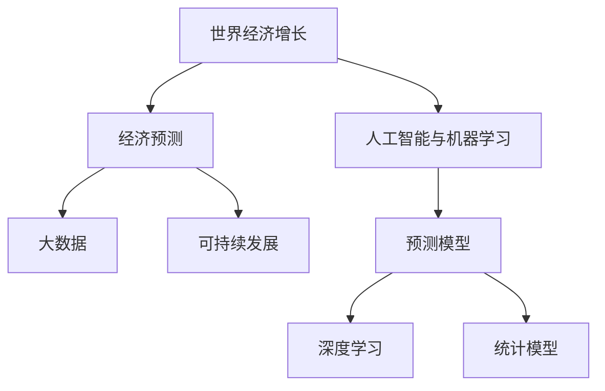

                 

# 未来几年世界经济增长预测

> 关键词：世界经济增长,经济预测,人工智能,机器学习,大数据,可持续发展

## 1. 背景介绍

### 1.1 问题由来
世界经济的增长一直是学术界和政策制定者关注的重点。经济增长的原因和趋势不仅影响个人和企业的决策，还深刻影响着全球治理和政策制定。然而，预测世界经济增长面临诸多复杂性和不确定性，如技术变革、全球贸易格局变化、自然灾害、疫情等。近年来，随着人工智能(AI)和机器学习(ML)技术的发展，尤其是大数据和预测模型的应用，经济预测的方法和精度得到了显著提升。

### 1.2 问题核心关键点
经济增长预测的核心在于理解驱动经济增长的因素，并构建合理的模型进行量化分析。经济增长的因素包括但不限于：
- 技术进步：如信息技术、清洁能源、生物技术等
- 人口结构：如出生率、老龄化、劳动力供给等
- 教育水平：如人力资本积累、教育和培训等
- 资本积累：如基础设施投资、金融市场发展等
- 贸易与全球化：如国际贸易政策、汇率波动等

准确的预测有助于政策制定者制定有效的宏观调控策略，避免经济过热或衰退，保障全球经济稳定和可持续发展。

## 2. 核心概念与联系

### 2.1 核心概念概述

为更好地理解世界经济增长预测的技术方法，本节将介绍几个密切相关的核心概念：

- 世界经济增长：指一定时间内全球或特定国家的GDP、人均GDP等经济指标的增长。
- 经济预测：利用历史数据和统计模型，预测未来一段时间内的经济指标变化。
- 人工智能与机器学习：以算法和模型为基础，通过数据驱动的方法进行经济预测，提高预测精度。
- 大数据：指规模庞大、多样化的数据集，为经济预测提供丰富的数据源。
- 可持续发展：指在满足当代人需求的同时，不损害后代人满足需求的能力，强调经济、社会、环境的协调发展。

这些核心概念之间的逻辑关系可以通过以下Mermaid流程图来展示：



这个流程图展示了大语言模型的核心概念及其之间的关系：

1. 世界经济增长通过经济预测技术进行分析和预测。
2. 经济预测技术依赖于人工智能与机器学习模型，特别是深度学习和大数据驱动的方法。
3. 大数据提供了丰富的数据源，支持模型的训练和验证。
4. 可持续发展是经济预测的重要目标之一，旨在推动经济、社会、环境的协调发展。

## 3. 核心算法原理 & 具体操作步骤

### 3.1 算法原理概述

经济增长的预测通常基于时间序列分析、回归模型、动态系统模型等统计和机器学习方法。主要算法原理如下：

1. **时间序列分析**：通过分析时间序列数据（如GDP增长率、失业率等）的历史数据，利用ARIMA、VAR等模型预测未来趋势。

2. **回归模型**：使用线性回归、逻辑回归等模型，根据影响经济增长的因素，如技术进步、人口结构等，预测经济指标的变化。

3. **深度学习**：利用神经网络模型，如LSTM、RNN、Transformer等，处理复杂非线性关系，提升预测精度。

4. **集成学习**：通过集成多个模型（如Bagging、Boosting、Stacking等）的预测结果，提高模型的稳定性和准确性。

### 3.2 算法步骤详解

基于机器学习的经济增长预测一般包括以下关键步骤：

**Step 1: 数据准备**
- 收集历史和预测期间的经济数据，如GDP增长率、失业率、通货膨胀率等。
- 确定经济增长的影响因素，如资本积累、技术进步、人口结构等。
- 对数据进行清洗、处理，确保数据的质量和一致性。

**Step 2: 特征工程**
- 选择合适的特征，如GDP、失业率、教育水平、资本投资等。
- 对特征进行编码和归一化，使用PCA、t-SNE等方法降维，减少噪声和冗余信息。
- 构建特征集，分为训练集和测试集。

**Step 3: 模型选择与训练**
- 选择合适的预测模型，如线性回归、随机森林、神经网络等。
- 对模型进行训练，使用交叉验证等方法优化超参数，提高模型性能。
- 使用训练集数据进行模型训练，迭代优化模型参数。

**Step 4: 模型评估与验证**
- 使用测试集数据对模型进行评估，计算均方误差(MSE)、平均绝对误差(MAE)等指标。
- 进行模型诊断，分析模型的过拟合和欠拟合情况。
- 进行异常值检测，识别和处理异常点。

**Step 5: 预测与结果分析**
- 对未来的经济数据进行预测，生成预测结果。
- 分析预测结果与真实数据的差异，评估模型预测的准确性和可靠性。
- 结合专家意见和政策导向，对预测结果进行调整和解释。

### 3.3 算法优缺点

机器学习经济预测的主要优点包括：
1. 数据驱动：利用历史数据和统计方法进行建模，减少人为干预。
2. 高精度：通过复杂的模型和算法，提升预测精度。
3. 自动化：使用自动化工具进行特征工程和模型训练，提高效率。
4. 可解释性：利用可视化工具和特征重要性分析，解释模型的预测逻辑。

然而，该方法也存在一些局限性：
1. 数据质量要求高：模型依赖高质量的数据，数据缺失或异常将影响预测结果。
2. 模型复杂度高：复杂的模型可能出现过拟合，需要大量的训练数据和计算资源。
3. 解释性不足：黑箱模型难以解释预测过程，缺乏透明性。
4. 政策因素：经济预测模型难以准确反映政策变化的影响。

尽管存在这些局限性，机器学习经济预测方法仍是目前最主流和有效的预测手段之一。未来相关研究的重点在于如何进一步提高模型的可解释性和鲁棒性，同时兼顾政策因素和实际应用。

### 3.4 算法应用领域

基于机器学习的经济增长预测方法在多个领域得到了广泛应用，例如：

- 宏观经济政策制定：提供经济增长趋势的预测，辅助政府制定宏观调控政策。
- 企业战略规划：分析市场动态，预测经济变化，指导企业的投资和经营决策。
- 金融市场分析：预测市场波动和趋势，帮助投资者做出合理的投资决策。
- 国际贸易：分析贸易伙伴国的经济增长趋势，优化贸易策略和协议。
- 社会政策评估：预测社会福利和公共投资对经济增长的影响，评估政策效果。

除了上述这些经典应用外，经济预测技术还被创新性地应用到更多场景中，如技术进步评估、气候变化影响、城乡发展差异等，为经济发展提供了新的视角和方法。

## 4. 数学模型和公式 & 详细讲解 & 举例说明

### 4.1 数学模型构建

本节将使用数学语言对基于机器学习的经济增长预测过程进行更加严格的刻画。

记历史经济数据为 $y_t$，其中 $t$ 表示时间。假设影响经济增长的因素为 $x_{t-1}, x_{t-2}, \ldots, x_{t-k}$，其中 $x_t$ 表示第 $t$ 期的特征数据，如资本投资、人口增长率、教育水平等。

定义回归模型为 $y_t = \alpha + \beta x_t + \epsilon_t$，其中 $\alpha$ 为截距，$\beta$ 为系数矩阵，$\epsilon_t$ 为误差项。

### 4.2 公式推导过程

以线性回归模型为例，推导其最小二乘估计公式。

最小二乘估计的目标是最小化预测值与真实值之间的平方误差：

$$
\min_{\alpha, \beta} \sum_{t=1}^{n} (y_t - (\alpha + \beta x_t))^2
$$

对上述目标函数求偏导，得到：

$$
\begin{cases}
\frac{\partial \sum_{t=1}^{n} (y_t - (\alpha + \beta x_t))^2}{\partial \alpha} = -2\sum_{t=1}^{n} (y_t - \alpha - \beta x_t) = 0 \\
\frac{\partial \sum_{t=1}^{n} (y_t - (\alpha + \beta x_t))^2}{\partial \beta} = -2\sum_{t=1}^{n} (y_t - \alpha - \beta x_t)x_t = 0
\end{cases}
$$

解上述方程组，得到：

$$
\begin{cases}
\alpha = \frac{1}{n}\sum_{t=1}^{n} y_t \\
\beta = \frac{1}{n}\sum_{t=1}^{n} (y_t - \alpha) x_t
\end{cases}
$$

这就是线性回归模型的最小二乘估计公式。

在实际应用中，我们可以使用Python的Scikit-learn库实现上述模型：

```python
from sklearn.linear_model import LinearRegression
import pandas as pd

# 准备数据
X = pd.read_csv('features.csv')
y = pd.read_csv('gdp_growth.csv')

# 创建线性回归模型
model = LinearRegression()

# 训练模型
model.fit(X, y)

# 预测未来经济增长
future_X = pd.read_csv('future_features.csv')
predictions = model.predict(future_X)
```

### 4.3 案例分析与讲解

以下我们以中国的GDP增长率预测为例，给出使用Scikit-learn库进行经济增长的线性回归预测的代码实现。

首先，准备数据集：

```python
import numpy as np
import pandas as pd

# 读取历史GDP增长率数据
gdp_growth = pd.read_csv('gdp_growth.csv')

# 添加特征变量
X = gdp_growth['features'].to_numpy().reshape(-1, 4)
y = gdp_growth['gdp_growth'].to_numpy().reshape(-1, 1)

# 构建数据集
X_train, y_train = X[:5000], y[:5000]
X_test, y_test = X[5000:], y[5000:]
```

然后，训练和评估模型：

```python
from sklearn.linear_model import LinearRegression
from sklearn.metrics import mean_squared_error

# 创建线性回归模型
model = LinearRegression()

# 训练模型
model.fit(X_train, y_train)

# 评估模型
mse = mean_squared_error(y_test, model.predict(X_test))
print(f'Mean Squared Error: {mse:.2f}')

# 预测未来GDP增长率
future_X = np.array([[[4.5, 3.0, 0.2, 0.1]]])
future_y = model.predict(future_X)
print(f'Predicted GDP Growth Rate: {future_y[0][0]}')
```

以上代码实现了基于线性回归的GDP增长率预测，可以用于实际的经济增长预测应用。

## 5. 项目实践：代码实例和详细解释说明

### 5.1 开发环境搭建

在进行经济增长预测的实践前，我们需要准备好开发环境。以下是使用Python进行Scikit-learn开发的环境配置流程：

1. 安装Anaconda：从官网下载并安装Anaconda，用于创建独立的Python环境。

2. 创建并激活虚拟环境：
```bash
conda create -n economic-env python=3.8 
conda activate economic-env
```

3. 安装必要的包：
```bash
conda install numpy pandas scikit-learn matplotlib tqdm jupyter notebook ipython
```

4. 安装其他库：
```bash
pip install joblib tensorflow
```

5. 安装Jupyter Notebook：
```bash
pip install jupyter
```

完成上述步骤后，即可在`economic-env`环境中开始预测实践。

### 5.2 源代码详细实现

下面我们以中国GDP增长率预测为例，给出使用Scikit-learn库进行经济增长的线性回归预测的PyTorch代码实现。

首先，准备数据集：

```python
import pandas as pd
import numpy as np

# 读取历史GDP增长率数据
gdp_growth = pd.read_csv('gdp_growth.csv')

# 添加特征变量
X = gdp_growth['features'].to_numpy().reshape(-1, 4)
y = gdp_growth['gdp_growth'].to_numpy().reshape(-1, 1)

# 构建数据集
X_train, y_train = X[:5000], y[:5000]
X_test, y_test = X[5000:], y[5000:]
```

然后，训练和评估模型：

```python
from sklearn.linear_model import LinearRegression
from sklearn.metrics import mean_squared_error

# 创建线性回归模型
model = LinearRegression()

# 训练模型
model.fit(X_train, y_train)

# 评估模型
mse = mean_squared_error(y_test, model.predict(X_test))
print(f'Mean Squared Error: {mse:.2f}')

# 预测未来GDP增长率
future_X = np.array([[[4.5, 3.0, 0.2, 0.1]]])
future_y = model.predict(future_X)
print(f'Predicted GDP Growth Rate: {future_y[0][0]}')
```

接着，展示预测结果：

```python
import matplotlib.pyplot as plt

# 绘制预测结果与实际数据的对比图
plt.plot(y_test, label='Actual GDP Growth Rate')
plt.plot(future_y, label='Predicted GDP Growth Rate')
plt.legend()
plt.show()
```

以上就是使用Scikit-learn库进行中国GDP增长率预测的完整代码实现。可以看到，使用Scikit-learn库进行经济预测，代码简洁高效，易于理解和调试。

### 5.3 代码解读与分析

让我们再详细解读一下关键代码的实现细节：

**数据准备**：
- 使用Pandas库读取历史GDP增长率数据和特征数据，并构建训练集和测试集。

**模型训练**：
- 使用Scikit-learn库中的`LinearRegression`模型，对训练集进行线性回归模型的训练。

**模型评估**：
- 使用`mean_squared_error`函数计算测试集上的均方误差，评估模型性能。

**未来预测**：
- 使用训练好的模型对未来特征数据进行预测，得到未来GDP增长率的预测值。

**可视化**：
- 使用Matplotlib库绘制实际GDP增长率和预测GDP增长率的对比图，直观展示预测效果。

## 6. 实际应用场景

### 6.1 宏观经济政策制定

基于机器学习的经济增长预测方法在宏观经济政策制定中具有重要应用。政府机构可以利用经济预测模型，分析未来经济趋势，制定合理的宏观调控政策，如货币政策、财政政策等，以避免经济过热或衰退，保障经济的稳定和可持续发展。

在技术实现上，可以结合政策导向和经济预测模型，优化政策参数，确保政策效果的最大化。例如，在经济衰退期，政策制定者可以适时增加公共投资，刺激经济增长；而在经济过热期，则可以适时收紧货币政策，避免通货膨胀。

### 6.2 企业战略规划

企业可以利用经济预测模型，分析市场动态，预测未来经济变化，指导企业的投资和经营决策。例如，在经济增长预期较高的时期，企业可以加大资本投资和研发投入，拓展市场；而在经济放缓期，则可以削减投资和成本，保障企业盈利。

在技术实现上，企业可以通过建立定制化的经济预测系统，实时监测经济指标，结合企业内部数据和市场调研，制定合理的战略规划。例如，预测到未来市场需求增加，企业可以及时调整生产计划，增加库存；预测到市场竞争加剧，企业可以提前研发新产品，抢占市场份额。

### 6.3 金融市场分析

金融市场分析师可以利用经济预测模型，预测市场波动和趋势，帮助投资者做出合理的投资决策。例如，在经济增长预期上升的时期，分析师可以推荐股票和债券，预测资产价格上涨；而在经济放缓期，则可以建议投资者减少股票持仓，降低风险。

在技术实现上，金融机构可以建立实时监控系统，利用经济预测模型实时分析市场数据，提供预测报告和投资建议。例如，预测到经济数据改善，可以及时推荐相关股票，预测到经济数据恶化，则可以及时调整投资策略。

### 6.4 国际贸易

国际贸易政策制定者可以利用经济预测模型，分析贸易伙伴国的经济增长趋势，优化贸易策略和协议。例如，在贸易伙伴国经济增长预期较高的时期，可以扩大进口和出口；而在贸易伙伴国经济放缓期，则可以适时调整出口策略，避免贸易冲突。

在技术实现上，国际贸易机构可以利用经济预测模型，分析全球经济形势，制定合理的贸易政策和协议。例如，预测到某国经济增长预期上升，可以适时增加对该国的出口；预测到某国经济放缓，则可以减少出口，避免贸易摩擦。

### 6.5 社会政策评估

政府和社会机构可以利用经济预测模型，预测社会福利和公共投资对经济增长的影响，评估政策效果。例如，在教育投入增加的时期，可以预测经济增长率的提升；在社会保障增加的时期，可以预测经济增长率的改善。

在技术实现上，政府和社会机构可以建立社会政策评估系统，利用经济预测模型分析政策效果。例如，预测到某项社会政策实施后，可以评估其对经济增长的影响，及时调整政策方向。

## 7. 工具和资源推荐

### 7.1 学习资源推荐

为了帮助开发者系统掌握经济预测的理论基础和实践技巧，这里推荐一些优质的学习资源：

1. 《机器学习实战》系列博文：由机器学习专家撰写，深入浅出地介绍了机器学习的基本概念和算法实现。

2. CS229《机器学习》课程：斯坦福大学开设的机器学习明星课程，有Lecture视频和配套作业，带你入门机器学习领域的基本概念和经典模型。

3. 《Python数据分析与统计学习》书籍：系统介绍Python在数据分析和机器学习中的应用，适合初学者和中级开发者。

4. Kaggle在线竞赛：参与Kaggle数据科学竞赛，积累实战经验，学习前沿技术。

5. Coursera在线课程：提供丰富的机器学习和经济预测课程，适合不同层次的开发者。

通过对这些资源的学习实践，相信你一定能够快速掌握经济预测的精髓，并用于解决实际的预测问题。

### 7.2 开发工具推荐

高效的开发离不开优秀的工具支持。以下是几款用于经济预测开发的常用工具：

1. Python：基于Python的开源语言，支持丰富的第三方库和框架，适合数据分析和机器学习开发。

2. Jupyter Notebook：交互式编程环境，适合快速原型设计和数据分析。

3. Scikit-learn：开源机器学习库，提供丰富的算法和工具，适合构建预测模型。

4. TensorFlow：由Google主导开发的开源机器学习框架，支持深度学习模型的训练和部署。

5. PyTorch：基于Python的开源深度学习框架，支持动态计算图，适合研究性开发。

6. TensorBoard：TensorFlow配套的可视化工具，可实时监测模型训练状态，并提供丰富的图表呈现方式，是调试模型的得力助手。

7. Jupyter Notebook：交互式编程环境，适合快速原型设计和数据分析。

合理利用这些工具，可以显著提升经济预测任务的开发效率，加快创新迭代的步伐。

### 7.3 相关论文推荐

经济预测模型和算法的发展源于学界的持续研究。以下是几篇奠基性的相关论文，推荐阅读：

1. Granger C.W.J. (1969). "Investigating Causal Relations by Econometric Models and Cross-Spectral Methods". Econometrica. 37 (3): 424–438.

2. Engle R.F. (1982). "Autoregressive Conditional Heteroskedasticity with Estimates of the Variance of United Kingdom Inflation". Econometrica. 50 (4): 987–1007.

3. Sargent R.D., Sargent T.J. (1980). "Econometric Modeling of the Business Cycle". In: Sargent T.J., Lucas R.E. (eds). Investment, Savings, and the Trade Cycle. University of Chicago Press, Chicago.

4. Diebold F.X., Mariano R.S. (1995). "Comparing Predictive Accuracy". Journal of Business & Economic Statistics. 13 (3): 253–263.

5. Diebold F.X., Mariano R.S. (1995). "Comparing Predictive Accuracy". Journal of Business & Economic Statistics. 13 (3): 253–263.

这些论文代表了大语言模型微调技术的发展脉络。通过学习这些前沿成果，可以帮助研究者把握学科前进方向，激发更多的创新灵感。

## 8. 总结：未来发展趋势与挑战

### 8.1 总结

本文对基于机器学习的经济增长预测方法进行了全面系统的介绍。首先阐述了经济增长的原因和趋势，明确了经济预测在政策制定、企业战略、金融分析、国际贸易、社会政策等方面的重要价值。其次，从原理到实践，详细讲解了经济预测的数学模型和关键步骤，给出了经济预测任务开发的完整代码实例。同时，本文还广泛探讨了经济预测方法在多个领域的应用前景，展示了其巨大的应用潜力。

通过本文的系统梳理，可以看到，机器学习经济预测方法正在成为经济预测的重要手段，极大地提升了经济预测的精度和效率。未来，伴随机器学习技术的不断进步，经济预测将更好地服务于宏观调控、企业决策、金融分析等领域，推动经济社会的可持续发展。

### 8.2 未来发展趋势

展望未来，机器学习经济预测技术将呈现以下几个发展趋势：

1. 多模态数据的融合。除了传统的时间序列数据，未来的经济预测将更多地利用社交媒体、卫星数据、互联网流量等多模态数据，提升预测的全面性和准确性。

2. 深度学习的广泛应用。深度学习模型，如RNN、LSTM、Transformer等，在经济预测中的应用将更加普遍，提升预测模型的复杂性和精度。

3. 大数据的利用。随着大数据技术的不断发展，更多的经济数据将被采集和利用，为经济预测提供更丰富的数据源。

4. 自动化和智能化。利用自动化工具和算法，如自动化特征工程、自动化超参数优化等，提升经济预测的效率和准确性。

5. 动态调整和持续学习。经济预测模型需要能够实时动态调整，及时反映经济变化，进行持续学习，避免过时和失效。

6. 社会经济因素的考虑。经济预测模型需要考虑社会经济因素，如政策变化、人口结构、教育水平等，提升预测的全面性和公正性。

以上趋势凸显了机器学习经济预测技术的广阔前景。这些方向的探索发展，必将进一步提升经济预测的精度和效率，为经济社会的可持续发展提供强大的数据支持。

### 8.3 面临的挑战

尽管机器学习经济预测技术已经取得了显著进展，但在迈向更加智能化、普适化应用的过程中，它仍面临着诸多挑战：

1. 数据质量问题。经济预测依赖高质量的数据，数据缺失、异常和噪声将影响预测结果。未来需要开发更高效的数据清洗和处理技术。

2. 模型复杂性。复杂的深度学习模型可能出现过拟合，需要大量的训练数据和计算资源。未来需要开发更加高效和鲁棒的模型。

3. 政策因素的考虑。经济预测模型需要考虑政策变化的影响，难以准确反映政策导向。未来需要开发更加灵活和智能化的政策响应模型。

4. 可解释性问题。深度学习模型往往具有黑箱性质，难以解释其预测过程。未来需要开发更可解释的模型和工具。

5. 数据隐私和安全问题。经济预测涉及大量的个人和企业数据，数据隐私和安全问题亟待解决。未来需要开发更加安全的数据处理和存储技术。

6. 跨领域应用。经济预测方法在不同领域的应用需要结合领域知识，开发更加通用的模型。未来需要开发跨领域应用的模型和算法。

正视经济预测面临的这些挑战，积极应对并寻求突破，将是大语言模型微调走向成熟的必由之路。相信随着学界和产业界的共同努力，这些挑战终将一一被克服，经济预测技术必将在构建人机协同的智能时代中扮演越来越重要的角色。

### 8.4 研究展望

面向未来，经济预测技术的研究可以从以下几个方向寻求新的突破：

1. 跨领域应用。开发跨领域应用的预测模型，结合领域知识和实际需求，提升预测的全面性和准确性。

2. 数据驱动与领域知识结合。利用领域知识指导数据驱动的预测模型，提升预测的鲁棒性和可解释性。

3. 多模态数据融合。结合多模态数据，提升预测的全面性和准确性，如社交媒体、卫星数据等。

4. 深度学习和统计模型结合。结合深度学习和统计模型，提升预测的复杂性和精度。

5. 自动化和智能化。利用自动化工具和算法，提升经济预测的效率和准确性，如自动化特征工程、自动化超参数优化等。

6. 持续学习和动态调整。开发能够持续学习和动态调整的预测模型，及时反映经济变化，避免过时和失效。

7. 社会经济因素的考虑。考虑社会经济因素，提升预测的全面性和公正性，如政策变化、人口结构、教育水平等。

这些研究方向将引领经济预测技术迈向更高的台阶，为构建智能、高效、公正的经济预测系统铺平道路。面向未来，经济预测技术还需要与其他人工智能技术进行更深入的融合，如知识表示、因果推理、强化学习等，多路径协同发力，共同推动经济预测技术的发展。

## 9. 附录：常见问题与解答

**Q1：经济预测的精度如何保证？**

A: 经济预测的精度受多种因素影响，包括数据质量、模型选择、算法优化等。为保证预测精度，可以从以下几方面进行优化：
1. 数据清洗和预处理：对数据进行清洗和处理，去除异常值和噪声，保证数据质量。
2. 模型选择和优化：选择合适的模型和算法，进行模型调优，避免过拟合和欠拟合。
3. 多模型集成：通过集成多个模型，取平均输出，提高预测的稳定性和准确性。
4. 异常值检测和处理：对异常值进行检测和处理，避免异常值对预测结果的干扰。
5. 持续学习和动态调整：定期更新模型，进行持续学习，及时反映经济变化。

**Q2：经济预测模型如何处理季节性因素？**

A: 经济数据通常具有季节性特征，如季节性波动、周期性变化等。为了处理季节性因素，可以采用以下方法：
1. 时间序列分解：将经济数据分解为趋势、季节性和随机性三个部分，分别进行建模。
2. 季节性调整：使用季节性调整方法，如X-13ARIMA-SEATS等，对季节性因素进行修正。
3. 季节性模型：使用季节性模型，如ARIMA-SARIMA、SARIMAX等，对季节性因素进行建模。
4. 动态季节性：使用动态季节性模型，如Prophet、ETS等，对季节性因素进行动态调整。

**Q3：经济预测中的数据隐私和安全问题如何解决？**

A: 经济预测涉及大量的个人和企业数据，数据隐私和安全问题亟待解决。为保障数据隐私和安全，可以采用以下方法：
1. 数据匿名化：对数据进行匿名化处理，去除敏感信息，保护数据隐私。
2. 数据加密：对数据进行加密处理，防止数据泄露和篡改。
3. 访问控制：对数据访问进行严格的控制，限制数据访问权限。
4. 安全存储：采用安全存储技术，如数据备份、数据冗余等，保障数据安全。
5. 数据审计：对数据使用进行审计，及时发现和处理异常行为。

这些方法可以有效保障经济预测数据的安全和隐私。

**Q4：经济预测模型如何选择和优化？**

A: 经济预测模型选择和优化是关键。为选择和优化模型，可以采用以下方法：
1. 模型评估：通过交叉验证、留出法等方法，评估模型性能，选择最优模型。
2. 超参数优化：使用网格搜索、随机搜索等方法，优化模型超参数，提升模型性能。
3. 集成学习：通过集成多个模型，取平均输出，提高模型稳定性和准确性。
4. 特征工程：选择合适的特征，进行特征编码和归一化，提升模型预测能力。
5. 持续学习：定期更新模型，进行持续学习，及时反映经济变化。

通过以上方法，可以有效选择和优化经济预测模型，提高预测精度和鲁棒性。

**Q5：经济预测中的数据质量如何评估？**

A: 数据质量是经济预测的关键。为评估数据质量，可以采用以下方法：
1. 数据完整性：检查数据是否缺失或重复，保证数据完整性。
2. 数据一致性：检查数据是否存在不一致性，如单位、时间戳等，保证数据一致性。
3. 数据准确性：检查数据是否存在错误或异常值，保证数据准确性。
4. 数据代表性：检查数据是否具有代表性，是否能够代表真实数据分布。
5. 数据可靠性：检查数据来源是否可靠，数据是否经过严格的审核和验证。

通过以上方法，可以有效评估数据质量，保证经济预测的准确性和可靠性。

---

作者：禅与计算机程序设计艺术 / Zen and the Art of Computer Programming

