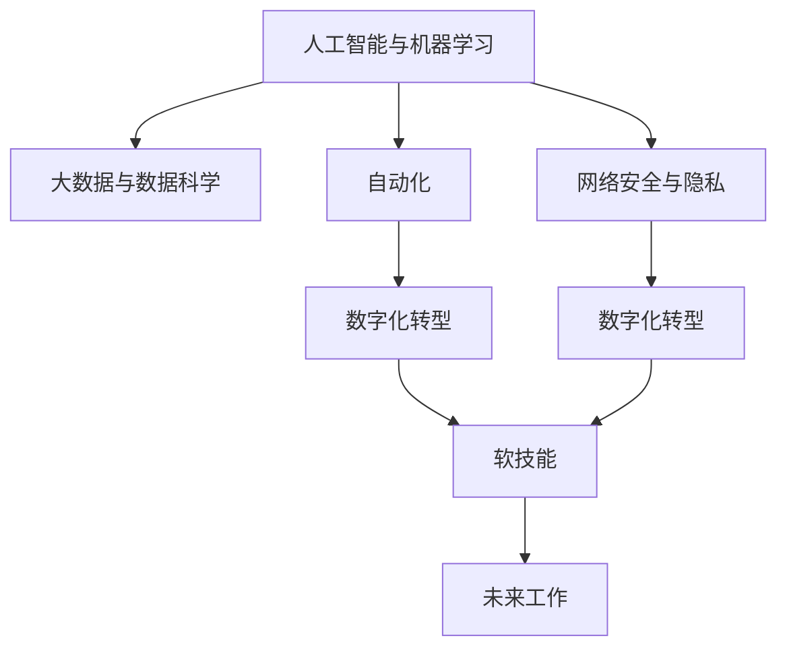

                 

# 未来工作：技能需求与培养

> 关键词：未来工作，技能需求，技能培养，人工智能，自动化，机器学习，数据科学，数字化转型，职业生涯规划

## 1. 背景介绍

### 1.1 问题由来
随着技术进步和数字化转型步伐的加快，未来工作环境正在发生深刻的变化。人工智能、自动化和机器学习技术的普及，使得传统岗位工作方式和技能需求发生重大转变。如何顺应这一趋势，培养符合未来需求的技能，成为了当今社会面临的重要课题。

### 1.2 问题核心关键点
未来工作的技能需求包括但不限于以下几个方面：
- 人工智能与机器学习：理解基本原理，能够应用算法解决实际问题。
- 大数据与数据科学：具备数据处理、分析和建模的能力。
- 自动化与编程：熟练掌握至少一种编程语言，具备系统设计能力。
- 网络安全与隐私：掌握网络安全基础知识，保护数据隐私。
- 数字化转型：理解数字化转型的基本概念和流程。
- 软技能：如沟通、团队协作、创新思维等。

了解这些关键点对于理解未来工作环境的技能需求至关重要。

## 2. 核心概念与联系

### 2.1 核心概念概述

为更好地理解未来工作环境的技能需求，本节将介绍几个密切相关的核心概念：

- 人工智能与机器学习：使用算法和模型，赋予计算机“智能”，使之能够进行学习、推理和决策。
- 大数据与数据科学：通过收集、处理和分析大规模数据集，从中提取知识和洞见。
- 自动化：使用计算机软件或系统，自动执行常规任务，以提高效率和降低成本。
- 数字化转型：通过采用新技术，改造和优化现有业务流程，提升效率和竞争力。
- 网络安全与隐私：保护数据安全，防止未经授权的访问和使用。
- 软技能：如沟通、团队协作、创新思维等，对于高效完成工作任务至关重要。

这些核心概念之间的逻辑关系可以通过以下Mermaid流程图来展示：



这个流程图展示了大语言模型的核心概念及其之间的关系：

1. 人工智能与机器学习是数字化转型的核心驱动力。
2. 大数据与数据科学提供了强大的数据支撑。
3. 自动化技术提高了工作效率和质量。
4. 网络安全与隐私保护是数字化转型的重要保障。
5. 软技能是技术应用成功的重要因素。
6. 未来工作是技术应用和软技能融合的最终体现。

这些核心概念共同构成了未来工作的核心框架，对于理解未来工作的技能需求和培养方向具有重要意义。

## 3. 核心算法原理 & 具体操作步骤
### 3.1 算法原理概述

未来工作的技能培养，本质上是一个多维度的综合培养过程。其核心思想是：通过构建与未来工作环境相匹配的知识体系和技能结构，利用先进的教育技术手段，系统化地培养符合未来需求的人才。

形式化地，假设未来工作技能需求为 $\mathcal{S}$，包括 $S_1, S_2, ..., S_n$ 等多种技能。构建未来的技能培养体系，目标是最小化技能需求与实际培养效果的差异，即找到最优技能培养方案：

$$
\mathcal{L}(\mathcal{S}) = \sum_{i=1}^n \text{distance}(S_i, S_{actual_i})
$$

其中，$\text{distance}$ 函数度量技能需求 $S_i$ 与实际培养效果 $S_{actual_i}$ 的差异，可以通过学习目标对齐、课程设计、实践训练等多种方式进行优化。

### 3.2 算法步骤详解

未来工作的技能培养一般包括以下几个关键步骤：

**Step 1: 分析技能需求**
- 通过市场调研、企业需求分析和专家访谈等手段，识别未来工作环境中各种技能需求。
- 将技能需求划分为基本技能、进阶技能和专业技能等不同层次，明确其重要性、复杂度和适用范围。

**Step 2: 构建技能培养体系**
- 基于技能需求分析，设计完整的技能培养框架，包括课程设置、教学方法、评估标准等。
- 引入多样化教育资源，如在线课程、虚拟实验室、案例分析等，丰富学习体验。
- 设置合理的学习路径，根据不同层次和兴趣，提供个性化学习建议。

**Step 3: 实施技能培训**
- 利用先进的教育技术手段，如自适应学习系统、虚拟现实(VR)、增强现实(AR)等，提升学习效果。
- 结合实际工作场景，进行项目式学习、实习实训、岗位轮岗等实践活动，增强应用能力。
- 定期评估学习效果，及时调整培训方案，确保技能培养的科学性和有效性。

**Step 4: 持续改进**
- 收集反馈意见，分析技能培养过程中存在的问题和不足，持续优化培训体系。
- 跟踪技术发展趋势，及时更新课程内容和教学方法，保持与行业前沿接轨。
- 建立长期跟踪机制，对毕业生进行职业发展和技能更新指导，确保其持续成长。

### 3.3 算法优缺点

未来工作的技能培养方法具有以下优点：
1. 系统性。通过明确的技能需求分析和系统化的培养设计，能够形成较为全面的技能体系。
2. 灵活性。多样化的教育资源和学习路径，使得学习者能够根据自身兴趣和需求进行选择，个性化培养。
3. 实践性强。结合实际工作场景的实践活动，有助于培养学习者的实际应用能力。
4. 可扩展性。技能培养体系的设计和优化，可以为不同层次和领域的人才培养提供参考。

同时，该方法也存在一定的局限性：
1. 资源投入大。构建和维护完整的技能培养体系需要大量资金和资源，对教育机构和企业提出较高要求。
2. 师资力量要求高。需要有具备高水平专业知识和技术能力的教师和培训师，提供高质量的教学服务。
3. 跟踪评估复杂。技能培养的效果评估和反馈收集，需要建立相应的跟踪机制和评估标准。
4. 灵活性不足。在实际应用中，某些技能培养方式可能无法完全适应个性化需求。

尽管存在这些局限性，但就目前而言，基于系统化技能培养的方法仍是目前教育行业的主流范式。未来相关研究的重点在于如何进一步提高教育资源的利用效率，降低教育成本，同时兼顾培养效果和灵活性。

### 3.4 算法应用领域

未来工作的技能培养方法在教育、培训、企业人才发展等多个领域得到广泛应用：

- 高等教育：通过构建系统化的课程体系和实践项目，培养未来工作所需的各种技能。
- 职业培训：针对特定行业需求，设计专业化的培训课程和实战演练，帮助学员迅速上岗。
- 企业培训：利用在线学习平台和虚拟实训环境，提升员工技能，增强企业竞争力。
- 社区教育：通过社区学院和培训机构，提供多样化的技能培训课程，满足不同人群的学习需求。
- 远程教育：利用在线教育平台和虚拟教室，实现全球范围内的技能普及和传播。

除了上述这些应用外，未来工作的技能培养方法也在越来越多新的场景中得到应用，如在线学习、微课程、自主学习等，为技能普及和人才培养提供了新的途径。

## 4. 数学模型和公式 & 详细讲解 & 举例说明
### 4.1 数学模型构建

本节将使用数学语言对未来工作技能培养过程进行更加严格的刻画。

记未来工作技能需求为 $\mathcal{S}=\{S_1, S_2, ..., S_n\}$，每个技能 $S_i$ 的熟练度记为 $s_i$，实际培养效果为 $s_{actual_i}$。构建技能培养体系的目标是最小化技能需求与实际培养效果的差异：

$$
\mathcal{L}(\mathcal{S}) = \sum_{i=1}^n |s_i - s_{actual_i}|
$$

其中 $|.|$ 为绝对值函数，表示技能需求与实际效果之间的差距。

### 4.2 公式推导过程

为了最小化技能差距 $\mathcal{L}(\mathcal{S})$，我们需要进行以下步骤：

1. **技能评估**：对每个技能 $S_i$ 进行评估，获取其当前熟练度 $s_i$。
2. **目标设定**：根据未来工作需求，设定每个技能 $S_i$ 的实际培养目标 $s_{actual_i}$。
3. **差距计算**：计算每个技能的需求与目标之间的差距 $\Delta_i = s_{actual_i} - s_i$。
4. **优化调整**：通过差值调整，优化技能培养方案，逐步缩小差距 $\Delta_i$。

具体推导过程如下：

设 $\Delta_i = s_{actual_i} - s_i$，则目标最小化函数变为：

$$
\mathcal{L}(\mathcal{S}) = \sum_{i=1}^n |\Delta_i|
$$

采用梯度下降等优化算法，求解最小化问题：

$$
\Delta_i \leftarrow \Delta_i - \eta \nabla_{\Delta_i}\mathcal{L}(\mathcal{S})
$$

其中 $\eta$ 为学习率，$\nabla_{\Delta_i}\mathcal{L}(\mathcal{S})$ 为损失函数对差距 $\Delta_i$ 的梯度，可通过链式法则和反向传播算法高效计算。

### 4.3 案例分析与讲解

以下以数据分析师为例，展示基于数学模型的技能培养过程：

1. **技能评估**：通过调查问卷、技能测试等方式，评估分析师当前在数据分析、数据可视化、机器学习等技能方面的熟练度。
2. **目标设定**：根据行业需求，设定数据分析师应具备的技能熟练度目标，如掌握Python、R语言，能够进行数据清洗、特征工程、模型训练等。
3. **差距计算**：计算当前技能与目标之间的差距，例如当前掌握Python 80%，目标为90%，差距 $\Delta_{Python} = 10\%$。
4. **优化调整**：通过在线课程、实战项目、导师辅导等方式，逐步提升技能熟练度，缩小与目标之间的差距。

例如，数据分析师通过以下步骤进行优化：
- 在线课程：参加Python、R语言等在线课程，每周学习5小时，持续1个月，技能提升5%。
- 实战项目：参与公司内部数据分析项目，应用所学技能进行数据处理、模型训练，进一步提升技能熟练度10%。
- 导师辅导：定期与导师进行交流，获取个性化建议，提升技能掌握度5%。

通过这些步骤，数据分析师能够逐步达到行业需求，提升工作效率和质量。

## 5. 项目实践：代码实例和详细解释说明
### 5.1 开发环境搭建

在进行技能培养实践前，我们需要准备好开发环境。以下是使用Python进行技能培养实践的环境配置流程：

1. 安装Python 3.8：从官网下载并安装Python 3.8，并配置为系统环境变量。
2. 安装必要的Python库：如Pandas、NumPy、Scikit-learn、TensorFlow等，用于数据处理和机器学习任务。
3. 安装Jupyter Notebook：通过pip安装Jupyter Notebook，用于在线编写和运行代码。
4. 设置虚拟环境：使用virtualenv创建虚拟环境，将项目代码隔离开来，避免依赖冲突。

### 5.2 源代码详细实现

下面我们以数据分析师技能培养为例，给出使用Python进行技能评估和优化的代码实现。

首先，定义技能评估函数：

```python
import pandas as pd
import numpy as np

def skill_assessment():
    # 加载评估数据
    data = pd.read_csv('skill_assessment_data.csv')
    # 计算技能熟练度
    skill_scores = data['skill_scores'].mean()
    return skill_scores
```

然后，定义技能目标设定函数：

```python
def skill_target_setting():
    # 根据行业需求，设定技能目标
    data = pd.read_csv('skill_target_data.csv')
    skill_targets = data['skill_targets'].mean()
    return skill_targets
```

接着，定义差距计算函数：

```python
def gap_calculation(skill_scores, skill_targets):
    # 计算当前技能与目标之间的差距
    gaps = np.abs(skill_scores - skill_targets)
    return gaps
```

最后，定义优化调整函数：

```python
def skill_optimization(gaps, learning_rate=0.1, epochs=100):
    # 梯度下降优化
    for epoch in range(epochs):
        for i in range(len(gaps)):
            grad = -learning_rate * gaps[i]
            gaps[i] -= grad
        if (epoch + 1) % 10 == 0:
            print(f'Epoch {epoch+1}, gaps={gaps}')
    return gaps
```

完整代码如下：

```python
import pandas as pd
import numpy as np

def skill_assessment():
    # 加载评估数据
    data = pd.read_csv('skill_assessment_data.csv')
    # 计算技能熟练度
    skill_scores = data['skill_scores'].mean()
    return skill_scores

def skill_target_setting():
    # 根据行业需求，设定技能目标
    data = pd.read_csv('skill_target_data.csv')
    skill_targets = data['skill_targets'].mean()
    return skill_targets

def gap_calculation(skill_scores, skill_targets):
    # 计算当前技能与目标之间的差距
    gaps = np.abs(skill_scores - skill_targets)
    return gaps

def skill_optimization(gaps, learning_rate=0.1, epochs=100):
    # 梯度下降优化
    for epoch in range(epochs):
        for i in range(len(gaps)):
            grad = -learning_rate * gaps[i]
            gaps[i] -= grad
        if (epoch + 1) % 10 == 0:
            print(f'Epoch {epoch+1}, gaps={gaps}')
    return gaps
```

### 5.3 代码解读与分析

让我们再详细解读一下关键代码的实现细节：

**skill_assessment函数**：
- 从CSV文件中加载技能评估数据，计算当前技能熟练度的平均值。

**skill_target_setting函数**：
- 从CSV文件中加载技能目标设定数据，计算行业需求的技能目标平均值。

**gap_calculation函数**：
- 计算当前技能熟练度与目标之间的绝对差距，形成评估结果。

**skill_optimization函数**：
- 使用梯度下降算法，对技能差距进行优化调整。每10个epoch输出一次当前的差距值，便于跟踪学习效果。

## 6. 实际应用场景
### 6.1 智能教育

未来工作的技能培养在智能教育领域具有广阔的应用前景。传统的教育模式往往以教师讲授为主，互动性不足，难以满足个性化学习需求。利用智能教育技术，可以通过以下几个方面提升学习效果：

1. **自适应学习系统**：根据学习者的知识水平和兴趣，自动推荐个性化的学习路径和资源。
2. **虚拟现实和增强现实**：利用VR和AR技术，提供沉浸式学习体验，增强理解力和记忆效果。
3. **在线课程平台**：提供在线课程和学习社区，方便学习者随时随地学习，提高学习效率。
4. **智能辅导系统**：通过AI技术，提供实时反馈和个性化辅导，帮助学习者解决学习难题。

例如，通过以下步骤构建智能教育系统：
- 开发自适应学习平台，根据学习者的学习数据，生成个性化的学习路径。
- 引入VR/AR设备，创建沉浸式学习环境，增强学习体验。
- 建立在线课程平台，提供丰富的学习资源和互动社区。
- 引入AI辅导机器人，实时解答学习者的疑问，提供个性化辅导。

### 6.2 企业培训

未来工作的技能培养在企业培训中同样具有重要应用价值。传统的培训模式以面对面的授课为主，难以覆盖全员。利用智能培训技术，可以通过以下几个方面提升培训效果：

1. **在线培训平台**：提供在线课程和培训材料，方便员工随时随地学习。
2. **虚拟实训环境**：通过模拟真实工作场景，进行项目式学习和实战演练，增强实际操作能力。
3. **绩效评估系统**：通过智能评估工具，实时监测学习效果，及时调整培训方案。
4. **知识库和文档中心**：提供在线文档和知识库，方便员工查阅和学习。

例如，通过以下步骤构建企业培训系统：
- 开发在线培训平台，提供丰富的培训资源和互动社区。
- 引入虚拟实训环境，模拟真实工作场景，进行项目式学习和实战演练。
- 建立绩效评估系统，实时监测员工的学习效果，及时调整培训方案。
- 搭建知识库和文档中心，方便员工查阅和学习。

### 6.3 职业培训

未来工作的技能培养在职业培训中也有重要应用。传统的职业培训往往以证书考试为主，难以满足职业能力提升需求。利用智能培训技术，可以通过以下几个方面提升培训效果：

1. **项目式学习**：通过实际项目进行技能训练，增强学习者的实际操作能力。
2. **虚拟实训平台**：利用模拟实训环境，进行技能演练和实战训练。
3. **在线评估系统**：通过智能评估工具，实时监测学习者的技能掌握情况。
4. **个性化辅导**：根据学习者的学习进度和薄弱环节，提供个性化辅导和指导。

例如，通过以下步骤构建职业培训系统：
- 设计项目式学习方案，通过实际项目进行技能训练。
- 引入虚拟实训平台，利用模拟实训环境进行技能演练和实战训练。
- 建立在线评估系统，实时监测学习者的技能掌握情况。
- 提供个性化辅导，根据学习者的学习进度和薄弱环节，提供针对性指导。

## 7. 工具和资源推荐
### 7.1 学习资源推荐

为了帮助开发者系统掌握未来工作技能培养的理论基础和实践技巧，这里推荐一些优质的学习资源：

1. 《人工智能基础》系列博文：由大模型技术专家撰写，深入浅出地介绍了人工智能、机器学习、深度学习等基本概念和原理。

2. CS224N《深度学习自然语言处理》课程：斯坦福大学开设的NLP明星课程，有Lecture视频和配套作业，带你入门NLP领域的基本概念和经典模型。

3. 《Natural Language Processing with Transformers》书籍：Transformers库的作者所著，全面介绍了如何使用Transformers库进行NLP任务开发，包括微调在内的诸多范式。

4. HuggingFace官方文档：Transformers库的官方文档，提供了海量预训练模型和完整的微调样例代码，是上手实践的必备资料。

5. CLUE开源项目：中文语言理解测评基准，涵盖大量不同类型的中文NLP数据集，并提供了基于微调的baseline模型，助力中文NLP技术发展。

通过对这些资源的学习实践，相信你一定能够快速掌握未来工作技能培养的精髓，并用于解决实际的NLP问题。

### 7.2 开发工具推荐

高效的开发离不开优秀的工具支持。以下是几款用于未来工作技能培养开发的常用工具：

1. Python 3：强大的编程语言，具备丰富的科学计算和数据分析库，适合科学计算和机器学习任务。
2. Jupyter Notebook：在线交互式编程环境，支持多种语言和库，方便编写和运行代码。
3. PyTorch：基于Python的科学计算库，支持动态计算图和自动微分，适合深度学习任务。
4. TensorFlow：由Google主导开发的开源深度学习框架，生产部署方便，适合大规模工程应用。
5. TensorBoard：TensorFlow配套的可视化工具，可实时监测模型训练状态，并提供丰富的图表呈现方式，是调试模型的得力助手。
6. Weights & Biases：模型训练的实验跟踪工具，可以记录和可视化模型训练过程中的各项指标，方便对比和调优。
7. Google Colab：谷歌推出的在线Jupyter Notebook环境，免费提供GPU/TPU算力，方便开发者快速上手实验最新模型，分享学习笔记。

合理利用这些工具，可以显著提升未来工作技能培养任务的开发效率，加快创新迭代的步伐。

### 7.3 相关论文推荐

未来工作技能培养技术的发展源于学界的持续研究。以下是几篇奠基性的相关论文，推荐阅读：

1. Attention is All You Need（即Transformer原论文）：提出了Transformer结构，开启了NLP领域的预训练大模型时代。

2. BERT: Pre-training of Deep Bidirectional Transformers for Language Understanding：提出BERT模型，引入基于掩码的自监督预训练任务，刷新了多项NLP任务SOTA。

3. Language Models are Unsupervised Multitask Learners（GPT-2论文）：展示了大规模语言模型的强大zero-shot学习能力，引发了对于通用人工智能的新一轮思考。

4. Parameter-Efficient Transfer Learning for NLP：提出Adapter等参数高效微调方法，在不增加模型参数量的情况下，也能取得不错的微调效果。

5. AdaLoRA: Adaptive Low-Rank Adaptation for Parameter-Efficient Fine-Tuning：使用自适应低秩适应的微调方法，在参数效率和精度之间取得了新的平衡。

这些论文代表了大语言模型微调技术的发展脉络。通过学习这些前沿成果，可以帮助研究者把握学科前进方向，激发更多的创新灵感。

## 8. 总结：未来发展趋势与挑战

### 8.1 总结

本文对未来工作技能培养方法进行了全面系统的介绍。首先阐述了未来工作的技能需求和培养方法的核心关键点，明确了技能培养体系的设计目标。其次，从原理到实践，详细讲解了未来工作技能培养的数学模型和具体操作步骤，给出了技能培养任务开发的完整代码实例。同时，本文还广泛探讨了技能培养方法在智能教育、企业培训、职业培训等多个领域的应用前景，展示了技能培养范式的广阔前景。此外，本文精选了技能培养技术的各类学习资源，力求为读者提供全方位的技术指引。

通过本文的系统梳理，可以看到，未来工作技能培养方法正在成为教育行业的重要范式，极大地拓展了教育资源的应用边界，催生了更多的技能普及和人才培养途径。未来工作的技能培养体系，将在智能化、个性化、实践性等方面得到不断优化，为培养符合未来需求的高质量人才提供坚实基础。

### 8.2 未来发展趋势

展望未来，未来工作技能培养技术将呈现以下几个发展趋势：

1. 在线化和自动化。在线教育平台和智能辅导系统将更加普及，通过自动化手段，提升学习效率和个性化水平。
2. 自适应学习。利用自适应学习技术，根据学习者的知识水平和兴趣，动态调整学习路径和资源。
3. 数据驱动。利用大数据和机器学习技术，精准分析和评估学习者的技能掌握情况，实时调整培训方案。
4. 个性化辅导。通过AI技术，提供实时反馈和个性化辅导，帮助学习者解决学习难题。
5. 跨界融合。结合多学科知识和技能，培养具备复合型能力的复合型人才，适应未来多元化的工作需求。
6. 技术前沿。跟踪最新科技发展，引入前沿技术手段，提升技能培养的先进性和竞争力。

以上趋势凸显了未来工作技能培养技术的广阔前景。这些方向的探索发展，必将进一步提升教育质量和培养效果，推动人才全面发展和职业生涯成功。

### 8.3 面临的挑战

尽管未来工作技能培养技术已经取得了显著进展，但在迈向更加智能化、普适化应用的过程中，仍面临诸多挑战：

1. 资源需求大。构建和维护完整的技能培养体系需要大量资金和资源，对教育机构和企业提出较高要求。
2. 师资力量不足。需要有具备高水平专业知识和技术能力的教师和培训师，提供高质量的教学服务。
3. 学习动机差异。不同学习者的学习动机和兴趣不同，个性化培养需要更多的时间和精力。
4. 学习效果评估复杂。技能培养的效果评估和反馈收集，需要建立相应的跟踪机制和评估标准。
5. 技术适应性差。技术手段的普及和应用，需要克服学习者对新技术的抵触心理和接受门槛。
6. 社会认可度低。技能培养的效果和质量，需要社会各界的广泛认可和支持。

尽管存在这些挑战，但通过持续的技术创新和教育改革，未来工作技能培养技术仍将不断优化，逐步实现大规模普及和应用。

### 8.4 研究展望

面对未来工作技能培养所面临的种种挑战，未来的研究需要在以下几个方面寻求新的突破：

1. 探索无监督和半监督技能培养方法。摆脱对大规模标注数据的依赖，利用自监督学习、主动学习等无监督和半监督范式，最大限度利用非结构化数据，实现更加灵活高效的培养。
2. 研究参数高效和计算高效的培养范式。开发更加参数高效的培养方法，在固定大部分培养参数的同时，只更新极少量的任务相关参数。同时优化培养模型的计算图，减少前向传播和反向传播的资源消耗，实现更加轻量级、实时性的部署。
3. 融合因果和对比学习范式。通过引入因果推断和对比学习思想，增强培养模型建立稳定因果关系的能力，学习更加普适、鲁棒的语言表征，从而提升模型泛化性和抗干扰能力。
4. 引入更多先验知识。将符号化的先验知识，如知识图谱、逻辑规则等，与神经网络模型进行巧妙融合，引导培养过程学习更准确、合理的语言模型。同时加强不同模态数据的整合，实现视觉、语音等多模态信息与文本信息的协同建模。
5. 结合因果分析和博弈论工具。将因果分析方法引入培养模型，识别出模型决策的关键特征，增强输出解释的因果性和逻辑性。借助博弈论工具刻画人机交互过程，主动探索并规避模型的脆弱点，提高系统稳定性。
6. 纳入伦理道德约束。在培养目标中引入伦理导向的评估指标，过滤和惩罚有偏见、有害的输出倾向。同时加强人工干预和审核，建立模型行为的监管机制，确保输出符合人类价值观和伦理道德。

这些研究方向的探索，必将引领未来工作技能培养技术迈向更高的台阶，为构建安全、可靠、可解释、可控的智能系统铺平道路。面向未来，未来工作技能培养技术还需要与其他人工智能技术进行更深入的融合，如知识表示、因果推理、强化学习等，多路径协同发力，共同推动人工智能技术在垂直行业的规模化落地。只有勇于创新、敢于突破，才能不断拓展语言模型的边界，让智能技术更好地造福人类社会。

## 9. 附录：常见问题与解答

**Q1：未来工作对编程技能有什么要求？**

A: 未来工作对编程技能的要求越来越高，尤其是数据分析、机器学习和人工智能等领域。具体要求包括但不限于：
1. 掌握至少一种编程语言，如Python、R、Java等。
2. 熟悉常用的数据处理和分析库，如Pandas、NumPy、Scikit-learn等。
3. 了解机器学习和深度学习算法，能够应用算法解决实际问题。
4. 具备系统设计能力，能够构建和维护复杂系统。

**Q2：未来工作对数据科学有哪些需求？**

A: 数据科学是未来工作的核心技能之一，具体需求包括但不限于：
1. 数据清洗和处理能力，能够从原始数据中提取有用信息。
2. 数据分析和建模能力，能够应用统计学和机器学习技术，进行数据挖掘和预测。
3. 数据可视化能力，能够将复杂数据进行可视化展示，帮助理解和决策。
4. 数据安全和隐私保护能力，能够保护数据安全，防止数据泄露和滥用。

**Q3：未来工作对网络安全有哪些要求？**

A: 网络安全是未来工作中的重要技能，具体要求包括但不限于：
1. 了解网络安全基本原理和威胁模型，能够识别和防范常见网络攻击。
2. 掌握数据加密和认证技术，保护数据传输和存储安全。
3. 熟悉安全开发和漏洞检测技术，减少应用和系统的安全漏洞。
4. 具备应急响应和处置能力，能够快速应对安全事件和威胁。

**Q4：未来工作对数字化转型有哪些要求？**

A: 数字化转型是未来工作的核心技能之一，具体要求包括但不限于：
1. 理解数字化转型的基本概念和流程，能够设计和实施数字化转型策略。
2. 具备信息技术应用能力，能够应用各种数字化工具和平台。
3. 熟悉云计算和大数据技术，能够构建和维护数字化基础设施。
4. 具备业务变革和创新能力，能够推动企业数字化转型，提升竞争力。

**Q5：未来工作对软技能有哪些要求？**

A: 软技能是未来工作的关键，具体要求包括但不限于：
1. 沟通能力，能够清晰表达和倾听，有效沟通和协作。
2. 团队协作能力，能够与其他团队成员合作，共同完成任务。
3. 创新思维能力，能够提出创新方案，解决复杂问题。
4. 学习能力，能够不断学习和适应新技术和新方法。

这些技能需求明确了未来工作发展的方向，为职业规划和人才培养提供了重要的参考。

---

作者：禅与计算机程序设计艺术 / Zen and the Art of Computer Programming

