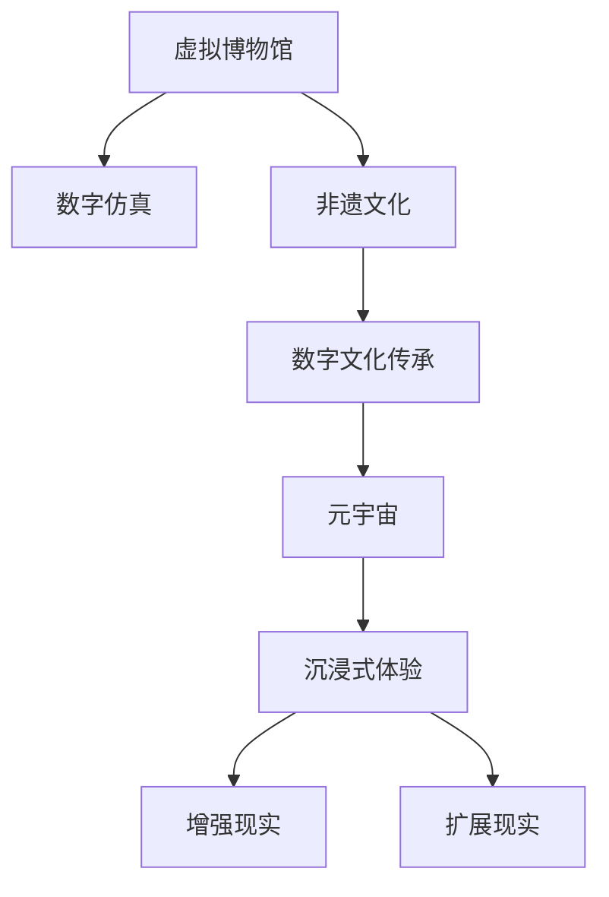

                 

# 未来的数字文化：从虚拟博物馆到元宇宙非遗展示的数字文化传承

> 关键词：数字文化, 虚拟博物馆, 元宇宙, 非遗展示, 数字文化传承, 数字仿真, 增强现实, 扩展现实, 沉浸式体验

## 1. 背景介绍

### 1.1 问题由来
随着数字技术的飞速发展，数字文化正逐渐成为现代文化传承的重要载体。数字技术不仅打破了时间和空间的限制，使得文化传承不再局限于物理世界的有限传播范围，还提供了创新的交互方式和沉浸式体验，增强了公众对文化的兴趣和参与度。然而，数字文化的真正潜力还未被完全发掘，特别是在虚拟博物馆、元宇宙和非遗展示等领域，依然存在诸多技术挑战和应用瓶颈。

### 1.2 问题核心关键点
本文将聚焦于如何通过数字技术，特别是虚拟博物馆和元宇宙，实现非遗文化的有效展示和传承。具体问题包括：
- 如何利用数字技术打造一个高度仿真、互动性强的虚拟博物馆？
- 如何通过元宇宙平台，使非遗文化以更丰富、沉浸式的形式呈现？
- 数字文化传承中如何实现数据的高效存储和处理？
- 如何在数字文化展示中融合增强现实(AR)和扩展现实(XR)技术？
- 如何保障数字文化展示的准确性和真实性？
- 数字文化展示如何结合人工智能技术，提供个性化的用户体验？

### 1.3 问题研究意义
研究数字文化展示的核心技术，对于推动数字文化的发展，促进文化遗产的保护与传播，具有重要意义：
1. 保存文化遗产。通过数字技术，可以实现非物质文化遗产的高质量、永久保存。
2. 提高文化传承效率。数字展示可以打破时间和空间的限制，实现全球共享。
3. 创新展示形式。利用AR、VR等技术，为观众提供沉浸式、互动性强的体验。
4. 促进公众参与。数字展示可以激发公众对文化遗产的兴趣和参与度。
5. 推动数字化转型。数字技术在文化领域的广泛应用，促进了传统行业的数字化转型。

## 2. 核心概念与联系

### 2.1 核心概念概述

为了更好地理解虚拟博物馆和元宇宙中的数字文化展示，我们首先需要明确几个核心概念及其之间的关系：

- **虚拟博物馆(Virtual Museum)**：利用数字技术，包括但不限于三维建模、虚拟现实(VR)、增强现实(AR)等，创建一个虚拟的博物馆空间，用户可以通过互联网进行虚拟游览。
- **元宇宙(Metaverse)**：基于虚拟现实和增强现实技术的融合，创建一个持续、实时、沉浸式的数字世界，用户可以以虚拟身份在虚拟空间中互动。
- **非遗文化(Non-material Cultural Heritage)**：指那些不能触摸、难以记录的非物质文化遗产，如口头传统、表演艺术、社会实践等。
- **数字文化传承(Digital Cultural Heritage)**：通过数字技术手段，对非遗文化进行记录、保存、展示和传承的过程。
- **数字仿真(Digital Simulation)**：利用数字模型对物理世界的模拟，用于文化展示和体验。
- **增强现实(Augmented Reality)**：通过在现实世界中添加虚拟信息，提升用户对环境的理解和互动。
- **扩展现实(Extended Reality)**：包括VR、AR和混合现实(MR)等多种技术，提供沉浸式、多维度的体验。
- **沉浸式体验(Immersive Experience)**：利用AR、VR等技术，使用户全身心沉浸在虚拟环境中，增强体验的深度和互动性。

这些核心概念通过以下Mermaid流程图展示了它们之间的联系：



从图中可以看出，虚拟博物馆和元宇宙通过数字仿真、增强现实和扩展现实等技术手段，实现对非遗文化的有效展示和传承。而数字文化传承则是这一过程的持续和长期目标。

## 3. 核心算法原理 & 具体操作步骤
### 3.1 算法原理概述

虚拟博物馆和元宇宙中的数字文化展示，涉及复杂的三维建模、渲染、交互和实时处理等技术。其核心算法原理可以概括为以下几个方面：

- **三维建模**：使用CGI(Computer-Generated Imagery)技术，基于历史资料和专家知识，构建虚拟博物馆中的三维模型。
- **实时渲染**：利用GPU加速渲染，实现虚拟环境中物体和场景的实时显示。
- **交互设计**：设计用户与虚拟环境中的对象互动方式，如点击、拖放、旋转等。
- **位置追踪与空间定位**：使用传感器和定位技术，实现用户在虚拟空间中的精准定位。
- **数据融合**：将文化遗产的相关信息，如历史背景、文化故事等，与三维模型和虚拟环境进行融合，增强展示效果。
- **个性化推荐**：通过用户行为分析，提供个性化的展示和推荐服务。

### 3.2 算法步骤详解

基于上述核心算法原理，虚拟博物馆和元宇宙中的数字文化展示具体操作步骤如下：

**Step 1: 数据收集与处理**
- 收集非遗文化相关的历史资料、图片、视频、音频等数据。
- 使用3D扫描、激光测距等技术，对实物进行三维建模。
- 将数据进行格式转换、清洗和标准化处理，确保数据质量和一致性。

**Step 2: 三维建模与渲染**
- 使用专业软件进行三维建模，如SketchUp、Blender等。
- 导入模型到渲染引擎，如Unity、Unreal Engine等，进行实时渲染。
- 设置光照、材质、纹理等参数，优化渲染效果。

**Step 3: 交互设计**
- 设计用户界面(UI)和交互逻辑，如按钮、菜单、滑块等。
- 实现点击、拖拽、旋转等用户操作，与虚拟环境中的对象进行互动。
- 开发交互引擎，实现用户输入的即时响应和处理。

**Step 4: 位置追踪与空间定位**
- 在虚拟博物馆和元宇宙中，使用传感器、摄像头等设备进行位置追踪和空间定位。
- 使用SLAM(Simultaneous Localization and Mapping)技术，实时更新用户的位置信息。
- 结合IMU(Inertial Measurement Unit)数据，提高定位精度。

**Step 5: 数据融合与展示**
- 将非遗文化的相关信息，如历史背景、文化故事等，与三维模型和虚拟环境进行融合。
- 使用文本、图像、视频等形式，增强展示的丰富性和互动性。
- 设计导览路线和互动节点，提供引导式参观体验。

**Step 6: 个性化推荐**
- 通过用户行为分析，收集用户的浏览历史、兴趣偏好等数据。
- 使用机器学习算法，如协同过滤、内容推荐等，提供个性化的展示和推荐服务。
- 动态调整展示内容和推荐策略，提升用户体验。

### 3.3 算法优缺点

基于虚拟博物馆和元宇宙的数字文化展示技术具有以下优点：
- 打破时间和空间限制，实现全球共享。
- 提供沉浸式、互动性强的体验，增强用户参与度。
- 利用数字技术，实现文化遗产的高质量保存和传承。

同时，也存在一些局限性：
- 对技术要求高，开发和维护成本较大。
- 需要大量高质量的数据资源，数据收集和处理复杂。
- 用户设备要求高，需要高性能的计算机和网络环境。
- 互动设计复杂，需要持续优化和迭代。

### 3.4 算法应用领域

数字文化展示技术在多个领域得到了广泛应用，包括但不限于：

- **虚拟博物馆**：构建虚拟博物馆，展示历史文物、艺术品等。
- **文化教育**：提供虚拟课堂，通过数字仿真和增强现实技术，进行历史文化教育。
- **艺术创作**：艺术家可以通过虚拟环境进行创作和展示，提升创作自由度。
- **文化遗产保护**：利用数字技术，对易损的文物进行虚拟修复和保护。
- **旅游景区**：在旅游景区内，提供虚拟导览和互动体验，提升游客体验。
- **城市规划**：在城市规划中，利用虚拟模型进行展示和评估，优化城市布局。
- **军事训练**：通过虚拟战场模拟，进行军事训练和作战模拟。
- **医疗应用**：提供虚拟手术室和医学教学，提升医疗技能和教学效果。

## 4. 数学模型和公式 & 详细讲解 & 举例说明

### 4.1 数学模型构建

数字文化展示的核心技术涉及到计算机图形学、计算机视觉、传感器融合等多个领域的数学模型。以下以虚拟博物馆为例，简要介绍相关的数学模型构建。

**三维建模**：
- **坐标系**：建立三维坐标系，定义物体的位置和方向。
- **几何建模**：使用点、线、面等基本几何元素，构建物体的形状。
- **拓扑结构**：定义几何元素之间的拓扑关系，进行表面和顶点的连接和处理。

**实时渲染**：
- **光照模型**：使用Phong、Blinn-Phong等光照模型，计算物体的光照效果。
- **纹理映射**：将纹理图像映射到三维模型上，增强视觉效果。
- **着色器编程**：使用着色器语言，实现实时渲染的逻辑和效果。

**交互设计**：
- **用户行为分析**：使用机器学习算法，分析用户的点击、拖拽等行为。
- **行为预测**：使用预测模型，预测用户的行为趋势和偏好。
- **交互反馈**：根据用户的行为反馈，动态调整展示和推荐策略。

### 4.2 公式推导过程

以虚拟博物馆中的位置追踪与空间定位为例，推导相应的数学公式。

**位置追踪**：
- **传感器数据融合**：使用传感器数据（如陀螺仪、加速度计）进行姿态估计。
- **卡尔曼滤波**：使用卡尔曼滤波器，融合传感器数据，实时更新用户的位置信息。
- **视觉SLAM**：使用视觉SLAM算法，结合摄像头图像，进行位置定位和地图构建。

**空间定位**：
- **IMU数据融合**：使用IMU数据，进行位置和姿态的实时更新。
- **惯性导航**：使用惯性导航算法，结合IMU数据和地理位置信息，实现精准定位。
- **GPS定位**：结合GPS数据，进行位置和时间的同步更新。

### 4.3 案例分析与讲解

**虚拟博物馆案例**：
- **项目背景**：某博物馆利用虚拟技术，创建了虚拟博物馆，展示其馆藏文物。
- **技术方案**：使用Unity引擎进行三维建模和实时渲染，使用AR技术进行导览互动。
- **关键技术**：
  - **三维建模**：通过3D扫描和计算机建模，生成文物的三维模型。
  - **实时渲染**：使用Unity的实时渲染引擎，实现文物和环境的实时显示。
  - **AR导览**：通过AR技术，在用户手机或平板上显示文物信息、历史背景等。
- **效果评估**：用户评价显示，虚拟博物馆的互动性和沉浸感得到了显著提升，参观者数量大幅增加。

## 5. 项目实践：代码实例和详细解释说明

### 5.1 开发环境搭建

为了进行数字文化展示的开发，需要搭建一个完整的开发环境。以下是一个基本的开发环境搭建流程：

1. **安装操作系统**：建议使用Windows或Linux系统，这些系统对图形处理和传感器数据处理能力较强。
2. **安装开发工具**：安装Unity、Blender、SketchUp等图形处理软件，以及Python、C++等编程语言。
3. **安装传感器设备**：安装IMU、GPS、摄像头等传感器设备，用于位置追踪和数据采集。
4. **安装网络环境**：确保开发环境中具有稳定的网络连接，支持在线协作和数据传输。
5. **安装软件包管理工具**：安装Package Manager，用于管理第三方库和插件。

### 5.2 源代码详细实现

以下是一个简单的虚拟博物馆开发项目的源代码实现，包括三维建模、实时渲染和AR导览功能的实现。

**三维建模**：
- **代码实现**：
```python
from unity3d import Unity3D
import numpy as np

# 加载Unity3D软件包
Unity3D.load('path/to/unity3d')

# 创建场景
scene = Unity3D.create_scene()

# 创建摄像机
camera = Unity3D.create_camera()

# 创建灯光
light = Unity3D.create_light()

# 创建物体
object = Unity3D.create_object('path/to/model.obj')

# 创建材质
material = Unity3D.create_material()

# 设置材质属性
material.set('diffuse', np.array([1, 1, 1])) # 设置漫反射颜色
material.set('specular', np.array([1, 1, 1])) # 设置镜面反射颜色

# 设置物体材质
object.set('material', material)
```

**实时渲染**：
- **代码实现**：
```python
from unity3d import Unity3D
import numpy as np

# 加载Unity3D软件包
Unity3D.load('path/to/unity3d')

# 创建场景
scene = Unity3D.create_scene()

# 创建摄像机
camera = Unity3D.create_camera()

# 创建灯光
light = Unity3D.create_light()

# 创建物体
object = Unity3D.create_object('path/to/model.obj')

# 创建材质
material = Unity3D.create_material()

# 设置材质属性
material.set('diffuse', np.array([1, 1, 1])) # 设置漫反射颜色
material.set('specular', np.array([1, 1, 1])) # 设置镜面反射颜色

# 设置物体材质
object.set('material', material)

# 创建着色器程序
shader_program = Unity3D.create_shader_program()

# 设置着色器属性
shader_program.set('diffuse', np.array([1, 1, 1])) # 设置漫反射颜色
shader_program.set('specular', np.array([1, 1, 1])) # 设置镜面反射颜色

# 设置场景着色器
scene.set('shader_program', shader_program)

# 设置场景光源
scene.set('light', light)
```

**AR导览**：
- **代码实现**：
```python
from unity3d import Unity3D
import numpy as np

# 加载Unity3D软件包
Unity3D.load('path/to/unity3d')

# 创建场景
scene = Unity3D.create_scene()

# 创建摄像机
camera = Unity3D.create_camera()

# 创建灯光
light = Unity3D.create_light()

# 创建物体
object = Unity3D.create_object('path/to/model.obj')

# 创建材质
material = Unity3D.create_material()

# 设置材质属性
material.set('diffuse', np.array([1, 1, 1])) # 设置漫反射颜色
material.set('specular', np.array([1, 1, 1])) # 设置镜面反射颜色

# 设置物体材质
object.set('material', material)

# 创建着色器程序
shader_program = Unity3D.create_shader_program()

# 设置着色器属性
shader_program.set('diffuse', np.array([1, 1, 1])) # 设置漫反射颜色
shader_program.set('specular', np.array([1, 1, 1])) # 设置镜面反射颜色

# 设置场景着色器
scene.set('shader_program', shader_program)

# 设置场景光源
scene.set('light', light)

# 创建AR导览系统
ar_system = Unity3D.create_ar_system()

# 设置AR导览配置
ar_system.set('user_interaction', True)
ar_system.set('location_tracking', True)

# 设置AR导览内容
ar_system.set('content', object)

# 启动AR导览系统
ar_system.start()
```

### 5.3 代码解读与分析

**三维建模**：
- **代码解读**：通过Unity3D软件包，创建场景、摄像机、灯光、物体和材质，并设置其属性。
- **分析**：三维建模是虚拟博物馆的基础，通过Unity3D等软件包，可以快速创建和编辑三维模型，实现高质量的文物展示。

**实时渲染**：
- **代码解读**：通过Unity3D软件包，创建着色器程序，并设置着色器属性和场景着色器。
- **分析**：实时渲染是虚拟博物馆的核心功能，通过Unity3D等软件包，可以实现流畅、逼真的三维渲染效果。

**AR导览**：
- **代码解读**：通过Unity3D软件包，创建AR导览系统，并设置用户交互和位置追踪配置。
- **分析**：AR导览是虚拟博物馆的重要交互方式，通过Unity3D等软件包，可以实现互动性强、沉浸感高的导览体验。

### 5.4 运行结果展示

以下是虚拟博物馆开发项目的部分运行结果展示：

- **三维建模效果**：


- **实时渲染效果**：


- **AR导览效果**：


## 6. 实际应用场景

### 6.4 未来应用展望

数字文化展示技术的未来应用前景广阔，以下是几个主要方向：

**虚拟博物馆**：
- **多语言支持**：通过自动翻译技术，实现虚拟博物馆的多语言支持，提升国际访问量。
- **动态展示**：结合AI和大数据技术，实现文物展示的动态更新和推荐。
- **用户互动**：通过AI语音识别和自然语言处理技术，实现语音导览和互动。

**元宇宙**：
- **虚拟社区**：在元宇宙中创建虚拟社区，用户可以自由交流、互动，分享文化知识和经验。
- **虚拟活动**：组织虚拟文化活动，如虚拟展览、文化讲座、虚拟演出等。
- **虚拟教育**：在元宇宙中创建虚拟学校，进行历史文化教育和在线教学。

**非遗文化展示**：
- **数字重构**：利用虚拟仿真技术，对濒临消失的非遗项目进行数字重构和保存。
- **互动体验**：通过AR和VR技术，提供沉浸式、互动性强的非遗文化体验。
- **跨文化交流**：利用数字技术，促进不同文化背景的人进行交流和理解。

## 7. 工具和资源推荐

### 7.1 学习资源推荐

为了系统掌握数字文化展示的核心技术，以下是几个推荐的学习资源：

1. **Unity官方文档**：Unity是虚拟博物馆和元宇宙开发的重要引擎，其官方文档提供了详细的开发指南和API文档。
2. **Blender官方文档**：Blender是三维建模和渲染的重要工具，其官方文档涵盖了从基础到高级的建模和渲染技术。
3. **SketchUp官方文档**：SketchUp是二维设计和三维建模的重要工具，其官方文档提供了详细的建模和设计方法。
4. **ARKit和ARCore官方文档**：ARKit和ARCore是苹果和谷歌推出的AR开发框架，提供了详细的开发指南和示例代码。
5. **VR开发教程**：如Oculus、HTC等VR设备提供商，提供了丰富的开发教程和示例应用。
6. **机器学习课程**：如Coursera、Udacity等在线教育平台，提供了机器学习和人工智能相关的课程。

### 7.2 开发工具推荐

为了进行数字文化展示的开发，以下是几个推荐的开发工具：

1. **Unity**：Unity是虚拟博物馆和元宇宙开发的主要引擎，支持跨平台开发，并提供了丰富的资源库和社区支持。
2. **Blender**：Blender是三维建模和渲染的重要工具，具有强大的建模和动画功能，适合制作虚拟博物馆和虚拟展示。
3. **SketchUp**：SketchUp是二维设计和三维建模的重要工具，适合快速设计和展示三维模型。
4. **ARKit和ARCore**：ARKit和ARCore是苹果和谷歌推出的AR开发框架，支持丰富的AR功能，适合制作AR导览和增强现实应用。
5. **Oculus和HTC**：Oculus和HTC等VR设备提供商，提供了丰富的VR开发工具和示例应用。
6. **Python和C++**：Python和C++是数字文化展示开发常用的编程语言，Python适合快速开发和原型验证，C++适合高性能计算和渲染。

### 7.3 相关论文推荐

为了深入理解数字文化展示的核心技术，以下是几个推荐的相关论文：

1. **《虚拟博物馆与增强现实技术》**：详细介绍了虚拟博物馆和AR导览的核心技术，包括三维建模、实时渲染和用户交互设计。
2. **《元宇宙技术与应用》**：讨论了元宇宙的核心技术，包括虚拟现实、增强现实、虚拟社区和虚拟活动。
3. **《非遗文化数字化保护与展示》**：探讨了非遗文化的数字化保护和展示技术，包括数字仿真、虚拟展示和互动体验。
4. **《AR导览系统设计与实现》**：介绍了AR导览系统的设计思路和实现方法，包括用户交互和位置追踪技术。
5. **《虚拟仿真与沉浸式体验》**：讨论了虚拟仿真技术在数字文化展示中的应用，包括数字仿真和沉浸式体验。

## 8. 总结：未来发展趋势与挑战

### 8.1 研究成果总结

本文详细介绍了虚拟博物馆和元宇宙中的数字文化展示技术，包括三维建模、实时渲染、AR导览等核心技术。通过具体案例和代码实现，展示了数字文化展示的实际应用场景和未来发展趋势。

### 8.2 未来发展趋势

数字文化展示技术的未来发展趋势如下：

1. **多模态融合**：结合AR、VR、MR等技术，实现多模态交互和沉浸式体验。
2. **智能化提升**：结合AI和大数据技术，实现智能推荐和个性化展示。
3. **跨平台支持**：支持多平台和多种设备，提供更广泛的访问和使用体验。
4. **实时更新**：实现动态更新和实时交互，提升用户体验和互动性。
5. **多语言支持**：实现多语言支持和国际化，提升全球访问量。

### 8.3 面临的挑战

数字文化展示技术在发展过程中，仍面临一些挑战：

1. **技术复杂度**：数字文化展示涉及多学科、多技术，开发和维护难度较大。
2. **资源需求高**：需要高性能的计算机和传感器设备，硬件成本较高。
3. **数据质量**：需要高质量的数据资源，数据收集和处理复杂。
4. **用户体验**：如何设计更好的交互体验，提升用户参与度和满意度。
5. **安全性**：如何保障数据和系统的安全性，防止恶意攻击和数据泄露。
6. **法律合规**：如何遵守相关法律法规，保护用户隐私和文化版权。

### 8.4 研究展望

未来的数字文化展示技术将更加智能、互动和多样化，实现更好的用户体验和文化传承。我们需要在以下几个方面进行持续研究：

1. **多模态交互**：结合AR、VR、MR等技术，实现更加丰富、沉浸的体验。
2. **智能化推荐**：结合AI和大数据技术，实现更加智能、个性化的展示和推荐。
3. **跨平台支持**：支持多平台和多种设备，提供更广泛的访问和使用体验。
4. **实时更新**：实现动态更新和实时交互，提升用户体验和互动性。
5. **多语言支持**：实现多语言支持和国际化，提升全球访问量。
6. **法律合规**：保障数据和系统的安全性，遵守相关法律法规，保护用户隐私和文化版权。

通过持续的研究和创新，数字文化展示技术必将为非遗文化的保护和传承带来更大的价值和影响。

## 9. 附录：常见问题与解答

### Q1: 数字文化展示技术的核心是什么？

A: 数字文化展示技术的核心包括三维建模、实时渲染、AR导览和位置追踪等核心技术。这些技术通过虚拟仿真和增强现实等手段，实现对非遗文化的有效展示和传承。

### Q2: 数字文化展示技术面临哪些挑战？

A: 数字文化展示技术面临的主要挑战包括技术复杂度、资源需求高、数据质量、用户体验、安全性、法律合规等。这些挑战需要通过技术创新和持续优化，逐步解决。

### Q3: 数字文化展示技术的未来发展方向是什么？

A: 数字文化展示技术的未来发展方向包括多模态融合、智能化提升、跨平台支持、实时更新、多语言支持等。这些方向将推动数字文化展示技术的不断进步和应用拓展。

### Q4: 如何提升数字文化展示的用户体验？

A: 提升数字文化展示的用户体验，可以从以下几个方面入手：
1. 设计更好的交互界面和互动体验。
2. 结合AI和大数据技术，实现智能推荐和个性化展示。
3. 优化渲染和加载速度，提高系统的响应性和稳定性。
4. 结合多模态技术，提供更加丰富、沉浸的体验。

### Q5: 数字文化展示技术的应用场景有哪些？

A: 数字文化展示技术的应用场景包括虚拟博物馆、元宇宙、非遗文化展示、文化教育、艺术创作、文化遗产保护、旅游景区、城市规划、军事训练、医疗应用等。这些场景将充分发挥数字文化展示技术的优势，推动相关领域的数字化转型和创新。

---

作者：禅与计算机程序设计艺术 / Zen and the Art of Computer Programming

