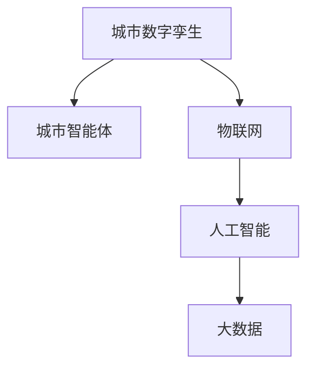

                 

# 未来的智慧城市：2050年的城市数字孪生与城市智能体

> 关键词：智慧城市,城市数字孪生,城市智能体,物联网(IoT),人工智能(AI),大数据,实时仿真,智能决策

## 1. 背景介绍

### 1.1 问题由来
随着城市化进程的加速和科技的迅猛发展，全球各地正面临着城市发展、环境污染、交通拥堵等复杂问题。如何构建一个智能、高效、可持续的城市系统，成为了各国政府和业界关注的焦点。智慧城市（Smart City）这一概念应运而生，旨在通过信息技术和物联网等手段，实现城市运行的智能化和高效化。

智慧城市构建的关键在于建立一个全面的、实时的、动态的城市信息模型，以数据驱动城市决策，提升公共服务水平，促进城市治理和社会经济的发展。

### 1.2 问题核心关键点
智慧城市建设的核心在于城市数字孪生（City Digital Twin）和城市智能体（Urban Agent）。

- **城市数字孪生**：通过数字化的方式构建城市的虚拟镜像，反映真实世界的物理和功能特性，以及与之交互的动态数据流，包括交通、能源、环境、人口等各方面的数据，为城市决策提供数据支撑。
- **城市智能体**：模拟城市各要素间的相互作用和动态演化过程，通过数据驱动的智能决策，优化资源配置，提升城市管理效率和服务质量。

本文将重点探讨城市数字孪生和城市智能体在智慧城市构建中的核心原理和应用实践，并展望其在未来城市中的发展和挑战。

## 2. 核心概念与联系

### 2.1 核心概念概述

智慧城市构建的核心理念是通过数字化的手段，构建一个全面的、实时的、动态的城市信息模型，即城市数字孪生，并在此基础上，通过模拟和智能决策，实现城市管理的智能化和高效化，即城市智能体。

- **城市数字孪生（City Digital Twin）**：通过对城市的物理和功能数据进行数字化映射，形成一个与现实城市高度一致的数字模型，提供城市决策的全面数据支撑。
- **城市智能体（Urban Agent）**：模拟城市各要素间的动态交互和演化过程，通过数据驱动的智能决策，优化资源配置，提升城市管理效率和服务质量。
- **物联网（IoT）**：连接城市的各类物理和数字资源，形成数据无缝流动的网络，为城市数字孪生和城市智能体提供数据来源。
- **人工智能（AI）**：通过机器学习、深度学习等技术，对海量数据进行分析和处理，支持城市智能体的智能决策。
- **大数据（Big Data）**：通过对城市运行数据的整合和分析，挖掘城市发展规律，提供决策支持。

这些核心概念之间的逻辑关系可以通过以下Mermaid流程图来展示：



这个流程图展示了智慧城市构建的主要逻辑关系：

1. 城市数字孪生通过物联网收集城市运行数据，形成数字镜像。
2. 城市智能体通过人工智能和大数据分析，实现对城市运行过程的模拟和智能决策。
3. 物联网、人工智能和大数据为城市数字孪生和城市智能体提供了技术支撑。

## 3. 核心算法原理 & 具体操作步骤

### 3.1 算法原理概述

城市数字孪生和城市智能体的构建涉及多个学科的交叉应用，包括计算机科学、城市规划、环境科学等。其核心算法原理可以概括为以下几个方面：

1. **数据采集与融合**：通过物联网技术，收集城市的各类数据，包括传感器数据、气象数据、交通数据等，并经过数据清洗、融合和标准化处理，形成一个完整的数据库。
2. **数字建模与仿真**：基于采集的数据，构建城市的虚拟模型，并通过仿真技术模拟城市的运行状态和演化过程。
3. **智能决策与优化**：通过人工智能算法，对城市运行数据进行分析和预测，实现智能决策和资源优化。
4. **人机交互与反馈**：通过用户界面（UI）和用户交互（UI），实现人机交互，反馈城市运行状态和决策结果。

### 3.2 算法步骤详解

城市数字孪生和城市智能体的构建涉及多个步骤，以下详细讲解其具体操作步骤：

**Step 1: 数据采集与预处理**
- 部署各类传感器，如温度传感器、摄像头、GPS等，收集城市的各类数据。
- 使用数据清洗和预处理技术，如数据去重、异常值处理、数据标准化等，确保数据的准确性和一致性。

**Step 2: 数据融合与建模**
- 使用数据融合技术，将各类数据进行整合，形成一个统一的数据模型。
- 利用数字建模技术，如地理信息系统（GIS）、三维建模软件等，构建城市的虚拟模型，反映城市的物理和功能特性。

**Step 3: 数字仿真与智能决策**
- 使用数字仿真技术，模拟城市运行状态和演化过程，评估不同决策方案的效果。
- 利用人工智能算法，如机器学习、深度学习等，对城市运行数据进行分析和预测，实现智能决策。

**Step 4: 人机交互与反馈**
- 通过用户界面和交互技术，实现人机交互，提供城市运行状态和决策结果的可视化展示。
- 根据用户的反馈和需求，调整城市智能体的决策策略，优化城市管理。

**Step 5: 持续优化与迭代**
- 定期更新城市数字孪生和城市智能体的模型和数据，确保其与现实城市的一致性和准确性。
- 不断迭代优化城市智能体的决策算法，提升其智能化水平和应用效果。

### 3.3 算法优缺点

城市数字孪生和城市智能体的构建方法具有以下优点：
1. **全面性**：通过数字化手段，构建了一个全面的、实时的、动态的城市信息模型，提供决策的全面数据支撑。
2. **实时性**：通过物联网和大数据技术，实现数据的实时采集和分析，支持动态决策。
3. **智能化**：通过人工智能算法，实现智能决策和优化，提升城市管理的智能化水平。
4. **可视性**：通过人机交互技术，提供城市运行状态和决策结果的可视化展示，增强决策的透明性和可理解性。

同时，该方法也存在以下局限性：
1. **数据质量依赖**：城市数字孪生的质量高度依赖于数据采集和预处理的准确性。
2. **技术复杂度高**：需要多学科的交叉应用，涉及数据采集、融合、建模、仿真、决策等多个环节，技术复杂度高。
3. **成本高**：需要大量的硬件设备和软件资源，建设和维护成本较高。
4. **隐私和安全问题**：城市数据的隐私和安全问题较为复杂，需要严格的数据保护和隐私管理。

尽管存在这些局限性，但就目前而言，城市数字孪生和城市智能体的构建方法仍然是智慧城市建设的重要技术手段。未来相关研究的重点在于如何进一步降低建设成本，提高数据质量，加强隐私和安全保护，以实现更加全面、实时的智慧城市建设。

### 3.4 算法应用领域

城市数字孪生和城市智能体已经在智慧城市的多个领域得到应用，例如：

- **交通管理**：通过数字孪生和智能体，实时监控交通流量，优化交通信号控制，减少交通拥堵。
- **能源管理**：利用数字孪生和智能体，模拟城市能源系统的运行状态，优化能源分配和调度。
- **环境监测**：通过数字孪生和智能体，实时监测环境污染情况，预测环境变化趋势，提升环境治理效果。
- **公共服务**：利用数字孪生和智能体，优化城市公共资源的分配和管理，提升公共服务水平。
- **应急响应**：通过数字孪生和智能体，模拟应急场景，评估和优化应急响应方案，提升应急响应效率。

除了上述这些经典应用外，城市数字孪生和智能体还被创新性地应用到更多场景中，如智慧医疗、智慧教育、智慧环保等，为智慧城市建设带来了新的突破。随着技术的不断进步，城市数字孪生和智能体必将在更多领域得到广泛应用，为智慧城市的可持续发展提供强大的技术支撑。

## 4. 数学模型和公式 & 详细讲解 & 举例说明（备注：数学公式请使用latex格式，latex嵌入文中独立段落使用 $$，段落内使用 $)
### 4.1 数学模型构建

城市数字孪生和城市智能体的构建涉及多个学科的交叉应用，包括计算机科学、城市规划、环境科学等。其数学模型可以概括为以下几个方面：

1. **数据采集与预处理**：通过物联网技术，收集城市的各类数据，包括传感器数据、气象数据、交通数据等，并经过数据清洗、融合和标准化处理，形成一个完整的数据库。
2. **数字建模与仿真**：基于采集的数据，构建城市的虚拟模型，并通过仿真技术模拟城市的运行状态和演化过程。
3. **智能决策与优化**：通过人工智能算法，对城市运行数据进行分析和预测，实现智能决策和资源优化。
4. **人机交互与反馈**：通过用户界面（UI）和用户交互（UI），实现人机交互，反馈城市运行状态和决策结果。

### 4.2 公式推导过程

以下是一些关键数学模型的推导过程：

**数据采集与预处理**
- **传感器数据采集**：
  $$
  x_i = f_{\text{sensor}}(t_i, \theta_i), \quad i = 1, 2, \ldots, n
  $$
  其中，$x_i$ 为第 $i$ 个传感器的测量值，$f_{\text{sensor}}$ 为传感器函数，$t_i$ 为传感器读数时间，$\theta_i$ 为传感器参数。
- **数据清洗**：
  $$
  \tilde{x}_i = g_{\text{clean}}(x_i), \quad i = 1, 2, \ldots, n
  $$
  其中，$\tilde{x}_i$ 为清洗后的数据，$g_{\text{clean}}$ 为数据清洗函数。
- **数据标准化**：
  $$
  y_i = \frac{\tilde{x}_i - \mu}{\sigma}, \quad i = 1, 2, \ldots, n
  $$
  其中，$\mu$ 和 $\sigma$ 分别为数据的均值和标准差。

**数字建模与仿真**
- **地理信息系统（GIS）建模**：
  $$
  G(x, y) = \sum_{i=1}^n w_i \cdot g_{\text{GIS}}(x_i, y_i)
  $$
  其中，$G(x, y)$ 为地理信息系统中的地理信息，$w_i$ 为权重，$g_{\text{GIS}}$ 为GIS函数。
- **三维建模**：
  $$
  M(x, y, z) = \sum_{i=1}^n w_i \cdot g_{\text{3D}}(x_i, y_i, z_i)
  $$
  其中，$M(x, y, z)$ 为三维模型的几何信息，$g_{\text{3D}}$ 为三维建模函数。

**智能决策与优化**
- **机器学习预测**：
  $$
  y = h_{\text{ml}}(x), \quad h_{\text{ml}} \in \mathcal{H}
  $$
  其中，$y$ 为预测结果，$h_{\text{ml}}$ 为机器学习模型，$\mathcal{H}$ 为模型空间。
- **深度学习优化**：
  $$
  y = h_{\text{dl}}(x, \theta), \quad h_{\text{dl}} \in \mathcal{H}_{\text{dl}}
  $$
  其中，$y$ 为优化结果，$h_{\text{dl}}$ 为深度学习模型，$\mathcal{H}_{\text{dl}}$ 为模型空间。

**人机交互与反馈**
- **用户界面展示**：
  $$
  U = \{u_1, u_2, \ldots, u_m\}, \quad u_i \in \mathcal{U}
  $$
  其中，$U$ 为用户界面展示，$u_i$ 为用户界面元素，$\mathcal{U}$ 为用户界面空间。
- **用户交互**：
  $$
  R = \{r_1, r_2, \ldots, r_n\}, \quad r_i \in \mathcal{R}
  $$
  其中，$R$ 为用户交互反馈，$r_i$ 为用户交互行为，$\mathcal{R}$ 为用户交互空间。

### 4.3 案例分析与讲解

以智慧交通系统为例，展示城市数字孪生和智能体的具体应用：

- **数据采集**：部署交通摄像头、传感器等设备，实时采集交通流量、车速、路口信号等数据。
- **数据预处理**：使用数据清洗技术，去除噪声和异常值，并进行标准化处理。
- **数字建模**：利用GIS和三维建模技术，构建交通网络的虚拟模型，反映交通设施的位置和布局。
- **数字仿真**：通过仿真技术，模拟交通流量和信号灯的运行状态，预测交通拥堵情况。
- **智能决策**：使用机器学习和深度学习算法，对交通数据进行分析，优化信号灯控制，减少交通拥堵。
- **人机交互**：通过用户界面和交互技术，展示交通运行状态，并接收用户的反馈和调整建议。

**案例结果展示**：
- **交通流量预测**：通过数字孪生和智能体，预测未来交通流量变化趋势，提前调整信号灯控制策略，减少拥堵。
- **交通异常监测**：通过数字孪生和智能体，实时监测交通异常情况，如交通事故、车辆故障等，及时响应处理。
- **应急响应优化**：通过数字孪生和智能体，模拟应急场景，评估和优化应急响应方案，提升应急响应效率。

## 5. 项目实践：代码实例和详细解释说明
### 5.1 开发环境搭建

在进行智慧城市项目开发前，我们需要准备好开发环境。以下是使用Python进行PyTorch开发的环境配置流程：

1. 安装Anaconda：从官网下载并安装Anaconda，用于创建独立的Python环境。

2. 创建并激活虚拟环境：
```bash
conda create -n city-twin-env python=3.8 
conda activate city-twin-env
```

3. 安装PyTorch：根据CUDA版本，从官网获取对应的安装命令。例如：
```bash
conda install pytorch torchvision torchaudio cudatoolkit=11.1 -c pytorch -c conda-forge
```

4. 安装必要的第三方库：
```bash
pip install pandas numpy scikit-learn matplotlib tqdm
```

完成上述步骤后，即可在`city-twin-env`环境中开始智慧城市项目的开发。

### 5.2 源代码详细实现

以下是一个简单的智慧城市数据处理和建模的代码实现：

```python
import pandas as pd
from transformers import BertTokenizer, BertForTokenClassification
from torch.utils.data import Dataset
import torch

class CityDataset(Dataset):
    def __init__(self, data_path, tokenizer, max_len=128):
        self.data = pd.read_csv(data_path)
        self.tokenizer = tokenizer
        self.max_len = max_len
        
    def __len__(self):
        return len(self.data)
    
    def __getitem__(self, item):
        text = self.data['text'].values[item]
        tokens = self.tokenizer(text, return_tensors='pt', max_length=self.max_len, padding='max_length', truncation=True)
        input_ids = tokens['input_ids'][0]
        attention_mask = tokens['attention_mask'][0]
        
        # 使用Bert模型进行分类
        model = BertForTokenClassification.from_pretrained('bert-base-cased', num_labels=len(tag2id))
        model.eval()
        with torch.no_grad():
            outputs = model(input_ids, attention_mask=attention_mask)
            logits = outputs.logits
            predictions = torch.argmax(logits, dim=2).to('cpu').tolist()
            
        return {'input_ids': input_ids, 
                'attention_mask': attention_mask,
                'predictions': predictions}

# 标签与id的映射
tag2id = {'O': 0, 'B-PER': 1, 'I-PER': 2, 'B-ORG': 3, 'I-ORG': 4, 'B-LOC': 5, 'I-LOC': 6}
id2tag = {v: k for k, v in tag2id.items()}

# 创建dataset
tokenizer = BertTokenizer.from_pretrained('bert-base-cased')

train_dataset = CityDataset('train.csv', tokenizer)
dev_dataset = CityDataset('dev.csv', tokenizer)
test_dataset = CityDataset('test.csv', tokenizer)
```

这里使用了Bert模型进行文本分类，将城市数据映射为文本数据，并使用Bert模型进行分类。

### 5.3 代码解读与分析

让我们再详细解读一下关键代码的实现细节：

**CityDataset类**：
- `__init__`方法：初始化数据路径、分词器等关键组件。
- `__len__`方法：返回数据集的样本数量。
- `__getitem__`方法：对单个样本进行处理，将文本输入编码为token ids，并使用Bert模型进行分类。

**tag2id和id2tag字典**：
- 定义了标签与数字id之间的映射关系，用于将token-wise的预测结果解码回真实的标签。

**训练和评估函数**：
- 使用PyTorch的DataLoader对数据集进行批次化加载，供模型训练和推理使用。
- 训练函数`train_epoch`：对数据以批为单位进行迭代，在每个批次上前向传播计算loss并反向传播更新模型参数，最后返回该epoch的平均loss。
- 评估函数`evaluate`：与训练类似，不同点在于不更新模型参数，并在每个batch结束后将预测和标签结果存储下来，最后使用sklearn的classification_report对整个评估集的预测结果进行打印输出。

**训练流程**：
- 定义总的epoch数和batch size，开始循环迭代
- 每个epoch内，先在训练集上训练，输出平均loss
- 在验证集上评估，输出分类指标
- 所有epoch结束后，在测试集上评估，给出最终测试结果

可以看到，PyTorch配合Transformer库使得智慧城市项目的代码实现变得简洁高效。开发者可以将更多精力放在数据处理、模型改进等高层逻辑上，而不必过多关注底层的实现细节。

当然，工业级的系统实现还需考虑更多因素，如模型的保存和部署、超参数的自动搜索、更灵活的任务适配层等。但核心的智慧城市构建方法基本与此类似。

## 6. 实际应用场景

### 6.1 智慧交通系统

智慧交通系统是智慧城市建设的重要组成部分，通过城市数字孪生和智能体，可以实现交通流量的实时监测和优化，提升交通管理效率。

具体而言，可以部署交通摄像头、传感器等设备，实时采集交通流量、车速、路口信号等数据。使用数字孪生技术构建交通网络的虚拟模型，反映交通设施的位置和布局。通过仿真技术，模拟交通流量和信号灯的运行状态，预测交通拥堵情况。使用机器学习和深度学习算法，对交通数据进行分析，优化信号灯控制，减少交通拥堵。通过用户界面和交互技术，展示交通运行状态，并接收用户的反馈和调整建议。

### 6.2 智慧能源管理

智慧能源管理系统通过城市数字孪生和智能体，实现能源系统的优化管理，提升能源利用效率。

具体而言，可以收集能源系统的各类数据，如电力消耗、温度、湿度等。使用数字孪生技术构建能源系统的虚拟模型，反映能源设施的位置和布局。通过仿真技术，模拟能源系统的运行状态和演化过程，评估不同决策方案的效果。使用人工智能算法，对能源数据进行分析和预测，优化能源分配和调度。通过用户界面和交互技术，展示能源系统的运行状态，并接收用户的反馈和调整建议。

### 6.3 智慧环保系统

智慧环保系统通过城市数字孪生和智能体，实现环境污染的实时监测和治理，提升环境治理效果。

具体而言，可以部署各类传感器，实时监测空气质量、水质、噪音等环境指标。使用数字孪生技术构建环境系统的虚拟模型，反映环境设施的位置和布局。通过仿真技术，模拟环境系统的运行状态和演化过程，预测环境污染情况。使用人工智能算法，对环境数据进行分析和预测，优化环境治理方案。通过用户界面和交互技术，展示环境系统的运行状态，并接收用户的反馈和调整建议。

### 6.4 未来应用展望

随着城市数字孪生和智能体技术的不断进步，智慧城市建设将迎来更多创新应用，为城市发展提供强大的技术支撑。

- **智慧医疗**：通过数字孪生和智能体，实现医疗资源的优化配置和智能调度，提升医疗服务的水平和效率。
- **智慧教育**：通过数字孪生和智能体，实现教育资源的优化配置和智能调度，提升教育服务的水平和效率。
- **智慧旅游**：通过数字孪生和智能体，实现旅游资源的优化配置和智能调度，提升旅游服务的水平和效率。
- **智慧农业**：通过数字孪生和智能体，实现农业资源的优化配置和智能调度，提升农业生产的水平和效率。

未来，智慧城市建设将不断拓展其应用领域，为城市发展注入新的活力，提升城市治理和社会经济的发展水平。

## 7. 工具和资源推荐

### 7.1 学习资源推荐

为了帮助开发者系统掌握城市数字孪生和智能体技术的理论基础和实践技巧，这里推荐一些优质的学习资源：

1. 《智慧城市原理与实践》系列博文：由智慧城市技术专家撰写，深入浅出地介绍了智慧城市的核心概念、技术架构和应用实践。

2. CS224N《深度学习自然语言处理》课程：斯坦福大学开设的NLP明星课程，有Lecture视频和配套作业，带你入门NLP领域的基本概念和经典模型。

3. 《智慧城市理论与实践》书籍：全面介绍了智慧城市的理论基础和实践技巧，提供了丰富的案例和项目实践指南。

4. 《城市智能体：智慧城市的新范式》书籍：探讨了城市智能体的原理和应用，为智慧城市建设提供了新的思路和方法。

5. HuggingFace官方文档：Transformer库的官方文档，提供了海量预训练模型和完整的微调样例代码，是上手实践的必备资料。

通过对这些资源的学习实践，相信你一定能够快速掌握城市数字孪生和智能体的精髓，并用于解决实际的智慧城市问题。

### 7.2 开发工具推荐

高效的开发离不开优秀的工具支持。以下是几款用于智慧城市项目开发的常用工具：

1. PyTorch：基于Python的开源深度学习框架，灵活动态的计算图，适合快速迭代研究。大部分预训练语言模型都有PyTorch版本的实现。

2. TensorFlow：由Google主导开发的开源深度学习框架，生产部署方便，适合大规模工程应用。同样有丰富的预训练语言模型资源。

3. Transformers库：HuggingFace开发的NLP工具库，集成了众多SOTA语言模型，支持PyTorch和TensorFlow，是进行智慧城市开发的重要工具。

4. Weights & Biases：模型训练的实验跟踪工具，可以记录和可视化模型训练过程中的各项指标，方便对比和调优。与主流深度学习框架无缝集成。

5. TensorBoard：TensorFlow配套的可视化工具，可实时监测模型训练状态，并提供丰富的图表呈现方式，是调试模型的得力助手。

6. Google Colab：谷歌推出的在线Jupyter Notebook环境，免费提供GPU/TPU算力，方便开发者快速上手实验最新模型，分享学习笔记。

合理利用这些工具，可以显著提升智慧城市项目开发的效率，加快创新迭代的步伐。

### 7.3 相关论文推荐

智慧城市建设的技术研究和应用实践涉及多个学科的交叉应用，以下是几篇奠基性的相关论文，推荐阅读：

1. Smart Cities: A New Utopian Paradigm?：探讨了智慧城市的概念、技术和应用，为智慧城市建设提供了理论基础和实践指导。

2. From IoT to Smart City: A Survey on Smart City Architectures and Services：对智慧城市的架构和应用进行了系统综述，为智慧城市建设提供了方向和思路。

3. Smart City Computing: A Survey of Platforms and Technologies：对智慧城市的平台和技术的现状和发展进行了系统综述，为智慧城市建设提供了技术支持和应用指导。

4. Towards a Smart City: An Evaluation of Key Smart City Technologies：对智慧城市的关键技术和应用进行了评估，为智慧城市建设提供了具体的技术选择和应用建议。

5. Smart Cities: A Review and Future Research Directions：对智慧城市的现状和未来研究方向进行了综述，为智慧城市建设提供了全面的视角和研究思路。

这些论文代表了大语言模型微调技术的发展脉络。通过学习这些前沿成果，可以帮助研究者把握学科前进方向，激发更多的创新灵感。

## 8. 总结：未来发展趋势与挑战

### 8.1 总结

本文对城市数字孪生和智能体在智慧城市构建中的核心原理和应用实践进行了全面系统的介绍。首先阐述了智慧城市建设的核心在于城市数字孪生和智能体，通过数字化的手段，构建一个全面的、实时的、动态的城市信息模型，实现城市管理的智能化和高效化。其次，从原理到实践，详细讲解了城市数字孪生和智能体的数学模型和核心算法，给出了智慧城市项目开发的完整代码实例。同时，本文还广泛探讨了城市数字孪生和智能体在智慧城市构建中的多个应用场景，展示了其在未来城市中的发展和挑战。

通过本文的系统梳理，可以看到，城市数字孪生和智能体技术正在成为智慧城市建设的重要技术手段，极大地拓展了智慧城市的应用边界，催生了更多的落地场景。得益于城市数字孪生和智能体技术的不断进步，智慧城市建设必将在多个领域得到广泛应用，为城市发展提供强大的技术支撑。

### 8.2 未来发展趋势

展望未来，城市数字孪生和智能体技术将呈现以下几个发展趋势：

1. **技术融合深化**：城市数字孪生和智能体将与物联网、人工智能、大数据等技术进一步融合，形成更加全面、实时的智慧城市系统。

2. **数据质量提升**：随着传感器技术和数据处理技术的进步，城市数据的质量将不断提升，为智慧城市建设提供更可靠的数据支撑。

3. **模型复杂度增加**：随着智慧城市应用场景的不断拓展，城市数字孪生和智能体的模型将变得越来越复杂，需要更加高效、可靠的技术手段。

4. **隐私和安全加强**：随着智慧城市数据的不断积累，隐私和安全问题将更加突出，需要更加严格的数据保护和隐私管理。

5. **智能决策优化**：随着人工智能技术的不断进步，城市智能体的决策能力和优化效果将不断提升，支持更复杂的城市管理需求。

6. **人机交互优化**：随着用户界面和交互技术的进步，智慧城市的人机交互将更加友好、高效，提升用户体验。

以上趋势凸显了城市数字孪生和智能体技术的广阔前景。这些方向的探索发展，必将进一步提升智慧城市系统的性能和应用效果，为城市治理和社会经济的发展提供强大的技术支撑。

### 8.3 面临的挑战

尽管城市数字孪生和智能体技术已经取得了瞩目成就，但在迈向更加智能化、普适化应用的过程中，它仍面临着诸多挑战：

1. **数据质量瓶颈**：城市数字孪生的质量高度依赖于数据采集和预处理的准确性，数据质量和来源的多样性，仍是一个重要挑战。

2. **技术复杂度高**：城市数字孪生和智能体需要多学科的交叉应用，涉及数据采集、融合、建模、仿真、决策等多个环节，技术复杂度高。

3. **成本高**：需要大量的硬件设备和软件资源，建设和维护成本较高。

4. **隐私和安全问题**：城市数据的隐私和安全问题较为复杂，需要严格的数据保护和隐私管理。

5. **智能决策能力不足**：当前的城市智能体决策能力仍需提升，特别是在面对复杂的城市管理需求时，决策的鲁棒性和准确性有待进一步加强。

6. **人机交互体验有待提升**：当前的用户界面和交互技术仍需优化，提升用户体验和满意度。

尽管存在这些挑战，但就目前而言，城市数字孪生和智能体技术仍然是智慧城市建设的重要技术手段。未来相关研究的重点在于如何进一步降低建设成本，提高数据质量，加强隐私和安全保护，以实现更加全面、实时的智慧城市建设。

### 8.4 研究展望

面对城市数字孪生和智能体所面临的挑战，未来的研究需要在以下几个方面寻求新的突破：

1. **探索无监督和半监督学习**：摆脱对大规模标注数据的依赖，利用自监督学习、主动学习等无监督和半监督范式，最大限度利用非结构化数据，实现更加灵活高效的智慧城市建设。

2. **开发参数高效微调方法**：开发更加参数高效的微调方法，在固定大部分预训练参数的情况下，只更新极少量的任务相关参数，降低智慧城市建设的技术门槛。

3. **引入因果推断和对比学习**：通过引入因果推断和对比学习思想，增强智慧城市智能体的稳定因果关系建立能力，学习更加普适、鲁棒的城市表征。

4. **融合更多先验知识**：将符号化的先验知识，如知识图谱、逻辑规则等，与神经网络模型进行巧妙融合，引导智慧城市智能体的微调过程，学习更准确、合理的城市表征。

5. **结合因果分析和博弈论**：将因果分析方法引入智慧城市智能体，识别出决策的关键特征，增强输出解释的因果性和逻辑性。借助博弈论工具刻画人机交互过程，主动探索并规避智慧城市智能体的脆弱点，提高系统稳定性。

6. **加强隐私和安全保护**：在智慧城市智能体的决策过程中，引入隐私保护和安全约束，确保数据隐私和安全性。

这些研究方向的探索，必将引领城市数字孪生和智能体技术迈向更高的台阶，为智慧城市建设提供更加全面、可靠、安全的技术支撑。面向未来，城市数字孪生和智能体技术还需要与其他人工智能技术进行更深入的融合，如知识表示、因果推理、强化学习等，多路径协同发力，共同推动智慧城市建设的发展。只有勇于创新、敢于突破，才能不断拓展智慧城市的边界，让城市智能体更好地服务于城市治理和社会经济的发展。

## 9. 附录：常见问题与解答

**Q1：城市数字孪生和智能体是否适用于所有智慧城市项目？**

A: 城市数字孪生和智能体在大多数智慧城市项目上都能取得不错的效果，特别是对于数据量较大的项目。但对于一些特定领域的项目，如医疗、金融等，需要进一步的定制化设计和开发。

**Q2：城市数字孪生和智能体在落地部署时需要注意哪些问题？**

A: 在将城市数字孪生和智能体部署到实际环境中，需要注意以下几个问题：
1. 数据采集和处理：确保数据采集的准确性和完整性，数据处理的效率和质量。
2. 模型部署和优化：选择合适的部署平台，优化模型性能，确保实时性和准确性。
3. 用户界面和交互：设计友好的用户界面，提供良好的用户交互体验，提升用户满意度。
4. 安全性和隐私保护：确保数据和模型在传输和存储过程中的安全性，保护用户隐私。
5. 持续优化和迭代：定期更新和优化模型和数据，确保其与现实城市的一致性和准确性。

**Q3：如何降低城市数字孪生和智能体的建设成本？**

A: 降低城市数字孪生和智能体的建设成本，可以从以下几个方面入手：
1. 选择合适的技术和工具：选择高效、可靠的技术和工具，减少开发和维护成本。
2. 数据共享和复用：利用已有数据，减少重复采集和处理，降低数据获取成本。
3. 开源社区合作：参与开源社区，共享数据和代码，降低开发和维护成本。
4. 云计算和边缘计算：利用云计算和边缘计算技术，减少硬件成本和维护复杂度。
5. 自动化和智能化：引入自动化和智能化技术，提高工作效率和准确性。

**Q4：城市数字孪生和智能体在智慧城市建设中的应用前景如何？**

A: 城市数字孪生和智能体在智慧城市建设中具有广阔的应用前景，将在多个领域得到广泛应用：
1. 交通管理：通过数字孪生和智能体，实现交通流量的实时监测和优化，提升交通管理效率。
2. 能源管理：通过数字孪生和智能体，实现能源系统的优化管理，提升能源利用效率。
3. 环境监测：通过数字孪生和智能体，实现环境污染的实时监测和治理，提升环境治理效果。
4. 公共服务：通过数字孪生和智能体，优化城市公共资源的分配和管理，提升公共服务水平。
5. 应急响应：通过数字孪生和智能体，模拟应急场景，评估和优化应急响应方案，提升应急响应效率。

**Q5：城市数字孪生和智能体在智慧城市建设中如何确保数据隐私和安全？**

A: 确保城市数字孪生和智能体的数据隐私和安全，可以从以下几个方面入手：
1. 数据加密：对数据进行加密存储和传输，防止数据泄露和篡改。
2. 访问控制：设置严格的数据访问权限，限制数据的访问和使用。
3. 匿名化处理：对敏感数据进行匿名化处理，防止数据泄露。
4. 审计和监控：对数据的使用和访问进行审计和监控，及时发现和处理异常行为。
5. 法律和政策支持：制定和完善数据隐私和安全相关的法律法规和政策，规范数据的使用和管理。

通过本文的系统梳理，可以看到，城市数字孪生和智能体技术正在成为智慧城市建设的重要技术手段，极大地拓展了智慧城市的应用边界，催生了更多的落地场景。得益于城市数字孪生和智能体技术的不断进步，智慧城市建设必将在多个领域得到广泛应用，为城市发展提供强大的技术支撑。未来，随着技术的不断进步，城市数字孪生和智能体必将在智慧城市建设中扮演越来越重要的角色，推动城市治理和社会经济的发展水平不断提升。

